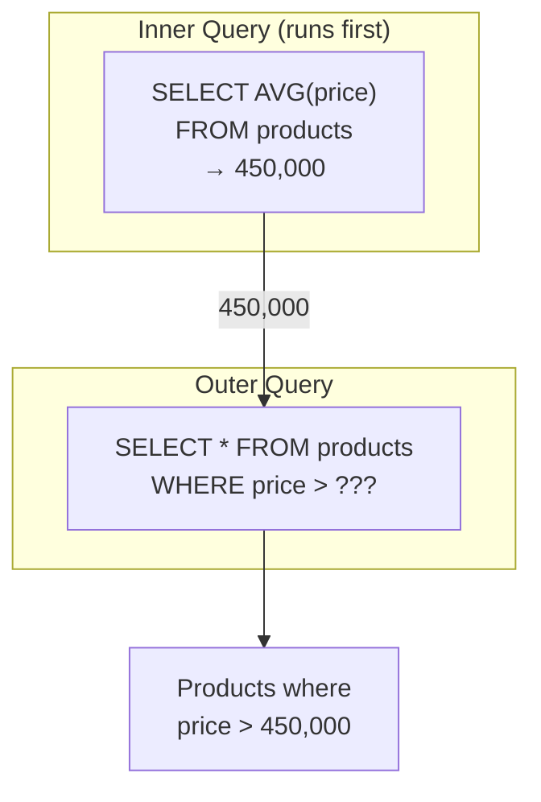

# Lesson 10: Subqueries

We learned how to connect tables with JOINs. Now we learn about subqueries -- queries nested inside other queries. You can use the result of one query as a condition in another, like finding "products more expensive than the average price".

!!! note "Already familiar?"
    If you're comfortable with scalar subqueries, inline views, and WHERE subqueries, skip ahead to [Lesson 11: Date/Time Functions](11-datetime.md).

A subquery is a `SELECT` statement nested inside another query. It can be used in `WHERE`, `FROM`, or `SELECT` clauses. Subqueries let you break down complex questions into small, readable steps.



> The inner query runs first, and its result is passed to the outer query.

## Scalar Subqueries in WHERE

A scalar subquery returns a single value (1 row, 1 column). It can be used anywhere a literal value would go.

```sql
-- Products more expensive than overall average price
SELECT name, price
FROM products
WHERE price > (SELECT AVG(price) FROM products WHERE is_active = 1)
  AND is_active = 1
ORDER BY price ASC;
```

**Result:**

| name | price |
| ---------- | ----------: |
| 기가바이트 B650M AORUS ELITE AX 실버 | 679000.0 |
| ASUS TUF GAMING B760M-PLUS | 681200.0 |
| 엡손 L15160 실버 | 686600.0 |
| HP Slim Desktop S01 블랙 | 689000.0 |
| AMD Ryzen 7 7700X | 691500.0 |
| ASUS ROG STRIX RX 7900 XTX 화이트 | 694200.0 |
| Adobe Acrobat Pro 1년 | 698000.0 |
| HP Z2 Mini G1a 블랙 | 698500.0 |
| ... | ... |

The inner query `(SELECT AVG(price) FROM products WHERE is_active = 1)` calculates the average once, then the outer query compares each product price against that value.

```sql
-- Customers who signed up before the first order
SELECT name, created_at
FROM customers
WHERE created_at < (SELECT MIN(ordered_at) FROM orders)
LIMIT 5;
```

## IN Subqueries

{ .off-glb width="280"  }

When a subquery can return multiple rows, use `IN` instead of `=`.

```sql
-- Customers who have left a 1-star review
SELECT name, email, grade
FROM customers
WHERE id IN (
    SELECT DISTINCT customer_id
    FROM reviews
    WHERE rating = 1
)
ORDER BY name;
```

**Result:**

| name | email | grade |
| ---------- | ---------- | ---------- |
| 강경수 | user36521@testmail.kr | GOLD |
| 강경숙 | user3645@testmail.kr | VIP |
| 강경숙 | user12913@testmail.kr | SILVER |
| 강경자 | user29357@testmail.kr | SILVER |
| 강경자 | user37003@testmail.kr | VIP |
| 강경희 | user16196@testmail.kr | SILVER |
| 강도윤 | user2334@testmail.kr | BRONZE |
| 강도윤 | user6680@testmail.kr | SILVER |
| ... | ... | ... |

```sql
-- Active products currently in shopping carts
SELECT name, price, stock_qty
FROM products
WHERE id IN (
    SELECT DISTINCT product_id
    FROM cart_items
)
  AND is_active = 1
ORDER BY name;
```

## NOT IN

{ .off-glb width="280"  }

`NOT IN` finds rows that are **not in** the subquery result -- similar to the `LEFT JOIN ... IS NULL` anti-join pattern.

```sql
-- Products that have never been ordered
SELECT name, price
FROM products
WHERE id NOT IN (
    SELECT DISTINCT product_id
    FROM order_items
)
  AND is_active = 1;
```

> **Warning:** If the subquery returns even one NULL value, `NOT IN` behaves unexpectedly (returning no rows at all). When NULLs may be present, use `NOT EXISTS` (Lesson 20) instead.

## FROM Subqueries (Derived Tables)

A subquery in the `FROM` clause creates a temporary inline table. This is called a **derived table** or **inline view**.

```sql
-- Average order amount by customer grade
SELECT
    grade,
    ROUND(AVG(avg_order), 2) AS avg_order_value
FROM (
    SELECT
        c.grade,
        o.customer_id,
        AVG(o.total_amount) AS avg_order
    FROM orders AS o
    INNER JOIN customers AS c ON o.customer_id = c.id
    WHERE o.status NOT IN ('cancelled', 'returned')
    GROUP BY c.grade, o.customer_id
) AS customer_avgs
GROUP BY grade
ORDER BY avg_order_value DESC;
```

**Result:**

| grade | avg_order_value |
| ---------- | ----------: |
| VIP | 1384755.9 |
| GOLD | 1193210.31 |
| SILVER | 855361.6 |
| BRONZE | 715847.1 |

=== "SQLite"
    ```sql
    -- Top 3 months by revenue with order count
    SELECT
        monthly.year_month,
        monthly.revenue,
        monthly.order_count
    FROM (
        SELECT
            SUBSTR(ordered_at, 1, 7) AS year_month,
            SUM(total_amount)        AS revenue,
            COUNT(*)                 AS order_count
        FROM orders
        WHERE status NOT IN ('cancelled', 'returned')
        GROUP BY SUBSTR(ordered_at, 1, 7)
    ) AS monthly
    ORDER BY revenue DESC
    LIMIT 3;
    ```

=== "MySQL"
    ```sql
    SELECT
        monthly.year_month,
        monthly.revenue,
        monthly.order_count
    FROM (
        SELECT
            DATE_FORMAT(ordered_at, '%Y-%m') AS year_month,
            SUM(total_amount)                AS revenue,
            COUNT(*)                         AS order_count
        FROM orders
        WHERE status NOT IN ('cancelled', 'returned')
        GROUP BY DATE_FORMAT(ordered_at, '%Y-%m')
    ) AS monthly
    ORDER BY revenue DESC
    LIMIT 3;
    ```

=== "PostgreSQL"
    ```sql
    SELECT
        monthly.year_month,
        monthly.revenue,
        monthly.order_count
    FROM (
        SELECT
            TO_CHAR(ordered_at, 'YYYY-MM') AS year_month,
            SUM(total_amount)              AS revenue,
            COUNT(*)                       AS order_count
        FROM orders
        WHERE status NOT IN ('cancelled', 'returned')
        GROUP BY TO_CHAR(ordered_at, 'YYYY-MM')
    ) AS monthly
    ORDER BY revenue DESC
    LIMIT 3;
    ```

**Result:**

| year_month | revenue | order_count |
|------------|--------:|------------:|
| 2024-12 | 1841293.70 | 892 |
| 2023-12 | 1624817.40 | 801 |
| 2024-11 | 1312944.90 | 703 |

## Scalar Subqueries in SELECT

A subquery in the `SELECT` list executes once for each output row.

```sql
-- Most recent order date for each customer
SELECT
    c.name,
    c.grade,
    (
        SELECT MAX(ordered_at)
        FROM orders
        WHERE customer_id = c.id
    ) AS last_order_date
FROM customers AS c
WHERE c.is_active = 1
ORDER BY last_order_date DESC
LIMIT 8;
```

**Result:**

| name | grade | last_order_date |
| ---------- | ---------- | ---------- |
| 송광수 | BRONZE | 2026-01-01 08:40:57 |
| 류미숙 | GOLD | 2025-12-31 23:28:51 |
| 김영미 | GOLD | 2025-12-31 23:26:03 |
| 이영미 | SILVER | 2025-12-31 23:17:28 |
| 조성수 | BRONZE | 2025-12-31 23:12:47 |
| 김지우 | VIP | 2025-12-31 23:09:05 |
| 이중수 | SILVER | 2025-12-31 23:00:56 |
| 곽민준 | BRONZE | 2025-12-31 22:41:19 |
| ... | ... | ... |

> Scalar subqueries in `SELECT` execute per row, so they can be slow on large tables. When performance matters, use `LEFT JOIN` with aggregation instead.

## Summary

| Concept | Description | Example |
|------|------|------|
| Scalar subquery | Subquery that returns a single value | `WHERE price > (SELECT AVG(price) ...)` |
| IN subquery | Subquery returning multiple values to check membership | `WHERE id IN (SELECT product_id ...)` |
| NOT IN | Find rows not in the subquery result (watch for NULLs) | `WHERE id NOT IN (SELECT ...)` |
| Derived table (FROM) | Create a temporary inline table in the FROM clause | `FROM (SELECT ... GROUP BY ...) AS sub` |
| SELECT scalar | Calculate a value per row in the SELECT list | `(SELECT MAX(ordered_at) ...) AS last_order` |
| Correlated subquery | Subquery that references a value from the outer query | `WHERE p2.category_id = p.category_id` |

!!! note "Lesson Review Problems"
    These are simple problems to immediately test the concepts from this lesson. For comprehensive practice combining multiple concepts, see the [Practice Problems](../exercises/index.md) section.

## Practice Problems
### Problem 1
Find orders that have never had a completed payment. Use a `NOT IN` subquery to exclude `order_id`s from the `payments` table where `status = 'completed'`. Return `order_number`, `total_amount`, `status`, sorted by `total_amount` descending, limited to 10 rows.

??? success "Answer"
    ```sql
    SELECT order_number, total_amount, status
    FROM orders
    WHERE id NOT IN (
        SELECT order_id
        FROM payments
        WHERE status = 'completed'
    )
    ORDER BY total_amount DESC
    LIMIT 10;
    ```

    **Result (example):**

| order_number | total_amount | status |
| ---------- | ----------: | ---------- |
| ORD-20251230-417476 | 60038800.0 | pending |
| ORD-20241013-332643 | 57772300.0 | returned |
| ORD-20191116-64149 | 43727700.0 | cancelled |
| ORD-20200726-92225 | 41273300.0 | return_requested |
| ORD-20190330-46537 | 38907900.0 | cancelled |
| ORD-20230320-245599 | 38678800.0 | return_requested |
| ORD-20200205-72088 | 37301800.0 | return_requested |
| ORD-20160622-03380 | 35300200.0 | returned |
| ... | ... | ... |


### Problem 2
Query orders with amounts greater than the overall average order amount. Return `order_number`, `total_amount`, sorted by `total_amount` descending, limited to 10 rows. Use a scalar subquery in the `WHERE` clause.

??? success "Answer"
    ```sql
    SELECT order_number, total_amount
    FROM orders
    WHERE total_amount > (
        SELECT AVG(total_amount) FROM orders
    )
    ORDER BY total_amount DESC
    LIMIT 10;
    ```

    **Result (example):**

| order_number | total_amount |
| ---------- | ----------: |
| ORD-20230408-248697 | 71906300.0 |
| ORD-20240218-293235 | 68948100.0 |
| ORD-20240822-323378 | 64332900.0 |
| ORD-20180516-26809 | 63466900.0 |
| ORD-20200429-82365 | 61889000.0 |
| ORD-20230626-259827 | 61811500.0 |
| ORD-20160730-03977 | 60810900.0 |
| ORD-20251230-417476 | 60038800.0 |
| ... | ... |


### Problem 3
Use a scalar subquery in the `SELECT` clause to find each product's name and its review count. Return `product_name`, `price`, `review_count`, sorted by `review_count` descending, limited to 10 rows. Only include active products.

??? success "Answer"
    ```sql
    SELECT
        p.name  AS product_name,
        p.price,
        (
            SELECT COUNT(*)
            FROM reviews AS r
            WHERE r.product_id = p.id
        ) AS review_count
    FROM products AS p
    WHERE p.is_active = 1
    ORDER BY review_count DESC
    LIMIT 10;
    ```

    **Result (example):**

| product_name | price | review_count |
| ---------- | ----------: | ----------: |
| 로지텍 G PRO X SUPERLIGHT 2 실버 | 49400.0 | 137 |
| Arctic Freezer i35 화이트 | 31800.0 | 121 |
| Keychron Q1 Pro 실버 | 178600.0 | 116 |
| SteelSeries Aerox 5 Wireless 실버 | 61500.0 | 114 |
| 로지텍 G502 X PLUS 화이트 | 91400.0 | 112 |
| Crucial T700 2TB 실버 | 37100.0 | 111 |
| SteelSeries Aerox 5 Wireless 실버 | 101400.0 | 106 |
| Arctic Freezer i35 블랙 | 44600.0 | 106 |
| ... | ... | ... |


### Problem 4
Find all products priced above the average price within their own category. Use a correlated scalar subquery in the `WHERE` clause that references the outer query's `category_id`. Return `product_name`, `price`, `category_id`.

??? success "Answer"
    ```sql
    SELECT
        p.name        AS product_name,
        p.price,
        p.category_id
    FROM products AS p
    WHERE p.price > (
        SELECT AVG(p2.price)
        FROM products AS p2
        WHERE p2.category_id = p.category_id
          AND p2.is_active = 1
    )
      AND p.is_active = 1
    ORDER BY p.category_id, p.price DESC;
    ```

    **Result (example):**

| product_name | price | category_id |
| ---------- | ----------: | ----------: |
| LG 데스크톱 B80GV 블랙 | 2887600.0 | 2 |
| 삼성 올인원 DM530ABE 화이트 | 2743700.0 | 2 |
| 레노버 ThinkStation P3 화이트 | 2685300.0 | 2 |
| 삼성 DM500TEA 블랙 | 2598300.0 | 2 |
| HP EliteDesk 800 G9 | 2469400.0 | 2 |
| 삼성 DM500TEA 블랙 | 2465800.0 | 2 |
| Dell Inspiron Desktop 실버 | 2361400.0 | 2 |
| 삼성 DM500TDA | 2332400.0 | 2 |
| ... | ... | ... |


### Problem 5
Find products that are in at least one customer's wishlist but have **never been ordered**. Use `IN` and `NOT IN` subqueries and return `product_name` and `price`.

??? success "Answer"
    ```sql
    SELECT name AS product_name, price
    FROM products
    WHERE id IN (
        SELECT DISTINCT product_id FROM wishlists
    )
      AND id NOT IN (
        SELECT DISTINCT product_id FROM order_items
    )
    ORDER BY price DESC;
    ```

    **Result (example):**

    | product_name                  | price  |
    | ----------------------------- | -----: |
    | 삼성 오디세이 OLED G8               | 693300 |
    | ASRock X870E Taichi 실버        | 583500 |
    | 보스 SoundLink Flex 블랙          | 516000 |
    | MSI MAG B860 TOMAHAWK WIFI    | 440900 |
    | be quiet! Dark Power 13 1000W | 359500 |
    | ...                           | ...    |


### Problem 6
Use a `FROM` subquery to first calculate the average product price per category, then join with the `categories` table in the outer query to return `category_name` and `avg_price`. Sort by `avg_price` descending.

??? success "Answer"
    ```sql
    SELECT
        cat.name       AS category_name,
        price_stats.avg_price
    FROM (
        SELECT
            category_id,
            ROUND(AVG(price), 2) AS avg_price
        FROM products
        WHERE is_active = 1
        GROUP BY category_id
    ) AS price_stats
    INNER JOIN categories AS cat ON price_stats.category_id = cat.id
    ORDER BY price_stats.avg_price DESC;
    ```

    **Result (example):**

| category_name | avg_price |
| ---------- | ----------: |
| 맥북 | 3292633.33 |
| 게이밍 노트북 | 2966560.61 |
| NVIDIA | 2429036.96 |
| 조립PC | 2210358.7 |
| 일반 노트북 | 1739673.49 |
| 2in1 | 1565324.44 |
| 완제품 | 1504925.68 |
| 전문가용 모니터 | 1328097.96 |
| ... | ... |


### Problem 7
`VIP'` grade customers. Use an `IN` subquery and return `product_name` and `price`. Sort by price descending.

??? success "Answer"
    ```sql
    SELECT p.name AS product_name, p.price
    FROM products AS p
    WHERE p.id IN (
        SELECT DISTINCT oi.product_id
        FROM order_items AS oi
        INNER JOIN orders AS o ON oi.order_id = o.id
        INNER JOIN customers AS c ON o.customer_id = c.id
        WHERE c.grade = 'VIP'
    )
    ORDER BY p.price DESC;
    ```

    **Result (example):**

| product_name | price |
| ---------- | ----------: |
| Razer Blade 14 블랙 | 7495200.0 |
| Razer Blade 16 블랙 | 5634900.0 |
| Razer Blade 16 | 5518300.0 |
| Razer Blade 16 화이트 | 5503500.0 |
| Razer Blade 18 | 5450500.0 |
| Razer Blade 14 | 5339100.0 |
| Razer Blade 16 실버 | 5127500.0 |
| Razer Blade 16 블랙 | 4938200.0 |
| ... | ... |


### Problem 8
Use a `FROM` subquery to find the top 10 customers by number of completed orders. Count orders per customer in the inner query, then join with the `customers` table in the outer query to add `name` and `grade`.

??? success "Answer"
    ```sql
    SELECT
        c.name,
        c.grade,
        order_stats.order_count,
        order_stats.total_spent
    FROM (
        SELECT
            customer_id,
            COUNT(*)            AS order_count,
            SUM(total_amount)   AS total_spent
        FROM orders
        WHERE status IN ('delivered', 'confirmed')
        GROUP BY customer_id
    ) AS order_stats
    INNER JOIN customers AS c ON order_stats.customer_id = c.id
    ORDER BY order_stats.order_count DESC
    LIMIT 10;
    ```

    **Result (example):**

| name | grade | order_count | total_spent |
| ---------- | ---------- | ----------: | ----------: |
| 박정수 | VIP | 650 | 649737670.0 |
| 문영숙 | VIP | 537 | 507339847.0 |
| 정유진 | VIP | 536 | 636671422.0 |
| 이미정 | VIP | 516 | 610700757.0 |
| 김상철 | VIP | 508 | 556233023.0 |
| 이영자 | VIP | 496 | 503242976.0 |
| 이미정 | VIP | 431 | 484724576.0 |
| 김병철 | VIP | 427 | 424564320.0 |
| ... | ... | ... | ... |


### Problem 9
Find customers whose order count exceeds the overall average order count per customer. Use a `FROM` subquery to first get the order count per customer, then use a scalar subquery in the `WHERE` clause to compare against the average. Return `customer_id` and `order_count`, sorted by `order_count` descending, limited to 10 rows.

??? success "Answer"
    ```sql
    SELECT
        customer_id,
        order_count
    FROM (
        SELECT
            customer_id,
            COUNT(*) AS order_count
        FROM orders
        GROUP BY customer_id
    ) AS cust_orders
    WHERE order_count > (
        SELECT AVG(cnt)
        FROM (
            SELECT COUNT(*) AS cnt
            FROM orders
            GROUP BY customer_id
        ) AS avg_calc
    )
    ORDER BY order_count DESC
    LIMIT 10;
    ```

    **Result (example):**

| customer_id | order_count |
| ----------: | ----------: |
| 226 | 713 |
| 840 | 589 |
| 356 | 585 |
| 1000 | 559 |
| 98 | 551 |
| 903 | 550 |
| 97 | 471 |
| 549 | 467 |
| ... | ... |


### Problem 10
Find the names, emails, and last order dates of the 5 most recently ordering customers. Use a `FROM` subquery to first get the latest order date (`last_order`) per customer, then join with the `customers` table in the outer query. Sort by `last_order` descending.

??? success "Answer"
    ```sql
    SELECT
        c.name,
        c.email,
        recent.last_order
    FROM (
        SELECT
            customer_id,
            MAX(ordered_at) AS last_order
        FROM orders
        GROUP BY customer_id
    ) AS recent
    INNER JOIN customers AS c ON recent.customer_id = c.id
    ORDER BY recent.last_order DESC
    LIMIT 5;
    ```


### Scoring Guide

| Score | Next Step |
|:----:|----------|
| **9-10** | Move on to [Lesson 11: Date/Time Functions](11-datetime.md) |
| **7-8** | Review the explanations for incorrect answers, then proceed |
| **Half or fewer** | Re-read this lesson |
| **3 or fewer** | Start again from [Lesson 9: LEFT JOIN](09-left-join.md) |

**Problem Areas:**

| Area | Problems |
|------|:--------:|
| NOT IN subquery | 1 |
| WHERE scalar subquery | 2 |
| SELECT scalar subquery | 3 |
| Correlated subquery | 4 |
| IN + NOT IN combination | 5 |
| FROM subquery (derived table) | 6, 8, 10 |
| IN subquery + JOIN | 7 |
| Nested subquery | 9 |

---
Next: [Lesson 11: Date/Time Functions](11-datetime.md)
