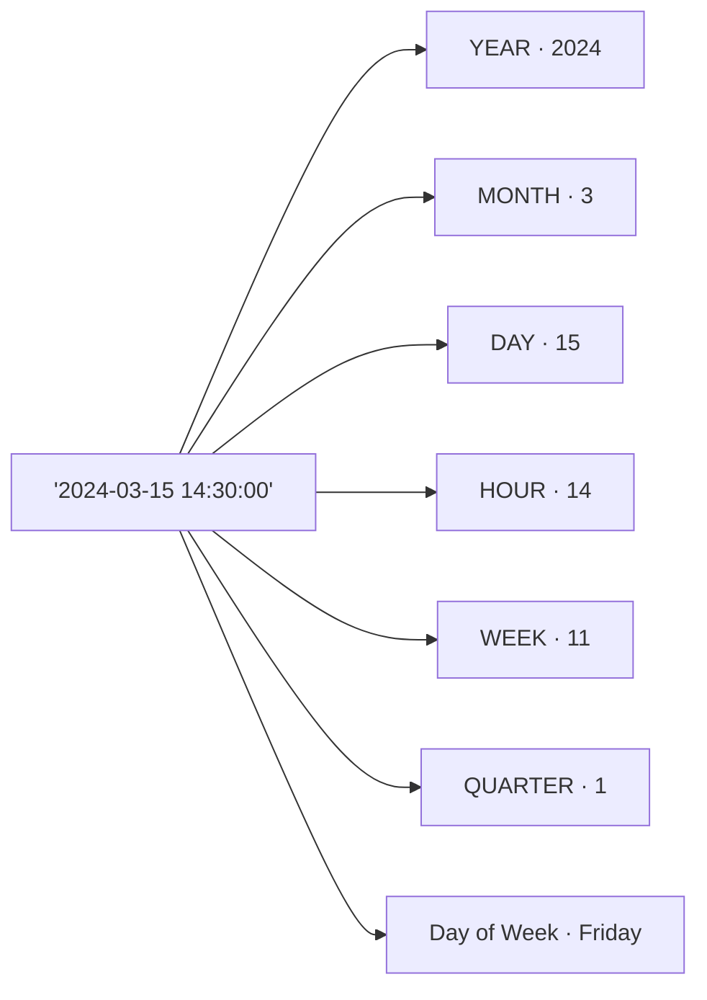

# Lesson 11: Date and Time Functions

In [Lesson 10](10-subqueries.md), we learned about subqueries. In practice, questions like "this month's revenue" or "how many days from signup to first order?" come up frequently. Date/time functions let you extract, calculate, and reformat dates.

!!! note "Already familiar?"
    If you're comfortable with date extraction, date arithmetic, format conversion, and cross-DB differences, skip ahead to [Lesson 12: String Functions](12-string.md).

Date/time functions are one of the areas where syntax differs most between databases. This lesson uses SQLite as the default, with MySQL and PostgreSQL differences shown in tabs.

SQLite stores dates as text in `YYYY-MM-DD` or `YYYY-MM-DD HH:MM:SS` format. Built-in functions let you extract parts of a date, calculate differences between dates, or convert formats for reports.



> You can extract the year, month, day, hour, week number, quarter, day of week, and other parts from a single date/time value.

## Extracting Year/Month with SUBSTR

Since SQLite dates are strings, you can use `SUBSTR` to quickly and easily extract the year or month.

```sql
-- Order count by year
SELECT
    SUBSTR(ordered_at, 1, 4) AS year,
    COUNT(*)                 AS order_count,
    SUM(total_amount)        AS annual_revenue
FROM orders
WHERE status NOT IN ('cancelled', 'returned')
GROUP BY SUBSTR(ordered_at, 1, 4)
ORDER BY year;
```

**Result:**

| year | order_count | annual_revenue |
| ---------- | ----------: | ----------: |
| 2016 | 7002 | 7186536080.0 |
| 2017 | 10710 | 11188959996.0 |
| 2018 | 19356 | 20309091899.0 |
| 2019 | 26981 | 28328279035.0 |
| 2020 | 43749 | 45447183212.0 |
| 2021 | 56519 | 58065333224.0 |
| 2022 | 55414 | 57233324746.0 |
| 2023 | 47910 | 49710423204.0 |
| ... | ... | ... |

```sql
-- Monthly revenue for 2024
SELECT
    SUBSTR(ordered_at, 1, 7) AS year_month,
    COUNT(*)                 AS orders,
    SUM(total_amount)        AS revenue
FROM orders
WHERE ordered_at LIKE '2024%'
  AND status NOT IN ('cancelled', 'returned')
GROUP BY SUBSTR(ordered_at, 1, 7)
ORDER BY year_month;
```

**Result:**

| year_month | orders | revenue |
| ---------- | ----------: | ----------: |
| 2024-01 | 3857 | 3807789761.0 |
| 2024-02 | 4530 | 4701108852.0 |
| 2024-03 | 4903 | 4935663129.0 |
| 2024-04 | 4932 | 4954492231.0 |
| 2024-05 | 5001 | 4912114419.0 |
| 2024-06 | 3719 | 3853868900.0 |
| 2024-07 | 4454 | 4453107092.0 |
| 2024-08 | 4827 | 4903583071.0 |
| ... | ... | ... |

## DATE() and strftime()

`DATE(expression, modifier, ...)` returns a date string. `strftime(format, expression)` formats it in any desired format.

=== "SQLite"
    ```sql
    -- Today's date
    SELECT DATE('now') AS today;
    ```

=== "MySQL"
    ```sql
    -- Today's date
    SELECT CURDATE() AS today;
    ```

=== "PostgreSQL"
    ```sql
    -- Today's date
    SELECT CURRENT_DATE AS today;
    ```

---

=== "SQLite"
    ```sql
    -- Last 30 days orders
    SELECT order_number, ordered_at, total_amount
    FROM orders
    WHERE ordered_at >= DATE('now', '-30 days')
    ORDER BY ordered_at DESC
    LIMIT 5;
    ```

=== "MySQL"
    ```sql
    -- Last 30 days orders
    SELECT order_number, ordered_at, total_amount
    FROM orders
    WHERE ordered_at >= DATE_SUB(CURDATE(), INTERVAL 30 DAY)
    ORDER BY ordered_at DESC
    LIMIT 5;
    ```

=== "PostgreSQL"
    ```sql
    -- Last 30 days orders
    SELECT order_number, ordered_at, total_amount
    FROM orders
    WHERE ordered_at >= CURRENT_DATE - INTERVAL '30 days'
    ORDER BY ordered_at DESC
    LIMIT 5;
    ```

---

=== "SQLite"
    ```sql
    -- Day of week analysis (0=Sunday, 6=Saturday)
    SELECT
        CASE CAST(strftime('%w', ordered_at) AS INTEGER)
            WHEN 0 THEN '일요일'
            WHEN 1 THEN '월요일'
            WHEN 2 THEN '화요일'
            WHEN 3 THEN '수요일'
            WHEN 4 THEN '목요일'
            WHEN 5 THEN '금요일'
            WHEN 6 THEN '토요일'
        END AS day_of_week,
        COUNT(*) AS order_count
    FROM orders
    GROUP BY strftime('%w', ordered_at)
    ORDER BY CAST(strftime('%w', ordered_at) AS INTEGER);
    ```

=== "MySQL"
    ```sql
    -- Day of week analysis (1=Sunday, 7=Saturday)
    SELECT
        CASE DAYOFWEEK(ordered_at)
            WHEN 1 THEN '일요일'
            WHEN 2 THEN '월요일'
            WHEN 3 THEN '화요일'
            WHEN 4 THEN '수요일'
            WHEN 5 THEN '목요일'
            WHEN 6 THEN '금요일'
            WHEN 7 THEN '토요일'
        END AS day_of_week,
        COUNT(*) AS order_count
    FROM orders
    GROUP BY DAYOFWEEK(ordered_at)
    ORDER BY DAYOFWEEK(ordered_at);
    ```

=== "PostgreSQL"
    ```sql
    -- Day of week analysis (0=Sunday, 6=Saturday)
    SELECT
        CASE EXTRACT(DOW FROM ordered_at::date)
            WHEN 0 THEN '일요일'
            WHEN 1 THEN '월요일'
            WHEN 2 THEN '화요일'
            WHEN 3 THEN '수요일'
            WHEN 4 THEN '목요일'
            WHEN 5 THEN '금요일'
            WHEN 6 THEN '토요일'
        END AS day_of_week,
        COUNT(*) AS order_count
    FROM orders
    GROUP BY EXTRACT(DOW FROM ordered_at::date)
    ORDER BY EXTRACT(DOW FROM ordered_at::date);
    ```

**Result:**

| day_of_week | order_count |
|-------------|------------:|
| 일요일 | 4823 |
| 월요일 | 5012 |
| 화요일 | 4991 |
| 수요일 | 5134 |
| 목요일 | 5089 |
| 금요일 | 5247 |
| 토요일 | 4393 |

## Time Extraction -- HOUR, MINUTE

Not only dates but **time** information is useful for analysis. "Order concentration by hour" is commonly used for determining operating hours, predicting server traffic, etc.

=== "SQLite"
    ```sql
    -- Order count by hour
    SELECT
        CAST(strftime('%H', ordered_at) AS INTEGER) AS hour,
        COUNT(*) AS order_count
    FROM orders
    WHERE ordered_at LIKE '2024%'
    GROUP BY strftime('%H', ordered_at)
    ORDER BY hour;
    ```

=== "MySQL"
    ```sql
    -- Order count by hour
    SELECT
        HOUR(ordered_at) AS hour,
        COUNT(*) AS order_count
    FROM orders
    WHERE ordered_at >= '2024-01-01'
      AND ordered_at <  '2025-01-01'
    GROUP BY HOUR(ordered_at)
    ORDER BY hour;
    ```

=== "PostgreSQL"
    ```sql
    -- Order count by hour
    SELECT
        EXTRACT(HOUR FROM ordered_at)::int AS hour,
        COUNT(*) AS order_count
    FROM orders
    WHERE ordered_at >= '2024-01-01'
      AND ordered_at <  '2025-01-01'
    GROUP BY EXTRACT(HOUR FROM ordered_at)
    ORDER BY hour;
    ```

**Result (example):**

| hour | order_count |
| ---: | ----------: |
|    0 |         237 |
|    1 |         198 |
|    2 |         189 |
| ...  | ...         |
|   10 |         302 |
|   11 |         315 |
| ...  | ...         |

> SQLite uses `strftime('%H')` (returns string), MySQL uses `HOUR()`, PostgreSQL uses `EXTRACT(HOUR FROM ...)`. Minutes follow the same pattern: `%M` / `MINUTE()` / `EXTRACT(MINUTE)`.

## Date Addition -- Calculating Future Dates

Earlier we used `DATE('now', '-30 days')` to get a past date. Conversely, you can calculate **future dates** too. Common examples include "expected delivery date", "coupon expiration date", "subscription renewal date".

=== "SQLite"
    ```sql
    -- 7 days after order date = expected delivery
    SELECT
        order_number,
        ordered_at,
        DATE(ordered_at, '+7 days') AS expected_delivery
    FROM orders
    WHERE ordered_at LIKE '2024-12%'
    ORDER BY ordered_at DESC
    LIMIT 5;
    ```

    SQLite modifier examples: `'+1 month'`, `'+1 year'`, `'-3 hours'`, `'start of month'`

=== "MySQL"
    ```sql
    -- 7 days after order date = expected delivery
    SELECT
        order_number,
        ordered_at,
        DATE_ADD(ordered_at, INTERVAL 7 DAY) AS expected_delivery
    FROM orders
    WHERE ordered_at >= '2024-12-01'
      AND ordered_at <  '2025-01-01'
    ORDER BY ordered_at DESC
    LIMIT 5;
    ```

    In MySQL, use `DATE_ADD(date, INTERVAL n UNIT)` or `date + INTERVAL n UNIT`.

=== "PostgreSQL"
    ```sql
    -- 7 days after order date = expected delivery
    SELECT
        order_number,
        ordered_at,
        ordered_at::date + INTERVAL '7 days' AS expected_delivery
    FROM orders
    WHERE ordered_at >= '2024-12-01'
      AND ordered_at <  '2025-01-01'
    ORDER BY ordered_at DESC
    LIMIT 5;
    ```

    PostgreSQL uses the `+ INTERVAL 'value'` syntax. Flexible expressions like `'1 month'`, `'2 hours'` are supported.

**Result (example):**

| order_number       | ordered_at          | expected_delivery |
| ------------------ | ------------------- | ----------------- |
| ORD-20241231-32070 | 2024-12-31 22:45:12 | 2025-01-07        |
| ORD-20241231-32068 | 2024-12-31 18:03:44 | 2025-01-07        |
| ...                | ...                 | ...               |

## Date Truncation -- Finding Month/Year Start

Used when reports need the start of a period, like "first day of this month" or "first day of this year".

=== "SQLite"
    ```sql
    -- First day of month, first day of year
    SELECT
        DATE('now', 'start of month')  AS first_of_month,
        DATE('now', 'start of year')   AS first_of_year;
    ```

    ```sql
    -- First and last order date per month
    SELECT
        SUBSTR(ordered_at, 1, 7) AS month,
        MIN(DATE(ordered_at))    AS first_order,
        MAX(DATE(ordered_at))    AS last_order
    FROM orders
    WHERE ordered_at LIKE '2024%'
    GROUP BY SUBSTR(ordered_at, 1, 7)
    ORDER BY month;
    ```

=== "MySQL"
    ```sql
    -- First day of month, first day of year
    SELECT
        DATE_FORMAT(CURDATE(), '%Y-%m-01')     AS first_of_month,
        DATE_FORMAT(CURDATE(), '%Y-01-01')     AS first_of_year;

    -- Or use LAST_DAY() to get month end
    SELECT LAST_DAY(CURDATE()) AS last_of_month;
    ```

=== "PostgreSQL"
    ```sql
    -- First day of month, first day of year
    SELECT
        DATE_TRUNC('month', CURRENT_DATE) AS first_of_month,
        DATE_TRUNC('year',  CURRENT_DATE) AS first_of_year;
    ```

    PostgreSQL's `DATE_TRUNC` is the most intuitive. It supports various units like `'week'`, `'quarter'`, `'hour'`.

## Date Format Conversion

You can output the same date in different formats. Useful when you need a report format like "March 15, 2024" or a filename format like "20240315".

=== "SQLite"
    ```sql
    SELECT
        ordered_at,
        strftime('%Y년 %m월 %d일', ordered_at)       AS korean_format,
        strftime('%Y%m%d', ordered_at)               AS compact_format,
        strftime('%d/%m/%Y', ordered_at)              AS eu_format
    FROM orders
    LIMIT 3;
    ```

    | Code | Meaning | Example |
    |------|------|------|
    | `%Y` | 4-digit year | 2024 |
    | `%m` | 2-digit month | 03 |
    | `%d` | 2-digit day | 15 |
    | `%H` | 24-hour | 14 |
    | `%M` | Minute | 30 |
    | `%S` | Second | 00 |
    | `%w` | Day of week (0=Sun) | 5 |
    | `%W` | Week number (00-53) | 11 |
    | `%j` | Day of year (001-366) | 075 |

=== "MySQL"
    ```sql
    SELECT
        ordered_at,
        DATE_FORMAT(ordered_at, '%Y년 %m월 %d일')  AS korean_format,
        DATE_FORMAT(ordered_at, '%Y%m%d')          AS compact_format,
        DATE_FORMAT(ordered_at, '%d/%m/%Y')         AS eu_format
    FROM orders
    LIMIT 3;
    ```

=== "PostgreSQL"
    ```sql
    SELECT
        ordered_at,
        TO_CHAR(ordered_at, 'YYYY"년" MM"월" DD"일"')  AS korean_format,
        TO_CHAR(ordered_at, 'YYYYMMDD')                AS compact_format,
        TO_CHAR(ordered_at, 'DD/MM/YYYY')               AS eu_format
    FROM orders
    LIMIT 3;
    ```

**Result (example):**

| ordered_at          | korean_format  | compact_format | eu_format  |
| ------------------- | -------------- | -------------- | ---------- |
| 2024-03-15 14:30:00 | 2024년 03월 15일 | 20240315       | 15/03/2024 |

## julianday() -- Calculating Date Differences

`julianday()` converts a date to a floating-point Julian Day Number. Subtracting two values gives the difference in days.

=== "SQLite"
    ```sql
    -- How many days between order and delivery?
    SELECT
        o.order_number,
        o.ordered_at,
        s.delivered_at,
        ROUND(julianday(s.delivered_at) - julianday(o.ordered_at), 1) AS delivery_days
    FROM orders AS o
    INNER JOIN shipping AS s ON s.order_id = o.id
    WHERE s.delivered_at IS NOT NULL
    ORDER BY delivery_days DESC
    LIMIT 8;
    ```

=== "MySQL"
    ```sql
    -- How many days between order and delivery?
    SELECT
        o.order_number,
        o.ordered_at,
        s.delivered_at,
        DATEDIFF(s.delivered_at, o.ordered_at) AS delivery_days
    FROM orders AS o
    INNER JOIN shipping AS s ON s.order_id = o.id
    WHERE s.delivered_at IS NOT NULL
    ORDER BY delivery_days DESC
    LIMIT 8;
    ```

=== "PostgreSQL"
    ```sql
    -- How many days between order and delivery?
    SELECT
        o.order_number,
        o.ordered_at,
        s.delivered_at,
        s.delivered_at::date - o.ordered_at::date AS delivery_days
    FROM orders AS o
    INNER JOIN shipping AS s ON s.order_id = o.id
    WHERE s.delivered_at IS NOT NULL
    ORDER BY delivery_days DESC
    LIMIT 8;
    ```

**Result:**

| order_number | ordered_at | delivered_at | delivery_days |
|--------------|------------|--------------|--------------:|
| ORD-20190822-03421 | 2019-08-22 | 2019-09-08 | 17.0 |
| ORD-20201103-04812 | 2020-11-03 | 2020-11-18 | 15.0 |
| ... | | | |

=== "SQLite"
    ```sql
    -- Average delivery days per carrier
    SELECT
        s.carrier,
        COUNT(*)  AS deliveries,
        ROUND(AVG(julianday(s.delivered_at) - julianday(o.ordered_at)), 1) AS avg_days
    FROM shipping AS s
    INNER JOIN orders AS o ON s.order_id = o.id
    WHERE s.delivered_at IS NOT NULL
    GROUP BY s.carrier
    ORDER BY avg_days;
    ```

=== "MySQL"
    ```sql
    -- Average delivery days per carrier
    SELECT
        s.carrier,
        COUNT(*)  AS deliveries,
        ROUND(AVG(DATEDIFF(s.delivered_at, o.ordered_at)), 1) AS avg_days
    FROM shipping AS s
    INNER JOIN orders AS o ON s.order_id = o.id
    WHERE s.delivered_at IS NOT NULL
    GROUP BY s.carrier
    ORDER BY avg_days;
    ```

=== "PostgreSQL"
    ```sql
    -- Average delivery days per carrier
    SELECT
        s.carrier,
        COUNT(*)  AS deliveries,
        ROUND(AVG(s.delivered_at::date - o.ordered_at::date), 1) AS avg_days
    FROM shipping AS s
    INNER JOIN orders AS o ON s.order_id = o.id
    WHERE s.delivered_at IS NOT NULL
    GROUP BY s.carrier
    ORDER BY avg_days;
    ```

**Result:**

| carrier | deliveries | avg_days |
|---------|-----------:|---------:|
| CJ대한통운 | 8341 | 2.8 |
| 한진택배 | 7892 | 3.1 |
| 우체국택배 | 9214 | 4.2 |
| 롯데택배 | 7495 | 3.6 |

## Calculating Customer Age

=== "SQLite"
    ```sql
    -- Customer age from birth_date
    SELECT
        name,
        birth_date,
        CAST(
            (julianday('now') - julianday(birth_date)) / 365.25
        AS INTEGER) AS age
    FROM customers
    WHERE birth_date IS NOT NULL
    ORDER BY age DESC
    LIMIT 8;
    ```

=== "MySQL"
    ```sql
    -- Customer age from birth_date
    SELECT
        name,
        birth_date,
        TIMESTAMPDIFF(YEAR, birth_date, CURDATE()) AS age
    FROM customers
    WHERE birth_date IS NOT NULL
    ORDER BY age DESC
    LIMIT 8;
    ```

=== "PostgreSQL"
    ```sql
    -- Customer age from birth_date
    SELECT
        name,
        birth_date,
        EXTRACT(YEAR FROM AGE(CURRENT_DATE, birth_date))::int AS age
    FROM customers
    WHERE birth_date IS NOT NULL
    ORDER BY age DESC
    LIMIT 8;
    ```

**Result:**

| name | birth_date | age |
|------|------------|----:|
| 김복순 | 1951-02-18 | 73 |
| 이순례 | 1952-08-30 | 72 |
| ... | | |

## Extracting Week Number and Quarter

### Week Number

Week numbers are needed when creating "this week's revenue" or "weekly reports".

=== "SQLite"
    ```sql
    -- Order count by week for 2024
    SELECT
        strftime('%W', ordered_at) AS week_number,
        COUNT(*)                   AS order_count
    FROM orders
    WHERE ordered_at LIKE '2024%'
    GROUP BY strftime('%W', ordered_at)
    ORDER BY week_number
    LIMIT 10;
    ```

    > `%W` is the week number (00-53, Monday-based), `%w` is the day of week (0-6). Be careful not to confuse them.

=== "MySQL"
    ```sql
    -- Order count by week for 2024
    SELECT
        WEEK(ordered_at, 1) AS week_number,
        COUNT(*)            AS order_count
    FROM orders
    WHERE YEAR(ordered_at) = 2024
    GROUP BY WEEK(ordered_at, 1)
    ORDER BY week_number
    LIMIT 10;
    ```

    > The second argument `1` in `WEEK(date, 1)` means Monday-start. If omitted, it defaults to Sunday-start.

=== "PostgreSQL"
    ```sql
    -- Order count by week for 2024
    SELECT
        EXTRACT(WEEK FROM ordered_at::date)::int AS week_number,
        COUNT(*)                                  AS order_count
    FROM orders
    WHERE EXTRACT(YEAR FROM ordered_at::date) = 2024
    GROUP BY EXTRACT(WEEK FROM ordered_at::date)
    ORDER BY week_number
    LIMIT 10;
    ```

    > PostgreSQL's `EXTRACT(WEEK)` returns the ISO 8601 week number (Monday-start, 1-53).

**Result (example):**

| week_number | order_count |
| ----------: | ----------: |
|           1 |          79 |
|           2 |          78 |
|           3 |          85 |
|           4 |          82 |
|           5 |          92 |
| ...         | ...         |

### Quarter

=== "SQLite"
    ```sql
    -- Quarterly revenue
    SELECT
        SUBSTR(ordered_at, 1, 4) AS year,
        CASE
            WHEN CAST(SUBSTR(ordered_at, 6, 2) AS INTEGER) BETWEEN 1 AND 3  THEN 'Q1'
            WHEN CAST(SUBSTR(ordered_at, 6, 2) AS INTEGER) BETWEEN 4 AND 6  THEN 'Q2'
            WHEN CAST(SUBSTR(ordered_at, 6, 2) AS INTEGER) BETWEEN 7 AND 9  THEN 'Q3'
            ELSE 'Q4'
        END AS quarter,
        SUM(total_amount) AS revenue
    FROM orders
    WHERE status NOT IN ('cancelled', 'returned')
      AND ordered_at LIKE '2024%'
    GROUP BY year, quarter
    ORDER BY year, quarter;
    ```

=== "MySQL"
    ```sql
    -- Quarterly revenue
    SELECT
        YEAR(ordered_at) AS year,
        CONCAT('Q', QUARTER(ordered_at)) AS quarter,
        SUM(total_amount) AS revenue
    FROM orders
    WHERE status NOT IN ('cancelled', 'returned')
      AND YEAR(ordered_at) = 2024
    GROUP BY YEAR(ordered_at), QUARTER(ordered_at)
    ORDER BY year, quarter;
    ```

=== "PostgreSQL"
    ```sql
    -- Quarterly revenue
    SELECT
        EXTRACT(YEAR FROM ordered_at::date)::int AS year,
        'Q' || EXTRACT(QUARTER FROM ordered_at::date)::int AS quarter,
        SUM(total_amount) AS revenue
    FROM orders
    WHERE status NOT IN ('cancelled', 'returned')
      AND EXTRACT(YEAR FROM ordered_at::date) = 2024
    GROUP BY
        EXTRACT(YEAR FROM ordered_at::date),
        EXTRACT(QUARTER FROM ordered_at::date)
    ORDER BY year, quarter;
    ```

**Result:**

| year | quarter | revenue |
|-----:|---------|--------:|
| 2024 | Q1 | 488246.20 |
| 2024 | Q2 | 523891.40 |
| 2024 | Q3 | 612347.80 |
| 2024 | Q4 | 1218807.10 |

## Using the calendar Table

The TechShop database includes a pre-built `calendar` table. It contains date, day of week, weekend flag, and holiday information, making it very useful for date analysis.

```sql
-- Check calendar table structure
SELECT * FROM calendar WHERE year = 2024 LIMIT 5;
```

| date_key   | year | month | day | day_name | day_of_week | is_weekend | is_holiday | holiday_name |
| ---------- | ---: | ----: | --: | -------- | ----------: | ---------: | ---------: | ------------ |
| 2024-01-01 | 2024 |     1 |   1 | Monday   |           1 |          0 |          1 | 신정           |
| 2024-01-02 | 2024 |     1 |   2 | Tuesday  |           2 |          0 |          0 | (NULL)       |
| ...        | ...  | ...   | ... | ...      | ...         | ...        | ...        | ...          |

### Finding Days with No Orders

By using LEFT JOIN with the calendar as the base, you can check for days without any orders.

```sql
SELECT
    c.date_key,
    c.day_name,
    c.is_weekend,
    c.is_holiday,
    c.holiday_name
FROM calendar AS c
LEFT JOIN orders AS o ON DATE(o.ordered_at) = c.date_key
WHERE o.id IS NULL
  AND c.year = 2024
ORDER BY c.date_key;
```

### Holiday vs Weekday Revenue Comparison

```sql
SELECT
    CASE WHEN c.is_holiday = 1 THEN '공휴일'
         WHEN c.is_weekend = 1 THEN '주말'
         ELSE '평일'
    END AS day_type,
    COUNT(o.id)                  AS order_count,
    ROUND(AVG(o.total_amount), 2) AS avg_order_amount
FROM orders AS o
INNER JOIN calendar AS c ON DATE(o.ordered_at) = c.date_key
WHERE o.ordered_at LIKE '2024%'
  AND o.status NOT IN ('cancelled', 'returned')
GROUP BY day_type
ORDER BY avg_order_amount DESC;
```

> In environments without a `calendar` table, you can generate a date series with CTEs to implement the same pattern. This technique is covered in the CROSS JOIN section of Lesson 17.

## Summary

| Concept | Description | Example |
|------|------|------|
| SUBSTR date extraction | Extract year/month via string slicing | `SUBSTR(ordered_at, 1, 7)` |
| DATE() | Returns date string, calculates with modifiers | `DATE('now', '-30 days')` |
| strftime() | Format to desired output | `strftime('%w', ordered_at)` |
| Time extraction | Extract hour/minute/second | `strftime('%H')` / `HOUR()` / `EXTRACT(HOUR)` |
| Date addition | Calculate future dates | `DATE(col, '+7 days')` / `DATE_ADD` / `+ INTERVAL` |
| Date truncation | Find month/year start | `DATE('now','start of month')` / `DATE_TRUNC` |
| Date format conversion | Various output formats | `strftime('%Y년 %m월')` / `DATE_FORMAT` / `TO_CHAR` |
| julianday() | Convert to Julian day, calculate differences | `julianday(a) - julianday(b)` |
| Week/Quarter | Weekly/quarterly reports | `strftime('%W')` / `WEEK()` / `QUARTER()` |
| calendar table | Holiday/weekend analysis | `LEFT JOIN calendar ON DATE(col) = date_key` |
| MySQL date functions | CURDATE, DATEDIFF, TIMESTAMPDIFF, etc. | `DATEDIFF(a, b)` |
| PostgreSQL date functions | EXTRACT, AGE, DATE_TRUNC, date arithmetic | `EXTRACT(YEAR FROM col)` |

!!! note "Lesson Review Problems"
    These are simple problems to immediately test the concepts from this lesson. For comprehensive practice combining multiple concepts, see the [Practice Problems](../exercises/index.md) section.

## Practice Problems
### Problem 1
Query `order_number`, `ordered_at`, `total_amount` for orders placed in March 2024. Use date range filtering and sort by order date ascending.

??? success "Answer"
    ```sql
    SELECT order_number, ordered_at, total_amount
    FROM orders
    WHERE ordered_at >= '2024-03-01'
      AND ordered_at <  '2024-04-01'
    ORDER BY ordered_at ASC;
    ```

    **Result (example):**

| order_number | ordered_at | total_amount |
| ---------- | ---------- | ----------: |
| ORD-20240222-294018 | 2024-03-01 01:35:38 | 5893600.0 |
| ORD-20240301-295276 | 2024-03-01 02:08:55 | 1148400.0 |
| ORD-20240301-295273 | 2024-03-01 02:31:31 | 339300.0 |
| ORD-20240301-295418 | 2024-03-01 03:48:18 | 1819200.0 |
| ORD-20240301-295416 | 2024-03-01 04:30:32 | 248000.0 |
| ORD-20240301-295374 | 2024-03-01 04:38:17 | 159800.0 |
| ORD-20240301-295257 | 2024-03-01 05:00:14 | 114400.0 |
| ORD-20240301-295369 | 2024-03-01 05:40:17 | 1396628.0 |
| ... | ... | ... |


### Problem 2
Calculate employee tenure in years. Return `name`, `hired_at`, `years_worked`, including only active employees. Sort by years worked descending.

??? success "Answer"
    === "SQLite"
        ```sql
        SELECT
            name,
            hired_at,
            CAST(
                (julianday('now') - julianday(hired_at)) / 365.25
            AS INTEGER) AS years_worked
        FROM staff
        WHERE is_active = 1
        ORDER BY years_worked DESC;
        ```

        **Result (example):**

| name | hired_at | years_worked |
| ---------- | ---------- | ----------: |
| 강주원 | 2016-02-26 | 10 |
| 김지혜 | 2016-02-23 | 10 |
| 한민재 | 2016-05-23 | 9 |
| 박도윤 | 2016-07-19 | 9 |
| 정우진 | 2016-11-23 | 9 |
| 장주원 | 2017-08-20 | 8 |
| 황예준 | 2017-10-15 | 8 |
| 김옥자 | 2017-06-11 | 8 |
| ... | ... | ... |


    === "MySQL"
        ```sql
        SELECT
            name,
            hired_at,
            TIMESTAMPDIFF(YEAR, hired_at, CURDATE()) AS years_worked
        FROM staff
        WHERE is_active = 1
        ORDER BY years_worked DESC;
        ```

    === "PostgreSQL"
        ```sql
        SELECT
            name,
            hired_at,
            EXTRACT(YEAR FROM AGE(CURRENT_DATE, hired_at))::int AS years_worked
        FROM staff
        WHERE is_active = 1
        ORDER BY years_worked DESC;
        ```


### Problem 3
Calculate customer age and return `name`, `birth_date`, `age`. Exclude customers where `birth_date` is NULL. Sort by age descending, limited to 10 rows.

??? success "Answer"
    === "SQLite"
        ```sql
        SELECT
            name,
            birth_date,
            CAST(
                (julianday('now') - julianday(birth_date)) / 365.25
            AS INTEGER) AS age
        FROM customers
        WHERE birth_date IS NOT NULL
        ORDER BY age DESC
        LIMIT 10;
        ```

        **Result (example):**

| name | birth_date | age |
| ---------- | ---------- | ----------: |
| 강성민 | 1960-04-02 | 66 |
| 박은영 | 1960-04-09 | 66 |
| 김순자 | 1960-02-04 | 66 |
| 황병철 | 1960-03-10 | 66 |
| 김은주 | 1960-01-01 | 66 |
| 김수진 | 1960-02-21 | 66 |
| 이예원 | 1960-02-25 | 66 |
| 홍우진 | 1960-01-05 | 66 |
| ... | ... | ... |


    === "MySQL"
        ```sql
        SELECT
            name,
            birth_date,
            TIMESTAMPDIFF(YEAR, birth_date, CURDATE()) AS age
        FROM customers
        WHERE birth_date IS NOT NULL
        ORDER BY age DESC
        LIMIT 10;
        ```

    === "PostgreSQL"
        ```sql
        SELECT
            name,
            birth_date,
            EXTRACT(YEAR FROM AGE(CURRENT_DATE, birth_date))::int AS age
        FROM customers
        WHERE birth_date IS NOT NULL
        ORDER BY age DESC
        LIMIT 10;
        ```


### Problem 4
Calculate the day difference between customer signup (`created_at`) and last login (`last_login_at`). Include only active customers where both dates exist. Return `name`, `created_at`, `last_login_at`, `active_days`, sorted by `active_days` descending, limited to 10 rows.

??? success "Answer"
    === "SQLite"
        ```sql
        SELECT
            name,
            created_at,
            last_login_at,
            CAST(julianday(last_login_at) - julianday(created_at) AS INTEGER) AS active_days
        FROM customers
        WHERE is_active = 1
          AND last_login_at IS NOT NULL
        ORDER BY active_days DESC
        LIMIT 10;
        ```

        **Result (example):**

| name | created_at | last_login_at | active_days |
| ---------- | ---------- | ---------- | ----------: |
| 강은서 | 2016-01-14 06:39:08 | 2025-12-30 16:32:45 | 3638 |
| 유현지 | 2016-01-05 22:02:29 | 2025-12-14 23:18:42 | 3631 |
| 우서영 | 2016-01-08 23:13:13 | 2025-12-17 15:41:20 | 3630 |
| 김민수 | 2016-01-10 03:13:04 | 2025-12-06 20:49:40 | 3618 |
| 이명자 | 2016-01-31 06:55:50 | 2025-12-24 17:07:32 | 3615 |
| 김명숙 | 2016-01-22 12:09:51 | 2025-12-15 13:45:53 | 3615 |
| 한은영 | 2016-01-19 04:02:06 | 2025-12-12 17:48:30 | 3615 |
| 최채원 | 2016-01-10 18:32:09 | 2025-11-28 14:01:21 | 3609 |
| ... | ... | ... | ... |


    === "MySQL"
        ```sql
        SELECT
            name,
            created_at,
            last_login_at,
            DATEDIFF(last_login_at, created_at) AS active_days
        FROM customers
        WHERE is_active = 1
          AND last_login_at IS NOT NULL
        ORDER BY active_days DESC
        LIMIT 10;
        ```

    === "PostgreSQL"
        ```sql
        SELECT
            name,
            created_at,
            last_login_at,
            last_login_at::date - created_at::date AS active_days
        FROM customers
        WHERE is_active = 1
          AND last_login_at IS NOT NULL
        ORDER BY active_days DESC
        LIMIT 10;
        ```


### Problem 5
Find the number of new customers per year since the store opened. Return `year` and `new_customers`, sorted by year ascending.

??? success "Answer"
    ```sql
    SELECT
        SUBSTR(created_at, 1, 4) AS year,
        COUNT(*)                 AS new_customers
    FROM customers
    GROUP BY SUBSTR(created_at, 1, 4)
    ORDER BY year;
    ```

    **Result (example):**

| year | new_customers |
| ---------- | ----------: |
| 2016 | 1000 |
| 2017 | 1800 |
| 2018 | 3000 |
| 2019 | 4500 |
| 2020 | 7000 |
| 2021 | 8000 |
| 2022 | 6500 |
| 2023 | 6000 |
| ... | ... |


### Problem 6
Extract year and month from orders and return `order_year`, `order_month`, `order_count`. Target only 2023 orders, sorted by month ascending.

??? success "Answer"
    === "SQLite"
        ```sql
        SELECT
            SUBSTR(ordered_at, 1, 4) AS order_year,
            SUBSTR(ordered_at, 6, 2) AS order_month,
            COUNT(*) AS order_count
        FROM orders
        WHERE ordered_at LIKE '2023%'
        GROUP BY SUBSTR(ordered_at, 1, 4), SUBSTR(ordered_at, 6, 2)
        ORDER BY order_month ASC;
        ```

        **Result (example):**

| order_year | order_month | order_count |
| ---------- | ---------- | ----------: |
| 2023 | 01 | 3397 |
| 2023 | 02 | 3978 |
| 2023 | 03 | 4986 |
| 2023 | 04 | 5069 |
| 2023 | 05 | 4379 |
| 2023 | 06 | 3490 |
| 2023 | 07 | 3516 |
| 2023 | 08 | 4306 |
| ... | ... | ... |


    === "MySQL"
        ```sql
        SELECT
            YEAR(ordered_at)  AS order_year,
            MONTH(ordered_at) AS order_month,
            COUNT(*) AS order_count
        FROM orders
        WHERE YEAR(ordered_at) = 2023
        GROUP BY YEAR(ordered_at), MONTH(ordered_at)
        ORDER BY order_month ASC;
        ```

    === "PostgreSQL"
        ```sql
        SELECT
            EXTRACT(YEAR FROM ordered_at::date)::int  AS order_year,
            EXTRACT(MONTH FROM ordered_at::date)::int AS order_month,
            COUNT(*) AS order_count
        FROM orders
        WHERE EXTRACT(YEAR FROM ordered_at::date) = 2023
        GROUP BY
            EXTRACT(YEAR FROM ordered_at::date),
            EXTRACT(MONTH FROM ordered_at::date)
        ORDER BY order_month ASC;
        ```


### Problem 7
Aggregate review count and average rating by month when reviews were written. Target only 2024 reviews, return `review_month`, `review_count`, `avg_rating` (2 decimal places), sorted by month ascending.

??? success "Answer"
    === "SQLite"
        ```sql
        SELECT
            SUBSTR(created_at, 6, 2) AS review_month,
            COUNT(*)                 AS review_count,
            ROUND(AVG(rating), 2)    AS avg_rating
        FROM reviews
        WHERE created_at LIKE '2024%'
        GROUP BY SUBSTR(created_at, 6, 2)
        ORDER BY review_month ASC;
        ```

        **Result (example):**

| review_month | review_count | avg_rating |
| ---------- | ----------: | ----------: |
| 01 | 1082 | 3.87 |
| 02 | 966 | 3.99 |
| 03 | 1201 | 3.89 |
| 04 | 1119 | 3.89 |
| 05 | 1331 | 3.9 |
| 06 | 1077 | 3.91 |
| 07 | 1013 | 3.93 |
| 08 | 1116 | 3.88 |
| ... | ... | ... |


    === "MySQL"
        ```sql
        SELECT
            MONTH(created_at)     AS review_month,
            COUNT(*)              AS review_count,
            ROUND(AVG(rating), 2) AS avg_rating
        FROM reviews
        WHERE YEAR(created_at) = 2024
        GROUP BY MONTH(created_at)
        ORDER BY review_month ASC;
        ```

    === "PostgreSQL"
        ```sql
        SELECT
            EXTRACT(MONTH FROM created_at::date)::int AS review_month,
            COUNT(*)              AS review_count,
            ROUND(AVG(rating), 2) AS avg_rating
        FROM reviews
        WHERE EXTRACT(YEAR FROM created_at::date) = 2024
        GROUP BY EXTRACT(MONTH FROM created_at::date)
        ORDER BY review_month ASC;
        ```


### Problem 8
Find delivered orders (where `delivered_at` IS NOT NULL) with delivery time of 7 or more days. Return `order_number`, `ordered_at`, `delivered_at`, `delivery_days`, sorted by delivery days descending, limited to 10 rows.

??? success "Answer"
    === "SQLite"
        ```sql
        SELECT
            o.order_number,
            o.ordered_at,
            s.delivered_at,
            ROUND(julianday(s.delivered_at) - julianday(o.ordered_at), 1) AS delivery_days
        FROM orders AS o
        INNER JOIN shipping AS s ON s.order_id = o.id
        WHERE s.delivered_at IS NOT NULL
          AND julianday(s.delivered_at) - julianday(o.ordered_at) >= 7
        ORDER BY delivery_days DESC
        LIMIT 10;
        ```

        **Result (example):**

| order_number | ordered_at | delivered_at | delivery_days |
| ---------- | ---------- | ---------- | ----------: |
| ORD-20160101-00016 | 2016-01-12 14:59:26 | 2016-01-19 14:59:26 | 7.0 |
| ORD-20160101-00020 | 2016-01-23 11:32:43 | 2016-01-30 11:32:43 | 7.0 |
| ORD-20160102-00025 | 2016-01-07 00:15:21 | 2016-01-14 00:15:21 | 7.0 |
| ORD-20160102-00038 | 2016-01-14 16:04:37 | 2016-01-21 16:04:37 | 7.0 |
| ORD-20160103-00062 | 2016-01-26 14:13:30 | 2016-02-02 14:13:30 | 7.0 |
| ORD-20160104-00082 | 2016-01-11 18:08:34 | 2016-01-18 18:08:34 | 7.0 |
| ORD-20160104-00086 | 2016-01-04 00:07:19 | 2016-01-11 00:07:19 | 7.0 |
| ORD-20160105-00093 | 2016-01-05 21:15:21 | 2016-01-12 21:15:21 | 7.0 |
| ... | ... | ... | ... |


    === "MySQL"
        ```sql
        SELECT
            o.order_number,
            o.ordered_at,
            s.delivered_at,
            DATEDIFF(s.delivered_at, o.ordered_at) AS delivery_days
        FROM orders AS o
        INNER JOIN shipping AS s ON s.order_id = o.id
        WHERE s.delivered_at IS NOT NULL
          AND DATEDIFF(s.delivered_at, o.ordered_at) >= 7
        ORDER BY delivery_days DESC
        LIMIT 10;
        ```

    === "PostgreSQL"
        ```sql
        SELECT
            o.order_number,
            o.ordered_at,
            s.delivered_at,
            s.delivered_at::date - o.ordered_at::date AS delivery_days
        FROM orders AS o
        INNER JOIN shipping AS s ON s.order_id = o.id
        WHERE s.delivered_at IS NOT NULL
          AND s.delivered_at::date - o.ordered_at::date >= 7
        ORDER BY delivery_days DESC
        LIMIT 10;
        ```


### Problem 9
Find the day of the week with the highest average order amount. Use `strftime('%w', ordered_at)` (0=Sunday) and convert numbers to day names with a `CASE` expression. Return `day_of_week`, `order_count`, `avg_order_value`.

??? success "Answer"
    === "SQLite"
        ```sql
        SELECT
            CASE CAST(strftime('%w', ordered_at) AS INTEGER)
                WHEN 0 THEN '일요일'
                WHEN 1 THEN '월요일'
                WHEN 2 THEN '화요일'
                WHEN 3 THEN '수요일'
                WHEN 4 THEN '목요일'
                WHEN 5 THEN '금요일'
                WHEN 6 THEN '토요일'
            END AS day_of_week,
            COUNT(*)              AS order_count,
            ROUND(AVG(total_amount), 2) AS avg_order_value
        FROM orders
        WHERE status NOT IN ('cancelled', 'returned')
        GROUP BY strftime('%w', ordered_at)
        ORDER BY avg_order_value DESC;
        ```

        **Result (example):**

| day_of_week | order_count | avg_order_value |
| ---------- | ----------: | ----------: |
| 월요일 | 61644 | 1049358.94 |
| 수요일 | 50438 | 1048967.18 |
| 일요일 | 61682 | 1030741.41 |
| 목요일 | 50044 | 1029688.17 |
| 화요일 | 53009 | 1027912.41 |
| 금요일 | 52740 | 1027294.98 |
| 토요일 | 61157 | 1026936.16 |
| ... | ... | ... |


    === "MySQL"
        ```sql
        SELECT
            CASE DAYOFWEEK(ordered_at)
                WHEN 1 THEN '일요일'
                WHEN 2 THEN '월요일'
                WHEN 3 THEN '화요일'
                WHEN 4 THEN '수요일'
                WHEN 5 THEN '목요일'
                WHEN 6 THEN '금요일'
                WHEN 7 THEN '토요일'
            END AS day_of_week,
            COUNT(*)              AS order_count,
            ROUND(AVG(total_amount), 2) AS avg_order_value
        FROM orders
        WHERE status NOT IN ('cancelled', 'returned')
        GROUP BY DAYOFWEEK(ordered_at)
        ORDER BY avg_order_value DESC;
        ```

    === "PostgreSQL"
        ```sql
        SELECT
            CASE EXTRACT(DOW FROM ordered_at::date)
                WHEN 0 THEN '일요일'
                WHEN 1 THEN '월요일'
                WHEN 2 THEN '화요일'
                WHEN 3 THEN '수요일'
                WHEN 4 THEN '목요일'
                WHEN 5 THEN '금요일'
                WHEN 6 THEN '토요일'
            END AS day_of_week,
            COUNT(*)              AS order_count,
            ROUND(AVG(total_amount), 2) AS avg_order_value
        FROM orders
        WHERE status NOT IN ('cancelled', 'returned')
        GROUP BY EXTRACT(DOW FROM ordered_at::date)
        ORDER BY avg_order_value DESC;
        ```


### Problem 10
Calculate the average processing days from `ordered_at` to `shipped_at` (shipping table) per carrier. Include only rows where both dates exist. Return `carrier`, `shipment_count`, `avg_processing_days`, sorted by `avg_processing_days` ascending.

??? success "Answer"
    === "SQLite"
        ```sql
        SELECT
            s.carrier,
            COUNT(*) AS shipment_count,
            ROUND(
                AVG(julianday(s.shipped_at) - julianday(o.ordered_at)),
                1
            ) AS avg_processing_days
        FROM shipping AS s
        INNER JOIN orders AS o ON s.order_id = o.id
        WHERE s.shipped_at IS NOT NULL
        GROUP BY s.carrier
        ORDER BY avg_processing_days ASC;
        ```

        **Result (example):**

| carrier | shipment_count | avg_processing_days |
| ---------- | ----------: | ----------: |
| CJ대한통운 | 158331 | 2.0 |
| 로젠택배 | 79078 | 2.0 |
| 우체국택배 | 59378 | 2.0 |
| 한진택배 | 98972 | 2.0 |


    === "MySQL"
        ```sql
        SELECT
            s.carrier,
            COUNT(*) AS shipment_count,
            ROUND(
                AVG(DATEDIFF(s.shipped_at, o.ordered_at)),
                1
            ) AS avg_processing_days
        FROM shipping AS s
        INNER JOIN orders AS o ON s.order_id = o.id
        WHERE s.shipped_at IS NOT NULL
        GROUP BY s.carrier
        ORDER BY avg_processing_days ASC;
        ```

    === "PostgreSQL"
        ```sql
        SELECT
            s.carrier,
            COUNT(*) AS shipment_count,
            ROUND(
                AVG(s.shipped_at::date - o.ordered_at::date),
                1
            ) AS avg_processing_days
        FROM shipping AS s
        INNER JOIN orders AS o ON s.order_id = o.id
        WHERE s.shipped_at IS NOT NULL
        GROUP BY s.carrier
        ORDER BY avg_processing_days ASC;
        ```


### Problem 11
Find the order count and average order amount by hour (0-23) for 2024. Return `hour`, `order_count`, `avg_amount` (no decimals), sorted by order count descending.

??? success "Answer"
    === "SQLite"
        ```sql
        SELECT
            CAST(strftime('%H', ordered_at) AS INTEGER) AS hour,
            COUNT(*)                  AS order_count,
            ROUND(AVG(total_amount))  AS avg_amount
        FROM orders
        WHERE ordered_at LIKE '2024%'
        GROUP BY strftime('%H', ordered_at)
        ORDER BY order_count DESC;
        ```

    === "MySQL"
        ```sql
        SELECT
            HOUR(ordered_at)          AS hour,
            COUNT(*)                  AS order_count,
            ROUND(AVG(total_amount))  AS avg_amount
        FROM orders
        WHERE ordered_at >= '2024-01-01'
          AND ordered_at <  '2025-01-01'
        GROUP BY HOUR(ordered_at)
        ORDER BY order_count DESC;
        ```

    === "PostgreSQL"
        ```sql
        SELECT
            EXTRACT(HOUR FROM ordered_at)::int AS hour,
            COUNT(*)                  AS order_count,
            ROUND(AVG(total_amount))  AS avg_amount
        FROM orders
        WHERE ordered_at >= '2024-01-01'
          AND ordered_at <  '2025-01-01'
        GROUP BY EXTRACT(HOUR FROM ordered_at)
        ORDER BY order_count DESC;
        ```


### Problem 12
For each order, calculate 14 days after the order date as the "exchange/refund deadline" (`refund_deadline`). Target only December 2024 orders. Return `order_number`, `ordered_at`, `refund_deadline`, sorted by order date descending, limited to 5 rows.

??? success "Answer"
    === "SQLite"
        ```sql
        SELECT
            order_number,
            ordered_at,
            DATE(ordered_at, '+14 days') AS refund_deadline
        FROM orders
        WHERE ordered_at >= '2024-12-01'
          AND ordered_at <  '2025-01-01'
        ORDER BY ordered_at DESC
        LIMIT 5;
        ```

    === "MySQL"
        ```sql
        SELECT
            order_number,
            ordered_at,
            DATE_ADD(ordered_at, INTERVAL 14 DAY) AS refund_deadline
        FROM orders
        WHERE ordered_at >= '2024-12-01'
          AND ordered_at <  '2025-01-01'
        ORDER BY ordered_at DESC
        LIMIT 5;
        ```

    === "PostgreSQL"
        ```sql
        SELECT
            order_number,
            ordered_at,
            ordered_at::date + INTERVAL '14 days' AS refund_deadline
        FROM orders
        WHERE ordered_at >= '2024-12-01'
          AND ordered_at <  '2025-01-01'
        ORDER BY ordered_at DESC
        LIMIT 5;
        ```


### Problem 13
Find monthly revenue for 2024, displaying the first day of the month (`month_start`) using `start of month`. Return `month_start`, `order_count`, `revenue`, sorted by month ascending.

??? success "Answer"
    === "SQLite"
        ```sql
        SELECT
            DATE(ordered_at, 'start of month') AS month_start,
            COUNT(*)                           AS order_count,
            SUM(total_amount)                  AS revenue
        FROM orders
        WHERE ordered_at LIKE '2024%'
          AND status NOT IN ('cancelled', 'returned')
        GROUP BY DATE(ordered_at, 'start of month')
        ORDER BY month_start;
        ```

    === "MySQL"
        ```sql
        SELECT
            DATE_FORMAT(ordered_at, '%Y-%m-01') AS month_start,
            COUNT(*)                            AS order_count,
            SUM(total_amount)                   AS revenue
        FROM orders
        WHERE YEAR(ordered_at) = 2024
          AND status NOT IN ('cancelled', 'returned')
        GROUP BY DATE_FORMAT(ordered_at, '%Y-%m-01')
        ORDER BY month_start;
        ```

    === "PostgreSQL"
        ```sql
        SELECT
            DATE_TRUNC('month', ordered_at)::date AS month_start,
            COUNT(*)                               AS order_count,
            SUM(total_amount)                      AS revenue
        FROM orders
        WHERE EXTRACT(YEAR FROM ordered_at::date) = 2024
          AND status NOT IN ('cancelled', 'returned')
        GROUP BY DATE_TRUNC('month', ordered_at)
        ORDER BY month_start;
        ```


### Problem 14
Convert the order date to `'2024년 03월 15일'` format and return `order_number` and `korean_date`. Target only December 2024 orders, showing the latest 5 records.

??? success "Answer"
    === "SQLite"
        ```sql
        SELECT
            order_number,
            strftime('%Y년 %m월 %d일', ordered_at) AS korean_date
        FROM orders
        WHERE ordered_at >= '2024-12-01'
          AND ordered_at <  '2025-01-01'
        ORDER BY ordered_at DESC
        LIMIT 5;
        ```

    === "MySQL"
        ```sql
        SELECT
            order_number,
            DATE_FORMAT(ordered_at, '%Y년 %m월 %d일') AS korean_date
        FROM orders
        WHERE ordered_at >= '2024-12-01'
          AND ordered_at <  '2025-01-01'
        ORDER BY ordered_at DESC
        LIMIT 5;
        ```

    === "PostgreSQL"
        ```sql
        SELECT
            order_number,
            TO_CHAR(ordered_at, 'YYYY"년" MM"월" DD"일"') AS korean_date
        FROM orders
        WHERE ordered_at >= '2024-12-01'
          AND ordered_at <  '2025-01-01'
        ORDER BY ordered_at DESC
        LIMIT 5;
        ```


### Problem 15
Find order count and revenue by week number for 2024. Return `week_number`, `order_count`, `revenue`, sorted by week number ascending. Exclude cancelled/returned orders.

??? success "Answer"
    === "SQLite"
        ```sql
        SELECT
            CAST(strftime('%W', ordered_at) AS INTEGER) AS week_number,
            COUNT(*)          AS order_count,
            SUM(total_amount) AS revenue
        FROM orders
        WHERE ordered_at LIKE '2024%'
          AND status NOT IN ('cancelled', 'returned')
        GROUP BY strftime('%W', ordered_at)
        ORDER BY week_number;
        ```

    === "MySQL"
        ```sql
        SELECT
            WEEK(ordered_at, 1) AS week_number,
            COUNT(*)            AS order_count,
            SUM(total_amount)   AS revenue
        FROM orders
        WHERE YEAR(ordered_at) = 2024
          AND status NOT IN ('cancelled', 'returned')
        GROUP BY WEEK(ordered_at, 1)
        ORDER BY week_number;
        ```

    === "PostgreSQL"
        ```sql
        SELECT
            EXTRACT(WEEK FROM ordered_at::date)::int AS week_number,
            COUNT(*)            AS order_count,
            SUM(total_amount)   AS revenue
        FROM orders
        WHERE EXTRACT(YEAR FROM ordered_at::date) = 2024
          AND status NOT IN ('cancelled', 'returned')
        GROUP BY EXTRACT(WEEK FROM ordered_at::date)
        ORDER BY week_number;
        ```


### Problem 16
Use the `calendar` table to compare order count and average order amount by holiday, weekend, and weekday for 2024. Return `day_type` ('holiday', 'weekend', 'weekday'), `order_count`, `avg_amount` (no decimals), sorted by `avg_amount` descending.

??? success "Answer"
    ```sql
    SELECT
        CASE WHEN c.is_holiday = 1 THEN '공휴일'
             WHEN c.is_weekend = 1 THEN '주말'
             ELSE '평일'
        END AS day_type,
        COUNT(o.id)                  AS order_count,
        ROUND(AVG(o.total_amount))   AS avg_amount
    FROM orders AS o
    INNER JOIN calendar AS c ON DATE(o.ordered_at) = c.date_key
    WHERE o.ordered_at LIKE '2024%'
      AND o.status NOT IN ('cancelled', 'returned')
    GROUP BY day_type
    ORDER BY avg_amount DESC;
    ```


### Scoring Guide

| Score | Next Step |
|:----:|----------|
| **14-16** | Move on to [Lesson 12: String Functions](12-string.md) |
| **10-13** | Review the explanations for incorrect answers, then proceed |
| **Half or fewer** | Re-read this lesson |
| **4 or fewer** | Start again from [Lesson 10: Subqueries](10-subqueries.md) |

**Problem Areas:**

| Area | Problems |
|------|:--------:|
| Date range filtering | 1 |
| julianday() date difference | 2, 3, 4 |
| SUBSTR year/month extraction + GROUP BY | 5, 6 |
| Date extraction + aggregation (AVG/ROUND) | 7 |
| julianday() + JOIN | 8, 10 |
| strftime + CASE day of week conversion | 9 |
| Time extraction (HOUR) | 11 |
| Date addition (future dates) | 12 |
| Date truncation (start of month) | 13 |
| Date format conversion | 14 |
| Week extraction (WEEK) | 15 |
| calendar table usage | 16 |

---
Next: [Lesson 12: String Functions](12-string.md)
