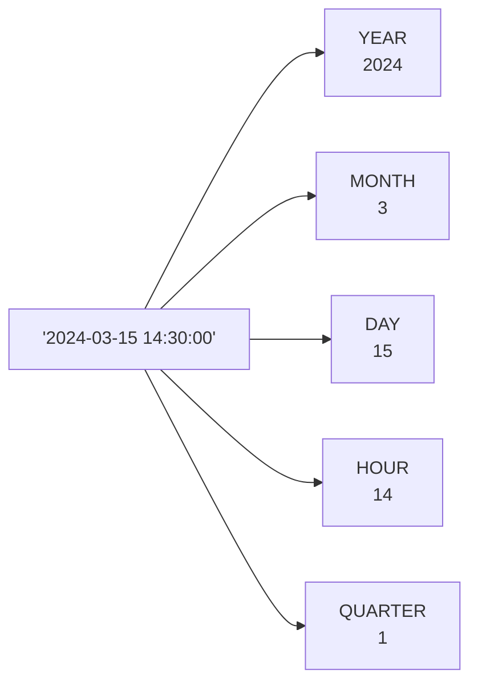

# Lesson 11: Date and Time Functions

Date/time functions are one of the areas where SQL syntax differs the most across databases. This lesson uses SQLite as the default but shows MySQL and PostgreSQL alternatives in tabs where the syntax diverges.

SQLite stores dates as text in `YYYY-MM-DD` or `YYYY-MM-DD HH:MM:SS` format. A set of built-in functions lets you extract parts, calculate differences, and format dates for reporting.



> You can extract specific parts from a datetime value.

## Extracting Year and Month with SUBSTR

Since SQLite dates are text strings, `SUBSTR` is a simple and fast way to extract year or month.

```sql
-- Count orders per year
SELECT
    SUBSTR(ordered_at, 1, 4) AS year,
    COUNT(*)                 AS order_count,
    SUM(total_amount)        AS annual_revenue
FROM orders
WHERE status NOT IN ('cancelled', 'returned')
GROUP BY SUBSTR(ordered_at, 1, 4)
ORDER BY year;
```

**Result:**

| year | order_count | annual_revenue |
|-----:|------------:|---------------:|
| 2015 | 412 | 184329.50 |
| 2016 | 589 | 271948.20 |
| 2017 | 843 | 412837.60 |
| ... | | |

```sql
-- Monthly revenue for 2024
SELECT
    SUBSTR(ordered_at, 1, 7) AS year_month,
    COUNT(*)                 AS orders,
    SUM(total_amount)        AS revenue
FROM orders
WHERE ordered_at LIKE '2024%'
  AND status NOT IN ('cancelled', 'returned')
GROUP BY SUBSTR(ordered_at, 1, 7)
ORDER BY year_month;
```

**Result:**

| year_month | orders | revenue |
|------------|-------:|--------:|
| 2024-01 | 270 | 147832.40 |
| 2024-02 | 251 | 136290.10 |
| 2024-03 | 347 | 204123.70 |
| ... | | |

## DATE() and strftime()

`DATE(expression, modifier, ...)` returns a date string. `strftime(format, expression)` formats it however you like.

=== "SQLite"
    ```sql
    -- Today's date
    SELECT DATE('now') AS today;
    ```

=== "MySQL"
    ```sql
    -- Today's date
    SELECT CURDATE() AS today;
    ```

=== "PostgreSQL"
    ```sql
    -- Today's date
    SELECT CURRENT_DATE AS today;
    ```

---

=== "SQLite"
    ```sql
    -- Orders placed in the last 30 days
    SELECT order_number, ordered_at, total_amount
    FROM orders
    WHERE ordered_at >= DATE('now', '-30 days')
    ORDER BY ordered_at DESC
    LIMIT 5;
    ```

=== "MySQL"
    ```sql
    -- Orders placed in the last 30 days
    SELECT order_number, ordered_at, total_amount
    FROM orders
    WHERE ordered_at >= DATE_SUB(CURDATE(), INTERVAL 30 DAY)
    ORDER BY ordered_at DESC
    LIMIT 5;
    ```

=== "PostgreSQL"
    ```sql
    -- Orders placed in the last 30 days
    SELECT order_number, ordered_at, total_amount
    FROM orders
    WHERE ordered_at >= CURRENT_DATE - INTERVAL '30 days'
    ORDER BY ordered_at DESC
    LIMIT 5;
    ```

---

=== "SQLite"
    ```sql
    -- Day of week analysis (0=Sunday, 6=Saturday)
    SELECT
        CASE CAST(strftime('%w', ordered_at) AS INTEGER)
            WHEN 0 THEN 'Sunday'
            WHEN 1 THEN 'Monday'
            WHEN 2 THEN 'Tuesday'
            WHEN 3 THEN 'Wednesday'
            WHEN 4 THEN 'Thursday'
            WHEN 5 THEN 'Friday'
            WHEN 6 THEN 'Saturday'
        END AS day_of_week,
        COUNT(*) AS order_count
    FROM orders
    GROUP BY strftime('%w', ordered_at)
    ORDER BY CAST(strftime('%w', ordered_at) AS INTEGER);
    ```

=== "MySQL"
    ```sql
    -- Day of week analysis (1=Sunday, 7=Saturday)
    SELECT
        CASE DAYOFWEEK(ordered_at)
            WHEN 1 THEN 'Sunday'
            WHEN 2 THEN 'Monday'
            WHEN 3 THEN 'Tuesday'
            WHEN 4 THEN 'Wednesday'
            WHEN 5 THEN 'Thursday'
            WHEN 6 THEN 'Friday'
            WHEN 7 THEN 'Saturday'
        END AS day_of_week,
        COUNT(*) AS order_count
    FROM orders
    GROUP BY DAYOFWEEK(ordered_at)
    ORDER BY DAYOFWEEK(ordered_at);
    ```

=== "PostgreSQL"
    ```sql
    -- Day of week analysis (0=Sunday, 6=Saturday)
    SELECT
        CASE EXTRACT(DOW FROM ordered_at::date)
            WHEN 0 THEN 'Sunday'
            WHEN 1 THEN 'Monday'
            WHEN 2 THEN 'Tuesday'
            WHEN 3 THEN 'Wednesday'
            WHEN 4 THEN 'Thursday'
            WHEN 5 THEN 'Friday'
            WHEN 6 THEN 'Saturday'
        END AS day_of_week,
        COUNT(*) AS order_count
    FROM orders
    GROUP BY EXTRACT(DOW FROM ordered_at::date)
    ORDER BY EXTRACT(DOW FROM ordered_at::date);
    ```

**Result:**

| day_of_week | order_count |
|-------------|------------:|
| Sunday | 4823 |
| Monday | 5012 |
| Tuesday | 4991 |
| Wednesday | 5134 |
| Thursday | 5089 |
| Friday | 5247 |
| Saturday | 4393 |

## julianday() — Calculating Differences

`julianday()` converts a date to a floating-point Julian Day Number. Subtracting two Julian Day values gives the difference in days.

=== "SQLite"
    ```sql
    -- How many days between order placed and delivery?
    SELECT
        o.order_number,
        o.ordered_at,
        s.delivered_at,
        ROUND(julianday(s.delivered_at) - julianday(o.ordered_at), 1) AS delivery_days
    FROM orders AS o
    INNER JOIN shipping AS s ON s.order_id = o.id
    WHERE s.delivered_at IS NOT NULL
    ORDER BY delivery_days DESC
    LIMIT 8;
    ```

=== "MySQL"
    ```sql
    -- How many days between order placed and delivery?
    SELECT
        o.order_number,
        o.ordered_at,
        s.delivered_at,
        DATEDIFF(s.delivered_at, o.ordered_at) AS delivery_days
    FROM orders AS o
    INNER JOIN shipping AS s ON s.order_id = o.id
    WHERE s.delivered_at IS NOT NULL
    ORDER BY delivery_days DESC
    LIMIT 8;
    ```

=== "PostgreSQL"
    ```sql
    -- How many days between order placed and delivery?
    SELECT
        o.order_number,
        o.ordered_at,
        s.delivered_at,
        s.delivered_at::date - o.ordered_at::date AS delivery_days
    FROM orders AS o
    INNER JOIN shipping AS s ON s.order_id = o.id
    WHERE s.delivered_at IS NOT NULL
    ORDER BY delivery_days DESC
    LIMIT 8;
    ```

**Result:**

| order_number | ordered_at | delivered_at | delivery_days |
|--------------|------------|--------------|--------------:|
| ORD-20190822-03421 | 2019-08-22 | 2019-09-08 | 17.0 |
| ORD-20201103-04812 | 2020-11-03 | 2020-11-18 | 15.0 |
| ... | | | |

=== "SQLite"
    ```sql
    -- Average delivery time by carrier
    SELECT
        s.carrier,
        COUNT(*)  AS deliveries,
        ROUND(AVG(julianday(s.delivered_at) - julianday(o.ordered_at)), 1) AS avg_days
    FROM shipping AS s
    INNER JOIN orders AS o ON s.order_id = o.id
    WHERE s.delivered_at IS NOT NULL
    GROUP BY s.carrier
    ORDER BY avg_days;
    ```

=== "MySQL"
    ```sql
    -- Average delivery time by carrier
    SELECT
        s.carrier,
        COUNT(*)  AS deliveries,
        ROUND(AVG(DATEDIFF(s.delivered_at, o.ordered_at)), 1) AS avg_days
    FROM shipping AS s
    INNER JOIN orders AS o ON s.order_id = o.id
    WHERE s.delivered_at IS NOT NULL
    GROUP BY s.carrier
    ORDER BY avg_days;
    ```

=== "PostgreSQL"
    ```sql
    -- Average delivery time by carrier
    SELECT
        s.carrier,
        COUNT(*)  AS deliveries,
        ROUND(AVG(s.delivered_at::date - o.ordered_at::date), 1) AS avg_days
    FROM shipping AS s
    INNER JOIN orders AS o ON s.order_id = o.id
    WHERE s.delivered_at IS NOT NULL
    GROUP BY s.carrier
    ORDER BY avg_days;
    ```

**Result:**

| carrier | deliveries | avg_days |
|---------|-----------:|---------:|
| FedEx | 8341 | 2.8 |
| UPS | 7892 | 3.1 |
| USPS | 9214 | 4.2 |
| DHL | 7495 | 3.6 |

## Customer Age Calculation

=== "SQLite"
    ```sql
    -- Customer ages based on birth_date
    SELECT
        name,
        birth_date,
        CAST(
            (julianday('now') - julianday(birth_date)) / 365.25
        AS INTEGER) AS age
    FROM customers
    WHERE birth_date IS NOT NULL
    ORDER BY age DESC
    LIMIT 8;
    ```

=== "MySQL"
    ```sql
    -- Customer ages based on birth_date
    SELECT
        name,
        birth_date,
        TIMESTAMPDIFF(YEAR, birth_date, CURDATE()) AS age
    FROM customers
    WHERE birth_date IS NOT NULL
    ORDER BY age DESC
    LIMIT 8;
    ```

=== "PostgreSQL"
    ```sql
    -- Customer ages based on birth_date
    SELECT
        name,
        birth_date,
        EXTRACT(YEAR FROM AGE(CURRENT_DATE, birth_date))::int AS age
    FROM customers
    WHERE birth_date IS NOT NULL
    ORDER BY age DESC
    LIMIT 8;
    ```

**Result:**

| name | birth_date | age |
|------|------------|----:|
| Gerald Foster | 1951-02-18 | 73 |
| Patricia Moore | 1952-08-30 | 72 |
| ... | | |

## Week and Quarter Extraction

=== "SQLite"
    ```sql
    -- Quarterly revenue breakdown
    SELECT
        SUBSTR(ordered_at, 1, 4) AS year,
        CASE
            WHEN CAST(SUBSTR(ordered_at, 6, 2) AS INTEGER) BETWEEN 1 AND 3  THEN 'Q1'
            WHEN CAST(SUBSTR(ordered_at, 6, 2) AS INTEGER) BETWEEN 4 AND 6  THEN 'Q2'
            WHEN CAST(SUBSTR(ordered_at, 6, 2) AS INTEGER) BETWEEN 7 AND 9  THEN 'Q3'
            ELSE 'Q4'
        END AS quarter,
        SUM(total_amount) AS revenue
    FROM orders
    WHERE status NOT IN ('cancelled', 'returned')
      AND ordered_at LIKE '2024%'
    GROUP BY year, quarter
    ORDER BY year, quarter;
    ```

=== "MySQL"
    ```sql
    -- Quarterly revenue breakdown
    SELECT
        YEAR(ordered_at) AS year,
        CONCAT('Q', QUARTER(ordered_at)) AS quarter,
        SUM(total_amount) AS revenue
    FROM orders
    WHERE status NOT IN ('cancelled', 'returned')
      AND YEAR(ordered_at) = 2024
    GROUP BY YEAR(ordered_at), QUARTER(ordered_at)
    ORDER BY year, quarter;
    ```

=== "PostgreSQL"
    ```sql
    -- Quarterly revenue breakdown
    SELECT
        EXTRACT(YEAR FROM ordered_at::date)::int AS year,
        'Q' || EXTRACT(QUARTER FROM ordered_at::date)::int AS quarter,
        SUM(total_amount) AS revenue
    FROM orders
    WHERE status NOT IN ('cancelled', 'returned')
      AND EXTRACT(YEAR FROM ordered_at::date) = 2024
    GROUP BY
        EXTRACT(YEAR FROM ordered_at::date),
        EXTRACT(QUARTER FROM ordered_at::date)
    ORDER BY year, quarter;
    ```

**Result:**

| year | quarter | revenue |
|-----:|---------|--------:|
| 2024 | Q1 | 488246.20 |
| 2024 | Q2 | 523891.40 |
| 2024 | Q3 | 612347.80 |
| 2024 | Q4 | 1218807.10 |

!!! note "Lesson Review"
    Quick exercises to check your understanding of this lesson. For comprehensive practice combining multiple concepts, see the [Exercises](../exercises/index.md) section.

## Practice Exercises

### Exercise 1
Show the number of new customers who signed up each year since TechShop opened. Return `year` and `new_customers`, sorted chronologically.

??? success "Answer"
    ```sql
    SELECT
        SUBSTR(created_at, 1, 4) AS year,
        COUNT(*)                 AS new_customers
    FROM customers
    GROUP BY SUBSTR(created_at, 1, 4)
    ORDER BY year;
    ```

### Exercise 2
Calculate the average number of days between `ordered_at` and `shipped_at` (in the `shipping` table) for each carrier. Only include rows where both dates exist. Return `carrier`, `shipment_count`, and `avg_processing_days`, sorted by `avg_processing_days` ascending.

??? success "Answer"
    === "SQLite"
        ```sql
        SELECT
            s.carrier,
            COUNT(*) AS shipment_count,
            ROUND(
                AVG(julianday(s.shipped_at) - julianday(o.ordered_at)),
                1
            ) AS avg_processing_days
        FROM shipping AS s
        INNER JOIN orders AS o ON s.order_id = o.id
        WHERE s.shipped_at IS NOT NULL
        GROUP BY s.carrier
        ORDER BY avg_processing_days ASC;
        ```

    === "MySQL"
        ```sql
        SELECT
            s.carrier,
            COUNT(*) AS shipment_count,
            ROUND(
                AVG(DATEDIFF(s.shipped_at, o.ordered_at)),
                1
            ) AS avg_processing_days
        FROM shipping AS s
        INNER JOIN orders AS o ON s.order_id = o.id
        WHERE s.shipped_at IS NOT NULL
        GROUP BY s.carrier
        ORDER BY avg_processing_days ASC;
        ```

    === "PostgreSQL"
        ```sql
        SELECT
            s.carrier,
            COUNT(*) AS shipment_count,
            ROUND(
                AVG(s.shipped_at::date - o.ordered_at::date),
                1
            ) AS avg_processing_days
        FROM shipping AS s
        INNER JOIN orders AS o ON s.order_id = o.id
        WHERE s.shipped_at IS NOT NULL
        GROUP BY s.carrier
        ORDER BY avg_processing_days ASC;
        ```

### Exercise 3
Find the day-of-week with the highest average order value. Use `strftime('%w', ordered_at)` (0=Sunday) and convert the number to the day name with a `CASE` expression. Return `day_of_week`, `order_count`, and `avg_order_value`.

??? success "Answer"
    === "SQLite"
        ```sql
        SELECT
            CASE CAST(strftime('%w', ordered_at) AS INTEGER)
                WHEN 0 THEN 'Sunday'
                WHEN 1 THEN 'Monday'
                WHEN 2 THEN 'Tuesday'
                WHEN 3 THEN 'Wednesday'
                WHEN 4 THEN 'Thursday'
                WHEN 5 THEN 'Friday'
                WHEN 6 THEN 'Saturday'
            END AS day_of_week,
            COUNT(*)              AS order_count,
            ROUND(AVG(total_amount), 2) AS avg_order_value
        FROM orders
        WHERE status NOT IN ('cancelled', 'returned')
        GROUP BY strftime('%w', ordered_at)
        ORDER BY avg_order_value DESC;
        ```

    === "MySQL"
        ```sql
        SELECT
            CASE DAYOFWEEK(ordered_at)
                WHEN 1 THEN 'Sunday'
                WHEN 2 THEN 'Monday'
                WHEN 3 THEN 'Tuesday'
                WHEN 4 THEN 'Wednesday'
                WHEN 5 THEN 'Thursday'
                WHEN 6 THEN 'Friday'
                WHEN 7 THEN 'Saturday'
            END AS day_of_week,
            COUNT(*)              AS order_count,
            ROUND(AVG(total_amount), 2) AS avg_order_value
        FROM orders
        WHERE status NOT IN ('cancelled', 'returned')
        GROUP BY DAYOFWEEK(ordered_at)
        ORDER BY avg_order_value DESC;
        ```

    === "PostgreSQL"
        ```sql
        SELECT
            CASE EXTRACT(DOW FROM ordered_at::date)
                WHEN 0 THEN 'Sunday'
                WHEN 1 THEN 'Monday'
                WHEN 2 THEN 'Tuesday'
                WHEN 3 THEN 'Wednesday'
                WHEN 4 THEN 'Thursday'
                WHEN 5 THEN 'Friday'
                WHEN 6 THEN 'Saturday'
            END AS day_of_week,
            COUNT(*)              AS order_count,
            ROUND(AVG(total_amount), 2) AS avg_order_value
        FROM orders
        WHERE status NOT IN ('cancelled', 'returned')
        GROUP BY EXTRACT(DOW FROM ordered_at::date)
        ORDER BY avg_order_value DESC;
        ```

### Exercise 4
Retrieve orders placed in March 2024. Return `order_number`, `ordered_at`, and `total_amount`. Use date range filtering and sort by `ordered_at` ascending.

??? success "Answer"
    ```sql
    SELECT order_number, ordered_at, total_amount
    FROM orders
    WHERE ordered_at >= '2024-03-01'
      AND ordered_at <  '2024-04-01'
    ORDER BY ordered_at ASC;
    ```

### Exercise 5
Calculate each customer's age from `birth_date`. Return `name`, `birth_date`, and `age`. Exclude customers with NULL `birth_date`. Sort by age descending, limit to 10 rows.

??? success "Answer"
    === "SQLite"
        ```sql
        SELECT
            name,
            birth_date,
            CAST(
                (julianday('now') - julianday(birth_date)) / 365.25
            AS INTEGER) AS age
        FROM customers
        WHERE birth_date IS NOT NULL
        ORDER BY age DESC
        LIMIT 10;
        ```

    === "MySQL"
        ```sql
        SELECT
            name,
            birth_date,
            TIMESTAMPDIFF(YEAR, birth_date, CURDATE()) AS age
        FROM customers
        WHERE birth_date IS NOT NULL
        ORDER BY age DESC
        LIMIT 10;
        ```

    === "PostgreSQL"
        ```sql
        SELECT
            name,
            birth_date,
            EXTRACT(YEAR FROM AGE(CURRENT_DATE, birth_date))::int AS age
        FROM customers
        WHERE birth_date IS NOT NULL
        ORDER BY age DESC
        LIMIT 10;
        ```

### Exercise 6
Extract the year and month from orders and count orders per month for 2023 only. Return `order_year`, `order_month`, and `order_count`, sorted by month ascending.

??? success "Answer"
    === "SQLite"
        ```sql
        SELECT
            SUBSTR(ordered_at, 1, 4) AS order_year,
            SUBSTR(ordered_at, 6, 2) AS order_month,
            COUNT(*) AS order_count
        FROM orders
        WHERE ordered_at LIKE '2023%'
        GROUP BY SUBSTR(ordered_at, 1, 4), SUBSTR(ordered_at, 6, 2)
        ORDER BY order_month ASC;
        ```

    === "MySQL"
        ```sql
        SELECT
            YEAR(ordered_at)  AS order_year,
            MONTH(ordered_at) AS order_month,
            COUNT(*) AS order_count
        FROM orders
        WHERE YEAR(ordered_at) = 2023
        GROUP BY YEAR(ordered_at), MONTH(ordered_at)
        ORDER BY order_month ASC;
        ```

    === "PostgreSQL"
        ```sql
        SELECT
            EXTRACT(YEAR FROM ordered_at::date)::int  AS order_year,
            EXTRACT(MONTH FROM ordered_at::date)::int AS order_month,
            COUNT(*) AS order_count
        FROM orders
        WHERE EXTRACT(YEAR FROM ordered_at::date) = 2023
        GROUP BY
            EXTRACT(YEAR FROM ordered_at::date),
            EXTRACT(MONTH FROM ordered_at::date)
        ORDER BY order_month ASC;
        ```

### Exercise 7
Find delivered orders where the delivery took 7 or more days. Return `order_number`, `ordered_at`, `delivered_at`, and `delivery_days`. Sort by `delivery_days` descending, limit to 10 rows.

??? success "Answer"
    === "SQLite"
        ```sql
        SELECT
            o.order_number,
            o.ordered_at,
            s.delivered_at,
            ROUND(julianday(s.delivered_at) - julianday(o.ordered_at), 1) AS delivery_days
        FROM orders AS o
        INNER JOIN shipping AS s ON s.order_id = o.id
        WHERE s.delivered_at IS NOT NULL
          AND julianday(s.delivered_at) - julianday(o.ordered_at) >= 7
        ORDER BY delivery_days DESC
        LIMIT 10;
        ```

    === "MySQL"
        ```sql
        SELECT
            o.order_number,
            o.ordered_at,
            s.delivered_at,
            DATEDIFF(s.delivered_at, o.ordered_at) AS delivery_days
        FROM orders AS o
        INNER JOIN shipping AS s ON s.order_id = o.id
        WHERE s.delivered_at IS NOT NULL
          AND DATEDIFF(s.delivered_at, o.ordered_at) >= 7
        ORDER BY delivery_days DESC
        LIMIT 10;
        ```

    === "PostgreSQL"
        ```sql
        SELECT
            o.order_number,
            o.ordered_at,
            s.delivered_at,
            s.delivered_at::date - o.ordered_at::date AS delivery_days
        FROM orders AS o
        INNER JOIN shipping AS s ON s.order_id = o.id
        WHERE s.delivered_at IS NOT NULL
          AND s.delivered_at::date - o.ordered_at::date >= 7
        ORDER BY delivery_days DESC
        LIMIT 10;
        ```

### Exercise 8
Calculate each active staff member's tenure in years. Return `name`, `hired_at`, and `years_worked`. Sort by tenure descending.

??? success "Answer"
    === "SQLite"
        ```sql
        SELECT
            name,
            hired_at,
            CAST(
                (julianday('now') - julianday(hired_at)) / 365.25
            AS INTEGER) AS years_worked
        FROM staff
        WHERE is_active = 1
        ORDER BY years_worked DESC;
        ```

    === "MySQL"
        ```sql
        SELECT
            name,
            hired_at,
            TIMESTAMPDIFF(YEAR, hired_at, CURDATE()) AS years_worked
        FROM staff
        WHERE is_active = 1
        ORDER BY years_worked DESC;
        ```

    === "PostgreSQL"
        ```sql
        SELECT
            name,
            hired_at,
            EXTRACT(YEAR FROM AGE(CURRENT_DATE, hired_at))::int AS years_worked
        FROM staff
        WHERE is_active = 1
        ORDER BY years_worked DESC;
        ```

### Exercise 9
Calculate the number of days between a customer's `created_at` and `last_login_at`. Only include active customers where both dates exist. Return `name`, `created_at`, `last_login_at`, and `active_days`. Sort by `active_days` descending, limit to 10 rows.

??? success "Answer"
    === "SQLite"
        ```sql
        SELECT
            name,
            created_at,
            last_login_at,
            CAST(julianday(last_login_at) - julianday(created_at) AS INTEGER) AS active_days
        FROM customers
        WHERE is_active = 1
          AND last_login_at IS NOT NULL
        ORDER BY active_days DESC
        LIMIT 10;
        ```

    === "MySQL"
        ```sql
        SELECT
            name,
            created_at,
            last_login_at,
            DATEDIFF(last_login_at, created_at) AS active_days
        FROM customers
        WHERE is_active = 1
          AND last_login_at IS NOT NULL
        ORDER BY active_days DESC
        LIMIT 10;
        ```

    === "PostgreSQL"
        ```sql
        SELECT
            name,
            created_at,
            last_login_at,
            last_login_at::date - created_at::date AS active_days
        FROM customers
        WHERE is_active = 1
          AND last_login_at IS NOT NULL
        ORDER BY active_days DESC
        LIMIT 10;
        ```

### Exercise 10
Count reviews and calculate the average rating per month for 2024. Return `review_month`, `review_count`, and `avg_rating` (2 decimal places). Sort by month ascending.

??? success "Answer"
    === "SQLite"
        ```sql
        SELECT
            SUBSTR(created_at, 6, 2) AS review_month,
            COUNT(*)                 AS review_count,
            ROUND(AVG(rating), 2)    AS avg_rating
        FROM reviews
        WHERE created_at LIKE '2024%'
        GROUP BY SUBSTR(created_at, 6, 2)
        ORDER BY review_month ASC;
        ```

    === "MySQL"
        ```sql
        SELECT
            MONTH(created_at)     AS review_month,
            COUNT(*)              AS review_count,
            ROUND(AVG(rating), 2) AS avg_rating
        FROM reviews
        WHERE YEAR(created_at) = 2024
        GROUP BY MONTH(created_at)
        ORDER BY review_month ASC;
        ```

    === "PostgreSQL"
        ```sql
        SELECT
            EXTRACT(MONTH FROM created_at::date)::int AS review_month,
            COUNT(*)              AS review_count,
            ROUND(AVG(rating), 2) AS avg_rating
        FROM reviews
        WHERE EXTRACT(YEAR FROM created_at::date) = 2024
        GROUP BY EXTRACT(MONTH FROM created_at::date)
        ORDER BY review_month ASC;
        ```

---
Next: [Lesson 12: String Functions](12-string.md)
