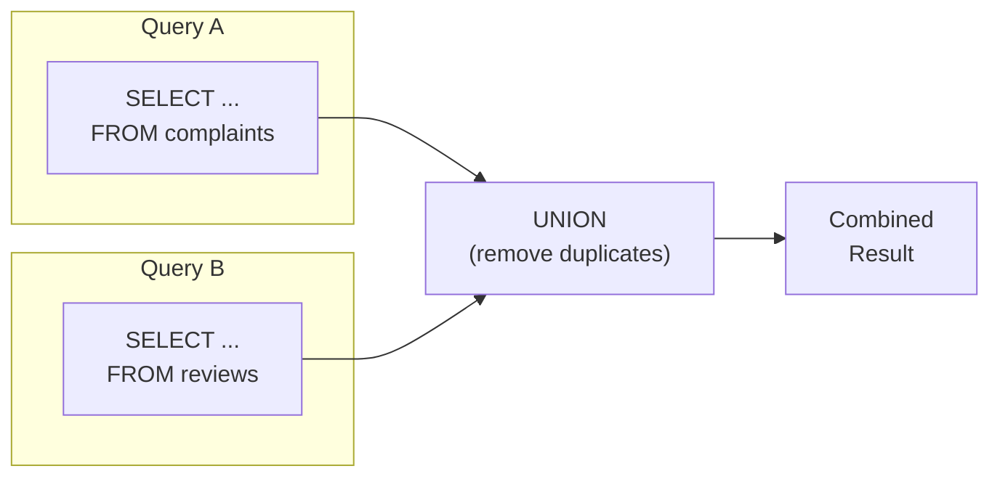

# Lesson 13: UNION

`UNION` stacks the results of two or more `SELECT` statements on top of each other. Each query must return the same number of columns, and corresponding columns must be compatible types. The column names come from the first query.



> UNION stacks two query results vertically. Column count and types must match.

## UNION vs. UNION ALL

{ .off-glb width="280"  }

| Operator | Duplicates | Speed |
|----------|-----------|-------|
| `UNION` | Removed (like `DISTINCT`) | Slower — must sort/hash to deduplicate |
| `UNION ALL` | Kept | Faster — no deduplication step |

Use `UNION ALL` whenever you know there are no duplicates, or when you want to count all occurrences.

## Basic UNION

```sql
-- Combine VIP customers and GOLD customers into one list
-- (UNION removes any customer who might appear in both, though that is impossible here)
SELECT id, name, grade FROM customers WHERE grade = 'VIP'
UNION
SELECT id, name, grade FROM customers WHERE grade = 'GOLD'
ORDER BY name;
```

> This produces the same result as `WHERE grade IN ('VIP', 'GOLD')`, but UNION shines when the queries come from different tables.

## Combining Different Tables

The classic UNION use case: produce a unified activity feed or report from multiple source tables.

=== "SQLite"
    ```sql
    -- Combined activity log: orders and reviews by the same customer
    SELECT
        'order'   AS activity_type,
        customer_id,
        ordered_at AS activity_date,
        CAST(total_amount AS TEXT) AS detail
    FROM orders
    WHERE customer_id = 42

    UNION ALL

    SELECT
        'review'  AS activity_type,
        customer_id,
        created_at AS activity_date,
        'Rating: ' || CAST(rating AS TEXT) AS detail
    FROM reviews
    WHERE customer_id = 42

    ORDER BY activity_date DESC;
    ```

=== "MySQL"
    ```sql
    SELECT
        'order'   AS activity_type,
        customer_id,
        ordered_at AS activity_date,
        CAST(total_amount AS CHAR) AS detail
    FROM orders
    WHERE customer_id = 42

    UNION ALL

    SELECT
        'review'  AS activity_type,
        customer_id,
        created_at AS activity_date,
        CONCAT('Rating: ', rating) AS detail
    FROM reviews
    WHERE customer_id = 42

    ORDER BY activity_date DESC;
    ```

=== "PostgreSQL"
    ```sql
    SELECT
        'order'   AS activity_type,
        customer_id,
        ordered_at AS activity_date,
        total_amount::text AS detail
    FROM orders
    WHERE customer_id = 42

    UNION ALL

    SELECT
        'review'  AS activity_type,
        customer_id,
        created_at AS activity_date,
        'Rating: ' || rating::text AS detail
    FROM reviews
    WHERE customer_id = 42

    ORDER BY activity_date DESC;
    ```

**Result:**

| activity_type | customer_id | activity_date | detail |
|---------------|------------:|---------------|--------|
| order | 42 | 2024-11-18 | 299.99 |
| review | 42 | 2024-11-20 | Rating: 5 |
| order | 42 | 2024-09-03 | 89.99 |
| review | 42 | 2024-09-05 | Rating: 4 |
| ... | | | |

```sql
-- All complaint and return events for 2024
SELECT
    'complaint'         AS event_type,
    c.customer_id,
    c.created_at        AS event_date,
    c.subject           AS description
FROM complaints AS c
WHERE c.created_at LIKE '2024%'

UNION ALL

SELECT
    'return'            AS event_type,
    o.customer_id,
    r.created_at        AS event_date,
    r.reason            AS description
FROM returns AS r
INNER JOIN orders AS o ON r.order_id = o.id
WHERE r.created_at LIKE '2024%'

ORDER BY event_date DESC
LIMIT 10;
```

## Using UNION ALL for Rollup Reports

```sql
-- Revenue summary: individual categories + a grand total row
SELECT
    0 AS sort_key,
    cat.name AS category,
    SUM(oi.quantity * oi.unit_price) AS revenue
FROM order_items AS oi
INNER JOIN products   AS p   ON oi.product_id = p.id
INNER JOIN categories AS cat ON p.category_id = cat.id
INNER JOIN orders     AS o   ON oi.order_id   = o.id
WHERE o.status IN ('delivered', 'confirmed')
  AND o.ordered_at LIKE '2024%'
GROUP BY cat.name

UNION ALL

SELECT
    1 AS sort_key,
    'TOTAL' AS category,
    SUM(oi.quantity * oi.unit_price) AS revenue
FROM order_items AS oi
INNER JOIN orders AS o ON oi.order_id = o.id
WHERE o.status IN ('delivered', 'confirmed')
  AND o.ordered_at LIKE '2024%'

ORDER BY sort_key, revenue DESC;
```

> **SQLite note:** You cannot use a `CASE` expression directly in `ORDER BY` with `UNION` / `UNION ALL`.
> Instead, add a sort key column to each `SELECT` as shown above — it is the simplest workaround.

**Result (abridged):**

| sort_key | category | revenue |
|---------:|----------|--------:|
| 0 | Laptops | 1849201.88 |
| 0 | Desktops | 943847.00 |
| 0 | Monitors | 541920.45 |
| ... | | |
| 1 | TOTAL | 4218807.10 |

!!! note "Lesson Review"
    Quick exercises to check your understanding of this lesson. For comprehensive practice combining multiple concepts, see the [Exercises](../exercises/index.md) section.

## Practice Exercises

### Exercise 1
Build a "negative events" list combining cancelled orders and returned orders for 2023 and 2024. Use `UNION ALL`. Include `event_type` ('cancellation' or 'return'), `order_number`, `customer_id`, and `event_date` (use `cancelled_at` for cancellations and `completed_at` for returns). Sort by `event_date` descending.

??? success "Answer"
    ```sql
    SELECT
        'cancellation'  AS event_type,
        order_number,
        customer_id,
        cancelled_at    AS event_date
    FROM orders
    WHERE status = 'cancelled'
      AND cancelled_at BETWEEN '2023-01-01' AND '2024-12-31 23:59:59'

    UNION ALL

    SELECT
        'return'        AS event_type,
        order_number,
        customer_id,
        completed_at    AS event_date
    FROM orders
    WHERE status = 'returned'
      AND completed_at BETWEEN '2023-01-01' AND '2024-12-31 23:59:59'

    ORDER BY event_date DESC;
    ```

### Exercise 2
Create a customer engagement summary. Use `UNION ALL` to count, per customer: their total orders, total reviews, and total complaints. Aggregate into one row per customer by wrapping the union in a subquery (derived table). Show the top 10 most engaged customers by total activity count.

??? success "Answer"
    ```sql
    SELECT
        customer_id,
        SUM(activity_count) AS total_activity
    FROM (
        SELECT customer_id, COUNT(*) AS activity_count
        FROM orders GROUP BY customer_id

        UNION ALL

        SELECT customer_id, COUNT(*) AS activity_count
        FROM reviews GROUP BY customer_id

        UNION ALL

        SELECT customer_id, COUNT(*) AS activity_count
        FROM complaints GROUP BY customer_id
    ) AS all_activity
    GROUP BY customer_id
    ORDER BY total_activity DESC
    LIMIT 10;
    ```

    **Expected result:**

    | customer_id | total_activity |
    | ----------: | -------------: |
    |          98 |            469 |
    |          97 |            453 |
    |         226 |            423 |
    |         162 |            328 |
    |         227 |            326 |
    | ...         | ...            |


### Exercise 3
Combine VIP-grade customers and GOLD-grade customers into one list using `UNION`. Show `name` and `grade`. Sort by name.

??? success "Answer"
    ```sql
    SELECT name, grade FROM customers WHERE grade = 'VIP'
    UNION
    SELECT name, grade FROM customers WHERE grade = 'GOLD'
    ORDER BY name;
    ```

    **Expected result:**

    | name | grade |
    | ---- | ----- |
    | 강경희  | GOLD  |
    | 강도윤  | VIP   |
    | 강도현  | GOLD  |
    | 강명자  | VIP   |
    | 강미숙  | VIP   |
    | ...  | ...   |


### Exercise 4
Combine all active product names (`is_active = 1`) and all category names into a single deduplicated list using `UNION`. The result column should be called `name`.

??? success "Answer"
    ```sql
    SELECT name FROM products WHERE is_active = 1
    UNION
    SELECT name FROM categories
    ORDER BY name;
    ```

    **Expected result:**

    | name                                |
    | ----------------------------------- |
    | 2in1                                |
    | AMD                                 |
    | AMD Ryzen 9 9900X                   |
    | AMD 소켓                              |
    | APC Back-UPS Pro Gaming BGM1500B 블랙 |
    | ...                                 |


### Exercise 5
Build a "customer feedback" list combining 2024 reviews and 2024 product Q&A questions (top-level only, `parent_id IS NULL`). Use `UNION ALL`. Include `feedback_type` ('review' or 'qna'), `product_id`, `customer_id`, and `created_at`. Sort by `created_at` descending, limit to 20 rows.

??? success "Answer"
    ```sql
    SELECT
        'review' AS feedback_type,
        product_id,
        customer_id,
        created_at
    FROM reviews
    WHERE created_at LIKE '2024%'

    UNION ALL

    SELECT
        'qna' AS feedback_type,
        product_id,
        customer_id,
        created_at
    FROM product_qna
    WHERE parent_id IS NULL
      AND created_at LIKE '2024%'

    ORDER BY created_at DESC
    LIMIT 20;
    ```

    **Expected result:**

    | feedback_type | product_id | customer_id | created_at          |
    | ------------- | ---------: | ----------: | ------------------- |
    | review        |        136 |         425 | 2024-12-31 21:40:46 |
    | review        |        163 |        1429 | 2024-12-31 14:52:52 |
    | review        |        250 |         275 | 2024-12-30 22:21:51 |
    | review        |        152 |         784 | 2024-12-30 18:34:28 |
    | review        |         11 |         646 | 2024-12-30 13:36:27 |
    | ...           | ...        | ...         | ...                 |


### Exercise 6
Count transactions by payment method, then add a grand total row using `UNION ALL`. The total row should show `'TOTAL'` as the `method`. Only include payments where `status = 'completed'`.

??? success "Answer"
    ```sql
    SELECT
        0 AS sort_key,
        method,
        COUNT(*) AS tx_count
    FROM payments
    WHERE status = 'completed'
    GROUP BY method

    UNION ALL

    SELECT
        1 AS sort_key,
        'TOTAL' AS method,
        COUNT(*) AS tx_count
    FROM payments
    WHERE status = 'completed'

    ORDER BY sort_key, tx_count DESC;
    ```

    **Expected result:**

    | sort_key | method          | tx_count |
    | -------: | --------------- | -------: |
    |        0 | card            |    14522 |
    |        0 | kakao_pay       |     6359 |
    |        0 | naver_pay       |     4835 |
    |        0 | bank_transfer   |     3194 |
    |        0 | virtual_account |     1638 |
    | ...      | ...             | ...      |


### Exercise 7
Count active customers (`is_active = 1`) by grade, then add a grand total row (`'ALL'`) using `UNION ALL`. Ensure the total row appears last.

??? success "Answer"
    ```sql
    SELECT
        0 AS sort_key,
        grade,
        COUNT(*) AS cnt
    FROM customers
    WHERE is_active = 1
    GROUP BY grade

    UNION ALL

    SELECT
        1 AS sort_key,
        'ALL' AS grade,
        COUNT(*) AS cnt
    FROM customers
    WHERE is_active = 1

    ORDER BY sort_key, cnt DESC;
    ```

    **Expected result:**

    | sort_key | grade  | cnt  |
    | -------: | ------ | ---: |
    |        0 | BRONZE | 2548 |
    |        0 | GOLD   |  484 |
    |        0 | SILVER |  469 |
    |        0 | VIP    |  315 |
    |        1 | ALL    | 3816 |


### Exercise 8
Count active and inactive products per supplier separately, combine them with `UNION ALL`, then wrap in a subquery to pivot into one row per supplier with `active_count` and `inactive_count`. JOIN with `suppliers` to show the company name.

??? success "Answer"
    ```sql
    SELECT
        s.company_name,
        SUM(CASE WHEN t.status_type = 'active' THEN t.cnt ELSE 0 END) AS active_count,
        SUM(CASE WHEN t.status_type = 'inactive' THEN t.cnt ELSE 0 END) AS inactive_count
    FROM (
        SELECT supplier_id, 'active' AS status_type, COUNT(*) AS cnt
        FROM products WHERE is_active = 1
        GROUP BY supplier_id

        UNION ALL

        SELECT supplier_id, 'inactive' AS status_type, COUNT(*) AS cnt
        FROM products WHERE is_active = 0
        GROUP BY supplier_id
    ) AS t
    INNER JOIN suppliers AS s ON t.supplier_id = s.id
    GROUP BY s.company_name
    ORDER BY active_count DESC;
    ```

    **Expected result:**

    | company_name | active_count | inactive_count |
    | ------------ | -----------: | -------------: |
    | 에이수스코리아      |           21 |              5 |
    | 삼성전자 공식 유통   |           21 |              4 |
    | MSI코리아       |           12 |              1 |
    | 서린시스테크       |           11 |              1 |
    | 로지텍코리아       |           11 |              6 |
    | ...          | ...          | ...            |


### Exercise 9
Summarize order counts and average amounts by status, then add a grand total row with `UNION ALL`. Wrap the result in a subquery and calculate `pct` — each status's share of the total order count, rounded to one decimal place.

??? success "Answer"
    ```sql
    SELECT
        status,
        order_count,
        avg_amount,
        ROUND(100.0 * order_count / SUM(order_count) OVER (), 1) AS pct
    FROM (
        SELECT
            0 AS sort_key,
            status,
            COUNT(*)            AS order_count,
            ROUND(AVG(total_amount), 2) AS avg_amount
        FROM orders
        GROUP BY status

        UNION ALL

        SELECT
            1 AS sort_key,
            'TOTAL' AS status,
            COUNT(*)            AS order_count,
            ROUND(AVG(total_amount), 2) AS avg_amount
        FROM orders
    ) AS t
    ORDER BY sort_key, order_count DESC;
    ```

    **Expected result:**

    | status           | order_count | avg_amount | pct  |
    | ---------------- | ----------: | ---------: | ---: |
    | confirmed        |       32053 | 1007832.35 | 45.9 |
    | cancelled        |        1754 |  997251.54 |  2.5 |
    | return_requested |         477 | 1512187.66 |  0.7 |
    | returned         |         459 | 1382638.93 |  0.7 |
    | delivered        |          77 |  876186.49 |  0.1 |
    | ...              | ...         | ...        | ...  |


---
Next: [Lesson 14: INSERT, UPDATE, DELETE](14-dml.md)
