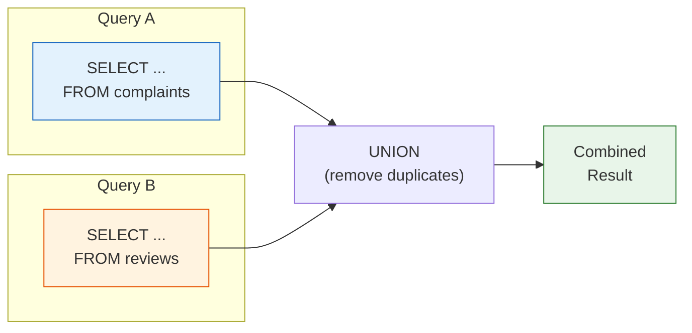

# Lesson 13: UNION

`UNION` stacks the results of two or more `SELECT` statements on top of each other. Each query must return the same number of columns, and corresponding columns must be compatible types. The column names come from the first query.



> UNION stacks two query results vertically. Column count and types must match.

## UNION vs. UNION ALL

| Operator | Duplicates | Speed |
|----------|-----------|-------|
| `UNION` | Removed (like `DISTINCT`) | Slower — must sort/hash to deduplicate |
| `UNION ALL` | Kept | Faster — no deduplication step |

Use `UNION ALL` whenever you know there are no duplicates, or when you want to count all occurrences.

## Basic UNION

```sql
-- Combine VIP customers and GOLD customers into one list
-- (UNION removes any customer who might appear in both, though that is impossible here)
SELECT id, name, grade FROM customers WHERE grade = 'VIP'
UNION
SELECT id, name, grade FROM customers WHERE grade = 'GOLD'
ORDER BY name;
```

> This produces the same result as `WHERE grade IN ('VIP', 'GOLD')`, but UNION shines when the queries come from different tables.

## Combining Different Tables

The classic UNION use case: produce a unified activity feed or report from multiple source tables.

```sql
-- Combined activity log: orders and reviews by the same customer
SELECT
    'order'   AS activity_type,
    customer_id,
    ordered_at AS activity_date,
    CAST(total_amount AS TEXT) AS detail
FROM orders
WHERE customer_id = 42

UNION ALL

SELECT
    'review'  AS activity_type,
    customer_id,
    created_at AS activity_date,
    'Rating: ' || CAST(rating AS TEXT) AS detail
FROM reviews
WHERE customer_id = 42

ORDER BY activity_date DESC;
```

**Result:**

| activity_type | customer_id | activity_date | detail |
|---------------|-------------|---------------|--------|
| order | 42 | 2024-11-18 | 299.99 |
| review | 42 | 2024-11-20 | Rating: 5 |
| order | 42 | 2024-09-03 | 89.99 |
| review | 42 | 2024-09-05 | Rating: 4 |
| ... | | | |

```sql
-- All complaint and return events for 2024
SELECT
    'complaint'         AS event_type,
    c.customer_id,
    c.created_at        AS event_date,
    c.subject           AS description
FROM complaints AS c
WHERE c.created_at LIKE '2024%'

UNION ALL

SELECT
    'return'            AS event_type,
    o.customer_id,
    r.created_at        AS event_date,
    r.reason            AS description
FROM returns AS r
INNER JOIN orders AS o ON r.order_id = o.id
WHERE r.created_at LIKE '2024%'

ORDER BY event_date DESC
LIMIT 10;
```

## Using UNION ALL for Rollup Reports

```sql
-- Revenue summary: individual categories + a grand total row
SELECT
    cat.name AS category,
    SUM(oi.quantity * oi.unit_price) AS revenue
FROM order_items AS oi
INNER JOIN products   AS p   ON oi.product_id = p.id
INNER JOIN categories AS cat ON p.category_id = cat.id
INNER JOIN orders     AS o   ON oi.order_id   = o.id
WHERE o.status IN ('delivered', 'confirmed')
  AND o.ordered_at LIKE '2024%'
GROUP BY cat.name

UNION ALL

SELECT
    'TOTAL' AS category,
    SUM(oi.quantity * oi.unit_price) AS revenue
FROM order_items AS oi
INNER JOIN orders AS o ON oi.order_id = o.id
WHERE o.status IN ('delivered', 'confirmed')
  AND o.ordered_at LIKE '2024%'

ORDER BY
    CASE WHEN category = 'TOTAL' THEN 1 ELSE 0 END,
    revenue DESC;
```

**Result (abridged):**

| category | revenue |
|----------|---------|
| Laptops | 1849201.88 |
| Desktops | 943847.00 |
| Monitors | 541920.45 |
| ... | |
| TOTAL | 4218807.10 |

!!! note "Lesson Review"
    Quick exercises to check your understanding of this lesson. For comprehensive practice combining multiple concepts, see the [Exercises](../exercises/) section.

## Practice Exercises

### Exercise 1
Build a "negative events" list combining cancelled orders and returned orders for 2023 and 2024. Use `UNION ALL`. Include `event_type` ('cancellation' or 'return'), `order_number`, `customer_id`, and `event_date` (use `cancelled_at` for cancellations and `completed_at` for returns). Sort by `event_date` descending.

??? success "Answer"
    ```sql
    SELECT
        'cancellation'  AS event_type,
        order_number,
        customer_id,
        cancelled_at    AS event_date
    FROM orders
    WHERE status = 'cancelled'
      AND cancelled_at BETWEEN '2023-01-01' AND '2024-12-31 23:59:59'

    UNION ALL

    SELECT
        'return'        AS event_type,
        order_number,
        customer_id,
        completed_at    AS event_date
    FROM orders
    WHERE status = 'returned'
      AND completed_at BETWEEN '2023-01-01' AND '2024-12-31 23:59:59'

    ORDER BY event_date DESC;
    ```

### Exercise 2
Create a customer engagement summary. Use `UNION ALL` to count, per customer: their total orders, total reviews, and total complaints. Aggregate into one row per customer by wrapping the union in a subquery (derived table). Show the top 10 most engaged customers by total activity count.

??? success "Answer"
    ```sql
    SELECT
        customer_id,
        SUM(activity_count) AS total_activity
    FROM (
        SELECT customer_id, COUNT(*) AS activity_count
        FROM orders GROUP BY customer_id

        UNION ALL

        SELECT customer_id, COUNT(*) AS activity_count
        FROM reviews GROUP BY customer_id

        UNION ALL

        SELECT customer_id, COUNT(*) AS activity_count
        FROM complaints GROUP BY customer_id
    ) AS all_activity
    GROUP BY customer_id
    ORDER BY total_activity DESC
    LIMIT 10;
    ```

---
Next: [Lesson 14: INSERT, UPDATE, DELETE](14-dml.md)
