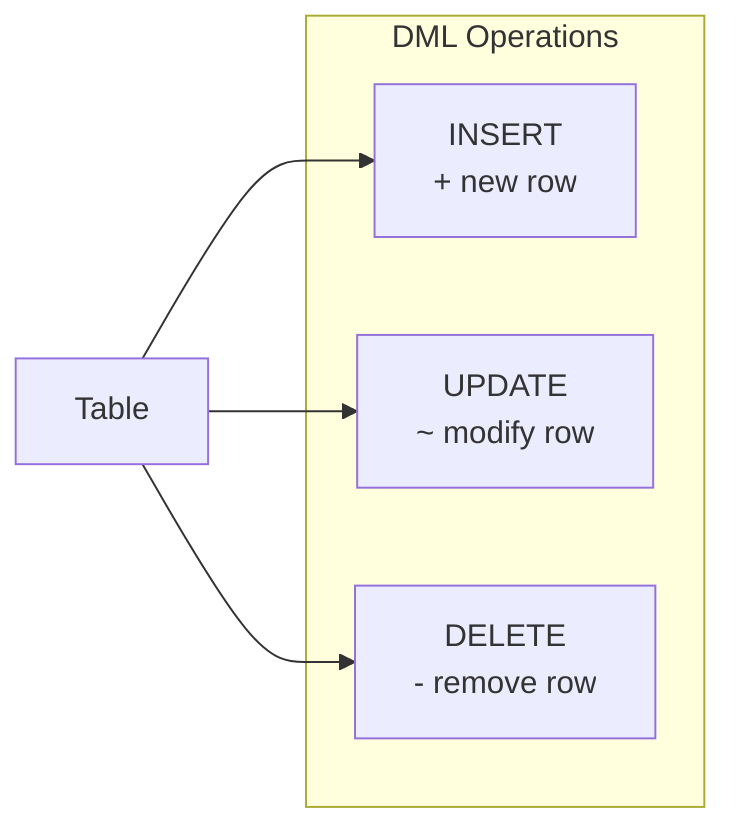

# Lesson 14: INSERT, UPDATE, DELETE

DML (Data Manipulation Language) statements change the data in your tables. Unlike `SELECT`, these statements are permanent — always double-check your `WHERE` clause before running `UPDATE` or `DELETE`.

Most DML is standard SQL and works identically across databases. Tabs are shown only where syntax differs (date functions, UPSERT, etc.).



> DML manipulates data: INSERT (add), UPDATE (modify), DELETE (remove).

> **Safety rule:** Before running any `UPDATE` or `DELETE`, first run the equivalent `SELECT` with the same `WHERE` clause to confirm exactly which rows will be affected.

## INSERT INTO

### Insert a Single Row

List the column names explicitly — this makes your query self-documenting and safe against table structure changes.

=== "SQLite"
    ```sql
    -- Add a new product
    INSERT INTO products (sku, name, category_id, supplier_id, price, stock_qty, is_active, created_at, updated_at)
    VALUES (
        'SKU-TEST-001',
        'Test Mechanical Keyboard',
        9,          -- category_id for Keyboards
        1,          -- supplier_id
        129.99,
        50,
        1,
        datetime('now'),
        datetime('now')
    );
    ```

=== "MySQL / PostgreSQL"
    ```sql
    -- Add a new product
    INSERT INTO products (sku, name, category_id, supplier_id, price, stock_qty, is_active, created_at, updated_at)
    VALUES (
        'SKU-TEST-001',
        'Test Mechanical Keyboard',
        9,          -- category_id for Keyboards
        1,          -- supplier_id
        129.99,
        50,
        1,
        NOW(),
        NOW()
    );
    ```

After running, verify:
```sql
SELECT * FROM products WHERE sku = 'SKU-TEST-001';
```

### Insert Multiple Rows

```sql
-- Add several coupon codes at once
INSERT INTO coupons (code, type, discount_value, min_order_amount, is_active, expires_at)
VALUES
    ('SAVE10', 'percentage', 10, 50.00,  1, '2025-12-31'),
    ('FLAT20', 'fixed',      20, 100.00, 1, '2025-06-30'),
    ('VIP50',  'percentage', 50, 200.00, 1, '2025-03-31');
```

### INSERT with SELECT

Copy data from one table to another, or archive old records.

```sql
-- (Hypothetical) Insert a new product based on an existing one
INSERT INTO products (sku, name, category_id, supplier_id, price, stock_qty, is_active, created_at, updated_at)
SELECT
    'SKU-' || CAST(id + 10000 AS TEXT),
    name || ' (Refurbished)',
    category_id,
    supplier_id,
    ROUND(price * 0.7, 2),
    10,
    1,
    datetime('now'),
    datetime('now')
FROM products
WHERE sku = 'SKU-0001';
```

## UPDATE SET

### Update Specific Rows

```sql
-- Apply a 15% price increase to all items in category 3
UPDATE products
SET
    price      = ROUND(price * 1.15, 2),
    updated_at = datetime('now')
WHERE category_id = 3
  AND is_active = 1;
```

> Before running: `SELECT id, name, price FROM products WHERE category_id = 3 AND is_active = 1;`

### Update a Single Row

```sql
-- Update a customer's grade after a manual review
UPDATE customers
SET
    grade      = 'GOLD',
    updated_at = datetime('now')
WHERE id = 1042;
```

### Update with a Subquery

```sql
-- Deactivate products that have never been ordered
UPDATE products
SET
    is_active  = 0,
    updated_at = datetime('now')
WHERE id NOT IN (
    SELECT DISTINCT product_id FROM order_items
)
  AND is_active = 1;
```

## DELETE FROM

### Delete Specific Rows

=== "SQLite"
    ```sql
    -- Remove cancelled orders older than 3 years
    DELETE FROM orders
    WHERE status = 'cancelled'
      AND cancelled_at < DATE('now', '-3 years');
    ```

=== "MySQL"
    ```sql
    -- Remove cancelled orders older than 3 years
    DELETE FROM orders
    WHERE status = 'cancelled'
      AND cancelled_at < DATE_SUB(CURDATE(), INTERVAL 3 YEAR);
    ```

=== "PostgreSQL"
    ```sql
    -- Remove cancelled orders older than 3 years
    DELETE FROM orders
    WHERE status = 'cancelled'
      AND cancelled_at < CURRENT_DATE - INTERVAL '3 years';
    ```

> Before running: `SELECT COUNT(*) FROM orders WHERE status = 'cancelled' AND cancelled_at < DATE('now', '-3 years');`

### Delete with a Subquery

```sql
-- Remove wishlist entries for products that no longer exist
DELETE FROM wishlists
WHERE product_id NOT IN (
    SELECT id FROM products
);
```

## Transactions — All or Nothing

Wrap related DML statements in a transaction so they either all succeed or all roll back.

```sql
BEGIN TRANSACTION;

-- Step 1: deduct stock
UPDATE products
SET stock_qty = stock_qty - 2,
    updated_at = datetime('now')
WHERE id = 5;

-- Step 2: record the transaction
INSERT INTO inventory_transactions (product_id, change_qty, reason, created_at)
VALUES (5, -2, 'manual_adjustment', datetime('now'));

-- If both look good:
COMMIT;

-- If something went wrong:
-- ROLLBACK;
```

## Common Pitfalls

| Mistake | Consequence | Prevention |
|---------|-------------|------------|
| `UPDATE table SET col = val` with no `WHERE` | Updates every row | Always verify with `SELECT` first |
| `DELETE FROM table` with no `WHERE` | Deletes every row | Use transactions; check count first |
| Forgetting `updated_at` | Stale audit trail | Include `updated_at = datetime('now')` in every UPDATE |
| Inserting duplicate primary key | Constraint error | SQLite: `INSERT OR IGNORE` / MySQL: `INSERT IGNORE` / PG: `ON CONFLICT DO NOTHING` |

## UPSERT (INSERT or UPDATE)

A very common real-world pattern: **if the row already exists, UPDATE it; otherwise, INSERT it**. This is called an UPSERT. The catch is that every database has a completely different syntax for it.

### Basic Syntax

=== "SQLite"
    SQLite supports two approaches.

    **Method 1: `INSERT OR REPLACE`** — On conflict, deletes the existing row and inserts a new one. Be careful: columns you don't specify will be reset to their default values.
    ```sql
    INSERT OR REPLACE INTO customers (id, name, email, point_balance, updated_at)
    VALUES (100, 'Hong Gildong', 'hong@testmail.kr', 1500, datetime('now'));
    ```

    **Method 2: `ON CONFLICT ... DO UPDATE`** — Gives you finer control. Other columns in the existing row are preserved.
    ```sql
    INSERT INTO customers (id, name, email, point_balance, updated_at)
    VALUES (100, 'Hong Gildong', 'hong@testmail.kr', 1500, datetime('now'))
    ON CONFLICT(id) DO UPDATE SET
        point_balance = excluded.point_balance,
        updated_at    = excluded.updated_at;
    ```

    > `excluded` is a special keyword that refers to the values you tried to insert.

=== "MySQL"
    MySQL uses `ON DUPLICATE KEY UPDATE`.
    ```sql
    INSERT INTO customers (id, name, email, point_balance, updated_at)
    VALUES (100, 'Hong Gildong', 'hong@testmail.kr', 1500, NOW())
    ON DUPLICATE KEY UPDATE
        point_balance = VALUES(point_balance),
        updated_at    = VALUES(updated_at);
    ```

    > `VALUES(column)` refers to the values you tried to insert. MySQL 8.0.20+ also supports the `AS new` alias syntax.

=== "PostgreSQL"
    PostgreSQL uses an `ON CONFLICT` clause similar to SQLite.
    ```sql
    INSERT INTO customers (id, name, email, point_balance, updated_at)
    VALUES (100, 'Hong Gildong', 'hong@testmail.kr', 1500, NOW())
    ON CONFLICT(id) DO UPDATE SET
        point_balance = EXCLUDED.point_balance,
        updated_at    = EXCLUDED.updated_at;
    ```

    > `EXCLUDED` is a special keyword that refers to the values you tried to insert.

### Example: Syncing Product Inventory

When syncing inventory data from an external system, update the stock if the SKU already exists, otherwise insert a new product.

=== "SQLite"
    ```sql
    INSERT INTO products (sku, name, category_id, supplier_id, price, stock_qty, is_active, created_at, updated_at)
    VALUES ('SKU-0042', 'Wireless Mouse X', 10, 3, 45.00, 200, 1, datetime('now'), datetime('now'))
    ON CONFLICT(sku) DO UPDATE SET
        stock_qty  = excluded.stock_qty,
        updated_at = excluded.updated_at;
    ```

=== "MySQL"
    ```sql
    INSERT INTO products (sku, name, category_id, supplier_id, price, stock_qty, is_active, created_at, updated_at)
    VALUES ('SKU-0042', 'Wireless Mouse X', 10, 3, 45.00, 200, 1, NOW(), NOW())
    ON DUPLICATE KEY UPDATE
        stock_qty  = VALUES(stock_qty),
        updated_at = VALUES(updated_at);
    ```

=== "PostgreSQL"
    ```sql
    INSERT INTO products (sku, name, category_id, supplier_id, price, stock_qty, is_active, created_at, updated_at)
    VALUES ('SKU-0042', 'Wireless Mouse X', 10, 3, 45.00, 200, 1, NOW(), NOW())
    ON CONFLICT(sku) DO UPDATE SET
        stock_qty  = EXCLUDED.stock_qty,
        updated_at = EXCLUDED.updated_at;
    ```

### Reference: SQL Standard MERGE

The SQL standard defines a `MERGE` statement. `MERGE` is more general than UPSERT — it compares a source table against a target table and can perform INSERT, UPDATE, or DELETE based on whether rows match.

```sql
-- SQL standard MERGE (for reference — not available in SQLite or MySQL)
MERGE INTO target_table t
USING source_table s ON t.id = s.id
WHEN MATCHED THEN
    UPDATE SET t.value = s.value
WHEN NOT MATCHED THEN
    INSERT (id, value) VALUES (s.id, s.value);
```

However, support is limited:

| DB | MERGE Support |
|----|--------------|
| SQLite | Not supported |
| MySQL | Not supported |
| PostgreSQL | 15+ supported |

In practice, the **UPSERT patterns shown above are far more commonly used**. They cover most use cases and work across all major databases.

!!! note "Lesson Review"
    Quick exercises to check your understanding of this lesson. For comprehensive practice combining multiple concepts, see the [Exercises](../exercises/index.md) section.

## Practice Exercises
### Exercise 1
Insert 3 products into the `products` table at once. All share `category_id = 9` (Keyboards), `supplier_id = 1`, `is_active = 1`, and `stock_qty = 30`.

| sku | name | price |
|-----|------|------:|
| SKU-TEST-101 | Wireless Keyboard A | 59.99 |
| SKU-TEST-102 | Wireless Keyboard B | 79.99 |
| SKU-TEST-103 | Wireless Keyboard C | 99.99 |

??? success "Answer"
    === "SQLite"
        ```sql
        INSERT INTO products (sku, name, category_id, supplier_id, price, stock_qty, is_active, created_at, updated_at)
        VALUES
            ('SKU-TEST-101', 'Wireless Keyboard A', 9, 1, 59.99, 30, 1, datetime('now'), datetime('now')),
            ('SKU-TEST-102', 'Wireless Keyboard B', 9, 1, 79.99, 30, 1, datetime('now'), datetime('now')),
            ('SKU-TEST-103', 'Wireless Keyboard C', 9, 1, 99.99, 30, 1, datetime('now'), datetime('now'));
        ```

    === "MySQL / PostgreSQL"
        ```sql
        INSERT INTO products (sku, name, category_id, supplier_id, price, stock_qty, is_active, created_at, updated_at)
        VALUES
            ('SKU-TEST-101', 'Wireless Keyboard A', 9, 1, 59.99, 30, 1, NOW(), NOW()),
            ('SKU-TEST-102', 'Wireless Keyboard B', 9, 1, 79.99, 30, 1, NOW(), NOW()),
            ('SKU-TEST-103', 'Wireless Keyboard C', 9, 1, 99.99, 30, 1, NOW(), NOW());
        ```


### Exercise 2
Explain what happens if you omit the `WHERE` clause in this scenario, then write the correct `UPDATE`: "Change the phone number of customer ID 500 to `'555-0555-1234'`."

??? success "Answer"
    Without `WHERE`, **every customer** in the table would have their phone changed to `'555-0555-1234'`. The correct query:

    === "SQLite"
        ```sql
        UPDATE customers
        SET
            phone      = '555-0555-1234',
            updated_at = datetime('now')
        WHERE id = 500;
        ```

    === "MySQL / PostgreSQL"
        ```sql
        UPDATE customers
        SET
            phone      = '555-0555-1234',
            updated_at = NOW()
        WHERE id = 500;
        ```


### Exercise 3
Write an UPSERT to update the point balance of customer ID 300. If the customer exists, set `point_balance` to `2000` and update `updated_at`. If the customer doesn't exist, insert a new record with name `'Seo-yun Lee'`, email `'lee.sy@testmail.kr'`, phone `'555-0300-0001'`, grade `'BRONZE'`, `point_balance = 2000`, `is_active = 1`.

??? success "Answer"
    === "SQLite"
        ```sql
        INSERT INTO customers (id, name, email, phone, grade, point_balance, is_active, created_at, updated_at)
        VALUES (300, 'Seo-yun Lee', 'lee.sy@testmail.kr', '555-0300-0001', 'BRONZE', 2000, 1, datetime('now'), datetime('now'))
        ON CONFLICT(id) DO UPDATE SET
            point_balance = excluded.point_balance,
            updated_at    = excluded.updated_at;
        ```

    === "MySQL"
        ```sql
        INSERT INTO customers (id, name, email, phone, grade, point_balance, is_active, created_at, updated_at)
        VALUES (300, 'Seo-yun Lee', 'lee.sy@testmail.kr', '555-0300-0001', 'BRONZE', 2000, 1, NOW(), NOW())
        ON DUPLICATE KEY UPDATE
            point_balance = VALUES(point_balance),
            updated_at    = VALUES(updated_at);
        ```

    === "PostgreSQL"
        ```sql
        INSERT INTO customers (id, name, email, phone, grade, point_balance, is_active, created_at, updated_at)
        VALUES (300, 'Seo-yun Lee', 'lee.sy@testmail.kr', '555-0300-0001', 'BRONZE', 2000, 1, NOW(), NOW())
        ON CONFLICT(id) DO UPDATE SET
            point_balance = EXCLUDED.point_balance,
            updated_at    = EXCLUDED.updated_at;
        ```


### Exercise 4
An external inventory system reports that SKU `'SKU-0099'` has 150 units in stock. Write an UPSERT that updates `stock_qty` to 150 if the SKU already exists, but **keeps the existing price if it's higher** than the incoming price. If the SKU doesn't exist, insert it with name `'USB-C Hub'`, `category_id = 10`, `supplier_id = 2`, `price = 35.00`, `stock_qty = 150`, `is_active = 1`.

??? success "Answer"
    === "SQLite"
        ```sql
        INSERT INTO products (sku, name, category_id, supplier_id, price, stock_qty, is_active, created_at, updated_at)
        VALUES ('SKU-0099', 'USB-C Hub', 10, 2, 35.00, 150, 1, datetime('now'), datetime('now'))
        ON CONFLICT(sku) DO UPDATE SET
            stock_qty  = excluded.stock_qty,
            price      = MAX(products.price, excluded.price),
            updated_at = excluded.updated_at;
        ```

    === "MySQL"
        ```sql
        INSERT INTO products (sku, name, category_id, supplier_id, price, stock_qty, is_active, created_at, updated_at)
        VALUES ('SKU-0099', 'USB-C Hub', 10, 2, 35.00, 150, 1, NOW(), NOW())
        ON DUPLICATE KEY UPDATE
            stock_qty  = VALUES(stock_qty),
            price      = GREATEST(price, VALUES(price)),
            updated_at = VALUES(updated_at);
        ```

    === "PostgreSQL"
        ```sql
        INSERT INTO products (sku, name, category_id, supplier_id, price, stock_qty, is_active, created_at, updated_at)
        VALUES ('SKU-0099', 'USB-C Hub', 10, 2, 35.00, 150, 1, NOW(), NOW())
        ON CONFLICT(sku) DO UPDATE SET
            stock_qty  = EXCLUDED.stock_qty,
            price      = GREATEST(products.price, EXCLUDED.price),
            updated_at = EXCLUDED.updated_at;
        ```


### Exercise 5
Insert a new customer record for a walk-in registration. Use: name `'Sam Rivera'`, email `'s.rivera@testmail.com'`, phone `'555-0199-7823'`, grade `'BRONZE'`, `point_balance = 0`, `is_active = 1`, and set both `created_at` and `updated_at` to the current time.

??? success "Answer"
    ```sql
    INSERT INTO customers (name, email, phone, grade, point_balance, is_active, created_at, updated_at)
    VALUES (
        'Sam Rivera',
        's.rivera@testmail.com',
        '555-0199-7823',
        'BRONZE',
        0,
        1,
        datetime('now'),
        datetime('now')
    );
    ```


### Exercise 6
A supplier has changed the price of all products they supply. Update the `price` column for all active products from `supplier_id = 7` to increase by 8%. Also update `updated_at`. First write the `SELECT` to verify which rows will change, then write the `UPDATE`.

??? success "Answer"
    ```sql
    -- Verify first
    SELECT id, name, price, ROUND(price * 1.08, 2) AS new_price
    FROM products
    WHERE supplier_id = 7 AND is_active = 1;

    -- Then update
    UPDATE products
    SET
        price      = ROUND(price * 1.08, 2),
        updated_at = datetime('now')
    WHERE supplier_id = 7
      AND is_active = 1;
    ```


### Exercise 7
Set `stock_qty` to 0 for all inactive (`is_active = 0`) and discontinued (`discontinued_at IS NOT NULL`) products. Also update `updated_at`.

??? success "Answer"
    === "SQLite"
        ```sql
        -- Verify first
        SELECT id, name, stock_qty
        FROM products
        WHERE is_active = 0 AND discontinued_at IS NOT NULL AND stock_qty > 0;

        -- Update
        UPDATE products
        SET
            stock_qty  = 0,
            updated_at = datetime('now')
        WHERE is_active = 0
          AND discontinued_at IS NOT NULL
          AND stock_qty > 0;
        ```

    === "MySQL / PostgreSQL"
        ```sql
        -- Verify first
        SELECT id, name, stock_qty
        FROM products
        WHERE is_active = 0 AND discontinued_at IS NOT NULL AND stock_qty > 0;

        -- Update
        UPDATE products
        SET
            stock_qty  = 0,
            updated_at = NOW()
        WHERE is_active = 0
          AND discontinued_at IS NOT NULL
          AND stock_qty > 0;
        ```


### Exercise 8
Update all active BRONZE customers with a `point_balance` of 0: change their grade to `'SILVER'` and set their points to `500`. Also update `updated_at`.

??? success "Answer"
    === "SQLite"
        ```sql
        -- Verify first
        SELECT id, name, grade, point_balance
        FROM customers
        WHERE grade = 'BRONZE' AND point_balance = 0 AND is_active = 1;

        -- Update
        UPDATE customers
        SET
            grade         = 'SILVER',
            point_balance = 500,
            updated_at    = datetime('now')
        WHERE grade = 'BRONZE'
          AND point_balance = 0
          AND is_active = 1;
        ```

    === "MySQL / PostgreSQL"
        ```sql
        -- Verify first
        SELECT id, name, grade, point_balance
        FROM customers
        WHERE grade = 'BRONZE' AND point_balance = 0 AND is_active = 1;

        -- Update
        UPDATE customers
        SET
            grade         = 'SILVER',
            point_balance = 500,
            updated_at    = NOW()
        WHERE grade = 'BRONZE'
          AND point_balance = 0
          AND is_active = 1;
        ```


### Exercise 9
Delete reviews where `rating` is 1 and `content` is NULL. First write a `SELECT` to check how many rows will be affected.

??? success "Answer"
    ```sql
    -- Verify first
    SELECT COUNT(*)
    FROM reviews
    WHERE rating = 1 AND content IS NULL;

    -- Delete
    DELETE FROM reviews
    WHERE rating = 1
      AND content IS NULL;
    ```


### Exercise 10
Using `INSERT ... SELECT`, create refurbished versions of all active products priced at 1000 or above. Prefix the SKU with `'REF-'`, append `' (Refurbished)'` to the name, set the price to 60% of the original, and set `stock_qty` to 5.

??? success "Answer"
    === "SQLite / PostgreSQL"
        ```sql
        INSERT INTO products (sku, name, category_id, supplier_id, price, stock_qty, is_active, created_at, updated_at)
        SELECT
            'REF-' || sku,
            name || ' (Refurbished)',
            category_id,
            supplier_id,
            ROUND(price * 0.6, 2),
            5,
            1,
            datetime('now'),
            datetime('now')
        FROM products
        WHERE price >= 1000
          AND is_active = 1;
        ```

    === "MySQL"
        ```sql
        INSERT INTO products (sku, name, category_id, supplier_id, price, stock_qty, is_active, created_at, updated_at)
        SELECT
            CONCAT('REF-', sku),
            CONCAT(name, ' (Refurbished)'),
            category_id,
            supplier_id,
            ROUND(price * 0.6, 2),
            5,
            1,
            NOW(),
            NOW()
        FROM products
        WHERE price >= 1000
          AND is_active = 1;
        ```


### Exercise 11
Delete resolved complaints (`status = 'resolved'`) that were created before 2022 (`created_at < '2022-01-01'`). First verify the count and date range with a `SELECT`.

??? success "Answer"
    ```sql
    -- Verify first
    SELECT COUNT(*), MIN(created_at), MAX(created_at)
    FROM complaints
    WHERE status = 'resolved'
      AND created_at < '2022-01-01';

    -- Delete
    DELETE FROM complaints
    WHERE status = 'resolved'
      AND created_at < '2022-01-01';
    ```


### Exercise 12
Write a `SELECT` to find active products that have never been ordered, then write an `UPDATE` to deactivate them (`is_active = 0`). Use a subquery.

??? success "Answer"
    === "SQLite"
        ```sql
        -- Verify first
        SELECT id, name, stock_qty
        FROM products
        WHERE id NOT IN (SELECT DISTINCT product_id FROM order_items)
          AND is_active = 1;

        -- Update
        UPDATE products
        SET
            is_active  = 0,
            updated_at = datetime('now')
        WHERE id NOT IN (SELECT DISTINCT product_id FROM order_items)
          AND is_active = 1;
        ```

    === "MySQL / PostgreSQL"
        ```sql
        -- Verify first
        SELECT id, name, stock_qty
        FROM products
        WHERE id NOT IN (SELECT DISTINCT product_id FROM order_items)
          AND is_active = 1;

        -- Update
        UPDATE products
        SET
            is_active  = 0,
            updated_at = NOW()
        WHERE id NOT IN (SELECT DISTINCT product_id FROM order_items)
          AND is_active = 1;
        ```


---
Next: [Lesson 15: DDL — Creating and Altering Tables](15-ddl.md)
