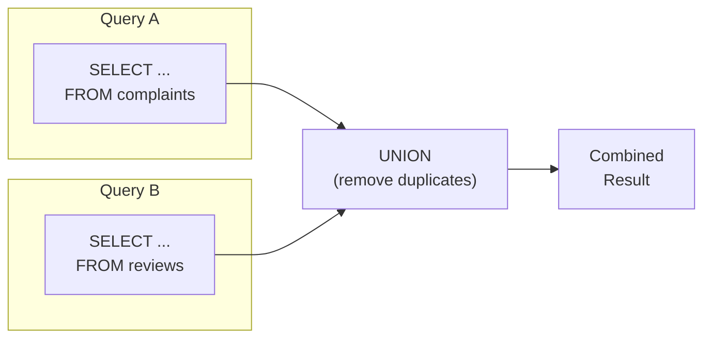

# Lesson 14: UNION

In [Lesson 13](13-utility-functions.md), we learned numeric, conversion, and conditional functions. So far we've queried data with a single SELECT. But sometimes you need to combine results from multiple queries, like "top 5 products + bottom 5 products". In this lesson, we learn how to combine results with UNION.

!!! note "Already familiar?"
    If you're comfortable with UNION, UNION ALL, INTERSECT, and EXCEPT, skip ahead to [Lesson 15: DML](15-dml.md).

`UNION` stacks the results of two or more `SELECT` statements vertically. Each query must return the same number of columns, and the corresponding column types must be compatible. Column names come from the first query.



> UNION combines two query results vertically. Column count and types must match.

## UNION vs. UNION ALL

{ .off-glb width="280"  }

| Operator | Duplicate Handling | Speed |
|--------|-----------|------|
| `UNION` | Removed (acts like `DISTINCT`) | Slow -- requires sorting/hashing for dedup |
| `UNION ALL` | Kept | Fast -- no dedup step |

Use `UNION ALL` when you know there are no duplicates, or when you want to count all occurrences.

## Basic UNION

```sql
-- Combine VIP and GOLD customers into one list
-- (No duplicates possible from the same table, but UNION removes them just in case)
SELECT id, name, grade FROM customers WHERE grade = 'VIP'
UNION
SELECT id, name, grade FROM customers WHERE grade = 'GOLD'
ORDER BY name;
```

> This result is identical to `WHERE grade IN ('VIP', 'GOLD')`, but UNION's true power shows when combining different tables.

## Combining Different Tables

A typical UNION use case: creating a unified activity feed or report from multiple source tables.

=== "SQLite"
    ```sql
    -- Activity log combining a specific customer's orders and reviews
    SELECT
        'order'   AS activity_type,
        customer_id,
        ordered_at AS activity_date,
        CAST(total_amount AS TEXT) AS detail
    FROM orders
    WHERE customer_id = 42

    UNION ALL

    SELECT
        'review'  AS activity_type,
        customer_id,
        created_at AS activity_date,
        '별점: ' || CAST(rating AS TEXT) AS detail
    FROM reviews
    WHERE customer_id = 42

    ORDER BY activity_date DESC;
    ```

=== "MySQL"
    ```sql
    SELECT
        'order'   AS activity_type,
        customer_id,
        ordered_at AS activity_date,
        CAST(total_amount AS CHAR) AS detail
    FROM orders
    WHERE customer_id = 42

    UNION ALL

    SELECT
        'review'  AS activity_type,
        customer_id,
        created_at AS activity_date,
        CONCAT('별점: ', rating) AS detail
    FROM reviews
    WHERE customer_id = 42

    ORDER BY activity_date DESC;
    ```

=== "PostgreSQL"
    ```sql
    SELECT
        'order'   AS activity_type,
        customer_id,
        ordered_at AS activity_date,
        total_amount::text AS detail
    FROM orders
    WHERE customer_id = 42

    UNION ALL

    SELECT
        'review'  AS activity_type,
        customer_id,
        created_at AS activity_date,
        '별점: ' || rating::text AS detail
    FROM reviews
    WHERE customer_id = 42

    ORDER BY activity_date DESC;
    ```

**Result:**

| activity_type | customer_id | activity_date | detail |
|---------------|------------:|---------------|--------|
| order | 42 | 2024-11-18 | 299.99 |
| review | 42 | 2024-11-20 | 별점: 5 |
| order | 42 | 2024-09-03 | 89.99 |
| review | 42 | 2024-09-05 | 별점: 4 |
| ... | | | |

```sql
-- All 2024 complaint and return events
SELECT
    'complaint'         AS event_type,
    c.customer_id,
    c.created_at        AS event_date,
    c.title             AS description
FROM complaints AS c
WHERE c.created_at LIKE '2024%'

UNION ALL

SELECT
    'return'            AS event_type,
    o.customer_id,
    r.created_at        AS event_date,
    r.reason            AS description
FROM returns AS r
INNER JOIN orders AS o ON r.order_id = o.id
WHERE r.created_at LIKE '2024%'

ORDER BY event_date DESC
LIMIT 10;
```

## Creating Rollup Reports with UNION ALL

```sql
-- Category revenue + add total row
SELECT
    0 AS sort_key,
    cat.name AS category,
    SUM(oi.quantity * oi.unit_price) AS revenue
FROM order_items AS oi
INNER JOIN products   AS p   ON oi.product_id = p.id
INNER JOIN categories AS cat ON p.category_id = cat.id
INNER JOIN orders     AS o   ON oi.order_id   = o.id
WHERE o.status IN ('delivered', 'confirmed')
  AND o.ordered_at LIKE '2024%'
GROUP BY cat.name

UNION ALL

SELECT
    1 AS sort_key,
    '합계' AS category,
    SUM(oi.quantity * oi.unit_price) AS revenue
FROM order_items AS oi
INNER JOIN orders AS o ON oi.order_id = o.id
WHERE o.status IN ('delivered', 'confirmed')
  AND o.ordered_at LIKE '2024%'

ORDER BY 1, 3 DESC;
```

> **SQLite note:** `CASE` expressions cannot be used directly in `ORDER BY` with `UNION` / `UNION ALL`, and using **column position numbers** instead of aliases is safer.
> Above, `ORDER BY 1, 3 DESC` means first column (`sort_key`) ascending, third column (`revenue`) descending.

**Result (partial):**

| sort_key | category | revenue |
| ----------: | ---------- | ----------: |
| 0 | Gaming Laptop | 636925700.0 |
| 0 | AMD | 447953400.0 |
| 0 | Gaming Monitor | 353934400.0 |
| 0 | NVIDIA | 345858700.0 |
| 0 | 2-in-1 | 340884400.0 |
| 0 | General Laptop | 291760500.0 |
| 0 | Professional Monitor | 254590200.0 |
| 0 | Speakers/Headsets | 232144800.0 |
| ... | ... | ... |

## INTERSECT -- Intersection

`INTERSECT` returns only rows that exist in **both** query results.

```sql
-- Customers who both wrote reviews and filed complaints
SELECT customer_id FROM reviews
INTERSECT
SELECT customer_id FROM complaints;
```

> **SQLite note:** `INTERSECT` is supported in SQLite 3.34.0+ (2020-12). Also available in MySQL 8.0.31+ and all PostgreSQL versions.

```sql
-- Application: VIP customers who ordered in the last 6 months
SELECT id FROM customers WHERE grade = 'VIP'
INTERSECT
SELECT DISTINCT customer_id FROM orders
WHERE ordered_at >= DATE('now', '-6 months');
```

## EXCEPT / MINUS -- Set Difference

`EXCEPT` returns rows from the first query result that are **not in** the second query result. In Oracle, it's called `MINUS`.

```sql
-- Customers who wrote reviews but never filed complaints
SELECT customer_id FROM reviews
EXCEPT
SELECT customer_id FROM complaints;
```

```sql
-- Orders that were placed but shipping never started
SELECT id FROM orders WHERE status = 'confirmed'
EXCEPT
SELECT order_id FROM shipping;
```

> `EXCEPT` returns the same result as a `NOT IN` subquery or `LEFT JOIN ... IS NULL` anti-join, but the set operation syntax is more readable.

### Comparing UNION vs. INTERSECT vs. EXCEPT

| Operator | Meaning | Set Symbol |
|--------|------|:---------:|
| UNION | Union (A ∪ B) | ∪ |
| INTERSECT | Intersection (A ∩ B) | ∩ |
| EXCEPT | Difference (A − B) | − |

All three operations **remove duplicates**. To keep duplicates, use `UNION ALL`, `INTERSECT ALL`, `EXCEPT ALL` (support varies by database).

## Summary

| Concept | Description | Example |
|------|------|------|
| UNION | Combine results after removing duplicates | `SELECT ... UNION SELECT ...` |
| UNION ALL | Combine results keeping duplicates (faster) | `SELECT ... UNION ALL SELECT ...` |
| INTERSECT | Rows in both sides (intersection) | `SELECT ... INTERSECT SELECT ...` |
| EXCEPT | Rows only in the first (set difference) | `SELECT ... EXCEPT SELECT ...` |
| Column matching rule | Both SELECTs must have matching column count/types | Column names follow the first query |
| Combining different tables | Activity logs, feedback consolidation, etc. | Orders + Reviews -> Activity feed |
| Rollup reports | Add total row with UNION ALL | Control sorting with `sort_key` |
| ORDER BY placement | Once for entire result, at the very end | Written after the last SELECT |

!!! note "Lesson Review Problems"
    These are simple problems to immediately test the concepts from this lesson. For comprehensive practice combining multiple concepts, see the [Practice Problems](../exercises/index.md) section.

## Practice Problems
### Problem 1
Combine VIP grade customers' names and grades with GOLD grade customers' names and grades using `UNION` into a single list. Sort by name.

??? success "Answer"
    ```sql
    SELECT name, grade FROM customers WHERE grade = 'VIP'
    UNION
    SELECT name, grade FROM customers WHERE grade = 'GOLD'
    ORDER BY name;
    ```

    **Result (example):**

| name | grade |
| ---------- | ---------- |
| Aaron Gillespie | GOLD |
| Aaron Medina | GOLD |
| Aaron Powell | GOLD |
| Aaron Ryan | GOLD |
| Abigail Richardson | VIP |
| Adam Johnson | VIP |
| Adam Moore | VIP |
| Adrian Davis | GOLD |
| ... | ... |


### Problem 2
Combine all active product (`is_active = 1`) names and all category names using `UNION` to create a deduplicated name list. The result column should be `name`.

??? success "Answer"
    ```sql
    SELECT name FROM products WHERE is_active = 1
    UNION
    SELECT name FROM categories
    ORDER BY name;
    ```

    **Result (example):**

| name |
| ---------- |
| 2-in-1 |
| AMD |
| AMD Ryzen 9 9900X |
| AMD Socket |
| APC Back-UPS Pro Gaming BGM1500B Black |
| ASRock B850M Pro RS Silver |
| ASRock B850M Pro RS White |
| ASRock B860M Pro RS Silver |
| ... |


### Problem 3
Create a "negative events" list combining cancelled and returned orders from 2023-2024. Use `UNION ALL` with `event_type` ('cancellation' or 'return'), `order_number`, `customer_id`, `event_date` (use `cancelled_at` for cancellations, `completed_at` for returns). Sort by `event_date` descending.

??? success "Answer"
    ```sql
    SELECT
        'cancellation'  AS event_type,
        order_number,
        customer_id,
        cancelled_at    AS event_date
    FROM orders
    WHERE status = 'cancelled'
      AND cancelled_at BETWEEN '2023-01-01' AND '2024-12-31 23:59:59'

    UNION ALL

    SELECT
        'return'        AS event_type,
        order_number,
        customer_id,
        completed_at    AS event_date
    FROM orders
    WHERE status = 'returned'
      AND completed_at BETWEEN '2023-01-01' AND '2024-12-31 23:59:59'

    ORDER BY event_date DESC;
    ```

    **Result (example):**

| event_type | order_number | customer_id | event_date |
| ---------- | ---------- | ----------: | ---------- |
| cancellation | ORD-20241229-31194 | 1616 | 2024-12-31 11:37:44 |
| cancellation | ORD-20241228-31179 | 1971 | 2024-12-30 00:01:41 |
| cancellation | ORD-20241228-31177 | 2552 | 2024-12-28 21:35:05 |
| cancellation | ORD-20241226-31148 | 1420 | 2024-12-27 20:44:43 |
| cancellation | ORD-20241225-31134 | 1303 | 2024-12-26 18:43:50 |
| cancellation | ORD-20241223-31096 | 3326 | 2024-12-25 19:56:46 |
| cancellation | ORD-20241222-31087 | 1220 | 2024-12-24 13:53:00 |
| cancellation | ORD-20241220-31038 | 2264 | 2024-12-21 08:47:52 |
| ... | ... | ... | ... |


### Problem 4
Create a "customer feedback" list combining 2024 reviews and 2024 product Q&A (questions only, `parent_id IS NULL`). Use `UNION ALL` with `feedback_type` ('review' or 'qna'), `product_id`, `customer_id`, `created_at`. Sort by `created_at` descending, showing only the top 20.

??? success "Answer"
    ```sql
    SELECT
        'review' AS feedback_type,
        product_id,
        customer_id,
        created_at
    FROM reviews
    WHERE created_at LIKE '2024%'

    UNION ALL

    SELECT
        'qna' AS feedback_type,
        product_id,
        customer_id,
        created_at
    FROM product_qna
    WHERE parent_id IS NULL
      AND created_at LIKE '2024%'

    ORDER BY created_at DESC
    LIMIT 20;
    ```

    **Result (example):**

| feedback_type | product_id | customer_id | created_at |
| ---------- | ----------: | ----------: | ---------- |
| review | 241 | 3714 | 2024-12-31 23:05:31 |
| review | 209 | 3905 | 2024-12-31 10:47:07 |
| qna | 109 | 1544 | 2024-12-31 05:50:42 |
| qna | 223 | 3974 | 2024-12-29 19:05:30 |
| review | 214 | 1903 | 2024-12-29 10:19:21 |
| review | 246 | 2324 | 2024-12-28 23:13:40 |
| review | 182 | 1530 | 2024-12-28 20:28:36 |
| qna | 29 | 4422 | 2024-12-28 18:28:41 |
| ... | ... | ... | ... |


### Problem 5
Aggregate count by payment method, then add a total row with `UNION ALL`. Display `'Total'` for the total row's `method`. Target only payments where `status = 'completed'`.

??? success "Answer"
    ```sql
    SELECT
        0 AS sort_key,
        method,
        COUNT(*) AS tx_count
    FROM payments
    WHERE status = 'completed'
    GROUP BY method

    UNION ALL

    SELECT
        1 AS sort_key,
        '합계' AS method,
        COUNT(*) AS tx_count
    FROM payments
    WHERE status = 'completed'

    ORDER BY sort_key, tx_count DESC;
    ```

    **Result (example):**

| sort_key | method | tx_count |
| ----------: | ---------- | ----------: |
| 0 | card | 15556 |
| 0 | kakao_pay | 6886 |
| 0 | naver_pay | 5270 |
| 0 | bank_transfer | 3429 |
| 0 | point | 1770 |
| 0 | virtual_account | 1705 |
| 1 | 합계 | 34616 |
| ... | ... | ... |


### Problem 6
Aggregate count by customer grade, then add a grand total row (`'Total'`) with `UNION ALL`. Target only `is_active = 1` customers. Sort so the total row comes last.

??? success "Answer"
    ```sql
    SELECT
        0 AS sort_key,
        grade,
        COUNT(*) AS cnt
    FROM customers
    WHERE is_active = 1
    GROUP BY grade

    UNION ALL

    SELECT
        1 AS sort_key,
        '전체' AS grade,
        COUNT(*) AS cnt
    FROM customers
    WHERE is_active = 1

    ORDER BY sort_key, cnt DESC;
    ```

    **Result (example):**

| sort_key | grade | cnt |
| ----------: | ---------- | ----------: |
| 0 | BRONZE | 2289 |
| 0 | GOLD | 524 |
| 0 | SILVER | 479 |
| 0 | VIP | 368 |
| 1 | 전체 | 3660 |
| ... | ... | ... |


### Problem 7
Create a customer engagement summary. Use `UNION ALL` to aggregate total orders, total reviews, and total complaints per customer. Wrap the union result as a subquery (derived table) to aggregate into one row per customer, and return the top 10 by total activity count.

??? success "Answer"
    ```sql
    SELECT
        customer_id,
        SUM(activity_count) AS total_activity
    FROM (
        SELECT customer_id, COUNT(*) AS activity_count
        FROM orders GROUP BY customer_id

        UNION ALL

        SELECT customer_id, COUNT(*) AS activity_count
        FROM reviews GROUP BY customer_id

        UNION ALL

        SELECT customer_id, COUNT(*) AS activity_count
        FROM complaints GROUP BY customer_id
    ) AS all_activity
    GROUP BY customer_id
    ORDER BY total_activity DESC
    LIMIT 10;
    ```

    **Result (example):**

| customer_id | total_activity |
| ----------: | ----------: |
| 97 | 463 |
| 226 | 410 |
| 98 | 398 |
| 162 | 352 |
| 356 | 319 |
| 227 | 318 |
| 549 | 313 |
| 259 | 248 |
| ... | ... |


### Problem 8
Aggregate count and average amount by order status, then add a total row with `UNION ALL`. Wrap the result as a subquery to calculate `pct` (the percentage each status count represents of the total, to 1 decimal place).

??? success "Answer"
    ```sql
    SELECT
        status,
        order_count,
        avg_amount,
        ROUND(100.0 * order_count / SUM(order_count) OVER (), 1) AS pct
    FROM (
        SELECT
            0 AS sort_key,
            status,
            COUNT(*)            AS order_count,
            ROUND(AVG(total_amount), 2) AS avg_amount
        FROM orders
        GROUP BY status

        UNION ALL

        SELECT
            1 AS sort_key,
            '합계' AS status,
            COUNT(*)            AS order_count,
            ROUND(AVG(total_amount), 2) AS avg_amount
        FROM orders
    ) AS t
    ORDER BY sort_key, order_count DESC;
    ```

    **Result (example):**

| status | order_count | avg_amount | pct |
| ---------- | ----------: | ----------: | ----------: |
| confirmed | 34393 | 999813.63 | 45.8 |
| cancelled | 1859 | 1045258.09 | 2.5 |
| return_requested | 507 | 1600567.46 | 0.7 |
| returned | 493 | 1337615.77 | 0.7 |
| delivered | 125 | 1566145.88 | 0.2 |
| pending | 82 | 1063783.45 | 0.1 |
| shipped | 51 | 1452363.65 | 0.1 |
| preparing | 24 | 510284.5 | 0.0 |
| ... | ... | ... | ... |


### Problem 9
Aggregate active and inactive product counts per supplier separately, combine with `UNION ALL`, then wrap as a subquery to create one row per supplier (active count, inactive count). JOIN with the `suppliers` table to also display company name.

??? success "Answer"
    ```sql
    SELECT
        s.company_name,
        SUM(CASE WHEN t.status_type = 'active' THEN t.cnt ELSE 0 END) AS active_count,
        SUM(CASE WHEN t.status_type = 'inactive' THEN t.cnt ELSE 0 END) AS inactive_count
    FROM (
        SELECT supplier_id, 'active' AS status_type, COUNT(*) AS cnt
        FROM products WHERE is_active = 1
        GROUP BY supplier_id

        UNION ALL

        SELECT supplier_id, 'inactive' AS status_type, COUNT(*) AS cnt
        FROM products WHERE is_active = 0
        GROUP BY supplier_id
    ) AS t
    INNER JOIN suppliers AS s ON t.supplier_id = s.id
    GROUP BY s.company_name
    ORDER BY active_count DESC;
    ```

    **Result (example):**

| company_name | active_count | inactive_count |
| ---------- | ----------: | ----------: |
| Samsung Official Distribution | 21 | 4 |
| ASUS Corp. | 21 | 5 |
| MSI Corp. | 12 | 1 |
| TP-Link Corp. | 11 | 0 |
| Seorin Systech | 11 | 1 |
| Logitech Corp. | 11 | 6 |
| LG Official Distribution | 11 | 0 |
| ASRock Corp. | 9 | 2 |
| ... | ... | ... |


### Problem 10
Combine the 'highest priced product' and 'lowest priced product' per supplier into one list. Use `UNION ALL` with `price_type` ('highest' or 'lowest'), `company_name`, `product_name`, `price`. Sort by `company_name`, `price_type`.

??? success "Answer"
    ```sql
    SELECT
        '최고가' AS price_type,
        s.company_name,
        p.name  AS product_name,
        p.price
    FROM products AS p
    INNER JOIN suppliers AS s ON p.supplier_id = s.id
    WHERE p.is_active = 1
      AND p.price = (
          SELECT MAX(p2.price)
          FROM products AS p2
          WHERE p2.supplier_id = p.supplier_id AND p2.is_active = 1
      )

    UNION ALL

    SELECT
        '최저가' AS price_type,
        s.company_name,
        p.name  AS product_name,
        p.price
    FROM products AS p
    INNER JOIN suppliers AS s ON p.supplier_id = s.id
    WHERE p.is_active = 1
      AND p.price = (
          SELECT MIN(p2.price)
          FROM products AS p2
          WHERE p2.supplier_id = p.supplier_id AND p2.is_active = 1
      )

    ORDER BY company_name, price_type;
    ```


### Problem 11
Find the **intersection** of customers who wrote reviews and customers who filed complaints. Use `INTERSECT` and count the resulting `customer_id`s.

??? success "Answer"
    ```sql
    SELECT COUNT(*) AS both_count
    FROM (
        SELECT customer_id FROM reviews
        INTERSECT
        SELECT customer_id FROM complaints
    ) AS both_active;
    ```


### Problem 12
Use `EXCEPT` to find customers who added products to their wishlist but never placed an order. Return `customer_id`, sorted ascending.

??? success "Answer"
    ```sql
    SELECT customer_id FROM wishlists
    EXCEPT
    SELECT DISTINCT customer_id FROM orders
    ORDER BY customer_id;
    ```


### Scoring Guide

| Score | Next Step |
|:----:|----------|
| **11-12** | Move on to [Lesson 15: DML](15-dml.md) |
| **8-10** | Review the explanations for incorrect answers, then proceed |
| **Half or fewer** | Re-read this lesson |
| **3 or fewer** | Start again from [Lesson 13: Numeric, Conversion, and Conditional Functions](13-utility-functions.md) |

**Problem Areas:**

| Area | Problems |
|------|:--------:|
| Basic UNION (dedup) | 1, 2 |
| UNION ALL + combining different tables | 3, 4 |
| UNION ALL + total row (rollup) | 5, 6 |
| UNION ALL + subquery aggregation | 7, 8, 9 |
| UNION ALL + correlated subquery | 10 |
| INTERSECT (intersection) | 11 |
| EXCEPT (set difference) | 12 |

---
Next: [Lesson 15: INSERT, UPDATE, DELETE](15-dml.md)
