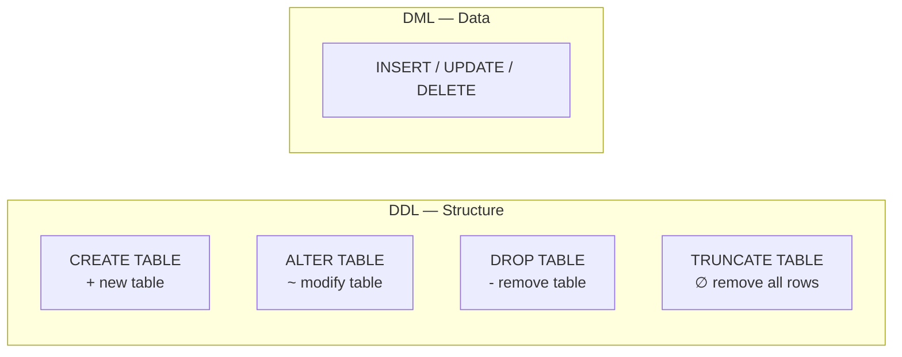

# Lesson 15: DDL — Creating and Altering Tables

In previous lessons you used DML (INSERT, UPDATE, DELETE) to change data inside tables. DDL (Data Definition Language) changes the **tables themselves** — creating, modifying, and removing the structures that hold your data.



> DDL defines the container; DML fills it with data.

| Category | Statements | What changes |
|----------|-----------|-------------|
| DDL | CREATE, ALTER, DROP, TRUNCATE | Table structure (columns, constraints, indexes) |
| DML | INSERT, UPDATE, DELETE | Rows inside tables |
| DQL | SELECT | Nothing (read-only) |

## CREATE TABLE

### Basic Syntax

```sql
CREATE TABLE table_name (
    column1  datatype  constraints,
    column2  datatype  constraints,
    ...
);
```

A simple example -- let's create an order archive table:

```sql
CREATE TABLE order_archive (
    id          INTEGER PRIMARY KEY,
    order_id    INTEGER NOT NULL,
    customer_id INTEGER NOT NULL,
    total       REAL    NOT NULL,
    archived_at TEXT    NOT NULL
);
```

Every column needs at minimum a **name** and a **data type**. Constraints (NOT NULL, DEFAULT, etc.) are optional but strongly recommended.

## Data Types

Each database engine has its own set of data types. Here are the most common ones you will use.

=== "SQLite"
    SQLite uses a dynamic type system with **type affinities**. Any column can technically hold any type, but affinities guide storage.

    | Affinity | Typical use | Examples |
    |----------|------------|---------|
    | TEXT | Strings, dates | Names, emails, ISO dates |
    | INTEGER | Whole numbers, booleans | IDs, quantities, 0/1 flags |
    | REAL | Decimal numbers | Prices, percentages |
    | BLOB | Binary data | Images, files |
    | NUMERIC | Flexible | May store as INTEGER or REAL |

    ```sql
    CREATE TABLE temp_products (
        id          INTEGER PRIMARY KEY,
        name        TEXT    NOT NULL,
        price       REAL    NOT NULL,
        stock_qty   INTEGER DEFAULT 0,
        is_active   INTEGER DEFAULT 1,
        created_at  TEXT    DEFAULT (datetime('now'))
    );
    ```

=== "MySQL"
    MySQL has strict typing with many specialized types.

    | Type | Typical use | Notes |
    |------|------------|-------|
    | VARCHAR(n) | Variable-length strings | Up to 65,535 bytes |
    | INT | Whole numbers | 4 bytes, -2B to +2B |
    | BIGINT | Large whole numbers | 8 bytes |
    | DECIMAL(p,s) | Exact decimals | `DECIMAL(10,2)` for prices |
    | DATE | Date only | `'2025-03-15'` |
    | DATETIME | Date + time | `'2025-03-15 14:30:00'` |
    | BOOLEAN | True/false | Alias for TINYINT(1) |
    | TEXT | Long strings | Up to 65,535 bytes |

    ```sql
    CREATE TABLE temp_products (
        id          INT AUTO_INCREMENT PRIMARY KEY,
        name        VARCHAR(200)   NOT NULL,
        price       DECIMAL(10, 2) NOT NULL,
        stock_qty   INT            DEFAULT 0,
        is_active   BOOLEAN        DEFAULT TRUE,
        created_at  DATETIME       DEFAULT CURRENT_TIMESTAMP
    );
    ```

=== "PostgreSQL"
    PostgreSQL has a rich type system with strict enforcement.

    | Type | Typical use | Notes |
    |------|------------|-------|
    | VARCHAR(n) | Variable-length strings | Or use TEXT (no limit) |
    | INTEGER | Whole numbers | 4 bytes |
    | BIGINT | Large whole numbers | 8 bytes |
    | NUMERIC(p,s) | Exact decimals | `NUMERIC(10,2)` for prices |
    | DATE | Date only | `'2025-03-15'` |
    | TIMESTAMP | Date + time | With or without time zone |
    | BOOLEAN | True/false | TRUE / FALSE literals |
    | TEXT | Unlimited strings | Preferred over VARCHAR in PG |

    ```sql
    CREATE TABLE temp_products (
        id          INTEGER GENERATED ALWAYS AS IDENTITY PRIMARY KEY,
        name        VARCHAR(200)   NOT NULL,
        price       NUMERIC(10, 2) NOT NULL,
        stock_qty   INTEGER        DEFAULT 0,
        is_active   BOOLEAN        DEFAULT TRUE,
        created_at  TIMESTAMP      DEFAULT CURRENT_TIMESTAMP
    );
    ```

## Column Constraints

Constraints enforce rules at the database level, preventing bad data before it enters your tables.

### NOT NULL

A column marked NOT NULL rejects any INSERT or UPDATE that would set it to NULL.

```sql
CREATE TABLE temp_customers (
    id    INTEGER PRIMARY KEY,
    name  TEXT NOT NULL,       -- required
    email TEXT NOT NULL,       -- required
    phone TEXT                 -- optional (NULL allowed)
);
```

### DEFAULT

Provide a fallback value when no explicit value is given.

=== "SQLite"
    ```sql
    CREATE TABLE temp_orders (
        id         INTEGER PRIMARY KEY,
        status     TEXT    NOT NULL DEFAULT 'pending',
        quantity   INTEGER NOT NULL DEFAULT 1,
        created_at TEXT    DEFAULT (datetime('now'))
    );

    -- Insert without specifying status, quantity, or created_at
    INSERT INTO temp_orders (id) VALUES (1);
    -- Result: status='pending', quantity=1, created_at=current time
    ```

=== "MySQL"
    ```sql
    CREATE TABLE temp_orders (
        id         INT AUTO_INCREMENT PRIMARY KEY,
        status     VARCHAR(20) NOT NULL DEFAULT 'pending',
        quantity   INT         NOT NULL DEFAULT 1,
        created_at DATETIME    DEFAULT CURRENT_TIMESTAMP
    );
    ```

=== "PostgreSQL"
    ```sql
    CREATE TABLE temp_orders (
        id         INTEGER GENERATED ALWAYS AS IDENTITY PRIMARY KEY,
        status     VARCHAR(20) NOT NULL DEFAULT 'pending',
        quantity   INTEGER     NOT NULL DEFAULT 1,
        created_at TIMESTAMP   DEFAULT CURRENT_TIMESTAMP
    );
    ```

### UNIQUE

Ensures no two rows have the same value in that column (NULLs are excluded from uniqueness checks in most databases).

```sql
CREATE TABLE temp_users (
    id       INTEGER PRIMARY KEY,
    username TEXT NOT NULL UNIQUE,
    email    TEXT NOT NULL UNIQUE
);

-- This succeeds
INSERT INTO temp_users VALUES (1, 'alice', 'alice@testmail.kr');

-- This fails: duplicate username
INSERT INTO temp_users VALUES (2, 'alice', 'bob@testmail.kr');
```

### CHECK

Validates that values meet a condition before allowing the row.

```sql
CREATE TABLE temp_products (
    id        INTEGER PRIMARY KEY,
    name      TEXT    NOT NULL,
    price     REAL    NOT NULL CHECK (price > 0),
    stock_qty INTEGER NOT NULL CHECK (stock_qty >= 0),
    rating    REAL    CHECK (rating BETWEEN 1.0 AND 5.0)
);

-- This succeeds
INSERT INTO temp_products VALUES (1, 'Keyboard', 49.99, 100, 4.5);

-- This fails: price must be > 0
INSERT INTO temp_products VALUES (2, 'Mouse', -10.00, 50, 3.0);
```

## PRIMARY KEY

Every table should have a primary key — a column (or set of columns) that uniquely identifies each row. Primary keys are implicitly NOT NULL and UNIQUE.

### Auto-Increment Primary Keys

The most common pattern is an auto-incrementing integer ID. The syntax varies by database.

=== "SQLite"
    ```sql
    -- INTEGER PRIMARY KEY is automatically an alias for rowid
    -- AUTOINCREMENT prevents reuse of deleted IDs
    CREATE TABLE temp_categories (
        id   INTEGER PRIMARY KEY AUTOINCREMENT,
        name TEXT NOT NULL
    );

    INSERT INTO temp_categories (name) VALUES ('Electronics');
    INSERT INTO temp_categories (name) VALUES ('Peripherals');
    -- IDs are automatically 1, 2, ...
    ```

    > In SQLite, `INTEGER PRIMARY KEY` alone already auto-increments. Adding `AUTOINCREMENT` additionally prevents ID reuse after deletion.

=== "MySQL"
    ```sql
    CREATE TABLE temp_categories (
        id   INT AUTO_INCREMENT PRIMARY KEY,
        name VARCHAR(100) NOT NULL
    );

    INSERT INTO temp_categories (name) VALUES ('Electronics');
    INSERT INTO temp_categories (name) VALUES ('Peripherals');
    ```

=== "PostgreSQL"
    ```sql
    -- Modern approach (PostgreSQL 10+)
    CREATE TABLE temp_categories (
        id   INTEGER GENERATED ALWAYS AS IDENTITY PRIMARY KEY,
        name VARCHAR(100) NOT NULL
    );

    -- Legacy approach (still common)
    CREATE TABLE temp_categories (
        id   SERIAL PRIMARY KEY,
        name VARCHAR(100) NOT NULL
    );

    INSERT INTO temp_categories (name) VALUES ('Electronics');
    INSERT INTO temp_categories (name) VALUES ('Peripherals');
    ```

    > `GENERATED ALWAYS AS IDENTITY` is the SQL standard and recommended for new tables. `SERIAL` is PostgreSQL-specific shorthand that creates a sequence behind the scenes.

### Composite Primary Keys

When no single column uniquely identifies a row, combine multiple columns.

```sql
-- A student can enroll in each course only once
CREATE TABLE enrollments (
    student_id INTEGER NOT NULL,
    course_id  INTEGER NOT NULL,
    enrolled_at TEXT,
    PRIMARY KEY (student_id, course_id)
);
```

## FOREIGN KEY

A foreign key links a column in one table to the primary key of another table, enforcing **referential integrity** — you cannot insert a row that references a nonexistent parent.

```sql
CREATE TABLE temp_orders (
    id          INTEGER PRIMARY KEY,
    customer_id INTEGER NOT NULL,
    order_date  TEXT    NOT NULL,
    FOREIGN KEY (customer_id) REFERENCES customers (id)
);
```

With this constraint, inserting an order with `customer_id = 99999` would fail if no customer with `id = 99999` exists.

### ON DELETE Actions

What should happen to child rows when the parent row is deleted?

| Action | Behavior |
|--------|----------|
| RESTRICT (default) | Block the delete if child rows exist |
| CASCADE | Delete child rows automatically |
| SET NULL | Set the foreign key column to NULL |
| SET DEFAULT | Set the foreign key column to its default value |

```sql
CREATE TABLE temp_order_items (
    id          INTEGER PRIMARY KEY,
    order_id    INTEGER NOT NULL,
    product_id  INTEGER NOT NULL,
    quantity    INTEGER NOT NULL DEFAULT 1,
    FOREIGN KEY (order_id)   REFERENCES temp_orders (id) ON DELETE CASCADE,
    FOREIGN KEY (product_id) REFERENCES products (id)    ON DELETE RESTRICT
);
```

> With `ON DELETE CASCADE`, deleting an order automatically deletes all its order items. With `ON DELETE RESTRICT`, you cannot delete a product that has been ordered.

=== "SQLite"
    ```sql
    -- SQLite requires enabling foreign key enforcement per connection
    PRAGMA foreign_keys = ON;
    ```

    > SQLite has foreign keys **disabled by default**. You must run `PRAGMA foreign_keys = ON;` at the start of each session.

=== "MySQL"
    ```sql
    -- Foreign keys are enforced by default with InnoDB engine
    CREATE TABLE temp_order_items (
        id          INT AUTO_INCREMENT PRIMARY KEY,
        order_id    INT NOT NULL,
        product_id  INT NOT NULL,
        quantity    INT NOT NULL DEFAULT 1,
        FOREIGN KEY (order_id)   REFERENCES temp_orders (id) ON DELETE CASCADE,
        FOREIGN KEY (product_id) REFERENCES products (id)    ON DELETE RESTRICT
    ) ENGINE=InnoDB;
    ```

=== "PostgreSQL"
    ```sql
    -- Foreign keys are always enforced in PostgreSQL
    CREATE TABLE temp_order_items (
        id          INTEGER GENERATED ALWAYS AS IDENTITY PRIMARY KEY,
        order_id    INTEGER NOT NULL,
        product_id  INTEGER NOT NULL,
        quantity    INTEGER NOT NULL DEFAULT 1,
        FOREIGN KEY (order_id)   REFERENCES temp_orders (id) ON DELETE CASCADE,
        FOREIGN KEY (product_id) REFERENCES products (id)    ON DELETE RESTRICT
    );
    ```

## ALTER TABLE

After a table is created, ALTER TABLE lets you modify its structure without recreating it.

### ADD COLUMN

=== "SQLite"
    ```sql
    -- Add a discount column to products
    ALTER TABLE temp_products ADD COLUMN discount_pct REAL DEFAULT 0;
    ```

    > In SQLite, you cannot add a column with `NOT NULL` unless you also provide a `DEFAULT` value (existing rows would have NULL).

    ```sql
    ALTER TABLE temp_products ADD COLUMN status TEXT NOT NULL DEFAULT 'active';
    ```

=== "MySQL"
    ```sql
    -- Add a discount column
    ALTER TABLE temp_products ADD COLUMN discount_pct DECIMAL(5, 2) DEFAULT 0;

    -- Add a column after a specific column
    ALTER TABLE temp_products ADD COLUMN description TEXT AFTER name;
    ```

=== "PostgreSQL"
    ```sql
    -- Add a discount column
    ALTER TABLE temp_products ADD COLUMN discount_pct NUMERIC(5, 2) DEFAULT 0;
    ```

### RENAME COLUMN

=== "SQLite"
    ```sql
    -- SQLite 3.25.0+ (September 2018) supported
    ALTER TABLE temp_products RENAME COLUMN discount_pct TO discount_rate;
    ```

=== "MySQL"
    ```sql
    -- MySQL 8.0+ supported
    ALTER TABLE temp_products RENAME COLUMN discount_pct TO discount_rate;
    ```

=== "PostgreSQL"
    ```sql
    ALTER TABLE temp_products RENAME COLUMN discount_pct TO discount_rate;
    ```

### DROP COLUMN

=== "SQLite"
    ```sql
    -- Available in SQLite 3.35.0+
    ALTER TABLE temp_products DROP COLUMN discount_rate;
    ```

=== "MySQL"
    ```sql
    ALTER TABLE temp_products DROP COLUMN discount_rate;
    ```

=== "PostgreSQL"
    ```sql
    ALTER TABLE temp_products DROP COLUMN discount_rate;
    ```

### RENAME TABLE

=== "SQLite"
    ```sql
    ALTER TABLE temp_products RENAME TO archived_products;
    ```

=== "MySQL"
    ```sql
    ALTER TABLE temp_products RENAME TO archived_products;
    -- Or alternatively:
    RENAME TABLE temp_products TO archived_products;
    ```

=== "PostgreSQL"
    ```sql
    ALTER TABLE temp_products RENAME TO archived_products;
    ```

## DROP TABLE

DROP TABLE permanently removes a table and all its data.

```sql
DROP TABLE order_archive;
```

If the table does not exist, this produces an error. Use `IF EXISTS` for a safe drop:

```sql
DROP TABLE IF EXISTS order_archive;
```

> **Caution:** `DROP TABLE` is irreversible. In production environments, always verify your backups before executing. If the table is referenced by foreign keys, you must drop the child table first or remove the foreign key constraint.

## TRUNCATE TABLE

`TRUNCATE TABLE` removes **all rows** from a table while keeping the table structure (columns, constraints, indexes) intact. It is similar to `DELETE FROM table_name` but works very differently under the hood.

### DELETE vs TRUNCATE

| Aspect | DELETE | TRUNCATE |
|--------|--------|----------|
| WHERE clause | Supported | Not supported |
| Transaction rollback | Supported | Depends on the database |
| Trigger execution | Triggers fire | Triggers do not fire |
| Speed (large data) | Slow | Fast |
| Auto-increment | Preserved | Reset |

`DELETE` removes rows one by one and logs each deletion. `TRUNCATE` deallocates entire data pages, making it dramatically faster for large tables.

### Syntax by Database

=== "SQLite"
    SQLite does not support `TRUNCATE TABLE`. Use `DELETE FROM` instead.

    ```sql
    -- Delete all rows (table structure is preserved)
    DELETE FROM order_archive;

    -- Reclaim disk space with VACUUM
    VACUUM;
    ```

    > In SQLite, `DELETE FROM table_name` removes all rows but the file size does not shrink. Run `VACUUM` afterward to reclaim disk space.

=== "MySQL"
    ```sql
    TRUNCATE TABLE order_archive;
    ```

    > In MySQL, `TRUNCATE` is treated as **DDL**. It implicitly commits the transaction, so you cannot `ROLLBACK`. The `AUTO_INCREMENT` counter is reset to its initial value.

=== "PostgreSQL"
    ```sql
    -- Basic TRUNCATE
    TRUNCATE TABLE order_archive;

    -- Also reset the identity/sequence counter
    TRUNCATE TABLE order_archive RESTART IDENTITY;

    -- Also truncate child tables referenced by foreign keys
    TRUNCATE TABLE order_archive CASCADE;
    ```

    > PostgreSQL's `TRUNCATE` is transactional — you can `ROLLBACK` within a transaction. Use `RESTART IDENTITY` to reset sequences, and `CASCADE` to truncate dependent child tables.

## CREATE TABLE AS SELECT (CTAS)

Create a new table from the result of a query. The new table inherits column names and types from the SELECT, but **not** constraints (no primary key, no foreign key, no NOT NULL).

=== "SQLite / PostgreSQL"
    ```sql
    -- Archive completed orders from 2023
    CREATE TABLE orders_2023_archive AS
    SELECT
        o.id,
        o.customer_id,
        c.name AS customer_name,
        o.total_amount,
        o.order_date,
        o.status
    FROM orders o
    JOIN customers c ON c.id = o.customer_id
    WHERE o.order_date >= '2023-01-01'
      AND o.order_date <  '2024-01-01'
      AND o.status = 'delivered';
    ```

=== "MySQL"
    ```sql
    -- Archive completed orders from 2023
    CREATE TABLE orders_2023_archive AS
    SELECT
        o.id,
        o.customer_id,
        c.name AS customer_name,
        o.total_amount,
        o.order_date,
        o.status
    FROM orders o
    JOIN customers c ON c.id = o.customer_id
    WHERE o.order_date >= '2023-01-01'
      AND o.order_date <  '2024-01-01'
      AND o.status = 'delivered';
    ```

```sql
-- Create a summary table for reporting
CREATE TABLE category_summary AS
SELECT
    cat.name            AS category,
    COUNT(p.id)         AS product_count,
    ROUND(AVG(p.price), 2) AS avg_price,
    SUM(p.stock_qty)    AS total_stock
FROM categories cat
LEFT JOIN products p ON p.category_id = cat.id
GROUP BY cat.name;
```

> CTAS is useful for archiving, creating reporting snapshots, or materializing complex queries. Remember to add constraints manually afterward if needed.

## Summary

| DDL Statement | Purpose | Example |
|---------------|---------|---------|
| CREATE TABLE | Create a new table | `CREATE TABLE t (id INT PRIMARY KEY, ...)` |
| ALTER TABLE ADD COLUMN | Add a column | `ALTER TABLE t ADD COLUMN col TEXT` |
| ALTER TABLE RENAME COLUMN | Rename a column | `ALTER TABLE t RENAME COLUMN a TO b` |
| ALTER TABLE DROP COLUMN | Remove a column | `ALTER TABLE t DROP COLUMN col` |
| ALTER TABLE RENAME TO | Rename a table | `ALTER TABLE t RENAME TO new_t` |
| DROP TABLE | Remove a table | `DROP TABLE IF EXISTS t` |
| TRUNCATE TABLE | Remove all rows (keep structure) | `TRUNCATE TABLE t` |
| CREATE TABLE AS SELECT | Create a table from a query | `CREATE TABLE t AS SELECT ...` |

!!! note "Lesson Review"
    Quick exercises to check your understanding of this lesson. For comprehensive practice combining multiple concepts, see the [Exercises](../exercises/index.md) section.

## Practice Exercises
### Exercise 1
Create a table called `temp_employees` with the following columns: `id` (auto-increment primary key), `name` (required, text), `email` (required, unique, text), `department` (text, default `'General'`), and `hire_date` (text/date).

??? success "Answer"
    === "SQLite"
        ```sql
        CREATE TABLE temp_employees (
            id         INTEGER PRIMARY KEY AUTOINCREMENT,
            name       TEXT NOT NULL,
            email      TEXT NOT NULL UNIQUE,
            department TEXT DEFAULT 'General',
            hire_date  TEXT
        );
        ```

    === "MySQL"
        ```sql
        CREATE TABLE temp_employees (
            id         INT AUTO_INCREMENT PRIMARY KEY,
            name       VARCHAR(200) NOT NULL,
            email      VARCHAR(200) NOT NULL UNIQUE,
            department VARCHAR(100) DEFAULT 'General',
            hire_date  DATE
        );
        ```

    === "PostgreSQL"
        ```sql
        CREATE TABLE temp_employees (
            id         INTEGER GENERATED ALWAYS AS IDENTITY PRIMARY KEY,
            name       VARCHAR(200) NOT NULL,
            email      VARCHAR(200) NOT NULL UNIQUE,
            department VARCHAR(100) DEFAULT 'General',
            hire_date  DATE
        );
        ```


### Exercise 2
Add a `phone` column (text, optional) to the `temp_employees` table, then rename the `department` column to `dept`.

??? success "Answer"
    ```sql
    ALTER TABLE temp_employees ADD COLUMN phone TEXT;

    ALTER TABLE temp_employees RENAME COLUMN department TO dept;
    ```


### Exercise 3
Create a table called `temp_order_log` with a **composite primary key** on (`order_id`, `log_seq`). Include columns: `order_id` (integer, required), `log_seq` (integer, required), `action` (text, required, must be one of `'created'`, `'shipped'`, `'delivered'`, `'cancelled'`), and `logged_at` (default to current timestamp).

??? success "Answer"
    === "SQLite"
        ```sql
        CREATE TABLE temp_order_log (
            order_id  INTEGER NOT NULL,
            log_seq   INTEGER NOT NULL,
            action    TEXT    NOT NULL CHECK (action IN ('created', 'shipped', 'delivered', 'cancelled')),
            logged_at TEXT    DEFAULT (datetime('now')),
            PRIMARY KEY (order_id, log_seq)
        );
        ```

    === "MySQL"
        ```sql
        CREATE TABLE temp_order_log (
            order_id  INT         NOT NULL,
            log_seq   INT         NOT NULL,
            action    VARCHAR(20) NOT NULL CHECK (action IN ('created', 'shipped', 'delivered', 'cancelled')),
            logged_at DATETIME    DEFAULT CURRENT_TIMESTAMP,
            PRIMARY KEY (order_id, log_seq)
        );
        ```

    === "PostgreSQL"
        ```sql
        CREATE TABLE temp_order_log (
            order_id  INTEGER     NOT NULL,
            log_seq   INTEGER     NOT NULL,
            action    VARCHAR(20) NOT NULL CHECK (action IN ('created', 'shipped', 'delivered', 'cancelled')),
            logged_at TIMESTAMP   DEFAULT CURRENT_TIMESTAMP,
            PRIMARY KEY (order_id, log_seq)
        );
        ```


### Exercise 4
Explain the differences between `DELETE FROM` and `TRUNCATE TABLE`. Then write the SQL to remove all data from the `order_archive` table for each database.

??? success "Answer"
    **Differences:**

    - `DELETE` removes rows one at a time, logs each deletion, supports WHERE clauses, fires triggers, and preserves the auto-increment counter.
    - `TRUNCATE` deallocates data pages in bulk (much faster), does not support WHERE, does not fire triggers, and resets the auto-increment counter.

    === "SQLite"
        ```sql
        -- SQLite does not support TRUNCATE; use DELETE instead
        DELETE FROM order_archive;

        -- Reclaim disk space if needed
        VACUUM;
        ```

    === "MySQL"
        ```sql
        TRUNCATE TABLE order_archive;
        ```

    === "PostgreSQL"
        ```sql
        -- Basic TRUNCATE
        TRUNCATE TABLE order_archive;

        -- Also reset the sequence counter
        TRUNCATE TABLE order_archive RESTART IDENTITY;
        ```


### Exercise 5
Create a table called `temp_product_reviews` with: `id` (auto-increment primary key), `product_id` (integer, required, foreign key to `products`), `customer_id` (integer, required), `rating` (integer, required, must be between 1 and 5), `comment` (text), and `created_at` (default to current timestamp). If a product is deleted, its reviews should be deleted automatically.

??? success "Answer"
    === "SQLite"
        ```sql
        CREATE TABLE temp_product_reviews (
            id          INTEGER PRIMARY KEY AUTOINCREMENT,
            product_id  INTEGER NOT NULL,
            customer_id INTEGER NOT NULL,
            rating      INTEGER NOT NULL CHECK (rating BETWEEN 1 AND 5),
            comment     TEXT,
            created_at  TEXT DEFAULT (datetime('now')),
            FOREIGN KEY (product_id)  REFERENCES products (id) ON DELETE CASCADE,
            FOREIGN KEY (customer_id) REFERENCES customers (id)
        );
        ```

    === "MySQL"
        ```sql
        CREATE TABLE temp_product_reviews (
            id          INT AUTO_INCREMENT PRIMARY KEY,
            product_id  INT NOT NULL,
            customer_id INT NOT NULL,
            rating      INT NOT NULL CHECK (rating BETWEEN 1 AND 5),
            comment     TEXT,
            created_at  DATETIME DEFAULT CURRENT_TIMESTAMP,
            FOREIGN KEY (product_id)  REFERENCES products (id) ON DELETE CASCADE,
            FOREIGN KEY (customer_id) REFERENCES customers (id)
        ) ENGINE=InnoDB;
        ```

    === "PostgreSQL"
        ```sql
        CREATE TABLE temp_product_reviews (
            id          INTEGER GENERATED ALWAYS AS IDENTITY PRIMARY KEY,
            product_id  INTEGER NOT NULL,
            customer_id INTEGER NOT NULL,
            rating      INTEGER NOT NULL CHECK (rating BETWEEN 1 AND 5),
            comment     TEXT,
            created_at  TIMESTAMP DEFAULT CURRENT_TIMESTAMP,
            FOREIGN KEY (product_id)  REFERENCES products (id) ON DELETE CASCADE,
            FOREIGN KEY (customer_id) REFERENCES customers (id)
        );
        ```


### Exercise 6
What is wrong with the following table definition? Fix it.

```sql
CREATE TABLE temp_inventory (
    product_id INTEGER,
    warehouse  TEXT,
    quantity   INTEGER DEFAULT -1,
    updated_at TEXT
);
```

??? success "Answer"
    Three issues: (1) no primary key, (2) quantity defaults to -1 which is nonsensical, and (3) product_id should be NOT NULL. A corrected version:

    ```sql
    CREATE TABLE temp_inventory (
        id         INTEGER PRIMARY KEY,
        product_id INTEGER NOT NULL,
        warehouse  TEXT    NOT NULL,
        quantity   INTEGER NOT NULL DEFAULT 0 CHECK (quantity >= 0),
        updated_at TEXT,
        FOREIGN KEY (product_id) REFERENCES products (id)
    );
    ```


### Exercise 7
Write a single `DROP TABLE IF EXISTS` statement for each of these tables in the correct order: `temp_product_reviews`, `temp_vip_customers`, `temp_employees`, `order_totals_by_month`, `temp_inventory`. (Consider foreign key dependencies.)

??? success "Answer"
    `temp_product_reviews` references `products` and `customers` (external tables, not being dropped), so order among these tables does not matter — none reference each other. Any order is valid:

    ```sql
    DROP TABLE IF EXISTS temp_product_reviews;
    DROP TABLE IF EXISTS temp_vip_customers;
    DROP TABLE IF EXISTS temp_employees;
    DROP TABLE IF EXISTS order_totals_by_month;
    DROP TABLE IF EXISTS temp_inventory;
    ```

    > If one of these tables had a foreign key referencing another table in the list, you would drop the child table first.


### Exercise 8
Create a `temp_vip_customers` table with: `id` (primary key), `name` (required), `email` (required, unique), and `total_spent` (decimal, must be positive). Then populate it using a SELECT from `customers` and `orders` for customers whose total spending exceeds 1,000,000.

??? success "Answer"
    === "SQLite"
        ```sql
        CREATE TABLE temp_vip_customers (
            id          INTEGER PRIMARY KEY,
            name        TEXT NOT NULL,
            email       TEXT NOT NULL UNIQUE,
            total_spent REAL CHECK (total_spent > 0)
        );

        INSERT INTO temp_vip_customers (id, name, email, total_spent)
        SELECT
            c.id,
            c.name,
            c.email,
            SUM(o.total_amount) AS total_spent
        FROM customers c
        JOIN orders o ON o.customer_id = c.id
        GROUP BY c.id, c.name, c.email
        HAVING SUM(o.total_amount) > 1000000;
        ```

    === "MySQL"
        ```sql
        CREATE TABLE temp_vip_customers (
            id          INT PRIMARY KEY,
            name        VARCHAR(200) NOT NULL,
            email       VARCHAR(200) NOT NULL UNIQUE,
            total_spent DECIMAL(12, 2) CHECK (total_spent > 0)
        );

        INSERT INTO temp_vip_customers (id, name, email, total_spent)
        SELECT
            c.id,
            c.name,
            c.email,
            SUM(o.total_amount) AS total_spent
        FROM customers c
        JOIN orders o ON o.customer_id = c.id
        GROUP BY c.id, c.name, c.email
        HAVING SUM(o.total_amount) > 1000000;
        ```

    === "PostgreSQL"
        ```sql
        CREATE TABLE temp_vip_customers (
            id          INTEGER PRIMARY KEY,
            name        VARCHAR(200) NOT NULL,
            email       VARCHAR(200) NOT NULL UNIQUE,
            total_spent NUMERIC(12, 2) CHECK (total_spent > 0)
        );

        INSERT INTO temp_vip_customers (id, name, email, total_spent)
        SELECT
            c.id,
            c.name,
            c.email,
            SUM(o.total_amount) AS total_spent
        FROM customers c
        JOIN orders o ON o.customer_id = c.id
        GROUP BY c.id, c.name, c.email
        HAVING SUM(o.total_amount) > 1000000;
        ```


### Exercise 9
Using ALTER TABLE, add a `discount_rate` column (decimal, default 0, must be between 0 and 100) to the `temp_employees` table. Then drop the `phone` column you added in Exercise 4.

??? success "Answer"
    === "SQLite"
        ```sql
        ALTER TABLE temp_employees ADD COLUMN discount_rate REAL DEFAULT 0 CHECK (discount_rate BETWEEN 0 AND 100);

        -- DROP COLUMN requires SQLite 3.35.0+
        ALTER TABLE temp_employees DROP COLUMN phone;
        ```

    === "MySQL"
        ```sql
        ALTER TABLE temp_employees ADD COLUMN discount_rate DECIMAL(5, 2) DEFAULT 0 CHECK (discount_rate BETWEEN 0 AND 100);

        ALTER TABLE temp_employees DROP COLUMN phone;
        ```

    === "PostgreSQL"
        ```sql
        ALTER TABLE temp_employees ADD COLUMN discount_rate NUMERIC(5, 2) DEFAULT 0 CHECK (discount_rate BETWEEN 0 AND 100);

        ALTER TABLE temp_employees DROP COLUMN phone;
        ```


### Exercise 10
Explain the difference between `CREATE TABLE AS SELECT` and `CREATE TABLE` + `INSERT INTO ... SELECT`. When would you prefer one over the other?

??? success "Answer"
    **CREATE TABLE AS SELECT (CTAS):**

    - Creates the table and populates it in one statement
    - Column names and types are inferred from the query
    - Does **not** copy constraints (PRIMARY KEY, NOT NULL, FOREIGN KEY, CHECK)
    - Best for quick snapshots, temporary analysis tables, or archiving

    **CREATE TABLE + INSERT INTO ... SELECT:**

    - Two separate statements
    - You define the schema explicitly with all constraints
    - Then populate with data from a query
    - Best when you need constraints, indexes, or specific data types

    ```sql
    -- CTAS: quick, but no constraints
    CREATE TABLE quick_archive AS
    SELECT * FROM orders WHERE status = 'delivered';

    -- Explicit: full control over schema
    CREATE TABLE proper_archive (
        id          INTEGER PRIMARY KEY,
        customer_id INTEGER NOT NULL,
        total       REAL    NOT NULL CHECK (total > 0),
        order_date  TEXT    NOT NULL
    );

    INSERT INTO proper_archive (id, customer_id, total, order_date)
    SELECT id, customer_id, total_amount, order_date
    FROM orders
    WHERE status = 'delivered';
    ```


### Exercise 11
Create a table called `order_totals_by_month` using CTAS that contains: the year and month of each order, the number of orders, and the total revenue. Use the existing `orders` table.

??? success "Answer"
    === "SQLite"
        ```sql
        CREATE TABLE order_totals_by_month AS
        SELECT
            strftime('%Y', ordered_at)    AS order_year,
            strftime('%m', ordered_at)    AS order_month,
            COUNT(*)                      AS order_count,
            ROUND(SUM(total_amount), 2)   AS total_revenue
        FROM orders
        GROUP BY strftime('%Y', ordered_at),
                 strftime('%m', ordered_at);
        ```

    === "MySQL"
        ```sql
        CREATE TABLE order_totals_by_month AS
        SELECT
            YEAR(ordered_at)              AS order_year,
            MONTH(ordered_at)             AS order_month,
            COUNT(*)                      AS order_count,
            ROUND(SUM(total_amount), 2)   AS total_revenue
        FROM orders
        GROUP BY YEAR(ordered_at),
                 MONTH(ordered_at);
        ```

    === "PostgreSQL"
        ```sql
        CREATE TABLE order_totals_by_month AS
        SELECT
            EXTRACT(YEAR FROM ordered_at)::INTEGER  AS order_year,
            EXTRACT(MONTH FROM ordered_at)::INTEGER AS order_month,
            COUNT(*)::INTEGER                       AS order_count,
            ROUND(SUM(total_amount), 2)             AS total_revenue
        FROM orders
        GROUP BY EXTRACT(YEAR FROM ordered_at),
                 EXTRACT(MONTH FROM ordered_at);
        ```


---
Next: [Lesson 16: Transactions and ACID](16-transactions.md)
