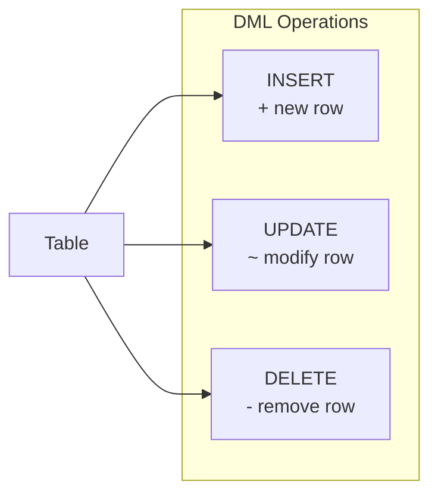

# Lesson 15: INSERT, UPDATE, DELETE

In [Lesson 14](14-union.md), we learned how to combine query results with UNION. Until now, we've only read data with SELECT. In this lesson, we learn how to add (INSERT), modify (UPDATE), and remove (DELETE) data directly. These correspond to the C, U, and D in CRUD from [Lesson 0](../beginner/00-introduction.md).

!!! note "Already familiar?"
    If you're comfortable with INSERT, UPDATE, and DELETE, skip ahead to [Lesson 16: DDL](16-ddl.md).

DML (Data Manipulation Language) statements change data in tables. Unlike `SELECT`, these statements are permanently applied -- always double-check the `WHERE` clause before running `UPDATE` or `DELETE`.

Most DML is standard SQL and works identically across all databases. Only differences (date functions, UPSERT, etc.) are shown in tabs.



> DML manipulates data. There are INSERT (add), UPDATE (modify), and DELETE (remove).

> **Safety rule:** Before running `UPDATE` or `DELETE`, first run `SELECT` with the same `WHERE` condition to verify exactly which rows will be affected.

## INSERT INTO

### Single Row Insert

Explicitly list column names -- this makes queries self-documenting and safe against table structure changes.

=== "SQLite"
    ```sql
    -- Add a new product
    INSERT INTO products (sku, name, category_id, supplier_id, price, stock_qty, is_active, created_at, updated_at)
    VALUES (
        'SKU-TEST-001',
        '테스트 기계식 키보드',
        9,          -- Keyboards category ID
        1,          -- supplier ID
        129.99,
        50,
        1,
        datetime('now'),
        datetime('now')
    );
    ```

=== "MySQL / PostgreSQL"
    ```sql
    -- Add a new product
    INSERT INTO products (sku, name, category_id, supplier_id, price, stock_qty, is_active, created_at, updated_at)
    VALUES (
        'SKU-TEST-001',
        '테스트 기계식 키보드',
        9,          -- Keyboards category ID
        1,          -- supplier ID
        129.99,
        50,
        1,
        NOW(),
        NOW()
    );
    ```

Verify after execution:
```sql
SELECT * FROM products WHERE sku = 'SKU-TEST-001';
```

### Inserting Multiple Rows at Once

```sql
-- Add multiple coupon codes at once
INSERT INTO coupons (code, type, discount_value, min_order_amount, is_active, expires_at)
VALUES
    ('SAVE10', 'percentage', 10, 50.00,  1, '2025-12-31'),
    ('FLAT20', 'fixed',      20, 100.00, 1, '2025-06-30'),
    ('VIP50',  'percentage', 50, 200.00, 1, '2025-03-31');
```

### INSERT with SELECT

Used when copying data from another table or archiving old records.

```sql
-- (Hypothetical) Add refurbished products based on existing ones
INSERT INTO products (sku, name, category_id, supplier_id, price, stock_qty, is_active, created_at, updated_at)
SELECT
    'SKU-' || CAST(id + 10000 AS TEXT),
    name || ' (리퍼비시)',
    category_id,
    supplier_id,
    ROUND(price * 0.7, 2),
    10,
    1,
    datetime('now'),
    datetime('now')
FROM products
WHERE sku = 'SKU-0001';
```

## UPDATE SET

### Updating Specific Rows

```sql
-- Increase price by 15% for all active products in category 3
UPDATE products
SET
    price      = ROUND(price * 1.15, 2),
    updated_at = datetime('now')
WHERE category_id = 3
  AND is_active = 1;
```

> Verify before execution: `SELECT id, name, price FROM products WHERE category_id = 3 AND is_active = 1;`

### Updating a Single Row

```sql
-- Change customer grade after manual review
UPDATE customers
SET
    grade      = 'GOLD',
    updated_at = datetime('now')
WHERE id = 1042;
```

### UPDATE with Subquery

```sql
-- Deactivate products that have never been ordered
UPDATE products
SET
    is_active  = 0,
    updated_at = datetime('now')
WHERE id NOT IN (
    SELECT DISTINCT product_id FROM order_items
)
  AND is_active = 1;
```

## DELETE FROM

### Deleting Specific Rows

=== "SQLite"
    ```sql
    -- Remove cancelled orders older than 3 years
    DELETE FROM orders
    WHERE status = 'cancelled'
      AND cancelled_at < DATE('now', '-3 years');
    ```

=== "MySQL"
    ```sql
    -- Remove cancelled orders older than 3 years
    DELETE FROM orders
    WHERE status = 'cancelled'
      AND cancelled_at < DATE_SUB(CURDATE(), INTERVAL 3 YEAR);
    ```

=== "PostgreSQL"
    ```sql
    -- Remove cancelled orders older than 3 years
    DELETE FROM orders
    WHERE status = 'cancelled'
      AND cancelled_at < CURRENT_DATE - INTERVAL '3 years';
    ```

> Verify before execution: `SELECT COUNT(*) FROM orders WHERE status = 'cancelled' AND cancelled_at < DATE('now', '-3 years');`

### DELETE with Subquery

```sql
-- Delete wishlist items for products that no longer exist
DELETE FROM wishlists
WHERE product_id NOT IN (
    SELECT id FROM products
);
```

## Transactions -- All Succeed or All Fail

Wrapping related DML statements in a transaction ensures they all succeed or all roll back.

```sql
BEGIN TRANSACTION;

-- Step 1: Deduct inventory
UPDATE products
SET stock_qty = stock_qty - 2,
    updated_at = datetime('now')
WHERE id = 5;

-- Step 2: Record inventory transaction
INSERT INTO inventory_transactions (product_id, change_qty, reason, created_at)
VALUES (5, -2, 'manual_adjustment', datetime('now'));

-- If all successful:
COMMIT;

-- If something went wrong:
-- ROLLBACK;
```

## Common Mistakes

| Mistake | Consequence | Prevention |
|------|------|--------|
| `UPDATE table SET col = val` without `WHERE` | All rows updated | Always verify with `SELECT` first |
| `DELETE FROM table` without `WHERE` | All rows deleted | Use transactions; verify COUNT first |
| Missing `updated_at` | Audit trail becomes stale | Include `updated_at = datetime('now')` in all UPDATEs |
| Inserting duplicate primary key | Constraint violation error | SQLite: `INSERT OR IGNORE` / MySQL: `INSERT IGNORE` / PG: `ON CONFLICT DO NOTHING` |

## UPSERT (INSERT or UPDATE)

A common pattern in practice: **UPDATE if the row exists, INSERT if it doesn't**. This is called UPSERT. The challenge is that the syntax is completely different across databases.

### Basic Syntax

=== "SQLite"
    SQLite supports two approaches.

    **Method 1: `INSERT OR REPLACE`** -- On conflict, deletes the existing row and inserts a new one. Be careful: columns not specified are reset to defaults.
    ```sql
    INSERT OR REPLACE INTO customers (id, name, email, point_balance, updated_at)
    VALUES (100, '홍길동', 'hong@testmail.kr', 1500, datetime('now'));
    ```

    **Method 2: `ON CONFLICT ... DO UPDATE`** -- Allows more fine-grained control. Other columns of the existing row are preserved.
    ```sql
    INSERT INTO customers (id, name, email, point_balance, updated_at)
    VALUES (100, '홍길동', 'hong@testmail.kr', 1500, datetime('now'))
    ON CONFLICT(id) DO UPDATE SET
        point_balance = excluded.point_balance,
        updated_at    = excluded.updated_at;
    ```

    > `excluded` is a special keyword that references the values that were attempted to be inserted.

=== "MySQL"
    MySQL uses the `ON DUPLICATE KEY UPDATE` syntax.
    ```sql
    INSERT INTO customers (id, name, email, point_balance, updated_at)
    VALUES (100, '홍길동', 'hong@testmail.kr', 1500, NOW())
    ON DUPLICATE KEY UPDATE
        point_balance = VALUES(point_balance),
        updated_at    = VALUES(updated_at);
    ```

    > `VALUES(column_name)` references the values that were attempted to be inserted. MySQL 8.0.20+ also supports the `AS new` alias approach.

=== "PostgreSQL"
    PostgreSQL uses an `ON CONFLICT` syntax similar to SQLite.
    ```sql
    INSERT INTO customers (id, name, email, point_balance, updated_at)
    VALUES (100, '홍길동', 'hong@testmail.kr', 1500, NOW())
    ON CONFLICT(id) DO UPDATE SET
        point_balance = EXCLUDED.point_balance,
        updated_at    = EXCLUDED.updated_at;
    ```

    > `EXCLUDED` is a special keyword that references the values that were attempted to be inserted.

### Example: Product Inventory Sync

When syncing inventory data from an external system, update stock if the SKU already exists, or insert a new record if it doesn't.

=== "SQLite"
    ```sql
    INSERT INTO products (sku, name, category_id, supplier_id, price, stock_qty, is_active, created_at, updated_at)
    VALUES ('SKU-0042', '무선 마우스 X', 10, 3, 45.00, 200, 1, datetime('now'), datetime('now'))
    ON CONFLICT(sku) DO UPDATE SET
        stock_qty  = excluded.stock_qty,
        updated_at = excluded.updated_at;
    ```

=== "MySQL"
    ```sql
    INSERT INTO products (sku, name, category_id, supplier_id, price, stock_qty, is_active, created_at, updated_at)
    VALUES ('SKU-0042', '무선 마우스 X', 10, 3, 45.00, 200, 1, NOW(), NOW())
    ON DUPLICATE KEY UPDATE
        stock_qty  = VALUES(stock_qty),
        updated_at = VALUES(updated_at);
    ```

=== "PostgreSQL"
    ```sql
    INSERT INTO products (sku, name, category_id, supplier_id, price, stock_qty, is_active, created_at, updated_at)
    VALUES ('SKU-0042', '무선 마우스 X', 10, 3, 45.00, 200, 1, NOW(), NOW())
    ON CONFLICT(sku) DO UPDATE SET
        stock_qty  = EXCLUDED.stock_qty,
        updated_at = EXCLUDED.updated_at;
    ```

### Reference: SQL Standard MERGE

The SQL standard defines a `MERGE` statement. `MERGE` is more versatile than UPSERT, comparing a source table with a target table and performing INSERT/UPDATE/DELETE based on match conditions.

```sql
-- SQL Standard MERGE (reference only -- not available in SQLite, MySQL)
MERGE INTO target_table t
USING source_table s ON t.id = s.id
WHEN MATCHED THEN
    UPDATE SET t.value = s.value
WHEN NOT MATCHED THEN
    INSERT (id, value) VALUES (s.id, s.value);
```

However, support is limited:

| DB | MERGE Support |
|----|-----------|
| SQLite | Not supported |
| MySQL | Not supported |
| PostgreSQL | 15+ supported |

In practice, the **UPSERT patterns learned above are used far more often**. UPSERT is sufficient for most cases and works across all major databases.

## Summary

| Concept | Description | Example |
|------|------|------|
| INSERT INTO ... VALUES | Add rows (single/multiple) | `INSERT INTO t (a, b) VALUES (1, 2)` |
| INSERT INTO ... SELECT | Copy from another table and insert | `INSERT INTO t SELECT ... FROM s` |
| UPDATE SET ... WHERE | Modify rows matching condition | `UPDATE t SET a = 1 WHERE id = 5` |
| DELETE FROM ... WHERE | Delete rows matching condition | `DELETE FROM t WHERE id = 5` |
| Transaction | BEGIN / COMMIT / ROLLBACK | Execute multiple DMLs atomically |
| UPSERT | UPDATE if exists, INSERT if not | `ON CONFLICT DO UPDATE` (SQLite/PG) |
| Safety rule | Verify with SELECT before UPDATE/DELETE | All rows affected if WHERE is missing |

!!! note "Lesson Review Problems"
    These are simple problems to immediately test the concepts from this lesson. For comprehensive practice combining multiple concepts, see the [Practice Problems](../exercises/index.md) section.

## Practice Problems
### Problem 1
Insert the following 3 products into the `products` table at once. `category_id = 9` (keyboards), `supplier_id = 1`, `is_active = 1`, `stock_qty = 30` are all the same.

| sku | name | price |
|-----|------|------:|
| SKU-TEST-101 | 무선 키보드 A | 59.99 |
| SKU-TEST-102 | 무선 키보드 B | 79.99 |
| SKU-TEST-103 | 무선 키보드 C | 99.99 |

??? success "Answer"
    === "SQLite"
        ```sql
        INSERT INTO products (sku, name, brand, category_id, supplier_id, price, cost_price, stock_qty, is_active, created_at, updated_at)
        VALUES
            ('SKU-TEST-101', '무선 키보드 A', 'Logitech', 9, 1, 59.99, 35.00, 30, 1, datetime('now'), datetime('now')),
            ('SKU-TEST-102', '무선 키보드 B', 'Logitech', 9, 1, 79.99, 45.00, 30, 1, datetime('now'), datetime('now')),
            ('SKU-TEST-103', '무선 키보드 C', 'Logitech', 9, 1, 99.99, 55.00, 30, 1, datetime('now'), datetime('now'));
        ```

    === "MySQL / PostgreSQL"
        ```sql
        INSERT INTO products (sku, name, brand, category_id, supplier_id, price, cost_price, stock_qty, is_active, created_at, updated_at)
        VALUES
            ('SKU-TEST-101', '무선 키보드 A', 'Logitech', 9, 1, 59.99, 35.00, 30, 1, NOW(), NOW()),
            ('SKU-TEST-102', '무선 키보드 B', 'Logitech', 9, 1, 79.99, 45.00, 30, 1, NOW(), NOW()),
            ('SKU-TEST-103', '무선 키보드 C', 'Logitech', 9, 1, 99.99, 55.00, 30, 1, NOW(), NOW());
        ```


### Problem 2
Explain what happens if you omit the `WHERE` clause in the following scenario, and write the correct `UPDATE`: "Change the phone number of customer ID 500 to `'020-0555-1234'`"

??? success "Answer"
    If `WHERE` is omitted, **all customers'** phone numbers would be changed to `'020-0555-1234'`. Correct query:

    === "SQLite"
        ```sql
        UPDATE customers
        SET
            phone      = '020-0555-1234',
            updated_at = datetime('now')
        WHERE id = 500;
        ```

    === "MySQL / PostgreSQL"
        ```sql
        UPDATE customers
        SET
            phone      = '020-0555-1234',
            updated_at = NOW()
        WHERE id = 500;
        ```


### Problem 3
Write an UPSERT to update the point balance for customer ID 300. If the customer exists, update `point_balance` to `2000` and `updated_at` to the current time. If not, insert with name `'이서윤'`, email `'lee.sy@testmail.kr'`, phone `'020-0300-0001'`, grade `'BRONZE'`, `point_balance = 2000`, `is_active = 1`.

??? success "Answer"
    === "SQLite"
        ```sql
        INSERT INTO customers (id, name, email, password_hash, phone, grade, point_balance, is_active, created_at, updated_at)
        VALUES (300, '이서윤', 'lee.sy@testmail.kr', 'hash_placeholder', '020-0300-0001', 'BRONZE', 2000, 1, datetime('now'), datetime('now'))
        ON CONFLICT(id) DO UPDATE SET
            point_balance = excluded.point_balance,
            updated_at    = excluded.updated_at;
        ```

    === "MySQL"
        ```sql
        INSERT INTO customers (id, name, email, password_hash, phone, grade, point_balance, is_active, created_at, updated_at)
        VALUES (300, '이서윤', 'lee.sy@testmail.kr', 'hash_placeholder', '020-0300-0001', 'BRONZE', 2000, 1, NOW(), NOW())
        ON DUPLICATE KEY UPDATE
            point_balance = VALUES(point_balance),
            updated_at    = VALUES(updated_at);
        ```

    === "PostgreSQL"
        ```sql
        INSERT INTO customers (id, name, email, password_hash, phone, grade, point_balance, is_active, created_at, updated_at)
        VALUES (300, '이서윤', 'lee.sy@testmail.kr', 'hash_placeholder', '020-0300-0001', 'BRONZE', 2000, 1, NOW(), NOW())
        ON CONFLICT(id) DO UPDATE SET
            point_balance = EXCLUDED.point_balance,
            updated_at    = EXCLUDED.updated_at;
        ```


### Problem 4
An external inventory system reports 150 units for SKU `'SKU-0099'`. If the SKU already exists, update `stock_qty` to 150 but **keep the existing price if it would decrease**. If it doesn't exist, insert with name `'USB-C 허브'`, `category_id = 10`, `supplier_id = 2`, `price = 35.00`, `stock_qty = 150`, `is_active = 1`.

??? success "Answer"
    === "SQLite"
        ```sql
        INSERT INTO products (sku, name, brand, category_id, supplier_id, price, cost_price, stock_qty, is_active, created_at, updated_at)
        VALUES ('SKU-0099', 'USB-C 허브', 'Anker', 10, 2, 35.00, 20.00, 150, 1, datetime('now'), datetime('now'))
        ON CONFLICT(sku) DO UPDATE SET
            stock_qty  = excluded.stock_qty,
            price      = MAX(products.price, excluded.price),
            updated_at = excluded.updated_at;
        ```

    === "MySQL"
        ```sql
        INSERT INTO products (sku, name, brand, category_id, supplier_id, price, cost_price, stock_qty, is_active, created_at, updated_at)
        VALUES ('SKU-0099', 'USB-C 허브', 'Anker', 10, 2, 35.00, 20.00, 150, 1, NOW(), NOW())
        ON DUPLICATE KEY UPDATE
            stock_qty  = VALUES(stock_qty),
            price      = GREATEST(price, VALUES(price)),
            updated_at = VALUES(updated_at);
        ```

    === "PostgreSQL"
        ```sql
        INSERT INTO products (sku, name, brand, category_id, supplier_id, price, cost_price, stock_qty, is_active, created_at, updated_at)
        VALUES ('SKU-0099', 'USB-C 허브', 'Anker', 10, 2, 35.00, 20.00, 150, 1, NOW(), NOW())
        ON CONFLICT(sku) DO UPDATE SET
            stock_qty  = EXCLUDED.stock_qty,
            price      = GREATEST(products.price, EXCLUDED.price),
            updated_at = EXCLUDED.updated_at;
        ```


### Problem 5
A supplier changed their delivery prices. Increase the `price` by 8% and update `updated_at` for all active products where `supplier_id = 7`. First write a `SELECT` to verify which rows will be changed, then write the `UPDATE`.

??? success "Answer"
    ```sql
    -- Verify first
    SELECT id, name, price, ROUND(price * 1.08, 2) AS new_price
    FROM products
    WHERE supplier_id = 7 AND is_active = 1;

    -- Then update
    UPDATE products
    SET
        price      = ROUND(price * 1.08, 2),
        updated_at = datetime('now')
    WHERE supplier_id = 7
      AND is_active = 1;
    ```


### Problem 6
Update `stock_qty` to 0 and `updated_at` to current time for products that are inactive (`is_active = 0`) and discontinued (`discontinued_at IS NOT NULL`).

??? success "Answer"
    === "SQLite"
        ```sql
        -- Verify first
        SELECT id, name, stock_qty
        FROM products
        WHERE is_active = 0 AND discontinued_at IS NOT NULL AND stock_qty > 0;

        -- Update
        UPDATE products
        SET
            stock_qty  = 0,
            updated_at = datetime('now')
        WHERE is_active = 0
          AND discontinued_at IS NOT NULL
          AND stock_qty > 0;
        ```

    === "MySQL / PostgreSQL"
        ```sql
        -- Verify first
        SELECT id, name, stock_qty
        FROM products
        WHERE is_active = 0 AND discontinued_at IS NOT NULL AND stock_qty > 0;

        -- Update
        UPDATE products
        SET
            stock_qty  = 0,
            updated_at = NOW()
        WHERE is_active = 0
          AND discontinued_at IS NOT NULL
          AND stock_qty > 0;
        ```


### Problem 7
Change the grade to `'SILVER'` and points to `500` for active customers with BRONZE grade and `point_balance` of 0. Also update `updated_at`.

??? success "Answer"
    === "SQLite"
        ```sql
        -- Verify first
        SELECT id, name, grade, point_balance
        FROM customers
        WHERE grade = 'BRONZE' AND point_balance = 0 AND is_active = 1;

        -- Update
        UPDATE customers
        SET
            grade         = 'SILVER',
            point_balance = 500,
            updated_at    = datetime('now')
        WHERE grade = 'BRONZE'
          AND point_balance = 0
          AND is_active = 1;
        ```

    === "MySQL / PostgreSQL"
        ```sql
        -- Verify first
        SELECT id, name, grade, point_balance
        FROM customers
        WHERE grade = 'BRONZE' AND point_balance = 0 AND is_active = 1;

        -- Update
        UPDATE customers
        SET
            grade         = 'SILVER',
            point_balance = 500,
            updated_at    = NOW()
        WHERE grade = 'BRONZE'
          AND point_balance = 0
          AND is_active = 1;
        ```


### Problem 8
Delete reviews from the `reviews` table where `rating` is 1 and `content` is NULL. First verify the count of rows to be deleted with `SELECT`.

??? success "Answer"
    ```sql
    -- Verify first
    SELECT COUNT(*)
    FROM reviews
    WHERE rating = 1 AND content IS NULL;

    -- Delete
    DELETE FROM reviews
    WHERE rating = 1
      AND content IS NULL;
    ```


### Problem 9
Based on active products priced 1000 or more, insert refurbished products at 60% of the price using `INSERT ... SELECT`. Prefix the original SKU with `'REF-'` and append `' (Refurbished)'` to the name. Set `stock_qty` to 5.

??? success "Answer"
    === "SQLite / PostgreSQL"
        ```sql
        INSERT INTO products (sku, name, brand, category_id, supplier_id, price, cost_price, stock_qty, is_active, created_at, updated_at)
        SELECT
            'REF-' || sku,
            name || ' (리퍼비시)',
            brand,
            category_id,
            supplier_id,
            ROUND(price * 0.6, 2),
            ROUND(cost_price * 0.6, 2),
            5,
            1,
            datetime('now'),
            datetime('now')
        FROM products
        WHERE price >= 1000
          AND is_active = 1;
        ```

    === "MySQL"
        ```sql
        INSERT INTO products (sku, name, brand, category_id, supplier_id, price, cost_price, stock_qty, is_active, created_at, updated_at)
        SELECT
            CONCAT('REF-', sku),
            CONCAT(name, ' (리퍼비시)'),
            brand,
            category_id,
            supplier_id,
            ROUND(price * 0.6, 2),
            ROUND(cost_price * 0.6, 2),
            5,
            1,
            NOW(),
            NOW()
        FROM products
        WHERE price >= 1000
          AND is_active = 1;
        ```


### Problem 10
Write a `SELECT` to check the inventory (`stock_qty`) of products that have never been ordered, then write an `UPDATE` to set those products to inactive (`is_active = 0`). Use a subquery.

??? success "Answer"
    === "SQLite"
        ```sql
        -- Verify first
        SELECT id, name, stock_qty
        FROM products
        WHERE id NOT IN (SELECT DISTINCT product_id FROM order_items)
          AND is_active = 1;

        -- Update
        UPDATE products
        SET
            is_active  = 0,
            updated_at = datetime('now')
        WHERE id NOT IN (SELECT DISTINCT product_id FROM order_items)
          AND is_active = 1;
        ```

    === "MySQL / PostgreSQL"
        ```sql
        -- Verify first
        SELECT id, name, stock_qty
        FROM products
        WHERE id NOT IN (SELECT DISTINCT product_id FROM order_items)
          AND is_active = 1;

        -- Update
        UPDATE products
        SET
            is_active  = 0,
            updated_at = NOW()
        WHERE id NOT IN (SELECT DISTINCT product_id FROM order_items)
          AND is_active = 1;
        ```


### Scoring Guide

| Score | Next Step |
|:----:|----------|
| **9-10** | Move on to [Lesson 16: DDL](16-ddl.md) |
| **7-8** | Review the explanations for incorrect answers, then proceed |
| **Half or fewer** | Re-read this lesson |
| **3 or fewer** | Start again from [Lesson 14: UNION](14-union.md) |

**Problem Areas:**

| Area | Problems |
|------|:--------:|
| INSERT (multiple rows) | 1 |
| UPDATE + WHERE safety rule | 2, 5, 6, 7 |
| UPSERT (ON CONFLICT) | 3, 4 |
| DELETE + SELECT verification | 8 |
| INSERT ... SELECT | 9 |
| UPDATE with subquery | 10 |

---
Next: [Lesson 16: DDL -- Creating and Altering Tables](16-ddl.md)
