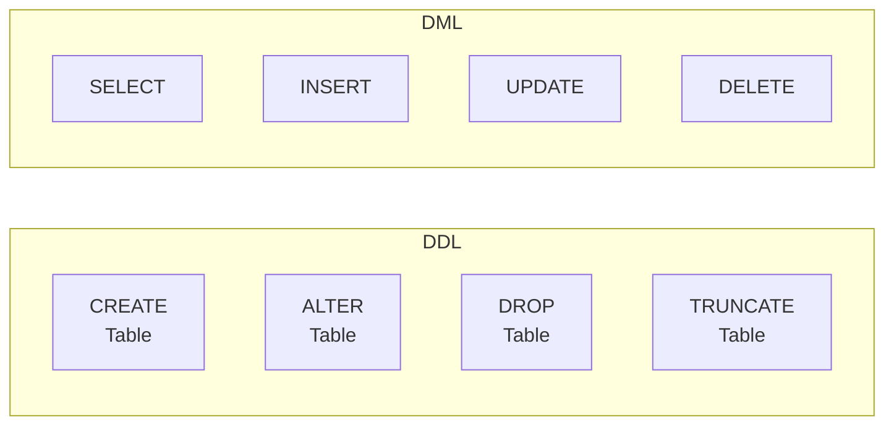
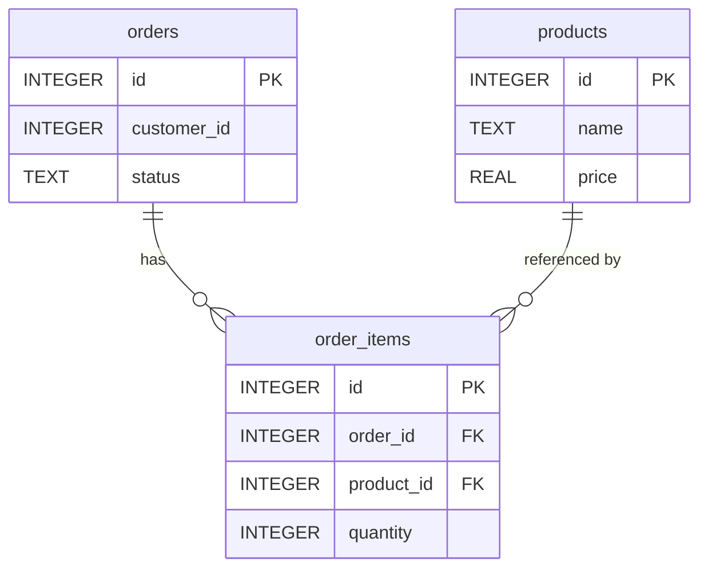

# Lesson 16: DDL -- Creating and Altering Tables

In Lesson 15, we learned DML for adding/modifying/deleting data. Now we learn **DDL** (Data Definition Language) to create, alter, and drop tables themselves. We'll directly use the PK, FK, and data types learned in [Lesson 0](../beginner/00-introduction.md).

!!! note "Already familiar?"
    If you're comfortable with CREATE TABLE, ALTER TABLE, DROP TABLE, and constraints (PK, FK, CHECK, UNIQUE, NOT NULL), skip ahead to [Lesson 17: Transactions](17-transactions.md).



> **DML** deals with data inside tables, while **DDL** deals with tables themselves (structure). DDL statements are auto-committed in most databases and cannot be rolled back -- execute carefully.

| Category | Key Statements | Target |
|------|---------|------|
| DML | SELECT, INSERT, UPDATE, DELETE | Rows (data) |
| DDL | CREATE, ALTER, DROP, TRUNCATE | Tables, indexes, views, etc. (structure) |

## CREATE TABLE

### Basic Syntax

```sql
CREATE TABLE table_name (
    column1  datatype  constraints,
    column2  datatype  constraints,
    ...
);
```

A simple example -- let's create an order archive table:

```sql
CREATE TABLE order_archive (
    id            INTEGER PRIMARY KEY,
    order_id      INTEGER NOT NULL,
    customer_name TEXT    NOT NULL,
    total_amount  REAL,
    archived_at   TEXT    NOT NULL
);
```

## Data Types

Supported data types vary by database. Here are the most commonly used types.

=== "SQLite"
    SQLite uses a dynamic type system (**type affinity**). Regardless of what type you declare for a column, data is actually stored as one of 5 storage classes.

    | Storage Class | Purpose | Example |
    |-------------|------|------|
    | TEXT | Strings, dates | Names, emails, ISO dates |
    | INTEGER | Integers, booleans | IDs, quantities, 0/1 flags |
    | REAL | Floating point | Prices, ratios |
    | BLOB | Binary data | Images, files |
    | NUMERIC | Flexible type | Stored as INTEGER or REAL |

    ```sql
    CREATE TABLE temp_products (
        id          INTEGER PRIMARY KEY,
        name        TEXT    NOT NULL,
        price       REAL    NOT NULL,
        stock_qty   INTEGER DEFAULT 0,
        is_active   INTEGER DEFAULT 1,
        created_at  TEXT    DEFAULT (datetime('now'))
    );
    ```

=== "MySQL"
    MySQL uses a strict type system and provides various specialized types.

    | Type | Purpose | Notes |
    |------|------|------|
    | VARCHAR(n) | Variable-length string | Max 65,535 bytes |
    | INT | Integer | 4 bytes, -2B to +2B |
    | BIGINT | Large integer | 8 bytes |
    | DECIMAL(p,s) | Fixed point | `DECIMAL(10,2)` -- for prices |
    | DATE | Date | `'2025-03-15'` |
    | DATETIME | Date+time | `'2025-03-15 14:30:00'` |
    | BOOLEAN | True/false | Alias for TINYINT(1) |
    | TEXT | Long string | Max 65,535 bytes |

    ```sql
    CREATE TABLE temp_products (
        id          INT AUTO_INCREMENT PRIMARY KEY,
        name        VARCHAR(200)   NOT NULL,
        price       DECIMAL(10, 2) NOT NULL,
        stock_qty   INT            DEFAULT 0,
        is_active   BOOLEAN        DEFAULT TRUE,
        created_at  DATETIME       DEFAULT CURRENT_TIMESTAMP
    );
    ```

=== "PostgreSQL"
    PostgreSQL provides a rich type system with strict type checking.

    | Type | Purpose | Notes |
    |------|------|------|
    | VARCHAR(n) | Variable-length string | Or TEXT (no limit) |
    | INTEGER | Integer | 4 bytes |
    | BIGINT | Large integer | 8 bytes |
    | NUMERIC(p,s) | Fixed point | `NUMERIC(10,2)` -- for prices |
    | DATE | Date | `'2025-03-15'` |
    | TIMESTAMP | Date+time | Timezone optional |
    | BOOLEAN | True/false | TRUE / FALSE literals |
    | TEXT | Unlimited-length string | Preferred over VARCHAR in PG |

    ```sql
    CREATE TABLE temp_products (
        id          INTEGER GENERATED ALWAYS AS IDENTITY PRIMARY KEY,
        name        VARCHAR(200)   NOT NULL,
        price       NUMERIC(10, 2) NOT NULL,
        stock_qty   INTEGER        DEFAULT 0,
        is_active   BOOLEAN        DEFAULT TRUE,
        created_at  TIMESTAMP      DEFAULT CURRENT_TIMESTAMP
    );
    ```

## Column Constraints

Constraints define rules for what values can be stored in a column. They prevent invalid data at the database level.

| Constraint | Meaning | Example |
|----------|------|------|
| NOT NULL | NULL values not allowed | `name TEXT NOT NULL` |
| DEFAULT | Use default when no value specified | `is_active INTEGER DEFAULT 1` |
| UNIQUE | Duplicate values not allowed | `email VARCHAR(200) UNIQUE` |
| CHECK | Must satisfy condition to insert/update | `CHECK (price >= 0)` |

### NOT NULL

A column marked `NOT NULL` cannot have NULL values. Attempting to insert or update with NULL causes an error.

```sql
CREATE TABLE temp_customers (
    id    INTEGER PRIMARY KEY,
    name  TEXT NOT NULL,       -- required
    email TEXT NOT NULL,       -- required
    phone TEXT                 -- optional (NULL allowed)
);
```

### DEFAULT

Defines a default value to use when no value is specified.

=== "SQLite"
    ```sql
    CREATE TABLE temp_orders (
        id         INTEGER PRIMARY KEY,
        status     TEXT    NOT NULL DEFAULT 'pending',
        quantity   INTEGER NOT NULL DEFAULT 1,
        created_at TEXT    DEFAULT (datetime('now'))
    );

    -- Insert without specifying status, quantity, created_at
    INSERT INTO temp_orders (id) VALUES (1);
    -- Result: status='pending', quantity=1, created_at=current time
    ```

=== "MySQL"
    ```sql
    CREATE TABLE temp_orders (
        id         INT AUTO_INCREMENT PRIMARY KEY,
        status     VARCHAR(20) NOT NULL DEFAULT 'pending',
        quantity   INT         NOT NULL DEFAULT 1,
        created_at DATETIME    DEFAULT CURRENT_TIMESTAMP
    );
    ```

=== "PostgreSQL"
    ```sql
    CREATE TABLE temp_orders (
        id         INTEGER GENERATED ALWAYS AS IDENTITY PRIMARY KEY,
        status     VARCHAR(20) NOT NULL DEFAULT 'pending',
        quantity   INTEGER     NOT NULL DEFAULT 1,
        created_at TIMESTAMP   DEFAULT CURRENT_TIMESTAMP
    );
    ```

### UNIQUE

Does not allow duplicate values. In most databases, NULLs are excluded from unique checks.

```sql
CREATE TABLE temp_users (
    id       INTEGER PRIMARY KEY,
    username TEXT NOT NULL UNIQUE,
    email    TEXT NOT NULL UNIQUE
);

-- Success
INSERT INTO temp_users VALUES (1, 'alice', 'alice@testmail.kr');

-- Failure: duplicate username
INSERT INTO temp_users VALUES (2, 'alice', 'bob@testmail.kr');
```

### CHECK

The row can only be inserted/updated if the value satisfies the condition.

```sql
CREATE TABLE temp_products (
    id        INTEGER PRIMARY KEY,
    name      TEXT    NOT NULL,
    price     REAL    NOT NULL CHECK (price > 0),
    stock_qty INTEGER NOT NULL CHECK (stock_qty >= 0),
    rating    REAL    CHECK (rating BETWEEN 1.0 AND 5.0)
);

-- Success
INSERT INTO temp_products VALUES (1, 'Keyboard', 49.99, 100, 4.5);

-- Failure: price must be greater than 0
INSERT INTO temp_products VALUES (2, 'Mouse', -10.00, 50, 3.0);
```

## PRIMARY KEY and Auto-Increment

A primary key uniquely identifies each row in a table. With auto-increment, you don't need to manually provide IDs when inserting new rows.

=== "SQLite"
    ```sql
    -- AUTOINCREMENT: prevents reuse of previously used IDs
    CREATE TABLE event_log (
        id         INTEGER PRIMARY KEY AUTOINCREMENT,
        event_type TEXT NOT NULL,
        message    TEXT,
        created_at TEXT NOT NULL
    );

    -- Omitting id in INSERT triggers auto-increment
    INSERT INTO event_log (event_type, message, created_at)
    VALUES ('LOGIN', '고객 로그인', datetime('now'));
    ```

    > In SQLite, declaring just `INTEGER PRIMARY KEY` (without AUTOINCREMENT) enables auto-increment, but deleted IDs may be reused. Adding `AUTOINCREMENT` prevents reuse.

=== "MySQL"
    ```sql
    CREATE TABLE event_log (
        id         INT AUTO_INCREMENT PRIMARY KEY,
        event_type VARCHAR(50)  NOT NULL,
        message    TEXT,
        created_at DATETIME     NOT NULL
    );

    INSERT INTO event_log (event_type, message, created_at)
    VALUES ('LOGIN', '고객 로그인', NOW());
    ```

=== "PostgreSQL"
    ```sql
    -- Latest standard syntax (GENERATED ALWAYS AS IDENTITY)
    CREATE TABLE event_log (
        id         INTEGER GENERATED ALWAYS AS IDENTITY PRIMARY KEY,
        event_type VARCHAR(50)  NOT NULL,
        message    TEXT,
        created_at TIMESTAMP    NOT NULL
    );

    INSERT INTO event_log (event_type, message, created_at)
    VALUES ('LOGIN', '고객 로그인', NOW());
    ```

    > In PostgreSQL, the `SERIAL` type also supports auto-increment, but `GENERATED ALWAYS AS IDENTITY` is closer to the SQL standard and recommended.

### Composite Primary Key

When a single column cannot uniquely identify a row, combine multiple columns.

```sql
-- A student can enroll in the same course only once
CREATE TABLE enrollments (
    student_id  INTEGER NOT NULL,
    course_id   INTEGER NOT NULL,
    enrolled_at TEXT,
    PRIMARY KEY (student_id, course_id)
);
```

## FOREIGN KEY -- Referential Integrity

A foreign key enforces that a column in one table references the primary key of another table. The database automatically blocks references to non-existent values.



> `order_items.order_id` references `orders.id`, and `order_items.product_id` references `products.id`.

### Basic Declaration

```sql
CREATE TABLE temp_order_items (
    id         INTEGER PRIMARY KEY,
    order_id   INTEGER NOT NULL,
    product_id INTEGER NOT NULL,
    quantity   INTEGER NOT NULL CHECK (quantity > 0),
    unit_price REAL    NOT NULL,
    FOREIGN KEY (order_id)   REFERENCES orders (id),
    FOREIGN KEY (product_id) REFERENCES products (id)
);
```

Now inserting an `order_id` that doesn't exist in the `orders` table will cause an error.

> **SQLite note:** Foreign key checking is disabled by default in SQLite. You must first run `PRAGMA foreign_keys = ON;`.

### ON DELETE -- Behavior When Parent Row Is Deleted

You can define how child rows are handled when a parent row is deleted.

| Option | Behavior |
|------|------|
| RESTRICT (default) | Refuse parent deletion if child rows exist |
| CASCADE | Delete child rows when parent is deleted |
| SET NULL | Set child FK column to NULL when parent is deleted |

```sql
CREATE TABLE temp_reviews (
    id         INTEGER PRIMARY KEY,
    product_id INTEGER NOT NULL,
    customer_id INTEGER,
    rating     INTEGER NOT NULL CHECK (rating BETWEEN 1 AND 5),
    content    TEXT,
    FOREIGN KEY (product_id)  REFERENCES products (id) ON DELETE CASCADE,
    FOREIGN KEY (customer_id) REFERENCES customers (id) ON DELETE SET NULL
);
```

- When a product is deleted, its reviews are also **deleted together** (CASCADE).
- When a customer is deleted, reviews remain but `customer_id` is changed to **NULL** (SET NULL).

### Foreign Key Settings by Database

=== "SQLite"
    ```sql
    -- SQLite requires enabling foreign key checks per connection
    PRAGMA foreign_keys = ON;
    ```

    > SQLite has foreign keys **disabled by default**. You must run `PRAGMA foreign_keys = ON;` at the start of each session.

=== "MySQL"
    ```sql
    -- Foreign keys are enabled by default in the InnoDB engine
    CREATE TABLE temp_order_items (
        id          INT AUTO_INCREMENT PRIMARY KEY,
        order_id    INT NOT NULL,
        product_id  INT NOT NULL,
        quantity    INT NOT NULL DEFAULT 1,
        FOREIGN KEY (order_id)   REFERENCES orders (id) ON DELETE CASCADE,
        FOREIGN KEY (product_id) REFERENCES products (id) ON DELETE RESTRICT
    ) ENGINE=InnoDB;
    ```

=== "PostgreSQL"
    ```sql
    -- PostgreSQL always has foreign keys enabled
    CREATE TABLE temp_order_items (
        id          INTEGER GENERATED ALWAYS AS IDENTITY PRIMARY KEY,
        order_id    INTEGER NOT NULL,
        product_id  INTEGER NOT NULL,
        quantity    INTEGER NOT NULL DEFAULT 1,
        FOREIGN KEY (order_id)   REFERENCES orders (id) ON DELETE CASCADE,
        FOREIGN KEY (product_id) REFERENCES products (id) ON DELETE RESTRICT
    );
    ```

## ALTER TABLE

Modifies the structure of an existing table. Support varies by database.

### ADD COLUMN -- Adding a Column

=== "SQLite"
    ```sql
    ALTER TABLE order_archive ADD COLUMN reason TEXT;
    ```

    > In SQLite, you cannot add a `NOT NULL` constraint to a new column (since existing rows would have NULL). It's possible if you also specify `DEFAULT`.

    ```sql
    ALTER TABLE order_archive ADD COLUMN status TEXT NOT NULL DEFAULT 'archived';
    ```

=== "MySQL"
    ```sql
    ALTER TABLE order_archive ADD COLUMN reason TEXT;

    -- MySQL can specify column position
    ALTER TABLE order_archive ADD COLUMN status VARCHAR(20) NOT NULL DEFAULT 'archived' AFTER total_amount;
    ```

=== "PostgreSQL"
    ```sql
    ALTER TABLE order_archive ADD COLUMN reason TEXT;
    ALTER TABLE order_archive ADD COLUMN status VARCHAR(20) NOT NULL DEFAULT 'archived';
    ```

### RENAME COLUMN -- Renaming a Column

=== "SQLite"
    ```sql
    -- Supported since SQLite 3.25.0+ (Sep 2018)
    ALTER TABLE order_archive RENAME COLUMN customer_name TO customer_full_name;
    ```

=== "MySQL"
    ```sql
    -- Supported since MySQL 8.0+
    ALTER TABLE order_archive RENAME COLUMN customer_name TO customer_full_name;
    ```

=== "PostgreSQL"
    ```sql
    ALTER TABLE order_archive RENAME COLUMN customer_name TO customer_full_name;
    ```

### DROP COLUMN -- Dropping a Column

=== "SQLite"
    ```sql
    -- Supported since SQLite 3.35.0+ (Mar 2021)
    ALTER TABLE order_archive DROP COLUMN reason;
    ```

    > Older SQLite versions do not support `DROP COLUMN`. In that case, you must create a new table, copy data, then drop the original table.

=== "MySQL"
    ```sql
    ALTER TABLE order_archive DROP COLUMN reason;
    ```

=== "PostgreSQL"
    ```sql
    ALTER TABLE order_archive DROP COLUMN reason;
    ```

### RENAME TABLE -- Renaming a Table

=== "SQLite"
    ```sql
    ALTER TABLE order_archive RENAME TO old_order_archive;
    ```

=== "MySQL"
    ```sql
    ALTER TABLE order_archive RENAME TO old_order_archive;
    -- Or
    RENAME TABLE order_archive TO old_order_archive;
    ```

=== "PostgreSQL"
    ```sql
    ALTER TABLE order_archive RENAME TO old_order_archive;
    ```

## DROP TABLE

Completely deletes a table. Both the structure and all data are gone.

```sql
DROP TABLE order_archive;
```

If the table doesn't exist, an error occurs. Use `IF EXISTS` for safe deletion:

```sql
DROP TABLE IF EXISTS order_archive;
```

> **Warning:** `DROP TABLE` cannot be undone. In production, always verify backups before executing. Tables referenced by foreign keys require dropping child tables first or removing the foreign keys.

## TRUNCATE TABLE

`TRUNCATE TABLE` **deletes all rows** from a table while keeping the table structure (columns, constraints, indexes) intact. Similar to `DELETE FROM table_name` but works differently.

### Comparing DELETE and TRUNCATE

| Feature | DELETE | TRUNCATE |
|------|--------|----------|
| WHERE clause | Supported | Not supported |
| Transaction rollback | Supported | Depends on DB |
| Trigger execution | Executed | Not executed |
| Speed (large data) | Slow | Fast |
| Auto-increment | Preserved | Reset |

`DELETE` deletes rows one by one and logs each row, while `TRUNCATE` deallocates data pages entirely, making it much faster for large datasets.

### Syntax by Database

=== "SQLite"
    SQLite does not support the `TRUNCATE TABLE` statement. Use `DELETE FROM` instead.

    ```sql
    -- Delete all rows (keep table structure)
    DELETE FROM order_archive;

    -- Run VACUUM to reclaim disk space
    VACUUM;
    ```

    > In SQLite, `DELETE FROM table_name` deletes all rows but the file size doesn't shrink. You need to run `VACUUM` to actually reclaim disk space.

=== "MySQL"
    ```sql
    TRUNCATE TABLE order_archive;
    ```

    > In MySQL, `TRUNCATE` is **treated as DDL**. An implicit COMMIT is executed, so it cannot be rolled back with `ROLLBACK`. The `AUTO_INCREMENT` value is reset.

=== "PostgreSQL"
    ```sql
    -- Basic TRUNCATE
    TRUNCATE TABLE order_archive;

    -- Also reset sequence (auto-increment value)
    TRUNCATE TABLE order_archive RESTART IDENTITY;

    -- Also TRUNCATE child tables referenced by foreign keys
    TRUNCATE TABLE order_archive CASCADE;
    ```

    > PostgreSQL's `TRUNCATE` can be rolled back within a transaction. `RESTART IDENTITY` resets sequences, and `CASCADE` empties referencing child tables as well.

## CREATE TABLE AS SELECT (CTAS)

Creates a new table from the result of an existing query. Useful for data backups, analysis snapshots, and temporary work tables.

=== "SQLite / PostgreSQL"
    ```sql
    -- Copy 2024 orders to an archive table
    CREATE TABLE orders_2024 AS
    SELECT
        o.id,
        o.customer_id,
        c.name AS customer_name,
        o.total_amount,
        o.status,
        o.ordered_at
    FROM orders AS o
    JOIN customers AS c ON o.customer_id = c.id
    WHERE o.ordered_at >= '2024-01-01'
      AND o.ordered_at <  '2025-01-01';
    ```

=== "MySQL"
    ```sql
    -- Copy 2024 orders to an archive table
    CREATE TABLE orders_2024 AS
    SELECT
        o.id,
        o.customer_id,
        c.name AS customer_name,
        o.total_amount,
        o.status,
        o.ordered_at
    FROM orders AS o
    JOIN customers AS c ON o.customer_id = c.id
    WHERE o.ordered_at >= '2024-01-01'
      AND o.ordered_at <  '2025-01-01';
    ```

```sql
-- Create a summary table for reporting
CREATE TABLE category_summary AS
SELECT
    cat.name            AS category,
    COUNT(p.id)         AS product_count,
    ROUND(AVG(p.price), 2) AS avg_price,
    SUM(p.stock_qty)    AS total_stock
FROM categories cat
LEFT JOIN products p ON p.category_id = cat.id
GROUP BY cat.name;
```

> **Note:** Tables created with CTAS do not inherit constraints (PRIMARY KEY, FOREIGN KEY, NOT NULL, etc.) from the source table. Useful for archives, reporting snapshots, and storing complex query results. Add constraints separately with `ALTER TABLE` if needed.

## SEQUENCE

A **sequence** is an independent object that generates unique sequential numbers. Unlike table auto-increment columns, you can get a number before INSERT or share a single numbering system across multiple tables.

### Database Support

| DB | Sequence Support | Alternative |
|----|:----------:|------|
| SQLite | :x: | `INTEGER PRIMARY KEY AUTOINCREMENT` (ROWID 기반) |
| MySQL | :x: | `AUTO_INCREMENT` (테이블 칼럼에 종속) |
| PostgreSQL | :white_check_mark: | `CREATE SEQUENCE` (독립 객체) |

> Most enterprise databases like Oracle and SQL Server also support sequences.

### PostgreSQL Sequence Usage

```sql
-- Create sequence
CREATE SEQUENCE order_seq
    START WITH 1
    INCREMENT BY 1;

-- Get next value
SELECT NEXTVAL('order_seq');  -- 1, 2, 3, ...

-- Check current value (only available after calling NEXTVAL at least once)
SELECT CURRVAL('order_seq');

-- Use in INSERT
INSERT INTO orders (id, customer_id, status)
VALUES (NEXTVAL('order_seq'), 100, 'pending');
```

### When Sequences Are Useful

1. **When you need the ID before INSERT** -- Generate order number first, then insert order + order details simultaneously
2. **When sharing numbers across tables** -- Orders/returns/exchanges use a single serial number system
3. **When number gaps are needed** -- Use `INCREMENT BY 10` to reserve gaps

### Sequence Management

```sql
-- Drop sequence
DROP SEQUENCE IF EXISTS order_seq;

-- Reset sequence value
ALTER SEQUENCE order_seq RESTART WITH 1;

-- List sequences (PostgreSQL)
SELECT sequence_name
FROM information_schema.sequences
WHERE sequence_schema = 'public';
```

!!! tip "Auto-increment vs Sequence"
    If the goal is auto-generating PKs for a single table, `GENERATED ALWAYS AS IDENTITY` (PostgreSQL) or `AUTO_INCREMENT` (MySQL) is sufficient. Sequences are more flexible but add management overhead, so use them only when needed.

## Summary

| DDL Statement | Purpose | Example |
|--------|------|------|
| CREATE TABLE | Create a new table | `CREATE TABLE t (id INT PRIMARY KEY, ...)` |
| ALTER TABLE ADD COLUMN | Add a column | `ALTER TABLE t ADD COLUMN col TEXT` |
| ALTER TABLE RENAME COLUMN | Rename a column | `ALTER TABLE t RENAME COLUMN a TO b` |
| ALTER TABLE DROP COLUMN | Drop a column | `ALTER TABLE t DROP COLUMN col` |
| ALTER TABLE RENAME TO | Rename a table | `ALTER TABLE t RENAME TO new_t` |
| DROP TABLE | Drop a table | `DROP TABLE IF EXISTS t` |
| TRUNCATE TABLE | Delete all rows (keep structure) | `TRUNCATE TABLE t` |
| CREATE TABLE AS SELECT | Create table from query result | `CREATE TABLE t AS SELECT ...` |
| CREATE SEQUENCE | Sequential number generator (PG) | `CREATE SEQUENCE seq START WITH 1` |

!!! note "Lesson Review Problems"
    These are simple problems to immediately test the concepts from this lesson. For comprehensive practice combining multiple concepts, see the [Practice Problems](../exercises/index.md) section.

## Practice Problems
### Problem 1
Create a `temp_employees` table. Columns: `id` (auto-increment primary key), `name` (required, string), `email` (required, UNIQUE, string), `department` (string, default `'General'`), `hire_date` (string/date).

??? success "Answer"
    === "SQLite"
        ```sql
        CREATE TABLE temp_employees (
            id         INTEGER PRIMARY KEY AUTOINCREMENT,
            name       TEXT NOT NULL,
            email      TEXT NOT NULL UNIQUE,
            department TEXT DEFAULT 'General',
            hire_date  TEXT
        );
        ```

    === "MySQL"
        ```sql
        CREATE TABLE temp_employees (
            id         INT AUTO_INCREMENT PRIMARY KEY,
            name       VARCHAR(200) NOT NULL,
            email      VARCHAR(200) NOT NULL UNIQUE,
            department VARCHAR(100) DEFAULT 'General',
            hire_date  DATE
        );
        ```

    === "PostgreSQL"
        ```sql
        CREATE TABLE temp_employees (
            id         INTEGER GENERATED ALWAYS AS IDENTITY PRIMARY KEY,
            name       VARCHAR(200) NOT NULL,
            email      VARCHAR(200) NOT NULL UNIQUE,
            department VARCHAR(100) DEFAULT 'General',
            hire_date  DATE
        );
        ```


### Problem 2
Add a `phone` column (string, optional) to the `temp_employees` table, then rename the `department` column to `dept`.

??? success "Answer"
    ```sql
    ALTER TABLE temp_employees ADD COLUMN phone TEXT;

    ALTER TABLE temp_employees RENAME COLUMN department TO dept;
    ```


### Problem 3
Create a `temp_order_log` table with a **composite primary key**. (`order_id`, `log_seq`) is the composite PK. Columns: `order_id` (integer, required), `log_seq` (integer, required), `action` (string, required, only `'created'`, `'shipped'`, `'delivered'`, `'cancelled'` allowed), `logged_at` (default: current time).

??? success "Answer"
    === "SQLite"
        ```sql
        CREATE TABLE temp_order_log (
            order_id  INTEGER NOT NULL,
            log_seq   INTEGER NOT NULL,
            action    TEXT    NOT NULL CHECK (action IN ('created', 'shipped', 'delivered', 'cancelled')),
            logged_at TEXT    DEFAULT (datetime('now')),
            PRIMARY KEY (order_id, log_seq)
        );
        ```

    === "MySQL"
        ```sql
        CREATE TABLE temp_order_log (
            order_id  INT         NOT NULL,
            log_seq   INT         NOT NULL,
            action    VARCHAR(20) NOT NULL CHECK (action IN ('created', 'shipped', 'delivered', 'cancelled')),
            logged_at DATETIME    DEFAULT CURRENT_TIMESTAMP,
            PRIMARY KEY (order_id, log_seq)
        );
        ```

    === "PostgreSQL"
        ```sql
        CREATE TABLE temp_order_log (
            order_id  INTEGER     NOT NULL,
            log_seq   INTEGER     NOT NULL,
            action    VARCHAR(20) NOT NULL CHECK (action IN ('created', 'shipped', 'delivered', 'cancelled')),
            logged_at TIMESTAMP   DEFAULT CURRENT_TIMESTAMP,
            PRIMARY KEY (order_id, log_seq)
        );
        ```


### Problem 4
Explain the difference between `DELETE FROM` and `TRUNCATE TABLE`. Then write the syntax to delete all data from the `order_archive` table for each database.

??? success "Answer"
    **Differences:**

    - `DELETE` deletes row by row with transaction log entries, and can delete a subset with WHERE. Triggers are executed, and auto-increment values are preserved.
    - `TRUNCATE` deallocates data pages entirely making it much faster, and cannot use WHERE. Triggers are not executed, and auto-increment values are reset.

    === "SQLite"
        ```sql
        -- SQLite does not support TRUNCATE, use DELETE instead
        DELETE FROM order_archive;

        -- If disk space reclamation is needed
        VACUUM;
        ```

    === "MySQL"
        ```sql
        TRUNCATE TABLE order_archive;
        ```

    === "PostgreSQL"
        ```sql
        -- Basic TRUNCATE
        TRUNCATE TABLE order_archive;

        -- To also reset sequences
        TRUNCATE TABLE order_archive RESTART IDENTITY;
        ```


### Problem 5
Create a `price_history` table to store product price history. Columns: `id` (integer, auto-increment primary key), `product_id` (integer, NOT NULL), `old_price`, `new_price` (both real, NOT NULL), `changed_at` (NOT NULL). `new_price` must be >= 0 (CHECK). `product_id` is a foreign key referencing `products(id)`.

??? success "Answer"
    === "SQLite"
        ```sql
        CREATE TABLE price_history (
            id         INTEGER PRIMARY KEY AUTOINCREMENT,
            product_id INTEGER NOT NULL,
            old_price  REAL    NOT NULL,
            new_price  REAL    NOT NULL CHECK (new_price >= 0),
            changed_at TEXT    NOT NULL,
            FOREIGN KEY (product_id) REFERENCES products (id)
        );
        ```

    === "MySQL"
        ```sql
        CREATE TABLE price_history (
            id         INT AUTO_INCREMENT PRIMARY KEY,
            product_id INT            NOT NULL,
            old_price  DECIMAL(12,2)  NOT NULL,
            new_price  DECIMAL(12,2)  NOT NULL CHECK (new_price >= 0),
            changed_at DATETIME       NOT NULL,
            FOREIGN KEY (product_id) REFERENCES products (id)
        );
        ```

    === "PostgreSQL"
        ```sql
        CREATE TABLE price_history (
            id         INTEGER GENERATED ALWAYS AS IDENTITY PRIMARY KEY,
            product_id INTEGER       NOT NULL,
            old_price  NUMERIC(12,2) NOT NULL,
            new_price  NUMERIC(12,2) NOT NULL CHECK (new_price >= 0),
            changed_at TIMESTAMP     NOT NULL,
            FOREIGN KEY (product_id) REFERENCES products (id)
        );
        ```


### Problem 6
Find the errors in the following table definition and fix them.

```sql
CREATE TABLE temp_inventory (
    product_id INTEGER,
    warehouse  TEXT,
    quantity   INTEGER DEFAULT -1,
    updated_at TEXT
);
```

??? success "Answer"
    Three issues: (1) no primary key, (2) quantity default of -1 is unrealistic, (3) product_id is missing NOT NULL. Fixed version:

    ```sql
    CREATE TABLE temp_inventory (
        id         INTEGER PRIMARY KEY,
        product_id INTEGER NOT NULL,
        warehouse  TEXT    NOT NULL,
        quantity   INTEGER NOT NULL DEFAULT 0 CHECK (quantity >= 0),
        updated_at TEXT,
        FOREIGN KEY (product_id) REFERENCES products (id)
    );
    ```


### Problem 7
Drop the `event_participants` table. Write it so no error occurs even if the table doesn't exist.

??? success "Answer"
    ```sql
    DROP TABLE IF EXISTS event_participants;
    ```


### Problem 8
Create a table for storing order items. `quantity` must be >= 1, `unit_price` must be >= 0. `order_id` references `orders(id)`, `product_id` references `products(id)`. When an order is deleted, order items should be deleted too (CASCADE). When a product is deleted, `product_id` should be set to NULL (SET NULL).

??? success "Answer"
    ```sql
    CREATE TABLE temp_order_details (
        id         INTEGER PRIMARY KEY,
        order_id   INTEGER NOT NULL,
        product_id INTEGER,
        quantity   INTEGER NOT NULL CHECK (quantity >= 1),
        unit_price REAL    NOT NULL CHECK (unit_price >= 0),
        FOREIGN KEY (order_id)   REFERENCES orders (id)   ON DELETE CASCADE,
        FOREIGN KEY (product_id) REFERENCES products (id)  ON DELETE SET NULL
    );
    ```
    `product_id` must not have `NOT NULL` since `SET NULL` is applied -- it needs to be nullable.


### Problem 9
Create a `gold_customers` table with CTAS containing GOLD grade customers' `id`, `name`, `email`, `grade`, then add a `note` column (string, no default) with `ALTER TABLE`.

??? success "Answer"
    ```sql
    -- 1. Create table with CTAS
    CREATE TABLE gold_customers AS
    SELECT id, name, email, grade
    FROM customers
    WHERE grade = 'GOLD';

    -- 2. Add column
    ALTER TABLE gold_customers ADD COLUMN note TEXT;
    ```


### Problem 10
Create a `product_audit` table that satisfies the following requirements:

- `id`: Auto-increment primary key
- `product_id`: Integer, NOT NULL, foreign key referencing `products(id)`
- `action`: String, NOT NULL, only 'INSERT', 'UPDATE', 'DELETE' allowed (CHECK)
- `old_price`: Real (NULL allowed)
- `new_price`: Real (NULL allowed)
- `changed_by`: String, NOT NULL
- `changed_at`: NOT NULL, default is current time

??? success "Answer"
    === "SQLite"
        ```sql
        CREATE TABLE product_audit (
            id          INTEGER PRIMARY KEY AUTOINCREMENT,
            product_id  INTEGER NOT NULL,
            action      TEXT    NOT NULL CHECK (action IN ('INSERT', 'UPDATE', 'DELETE')),
            old_price   REAL,
            new_price   REAL,
            changed_by  TEXT    NOT NULL,
            changed_at  TEXT    NOT NULL DEFAULT (datetime('now')),
            FOREIGN KEY (product_id) REFERENCES products (id)
        );
        ```

    === "MySQL"
        ```sql
        CREATE TABLE product_audit (
            id          INT AUTO_INCREMENT PRIMARY KEY,
            product_id  INT           NOT NULL,
            action      VARCHAR(10)   NOT NULL CHECK (action IN ('INSERT', 'UPDATE', 'DELETE')),
            old_price   DECIMAL(12,2),
            new_price   DECIMAL(12,2),
            changed_by  VARCHAR(100)  NOT NULL,
            changed_at  DATETIME      NOT NULL DEFAULT NOW(),
            FOREIGN KEY (product_id) REFERENCES products (id)
        );
        ```

    === "PostgreSQL"
        ```sql
        CREATE TABLE product_audit (
            id          INTEGER GENERATED ALWAYS AS IDENTITY PRIMARY KEY,
            product_id  INTEGER       NOT NULL,
            action      VARCHAR(10)   NOT NULL CHECK (action IN ('INSERT', 'UPDATE', 'DELETE')),
            old_price   NUMERIC(12,2),
            new_price   NUMERIC(12,2),
            changed_by  VARCHAR(100)  NOT NULL,
            changed_at  TIMESTAMP     NOT NULL DEFAULT NOW(),
            FOREIGN KEY (product_id) REFERENCES products (id)
        );
        ```


### Problem 11
In PostgreSQL, create a sequence named `invoice_seq`. It starts at 1000 and increments by 1. Then write an INSERT statement to insert a row into the `invoices` table using this sequence. Columns: `id` (sequence value), `order_id` (integer), `issued_at` (current time).

??? success "Answer"
    ```sql
    -- Create sequence
    CREATE SEQUENCE invoice_seq
        START WITH 1000
        INCREMENT BY 1;

    -- Create table
    CREATE TABLE invoices (
        id        INTEGER PRIMARY KEY,
        order_id  INTEGER NOT NULL,
        issued_at TIMESTAMP NOT NULL DEFAULT CURRENT_TIMESTAMP
    );

    -- INSERT using sequence
    INSERT INTO invoices (id, order_id, issued_at)
    VALUES (NEXTVAL('invoice_seq'), 1001, CURRENT_TIMESTAMP);

    -- Verify
    SELECT * FROM invoices;

    -- Cleanup
    DROP TABLE IF EXISTS invoices;
    DROP SEQUENCE IF EXISTS invoice_seq;
    ```

    > SQLite and MySQL do not support sequences, so this is a PostgreSQL-only problem.


### Scoring Guide

| Score | Next Step |
|:----:|----------|
| **10-11** | Move on to [Lesson 17: Transactions](17-transactions.md) |
| **8-9** | Review the explanations for incorrect answers, then proceed |
| **Half or fewer** | Re-read this lesson |
| **3 or fewer** | Start again from [Lesson 15: DML](15-dml.md) |

**Problem Areas:**

| Area | Problems |
|------|:--------:|
| CREATE TABLE + constraints | 1, 3, 5, 10 |
| ALTER TABLE (ADD/RENAME) | 2 |
| DELETE vs TRUNCATE | 4 |
| DDL issue identification + fix | 6 |
| DROP TABLE IF EXISTS | 7 |
| FOREIGN KEY ON DELETE options | 8 |
| CTAS (CREATE TABLE AS SELECT) | 9 |
| SEQUENCE | 11 |

---
Next: [Lesson 17: Transactions and ACID](17-transactions.md)
