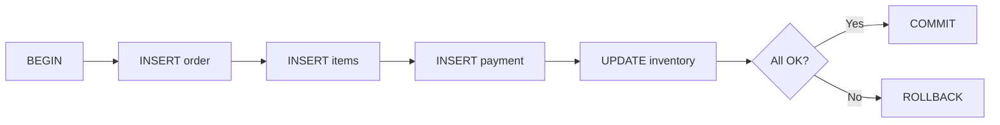
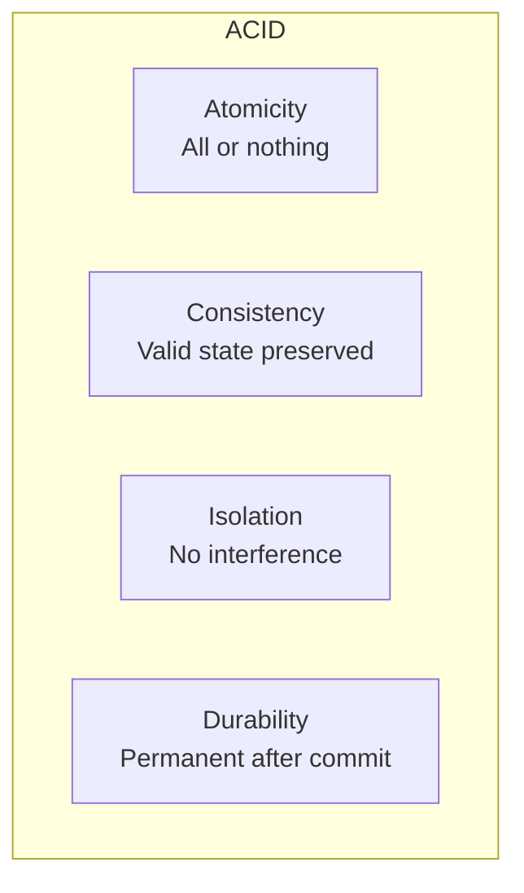

# Lesson 16: Transactions and ACID

In Lesson 15 you learned DDL for creating and altering tables. In real-world applications, most operations involve **multiple SQL statements that must succeed or fail together**. For example, processing an order requires inserting into orders, order_items, and payments, then updating inventory. If any step fails, everything must be undone. This is what **transactions** provide.



> A **transaction** is a group of SQL statements treated as a single logical unit of work. Either all statements succeed (COMMIT) or all are undone (ROLLBACK), ensuring data consistency.

---

## ACID Properties

Every transaction must satisfy four properties known as **ACID**.

| Property | Meaning |
|----------|---------|
| Atomicity | All operations in a transaction succeed **or none do** — no partial state |
| Consistency | The database moves from one **valid state to another** (all constraints satisfied) |
| Isolation | Concurrent transactions **do not interfere** with each other |
| Durability | Once committed, changes **survive** system crashes and power failures |



> Think of a bank transfer: deducting from account A and crediting account B must both complete or both roll back. Otherwise money disappears or duplicates.

---

## BEGIN / COMMIT / ROLLBACK

These are the three fundamental transaction commands.

| Command | Purpose |
|---------|---------|
| BEGIN | Start a transaction |
| COMMIT | Permanently save all changes made since BEGIN |
| ROLLBACK | Undo all changes made since BEGIN, restoring the previous state |

### Syntax by Database

=== "SQLite"
    ```sql
    BEGIN TRANSACTION;

    UPDATE products SET stock_qty = stock_qty - 1 WHERE id = 42;
    INSERT INTO order_items (order_id, product_id, quantity, unit_price)
    VALUES (1001, 42, 1, 89000);

    COMMIT;
    ```

    > SQLite accepts `BEGIN`, `BEGIN TRANSACTION`, and `BEGIN DEFERRED`.

=== "MySQL"
    ```sql
    START TRANSACTION;

    UPDATE products SET stock_qty = stock_qty - 1 WHERE id = 42;
    INSERT INTO order_items (order_id, product_id, quantity, unit_price)
    VALUES (1001, 42, 1, 89000);

    COMMIT;
    ```

    > MySQL uses `START TRANSACTION` or `BEGIN`.

=== "PostgreSQL"
    ```sql
    BEGIN;

    UPDATE products SET stock_qty = stock_qty - 1 WHERE id = 42;
    INSERT INTO order_items (order_id, product_id, quantity, unit_price)
    VALUES (1001, 42, 1, 89000);

    COMMIT;
    ```

    > PostgreSQL uses `BEGIN` or `BEGIN TRANSACTION`.

### ROLLBACK Example

If something goes wrong mid-transaction, ROLLBACK undoes everything.

```sql
BEGIN;

UPDATE products SET stock_qty = stock_qty - 1 WHERE id = 42;
INSERT INTO order_items (order_id, product_id, quantity, unit_price)
VALUES (1001, 42, 1, 89000);

-- Payment processing fails!
ROLLBACK;
-- The stock_qty change is also undone
```

---

## SAVEPOINT — Partial Rollback

A `SAVEPOINT` creates a **named checkpoint** within a transaction. You can roll back to that point without losing earlier work.


=== "SQLite"
    ```sql
    BEGIN TRANSACTION;

    INSERT INTO orders (id, order_number, customer_id, status, total_amount, ordered_at)
    VALUES (5001, 'ORD-5001', 100, 'pending', 178000, datetime('now'));

    SAVEPOINT sp_items;

    INSERT INTO order_items (order_id, product_id, quantity, unit_price)
    VALUES (5001, 10, 2, 89000);

    -- Second product out of stock → cancel this item only
    ROLLBACK TO sp_items;

    -- Re-add first product with adjusted quantity
    INSERT INTO order_items (order_id, product_id, quantity, unit_price)
    VALUES (5001, 10, 1, 89000);

    RELEASE sp_items;

    COMMIT;
    ```

=== "MySQL"
    ```sql
    START TRANSACTION;

    INSERT INTO orders (id, order_number, customer_id, status, total_amount, ordered_at)
    VALUES (5001, 'ORD-5001', 100, 'pending', 178000, NOW());

    SAVEPOINT sp_items;

    INSERT INTO order_items (order_id, product_id, quantity, unit_price)
    VALUES (5001, 10, 2, 89000);

    -- Second product out of stock → cancel this item only
    ROLLBACK TO SAVEPOINT sp_items;

    -- Re-add first product with adjusted quantity
    INSERT INTO order_items (order_id, product_id, quantity, unit_price)
    VALUES (5001, 10, 1, 89000);

    RELEASE SAVEPOINT sp_items;

    COMMIT;
    ```

=== "PostgreSQL"
    ```sql
    BEGIN;

    INSERT INTO orders (id, order_number, customer_id, status, total_amount, ordered_at)
    VALUES (5001, 'ORD-5001', 100, 'pending', 178000, NOW());

    SAVEPOINT sp_items;

    INSERT INTO order_items (order_id, product_id, quantity, unit_price)
    VALUES (5001, 10, 2, 89000);

    -- Second product out of stock → cancel this item only
    ROLLBACK TO SAVEPOINT sp_items;

    -- Re-add first product with adjusted quantity
    INSERT INTO order_items (order_id, product_id, quantity, unit_price)
    VALUES (5001, 10, 1, 89000);

    RELEASE SAVEPOINT sp_items;

    COMMIT;
    ```

> `RELEASE SAVEPOINT` removes the savepoint. It does **not** commit the transaction — the transaction remains open until COMMIT or ROLLBACK.

---

## Auto-Commit vs Explicit Transactions

Most databases default to **auto-commit mode**, where each SQL statement is automatically wrapped in its own transaction and committed immediately.

| Database | Default Behavior | Start Explicit Transaction | Notes |
|----------|-----------------|---------------------------|-------|
| SQLite | Auto-commit | `BEGIN TRANSACTION` | Each statement runs in an implicit transaction |
| MySQL | Auto-commit (`autocommit=1`) | `START TRANSACTION` | Can change with `SET autocommit=0` |
| PostgreSQL | Auto-commit | `BEGIN` | psql supports `\set AUTOCOMMIT off` |

**The problem with auto-commit:**

```sql
-- Auto-commit mode (default)
INSERT INTO orders (...) VALUES (...);       -- Committed immediately
INSERT INTO order_items (...) VALUES (...);  -- Error here!
-- The order exists but has no items → inconsistent data!
```

**Explicit transaction solves this:**

```sql
BEGIN;
INSERT INTO orders (...) VALUES (...);
INSERT INTO order_items (...) VALUES (...);  -- If this fails
ROLLBACK;  -- The orders INSERT is also undone → consistency preserved
```

> Always wrap multi-table operations in explicit transactions.

---

## Isolation Levels Overview

When multiple transactions run concurrently, the **isolation level** determines how much one transaction can see of another's uncommitted changes.

### Concurrency Problems

| Problem | Description |
|---------|-------------|
| Dirty Read | Reading uncommitted changes from another transaction |
| Non-Repeatable Read | Reading the same row twice and getting different values (another transaction updated and committed) |
| Phantom Read | Running the same query twice and getting different row counts (another transaction inserted and committed) |

### What Each Level Prevents

| Isolation Level | Dirty Read | Non-Repeatable Read | Phantom Read |
|-----------------|:----------:|:-------------------:|:------------:|
| READ UNCOMMITTED | Possible | Possible | Possible |
| READ COMMITTED | Prevented | Possible | Possible |
| REPEATABLE READ | Prevented | Prevented | Possible |
| SERIALIZABLE | Prevented | Prevented | Prevented |

> Higher isolation means more safety but less concurrency (slower performance under load).

### Default Isolation Level by Database

| Database | Default Level | Notes |
|----------|--------------|-------|
| SQLite | SERIALIZABLE | File-level locking; only one writer at a time |
| MySQL (InnoDB) | REPEATABLE READ | Uses MVCC; gap locks partially prevent phantoms |
| PostgreSQL | READ COMMITTED | Uses MVCC; change with `SET TRANSACTION ISOLATION LEVEL` |

> Deep topics like MVCC and locking strategies are beyond the scope of this tutorial. Understanding each level's meaning and your database's default is sufficient here.

---

## Practical Example — Order Processing

A customer orders two products and pays by credit card. This touches four tables in a single transaction.

=== "SQLite"
    ```sql
    BEGIN TRANSACTION;

    -- 1. Create the order
    INSERT INTO orders (id, order_number, customer_id, status, total_amount, ordered_at)
    VALUES (9001, 'ORD-9001', 55, 'confirmed', 267000, datetime('now'));

    -- 2. Order items (keyboard x1 + mouse x2)
    INSERT INTO order_items (order_id, product_id, quantity, unit_price)
    VALUES (9001, 101, 1, 89000);

    INSERT INTO order_items (order_id, product_id, quantity, unit_price)
    VALUES (9001, 205, 2, 89000);

    -- 3. Payment
    INSERT INTO payments (order_id, method, amount, status, paid_at)
    VALUES (9001, 'credit_card', 267000, 'completed', datetime('now'));

    -- 4. Deduct inventory
    UPDATE products SET stock_qty = stock_qty - 1 WHERE id = 101;
    UPDATE products SET stock_qty = stock_qty - 2 WHERE id = 205;

    COMMIT;
    ```

=== "MySQL"
    ```sql
    START TRANSACTION;

    -- 1. Create the order
    INSERT INTO orders (id, order_number, customer_id, status, total_amount, ordered_at)
    VALUES (9001, 'ORD-9001', 55, 'confirmed', 267000, NOW());

    -- 2. Order items (keyboard x1 + mouse x2)
    INSERT INTO order_items (order_id, product_id, quantity, unit_price)
    VALUES (9001, 101, 1, 89000);

    INSERT INTO order_items (order_id, product_id, quantity, unit_price)
    VALUES (9001, 205, 2, 89000);

    -- 3. Payment
    INSERT INTO payments (order_id, method, amount, status, paid_at)
    VALUES (9001, 'credit_card', 267000, 'completed', NOW());

    -- 4. Deduct inventory
    UPDATE products SET stock_qty = stock_qty - 1 WHERE id = 101;
    UPDATE products SET stock_qty = stock_qty - 2 WHERE id = 205;

    COMMIT;
    ```

=== "PostgreSQL"
    ```sql
    BEGIN;

    -- 1. Create the order
    INSERT INTO orders (id, order_number, customer_id, status, total_amount, ordered_at)
    VALUES (9001, 'ORD-9001', 55, 'confirmed', 267000, NOW());

    -- 2. Order items (keyboard x1 + mouse x2)
    INSERT INTO order_items (order_id, product_id, quantity, unit_price)
    VALUES (9001, 101, 1, 89000);

    INSERT INTO order_items (order_id, product_id, quantity, unit_price)
    VALUES (9001, 205, 2, 89000);

    -- 3. Payment
    INSERT INTO payments (order_id, method, amount, status, paid_at)
    VALUES (9001, 'credit_card', 267000, 'completed', NOW());

    -- 4. Deduct inventory
    UPDATE products SET stock_qty = stock_qty - 1 WHERE id = 101;
    UPDATE products SET stock_qty = stock_qty - 2 WHERE id = 205;

    COMMIT;
    ```

If step 4 (inventory update) fails, ROLLBACK undoes steps 1 through 3 as well. No orphaned order or payment remains.

---

!!! note "Lesson Review"
    Quick exercises to check your understanding of this lesson. For comprehensive practice combining multiple concepts, see the [Exercises](../exercises/index.md) section.

### Exercise 1
Explain what a transaction is and why it is needed, in one or two sentences.

??? success "Answer"
    A transaction is a group of SQL statements executed as a single logical unit of work — either **all succeed (COMMIT)** or **all are undone (ROLLBACK)**, ensuring data consistency.

    Without transactions, multi-table operations (e.g., order + payment + inventory) could leave the database in an inconsistent state if any step fails midway.

### Exercise 2
Explain the difference between **Atomicity** and **Durability** in ACID.

??? success "Answer"
    - **Atomicity:** All operations within a transaction either complete entirely or are rolled back entirely. There is no partial execution.
    - **Durability:** Once a transaction is committed, the changes are permanent and survive system failures (crashes, power outages, etc.).

    Atomicity protects data **during** execution; durability protects data **after** execution completes.

### Exercise 3
Write a transaction that deducts 5000 points from a customer (id=30) and applies that discount to order id=8001's total_amount.

??? success "Answer"
    === "SQLite"
        ```sql
        BEGIN TRANSACTION;

        UPDATE customers SET point_balance = point_balance - 5000 WHERE id = 30;
        UPDATE orders SET total_amount = total_amount - 5000 WHERE id = 8001;

        COMMIT;
        ```

    === "MySQL"
        ```sql
        START TRANSACTION;

        UPDATE customers SET point_balance = point_balance - 5000 WHERE id = 30;
        UPDATE orders SET total_amount = total_amount - 5000 WHERE id = 8001;

        COMMIT;
        ```

    === "PostgreSQL"
        ```sql
        BEGIN;

        UPDATE customers SET point_balance = point_balance - 5000 WHERE id = 30;
        UPDATE orders SET total_amount = total_amount - 5000 WHERE id = 8001;

        COMMIT;
        ```

### Exercise 4
Identify the problem in the following SQL and rewrite it safely using a transaction.

```sql
INSERT INTO orders (id, order_number, customer_id, status, total_amount, ordered_at)
VALUES (7001, 'ORD-7001', 10, 'confirmed', 150000, '2024-06-15');

INSERT INTO payments (order_id, method, amount, status, paid_at)
VALUES (7001, 'bank_transfer', 150000, 'completed', '2024-06-15');

UPDATE products SET stock_qty = stock_qty - 3 WHERE id = 50;
```

??? success "Answer"
    **Problem:** In auto-commit mode, each statement is committed individually. If the second INSERT or the UPDATE fails, the first INSERT is already permanent, leaving the database inconsistent.

    === "SQLite"
        ```sql
        BEGIN TRANSACTION;

        INSERT INTO orders (id, order_number, customer_id, status, total_amount, ordered_at)
        VALUES (7001, 'ORD-7001', 10, 'confirmed', 150000, '2024-06-15');

        INSERT INTO payments (order_id, method, amount, status, paid_at)
        VALUES (7001, 'bank_transfer', 150000, 'completed', '2024-06-15');

        UPDATE products SET stock_qty = stock_qty - 3 WHERE id = 50;

        COMMIT;
        ```

    === "MySQL"
        ```sql
        START TRANSACTION;

        INSERT INTO orders (id, order_number, customer_id, status, total_amount, ordered_at)
        VALUES (7001, 'ORD-7001', 10, 'confirmed', 150000, '2024-06-15');

        INSERT INTO payments (order_id, method, amount, status, paid_at)
        VALUES (7001, 'bank_transfer', 150000, 'completed', '2024-06-15');

        UPDATE products SET stock_qty = stock_qty - 3 WHERE id = 50;

        COMMIT;
        ```

    === "PostgreSQL"
        ```sql
        BEGIN;

        INSERT INTO orders (id, order_number, customer_id, status, total_amount, ordered_at)
        VALUES (7001, 'ORD-7001', 10, 'confirmed', 150000, '2024-06-15');

        INSERT INTO payments (order_id, method, amount, status, paid_at)
        VALUES (7001, 'bank_transfer', 150000, 'completed', '2024-06-15');

        UPDATE products SET stock_qty = stock_qty - 3 WHERE id = 50;

        COMMIT;
        ```

### Exercise 5
Using SAVEPOINT, write a transaction that adds three items to order id=6001. After inserting the second item, a problem is discovered — cancel only the second item while keeping the first and third, then commit.

??? success "Answer"
    ```sql
    BEGIN;

    INSERT INTO order_items (order_id, product_id, quantity, unit_price)
    VALUES (6001, 301, 1, 45000);

    SAVEPOINT sp_item2;

    INSERT INTO order_items (order_id, product_id, quantity, unit_price)
    VALUES (6001, 302, 1, 32000);

    -- Problem found with second item → undo it
    ROLLBACK TO SAVEPOINT sp_item2;

    -- Third item is fine
    INSERT INTO order_items (order_id, product_id, quantity, unit_price)
    VALUES (6001, 303, 2, 18000);

    COMMIT;
    ```

    Only items 301 and 303 are saved. Item 302 is rolled back to the savepoint and never committed.

### Exercise 6
State the default isolation level for SQLite, MySQL, and PostgreSQL. Then explain the trade-off of using higher isolation levels.

??? success "Answer"
    | Database | Default Isolation Level |
    |----------|------------------------|
    | SQLite | SERIALIZABLE |
    | MySQL (InnoDB) | REPEATABLE READ |
    | PostgreSQL | READ COMMITTED |

    Higher isolation levels prevent more concurrency problems (dirty reads, non-repeatable reads, phantom reads), but they require **more locking and reduce concurrent throughput**. Lower isolation levels offer better performance but may expose the application to data anomalies.

### Exercise 7
In auto-commit mode, what happens when the second statement below fails?

```sql
UPDATE products SET stock_qty = stock_qty - 5 WHERE id = 77;
UPDATE products SET stock_qty = stock_qty - 3 WHERE id = 9999;  -- Non-existent ID
```

??? success "Answer"
    In auto-commit mode, each statement runs as an **independent transaction**.

    - The first `UPDATE` succeeds and is immediately committed. Product id=77 loses 5 units of stock.
    - The second `UPDATE` targets id=9999, which does not exist. No rows are affected — it is not a SQL error (the WHERE clause simply matches nothing), but the intended effect did not occur.

    If both operations are logically one unit of work, they should be wrapped in an explicit transaction, and the application should check the affected row count and ROLLBACK if it is zero.

### Exercise 8
After `ROLLBACK TO SAVEPOINT sp_payment` executes in the transaction below, which operations are kept and which are undone?

```sql
BEGIN;

INSERT INTO orders (id, order_number, customer_id, status, total_amount, ordered_at)
VALUES (8001, 'ORD-8001', 20, 'pending', 200000, '2024-07-01');

SAVEPOINT sp_payment;

INSERT INTO payments (order_id, method, amount, status, paid_at)
VALUES (8001, 'credit_card', 200000, 'failed', '2024-07-01');

ROLLBACK TO SAVEPOINT sp_payment;

INSERT INTO payments (order_id, method, amount, status, paid_at)
VALUES (8001, 'bank_transfer', 200000, 'completed', '2024-07-01');

COMMIT;
```

??? success "Answer"
    - **Kept:** The `orders` INSERT (executed before the savepoint)
    - **Undone:** The first `payments` INSERT (`credit_card`, `failed` — executed after the savepoint, then rolled back)
    - **Final result:** After ROLLBACK TO, the second `payments` INSERT (`bank_transfer`, `completed`) is executed and committed

    The final committed state contains one order (ORD-8001) and one successful bank transfer payment. The failed credit card attempt does not exist in the database.

### Exercise 9
Match each ACID property to the correct scenario:

1. After an INSERT + COMMIT, the server crashes and restarts — the data is still there
2. An order INSERT and payment INSERT are processed together; when the payment fails, the order is also rolled back
3. While user A is modifying inventory, user B's query still sees the old values
4. An UPDATE that would make stock negative is rejected by a CHECK constraint

??? success "Answer"
    1. **Durability** — Committed data survives system failures
    2. **Atomicity** — All operations in the transaction succeed or all are undone
    3. **Isolation** — Concurrent transactions do not see each other's uncommitted changes
    4. **Consistency** — The database remains in a valid state (constraints are enforced)

### Exercise 10
Write a complete order processing transaction. Customer id=45 orders 3 units of product id=120 at 55,000 per unit. Insert into orders, order_items, payments (credit card), update products.stock_qty, and record the inventory change in inventory_transactions — all in one transaction.

??? success "Answer"
    === "SQLite"
        ```sql
        BEGIN TRANSACTION;

        -- Order
        INSERT INTO orders (id, order_number, customer_id, status, total_amount, ordered_at)
        VALUES (9501, 'ORD-9501', 45, 'confirmed', 165000, datetime('now'));

        -- Order item
        INSERT INTO order_items (order_id, product_id, quantity, unit_price)
        VALUES (9501, 120, 3, 55000);

        -- Payment
        INSERT INTO payments (order_id, method, amount, status, paid_at)
        VALUES (9501, 'credit_card', 165000, 'completed', datetime('now'));

        -- Deduct inventory
        UPDATE products SET stock_qty = stock_qty - 3 WHERE id = 120;

        -- Record inventory movement
        INSERT INTO inventory_transactions (product_id, type, quantity, created_at)
        VALUES (120, 'OUT', -3, datetime('now'));

        COMMIT;
        ```

    === "MySQL"
        ```sql
        START TRANSACTION;

        -- Order
        INSERT INTO orders (id, order_number, customer_id, status, total_amount, ordered_at)
        VALUES (9501, 'ORD-9501', 45, 'confirmed', 165000, NOW());

        -- Order item
        INSERT INTO order_items (order_id, product_id, quantity, unit_price)
        VALUES (9501, 120, 3, 55000);

        -- Payment
        INSERT INTO payments (order_id, method, amount, status, paid_at)
        VALUES (9501, 'credit_card', 165000, 'completed', NOW());

        -- Deduct inventory
        UPDATE products SET stock_qty = stock_qty - 3 WHERE id = 120;

        -- Record inventory movement
        INSERT INTO inventory_transactions (product_id, type, quantity, created_at)
        VALUES (120, 'OUT', -3, NOW());

        COMMIT;
        ```

    === "PostgreSQL"
        ```sql
        BEGIN;

        -- Order
        INSERT INTO orders (id, order_number, customer_id, status, total_amount, ordered_at)
        VALUES (9501, 'ORD-9501', 45, 'confirmed', 165000, NOW());

        -- Order item
        INSERT INTO order_items (order_id, product_id, quantity, unit_price)
        VALUES (9501, 120, 3, 55000);

        -- Payment
        INSERT INTO payments (order_id, method, amount, status, paid_at)
        VALUES (9501, 'credit_card', 165000, 'completed', NOW());

        -- Deduct inventory
        UPDATE products SET stock_qty = stock_qty - 3 WHERE id = 120;

        -- Record inventory movement
        INSERT INTO inventory_transactions (product_id, type, quantity, created_at)
        VALUES (120, 'OUT', -3, NOW());

        COMMIT;
        ```

    The total is 55,000 x 3 = 165,000. Five tables (orders, order_items, payments, products, inventory_transactions) are modified in a single transaction — if any step fails, everything rolls back.

---
Next: [Lesson 17: SELF JOIN and CROSS JOIN](17-self-cross-join.md)
