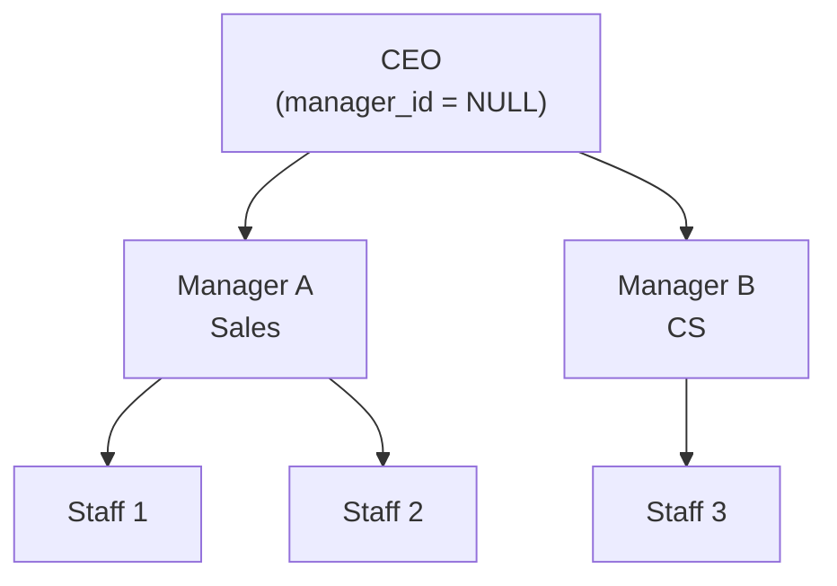

# Lesson 17: SELF JOIN and CROSS JOIN

So far you have learned to JOIN different tables together. This lesson covers **SELF JOIN** — joining a table to itself — and **CROSS JOIN** — producing every combination of rows from two sets. Both are essential for hierarchy queries and comparison analysis.



> Self-JOIN joins a table to itself. The staff table's manager_id represents an org chart.

## SELF JOIN — Joining a Table to Itself

A SELF JOIN is not special syntax. You simply give the same table two different aliases and JOIN them.

### Category Hierarchy

The `categories` table references itself via `parent_id`. A SELF JOIN unfolds this parent-child relationship.

```sql
-- Show each category alongside its parent
SELECT
    child.id,
    child.name       AS category,
    child.depth,
    parent.name      AS parent_category
FROM categories AS child
LEFT JOIN categories AS parent ON child.parent_id = parent.id
ORDER BY child.depth, child.sort_order;
```

**Result:**

| id | category | depth | parent_category |
|---:|----------|------:|-----------------|
| 1 | Desktop PC | 0 | (NULL) |
| 5 | Laptop | 0 | (NULL) |
| 10 | Monitor | 0 | (NULL) |
| 2 | Prebuilt | 1 | Desktop PC |
| 6 | General Laptop | 1 | Laptop |
| 7 | Gaming Laptop | 1 | Laptop |
| ... | | | |

Top-level categories (`depth=0`) have a NULL `parent_id`, so `parent_category` is NULL. We use `LEFT JOIN` to keep these rows.

### Building Top-Sub Category Paths

A SELF JOIN builds the full path from parent (top) → child (sub) category.

=== "SQLite / PostgreSQL"
    ```sql
    SELECT
        parent.name AS top_category,
        child.name  AS sub_category,
        parent.name || ' > ' || child.name AS full_path
    FROM categories AS child
    INNER JOIN categories AS parent ON child.parent_id = parent.id
    WHERE child.depth = 1
    ORDER BY parent.sort_order, child.sort_order;
    ```

=== "MySQL"
    ```sql
    SELECT
        parent.name AS top_category,
        child.name  AS sub_category,
        CONCAT(parent.name, ' > ', child.name) AS full_path
    FROM categories AS child
    INNER JOIN categories AS parent ON child.parent_id = parent.id
    WHERE child.depth = 1
    ORDER BY parent.sort_order, child.sort_order;
    ```

**Result:**

| top_category | sub_category | full_path |
|--------------|--------------|-----------|
| Desktop PC | Prebuilt | Desktop PC > Prebuilt |
| Desktop PC | Custom Build | Desktop PC > Custom Build |
| Laptop | General | Laptop > General |
| Laptop | Gaming | Laptop > Gaming |
| ... | | |

> **Tip:** SELF JOIN works well when the hierarchy depth is fixed. For variable depth, use the recursive CTE from Lesson 19.

### Comparing Products in the Same Category

Join `products` to itself to compare prices within the same category.

```sql
-- Find product pairs with the largest price difference in the same category
SELECT
    p1.name AS product_a,
    p2.name AS product_b,
    p1.price AS price_a,
    p2.price AS price_b,
    ABS(p1.price - p2.price) AS price_diff
FROM products AS p1
INNER JOIN products AS p2
    ON p1.category_id = p2.category_id
   AND p1.id < p2.id  -- prevent duplicate pairs (A-B only, not B-A)
ORDER BY price_diff DESC
LIMIT 10;
```

The `p1.id < p2.id` condition is key. Without it you get both (A, B) and (B, A), plus self-pairs (A, A).

### Staff Org Chart (staff.manager_id)

The `staff` table's `manager_id` references the `id` column in the same table. You can query the relationship between employees and their managers.

```sql
SELECT
    s.name AS employee,
    s.department,
    s.role,
    m.name AS manager
FROM staff s
LEFT JOIN staff m ON s.manager_id = m.id
ORDER BY s.id;
```

### Product Succession (products.successor_id)

Find discontinued products and their successor models.

```sql
SELECT
    old.name AS discontinued_product,
    old.discontinued_at,
    new.name AS successor_product,
    new.price AS new_price
FROM products old
JOIN products new ON old.successor_id = new.id
WHERE old.successor_id IS NOT NULL
ORDER BY old.discontinued_at;
```

### Product Q&A Threads (product_qna.parent_id)

Show questions and their answers side by side.

```sql
SELECT
    q.id AS question_id,
    q.content AS question,
    a.content AS answer,
    a.created_at AS answered_at
FROM product_qna q
LEFT JOIN product_qna a ON a.parent_id = q.id
WHERE q.parent_id IS NULL  -- top-level questions only
ORDER BY q.created_at DESC
LIMIT 10;
```

---

## CROSS JOIN — Generate Every Combination

{ .off-glb width="440"  }

`CROSS JOIN` combines every row from the left table with every row from the right table. Result rows = left rows × right rows. There is no ON condition.

### Month-Category Matrix

When a report must show "months with no data" too, build a complete frame with CROSS JOIN and LEFT JOIN the actual data.

=== "SQLite"
    ```sql
    -- 2024: 12 months × top-level categories
    WITH months AS (
        SELECT '2024-01' AS m UNION ALL SELECT '2024-02'
        UNION ALL SELECT '2024-03' UNION ALL SELECT '2024-04'
        UNION ALL SELECT '2024-05' UNION ALL SELECT '2024-06'
        UNION ALL SELECT '2024-07' UNION ALL SELECT '2024-08'
        UNION ALL SELECT '2024-09' UNION ALL SELECT '2024-10'
        UNION ALL SELECT '2024-11' UNION ALL SELECT '2024-12'
    ),
    top_categories AS (
        SELECT id, name FROM categories WHERE depth = 0
    ),
    monthly_sales AS (
        SELECT
            SUBSTR(o.ordered_at, 1, 7) AS year_month,
            COALESCE(parent.id, cat.id) AS category_id,
            ROUND(SUM(oi.quantity * oi.unit_price), 2) AS revenue
        FROM order_items AS oi
        INNER JOIN orders     AS o      ON oi.order_id   = o.id
        INNER JOIN products   AS p      ON oi.product_id = p.id
        INNER JOIN categories AS cat    ON p.category_id = cat.id
        LEFT  JOIN categories AS parent ON cat.parent_id = parent.id
        WHERE o.ordered_at LIKE '2024%'
          AND o.status NOT IN ('cancelled', 'returned', 'return_requested')
        GROUP BY SUBSTR(o.ordered_at, 1, 7), COALESCE(parent.id, cat.id)
    )
    SELECT
        m.m AS year_month,
        tc.name AS category,
        COALESCE(ms.revenue, 0) AS revenue
    FROM months AS m
    CROSS JOIN top_categories AS tc
    LEFT JOIN monthly_sales AS ms
        ON m.m = ms.year_month AND tc.id = ms.category_id
    ORDER BY m.m, tc.name;
    ```

=== "MySQL"
    ```sql
    WITH months AS (
        SELECT '2024-01' AS m UNION ALL SELECT '2024-02'
        UNION ALL SELECT '2024-03' UNION ALL SELECT '2024-04'
        UNION ALL SELECT '2024-05' UNION ALL SELECT '2024-06'
        UNION ALL SELECT '2024-07' UNION ALL SELECT '2024-08'
        UNION ALL SELECT '2024-09' UNION ALL SELECT '2024-10'
        UNION ALL SELECT '2024-11' UNION ALL SELECT '2024-12'
    ),
    top_categories AS (
        SELECT id, name FROM categories WHERE depth = 0
    ),
    monthly_sales AS (
        SELECT
            DATE_FORMAT(o.ordered_at, '%Y-%m') AS year_month,
            COALESCE(parent.id, cat.id) AS category_id,
            ROUND(SUM(oi.quantity * oi.unit_price), 2) AS revenue
        FROM order_items AS oi
        INNER JOIN orders     AS o      ON oi.order_id   = o.id
        INNER JOIN products   AS p      ON oi.product_id = p.id
        INNER JOIN categories AS cat    ON p.category_id = cat.id
        LEFT  JOIN categories AS parent ON cat.parent_id = parent.id
        WHERE o.ordered_at >= '2024-01-01'
          AND o.ordered_at <  '2025-01-01'
          AND o.status NOT IN ('cancelled', 'returned', 'return_requested')
        GROUP BY DATE_FORMAT(o.ordered_at, '%Y-%m'), COALESCE(parent.id, cat.id)
    )
    SELECT
        m.m AS year_month,
        tc.name AS category,
        COALESCE(ms.revenue, 0) AS revenue
    FROM months AS m
    CROSS JOIN top_categories AS tc
    LEFT JOIN monthly_sales AS ms
        ON m.m = ms.year_month AND tc.id = ms.category_id
    ORDER BY m.m, tc.name;
    ```

=== "PostgreSQL"
    ```sql
    WITH months AS (
        SELECT '2024-01' AS m UNION ALL SELECT '2024-02'
        UNION ALL SELECT '2024-03' UNION ALL SELECT '2024-04'
        UNION ALL SELECT '2024-05' UNION ALL SELECT '2024-06'
        UNION ALL SELECT '2024-07' UNION ALL SELECT '2024-08'
        UNION ALL SELECT '2024-09' UNION ALL SELECT '2024-10'
        UNION ALL SELECT '2024-11' UNION ALL SELECT '2024-12'
    ),
    top_categories AS (
        SELECT id, name FROM categories WHERE depth = 0
    ),
    monthly_sales AS (
        SELECT
            TO_CHAR(o.ordered_at, 'YYYY-MM') AS year_month,
            COALESCE(parent.id, cat.id) AS category_id,
            ROUND(SUM(oi.quantity * oi.unit_price), 2) AS revenue
        FROM order_items AS oi
        INNER JOIN orders     AS o      ON oi.order_id   = o.id
        INNER JOIN products   AS p      ON oi.product_id = p.id
        INNER JOIN categories AS cat    ON p.category_id = cat.id
        LEFT  JOIN categories AS parent ON cat.parent_id = parent.id
        WHERE o.ordered_at >= '2024-01-01'
          AND o.ordered_at <  '2025-01-01'
          AND o.status NOT IN ('cancelled', 'returned', 'return_requested')
        GROUP BY TO_CHAR(o.ordered_at, 'YYYY-MM'), COALESCE(parent.id, cat.id)
    )
    SELECT
        m.m AS year_month,
        tc.name AS category,
        COALESCE(ms.revenue, 0) AS revenue
    FROM months AS m
    CROSS JOIN top_categories AS tc
    LEFT JOIN monthly_sales AS ms
        ON m.m = ms.year_month AND tc.id = ms.category_id
    ORDER BY m.m, tc.name;
    ```

CROSS JOIN creates a full 12 × N matrix, then LEFT JOIN attaches actual revenue. Empty cells become 0 via `COALESCE`.

### Percentage of Total with CROSS JOIN

Another use: attach a grand total to every row for ratio calculations.

```sql
-- Each payment method's share of total revenue
SELECT
    p.method,
    COUNT(*)              AS tx_count,
    ROUND(SUM(p.amount), 2) AS total_amount,
    ROUND(100.0 * SUM(p.amount) / gt.grand_total, 1) AS pct
FROM payments AS p
CROSS JOIN (
    SELECT SUM(amount) AS grand_total
    FROM payments
    WHERE status = 'completed'
) AS gt
WHERE p.status = 'completed'
GROUP BY p.method, gt.grand_total
ORDER BY total_amount DESC;
```

> **Warning:** CROSS JOIN is powerful but dangerous with large tables — row counts multiply. Only use it when at least one side produces a small result set.

### Finding Days with No Orders (calendar CROSS JOIN)

Use the `calendar` table with LEFT JOIN to find days when no orders were placed.

```sql
SELECT
    c.date_key,
    c.day_name,
    c.is_weekend,
    c.is_holiday,
    c.holiday_name
FROM calendar c
LEFT JOIN orders o ON DATE(o.ordered_at) = c.date_key
WHERE o.id IS NULL
  AND c.year >= 2024
ORDER BY c.date_key;
```

---

!!! note "Lesson Review"
    Quick exercises to check your understanding of this lesson. For comprehensive practice combining multiple concepts, see the [Exercises](../exercises/index.md) section.

## Exercises
### Exercise 1: Staff Org Chart

Use a SELF JOIN on the `staff` table to show each employee's name, department, role, and their manager's name. Include employees who have no manager (e.g., CEO).

??? success "Answer"
    ```sql
    SELECT
        s.name       AS employee,
        s.department,
        s.role,
        m.name       AS manager
    FROM staff AS s
    LEFT JOIN staff AS m ON s.manager_id = m.id
    ORDER BY s.department, s.name;
    ```

    **Expected result:**

    | employee | department | role    | manager |
    | -------- | ---------- | ------- | ------- |
    | 박경수      | 경영         | admin   | 한민재     |
    | 장주원      | 경영         | admin   | 한민재     |
    | 한민재      | 경영         | admin   | (NULL)  |
    | 권영희      | 마케팅        | manager | 박경수     |
    | 이준혁      | 영업         | manager | 한민재     |


### Exercise 2: Staff Pairs in the Same Department

Find pairs of staff members who belong to the same department. Remove duplicate pairs (`id < id`). Show the department and both names.

??? success "Answer"
    ```sql
    SELECT
        s1.department,
        s1.name AS staff_a,
        s2.name AS staff_b
    FROM staff AS s1
    INNER JOIN staff AS s2
        ON s1.department = s2.department
       AND s1.id < s2.id
    ORDER BY s1.department, s1.name;
    ```

    **Expected result:**

    | department | staff_a | staff_b |
    | ---------- | ------- | ------- |
    | 경영         | 장주원     | 박경수     |
    | 경영         | 한민재     | 박경수     |
    | 경영         | 한민재     | 장주원     |


### Exercise 3: Customer Pairs of the Same Grade

Find pairs of active customers who share the same grade. Eliminate duplicate pairs using `id < id`. Show grade, customer A name, and customer B name. Limit to 10 rows.

??? success "Answer"
    ```sql
    SELECT
        c1.grade,
        c1.name AS customer_a,
        c2.name AS customer_b
    FROM customers AS c1
    INNER JOIN customers AS c2
        ON c1.grade = c2.grade
       AND c1.id < c2.id
    WHERE c1.is_active = 1
      AND c2.is_active = 1
    ORDER BY c1.grade, c1.name
    LIMIT 10;
    ```

    **Expected result:**

    | grade  | customer_a | customer_b |
    | ------ | ---------- | ---------- |
    | BRONZE | 강건우        | 강성수        |
    | BRONZE | 강건우        | 강성진        |
    | BRONZE | 강건우        | 강성훈        |
    | BRONZE | 강건우        | 강영미        |
    | BRONZE | 강건우        | 강영희        |
    | ...    | ...        | ...        |


### Exercise 4: Product Pairs from the Same Supplier

Find product pairs from the same supplier with their price difference. Remove duplicate pairs.

??? success "Answer"
    ```sql
    SELECT
        s.company_name AS supplier,
        p1.name AS product_a,
        p2.name AS product_b,
        p1.price AS price_a,
        p2.price AS price_b,
        ABS(p1.price - p2.price) AS price_diff
    FROM products AS p1
    INNER JOIN products AS p2
        ON p1.supplier_id = p2.supplier_id
       AND p1.id < p2.id
    INNER JOIN suppliers AS s ON p1.supplier_id = s.id
    ORDER BY price_diff DESC
    LIMIT 10;
    ```


### Exercise 5: Customers with Multiple Shipping Addresses

Find customers who have different addresses. (SELF JOIN on `customer_addresses`)

??? success "Answer"
    ```sql
    SELECT
        c.name,
        a1.address1 AS address_1,
        a2.address1 AS address_2
    FROM customer_addresses AS a1
    INNER JOIN customer_addresses AS a2
        ON a1.customer_id = a2.customer_id
       AND a1.id < a2.id
       AND a1.address1 <> a2.address1
    INNER JOIN customers AS c ON a1.customer_id = c.id
    GROUP BY c.id, c.name, a1.address1, a2.address1
    ORDER BY c.name
    LIMIT 15;
    ```

    **Expected result:**

    | name | address_1                      | address_2                      |
    | ---- | ------------------------------ | ------------------------------ |
    | 강경수  | 경기도 청양군 선릉로 626-76 (중수김최리)     | 강원도 부천시 원미구 서초대14길 929 (정남송김동) |
    | 강경숙  | 경상북도 용인시 테헤란거리 958-21 (정웅박리)   | 전라북도 과천시 선릉6로 지하563 (옥순김리)     |
    | 강경자  | 세종특별자치시 관악구 잠실로 542 (영미최동)     | 서울특별시 용산구 학동길 500-28           |
    | 강경자  | 충청남도 부여군 삼성817길 453-98 (상호박이리) | 서울특별시 용산구 학동길 500-28           |
    | 강경자  | 충청남도 부여군 삼성817길 453-98 (상호박이리) | 세종특별자치시 관악구 잠실로 542 (영미최동)     |
    | ...  | ...                            | ...                            |


### Exercise 6: Percentage with CROSS JOIN

Calculate each customer grade's percentage of total active customers. Use CROSS JOIN to attach the grand total to every row. Round to one decimal place.

??? success "Answer"
    ```sql
    SELECT
        grade,
        COUNT(*)  AS grade_count,
        ROUND(100.0 * COUNT(*) / gt.total, 1) AS pct
    FROM customers
    CROSS JOIN (
        SELECT COUNT(*) AS total
        FROM customers
        WHERE is_active = 1
    ) AS gt
    WHERE is_active = 1
    GROUP BY grade, gt.total
    ORDER BY pct DESC;
    ```

    **Expected result:**

    | grade  | grade_count | pct  |
    | ------ | ----------: | ---: |
    | BRONZE |        2548 | 66.8 |
    | GOLD   |         484 | 12.7 |
    | SILVER |         469 | 12.3 |
    | VIP    |         315 |  8.3 |


### Exercise 7: Quarter-Payment Method CROSS JOIN Report

Generate every combination of 2024 quarters (Q1-Q4) and payment methods (`DISTINCT method`) using CROSS JOIN, then LEFT JOIN to get the total payment amount for each combination. Show 0 for empty cells.

??? success "Answer"
    === "SQLite"
        ```sql
        WITH quarters AS (
            SELECT 'Q1' AS q, '2024-01' AS start_m, '2024-03' AS end_m
            UNION ALL SELECT 'Q2', '2024-04', '2024-06'
            UNION ALL SELECT 'Q3', '2024-07', '2024-09'
            UNION ALL SELECT 'Q4', '2024-10', '2024-12'
        ),
        methods AS (
            SELECT DISTINCT method FROM payments
        ),
        quarterly_payments AS (
            SELECT
                CASE
                    WHEN SUBSTR(paid_at, 6, 2) IN ('01','02','03') THEN 'Q1'
                    WHEN SUBSTR(paid_at, 6, 2) IN ('04','05','06') THEN 'Q2'
                    WHEN SUBSTR(paid_at, 6, 2) IN ('07','08','09') THEN 'Q3'
                    ELSE 'Q4'
                END AS q,
                method,
                SUM(amount) AS total_amount
            FROM payments
            WHERE status = 'completed'
              AND paid_at LIKE '2024%'
            GROUP BY q, method
        )
        SELECT
            qr.q,
            m.method,
            COALESCE(ROUND(qp.total_amount, 2), 0) AS total_amount
        FROM quarters AS qr
        CROSS JOIN methods AS m
        LEFT JOIN quarterly_payments AS qp
            ON qr.q = qp.q AND m.method = qp.method
        ORDER BY qr.q, m.method;
        ```

        **Expected result:**

        | q  | method        | total_amount |
        | -- | ------------- | -----------: |
        | Q1 | bank_transfer |    116631296 |
        | Q1 | card          |    609763898 |
        | Q1 | kakao_pay     |    245675166 |
        | Q1 | naver_pay     |    166861740 |
        | Q1 | point         |     87019317 |
        | ... | ...           | ...          |


    === "MySQL"
        ```sql
        WITH quarters AS (
            SELECT 'Q1' AS q, 1 AS start_m, 3 AS end_m
            UNION ALL SELECT 'Q2', 4, 6
            UNION ALL SELECT 'Q3', 7, 9
            UNION ALL SELECT 'Q4', 10, 12
        ),
        methods AS (
            SELECT DISTINCT method FROM payments
        ),
        quarterly_payments AS (
            SELECT
                CASE
                    WHEN MONTH(paid_at) BETWEEN 1 AND 3 THEN 'Q1'
                    WHEN MONTH(paid_at) BETWEEN 4 AND 6 THEN 'Q2'
                    WHEN MONTH(paid_at) BETWEEN 7 AND 9 THEN 'Q3'
                    ELSE 'Q4'
                END AS q,
                method,
                SUM(amount) AS total_amount
            FROM payments
            WHERE status = 'completed'
              AND paid_at >= '2024-01-01'
              AND paid_at <  '2025-01-01'
            GROUP BY q, method
        )
        SELECT
            qr.q,
            m.method,
            COALESCE(ROUND(qp.total_amount, 2), 0) AS total_amount
        FROM quarters AS qr
        CROSS JOIN methods AS m
        LEFT JOIN quarterly_payments AS qp
            ON qr.q = qp.q AND m.method = qp.method
        ORDER BY qr.q, m.method;
        ```

    === "PostgreSQL"
        ```sql
        WITH quarters AS (
            SELECT 'Q1' AS q, 1 AS start_m, 3 AS end_m
            UNION ALL SELECT 'Q2', 4, 6
            UNION ALL SELECT 'Q3', 7, 9
            UNION ALL SELECT 'Q4', 10, 12
        ),
        methods AS (
            SELECT DISTINCT method FROM payments
        ),
        quarterly_payments AS (
            SELECT
                CASE
                    WHEN EXTRACT(MONTH FROM paid_at) BETWEEN 1 AND 3 THEN 'Q1'
                    WHEN EXTRACT(MONTH FROM paid_at) BETWEEN 4 AND 6 THEN 'Q2'
                    WHEN EXTRACT(MONTH FROM paid_at) BETWEEN 7 AND 9 THEN 'Q3'
                    ELSE 'Q4'
                END AS q,
                method,
                SUM(amount) AS total_amount
            FROM payments
            WHERE status = 'completed'
              AND paid_at >= '2024-01-01'
              AND paid_at <  '2025-01-01'
            GROUP BY q, method
        )
        SELECT
            qr.q,
            m.method,
            COALESCE(ROUND(qp.total_amount, 2), 0) AS total_amount
        FROM quarters AS qr
        CROSS JOIN methods AS m
        LEFT JOIN quarterly_payments AS qp
            ON qr.q = qp.q AND m.method = qp.method
        ORDER BY qr.q, m.method;
        ```

Next: [Lesson 18: Window Functions](../advanced/18-window.md)


### Exercise 8: Month-Supplier CROSS JOIN Report

For each month of 2024 and each supplier, show the inbound quantity. Display 0 for months with no inbound.

??? success "Answer"
    === "SQLite"
        ```sql
        WITH months AS (
            SELECT '2024-01' AS m UNION ALL SELECT '2024-02'
            UNION ALL SELECT '2024-03' UNION ALL SELECT '2024-04'
            UNION ALL SELECT '2024-05' UNION ALL SELECT '2024-06'
            UNION ALL SELECT '2024-07' UNION ALL SELECT '2024-08'
            UNION ALL SELECT '2024-09' UNION ALL SELECT '2024-10'
            UNION ALL SELECT '2024-11' UNION ALL SELECT '2024-12'
        ),
        supplier_inbound AS (
            SELECT
                SUBSTR(it.created_at, 1, 7) AS year_month,
                p.supplier_id,
                SUM(it.quantity) AS inbound_qty
            FROM inventory_transactions AS it
            INNER JOIN products AS p ON it.product_id = p.id
            WHERE it.type = 'inbound' AND it.created_at LIKE '2024%'
            GROUP BY SUBSTR(it.created_at, 1, 7), p.supplier_id
        )
        SELECT
            m.m AS year_month,
            s.company_name AS supplier,
            COALESCE(si.inbound_qty, 0) AS inbound_qty
        FROM months AS m
        CROSS JOIN suppliers AS s
        LEFT JOIN supplier_inbound AS si
            ON m.m = si.year_month AND s.id = si.supplier_id
        ORDER BY m.m, s.company_name
        LIMIT 30;
        ```

        **Expected result:**

        | year_month | supplier   | inbound_qty |
        | ---------- | ---------- | ----------: |
        | 2024-01    | AMD코리아     |           0 |
        | 2024-01    | APC코리아     |           0 |
        | 2024-01    | ASRock코리아  |           0 |
        | 2024-01    | HP코리아      |           0 |
        | 2024-01    | LG전자 공식 유통 |           0 |
        | ...        | ...        | ...         |


    === "MySQL"
        ```sql
        WITH months AS (
            SELECT '2024-01' AS m UNION ALL SELECT '2024-02'
            UNION ALL SELECT '2024-03' UNION ALL SELECT '2024-04'
            UNION ALL SELECT '2024-05' UNION ALL SELECT '2024-06'
            UNION ALL SELECT '2024-07' UNION ALL SELECT '2024-08'
            UNION ALL SELECT '2024-09' UNION ALL SELECT '2024-10'
            UNION ALL SELECT '2024-11' UNION ALL SELECT '2024-12'
        ),
        supplier_inbound AS (
            SELECT
                DATE_FORMAT(it.created_at, '%Y-%m') AS year_month,
                p.supplier_id,
                SUM(it.quantity) AS inbound_qty
            FROM inventory_transactions AS it
            INNER JOIN products AS p ON it.product_id = p.id
            WHERE it.type = 'inbound'
              AND it.created_at >= '2024-01-01'
              AND it.created_at <  '2025-01-01'
            GROUP BY DATE_FORMAT(it.created_at, '%Y-%m'), p.supplier_id
        )
        SELECT
            m.m AS year_month,
            s.company_name AS supplier,
            COALESCE(si.inbound_qty, 0) AS inbound_qty
        FROM months AS m
        CROSS JOIN suppliers AS s
        LEFT JOIN supplier_inbound AS si
            ON m.m = si.year_month AND s.id = si.supplier_id
        ORDER BY m.m, s.company_name
        LIMIT 30;
        ```

    === "PostgreSQL"
        ```sql
        WITH months AS (
            SELECT '2024-01' AS m UNION ALL SELECT '2024-02'
            UNION ALL SELECT '2024-03' UNION ALL SELECT '2024-04'
            UNION ALL SELECT '2024-05' UNION ALL SELECT '2024-06'
            UNION ALL SELECT '2024-07' UNION ALL SELECT '2024-08'
            UNION ALL SELECT '2024-09' UNION ALL SELECT '2024-10'
            UNION ALL SELECT '2024-11' UNION ALL SELECT '2024-12'
        ),
        supplier_inbound AS (
            SELECT
                TO_CHAR(it.created_at, 'YYYY-MM') AS year_month,
                p.supplier_id,
                SUM(it.quantity) AS inbound_qty
            FROM inventory_transactions AS it
            INNER JOIN products AS p ON it.product_id = p.id
            WHERE it.type = 'inbound'
              AND it.created_at >= '2024-01-01'
              AND it.created_at <  '2025-01-01'
            GROUP BY TO_CHAR(it.created_at, 'YYYY-MM'), p.supplier_id
        )
        SELECT
            m.m AS year_month,
            s.company_name AS supplier,
            COALESCE(si.inbound_qty, 0) AS inbound_qty
        FROM months AS m
        CROSS JOIN suppliers AS s
        LEFT JOIN supplier_inbound AS si
            ON m.m = si.year_month AND s.id = si.supplier_id
        ORDER BY m.m, s.company_name
        LIMIT 30;
        ```


### Exercise 9: Grade-Category CROSS JOIN

Generate every combination of customer grades (`DISTINCT grade`) and top-level categories (`depth = 0`) using CROSS JOIN, then LEFT JOIN to get the order count for each combination. Show 0 for combinations with no orders.

??? success "Answer"
    ```sql
    WITH grades AS (
        SELECT DISTINCT grade FROM customers WHERE grade IS NOT NULL
    ),
    top_cats AS (
        SELECT id, name FROM categories WHERE depth = 0
    ),
    grade_cat_orders AS (
        SELECT
            c.grade,
            COALESCE(pcat.id, cat.id) AS category_id,
            COUNT(DISTINCT o.id) AS order_count
        FROM orders AS o
        INNER JOIN customers AS c ON o.customer_id = c.id
        INNER JOIN order_items AS oi ON o.id = oi.order_id
        INNER JOIN products AS p ON oi.product_id = p.id
        INNER JOIN categories AS cat ON p.category_id = cat.id
        LEFT  JOIN categories AS pcat ON cat.parent_id = pcat.id
        GROUP BY c.grade, COALESCE(pcat.id, cat.id)
    )
    SELECT
        g.grade,
        tc.name AS category,
        COALESCE(gco.order_count, 0) AS order_count
    FROM grades AS g
    CROSS JOIN top_cats AS tc
    LEFT JOIN grade_cat_orders AS gco
        ON g.grade = gco.grade AND tc.id = gco.category_id
    ORDER BY g.grade, tc.name;
    ```

    **Expected result:**

    | grade  | category | order_count |
    | ------ | -------- | ----------: |
    | BRONZE | CPU      |         853 |
    | BRONZE | UPS/전원   |         132 |
    | BRONZE | 그래픽카드    |         782 |
    | BRONZE | 네트워크 장비  |        1148 |
    | BRONZE | 노트북      |         827 |
    | ...    | ...      | ...         |
