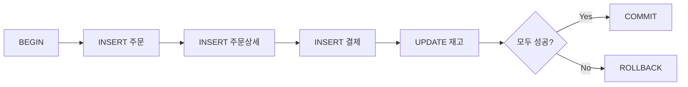
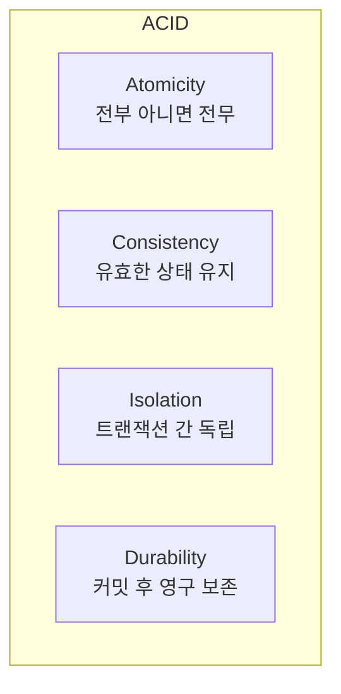

# Lesson 17: Transactions and ACID

When creating an order, you need to INSERT into the orders table and also INSERT into the payments table. What if the first succeeds but the second fails? You end up with an order without payment. Transactions bundle multiple operations into a single unit to prevent this problem.

!!! note "Already familiar?"
    If you're comfortable with BEGIN, COMMIT, ROLLBACK, and ACID, skip ahead to [Lesson 18: Window Functions](../advanced/18-window.md).



> **Transaction** = A group of SQL statements forming a single logical unit of work. If all succeed, COMMIT; if any fails, ROLLBACK to ensure data consistency.

---

## ACID Properties

The 4 core properties that transactions must maintain are called **ACID**.

| Property | Full Name | Meaning |
|------|------|------|
| Atomicity | Atomicity | All operations in a transaction are **executed entirely or cancelled entirely** -- no intermediate state |
| Consistency | Consistency | The database always maintains a **valid state** before and after transactions (constraints satisfied) |
| Isolation | Isolation | Concurrently executing transactions **do not interfere** with each other |
| Durability | Durability | Committed data is **permanently preserved** even after system failures |



> Think of a bank transfer: withdrawing 1,000,000 from account A and depositing 1,000,000 into account B -- both operations must either complete (COMMIT) or both cancel (ROLLBACK) so money doesn't disappear or duplicate.

---

## BEGIN / COMMIT / ROLLBACK

The 3 basic commands for transactions.

| Command | Role |
|------|------|
| BEGIN | Start a transaction |
| COMMIT | Permanently apply changes |
| ROLLBACK | Cancel all changes and restore to pre-BEGIN state |

### Syntax by Database

=== "SQLite"
    ```sql
    BEGIN TRANSACTION;

    UPDATE products SET stock_qty = stock_qty - 1 WHERE id = 42;
    INSERT INTO order_items (order_id, product_id, quantity, unit_price)
    VALUES (1001, 42, 1, 89000);

    COMMIT;
    ```

    > In SQLite, you can use `BEGIN`, `BEGIN TRANSACTION`, or `BEGIN DEFERRED`.

=== "MySQL"
    ```sql
    START TRANSACTION;

    UPDATE products SET stock_qty = stock_qty - 1 WHERE id = 42;
    INSERT INTO order_items (order_id, product_id, quantity, unit_price)
    VALUES (1001, 42, 1, 89000);

    COMMIT;
    ```

    > In MySQL, use `START TRANSACTION` or `BEGIN`.

=== "PostgreSQL"
    ```sql
    BEGIN;

    UPDATE products SET stock_qty = stock_qty - 1 WHERE id = 42;
    INSERT INTO order_items (order_id, product_id, quantity, unit_price)
    VALUES (1001, 42, 1, 89000);

    COMMIT;
    ```

    > In PostgreSQL, use `BEGIN` or `BEGIN TRANSACTION`.

### ROLLBACK Example

If a problem occurs during a transaction, ROLLBACK cancels all changes.

```sql
BEGIN;

UPDATE products SET stock_qty = stock_qty - 1 WHERE id = 42;
INSERT INTO order_items (order_id, product_id, quantity, unit_price)
VALUES (1001, 42, 1, 89000);

-- Error during payment processing!
ROLLBACK;
-- The stock_qty change to products is also cancelled
```

---

## SAVEPOINT -- Partial Rollback

`SAVEPOINT` creates an **intermediate checkpoint** within a transaction. `ROLLBACK TO` rolls back only to that point, keeping earlier work intact.


=== "SQLite"
    ```sql
    BEGIN TRANSACTION;

    INSERT INTO orders (id, order_number, customer_id, status, total_amount, ordered_at)
    VALUES (5001, 'ORD-5001', 100, 'pending', 178000, datetime('now'));

    SAVEPOINT sp_items;

    INSERT INTO order_items (order_id, product_id, quantity, unit_price)
    VALUES (5001, 10, 2, 89000);

    -- Second product out of stock -> cancel only this one
    ROLLBACK TO sp_items;

    -- Re-add first product (with adjusted amount)
    INSERT INTO order_items (order_id, product_id, quantity, unit_price)
    VALUES (5001, 10, 1, 89000);

    RELEASE sp_items;

    COMMIT;
    ```

=== "MySQL"
    ```sql
    START TRANSACTION;

    INSERT INTO orders (id, order_number, customer_id, status, total_amount, ordered_at)
    VALUES (5001, 'ORD-5001', 100, 'pending', 178000, NOW());

    SAVEPOINT sp_items;

    INSERT INTO order_items (order_id, product_id, quantity, unit_price)
    VALUES (5001, 10, 2, 89000);

    -- Second product out of stock -> cancel only this one
    ROLLBACK TO SAVEPOINT sp_items;

    -- Re-add first product (with adjusted amount)
    INSERT INTO order_items (order_id, product_id, quantity, unit_price)
    VALUES (5001, 10, 1, 89000);

    RELEASE SAVEPOINT sp_items;

    COMMIT;
    ```

=== "PostgreSQL"
    ```sql
    BEGIN;

    INSERT INTO orders (id, order_number, customer_id, status, total_amount, ordered_at)
    VALUES (5001, 'ORD-5001', 100, 'pending', 178000, NOW());

    SAVEPOINT sp_items;

    INSERT INTO order_items (order_id, product_id, quantity, unit_price)
    VALUES (5001, 10, 2, 89000);

    -- Second product out of stock -> cancel only this one
    ROLLBACK TO SAVEPOINT sp_items;

    -- Re-add first product (with adjusted amount)
    INSERT INTO order_items (order_id, product_id, quantity, unit_price)
    VALUES (5001, 10, 1, 89000);

    RELEASE SAVEPOINT sp_items;

    COMMIT;
    ```

> `RELEASE SAVEPOINT` removes that savepoint. It is different from COMMIT -- the transaction is still in progress.

---

## Auto-Commit vs Explicit Transactions

Most databases operate in **auto-commit** mode by default. Each SQL statement runs as an individual transaction and is immediately committed.

| DB | Default Behavior | Explicit Transaction Start | Notes |
|----|-----------|---------------------|------|
| SQLite | Auto-commit | `BEGIN TRANSACTION` | Each statement runs as an implicit transaction |
| MySQL | Auto-commit (`autocommit=1`) | `START TRANSACTION` | Can change with `SET autocommit=0` |
| PostgreSQL | Auto-commit | `BEGIN` | Can use `\set AUTOCOMMIT off` in psql |

**Problem with auto-commit mode:**

```sql
-- Auto-commit mode (default)
INSERT INTO orders (...) VALUES (...);   -- Immediately COMMITted
INSERT INTO order_items (...) VALUES (...);  -- Error occurs here!
-- Data already in orders but order_items is empty -> inconsistency!
```

**Solution with explicit transactions:**

```sql
BEGIN;
INSERT INTO orders (...) VALUES (...);
INSERT INTO order_items (...) VALUES (...);  -- If error occurs
ROLLBACK;  -- orders INSERT is also cancelled -> consistency maintained
```

> Always wrap multi-table operations in explicit transactions.

---

## Isolation Level Overview

The **isolation level** determines how much of one transaction's changes are visible to other concurrently executing transactions.

### Concurrency Problems

| Problem | Description |
|------|------|
| Dirty Read | Reading uncommitted changes from another transaction |
| Non-Repeatable Read | Reading the same row twice yields different values (another transaction UPDATEd and COMMITted) |
| Phantom Read | Same query run twice returns different row count (another transaction INSERTed and COMMITted) |

### Prevention Range by Isolation Level

| Isolation Level | Dirty Read | Non-Repeatable Read | Phantom Read |
|-----------|:----------:|:-------------------:|:------------:|
| READ UNCOMMITTED | Possible | Possible | Possible |
| READ COMMITTED | Prevented | Possible | Possible |
| REPEATABLE READ | Prevented | Prevented | Possible |
| SERIALIZABLE | Prevented | Prevented | Prevented |

> Higher isolation levels are safer but reduce concurrent processing performance.

### Default Isolation Level by Database

| DB | Default Isolation Level | Notes |
|----|---------------|------|
| SQLite | SERIALIZABLE | File-based locking, only one write at a time |
| MySQL (InnoDB) | REPEATABLE READ | Uses MVCC, gap locks partially prevent phantom reads |
| PostgreSQL | READ COMMITTED | Uses MVCC, use `SET TRANSACTION ISOLATION LEVEL` when needed |

> Advanced isolation level topics (MVCC, locking strategies, etc.) are beyond the scope of this tutorial. Understanding the meaning of each level and the defaults per database is sufficient here.

---

## Practical Transaction Example -- Order Processing

A scenario where a customer orders 2 products and pays by card. Operations across 4 tables are processed in a single transaction.

=== "SQLite"
    ```sql
    BEGIN TRANSACTION;

    -- 1. Create order
    INSERT INTO orders (id, order_number, customer_id, status, total_amount, ordered_at)
    VALUES (9001, 'ORD-9001', 55, 'confirmed', 267000, datetime('now'));

    -- 2. Order details (1 keyboard + 2 mice)
    INSERT INTO order_items (order_id, product_id, quantity, unit_price)
    VALUES (9001, 101, 1, 89000);

    INSERT INTO order_items (order_id, product_id, quantity, unit_price)
    VALUES (9001, 205, 2, 89000);

    -- 3. Payment
    INSERT INTO payments (order_id, method, amount, status, paid_at)
    VALUES (9001, 'credit_card', 267000, 'completed', datetime('now'));

    -- 4. Deduct inventory
    UPDATE products SET stock_qty = stock_qty - 1 WHERE id = 101;
    UPDATE products SET stock_qty = stock_qty - 2 WHERE id = 205;

    COMMIT;
    ```

=== "MySQL"
    ```sql
    START TRANSACTION;

    -- 1. Create order
    INSERT INTO orders (id, order_number, customer_id, status, total_amount, ordered_at)
    VALUES (9001, 'ORD-9001', 55, 'confirmed', 267000, NOW());

    -- 2. Order details (1 keyboard + 2 mice)
    INSERT INTO order_items (order_id, product_id, quantity, unit_price)
    VALUES (9001, 101, 1, 89000);

    INSERT INTO order_items (order_id, product_id, quantity, unit_price)
    VALUES (9001, 205, 2, 89000);

    -- 3. Payment
    INSERT INTO payments (order_id, method, amount, status, paid_at)
    VALUES (9001, 'credit_card', 267000, 'completed', NOW());

    -- 4. Deduct inventory
    UPDATE products SET stock_qty = stock_qty - 1 WHERE id = 101;
    UPDATE products SET stock_qty = stock_qty - 2 WHERE id = 205;

    COMMIT;
    ```

=== "PostgreSQL"
    ```sql
    BEGIN;

    -- 1. Create order
    INSERT INTO orders (id, order_number, customer_id, status, total_amount, ordered_at)
    VALUES (9001, 'ORD-9001', 55, 'confirmed', 267000, NOW());

    -- 2. Order details (1 keyboard + 2 mice)
    INSERT INTO order_items (order_id, product_id, quantity, unit_price)
    VALUES (9001, 101, 1, 89000);

    INSERT INTO order_items (order_id, product_id, quantity, unit_price)
    VALUES (9001, 205, 2, 89000);

    -- 3. Payment
    INSERT INTO payments (order_id, method, amount, status, paid_at)
    VALUES (9001, 'credit_card', 267000, 'completed', NOW());

    -- 4. Deduct inventory
    UPDATE products SET stock_qty = stock_qty - 1 WHERE id = 101;
    UPDATE products SET stock_qty = stock_qty - 2 WHERE id = 205;

    COMMIT;
    ```

If an error occurs at step 4 (inventory deduction), `ROLLBACK` cancels all operations from steps 1-3. The order and payment never happened.

---

## Summary

| Concept | Description | Key Syntax |
|------|------|-----------|
| Transaction | Bundle multiple SQL statements into a single logical unit | `BEGIN` ... `COMMIT` |
| COMMIT | Permanently apply changes | `COMMIT` |
| ROLLBACK | Cancel all changes and restore to pre-BEGIN state | `ROLLBACK` |
| SAVEPOINT | Intermediate checkpoint within transaction -- partial rollback possible | `SAVEPOINT sp1` / `ROLLBACK TO sp1` |
| Atomicity | All or nothing (no intermediate state) | - |
| Consistency | Database maintains valid state before and after transactions | - |
| Isolation | Concurrent transactions do not interfere with each other | - |
| Durability | Committed data is permanently preserved even after failures | - |
| Auto-commit | Each SQL statement immediately committed as individual transaction (default mode) | - |

---

!!! note "Lesson Review Problems"
    These are simple problems to immediately test the concepts from this lesson. For comprehensive practice combining multiple concepts, see the [Practice Problems](../exercises/index.md) section.

### Problem 1
Explain in one sentence what a transaction is and why it is needed.

??? success "Answer"
    A transaction is a mechanism that bundles multiple SQL statements into a single logical unit of work, **COMMITting if all succeed** and **ROLLBACKing if any fails**, ensuring data consistency.

    When operations spanning multiple tables (e.g., order + payment + inventory) fail midway, data inconsistency occurs, so transactions must guarantee atomicity.

### Problem 2
Explain the difference between **Atomicity** and **Durability** among the ACID properties.

??? success "Answer"
    - **Atomicity:** All operations in a transaction are either fully performed or fully cancelled. No intermediate state is allowed.
    - **Durability:** Once data is COMMITted, it is permanently preserved even if system failures (power outage, crash, etc.) occur.

    Atomicity guarantees "during execution", while durability guarantees "after execution completes".

### Problem 3
Write the following scenario as a transaction: Deduct 5000 points from customer (id=30) and apply that as a discount to orders(id=8001)'s total_amount.

??? success "Answer"
    === "SQLite"
        ```sql
        BEGIN TRANSACTION;

        UPDATE customers SET point_balance = point_balance - 5000 WHERE id = 30;
        UPDATE orders SET total_amount = total_amount - 5000 WHERE id = 8001;

        COMMIT;
        ```

    === "MySQL"
        ```sql
        START TRANSACTION;

        UPDATE customers SET point_balance = point_balance - 5000 WHERE id = 30;
        UPDATE orders SET total_amount = total_amount - 5000 WHERE id = 8001;

        COMMIT;
        ```

    === "PostgreSQL"
        ```sql
        BEGIN;

        UPDATE customers SET point_balance = point_balance - 5000 WHERE id = 30;
        UPDATE orders SET total_amount = total_amount - 5000 WHERE id = 8001;

        COMMIT;
        ```

### Problem 4
Find the problem in the SQL below and fix it safely using transactions.

```sql
INSERT INTO orders (id, order_number, customer_id, address_id, status, total_amount, discount_amount, shipping_fee, point_used, point_earned, ordered_at, created_at, updated_at)
VALUES (99001, 'ORD-99001', 10, 1, 'confirmed', 150000, 0, 0, 0, 1500, '2024-06-15', '2024-06-15', '2024-06-15');

INSERT INTO payments (order_id, method, amount, status, paid_at, created_at)
VALUES (99001, 'bank_transfer', 150000, 'completed', '2024-06-15', '2024-06-15');

UPDATE products SET stock_qty = stock_qty - 3 WHERE id = 50;
```

??? success "Answer"
    **Problem:** In auto-commit mode, each statement is committed individually. If an error occurs in the second INSERT or UPDATE, only the first INSERT is applied, causing data inconsistency.

    === "SQLite"
        ```sql
        BEGIN TRANSACTION;

        INSERT INTO orders (id, order_number, customer_id, address_id, status, total_amount, discount_amount, shipping_fee, point_used, point_earned, ordered_at, created_at, updated_at)
        VALUES (99001, 'ORD-99001', 10, 1, 'confirmed', 150000, 0, 0, 0, 1500, '2024-06-15', '2024-06-15', '2024-06-15');

        INSERT INTO payments (order_id, method, amount, status, paid_at, created_at)
        VALUES (99001, 'bank_transfer', 150000, 'completed', '2024-06-15', '2024-06-15');

        UPDATE products SET stock_qty = stock_qty - 3 WHERE id = 50;

        COMMIT;
        ```

    === "MySQL"
        ```sql
        START TRANSACTION;

        INSERT INTO orders (id, order_number, customer_id, address_id, status, total_amount, discount_amount, shipping_fee, point_used, point_earned, ordered_at, created_at, updated_at)
        VALUES (99001, 'ORD-99001', 10, 1, 'confirmed', 150000, 0, 0, 0, 1500, '2024-06-15', '2024-06-15', '2024-06-15');

        INSERT INTO payments (order_id, method, amount, status, paid_at, created_at)
        VALUES (99001, 'bank_transfer', 150000, 'completed', '2024-06-15', '2024-06-15');

        UPDATE products SET stock_qty = stock_qty - 3 WHERE id = 50;

        COMMIT;
        ```

    === "PostgreSQL"
        ```sql
        BEGIN;

        INSERT INTO orders (id, order_number, customer_id, address_id, status, total_amount, discount_amount, shipping_fee, point_used, point_earned, ordered_at, created_at, updated_at)
        VALUES (99001, 'ORD-99001', 10, 1, 'confirmed', 150000, 0, 0, 0, 1500, '2024-06-15', '2024-06-15', '2024-06-15');

        INSERT INTO payments (order_id, method, amount, status, paid_at, created_at)
        VALUES (99001, 'bank_transfer', 150000, 'completed', '2024-06-15', '2024-06-15');

        UPDATE products SET stock_qty = stock_qty - 3 WHERE id = 50;

        COMMIT;
        ```

### Problem 5
Write the following scenario using SAVEPOINT: Add 3 products to order(id=100), but after adding the second product a problem is found, so cancel only the second product while keeping the rest and committing.

??? success "Answer"
    ```sql
    BEGIN;

    INSERT INTO order_items (order_id, product_id, quantity, unit_price, discount_amount, subtotal)
    VALUES (100, 10, 1, 45000, 0, 45000);

    SAVEPOINT sp_item2;

    INSERT INTO order_items (order_id, product_id, quantity, unit_price, discount_amount, subtotal)
    VALUES (100, 20, 1, 32000, 0, 32000);

    -- Problem found in second product -> cancel
    ROLLBACK TO SAVEPOINT sp_item2;

    -- Third product added normally
    INSERT INTO order_items (order_id, product_id, quantity, unit_price, discount_amount, subtotal)
    VALUES (100, 30, 2, 18000, 0, 36000);

    COMMIT;
    ```

    Only the first product (301) and third product (303) are finally applied. The second product (302) is cancelled by the SAVEPOINT rollback.

### Problem 6
State the default isolation level for SQLite, MySQL, and PostgreSQL, and explain the tradeoff of higher isolation levels.

??? success "Answer"
    | DB | 기본 격리 수준 |
    |----|---------------|
    | SQLite | SERIALIZABLE |
    | MySQL (InnoDB) | REPEATABLE READ |
    | PostgreSQL | READ COMMITTED |

    Higher isolation levels prevent more concurrency problems like Dirty Read, Non-Repeatable Read, and Phantom Read, but at the cost of **more locking and reduced concurrent processing performance**. Conversely, lower isolation levels have better performance but may cause data consistency issues.

### Problem 7
Explain what happens when the second statement fails after executing the two statements below in auto-commit mode.

```sql
UPDATE products SET stock_qty = stock_qty - 5 WHERE id = 77;
UPDATE products SET stock_qty = stock_qty - 3 WHERE id = 9999;  -- Non-existent ID
```

??? success "Answer"
    In auto-commit mode, each statement runs as an **independent transaction**.

    - The first `UPDATE` succeeds and is immediately COMMITted. The stock for product `id=77` decreases by 5.
    - The second `UPDATE` affects 0 rows since `id=9999` doesn't exist. No SQL error occurs (just no matching rows for the WHERE condition), but it's not the intended behavior.

    If both operations are logically one unit, wrap them in an explicit transaction and check the affected row count in the application, rolling back if it's 0.

### Problem 8
After executing `ROLLBACK TO SAVEPOINT sp_payment` in the following transaction, explain which operations are preserved and which are cancelled.

```sql
BEGIN;

INSERT INTO orders (id, order_number, customer_id, status, total_amount, ordered_at)
VALUES (8001, 'ORD-8001', 20, 'pending', 200000, '2024-07-01');

SAVEPOINT sp_payment;

INSERT INTO payments (order_id, method, amount, status, paid_at)
VALUES (8001, 'credit_card', 200000, 'failed', '2024-07-01');

ROLLBACK TO SAVEPOINT sp_payment;

INSERT INTO payments (order_id, method, amount, status, paid_at)
VALUES (8001, 'bank_transfer', 200000, 'completed', '2024-07-01');

COMMIT;
```

??? success "Answer"
    - **Preserved:** INSERT into `orders` table (executed before SAVEPOINT)
    - **Cancelled:** First INSERT into `payments` table (`credit_card`, `failed` -- executed after SAVEPOINT and rolled back)
    - **Final result:** `payments` INSERT re-executed after ROLLBACK TO (`bank_transfer`, `completed`)

    When finally COMMITted, 1 order (ORD-8001) and 1 bank transfer payment are applied. The failed card payment does not remain in the database.

### Problem 9
Match each of the 4 ACID properties to the following scenarios:

1. The server suddenly shut down after an order INSERT, but data survived after restart
2. While processing an order and payment together, payment failed so the order was also cancelled
3. While user A is modifying inventory, user B's query shows pre-modification values
4. An UPDATE that would make inventory negative is rejected by a CHECK constraint

??? success "Answer"
    1. **Durability** -- Committed data is permanently preserved even after system failures
    2. **Atomicity** -- All operations in a transaction are fully executed or fully cancelled
    3. **Isolation** -- Concurrently executing transactions do not interfere with each other
    4. **Consistency** -- Database maintains a valid state before and after transactions (constraints satisfied)

### Problem 10
Write an order processing transaction. Customer (id=45) orders 3 units of product (id=120) at a unit price of 55,000. Process orders, order_items, payments, and products.stock_qty across 4 tables in a single transaction. Payment is by card, and inventory changes should also be recorded in inventory_transactions.

??? success "Answer"
    === "SQLite"
        ```sql
        BEGIN TRANSACTION;

        -- Order
        INSERT INTO orders (id, order_number, customer_id, address_id, status, total_amount, discount_amount, shipping_fee, point_used, point_earned, ordered_at, created_at, updated_at)
        VALUES (99003, 'ORD-99003', 45, 1, 'confirmed', 165000, 0, 0, 0, 1650, datetime('now'), datetime('now'), datetime('now'));

        -- Order details
        INSERT INTO order_items (order_id, product_id, quantity, unit_price, discount_amount, subtotal)
        VALUES (99003, 120, 3, 55000, 0, 165000);

        -- Payment
        INSERT INTO payments (order_id, method, amount, status, paid_at, created_at)
        VALUES (99003, 'credit_card', 165000, 'completed', datetime('now'), datetime('now'));

        -- Deduct inventory
        UPDATE products SET stock_qty = stock_qty - 3 WHERE id = 120;

        -- Record inventory change
        INSERT INTO inventory_transactions (product_id, type, quantity, created_at)
        VALUES (120, 'OUT', -3, datetime('now'));

        COMMIT;
        ```

    === "MySQL"
        ```sql
        START TRANSACTION;

        -- Order
        INSERT INTO orders (id, order_number, customer_id, address_id, status, total_amount, discount_amount, shipping_fee, point_used, point_earned, ordered_at, created_at, updated_at)
        VALUES (99003, 'ORD-99003', 45, 1, 'confirmed', 165000, 0, 0, 0, 1650, NOW(), NOW(), NOW());

        -- Order details
        INSERT INTO order_items (order_id, product_id, quantity, unit_price, discount_amount, subtotal)
        VALUES (99003, 120, 3, 55000, 0, 165000);

        -- Payment
        INSERT INTO payments (order_id, method, amount, status, paid_at, created_at)
        VALUES (99003, 'credit_card', 165000, 'completed', NOW(), NOW());

        -- Deduct inventory
        UPDATE products SET stock_qty = stock_qty - 3 WHERE id = 120;

        -- Record inventory change
        INSERT INTO inventory_transactions (product_id, type, quantity, created_at)
        VALUES (120, 'OUT', -3, NOW());

        COMMIT;
        ```

    === "PostgreSQL"
        ```sql
        BEGIN;

        -- Order
        INSERT INTO orders (id, order_number, customer_id, address_id, status, total_amount, discount_amount, shipping_fee, point_used, point_earned, ordered_at, created_at, updated_at)
        VALUES (99003, 'ORD-99003', 45, 1, 'confirmed', 165000, 0, 0, 0, 1650, NOW(), NOW(), NOW());

        -- Order details
        INSERT INTO order_items (order_id, product_id, quantity, unit_price, discount_amount, subtotal)
        VALUES (99003, 120, 3, 55000, 0, 165000);

        -- Payment
        INSERT INTO payments (order_id, method, amount, status, paid_at, created_at)
        VALUES (99003, 'credit_card', 165000, 'completed', NOW(), NOW());

        -- Deduct inventory
        UPDATE products SET stock_qty = stock_qty - 3 WHERE id = 120;

        -- Record inventory change
        INSERT INTO inventory_transactions (product_id, type, quantity, created_at)
        VALUES (120, 'OUT', -3, NOW());

        COMMIT;
        ```

    Total amount is 55,000 x 3 = 165,000. Operations spanning 5 tables (orders, order_items, payments, products, inventory_transactions) are bundled in a single transaction, and if any one fails, the entire transaction is rolled back.

### Scoring Guide

| Score | Next Step |
|:----:|----------|
| **9-10** | Move on to [Lesson 18: Window Functions](../advanced/18-window.md) |
| **7-8** | Review the explanations for incorrect answers, then proceed |
| **Half or fewer** | Re-read this lesson |
| **3 or fewer** | Start again from [Lesson 16: DDL](16-ddl.md) |

**Problem Areas:**

| Area | Problems |
|------|:--------:|
| Transaction concepts (definition/ACID) | 1, 2, 9 |
| BEGIN / COMMIT / ROLLBACK | 3, 4 |
| SAVEPOINT + partial ROLLBACK | 5, 8 |
| Isolation levels | 6 |
| Auto-commit mode analysis | 7 |
| Comprehensive transaction writing | 10 |

---
Next: [Lesson 18: Window Functions](../advanced/18-window.md)
