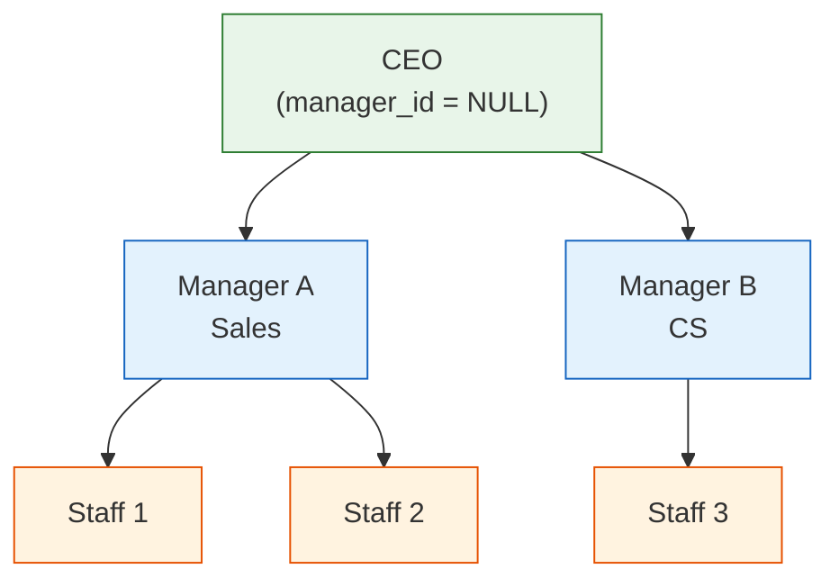

# Lesson 21: SELF JOIN and CROSS JOIN

So far you have learned to JOIN different tables together. This lesson covers **SELF JOIN** — joining a table to itself — and **CROSS JOIN** — producing every combination of rows from two sets. Both are essential for hierarchy queries and comparison analysis.



> Self-JOIN joins a table to itself. The staff table's manager_id represents an org chart.

## SELF JOIN — Joining a Table to Itself

A SELF JOIN is not special syntax. You simply give the same table two different aliases and JOIN them.

### Category Hierarchy

The `categories` table references itself via `parent_id`. A SELF JOIN unfolds this parent-child relationship.

```sql
-- Show each category alongside its parent
SELECT
    child.id,
    child.name       AS category,
    child.depth,
    parent.name      AS parent_category
FROM categories AS child
LEFT JOIN categories AS parent ON child.parent_id = parent.id
ORDER BY child.depth, child.sort_order;
```

**Result:**

| id | category | depth | parent_category |
|----|----------|-------|-----------------|
| 1 | Desktop PC | 0 | (NULL) |
| 5 | Laptop | 0 | (NULL) |
| 10 | Monitor | 0 | (NULL) |
| 2 | Prebuilt | 1 | Desktop PC |
| 6 | General Laptop | 1 | Laptop |
| 7 | Gaming Laptop | 1 | Laptop |
| ... | | | |

Top-level categories (`depth=0`) have a NULL `parent_id`, so `parent_category` is NULL. We use `LEFT JOIN` to keep these rows.

### Building Top-Sub Category Paths

A SELF JOIN builds the full path from parent (top) → child (sub) category.

```sql
SELECT
    parent.name AS top_category,
    child.name  AS sub_category,
    parent.name || ' > ' || child.name AS full_path
FROM categories AS child
INNER JOIN categories AS parent ON child.parent_id = parent.id
WHERE child.depth = 1
ORDER BY parent.sort_order, child.sort_order;
```

**Result:**

| top_category | sub_category | full_path |
|--------------|--------------|-----------|
| Desktop PC | Prebuilt | Desktop PC > Prebuilt |
| Desktop PC | Custom Build | Desktop PC > Custom Build |
| Laptop | General | Laptop > General |
| Laptop | Gaming | Laptop > Gaming |
| ... | | |

> **Tip:** SELF JOIN works well when the hierarchy depth is fixed. For variable depth, use the recursive CTE from Lesson 16.

### Comparing Products in the Same Category

Join `products` to itself to compare prices within the same category.

```sql
-- Find product pairs with the largest price difference in the same category
SELECT
    p1.name AS product_a,
    p2.name AS product_b,
    p1.price AS price_a,
    p2.price AS price_b,
    ABS(p1.price - p2.price) AS price_diff
FROM products AS p1
INNER JOIN products AS p2
    ON p1.category_id = p2.category_id
   AND p1.id < p2.id  -- prevent duplicate pairs (A-B only, not B-A)
ORDER BY price_diff DESC
LIMIT 10;
```

The `p1.id < p2.id` condition is key. Without it you get both (A, B) and (B, A), plus self-pairs (A, A).

### Staff Org Chart (staff.manager_id)

The `staff` table's `manager_id` references the `id` column in the same table. You can query the relationship between employees and their managers.

```sql
SELECT
    s.name AS employee,
    s.department,
    s.role,
    m.name AS manager
FROM staff s
LEFT JOIN staff m ON s.manager_id = m.id
ORDER BY s.id;
```

### Product Succession (products.successor_id)

Find discontinued products and their successor models.

```sql
SELECT
    old.name AS discontinued_product,
    old.discontinued_at,
    new.name AS successor_product,
    new.price AS new_price
FROM products old
JOIN products new ON old.successor_id = new.id
WHERE old.successor_id IS NOT NULL
ORDER BY old.discontinued_at;
```

### Product Q&A Threads (product_qna.parent_id)

Show questions and their answers side by side.

```sql
SELECT
    q.id AS question_id,
    q.content AS question,
    a.content AS answer,
    a.created_at AS answered_at
FROM product_qna q
LEFT JOIN product_qna a ON a.parent_id = q.id
WHERE q.parent_id IS NULL  -- top-level questions only
ORDER BY q.created_at DESC
LIMIT 10;
```

---

## CROSS JOIN — Generate Every Combination

`CROSS JOIN` combines every row from the left table with every row from the right table. Result rows = left rows × right rows. There is no ON condition.

### Month-Category Matrix

When a report must show "months with no data" too, build a complete frame with CROSS JOIN and LEFT JOIN the actual data.

```sql
-- 2024: 12 months × top-level categories
WITH months AS (
    SELECT '2024-01' AS m UNION ALL SELECT '2024-02'
    UNION ALL SELECT '2024-03' UNION ALL SELECT '2024-04'
    UNION ALL SELECT '2024-05' UNION ALL SELECT '2024-06'
    UNION ALL SELECT '2024-07' UNION ALL SELECT '2024-08'
    UNION ALL SELECT '2024-09' UNION ALL SELECT '2024-10'
    UNION ALL SELECT '2024-11' UNION ALL SELECT '2024-12'
),
top_categories AS (
    SELECT id, name FROM categories WHERE depth = 0
),
monthly_sales AS (
    SELECT
        SUBSTR(o.ordered_at, 1, 7) AS year_month,
        COALESCE(parent.id, cat.id) AS category_id,
        ROUND(SUM(oi.quantity * oi.unit_price), 2) AS revenue
    FROM order_items AS oi
    INNER JOIN orders     AS o      ON oi.order_id   = o.id
    INNER JOIN products   AS p      ON oi.product_id = p.id
    INNER JOIN categories AS cat    ON p.category_id = cat.id
    LEFT  JOIN categories AS parent ON cat.parent_id = parent.id
    WHERE o.ordered_at LIKE '2024%'
      AND o.status NOT IN ('cancelled', 'returned', 'return_requested')
    GROUP BY SUBSTR(o.ordered_at, 1, 7), COALESCE(parent.id, cat.id)
)
SELECT
    m.m AS year_month,
    tc.name AS category,
    COALESCE(ms.revenue, 0) AS revenue
FROM months AS m
CROSS JOIN top_categories AS tc
LEFT JOIN monthly_sales AS ms
    ON m.m = ms.year_month AND tc.id = ms.category_id
ORDER BY m.m, tc.name;
```

CROSS JOIN creates a full 12 × N matrix, then LEFT JOIN attaches actual revenue. Empty cells become 0 via `COALESCE`.

### Percentage of Total with CROSS JOIN

Another use: attach a grand total to every row for ratio calculations.

```sql
-- Each payment method's share of total revenue
SELECT
    p.method,
    COUNT(*)              AS tx_count,
    ROUND(SUM(p.amount), 2) AS total_amount,
    ROUND(100.0 * SUM(p.amount) / gt.grand_total, 1) AS pct
FROM payments AS p
CROSS JOIN (
    SELECT SUM(amount) AS grand_total
    FROM payments
    WHERE status = 'completed'
) AS gt
WHERE p.status = 'completed'
GROUP BY p.method, gt.grand_total
ORDER BY total_amount DESC;
```

> **Warning:** CROSS JOIN is powerful but dangerous with large tables — row counts multiply. Only use it when at least one side produces a small result set.

### Finding Days with No Orders (calendar CROSS JOIN)

Use the `calendar` table with LEFT JOIN to find days when no orders were placed.

```sql
SELECT
    c.date_key,
    c.day_name,
    c.is_weekend,
    c.is_holiday,
    c.holiday_name
FROM calendar c
LEFT JOIN orders o ON DATE(o.ordered_at) = c.date_key
WHERE o.id IS NULL
  AND c.year >= 2024
ORDER BY c.date_key;
```

---

!!! note "Lesson Review"
    Quick exercises to check your understanding of this lesson. For comprehensive practice combining multiple concepts, see the [Exercises](../exercises/) section.

## Exercises

### Exercise 1: Product Pairs from the Same Supplier

Find product pairs from the same supplier with their price difference. Remove duplicate pairs.

??? success "Answer"
    ```sql
    SELECT
        s.company_name AS supplier,
        p1.name AS product_a,
        p2.name AS product_b,
        p1.price AS price_a,
        p2.price AS price_b,
        ABS(p1.price - p2.price) AS price_diff
    FROM products AS p1
    INNER JOIN products AS p2
        ON p1.supplier_id = p2.supplier_id
       AND p1.id < p2.id
    INNER JOIN suppliers AS s ON p1.supplier_id = s.id
    ORDER BY price_diff DESC
    LIMIT 10;
    ```

### Exercise 2: Customers with Multiple Shipping Addresses

Find customers who have different addresses. (SELF JOIN on `customer_addresses`)

??? success "Answer"
    ```sql
    SELECT
        c.name,
        a1.address1 AS address_1,
        a2.address1 AS address_2
    FROM customer_addresses AS a1
    INNER JOIN customer_addresses AS a2
        ON a1.customer_id = a2.customer_id
       AND a1.id < a2.id
       AND a1.address1 <> a2.address1
    INNER JOIN customers AS c ON a1.customer_id = c.id
    GROUP BY c.id, c.name, a1.address1, a2.address1
    ORDER BY c.name
    LIMIT 15;
    ```

### Exercise 3: Month-Supplier CROSS JOIN Report

For each month of 2024 and each supplier, show the inbound quantity. Display 0 for months with no inbound.

??? success "Answer"
    ```sql
    WITH months AS (
        SELECT '2024-01' AS m UNION ALL SELECT '2024-02'
        UNION ALL SELECT '2024-03' UNION ALL SELECT '2024-04'
        UNION ALL SELECT '2024-05' UNION ALL SELECT '2024-06'
        UNION ALL SELECT '2024-07' UNION ALL SELECT '2024-08'
        UNION ALL SELECT '2024-09' UNION ALL SELECT '2024-10'
        UNION ALL SELECT '2024-11' UNION ALL SELECT '2024-12'
    ),
    supplier_inbound AS (
        SELECT
            SUBSTR(it.created_at, 1, 7) AS year_month,
            p.supplier_id,
            SUM(it.quantity) AS inbound_qty
        FROM inventory_transactions AS it
        INNER JOIN products AS p ON it.product_id = p.id
        WHERE it.type = 'inbound' AND it.created_at LIKE '2024%'
        GROUP BY SUBSTR(it.created_at, 1, 7), p.supplier_id
    )
    SELECT
        m.m AS year_month,
        s.company_name AS supplier,
        COALESCE(si.inbound_qty, 0) AS inbound_qty
    FROM months AS m
    CROSS JOIN suppliers AS s
    LEFT JOIN supplier_inbound AS si
        ON m.m = si.year_month AND s.id = si.supplier_id
    ORDER BY m.m, s.company_name
    LIMIT 30;
    ```
