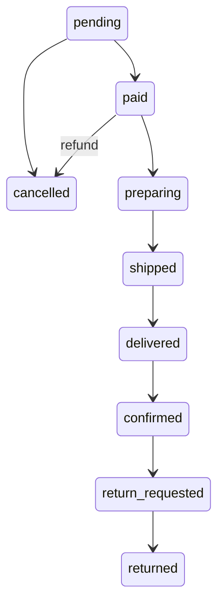

# Database Schema

## Entity Relationship Diagram

=== "Order Core"

    The core transaction flow: Customer → Order → Payment/Shipping/Returns.

    ```mermaid
    erDiagram
        customers ||--o{ orders : "customer_id"
        customers ||--o{ customer_addresses : "customer_id"
        customer_addresses ||--o{ orders : "address_id"
        staff ||--o{ orders : "staff_id (CS)"

        orders ||--o{ order_items : "order_id"
        orders ||--|| payments : "order_id"
        orders ||--o| shipping : "order_id"
        orders ||--o{ returns : "order_id"
        products ||--o{ order_items : "product_id"
    ```

=== "Product Catalog"

    Category hierarchy, suppliers, product images, and price history.

    ```mermaid
    erDiagram
        categories ||--o{ categories : "parent_id (self-ref)"
        categories ||--o{ products : "category_id"
        suppliers ||--o{ products : "supplier_id"
        products ||--o{ product_images : "product_id"
        products ||--o{ product_prices : "product_id"
        products ||--o{ inventory_transactions : "product_id"
    ```

=== "Customer Activity"

    Reviews, wishlists, carts, and complaints.

    ```mermaid
    erDiagram
        customers ||--o{ reviews : "customer_id"
        products ||--o{ reviews : "product_id"
        orders ||--o{ reviews : "order_id"

        customers ||--o{ wishlists : "customer_id"
        products ||--o{ wishlists : "product_id"

        customers ||--o{ carts : "customer_id"
        carts ||--o{ cart_items : "cart_id"
        products ||--o{ cart_items : "product_id"

        customers ||--o{ complaints : "customer_id"
        orders ||--o{ complaints : "order_id"
        staff ||--o{ complaints : "staff_id"
    ```

=== "Coupons"

    Coupon issuance and redemption tracking.

    ```mermaid
    erDiagram
        coupons ||--o{ coupon_usage : "coupon_id"
        customers ||--o{ coupon_usage : "customer_id"
        orders ||--o{ coupon_usage : "order_id"
    ```

=== "Full"

    All 21 tables and their relationships.

    ```mermaid
    erDiagram
        categories ||--o{ products : "category_id"
        categories ||--o{ categories : "parent_id"
        suppliers ||--o{ products : "supplier_id"
        products ||--o{ product_images : "product_id"
        products ||--o{ product_prices : "product_id"
        products ||--o{ inventory_transactions : "product_id"

        customers ||--o{ customer_addresses : "customer_id"
        customers ||--o{ orders : "customer_id"
        customer_addresses ||--o{ orders : "address_id"
        staff ||--o{ orders : "staff_id"
        staff ||--o{ complaints : "staff_id"

        orders ||--|| payments : "order_id"
        orders ||--o{ order_items : "order_id"
        orders ||--o| shipping : "order_id"
        orders ||--o{ returns : "order_id"
        products ||--o{ order_items : "product_id"

        customers ||--o{ reviews : "customer_id"
        products ||--o{ reviews : "product_id"
        orders ||--o{ reviews : "order_id"

        customers ||--o{ carts : "customer_id"
        carts ||--o{ cart_items : "cart_id"
        products ||--o{ cart_items : "product_id"

        customers ||--o{ wishlists : "customer_id"
        products ||--o{ wishlists : "product_id"

        customers ||--o{ complaints : "customer_id"
        orders ||--o{ complaints : "order_id"

        coupons ||--o{ coupon_usage : "coupon_id"
        customers ||--o{ coupon_usage : "customer_id"
        orders ||--o{ coupon_usage : "order_id"
    ```

## Relationship Types

| Type | Example | Description |
|------|---------|-------------|
| **1:1** | orders → payments | Each order has exactly one payment |
| **1:N** | customers → orders | One customer can have many orders |
| **M:N** | customers ↔ products (wishlists) | Many customers can like many products |
| **Self-ref** | categories.parent_id → categories.id | Parent-child hierarchy |
| **Nullable FK** | orders.staff_id → staff.id | Only assigned for CS cases |

## Table Details

### customers

| Column | Type | Notes |
|--------|------|-------|
| 🔑 id | INTEGER | Auto-increment |
| email | TEXT | UNIQUE — `user123@testmail.com` |
| password_hash | TEXT | SHA-256 (fictitious) |
| name | TEXT | Full name |
| phone | TEXT | `555-XXXX-XXXX` (fictitious) |
| birth_date | TEXT | Nullable (~15% NULL) |
| gender | TEXT | 'M'/'F'/NULL (~10% NULL, M:65%) |
| grade | TEXT | CHECK: BRONZE/SILVER/GOLD/VIP |
| point_balance | INTEGER | CHECK: >= 0 |
| is_active | INTEGER | 0=deactivated, 1=active |
| last_login_at | TEXT | NULL = never logged in |
| created_at | TEXT | Signup date |
| updated_at | TEXT | |

### orders

| Column | Type | Notes |
|--------|------|-------|
| 🔑 id | INTEGER | Auto-increment |
| order_number | TEXT | UNIQUE — `ORD-20240315-00001` |
| 🔗 customer_id | INTEGER | → customers(id) |
| 🔗 address_id | INTEGER | → customer_addresses(id) |
| 🔗 staff_id | INTEGER | → staff(id), NULL if no CS |
| status | TEXT | pending/paid/preparing/shipped/delivered/confirmed/cancelled/return_requested/returned |
| total_amount | REAL | Final payment amount |
| discount_amount | REAL | Total discount |
| shipping_fee | REAL | Free if total >= 50,000 |
| point_used | INTEGER | Points redeemed |
| point_earned | INTEGER | Points earned |
| notes | TEXT | Delivery instructions (~35%) |
| ordered_at | TEXT | Order timestamp |
| completed_at | TEXT | Confirmation date |
| cancelled_at | TEXT | Cancellation date |

### Order Status Flow



### payments

| Column | Type | Notes |
|--------|------|-------|
| 🔑 id | INTEGER | |
| 🔗 order_id | INTEGER | → orders(id) |
| method | TEXT | card/bank_transfer/virtual_account/kakao_pay/naver_pay/point |
| amount | REAL | CHECK: >= 0 |
| status | TEXT | CHECK: pending/completed/failed/refunded |
| card_issuer | TEXT | Visa, Mastercard, etc. (card only) |
| card_approval_no | TEXT | 8-digit approval number |
| installment_months | INTEGER | 0=lump sum, 2/3/6/10/12/24 |
| bank_name | TEXT | For bank_transfer/virtual_account |
| account_no | TEXT | Virtual account number |
| depositor_name | TEXT | Depositor name (bank_transfer) |
| easy_pay_method | TEXT | PayPal Balance, Linked Card, etc. |
| receipt_type | TEXT | Tax Deduction / Business Expense |
| receipt_no | TEXT | Receipt number |

For complete column details on all 21 tables, run:

```sql
SELECT name, sql FROM sqlite_master WHERE type = 'table' ORDER BY name;
```
