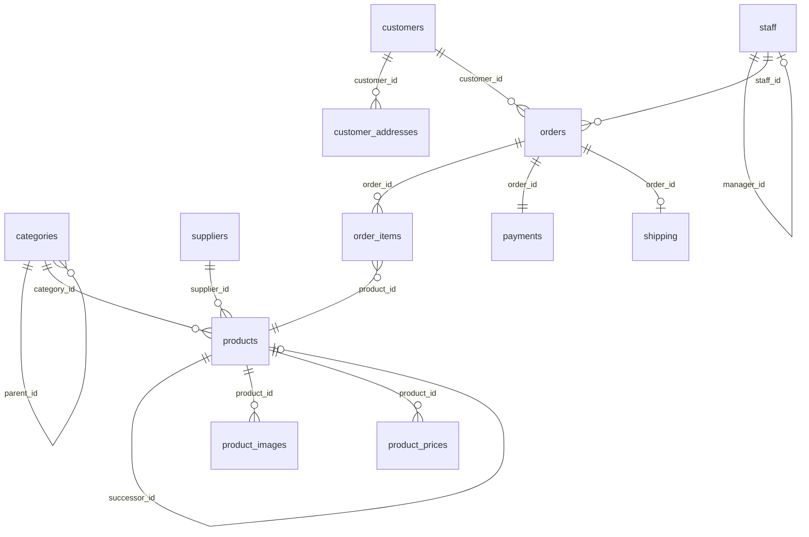
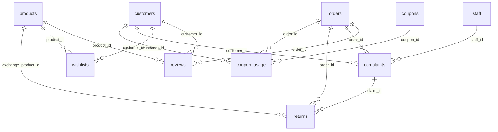
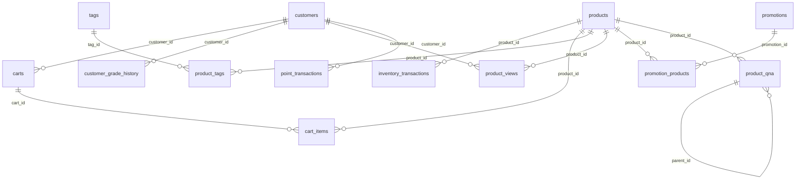

# Database Schema

## Overview

This tutorial uses the **TechShop** database -- a fictional 10-year-old e-commerce store selling computers and peripherals.
With 52,300 customers, 378,000 orders, 2,800 products, and more at medium scale, the data is realistic enough for meaningful SQL practice.

> The data is generated with seed 42 (deterministic), so identical queries always return identical results.

## Entity Relationship Diagram (ERD)

### Core Commerce — 12 Tables



### Engagement & Support — 6 Tables



### Analytics & Rewards — 12 Tables



> `calendar` is a standalone dimension table with no FK relationships — used for CROSS JOIN and date gap analysis.

### Relationship Types

| Type | Example | Description |
|------|------|------|
| 1:1 | orders → payments | One payment per order |
| 1:N | customers → orders | One customer, many orders |
| M:N | products ↔ tags (product_tags) | Many-to-many via bridge table |
| Self-ref | categories.parent_id, staff.manager_id, products.successor_id, product_qna.parent_id | Hierarchy/links within same table |
| Nullable FK | orders.staff_id → staff.id | Only assigned for orders requiring CS |
| Cross-table FK | returns.claim_id → complaints.id | Return originated from a CS complaint |

---

## Data Size by Scale

Row counts per table based on the `--size` option. Medium/Large are estimates based on Small.

| Table | Small (0.1x) | Medium (1x) | Large (5x) |
|-------|------:|------:|------:|
| `customers` | 5,230 | ~52,300 | ~261,500 |
| `orders` | 34,908 | ~349,080 | ~1,745,400 |
| `order_items` | 84,270 | ~842,700 | ~4,213,500 |
| `product_views` | 299,792 | ~2,997,920 | ~14,989,600 |
| `point_transactions` | 130,149 | ~1,301,490 | ~6,507,450 |
| `payments` | 34,908 | ~349,080 | ~1,745,400 |
| `shipping` | 33,107 | ~331,070 | ~1,655,350 |
| `inventory_transactions` | 14,331 | ~143,310 | ~716,550 |
| `customer_grade_history` | 10,273 | ~102,730 | ~513,650 |
| `cart_items` | 9,037 | ~90,370 | ~451,850 |
| `customer_addresses` | 8,554 | ~85,540 | ~427,700 |
| `reviews` | 7,945 | ~79,450 | ~397,250 |
| `promotion_products` | 6,871 | ~68,710 | ~343,550 |
| `calendar` | 3,469 | ~34,690 | ~173,450 |
| `complaints` | 3,477 | ~34,770 | ~173,850 |
| `carts` | 3,000 | ~30,000 | ~150,000 |
| `wishlists` | 1,999 | ~19,990 | ~99,950 |
| `product_tags` | 1,288 | ~12,880 | ~64,400 |
| `product_qna` | 946 | ~9,460 | ~47,300 |
| `returns` | 936 | ~9,360 | ~46,800 |
| `product_prices` | 829 | ~8,290 | ~41,450 |
| `product_images` | 748 | ~7,480 | ~37,400 |
| `products` | 280 | ~2,800 | ~14,000 |
| `promotions` | 129 | ~1,290 | ~6,450 |
| `coupon_usage` | 111 | ~1,110 | ~5,550 |
| `suppliers` | 60 | ~600 | ~3,000 |
| `categories` | 53 | ~530 | ~2,650 |
| `tags` | 46 | ~460 | ~2,300 |
| `coupons` | 20 | ~200 | ~1,000 |
| `staff` | 5 | ~50 | ~250 |
| **Total** | **~697K** | **~6.97M** | **~34.8M** |

!!! info "File Sizes"
    | Scale | SQLite DB | MySQL SQL | PG SQL | Generation Time |
    |-------|----------:|----------:|-------:|----------------:|
    | Small | ~80 MB | ~62 MB | ~62 MB | ~20s |
    | Medium | ~800 MB | ~620 MB | ~620 MB | ~3 min |
    | Large | ~4 GB | ~3.1 GB | ~3.1 GB | ~15 min |

---

## Table List

### Core Commerce -- 12 tables

| # | Table | Rows | Description |
|--:|-------|-----:|-------------|
| 1 | categories | 53 | Product categories (3-level hierarchy) |
| 2 | suppliers | 60 | Product vendors |
| 3 | products | 2,800 | Products (JSON specs, successor links) |
| 4 | product_images | 7,284 | Product images |
| 5 | product_prices | 8,347 | Price change history |
| 6 | customers | 52,300 | Customers (grades, acquisition channel) |
| 7 | customer_addresses | 86,141 | Customer shipping addresses |
| 8 | staff | 50 | Employees (manager self-reference) |
| 9 | orders | 378,368 | Orders |
| 10 | order_items | 809,564 | Order line items |
| 11 | payments | 378,368 | Payments |
| 12 | shipping | 359,313 | Delivery tracking |

### Engagement & Support -- 6 tables

| # | Table | Rows | Description |
|--:|-------|-----:|-------------|
| 13 | reviews | 86,806 | Product reviews |
| 14 | wishlists | 19,995 | Wish lists (purchase conversion tracking) |
| 15 | complaints | 37,953 | Customer inquiries/complaints (type/compensation/escalation) |
| 16 | returns | 11,413 | Returns/exchanges (linked to complaints, restocking fees) |
| 17 | coupons | 200 | Coupons |
| 18 | coupon_usage | 1,747 | Coupon usage records |

### Analytics & Rewards -- 12 tables

| # | Table | Rows | Description |
|--:|-------|-----:|-------------|
| 19 | inventory_transactions | 130,322 | Stock in/out history |
| 20 | carts | 30,000 | Shopping carts |
| 21 | cart_items | 90,061 | Cart items |
| 22 | calendar | 3,653 | Date dimension (CROSS JOIN exercises) |
| 23 | customer_grade_history | 148,000 | Grade change audit trail (SCD Type 2) |
| 24 | tags | 80 | Product tags |
| 25 | product_tags | 19,600 | Product-tag mapping (M:N) |
| 26 | product_views | 2,900,000 | Page view log (funnel/cohort analysis) |
| 27 | point_transactions | 1,300,000 | Point earn/use/expire ledger |
| 28 | promotions | 400 | Promotion/sale events |
| 29 | promotion_products | 4,800 | Promotion target products |
| 30 | product_qna | 21,000 | Product Q&A (self-referencing) |

---

## Table Details

### categories -- Product Categories

3-level hierarchy (top -> mid -> sub). `parent_id` is NULL for top-level categories.

| Column | Type | Notes |
|--------|------|-------|
| :key: id | INTEGER | Auto-increment |
| :link: parent_id | INTEGER | -> categories(id), NULL = top-level (self-ref) |
| name | TEXT | Category name |
| slug | TEXT | UNIQUE -- URL-friendly identifier |
| depth | INTEGER | 0=top, 1=mid, 2=sub |
| sort_order | INTEGER | Display order |
| is_active | INTEGER | Active flag (0/1) |
| created_at, updated_at | TEXT | Timestamps |

```sql
-- Category tree query
SELECT id, name, depth, parent_id
FROM categories
WHERE depth = 0
ORDER BY sort_order;
```

### suppliers -- Product Vendors

60 companies that supply products. Each product belongs to exactly one supplier.

| Column | Type | Notes |
|--------|------|-------|
| :key: id | INTEGER | Auto-increment |
| company_name | TEXT | Company name |
| business_number | TEXT | Business registration number (fictitious) |
| contact_name | TEXT | Contact person |
| phone | TEXT | 020-XXXX-XXXX (fictitious number) |
| email | TEXT | contact@xxx.test.kr |
| address | TEXT | Business address |
| is_active | INTEGER | Active flag |
| created_at, updated_at | TEXT | Timestamps |

### products -- Products

2,800 electronics products. Identified by unique SKU codes. Includes price, cost, stock, discontinuation status.
**v2.0**: `successor_id` links discontinued products to their replacements; `specs` stores JSON product specifications.

| Column | Type | Notes |
|--------|------|-------|
| :key: id | INTEGER | Auto-increment |
| :link: category_id | INTEGER | -> categories(id) |
| :link: supplier_id | INTEGER | -> suppliers(id) |
| :link: successor_id | INTEGER | -> products(id), successor model (self-ref, NULL = current) |
| name | TEXT | Product name |
| sku | TEXT | UNIQUE -- stock keeping unit (e.g. LA-GEN-Samsung-00001) |
| brand | TEXT | Brand name |
| model_number | TEXT | Model number |
| description | TEXT | Product description |
| specs | TEXT | JSON product specifications (nullable) |
| price | REAL | Current selling price (KRW), CHECK >= 0 |
| cost_price | REAL | Cost price (KRW), CHECK >= 0 |
| stock_qty | INTEGER | Current stock quantity |
| weight_grams | INTEGER | Shipping weight (g) |
| is_active | INTEGER | On-sale flag |
| discontinued_at | TEXT | Discontinuation date (NULL = active) |
| created_at, updated_at | TEXT | Timestamps |

```sql
-- Brand-level average price and product count
SELECT brand, COUNT(*) AS cnt, CAST(AVG(price) AS INTEGER) AS avg_price
FROM products
WHERE is_active = 1
GROUP BY brand
ORDER BY cnt DESC
LIMIT 10;
```

### product_images -- Product Images

Multi-angle images per product. `is_primary` distinguishes the main image.

| Column | Type | Notes |
|--------|------|-------|
| :key: id | INTEGER | Auto-increment |
| :link: product_id | INTEGER | -> products(id) |
| image_url | TEXT | Image path/URL |
| file_name | TEXT | Filename (e.g. 42_1.jpg) |
| image_type | TEXT | main/angle/side/back/detail/package/lifestyle |
| alt_text | TEXT | Alt text |
| width, height | INTEGER | Image dimensions (px) |
| file_size | INTEGER | File size (bytes) |
| sort_order | INTEGER | Display order |
| is_primary | INTEGER | Primary image flag |
| created_at | TEXT | Timestamp |

### product_prices -- Price History

Records of product price changes. `ended_at` is NULL for the currently active price.

| Column | Type | Notes |
|--------|------|-------|
| :key: id | INTEGER | Auto-increment |
| :link: product_id | INTEGER | -> products(id) |
| price | REAL | Price during this period |
| started_at | TEXT | Effective start date |
| ended_at | TEXT | Effective end date (NULL = current price) |
| change_reason | TEXT | regular/promotion/price_drop/cost_increase |

### customers -- Customers

52,300 registered members. Tiered grade system (BRONZE-VIP), point balance, active/deactivated status.
**v2.0**: `acquisition_channel` tracks how each customer signed up.

| Column | Type | Notes |
|--------|------|-------|
| :key: id | INTEGER | Auto-increment |
| email | TEXT | UNIQUE -- `user123@testmail.kr` |
| password_hash | TEXT | SHA-256 (fictitious) |
| name | TEXT | Full name |
| phone | TEXT | `020-XXXX-XXXX` (fictitious number) |
| birth_date | TEXT | Date of birth (~15% NULL) |
| gender | TEXT | M/F (NULL ~10%, M:65%) |
| grade | TEXT | CHECK: BRONZE/SILVER/GOLD/VIP |
| point_balance | INTEGER | Point balance, CHECK >= 0 |
| acquisition_channel | TEXT | organic/search_ad/social/referral/direct (nullable) |
| is_active | INTEGER | 0=deactivated, 1=active |
| last_login_at | TEXT | NULL = never logged in |
| created_at, updated_at | TEXT | Signup/update date |

```sql
-- Grade distribution and average point balance
SELECT grade, COUNT(*) AS cnt, CAST(AVG(point_balance) AS INTEGER) AS avg_points
FROM customers
WHERE is_active = 1
GROUP BY grade;
```

### customer_addresses -- Shipping Addresses

Multiple addresses per customer. `is_default` marks the primary shipping address.
**v2.0**: `updated_at` tracks address changes.

| Column | Type | Notes |
|--------|------|-------|
| :key: id | INTEGER | Auto-increment |
| :link: customer_id | INTEGER | -> customers(id) |
| label | TEXT | Home/Office/Other |
| recipient_name | TEXT | Recipient |
| phone | TEXT | Recipient phone |
| zip_code | TEXT | Zip code |
| address1 | TEXT | Base address |
| address2 | TEXT | Detail address |
| is_default | INTEGER | Default address flag |
| created_at | TEXT | Timestamp |
| updated_at | TEXT | Address change date (nullable) |

### staff -- Employees

50 store employees. Used for CS assignment and complaint handling.
**v2.0**: `manager_id` creates a self-referencing supervisor hierarchy.

| Column | Type | Notes |
|--------|------|-------|
| :key: id | INTEGER | Auto-increment |
| :link: manager_id | INTEGER | -> staff(id), supervisor (self-ref, NULL = top-level) |
| email | TEXT | UNIQUE -- staffN@techshop-staff.kr |
| name | TEXT | Employee name |
| phone | TEXT | Phone |
| department | TEXT | sales/logistics/CS/marketing/dev/management |
| role | TEXT | admin/manager/staff |
| is_active | INTEGER | Active flag |
| hired_at | TEXT | Hire date |
| created_at | TEXT | Timestamp |

### orders -- Orders

Core transaction table (378,368 rows). Order number format: `ORD-YYYYMMDD-NNNNN`. 9-stage status tracking.

| Column | Type | Notes |
|--------|------|-------|
| :key: id | INTEGER | Auto-increment |
| order_number | TEXT | UNIQUE -- `ORD-20240315-00001` |
| :link: customer_id | INTEGER | -> customers(id) |
| :link: address_id | INTEGER | -> customer_addresses(id) |
| :link: staff_id | INTEGER | -> staff(id), NULL if no CS needed |
| status | TEXT | See status flow below |
| total_amount | REAL | Final payment amount |
| discount_amount | REAL | Total discount |
| shipping_fee | REAL | Free shipping if total >= 50,000 |
| point_used | INTEGER | Points redeemed |
| point_earned | INTEGER | Points to be earned |
| notes | TEXT | Delivery instructions (~35%) |
| ordered_at | TEXT | Order timestamp |
| completed_at | TEXT | Confirmation date |
| cancelled_at | TEXT | Cancellation date |
| created_at, updated_at | TEXT | Timestamps |

#### Order Status Flow

```
pending -> paid -> preparing -> shipped -> delivered -> confirmed
                                                          |
pending -> cancelled                            return_requested -> returned
paid -> cancelled (-> refund)
```

### order_items -- Order Line Items

Individual products within each order. Captures unit price and discount at order time, independent of later price changes.

| Column | Type | Notes |
|--------|------|-------|
| :key: id | INTEGER | Auto-increment |
| :link: order_id | INTEGER | -> orders(id) |
| :link: product_id | INTEGER | -> products(id) |
| quantity | INTEGER | Qty, CHECK > 0 |
| unit_price | REAL | Price at time of order |
| discount_amount | REAL | Item discount |
| subtotal | REAL | (unit_price x qty) - discount |

```sql
-- Top 10 best-selling products
SELECT p.name, p.brand, SUM(oi.quantity) AS total_sold
FROM order_items oi
JOIN products p ON oi.product_id = p.id
JOIN orders o ON oi.order_id = o.id
WHERE o.status NOT IN ('cancelled')
GROUP BY p.id
ORDER BY total_sold DESC
LIMIT 10;
```

### payments -- Payments

One payment per order. Supports card, bank transfer, virtual account, and e-wallet methods.

| Column | Type | Notes |
|--------|------|-------|
| :key: id | INTEGER | Auto-increment |
| :link: order_id | INTEGER | -> orders(id) |
| method | TEXT | card/bank_transfer/virtual_account/kakao_pay/naver_pay/point |
| amount | REAL | Payment amount, CHECK >= 0 |
| status | TEXT | CHECK: pending/completed/failed/refunded |
| pg_transaction_id | TEXT | PG transaction ID (fictitious) |
| card_issuer | TEXT | Shinhan/Samsung/KB/Hyundai/Lotte/Hana/Woori/NH/BC |
| card_approval_no | TEXT | 8-digit card approval number |
| installment_months | INTEGER | Installment months (0=lump sum) |
| bank_name | TEXT | Bank name (for bank_transfer/virtual_account) |
| account_no | TEXT | Virtual account number |
| depositor_name | TEXT | Depositor name |
| easy_pay_method | TEXT | E-wallet internal method |
| receipt_type | TEXT | Tax Deduction / Business Expense |
| receipt_no | TEXT | Receipt number |
| paid_at | TEXT | Payment completion time |
| refunded_at | TEXT | Refund time |
| created_at | TEXT | Timestamp |

### shipping -- Delivery Tracking

Shipment tracking per order with carrier and status.

| Column | Type | Notes |
|--------|------|-------|
| :key: id | INTEGER | Auto-increment |
| :link: order_id | INTEGER | -> orders(id) |
| carrier | TEXT | CJ Logistics / Hanjin / Logen / Korea Post |
| tracking_number | TEXT | Tracking number |
| status | TEXT | preparing/shipped/in_transit/delivered/returned |
| shipped_at | TEXT | Ship date |
| delivered_at | TEXT | Delivery date |
| created_at, updated_at | TEXT | Timestamps |

### reviews -- Product Reviews

86,806 purchase-verified reviews. Rating distribution: 5-star 40%, 4-star 30%, 3-star 15%, 2-star 10%, 1-star 5%.

| Column | Type | Notes |
|--------|------|-------|
| :key: id | INTEGER | Auto-increment |
| :link: product_id | INTEGER | -> products(id) |
| :link: customer_id | INTEGER | -> customers(id) |
| :link: order_id | INTEGER | -> orders(id) |
| rating | INTEGER | 1-5, CHECK BETWEEN 1 AND 5 |
| title | TEXT | Review title (~80%) |
| content | TEXT | Review body |
| is_verified | INTEGER | Purchase verification flag |
| created_at, updated_at | TEXT | Timestamps |

```sql
-- Average rating and review count per product
SELECT p.name, COUNT(r.id) AS review_count, ROUND(AVG(r.rating), 1) AS avg_rating
FROM products p
JOIN reviews r ON p.id = r.product_id
GROUP BY p.id
HAVING review_count >= 10
ORDER BY avg_rating DESC
LIMIT 10;
```

### inventory_transactions -- Stock Movements

Product stock change history. Inbound (positive), outbound (negative), returns, and adjustments.

| Column | Type | Notes |
|--------|------|-------|
| :key: id | INTEGER | Auto-increment |
| :link: product_id | INTEGER | -> products(id) |
| type | TEXT | inbound/outbound/return/adjustment |
| quantity | INTEGER | Positive = in, Negative = out |
| reference_id | INTEGER | Related order ID |
| notes | TEXT | Initial stock / regular restock / return, etc. |
| created_at | TEXT | Timestamp |

### carts -- Shopping Carts

Per-customer carts. Tracks conversion (converted) and abandonment (abandoned) status.

| Column | Type | Notes |
|--------|------|-------|
| :key: id | INTEGER | Auto-increment |
| :link: customer_id | INTEGER | -> customers(id) |
| status | TEXT | active/converted/abandoned |
| created_at, updated_at | TEXT | Timestamps |

### cart_items -- Cart Items

Individual products within a cart.

| Column | Type | Notes |
|--------|------|-------|
| :key: id | INTEGER | Auto-increment |
| :link: cart_id | INTEGER | -> carts(id) |
| :link: product_id | INTEGER | -> products(id) |
| quantity | INTEGER | Quantity |
| added_at | TEXT | Added timestamp |

### coupons -- Coupons

200 discount coupons. Percentage or fixed amount, with usage limits and validity periods.

| Column | Type | Notes |
|--------|------|-------|
| :key: id | INTEGER | Auto-increment |
| code | TEXT | UNIQUE -- coupon code (CP2401001) |
| name | TEXT | Coupon name |
| type | TEXT | percent/fixed |
| discount_value | REAL | Discount rate (%) or amount, CHECK > 0 |
| min_order_amount | REAL | Minimum order amount |
| max_discount | REAL | Maximum discount (percent type) |
| usage_limit | INTEGER | Total usage limit |
| per_user_limit | INTEGER | Per-user limit |
| is_active | INTEGER | Active flag |
| started_at | TEXT | Validity start |
| expired_at | TEXT | Validity end |
| created_at | TEXT | Timestamp |

### coupon_usage -- Coupon Usage Records

Records of actual coupon usage: which customer, which order, how much discount.

| Column | Type | Notes |
|--------|------|-------|
| :key: id | INTEGER | Auto-increment |
| :link: coupon_id | INTEGER | -> coupons(id) |
| :link: customer_id | INTEGER | -> customers(id) |
| :link: order_id | INTEGER | -> orders(id) |
| discount_amount | REAL | Actual discount amount |
| used_at | TEXT | Usage timestamp |

### complaints -- Customer Inquiries/Complaints

37,953 CS inquiries. 7 categories, 5 channels, 4 priority levels.
**v2.0**: Added `type` (inquiry/claim/report), `sub_category`, `compensation_type`, `compensation_amount`, `escalated`, and `response_count` columns.

| Column | Type | Notes |
|--------|------|-------|
| :key: id | INTEGER | Auto-increment |
| :link: order_id | INTEGER | -> orders(id), NULL = general inquiry |
| :link: customer_id | INTEGER | -> customers(id) |
| :link: staff_id | INTEGER | -> staff(id), assigned CS agent |
| category | TEXT | product_defect/delivery_issue/wrong_item/refund_request/exchange_request/general_inquiry/price_inquiry |
| channel | TEXT | website/phone/email/chat/kakao |
| priority | TEXT | low/medium/high/urgent |
| status | TEXT | open/resolved/closed |
| title | TEXT | Inquiry title |
| content | TEXT | Inquiry body |
| resolution | TEXT | Resolution detail (when resolved) |
| type | TEXT | inquiry/claim/report |
| sub_category | TEXT | Detailed category (e.g. initial_defect/in_use_damage/misdelivery) |
| compensation_type | TEXT | refund/exchange/partial_refund/point_compensation/none |
| compensation_amount | REAL | Compensation amount |
| escalated | INTEGER | Escalated to supervisor (0/1) |
| response_count | INTEGER | Number of responses |
| created_at | TEXT | Submitted date |
| resolved_at | TEXT | Resolved date |
| closed_at | TEXT | Closed date |

### returns -- Returns & Exchanges

11,413 return/exchange requests. Full lifecycle tracking from request to completion.
**v2.0**: Added `claim_id` (return originated from a CS complaint), `exchange_product_id` (replacement product), and `restocking_fee` (change-of-mind restocking fee).

| Column | Type | Notes |
|--------|------|-------|
| :key: id | INTEGER | Auto-increment |
| :link: order_id | INTEGER | -> orders(id) |
| :link: customer_id | INTEGER | -> customers(id) |
| :link: claim_id | INTEGER | -> complaints(id), linked CS complaint (nullable) |
| :link: exchange_product_id | INTEGER | -> products(id), replacement product (nullable) |
| return_type | TEXT | refund/exchange |
| reason | TEXT | defective/wrong_item/change_of_mind/damaged_in_transit/not_as_described/late_delivery |
| reason_detail | TEXT | Detailed reason |
| status | TEXT | requested/pickup_scheduled/in_transit/completed |
| is_partial | INTEGER | Partial return (~17%) |
| refund_amount | REAL | Refund amount |
| refund_status | TEXT | pending/refunded/exchanged/partial_refund |
| restocking_fee | REAL | Change-of-mind restocking fee (default 0) |
| carrier | TEXT | Pickup carrier |
| tracking_number | TEXT | Pickup tracking number |
| requested_at | TEXT | Request date |
| pickup_at | TEXT | Pickup date |
| received_at | TEXT | Warehouse receipt date |
| inspected_at | TEXT | Inspection date |
| inspection_result | TEXT | good/opened_good/defective/unsellable |
| completed_at | TEXT | Completion date |
| created_at | TEXT | Timestamp |

### wishlists -- Wish Lists

Customer product favorites. UNIQUE on (customer_id, product_id).
**v2.0**: `is_purchased` tracks whether a wishlisted product was eventually purchased.

| Column | Type | Notes |
|--------|------|-------|
| :key: id | INTEGER | Auto-increment |
| :link: customer_id | INTEGER | -> customers(id) |
| :link: product_id | INTEGER | -> products(id) |
| is_purchased | INTEGER | Converted to purchase (0/1) |
| notify_on_sale | INTEGER | Price drop notification (0/1) |
| created_at | TEXT | Timestamp |

### calendar -- Date Dimension Table

Covers the full date range (2016-2025). Used for CROSS JOIN and date gap analysis.

| Column | Type | Notes |
|--------|------|-------|
| :key: date_key | TEXT | YYYY-MM-DD (primary key) |
| year | INTEGER | Year |
| month | INTEGER | Month |
| day | INTEGER | Day |
| quarter | INTEGER | Quarter (1-4) |
| day_of_week | INTEGER | 0=Mon .. 6=Sun |
| day_name | TEXT | Monday-Sunday |
| is_weekend | INTEGER | Weekend flag (0/1) |
| is_holiday | INTEGER | Public holiday flag (0/1) |
| holiday_name | TEXT | Holiday name |

### customer_grade_history -- Grade Change Audit

Tracks every customer grade change. Used to learn the SCD (Slowly Changing Dimension) Type 2 pattern.

| Column | Type | Notes |
|--------|------|-------|
| :key: id | INTEGER | Auto-increment |
| :link: customer_id | INTEGER | -> customers(id) |
| old_grade | TEXT | Previous grade (NULL = initial signup) |
| new_grade | TEXT | New grade |
| changed_at | TEXT | Change datetime |
| reason | TEXT | signup/upgrade/downgrade/yearly_review |

### tags / product_tags -- Product Tags

80 tags and their product mappings. Demonstrates the M:N bridge table pattern.

**tags:**

| Column | Type | Notes |
|--------|------|-------|
| :key: id | INTEGER | Auto-increment |
| name | TEXT | UNIQUE -- tag name |
| category | TEXT | feature/use_case/target/spec |

**product_tags:**

| Column | Type | Notes |
|--------|------|-------|
| :link: product_id | INTEGER | -> products(id), composite PK |
| :link: tag_id | INTEGER | -> tags(id), composite PK |

### product_views -- Page View Log

Product page view records. Includes referrer source, device type, and dwell time.

| Column | Type | Notes |
|--------|------|-------|
| :key: id | INTEGER | Auto-increment |
| :link: customer_id | INTEGER | -> customers(id) |
| :link: product_id | INTEGER | -> products(id) |
| referrer_source | TEXT | direct/search/ad/recommendation/social/email |
| device_type | TEXT | desktop/mobile/tablet |
| duration_seconds | INTEGER | Page dwell time (seconds) |
| viewed_at | TEXT | View timestamp |

### point_transactions -- Point Ledger

Point earn/use/expire history. `balance_after` tracks the running balance.

| Column | Type | Notes |
|--------|------|-------|
| :key: id | INTEGER | Auto-increment |
| :link: customer_id | INTEGER | -> customers(id) |
| :link: order_id | INTEGER | -> orders(id), nullable |
| type | TEXT | earn/use/expire |
| reason | TEXT | purchase/confirm/review/signup/use/expiry |
| amount | INTEGER | + for earn, - for use/expire |
| balance_after | INTEGER | Running balance after this transaction |
| expires_at | TEXT | Expiry date (earn transactions) |
| created_at | TEXT | Timestamp |

### promotions / promotion_products -- Promotions

Seasonal, flash, and category-wide promotions with their target products.

**promotions:**

| Column | Type | Notes |
|--------|------|-------|
| :key: id | INTEGER | Auto-increment |
| name | TEXT | Promotion name |
| type | TEXT | seasonal/flash/category |
| discount_type | TEXT | percent/fixed |
| discount_value | REAL | Discount rate or amount |
| min_order_amount | REAL | Minimum order amount |
| started_at | TEXT | Start date |
| ended_at | TEXT | End date |
| is_active | INTEGER | Active flag |
| created_at | TEXT | Timestamp |

**promotion_products:**

| Column | Type | Notes |
|--------|------|-------|
| :link: promotion_id | INTEGER | -> promotions(id), composite PK |
| :link: product_id | INTEGER | -> products(id), composite PK |
| override_price | REAL | Flash sale special price (NULL = use promotion discount) |

### product_qna -- Product Q&A

Questions and answers about products. `parent_id` links answers to their original questions via self-reference.

| Column | Type | Notes |
|--------|------|-------|
| :key: id | INTEGER | Auto-increment |
| :link: product_id | INTEGER | -> products(id) |
| :link: customer_id | INTEGER | -> customers(id), customer question (NULL for answers) |
| :link: staff_id | INTEGER | -> staff(id), staff answer (NULL for questions) |
| :link: parent_id | INTEGER | -> product_qna(id), answer -> question (self-ref) |
| content | TEXT | Question or answer text |
| is_answered | INTEGER | Has been answered (0/1) |
| created_at | TEXT | Timestamp |

---

## Views

18 pre-built views let you run complex analytical queries out of the box.

| View | Description |
|------|-------------|
| v_monthly_sales | Monthly sales summary (orders, customers, revenue, avg order, discounts) |
| v_customer_summary | Customer profile (orders, total spent, reviews, wishlists, activity) |
| v_product_performance | Product metrics (sales, revenue, margin, reviews, returns) |
| v_category_tree | Recursive CTE category tree (full path, product count) |
| v_daily_orders | Daily order status (weekday, confirmed/cancelled/returned, revenue) |
| v_payment_summary | Payment method summary (count, amount, ratio, refunds) |
| v_order_detail | Order detail (customer/payment/shipping JOIN) |
| v_revenue_growth | Monthly revenue growth rate (LAG window function) |
| v_top_products_by_category | Top 5 products per category by revenue (ROW_NUMBER) |
| v_customer_rfm | RFM analysis (Recency/Frequency/Monetary, NTILE segments) |
| v_cart_abandonment | Cart abandonment analysis (unconverted carts, potential revenue) |
| v_supplier_performance | Supplier metrics (revenue, sales volume, return rate) |
| v_hourly_pattern | Hourly order patterns (dawn/morning/afternoon/evening) |
| v_product_abc | ABC analysis (cumulative revenue contribution -> A/B/C class) |
| v_staff_workload | CS staff workload (inquiries, resolved, avg processing time) |
| v_coupon_effectiveness | Coupon ROI analysis (usage count, discount amount, ROI) |
| v_return_analysis | Return analysis by reason (refund/exchange, inspection result, days) |
| v_yearly_kpi | Annual KPIs (revenue, orders, cancellation rate, return rate) |

```sql
-- Example: monthly sales trend
SELECT * FROM v_monthly_sales ORDER BY month DESC LIMIT 12;

-- Example: VIP customer RFM analysis
SELECT * FROM v_customer_rfm WHERE segment = 'Champions' LIMIT 10;
```

## Triggers

| Trigger | Description |
|---------|-------------|
| trg_orders_updated_at | Auto-update updated_at when order status changes |
| trg_reviews_updated_at | Auto-update updated_at when a review is modified |
| trg_product_price_history | Auto-record price change in product_prices when product price is updated |
| trg_products_updated_at | Auto-update updated_at when a product is modified |
| trg_customers_updated_at | Auto-update updated_at when customer info changes |

## Stored Procedures (MySQL / PostgreSQL)

When generating for MySQL or PostgreSQL, the output includes database-engine-native stored procedures. SQLite does not support stored procedures, so this feature is MySQL/PostgreSQL only.

## Full Schema Inspection

=== "SQLite"
    ```sql
    -- All tables with DDL
    SELECT name, sql FROM sqlite_master
    WHERE type = 'table' AND name NOT LIKE 'sqlite_%'
    ORDER BY name;

    -- All views
    SELECT name FROM sqlite_master WHERE type = 'view' ORDER BY name;

    -- Column info for a specific table
    PRAGMA table_info('orders');

    -- All indexes
    SELECT name, tbl_name FROM sqlite_master WHERE type = 'index' ORDER BY tbl_name;

    -- All triggers
    SELECT name, tbl_name FROM sqlite_master WHERE type = 'trigger' ORDER BY name;
    ```

=== "MySQL"
    ```sql
    -- All tables
    SHOW TABLES;

    -- All views
    SELECT TABLE_NAME FROM INFORMATION_SCHEMA.VIEWS
    WHERE TABLE_SCHEMA = DATABASE();

    -- Column info for a specific table
    DESCRIBE orders;

    -- All indexes
    SELECT TABLE_NAME, INDEX_NAME, COLUMN_NAME
    FROM INFORMATION_SCHEMA.STATISTICS
    WHERE TABLE_SCHEMA = DATABASE()
    ORDER BY TABLE_NAME, INDEX_NAME;

    -- All triggers
    SELECT TRIGGER_NAME, EVENT_OBJECT_TABLE, EVENT_MANIPULATION
    FROM INFORMATION_SCHEMA.TRIGGERS
    WHERE TRIGGER_SCHEMA = DATABASE();
    ```

=== "PostgreSQL"
    ```sql
    -- All tables
    SELECT tablename FROM pg_tables
    WHERE schemaname = 'public' ORDER BY tablename;

    -- All views
    SELECT viewname FROM pg_views
    WHERE schemaname = 'public' ORDER BY viewname;

    -- Column info for a specific table
    SELECT column_name, data_type, is_nullable
    FROM information_schema.columns
    WHERE table_name = 'orders' ORDER BY ordinal_position;

    -- All indexes
    SELECT indexname, tablename FROM pg_indexes
    WHERE schemaname = 'public' ORDER BY tablename;

    -- All triggers
    SELECT tgname, relname
    FROM pg_trigger t JOIN pg_class c ON t.tgrelid = c.oid
    WHERE NOT t.tgisinternal ORDER BY tgname;
    ```
