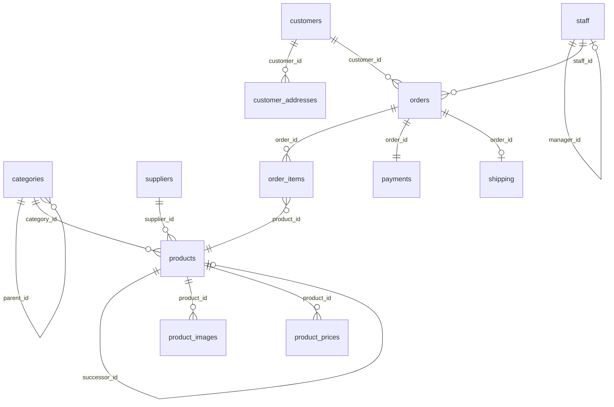
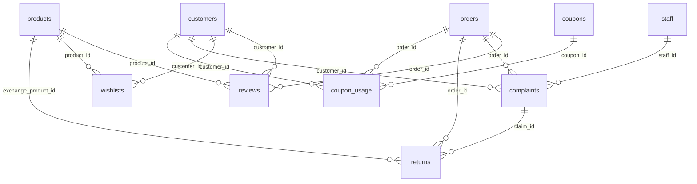
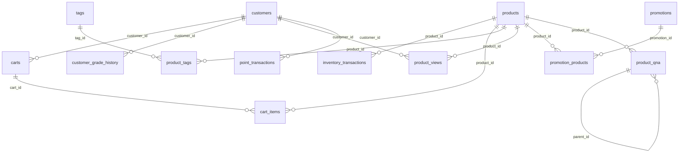

# Database Schema

## Overview

This tutorial uses the **TechShop** database -- a fictional 10-year-old e-commerce store selling computers and peripherals.
**30 tables, 18 views, 5 triggers, 61 indexes, and 15 stored procedures**. At small scale: 5,230 customers, 34,908 orders, 280 products — realistic enough for meaningful SQL practice.

> The data is generated with seed 42 (deterministic), so identical queries always return identical results.

## Entity Relationship Diagram (ERD)

### Core Commerce — 12 Tables

### Engagement & Support — 6 Tables

### Analytics & Rewards — 12 Tables

> `calendar` is a standalone dimension table with no FK relationships — used for CROSS JOIN and date gap analysis.

### Relationship Types

| Type | Example | Description |
|-------------|------|------|
| 1:1 | orders → payments | One payment per order |
| 1:N | customers → orders | One customer, many orders |
| M:N | products ↔ tags (product_tags) | Many-to-many via bridge table |
| Self-ref | categories.parent_id, staff.manager_id, products.successor_id, product_qna.parent_id | Hierarchy/links within same table |
| Nullable FK | orders.staff_id → staff.id | Only assigned for orders requiring CS |
| Cross-table FK | returns.claim_id → complaints.id | Return originated from a CS complaint |

---

## Data Size by Scale

Row counts per table based on the `--size` option. Medium/Large are estimates based on Small.

| Table | Small (0.1x) | Medium (1x) | Large (5x) |
|-------|-------------:|-------------:|-------------:|
| `customers` | 5,230 | ~52,300 | ~261,500 |
| `orders` | 34,908 | ~349,080 | ~1,745,400 |
| `order_items` | 84,270 | ~842,700 | ~4,213,500 |
| `product_views` | 299,792 | ~2,997,920 | ~14,989,600 |
| `point_transactions` | 130,149 | ~1,301,490 | ~6,507,450 |
| `payments` | 34,908 | ~349,080 | ~1,745,400 |
| `shipping` | 33,107 | ~331,070 | ~1,655,350 |
| `inventory_transactions` | 14,331 | ~143,310 | ~716,550 |
| `customer_grade_history` | 10,273 | ~102,730 | ~513,650 |
| `cart_items` | 9,037 | ~90,370 | ~451,850 |
| `customer_addresses` | 8,554 | ~85,540 | ~427,700 |
| `reviews` | 7,945 | ~79,450 | ~397,250 |
| `promotion_products` | 6,871 | ~68,710 | ~343,550 |
| `calendar` | 3,469 | ~34,690 | ~173,450 |
| `complaints` | 3,477 | ~34,770 | ~173,850 |
| `carts` | 3,000 | ~30,000 | ~150,000 |
| `wishlists` | 1,999 | ~19,990 | ~99,950 |
| `product_tags` | 1,288 | ~12,880 | ~64,400 |
| `product_qna` | 946 | ~9,460 | ~47,300 |
| `returns` | 936 | ~9,360 | ~46,800 |
| `product_prices` | 829 | ~8,290 | ~41,450 |
| `product_images` | 748 | ~7,480 | ~37,400 |
| `products` | 280 | ~2,800 | ~14,000 |
| `promotions` | 129 | ~1,290 | ~6,450 |
| `coupon_usage` | 111 | ~1,110 | ~5,550 |
| `suppliers` | 60 | ~600 | ~3,000 |
| `categories` | 53 | ~530 | ~2,650 |
| `tags` | 46 | ~460 | ~2,300 |
| `coupons` | 20 | ~200 | ~1,000 |
| `staff` | 5 | ~50 | ~250 |
| **Total** | **~697K** | **~6.97M** | **~34.8M** |

!!! info "File Sizes"
    | Scale | SQLite DB | MySQL SQL | PG SQL | Generation Time |
    |-------|----------:|----------:|-------:|----------------:|
    | Small | ~80 MB | ~62 MB | ~62 MB | ~20s |
    | Medium | ~800 MB | ~620 MB | ~620 MB | ~3 min |
    | Large | ~4 GB | ~3.1 GB | ~3.1 GB | ~15 min |

---

## Table List

### Core Commerce -- 12 tables

| # | Table | Rows (small) | Description |
|--:|-------|-------------:|-------------|
| 1 | categories | 53 | Product categories (3-level hierarchy) |
| 2 | suppliers | 60 | Product vendors |
| 3 | products | 280 | Products (JSON specs, successor links) |
| 4 | product_images | 748 | Product images |
| 5 | product_prices | 829 | Price change history |
| 6 | customers | 5,230 | Customers (grades, acquisition channel) |
| 7 | customer_addresses | 8,554 | Customer shipping addresses |
| 8 | staff | 5 | Employees (manager self-reference) |
| 9 | orders | 34,908 | Orders |
| 10 | order_items | 84,270 | Order line items |
| 11 | payments | 34,908 | Payments |
| 12 | shipping | 33,107 | Delivery tracking |

### Engagement & Support -- 6 tables

| # | Table | Rows (small) | Description |
|--:|-------|-------------:|-------------|
| 13 | reviews | 7,945 | Product reviews |
| 14 | wishlists | 1,999 | Wish lists (purchase conversion tracking) |
| 15 | complaints | 3,477 | Customer inquiries/complaints (type/compensation/escalation) |
| 16 | returns | 936 | Returns/exchanges (linked to complaints, restocking fees) |
| 17 | coupons | 20 | Coupons |
| 18 | coupon_usage | 111 | Coupon usage records |

### Analytics & Rewards -- 12 tables

| # | Table | Rows (small) | Description |
|--:|-------|-------------:|-------------|
| 19 | inventory_transactions | 14,331 | Stock in/out history |
| 20 | carts | 3,000 | Shopping carts |
| 21 | cart_items | 9,037 | Cart items |
| 22 | calendar | 3,469 | Date dimension (CROSS JOIN exercises) |
| 23 | customer_grade_history | 10,273 | Grade change audit trail (SCD Type 2) |
| 24 | tags | 46 | Product tags |
| 25 | product_tags | 1,288 | Product-tag mapping (M:N) |
| 26 | product_views | 299,792 | Page view log (funnel/cohort analysis) |
| 27 | point_transactions | 130,149 | Point earn/use/expire ledger |
| 28 | promotions | 129 | Promotion/sale events |
| 29 | promotion_products | 6,871 | Promotion target products |
| 30 | product_qna | 946 | Product Q&A (self-referencing) |

---

