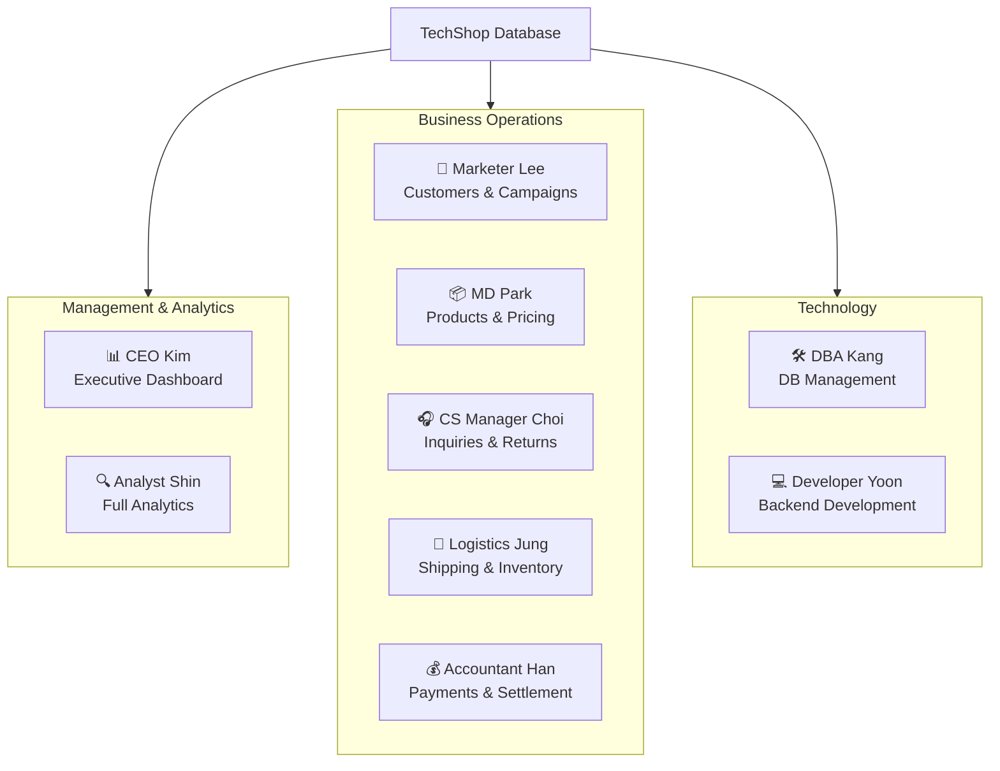
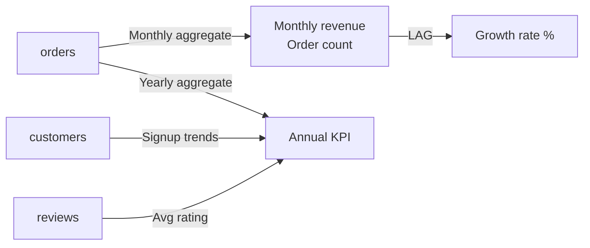
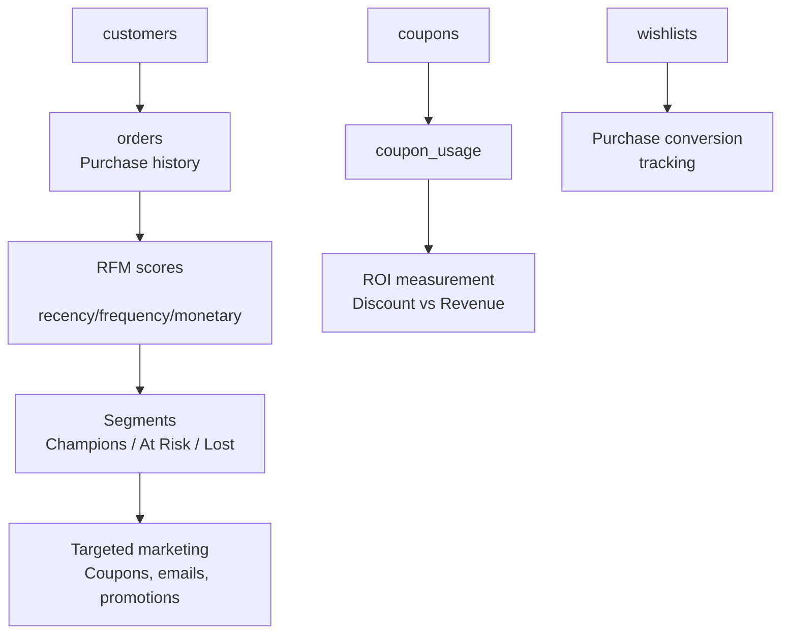
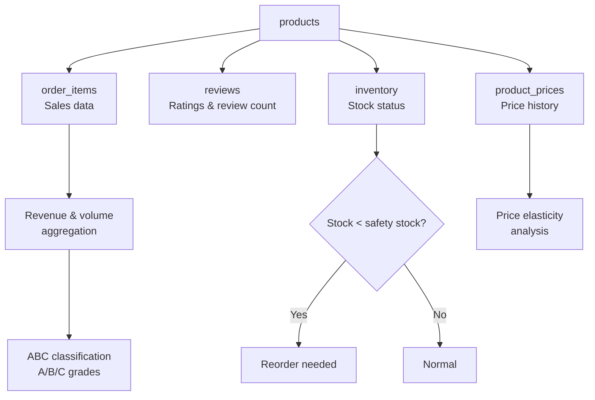
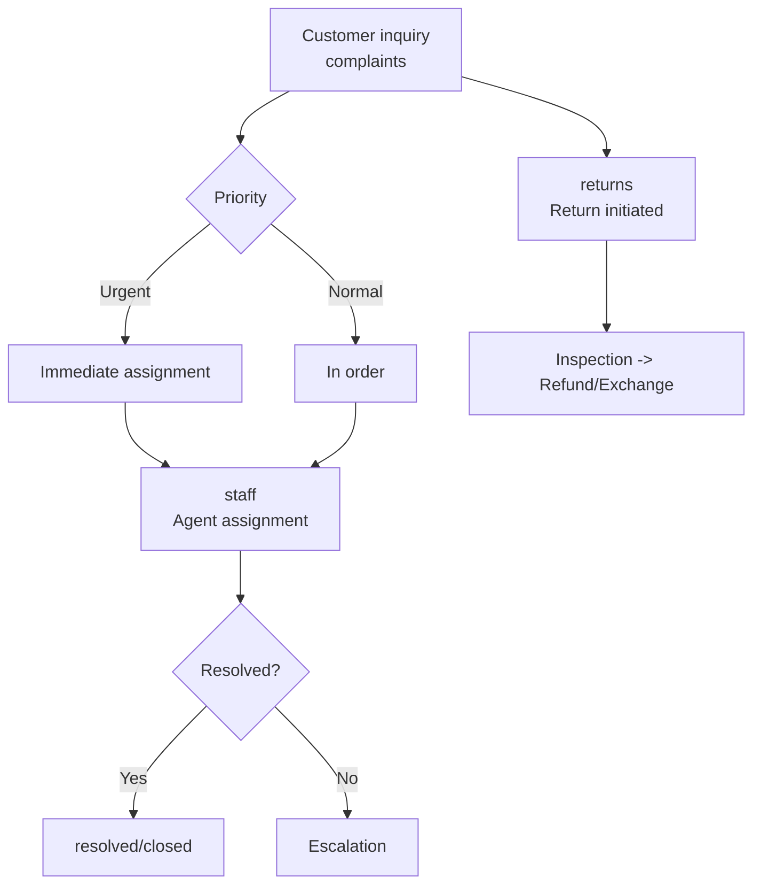
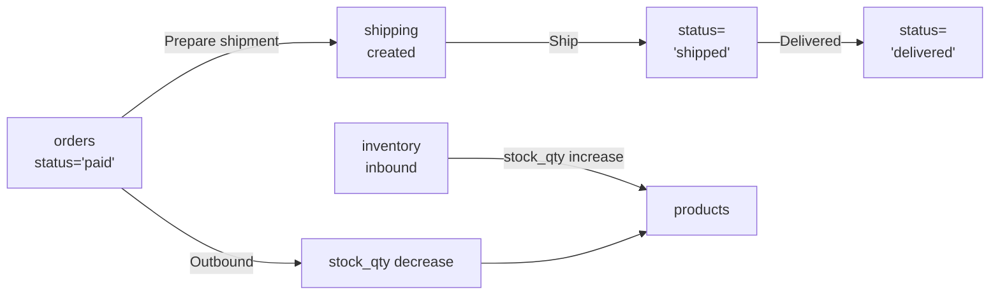
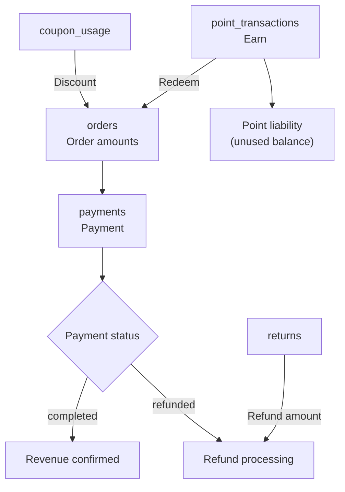
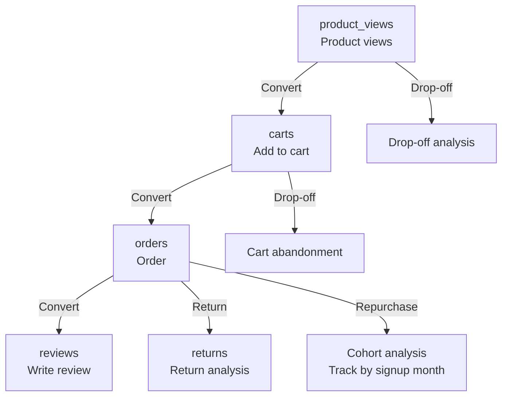
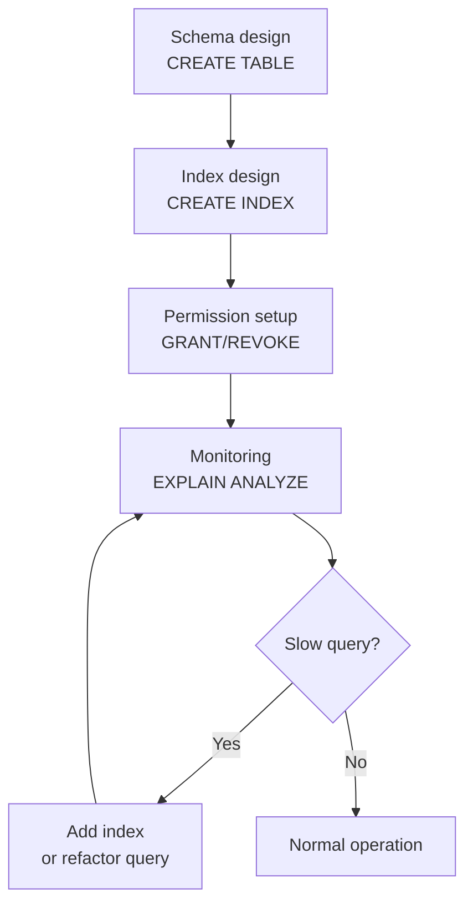
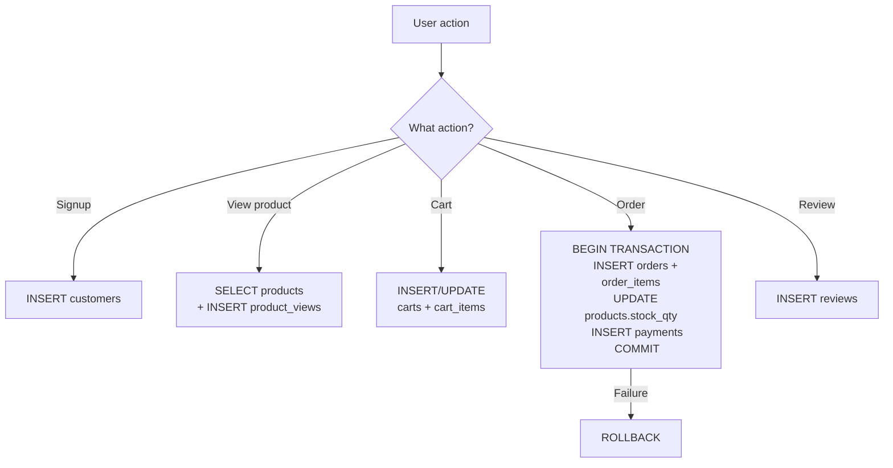

# 06. Persona Usage Guide

This section defines 9 roles that work with data in a real e-commerce shop, and maps out **which tables each role uses**, **what questions they answer**, and **which SQL patterns they need**.

When learning SQL, understanding **"why this query is used"** is far more effective than memorizing syntax. Start by reading the persona that matches your role (or area of interest).

## Persona Summary

**Management & Analytics** -- Reading data and using it for decision-making

| | Persona | Role | Key Question |
|:-:|---------|------|-------------|
| 📊 | [CEO Kim](#ceo) | CEO / Executive | "What's this month's revenue? Growth rate?" |
| 🔍 | [Analyst Shin](#analyst) | Data Analyst | "Customer churn patterns? Funnel conversion rate?" |

**Business Operations** -- Managing customers, products, and orders day-to-day

| | Persona | Role | Key Question |
|:-:|---------|------|-------------|
| 📢 | [Marketer Lee](#marketing) | Marketing Manager | "Who are VIP customers? What's the coupon ROI?" |
| 📦 | [MD Park](#md) | Merchandiser | "What are the best sellers? Any stock shortages?" |
| 🎧 | [CS Manager Choi](#cs) | CS Manager | "Unresolved inquiries? Top return reason?" |
| 🚚 | [Logistics Jung](#logistics) | Logistics Manager | "How many shipments today? Stock shortages?" |
| 💰 | [Accountant Han](#finance) | Finance / Accounting | "Revenue by payment method? Refund amount?" |

**Technology** -- Building and managing the DB and application

| | Persona | Role | Key Question |
|:-:|---------|------|-------------|
| 🛠️ | [DBA Kang](#dba) | DB Administrator | "Slow queries? Where are indexes needed?" |
| 💻 | [Developer Yoon](#developer) | Backend Developer | "Order creation logic? Concurrency issues?" |



---

## CEO Kim (CEO) -- Executive Dashboard { #ceo }

<div class="persona" markdown>
<div class="persona-avatar persona-ceo">📊</div>
<div class="persona-info" markdown>
<strong>CEO Kim</strong> -- CEO / Executive<br>
<p><strong>"See the company's health through numbers"</strong></p>
</div>
</div>

Executives don't directly work with detailed data, but they need to grasp **key performance indicators (KPIs)** at a glance. They monitor monthly revenue trends, cancellation rates, return rates, customer satisfaction, etc.

### Tables Used

| Table | Purpose |
|-------|---------|
| orders | Revenue, order count, cancellation/return volume |
| customers | New signup trends, customer count |
| payments | Payment method distribution |
| reviews | Average rating (customer satisfaction) |
| complaints | CS quality metrics |

### Commonly Used Views

- **v_monthly_sales** -- Monthly revenue, orders, and customer count
- **v_yearly_kpi** -- Annual core KPI (revenue, cancellation rate, return rate)
- **v_revenue_growth** -- Month-over-month growth rate

### Data Flow



### Key Questions and SQL Patterns

| Question | SQL Pattern | Related Lesson |
|----------|-------------|---------------|
| What's this month's revenue? | GROUP BY month + SUM | 05. GROUP BY |
| Year-over-year growth rate? | LAG window function | 18. Window Functions |
| Cancellation/return rate trends? | CASE + ratio calculation | 10. CASE |
| Which month had the highest revenue? | ORDER BY + LIMIT | 03. Sorting and Paging |

---

## Marketer Lee (Marketing) -- Customer Analytics & Campaigns { #marketing }

<div class="persona" markdown>
<div class="persona-avatar persona-mkt">📢</div>
<div class="persona-info" markdown>
<strong>Marketer Lee</strong> -- Marketing Manager<br>
<p><strong>"Understand the customer and deliver the right message at the right time"</strong></p>
</div>
</div>

The marketing manager segments customers, measures campaign effectiveness, and identifies at-risk customers.

### Tables Used

| Table | Purpose |
|-------|---------|
| customers | Customer profiles, grades, acquisition channels |
| orders | Purchase frequency, amounts |
| wishlists | Interested products, purchase conversion tracking |
| coupons + coupon_usage | Campaign effectiveness, ROI |
| point_transactions | Earn/redeem patterns |
| customer_grade_history | Grade migration patterns |
| product_views | Product views -> purchase funnel |

### Commonly Used Views

- **v_customer_rfm** -- RFM segments (Champions, Loyal, At Risk, Lost)
- **v_customer_summary** -- Comprehensive customer profile
- **v_coupon_effectiveness** -- Coupon ROI
- **v_cart_abandonment** -- Cart abandonment analysis
- **v_hourly_pattern** -- Hourly order patterns (promotion timing decisions)

### Data Flow



### Key Questions and SQL Patterns

| Question | SQL Pattern | Related Lesson |
|----------|-------------|---------------|
| Who are the at-risk customers? | NTILE + CASE (RFM) | 18. Window Functions |
| Which campaigns have the highest coupon ROI? | JOIN + ratio calculation | 07. INNER JOIN |
| Wishlist -> purchase conversion rate? | Aggregation + ratio | 04. Aggregate Functions |
| Grade upgrade/downgrade patterns? | LAG + grade comparison | 18. Window Functions |
| LTV by acquisition channel? | GROUP BY channel + AVG | 05. GROUP BY |

---

## MD Park (Merchandising) -- Catalog, Pricing & Performance { #md }

<div class="persona" markdown>
<div class="persona-avatar persona-md">📦</div>
<div class="persona-info" markdown>
<strong>MD Park</strong> -- Merchandiser<br>
<p><strong>"What products to sell, at what price, and how much to stock"</strong></p>
</div>
</div>

The merchandiser analyzes category performance, develops pricing strategies, and manages inventory.

### Tables Used

| Table | Purpose |
|-------|---------|
| products | Product info, prices, margins |
| categories | Category hierarchy |
| suppliers | Supplier performance |
| order_items | Sales volume, revenue |
| reviews | Product ratings, customer feedback |
| inventory_transactions | Inbound/outbound history, stock status |
| product_prices | Price change history |
| product_tags | Product classification/search |
| promotion_products | Promotion target products |

### Commonly Used Views

- **v_product_performance** -- Product-level comprehensive performance
- **v_product_abc** -- ABC classification (revenue contribution)
- **v_top_products_by_category** -- Top 5 by category
- **v_category_tree** -- Category hierarchy path
- **v_supplier_performance** -- Supplier performance

### Data Flow



### Key Questions and SQL Patterns

| Question | SQL Pattern | Related Lesson |
|----------|-------------|---------------|
| Which products are C-grade in ABC? | Cumulative SUM OVER | 18. Window Functions |
| Top 5 margin rate by category? | ROW_NUMBER PARTITION BY | 18. Window Functions |
| Candidates for discontinuation? | Complex WHERE conditions | 02. WHERE |
| Return rate by supplier? | Multiple JOIN + ratio | 07. INNER JOIN |
| Sales change after price cut? | product_prices JOIN + period comparison | 11. Date/Time |

---

## CS Manager Choi (Customer Service) -- Inquiries, Returns & Staff Performance { #cs }

<div class="persona" markdown>
<div class="persona-avatar persona-cs">🎧</div>
<div class="persona-info" markdown>
<strong>CS Manager Choi</strong> -- CS Manager<br>
<p><strong>"Resolve customer complaints quickly and improve team efficiency"</strong></p>
</div>
</div>

The CS manager monitors inquiry processing status, analyzes return reasons, and manages staff performance.

### Tables Used

| Table | Purpose |
|-------|---------|
| complaints | Inquiry types, priority, status |
| returns | Return reasons, processing status |
| staff | Staff info, departments |
| orders | Order related to inquiry |
| customers | Customer info for inquiries |

### Commonly Used Views

- **v_staff_workload** -- Per-staff processing volume, resolution rate, avg processing time
- **v_return_analysis** -- Analysis by return reason
- **v_order_detail** -- Order+customer+payment+shipping in one query (used during inquiry handling)

### Data Flow



### Key Questions and SQL Patterns

| Question | SQL Pattern | Related Lesson |
|----------|-------------|---------------|
| Unresolved items exceeding SLA? | Date difference + WHERE | 11. Date/Time |
| Top return reason? | GROUP BY reason + ORDER BY | 05. GROUP BY |
| Per-staff processing efficiency? | LEFT JOIN + AVG | 08. LEFT JOIN |
| Escalation rate? | CASE + ratio calculation | 10. CASE |

---

## Logistics Jung (Logistics) -- Shipping & Inventory { #logistics }

<div class="persona" markdown>
<div class="persona-avatar persona-log">🚚</div>
<div class="persona-info" markdown>
<strong>Logistics Jung</strong> -- Logistics Manager<br>
<p><strong>"The right product, to the right place, at the right time"</strong></p>
</div>
</div>

The logistics manager handles pending shipments, tracks delivery status, and manages inventory.

### Tables Used

| Table | Purpose |
|-------|---------|
| orders | Order status classification |
| order_items | Products to ship (details) |
| shipping | Delivery status, carrier, tracking |
| products | Stock quantity, weight |
| inventory_transactions | Inbound/outbound history |

### Data Flow



### Key Questions and SQL Patterns

| Question | SQL Pattern | Related Lesson |
|----------|-------------|---------------|
| Orders to ship today? | WHERE status + date | 02. WHERE |
| Delivery time by carrier? | AVG(date diff) + GROUP BY | 11. Date/Time |
| Products with low stock? | WHERE stock_qty < N | 02. WHERE |
| Inbound/outbound history? | WHERE + ORDER BY date | 03. Sorting |

---

## Accountant Han (Finance) -- Payments, Settlement & Refunds { #finance }

<div class="persona" markdown>
<div class="persona-avatar persona-fin">💰</div>
<div class="persona-info" markdown>
<strong>Accountant Han</strong> -- Finance / Accounting<br>
<p><strong>"Track the flow of money accurately"</strong></p>
</div>
</div>

The finance manager handles payment status, refund records, and point liabilities.

### Tables Used

| Table | Purpose |
|-------|---------|
| payments | Payment methods, amounts, refunds |
| orders | Order amounts, discounts, shipping fees |
| coupon_usage | Coupon discount costs |
| point_transactions | Point earn/redeem/expiry |
| returns | Return refund amounts |

### Commonly Used Views

- **v_payment_summary** -- Payment method ratios, completed/refunded/failed

### Data Flow



### Key Questions and SQL Patterns

| Question | SQL Pattern | Related Lesson |
|----------|-------------|---------------|
| Monthly revenue by payment method? | GROUP BY method, month | 05. GROUP BY |
| Total refund amount? | WHERE status='refunded' + SUM | 04. Aggregate Functions |
| Point liability (unused)? | SUM(earn) - SUM(redeem) - SUM(expire) | 13. UNION |
| Total coupon discount cost? | coupon_usage SUM | 04. Aggregate Functions |

---

## Analyst Shin (Data Analytics) -- Full Scope { #analyst }

<div class="persona" markdown>
<div class="persona-avatar persona-analyst">🔍</div>
<div class="persona-info" markdown>
<strong>Analyst Shin</strong> -- Data Analyst<br>
<p><strong>"Find patterns in data and support decision-making"</strong></p>
</div>
</div>

The data analyst performs deep analysis across all tables. They fluently use advanced SQL (window functions, CTEs, subqueries).

### Tables Used

All 30 tables + 18 views

### Key Analysis Areas

| Analysis | Tables Used | SQL Pattern |
|----------|------------|-------------|
| Cohort analysis | customers, orders | GROUP BY signup month + repurchase rate |
| Funnel analysis | product_views -> carts -> orders | Step-by-step COUNT + conversion rate |
| Cart abandonment | carts, cart_items, products | status='abandoned' + potential revenue |
| Hourly patterns | orders | HOUR extraction + GROUP BY |
| Product association | order_items | Product combinations in same order |
| Customer LTV | customers, orders | SUM(total_amount) GROUP BY customer |
| Seasonality analysis | orders, calendar | Monthly + holiday effect |

### Data Flow



### Key Questions and SQL Patterns

| Question | SQL Pattern | Related Lesson |
|----------|-------------|---------------|
| Funnel conversion rate? | Step-by-step COUNT + ratio | 09. Subqueries |
| Repurchase rate by cohort? | Signup month GROUP BY + repurchase condition | 19. CTE |
| Optimal promotion timing by day/hour? | EXTRACT + GROUP BY | 11. Date/Time |
| Frequently purchased together? | SELF JOIN on order_id | 17. SELF JOIN |
| Customer LTV distribution? | SUM + NTILE | 18. Window Functions |

---

## DBA Kang (DB Administrator) -- Schema, Performance & Security { #dba }

<div class="persona" markdown>
<div class="persona-avatar persona-ceo" style="background:#795548;">🛠️</div>
<div class="persona-info" markdown>
<strong>DBA Kang</strong> -- DB Administrator<br>
<p><strong>"My job is to keep the DB running reliably"</strong></p>
</div>
</div>

The DB administrator doesn't analyze data, but creates **an environment where data is safe and fast**. They handle schema design, index tuning, user permissions, and backup/recovery.

### Tables Used

All 30 tables -- interested in **structure (DDL, indexes, constraints)** rather than data content

### Key Responsibilities

| Task | What They Use | SQL Pattern |
|------|--------------|-------------|
| Schema design/changes | DDL (CREATE, ALTER, DROP) | 15. DDL |
| Index design | EXPLAIN, CREATE INDEX | 22. Indexes and Performance |
| User/permission management | GRANT, REVOKE, CREATE USER | 15. DDL |
| Slow query analysis | EXPLAIN ANALYZE | 22. Indexes and Performance |
| Data integrity validation | FK relationships, CHECK constraints | 15. DDL |
| Backup/recovery | mysqldump, pg_dump | (DB admin tools) |
| Trigger management | CREATE TRIGGER | 23. Triggers |
| Stored procedure deployment | CREATE PROCEDURE/FUNCTION | 25. Stored Procedures |

### Data Flow



### Key Questions and SQL Patterns

| Question | SQL Pattern | Related Lesson |
|----------|-------------|---------------|
| Why is this query slow? | EXPLAIN ANALYZE | 22. Indexes and Performance |
| Which indexes are needed? | Execution plan analysis + CREATE INDEX | 22. Indexes and Performance |
| Where is FK integrity broken? | LEFT JOIN + IS NULL | 08. LEFT JOIN |
| Which indexes are unused? | Index statistics query | 05. Schema Query Reference |
| Table size by volume? | Metadata query | 05. Schema Query Reference |

---

## Developer Yoon (Backend Developer) -- CRUD, Transactions & API { #developer }

<div class="persona" markdown>
<div class="persona-avatar persona-ceo" style="background:#00897b;">💻</div>
<div class="persona-info" markdown>
<strong>Developer Yoon</strong> -- Backend Developer<br>
<p><strong>"Accurately record user actions as data"</strong></p>
</div>
</div>

The backend developer writes **SQL that makes the application work** rather than analytical queries. CRUD and transactions for user signup, order creation, and cart management are the core.

### Tables Used

| Table | Purpose |
|-------|---------|
| customers + customer_addresses | User signup, profile updates |
| products + product_images | Product listing, search |
| carts + cart_items | Cart CRUD |
| orders + order_items | Order creation (transaction) |
| payments | Payment processing |
| shipping | Shipping status updates |
| reviews | Review writing |
| wishlists | Wishlist management |
| product_views | View log recording |
| point_transactions | Point earn/redeem |

### Data Flow



### Key Questions and SQL Patterns

| Question | SQL Pattern | Related Lesson |
|----------|-------------|---------------|
| How to process order creation atomically? | BEGIN + multiple INSERT + COMMIT | 16. Transactions |
| What if the same product is ordered simultaneously? | SELECT FOR UPDATE (pessimistic lock) | 16. Transactions |
| How to optimize product search queries? | LIKE + indexes, EXPLAIN | 22. Indexes and Performance |
| How to implement paging? | LIMIT + OFFSET, cursor-based | 03. Sorting and Paging |
| How to solve the N+1 problem? | JOIN to fetch at once | 07. INNER JOIN |
| UPSERT? | INSERT ON CONFLICT / ON DUPLICATE KEY | 14. DML |

---

## Persona / Table / Permission Matrix

This matrix shows which tables each persona (DB user) has access to and with what permissions.

> R = Read / RW = Read/Write / A = ALL / V = View only / - = No access

<div class="table-matrix" markdown>

| Table | 📊 | 📢 | 📦 | 🎧 | 🚚 | 💰 | 🔍 | 🛠️ | 💻 |
|-------|:-:|:-:|:-:|:-:|:-:|:-:|:-:|:-:|:-:|
| customers | V | R | - | R | - | - | R | A | RW |
| customer_addresses | - | - | - | - | - | - | R | A | RW |
| orders | V | R | R | R | R | R | R | A | RW |
| order_items | - | - | R | - | R | - | R | A | RW |
| products | - | - | RW | - | RW* | - | R | A | RW |
| categories | - | - | R | - | - | - | R | A | RW |
| suppliers | - | - | R | - | - | - | R | A | RW |
| product_images | - | - | RW | - | - | - | R | A | RW |
| product_prices | - | - | R | - | - | - | R | A | RW |
| product_tags | - | - | R | - | - | - | R | A | RW |
| staff | - | - | - | R | - | - | R | A | RW |
| payments | V | - | - | - | - | R | R | A | RW |
| shipping | - | - | - | - | RW | - | R | A | RW |
| reviews | V | - | R | - | - | - | R | A | RW |
| wishlists | - | R | - | - | - | - | R | A | RW |
| complaints | V | - | - | RW | - | - | R | A | RW |
| returns | - | - | - | RW | - | R | R | A | RW |
| coupons | - | R | - | - | - | - | R | A | RW |
| coupon_usage | - | R | - | - | - | R | R | A | RW |
| point_transactions | - | R | - | - | - | R | R | A | RW |
| grade_history | - | R | - | - | - | - | R | A | RW |
| inventory_tx | - | - | R | - | RW | - | R | A | RW |
| carts | - | - | - | - | - | - | R | A | RW |
| cart_items | - | - | - | - | - | - | R | A | RW |
| product_views | - | R | - | - | - | - | R | A | RW |
| promotions | - | R | - | - | - | - | R | A | RW |
| promo_products | - | R | R | - | - | - | R | A | RW |
| product_qna | - | - | R | R | - | - | R | A | RW |
| calendar | - | - | - | - | - | - | R | A | RW |
| tags | - | - | R | - | - | - | R | A | RW |

</div>

> 📊 CEO / 📢 Marketing / 📦 MD / 🎧 CS / 🚚 Logistics / 💰 Finance / 🔍 Analyst / 🛠️ DBA / 💻 Developer
>
> \* Logistics write access to products is limited to the `stock_qty` column only / DBA's A = DDL + DML + GRANT / Developer's RW = DML only (no DDL)

---

## DB User Creation by Persona

In practice, DB users are separated per role following the **Principle of Least Privilege**. Permissions are configured so each persona can only access the tables they need.

!!! info "SQLite"
    SQLite does not support user/permission management. Access is controlled through file system permissions.

### Permission Summary

| Persona | DB User | Permission | Scope |
|---------|---------|:----------:|-------|
| CEO Kim | `ceo_reader` | `SELECT` | All views (no direct table access) |
| Marketer Lee | `marketing` | `SELECT` | customers, orders, wishlists, coupons, coupon_usage, point_transactions, customer_grade_history, product_views |
| MD Park | `merchandiser` | `SELECT`, `UPDATE` | products, categories, suppliers, product_images, product_prices, product_tags, inventory_transactions, promotion_products |
| CS Manager Choi | `cs_manager` | `SELECT`, `UPDATE` | complaints, returns, staff, orders (status only), customers (read) |
| Logistics Jung | `logistics` | `SELECT`, `UPDATE` | orders, shipping, products (stock only), inventory_transactions |
| Accountant Han | `finance` | `SELECT` | payments, orders, coupon_usage, point_transactions, returns |
| Analyst Shin | `analyst` | `SELECT` | All tables + views (read-only) |
| DBA Kang | `dba_admin` | `ALL` | Everything (DDL + DML + GRANT) |
| Developer Yoon | `app_developer` | `SELECT`, `INSERT`, `UPDATE`, `DELETE` | All tables (no DDL) |

### User Creation SQL

=== "MySQL"

    ```sql
    -- =============================================
    -- 1. CEO: View-only access
    -- =============================================
    CREATE USER 'ceo_reader'@'%' IDENTIFIED BY 'ceo_pass_2025';
    GRANT SELECT ON ecommerce.v_monthly_sales TO 'ceo_reader'@'%';
    GRANT SELECT ON ecommerce.v_yearly_kpi TO 'ceo_reader'@'%';
    GRANT SELECT ON ecommerce.v_revenue_growth TO 'ceo_reader'@'%';
    GRANT SELECT ON ecommerce.v_daily_orders TO 'ceo_reader'@'%';

    -- =============================================
    -- 2. Marketing: Customer & campaign read access
    -- =============================================
    CREATE USER 'marketing'@'%' IDENTIFIED BY 'mkt_pass_2025';
    GRANT SELECT ON ecommerce.customers TO 'marketing'@'%';
    GRANT SELECT ON ecommerce.orders TO 'marketing'@'%';
    GRANT SELECT ON ecommerce.wishlists TO 'marketing'@'%';
    GRANT SELECT ON ecommerce.coupons TO 'marketing'@'%';
    GRANT SELECT ON ecommerce.coupon_usage TO 'marketing'@'%';
    GRANT SELECT ON ecommerce.point_transactions TO 'marketing'@'%';
    GRANT SELECT ON ecommerce.customer_grade_history TO 'marketing'@'%';
    GRANT SELECT ON ecommerce.product_views TO 'marketing'@'%';
    GRANT SELECT ON ecommerce.v_customer_rfm TO 'marketing'@'%';
    GRANT SELECT ON ecommerce.v_customer_summary TO 'marketing'@'%';
    GRANT SELECT ON ecommerce.v_coupon_effectiveness TO 'marketing'@'%';
    GRANT SELECT ON ecommerce.v_cart_abandonment TO 'marketing'@'%';

    -- =============================================
    -- 3. MD: Product read/write access
    -- =============================================
    CREATE USER 'merchandiser'@'%' IDENTIFIED BY 'md_pass_2025';
    GRANT SELECT, UPDATE ON ecommerce.products TO 'merchandiser'@'%';
    GRANT SELECT ON ecommerce.categories TO 'merchandiser'@'%';
    GRANT SELECT ON ecommerce.suppliers TO 'merchandiser'@'%';
    GRANT SELECT, INSERT, UPDATE ON ecommerce.product_images TO 'merchandiser'@'%';
    GRANT SELECT ON ecommerce.product_prices TO 'merchandiser'@'%';
    GRANT SELECT ON ecommerce.product_tags TO 'merchandiser'@'%';
    GRANT SELECT ON ecommerce.order_items TO 'merchandiser'@'%';
    GRANT SELECT ON ecommerce.reviews TO 'merchandiser'@'%';
    GRANT SELECT ON ecommerce.inventory_transactions TO 'merchandiser'@'%';
    GRANT SELECT ON ecommerce.v_product_performance TO 'merchandiser'@'%';
    GRANT SELECT ON ecommerce.v_product_abc TO 'merchandiser'@'%';

    -- =============================================
    -- 4. CS: Inquiry/return processing
    -- =============================================
    CREATE USER 'cs_manager'@'%' IDENTIFIED BY 'cs_pass_2025';
    GRANT SELECT, UPDATE ON ecommerce.complaints TO 'cs_manager'@'%';
    GRANT SELECT, UPDATE ON ecommerce.returns TO 'cs_manager'@'%';
    GRANT SELECT ON ecommerce.staff TO 'cs_manager'@'%';
    GRANT SELECT ON ecommerce.orders TO 'cs_manager'@'%';
    GRANT SELECT ON ecommerce.customers TO 'cs_manager'@'%';
    GRANT SELECT ON ecommerce.v_staff_workload TO 'cs_manager'@'%';
    GRANT SELECT ON ecommerce.v_return_analysis TO 'cs_manager'@'%';

    -- =============================================
    -- 5. Logistics: Shipping/inventory management
    -- =============================================
    CREATE USER 'logistics'@'%' IDENTIFIED BY 'log_pass_2025';
    GRANT SELECT ON ecommerce.orders TO 'logistics'@'%';
    GRANT SELECT, UPDATE ON ecommerce.shipping TO 'logistics'@'%';
    GRANT SELECT, UPDATE (stock_qty) ON ecommerce.products TO 'logistics'@'%';
    GRANT SELECT, INSERT ON ecommerce.inventory_transactions TO 'logistics'@'%';

    -- =============================================
    -- 6. Finance: Payment/settlement read-only
    -- =============================================
    CREATE USER 'finance'@'%' IDENTIFIED BY 'fin_pass_2025';
    GRANT SELECT ON ecommerce.payments TO 'finance'@'%';
    GRANT SELECT ON ecommerce.orders TO 'finance'@'%';
    GRANT SELECT ON ecommerce.coupon_usage TO 'finance'@'%';
    GRANT SELECT ON ecommerce.point_transactions TO 'finance'@'%';
    GRANT SELECT ON ecommerce.returns TO 'finance'@'%';
    GRANT SELECT ON ecommerce.v_payment_summary TO 'finance'@'%';

    -- =============================================
    -- 7. Analyst: Full read-only
    -- =============================================
    CREATE USER 'analyst'@'%' IDENTIFIED BY 'analyst_pass_2025';
    GRANT SELECT ON ecommerce.* TO 'analyst'@'%';

    -- =============================================
    -- 8. DBA: Full privileges
    -- =============================================
    CREATE USER 'dba_admin'@'%' IDENTIFIED BY 'dba_pass_2025';
    GRANT ALL PRIVILEGES ON ecommerce.* TO 'dba_admin'@'%' WITH GRANT OPTION;

    -- =============================================
    -- 9. Developer: Full DML (no DDL)
    -- =============================================
    CREATE USER 'app_developer'@'%' IDENTIFIED BY 'dev_pass_2025';
    GRANT SELECT, INSERT, UPDATE, DELETE ON ecommerce.* TO 'app_developer'@'%';
    GRANT EXECUTE ON ecommerce.* TO 'app_developer'@'%';

    FLUSH PRIVILEGES;
    ```

=== "PostgreSQL"

    ```sql
    -- =============================================
    -- 1. CEO: View-only access
    -- =============================================
    CREATE ROLE ceo_reader LOGIN PASSWORD 'ceo_pass_2025';
    GRANT USAGE ON SCHEMA public TO ceo_reader;
    GRANT SELECT ON v_monthly_sales, v_yearly_kpi,
                    v_revenue_growth, v_daily_orders TO ceo_reader;

    -- =============================================
    -- 2. Marketing: Customer & campaign read access
    -- =============================================
    CREATE ROLE marketing LOGIN PASSWORD 'mkt_pass_2025';
    GRANT USAGE ON SCHEMA public TO marketing;
    GRANT SELECT ON customers, orders, wishlists, coupons,
                    coupon_usage, point_transactions,
                    customer_grade_history, product_views TO marketing;
    GRANT SELECT ON v_customer_rfm, v_customer_summary,
                    v_coupon_effectiveness, v_cart_abandonment TO marketing;

    -- =============================================
    -- 3. MD: Product read/write access
    -- =============================================
    CREATE ROLE merchandiser LOGIN PASSWORD 'md_pass_2025';
    GRANT USAGE ON SCHEMA public TO merchandiser;
    GRANT SELECT, UPDATE ON products TO merchandiser;
    GRANT SELECT ON categories, suppliers, product_prices,
                    product_tags, order_items, reviews,
                    inventory_transactions TO merchandiser;
    GRANT SELECT, INSERT, UPDATE ON product_images TO merchandiser;
    GRANT SELECT ON v_product_performance, v_product_abc TO merchandiser;

    -- =============================================
    -- 4. CS: Inquiry/return processing
    -- =============================================
    CREATE ROLE cs_manager LOGIN PASSWORD 'cs_pass_2025';
    GRANT USAGE ON SCHEMA public TO cs_manager;
    GRANT SELECT, UPDATE ON complaints, returns TO cs_manager;
    GRANT SELECT ON staff, orders, customers TO cs_manager;
    GRANT SELECT ON v_staff_workload, v_return_analysis TO cs_manager;

    -- =============================================
    -- 5. Logistics: Shipping/inventory management
    -- =============================================
    CREATE ROLE logistics LOGIN PASSWORD 'log_pass_2025';
    GRANT USAGE ON SCHEMA public TO logistics;
    GRANT SELECT ON orders TO logistics;
    GRANT SELECT, UPDATE ON shipping TO logistics;
    GRANT SELECT, UPDATE (stock_qty) ON products TO logistics;
    GRANT SELECT, INSERT ON inventory_transactions TO logistics;

    -- =============================================
    -- 6. Finance: Payment/settlement read-only
    -- =============================================
    CREATE ROLE finance LOGIN PASSWORD 'fin_pass_2025';
    GRANT USAGE ON SCHEMA public TO finance;
    GRANT SELECT ON payments, orders, coupon_usage,
                    point_transactions, returns TO finance;
    GRANT SELECT ON v_payment_summary TO finance;

    -- =============================================
    -- 7. Analyst: Full read-only
    -- =============================================
    CREATE ROLE analyst LOGIN PASSWORD 'analyst_pass_2025';
    GRANT USAGE ON SCHEMA public TO analyst;
    GRANT SELECT ON ALL TABLES IN SCHEMA public TO analyst;

    -- =============================================
    -- 8. DBA: Full privileges
    -- =============================================
    CREATE ROLE dba_admin LOGIN PASSWORD 'dba_pass_2025' SUPERUSER;

    -- =============================================
    -- 9. Developer: Full DML (no DDL)
    -- =============================================
    CREATE ROLE app_developer LOGIN PASSWORD 'dev_pass_2025';
    GRANT USAGE ON SCHEMA public TO app_developer;
    GRANT SELECT, INSERT, UPDATE, DELETE ON ALL TABLES IN SCHEMA public TO app_developer;
    GRANT EXECUTE ON ALL FUNCTIONS IN SCHEMA public TO app_developer;
    ```

### Verifying Permissions

=== "MySQL"

    ```sql
    -- Check permissions for a specific user
    SHOW GRANTS FOR 'marketing'@'%';
    ```

=== "PostgreSQL"

    ```sql
    -- Check table permissions for a specific role
    SELECT table_name, privilege_type
    FROM information_schema.role_table_grants
    WHERE grantee = 'marketing'
    ORDER BY table_name;
    ```

!!! tip "Practical Points by Persona"

    **📊 CEO** -- Access only to views like `v_monthly_sales`, `v_yearly_kpi`. Cannot see personal information (names, emails, phone numbers) from raw tables, which helps with privacy compliance

    **📢 Marketing** -- Can read customers but cannot modify them. Cannot create coupons (no INSERT on `coupons`), only view usage history. Prevents erroneous coupon issuance

    **📦 MD** -- Can UPDATE products but has no access to orders or payments. Even if product prices are changed, existing order amounts cannot be affected

    **🎧 CS** -- Can UPDATE complaints and returns but has no access to payments. Refund processing is separated so only the finance team can handle it

    **🚚 Logistics** -- Can only UPDATE the `stock_qty` column of products. Cannot modify product price (`price`) or name (`name`). Manages inventory only

    **💰 Finance** -- Can read payments and returns but cannot modify them. Only views payment data; actual refund processing goes through the payment system (PG provider)

    **🔍 Analyst** -- SELECT only on all tables. Cannot INSERT/UPDATE/DELETE on any table. No risk of accidentally modifying data

    **🛠️ DBA** -- ALL privileges + WITH GRANT OPTION. The only role that can configure other users' permissions. Schema changes (DDL) can only be done by the DBA

    **💻 Developer** -- Full DML (SELECT/INSERT/UPDATE/DELETE) + EXECUTE (stored procedure calls). But no DDL (CREATE/DROP/ALTER TABLE). Table structure changes can only be done through the DBA

    Passwords shown are examples; always use strong passwords in production.
