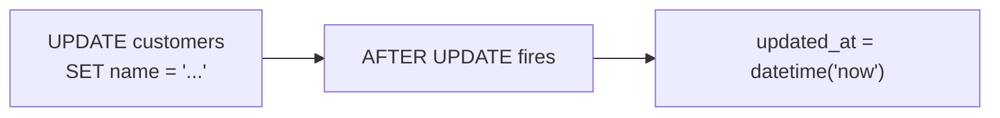
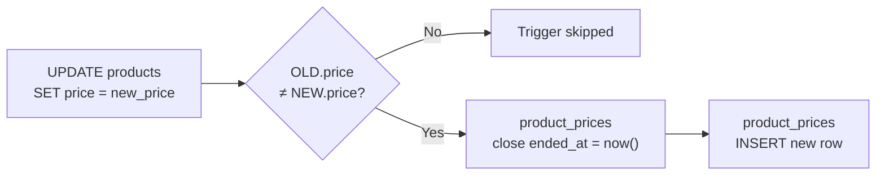
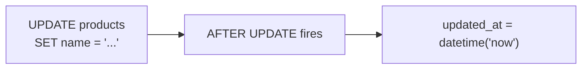
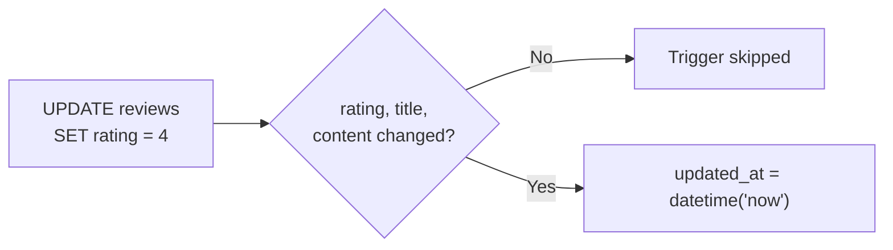

# Triggers

| Trigger | Description |
|---------|-------------|
| trg_orders_updated_at | Auto-update updated_at when order status changes |
| trg_reviews_updated_at | Auto-update updated_at when a review is modified |
| trg_product_price_history | Auto-record price change in product_prices when product price is updated |
| trg_products_updated_at | Auto-update updated_at when a product is modified |
| trg_customers_updated_at | Auto-update updated_at when customer info changes |


!!! info "Trigger support across databases"
    Triggers in this tutorial are defined **only in SQLite**.

    While MySQL and PostgreSQL both support triggers, they are not included for the following reasons:

    - **Trigger syntax differs significantly across databases** — SQLite uses `BEGIN...END`, MySQL requires `DELIMITER` + `BEGIN...END`, and PostgreSQL requires a separate trigger function referenced by `CREATE TRIGGER`. The same logic looks completely different in each.
    - **Conflicts with the data generator** — Active triggers during bulk INSERT cause performance degradation and unintended side effects (e.g., `updated_at` overwrites, duplicate price history entries).
    - **Explicit handling in application/procedures** — In MySQL/PostgreSQL, updating `updated_at` or recording history is commonly handled explicitly in application code or stored procedures rather than triggers. The stored procedures in this project (`sp_place_order`, etc.) serve different business logic (order creation, point expiration, etc.), not the same role as the triggers.

    DB-specific trigger syntax differences are covered in detail in [Lesson 23: Triggers](advanced/23-triggers.md).


### trg_customers_updated_at — Auto-update customer updated_at

Automatically sets `updated_at` to the current time when customer info is modified.



=== "SQLite"

    ```sql
    CREATE TRIGGER trg_customers_updated_at
    AFTER UPDATE ON customers
    BEGIN
        UPDATE customers SET updated_at = datetime('now') WHERE id = NEW.id;
    END
    ```

### trg_orders_updated_at — Auto-update order updated_at

Automatically sets `updated_at` to the current time when order `status` changes.


=== "SQLite"

    ```sql
    CREATE TRIGGER trg_orders_updated_at
    AFTER UPDATE OF status ON orders
    BEGIN
        UPDATE orders SET updated_at = datetime('now') WHERE id = NEW.id;
    END
    ```

### trg_product_price_history — Auto-record price history

When a product price changes, closes the existing history record's `ended_at` and inserts the new price into `product_prices`.



=== "SQLite"

    ```sql
    CREATE TRIGGER trg_product_price_history
    AFTER UPDATE OF price ON products
    WHEN OLD.price != NEW.price
    BEGIN
        -- Close existing history record
        UPDATE product_prices
        SET ended_at = datetime('now')
        WHERE product_id = NEW.id AND ended_at IS NULL;

        -- Insert new history record
        INSERT INTO product_prices (product_id, price, started_at, ended_at, change_reason)
        VALUES (NEW.id, NEW.price, datetime('now'), NULL, 'price_update');
    END
    ```

### trg_products_updated_at — Auto-update product updated_at

Automatically sets `updated_at` to the current time when product info is modified.



=== "SQLite"

    ```sql
    CREATE TRIGGER trg_products_updated_at
    AFTER UPDATE ON products
    BEGIN
        UPDATE products SET updated_at = datetime('now') WHERE id = NEW.id;
    END
    ```

### trg_reviews_updated_at — Auto-update review updated_at

Automatically sets `updated_at` to the current time when `rating`, `title`, or `content` is modified.



=== "SQLite"

    ```sql
    CREATE TRIGGER trg_reviews_updated_at
    AFTER UPDATE OF rating, title, content ON reviews
    BEGIN
        UPDATE reviews SET updated_at = datetime('now') WHERE id = NEW.id;
    END
    ```


