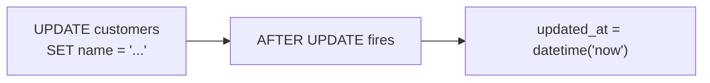
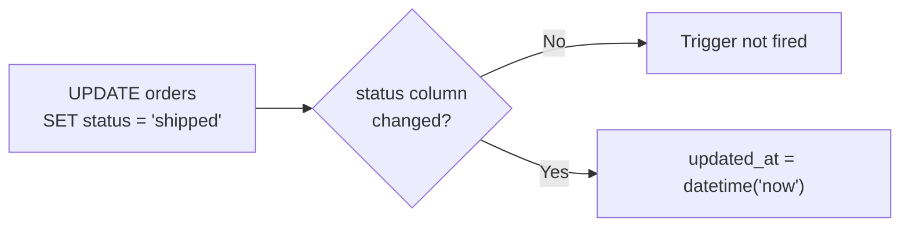
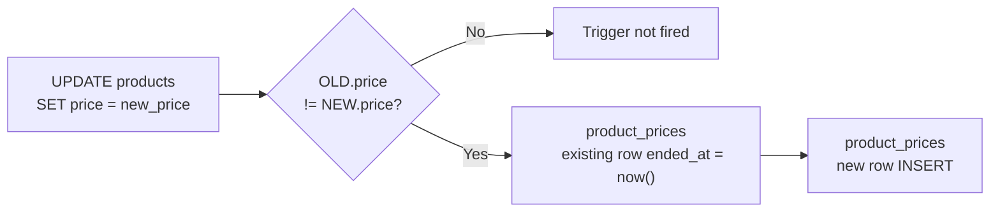
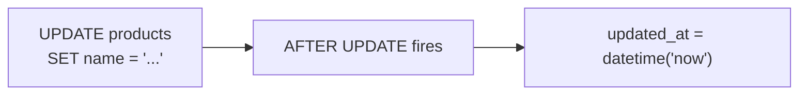
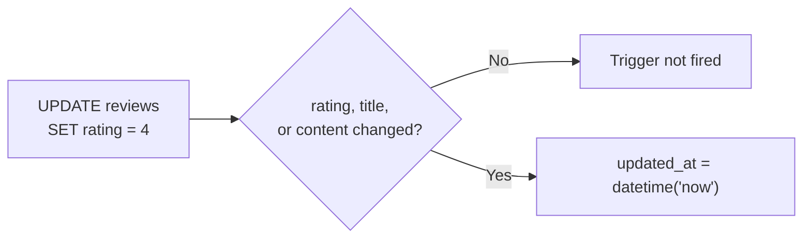

# 03. Triggers

## What is a Trigger?

A trigger is **SQL code that executes automatically when data is modified**. When an INSERT, UPDATE, or DELETE occurs, predefined actions are performed automatically. No manual execution is required.

**Why use triggers:**

- **Automation** -- Instead of manually updating the `updated_at` timestamp every time, the current time is automatically recorded when data changes
- **History tracking** -- When a price changes, the previous price is automatically saved to a history table, enabling you to track price trends
- **Data integrity** -- Rules are enforced at the DB level without relying on application code
- **Transparency** -- The same rules apply regardless of how data is modified (SQL tool, application, script)

Detailed learning about triggers is covered in [Lesson 24. Triggers](../advanced/24-triggers.md).

## Trigger List

| Trigger | Description |
|---------|-------------|
| trg_orders_updated_at | Auto-updates updated_at when order status changes |
| trg_reviews_updated_at | Auto-updates updated_at when a review is modified |
| trg_product_price_history | Auto-records history in product_prices when product price changes |
| trg_products_updated_at | Auto-updates updated_at when a product is modified |
| trg_customers_updated_at | Auto-updates updated_at when customer info is modified |


!!! info "Trigger Support by DB"
    The triggers in this tutorial are **defined only for SQLite**.

    MySQL and PostgreSQL also support trigger syntax, but this project does not include them for the following reasons:

    - **Trigger syntax differs significantly across databases** -- SQLite uses `BEGIN...END`, MySQL uses `DELIMITER` + `BEGIN...END`, and PostgreSQL requires creating a separate trigger function then referencing it in `CREATE TRIGGER`. Even for identical logic, the code is completely different
    - **Conflicts with the data generator** -- Running bulk INSERTs with active triggers causes performance degradation and unintended side effects (e.g., `updated_at` overwriting, duplicate price history insertions)
    - **Explicit handling in application/procedures** -- In MySQL/PostgreSQL, it is common practice to handle `updated_at` updates and history recording directly in application code or stored procedures rather than triggers. The stored procedures in this project (`sp_place_order`, etc.) handle different business logic (order creation, point expiration, etc.)

    DB-specific trigger syntax differences are covered in detail in [Lesson 24. Triggers](../advanced/24-triggers.md).


### trg_customers_updated_at -- Customer updated_at Auto-Update

Automatically updates `updated_at` to the current time when customer information is modified.



=== "SQLite"

    ```sql
    CREATE TRIGGER trg_customers_updated_at
    AFTER UPDATE ON customers
    BEGIN
        UPDATE customers SET updated_at = datetime('now') WHERE id = NEW.id;
    END
    ```

### trg_orders_updated_at -- Order updated_at Auto-Update

Automatically updates `updated_at` to the current time when the order `status` changes.



=== "SQLite"

    ```sql
    CREATE TRIGGER trg_orders_updated_at
    AFTER UPDATE OF status ON orders
    BEGIN
        UPDATE orders SET updated_at = datetime('now') WHERE id = NEW.id;
    END
    ```

### trg_product_price_history -- Price Change History Auto-Record

When a product price changes, closes the `ended_at` of the existing history record and automatically inserts the new price into `product_prices`.



=== "SQLite"

    ```sql
    CREATE TRIGGER trg_product_price_history
    AFTER UPDATE OF price ON products
    WHEN OLD.price != NEW.price
    BEGIN
        -- Close existing history record
        UPDATE product_prices
        SET ended_at = datetime('now')
        WHERE product_id = NEW.id AND ended_at IS NULL;

        -- Insert new history record
        INSERT INTO product_prices (product_id, price, started_at, ended_at, change_reason)
        VALUES (NEW.id, NEW.price, datetime('now'), NULL, 'price_update');
    END
    ```

### trg_products_updated_at -- Product updated_at Auto-Update

Automatically updates `updated_at` to the current time when product information is modified.



=== "SQLite"

    ```sql
    CREATE TRIGGER trg_products_updated_at
    AFTER UPDATE ON products
    BEGIN
        UPDATE products SET updated_at = datetime('now') WHERE id = NEW.id;
    END
    ```

### trg_reviews_updated_at -- Review updated_at Auto-Update

Automatically updates `updated_at` to the current time when a review's `rating`, `title`, or `content` is modified.



=== "SQLite"

    ```sql
    CREATE TRIGGER trg_reviews_updated_at
    AFTER UPDATE OF rating, title, content ON reviews
    BEGIN
        UPDATE reviews SET updated_at = datetime('now') WHERE id = NEW.id;
    END
    ```

