# 02. Views

## What is a View?

A view is **a saved SELECT query with a name**. You can query it like a table with `SELECT * FROM v_monthly_sales`, but it does not store data directly. The internal SQL executes each time the view is queried.

**Why use views:**

- **Convenience** -- No need to write a complex query joining 5 tables every time
- **Consistency** -- The calculation method for "monthly revenue" is defined once in the view, so everyone gets the same result
- **Security** -- Granting access to views instead of raw tables prevents exposing sensitive columns (email, phone, etc.)
- **Abstraction** -- Even if table structures change, maintaining the view interface prevents existing queries from breaking

Detailed learning about views is covered in [Lesson 22. Views](../advanced/22-views.md).

## View List

18 predefined views allow you to run complex analytical queries immediately.

| View | Description | SQL Pattern |
|-----|------|----------|
| v_monthly_sales | Monthly sales summary | GROUP BY + date functions |
| v_daily_orders | Daily order status | GROUP BY + CASE pivot |
| v_hourly_pattern | Hourly order pattern | Hour extraction + CASE classification |
| v_revenue_growth | Monthly revenue growth rate | LAG window function |
| v_yearly_kpi | Yearly core KPI | Multiple subquery LEFT JOIN |
| v_customer_rfm | Customer RFM analysis | NTILE window + CTE + CASE |
| v_customer_summary | Customer comprehensive profile | Multiple LEFT JOIN + COALESCE |
| v_order_detail | Order detail join | 5-table denormalized JOIN |
| v_product_performance | Product performance metrics | Multiple LEFT JOIN + margin calculation |
| v_product_abc | Product ABC analysis | Cumulative SUM OVER + CASE classification |
| v_top_products_by_category | Top products by category | ROW_NUMBER PARTITION BY |
| v_category_tree | Category tree | Recursive CTE + path string |
| v_payment_summary | Payment method summary | Ratio calculation (scalar subquery) |
| v_supplier_performance | Supplier performance | Multiple LEFT JOIN + return rate |
| v_staff_workload | CS staff workload | LEFT JOIN + avg processing time |
| v_coupon_effectiveness | Coupon effectiveness | ROI calculation (revenue/discount) |
| v_return_analysis | Return analysis | GROUP BY + CASE pivot + average |
| v_cart_abandonment | Cart abandonment analysis | JOIN + GROUP_CONCAT/STRING_AGG |

**Summary by Pattern**

| Group | Views | Key Pattern |
|------|-----|----------|
| Sales/Time Series | v_monthly_sales, v_daily_orders, v_hourly_pattern, v_revenue_growth, v_yearly_kpi | GROUP BY, LAG, multiple subqueries |
| Customer Analysis | v_customer_rfm, v_customer_summary | NTILE, CTE, multiple LEFT JOIN |
| Orders/Products | v_order_detail, v_product_performance, v_product_abc, v_top_products_by_category | Denormalized JOIN, SUM OVER, ROW_NUMBER |
| Hierarchy/Reference | v_category_tree, v_payment_summary | Recursive CTE, scalar subquery |
| Operations/Analytics | v_supplier_performance, v_staff_workload, v_coupon_effectiveness, v_return_analysis, v_cart_abandonment | Return rate, ROI, GROUP_CONCAT |

!!! info "View Support by DB"
    All 18 views are available identically across SQLite, MySQL, PostgreSQL, Oracle, and SQL Server.

    In PostgreSQL, `v_monthly_sales` and `v_product_performance` are also provided as **Materialized Views** (with `mv_` prefix).
    Materialized Views physically store query results so they are not recalculated each time, significantly improving performance for large aggregate views.

    | DB | Materialized View | Note |
    |----|:-:|------|
    | PostgreSQL | `CREATE MATERIALIZED VIEW` + `REFRESH` | Native support |
    | MySQL | Not supported | Can be manually implemented with table + event scheduler |
    | SQLite | Not supported | Can be manually implemented with trigger + separate table |


### v_cart_abandonment -- Cart Abandonment Analysis

Analyzes customer information, item count, and potential revenue of unconverted carts.

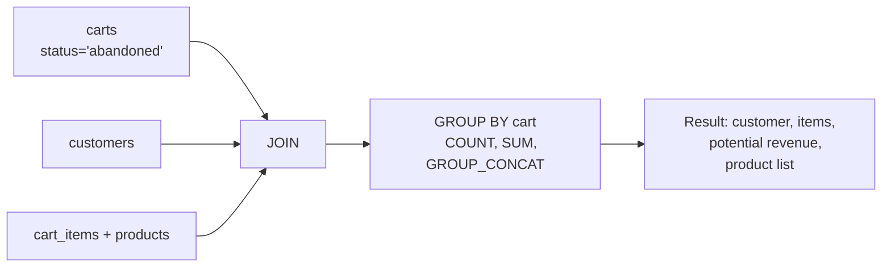

=== "SQLite"

    ```sql
    CREATE VIEW v_cart_abandonment AS
    SELECT
        c.id AS cart_id,
        cust.name AS customer_name,
        cust.email,
        c.status,
        c.created_at,
        COUNT(ci.id) AS item_count,
        CAST(SUM(p.price * ci.quantity) AS INTEGER) AS potential_revenue,
        GROUP_CONCAT(p.name, ', ') AS products
    FROM carts c
    JOIN customers cust ON c.customer_id = cust.id
    JOIN cart_items ci ON c.id = ci.cart_id
    JOIN products p ON ci.product_id = p.id
    WHERE c.status = 'abandoned'
    GROUP BY c.id
    ```

=== "MySQL"

    ```sql
    CREATE OR REPLACE VIEW v_cart_abandonment AS
    SELECT
        c.id AS cart_id,
        cust.name AS customer_name,
        cust.email,
        c.status,
        c.created_at,
        COUNT(ci.id) AS item_count,
        CAST(SUM(p.price * ci.quantity) AS SIGNED) AS potential_revenue,
        GROUP_CONCAT(p.name SEPARATOR ', ') AS products
    FROM carts c
    JOIN customers cust ON c.customer_id = cust.id
    JOIN cart_items ci ON c.id = ci.cart_id
    JOIN products p ON ci.product_id = p.id
    WHERE c.status = 'abandoned'
    GROUP BY c.id, cust.name, cust.email, c.status, c.created_at;
    ```

=== "PostgreSQL"

    ```sql
    CREATE OR REPLACE VIEW v_cart_abandonment AS
    SELECT
        c.id AS cart_id,
        cust.name AS customer_name,
        cust.email,
        c.status,
        c.created_at,
        COUNT(ci.id) AS item_count,
        SUM(p.price * ci.quantity)::BIGINT AS potential_revenue,
        STRING_AGG(p.name, ', ') AS products
    FROM carts c
    JOIN customers cust ON c.customer_id = cust.id
    JOIN cart_items ci ON c.id = ci.cart_id
    JOIN products p ON ci.product_id = p.id
    WHERE c.status = 'abandoned'
    GROUP BY c.id, cust.name, cust.email, c.status, c.created_at;
    ```

### v_category_tree -- Category Tree

Uses recursive CTE to query hierarchy path (top > mid > sub) and product counts.

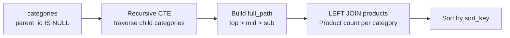

=== "SQLite"

    ```sql
    CREATE VIEW v_category_tree AS
    WITH RECURSIVE tree AS (
        SELECT id, name, parent_id, depth,
               name AS full_path,
               CAST(printf('%04d', sort_order) AS TEXT) AS sort_key
        FROM categories
        WHERE parent_id IS NULL
        UNION ALL
        SELECT c.id, c.name, c.parent_id, c.depth,
               tree.full_path || ' > ' || c.name,
               tree.sort_key || '.' || printf('%04d', c.sort_order)
        FROM categories c
        JOIN tree ON c.parent_id = tree.id
    )
    SELECT t.id, t.name, t.parent_id, t.depth, t.full_path,
           COALESCE(p.product_count, 0) AS product_count
    FROM tree t
    LEFT JOIN (
        SELECT category_id, COUNT(*) AS product_count
        FROM products
        GROUP BY category_id
    ) p ON t.id = p.category_id
    ORDER BY t.sort_key
    ```

=== "MySQL"

    ```sql
    CREATE OR REPLACE VIEW v_category_tree AS
    WITH RECURSIVE tree AS (
        SELECT id, name, parent_id, depth,
               name AS full_path,
               LPAD(sort_order, 4, '0') AS sort_key
        FROM categories
        WHERE parent_id IS NULL
        UNION ALL
        SELECT c.id, c.name, c.parent_id, c.depth,
               CONCAT(tree.full_path, ' > ', c.name),
               CONCAT(tree.sort_key, '.', LPAD(c.sort_order, 4, '0'))
        FROM categories c
        JOIN tree ON c.parent_id = tree.id
    )
    SELECT t.id, t.name, t.parent_id, t.depth, t.full_path,
           COALESCE(p.product_count, 0) AS product_count
    FROM tree t
    LEFT JOIN (
        SELECT category_id, COUNT(*) AS product_count
        FROM products
        GROUP BY category_id
    ) p ON t.id = p.category_id
    ORDER BY t.sort_key;
    ```

=== "PostgreSQL"

    ```sql
    CREATE OR REPLACE VIEW v_category_tree AS
    WITH RECURSIVE tree AS (
        SELECT id, name, parent_id, depth,
               name::TEXT AS full_path,
               LPAD(sort_order::TEXT, 4, '0') AS sort_key
        FROM categories
        WHERE parent_id IS NULL
        UNION ALL
        SELECT c.id, c.name, c.parent_id, c.depth,
               tree.full_path || ' > ' || c.name,
               tree.sort_key || '.' || LPAD(c.sort_order::TEXT, 4, '0')
        FROM categories c
        JOIN tree ON c.parent_id = tree.id
    )
    SELECT t.id, t.name, t.parent_id, t.depth, t.full_path,
           COALESCE(p.product_count, 0) AS product_count
    FROM tree t
    LEFT JOIN (
        SELECT category_id, COUNT(*) AS product_count
        FROM products
        GROUP BY category_id
    ) p ON t.id = p.category_id
    ORDER BY t.sort_key;
    ```

### v_coupon_effectiveness -- Coupon Effectiveness Analysis

Calculates usage count, total discount, and ROI per coupon.

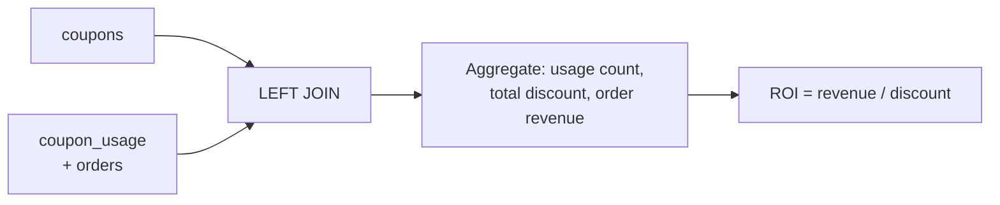

=== "SQLite"

    ```sql
    CREATE VIEW v_coupon_effectiveness AS
    SELECT
        cp.id AS coupon_id,
        cp.code,
        cp.name,
        cp.type,
        cp.discount_value,
        cp.is_active,
        COALESCE(u.usage_count, 0) AS usage_count,
        cp.usage_limit,
        COALESCE(u.total_discount, 0) AS total_discount_given,
        COALESCE(u.total_order_revenue, 0) AS total_order_revenue,
        CASE
            WHEN COALESCE(u.total_discount, 0) > 0
            THEN ROUND(u.total_order_revenue / u.total_discount, 1)
            ELSE 0
        END AS roi_ratio
    FROM coupons cp
    LEFT JOIN (
        SELECT
            cu.coupon_id,
            COUNT(*) AS usage_count,
            CAST(SUM(cu.discount_amount) AS INTEGER) AS total_discount,
            CAST(SUM(o.total_amount) AS INTEGER) AS total_order_revenue
        FROM coupon_usage cu
        JOIN orders o ON cu.order_id = o.id
        GROUP BY cu.coupon_id
    ) u ON cp.id = u.coupon_id
    ORDER BY COALESCE(u.usage_count, 0) DESC
    ```

=== "MySQL"

    ```sql
    CREATE OR REPLACE VIEW v_coupon_effectiveness AS
    SELECT
        cp.id AS coupon_id,
        cp.code,
        cp.name,
        cp.type,
        cp.discount_value,
        cp.is_active,
        COALESCE(u.usage_count, 0) AS usage_count,
        cp.usage_limit,
        COALESCE(u.total_discount, 0) AS total_discount_given,
        COALESCE(u.total_order_revenue, 0) AS total_order_revenue,
        CASE
            WHEN COALESCE(u.total_discount, 0) > 0
            THEN ROUND(u.total_order_revenue / u.total_discount, 1)
            ELSE 0
        END AS roi_ratio
    FROM coupons cp
    LEFT JOIN (
        SELECT
            cu.coupon_id,
            COUNT(*) AS usage_count,
            CAST(SUM(cu.discount_amount) AS SIGNED) AS total_discount,
            CAST(SUM(o.total_amount) AS SIGNED) AS total_order_revenue
        FROM coupon_usage cu
        JOIN orders o ON cu.order_id = o.id
        GROUP BY cu.coupon_id
    ) u ON cp.id = u.coupon_id
    ORDER BY COALESCE(u.usage_count, 0) DESC;
    ```

=== "PostgreSQL"

    ```sql
    CREATE OR REPLACE VIEW v_coupon_effectiveness AS
    SELECT
        cp.id AS coupon_id,
        cp.code,
        cp.name,
        cp.type,
        cp.discount_value,
        cp.is_active,
        COALESCE(u.usage_count, 0) AS usage_count,
        cp.usage_limit,
        COALESCE(u.total_discount, 0) AS total_discount_given,
        COALESCE(u.total_order_revenue, 0) AS total_order_revenue,
        CASE
            WHEN COALESCE(u.total_discount, 0) > 0
            THEN ROUND(u.total_order_revenue / u.total_discount, 1)
            ELSE 0
        END AS roi_ratio
    FROM coupons cp
    LEFT JOIN (
        SELECT
            cu.coupon_id,
            COUNT(*) AS usage_count,
            SUM(cu.discount_amount)::BIGINT AS total_discount,
            SUM(o.total_amount)::BIGINT AS total_order_revenue
        FROM coupon_usage cu
        JOIN orders o ON cu.order_id = o.id
        GROUP BY cu.coupon_id
    ) u ON cp.id = u.coupon_id
    ORDER BY COALESCE(u.usage_count, 0) DESC;
    ```

### v_customer_rfm -- Customer RFM Analysis

Calculates Recency/Frequency/Monetary scores using NTILE(5) and classifies segments such as Champions/Loyal/At Risk.

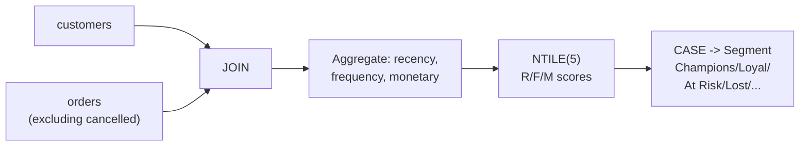

=== "SQLite"

    ```sql
    CREATE VIEW v_customer_rfm AS
    WITH rfm_raw AS (
        SELECT
            c.id AS customer_id,
            c.name,
            c.grade,
            CAST(julianday('2025-06-30') - julianday(MAX(o.ordered_at)) AS INTEGER) AS recency_days,
            COUNT(o.id) AS frequency,
            CAST(SUM(o.total_amount) AS INTEGER) AS monetary
        FROM customers c
        JOIN orders o ON c.id = o.customer_id
        WHERE o.status NOT IN ('cancelled')
        GROUP BY c.id
    ),
    rfm_scored AS (
        SELECT *,
            NTILE(5) OVER (ORDER BY recency_days ASC) AS r_score,   -- more recent = higher score
            NTILE(5) OVER (ORDER BY frequency DESC) AS f_score,
            NTILE(5) OVER (ORDER BY monetary DESC) AS m_score
        FROM rfm_raw
    )
    SELECT
        customer_id, name, grade,
        recency_days, frequency, monetary,
        r_score, f_score, m_score,
        r_score + f_score + m_score AS rfm_total,
        CASE
            WHEN r_score >= 4 AND f_score >= 4 AND m_score >= 4 THEN 'Champions'
            WHEN r_score >= 3 AND f_score >= 3 THEN 'Loyal'
            WHEN r_score >= 4 AND f_score <= 2 THEN 'New Customers'
            WHEN r_score <= 2 AND f_score >= 3 THEN 'At Risk'
            WHEN r_score <= 2 AND f_score <= 2 THEN 'Lost'
            ELSE 'Others'
        END AS segment
    FROM rfm_scored
    ```

=== "MySQL"

    ```sql
    CREATE OR REPLACE VIEW v_customer_rfm AS
    WITH rfm_raw AS (
        SELECT
            c.id AS customer_id,
            c.name,
            c.grade,
            DATEDIFF('2025-06-30', MAX(o.ordered_at)) AS recency_days,
            COUNT(o.id) AS frequency,
            CAST(SUM(o.total_amount) AS SIGNED) AS monetary
        FROM customers c
        JOIN orders o ON c.id = o.customer_id
        WHERE o.status != 'cancelled'
        GROUP BY c.id, c.name, c.grade
    ),
    rfm_scored AS (
        SELECT *,
            NTILE(5) OVER (ORDER BY recency_days ASC) AS r_score,
            NTILE(5) OVER (ORDER BY frequency DESC) AS f_score,
            NTILE(5) OVER (ORDER BY monetary DESC) AS m_score
        FROM rfm_raw
    )
    SELECT
        customer_id, name, grade,
        recency_days, frequency, monetary,
        r_score, f_score, m_score,
        r_score + f_score + m_score AS rfm_total,
        CASE
            WHEN r_score >= 4 AND f_score >= 4 AND m_score >= 4 THEN 'Champions'
            WHEN r_score >= 3 AND f_score >= 3 THEN 'Loyal'
            WHEN r_score >= 4 AND f_score <= 2 THEN 'New Customers'
            WHEN r_score <= 2 AND f_score >= 3 THEN 'At Risk'
            WHEN r_score <= 2 AND f_score <= 2 THEN 'Lost'
            ELSE 'Others'
        END AS segment
    FROM rfm_scored;
    ```

=== "PostgreSQL"

    ```sql
    CREATE OR REPLACE VIEW v_customer_rfm AS
    WITH rfm_raw AS (
        SELECT
            c.id AS customer_id,
            c.name,
            c.grade,
            ('2025-06-30'::DATE - MAX(ordered_at)::DATE) AS recency_days,
            COUNT(o.id) AS frequency,
            SUM(o.total_amount)::BIGINT AS monetary
        FROM customers c
        JOIN orders o ON c.id = o.customer_id
        WHERE o.status != 'cancelled'
        GROUP BY c.id, c.name, c.grade
    ),
    rfm_scored AS (
        SELECT *,
            NTILE(5) OVER (ORDER BY recency_days ASC) AS r_score,
            NTILE(5) OVER (ORDER BY frequency DESC) AS f_score,
            NTILE(5) OVER (ORDER BY monetary DESC) AS m_score
        FROM rfm_raw
    )
    SELECT
        customer_id, name, grade,
        recency_days, frequency, monetary,
        r_score, f_score, m_score,
        r_score + f_score + m_score AS rfm_total,
        CASE
            WHEN r_score >= 4 AND f_score >= 4 AND m_score >= 4 THEN 'Champions'
            WHEN r_score >= 3 AND f_score >= 3 THEN 'Loyal'
            WHEN r_score >= 4 AND f_score <= 2 THEN 'New Customers'
            WHEN r_score <= 2 AND f_score >= 3 THEN 'At Risk'
            WHEN r_score <= 2 AND f_score <= 2 THEN 'Lost'
            ELSE 'Others'
        END AS segment
    FROM rfm_scored;
    ```

### v_customer_summary -- Customer Comprehensive Profile

Summarizes order count, total spend, review count, wishlists, and activity status per customer.

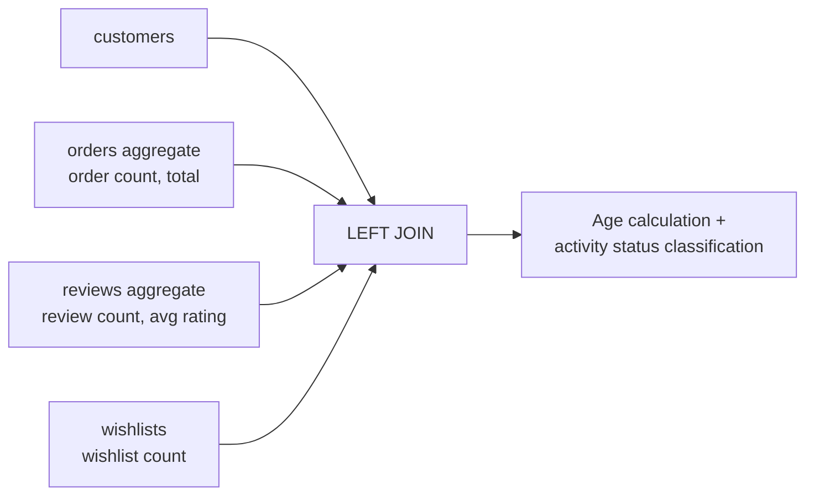

=== "SQLite"

    ```sql
    CREATE VIEW v_customer_summary AS
    SELECT
        c.id,
        c.name,
        c.email,
        c.grade,
        c.gender,
        CASE
            WHEN c.birth_date IS NULL THEN NULL
            ELSE CAST((julianday('2025-06-30') - julianday(c.birth_date)) / 365.25 AS INTEGER)
        END AS age,
        c.created_at AS joined_at,
        COALESCE(os.order_count, 0) AS total_orders,
        COALESCE(os.total_spent, 0) AS total_spent,
        COALESCE(os.first_order, '') AS first_order_at,
        COALESCE(os.last_order, '') AS last_order_at,
        COALESCE(rv.review_count, 0) AS review_count,
        COALESCE(rv.avg_rating, 0) AS avg_rating_given,
        COALESCE(ws.wishlist_count, 0) AS wishlist_count,
        c.is_active,
        c.last_login_at,
        CASE
            WHEN c.is_active = 0 THEN 'inactive'
            WHEN c.last_login_at IS NULL THEN 'never_logged_in'
            WHEN c.last_login_at < DATE('2025-06-30', '-365 days') THEN 'dormant'
            ELSE 'active'
        END AS activity_status
    FROM customers c
    LEFT JOIN (
        SELECT customer_id,
               COUNT(*) AS order_count,
               CAST(SUM(total_amount) AS INTEGER) AS total_spent,
               MIN(ordered_at) AS first_order,
               MAX(ordered_at) AS last_order
        FROM orders
        WHERE status NOT IN ('cancelled')
        GROUP BY customer_id
    ) os ON c.id = os.customer_id
    LEFT JOIN (
        SELECT customer_id,
               COUNT(*) AS review_count,
               ROUND(AVG(rating), 1) AS avg_rating
        FROM reviews
        GROUP BY customer_id
    ) rv ON c.id = rv.customer_id
    LEFT JOIN (
        SELECT customer_id, COUNT(*) AS wishlist_count
        FROM wishlists
        GROUP BY customer_id
    ) ws ON c.id = ws.customer_id
    ```

=== "MySQL"

    ```sql
    CREATE OR REPLACE VIEW v_customer_summary AS
    SELECT
        c.id,
        c.name,
        c.email,
        c.grade,
        c.gender,
        CASE
            WHEN c.birth_date IS NULL THEN NULL
            ELSE TIMESTAMPDIFF(YEAR, c.birth_date, '2025-06-30')
        END AS age,
        c.created_at AS joined_at,
        COALESCE(os.order_count, 0) AS total_orders,
        COALESCE(os.total_spent, 0) AS total_spent,
        COALESCE(os.first_order, '') AS first_order_at,
        COALESCE(os.last_order, '') AS last_order_at,
        COALESCE(rv.review_count, 0) AS review_count,
        COALESCE(rv.avg_rating, 0) AS avg_rating_given,
        COALESCE(ws.wishlist_count, 0) AS wishlist_count,
        c.is_active,
        c.last_login_at,
        CASE
            WHEN c.is_active = 0 THEN 'inactive'
            WHEN c.last_login_at IS NULL THEN 'never_logged_in'
            WHEN c.last_login_at < DATE_SUB('2025-06-30', INTERVAL 365 DAY) THEN 'dormant'
            ELSE 'active'
        END AS activity_status
    FROM customers c
    LEFT JOIN (
        SELECT customer_id,
               COUNT(*) AS order_count,
               CAST(SUM(total_amount) AS SIGNED) AS total_spent,
               MIN(ordered_at) AS first_order,
               MAX(ordered_at) AS last_order
        FROM orders
        WHERE status != 'cancelled'
        GROUP BY customer_id
    ) os ON c.id = os.customer_id
    LEFT JOIN (
        SELECT customer_id,
               COUNT(*) AS review_count,
               ROUND(AVG(rating), 1) AS avg_rating
        FROM reviews
        GROUP BY customer_id
    ) rv ON c.id = rv.customer_id
    LEFT JOIN (
        SELECT customer_id, COUNT(*) AS wishlist_count
        FROM wishlists
        GROUP BY customer_id
    ) ws ON c.id = ws.customer_id;
    ```

=== "PostgreSQL"

    ```sql
    CREATE OR REPLACE VIEW v_customer_summary AS
    SELECT
        c.id,
        c.name,
        c.email,
        c.grade,
        c.gender,
        CASE
            WHEN c.birth_date IS NULL THEN NULL
            ELSE EXTRACT(YEAR FROM AGE('2025-06-30'::DATE, c.birth_date))::INT
        END AS age,
        c.created_at AS joined_at,
        COALESCE(os.order_count, 0) AS total_orders,
        COALESCE(os.total_spent, 0) AS total_spent,
        COALESCE(os.first_order, ''::TEXT) AS first_order_at,
        COALESCE(os.last_order, ''::TEXT) AS last_order_at,
        COALESCE(rv.review_count, 0) AS review_count,
        COALESCE(rv.avg_rating, 0) AS avg_rating_given,
        COALESCE(ws.wishlist_count, 0) AS wishlist_count,
        c.is_active,
        c.last_login_at,
        CASE
            WHEN c.is_active = FALSE THEN 'inactive'
            WHEN c.last_login_at IS NULL THEN 'never_logged_in'
            WHEN c.last_login_at < '2025-06-30'::DATE - INTERVAL '365 days' THEN 'dormant'
            ELSE 'active'
        END AS activity_status
    FROM customers c
    LEFT JOIN (
        SELECT customer_id,
               COUNT(*) AS order_count,
               SUM(total_amount)::BIGINT AS total_spent,
               MIN(ordered_at)::TEXT AS first_order,
               MAX(ordered_at)::TEXT AS last_order
        FROM orders
        WHERE status != 'cancelled'
        GROUP BY customer_id
    ) os ON c.id = os.customer_id
    LEFT JOIN (
        SELECT customer_id,
               COUNT(*) AS review_count,
               ROUND(AVG(rating), 1) AS avg_rating
        FROM reviews
        GROUP BY customer_id
    ) rv ON c.id = rv.customer_id
    LEFT JOIN (
        SELECT customer_id, COUNT(*) AS wishlist_count
        FROM wishlists
        GROUP BY customer_id
    ) ws ON c.id = ws.customer_id;
    ```

### v_daily_orders -- Daily Order Status

Aggregates daily order count, revenue, and confirmed/cancelled/returned counts.

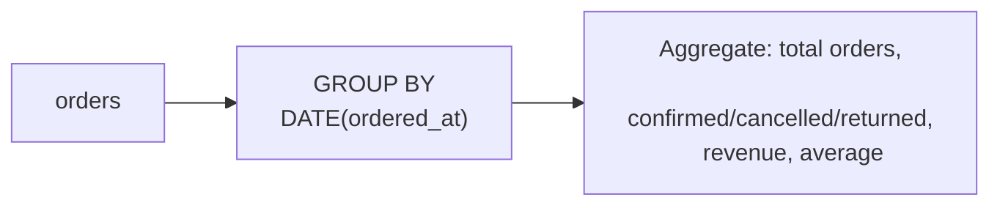

=== "SQLite"

    ```sql
    CREATE VIEW v_daily_orders AS
    SELECT
        DATE(ordered_at) AS order_date,
        CASE CAST(strftime('%w', ordered_at) AS INTEGER)
            WHEN 0 THEN 'Sun' WHEN 1 THEN 'Mon' WHEN 2 THEN 'Tue'
            WHEN 3 THEN 'Wed' WHEN 4 THEN 'Thu' WHEN 5 THEN 'Fri' WHEN 6 THEN 'Sat'
        END AS day_of_week,
        COUNT(*) AS total_orders,
        SUM(CASE WHEN status = 'confirmed' THEN 1 ELSE 0 END) AS confirmed,
        SUM(CASE WHEN status = 'cancelled' THEN 1 ELSE 0 END) AS cancelled,
        SUM(CASE WHEN status IN ('return_requested','returned') THEN 1 ELSE 0 END) AS returned,
        CAST(SUM(CASE WHEN status != 'cancelled' THEN total_amount ELSE 0 END) AS INTEGER) AS revenue,
        CAST(AVG(CASE WHEN status != 'cancelled' THEN total_amount END) AS INTEGER) AS avg_order_amount
    FROM orders
    GROUP BY DATE(ordered_at)
    ORDER BY order_date
    ```

=== "MySQL"

    ```sql
    CREATE OR REPLACE VIEW v_daily_orders AS
    SELECT
        DATE(ordered_at) AS order_date,
        DAYNAME(ordered_at) AS day_of_week,
        COUNT(*) AS total_orders,
        SUM(CASE WHEN status = 'confirmed' THEN 1 ELSE 0 END) AS confirmed,
        SUM(CASE WHEN status = 'cancelled' THEN 1 ELSE 0 END) AS cancelled,
        SUM(CASE WHEN status IN ('return_requested','returned') THEN 1 ELSE 0 END) AS returned,
        CAST(SUM(CASE WHEN status != 'cancelled' THEN total_amount ELSE 0 END) AS SIGNED) AS revenue,
        CAST(AVG(CASE WHEN status != 'cancelled' THEN total_amount END) AS SIGNED) AS avg_order_amount
    FROM orders
    GROUP BY DATE(ordered_at), DAYNAME(ordered_at)
    ORDER BY order_date;
    ```

=== "PostgreSQL"

    ```sql
    CREATE OR REPLACE VIEW v_daily_orders AS
    SELECT
        ordered_at::DATE AS order_date,
        TO_CHAR(ordered_at, 'Day') AS day_of_week,
        COUNT(*) AS total_orders,
        SUM(CASE WHEN status = 'confirmed' THEN 1 ELSE 0 END) AS confirmed,
        SUM(CASE WHEN status = 'cancelled' THEN 1 ELSE 0 END) AS cancelled,
        SUM(CASE WHEN status IN ('return_requested','returned') THEN 1 ELSE 0 END) AS returned,
        SUM(CASE WHEN status != 'cancelled' THEN total_amount ELSE 0 END)::BIGINT AS revenue,
        AVG(CASE WHEN status != 'cancelled' THEN total_amount END)::INT AS avg_order_amount
    FROM orders
    GROUP BY ordered_at::DATE, TO_CHAR(ordered_at, 'Day')
    ORDER BY order_date;
    ```

### v_hourly_pattern -- Hourly Order Pattern

Classifies hourly order distribution into dawn/morning/afternoon/evening slots.

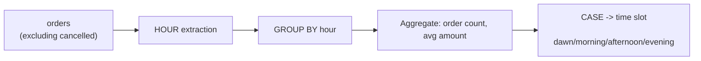

=== "SQLite"

    ```sql
    CREATE VIEW v_hourly_pattern AS
    SELECT
        CAST(SUBSTR(ordered_at, 12, 2) AS INTEGER) AS hour,
        COUNT(*) AS order_count,
        CAST(AVG(total_amount) AS INTEGER) AS avg_amount,
        CASE
            WHEN CAST(SUBSTR(ordered_at, 12, 2) AS INTEGER) BETWEEN 0 AND 5 THEN 'dawn'
            WHEN CAST(SUBSTR(ordered_at, 12, 2) AS INTEGER) BETWEEN 6 AND 11 THEN 'morning'
            WHEN CAST(SUBSTR(ordered_at, 12, 2) AS INTEGER) BETWEEN 12 AND 17 THEN 'afternoon'
            ELSE 'evening'
        END AS time_slot
    FROM orders
    WHERE status NOT IN ('cancelled')
    GROUP BY CAST(SUBSTR(ordered_at, 12, 2) AS INTEGER)
    ORDER BY hour
    ```

=== "MySQL"

    ```sql
    CREATE OR REPLACE VIEW v_hourly_pattern AS
    SELECT
        HOUR(ordered_at) AS hour,
        COUNT(*) AS order_count,
        CAST(AVG(total_amount) AS SIGNED) AS avg_amount,
        CASE
            WHEN HOUR(ordered_at) BETWEEN 0 AND 5 THEN 'dawn'
            WHEN HOUR(ordered_at) BETWEEN 6 AND 11 THEN 'morning'
            WHEN HOUR(ordered_at) BETWEEN 12 AND 17 THEN 'afternoon'
            ELSE 'evening'
        END AS time_slot
    FROM orders
    WHERE status != 'cancelled'
    GROUP BY HOUR(ordered_at),
        CASE
            WHEN HOUR(ordered_at) BETWEEN 0 AND 5 THEN 'dawn'
            WHEN HOUR(ordered_at) BETWEEN 6 AND 11 THEN 'morning'
            WHEN HOUR(ordered_at) BETWEEN 12 AND 17 THEN 'afternoon'
            ELSE 'evening'
        END
    ORDER BY hour;
    ```

=== "PostgreSQL"

    ```sql
    CREATE OR REPLACE VIEW v_hourly_pattern AS
    SELECT
        EXTRACT(HOUR FROM ordered_at)::INT AS hour,
        COUNT(*) AS order_count,
        AVG(total_amount)::INT AS avg_amount,
        CASE
            WHEN EXTRACT(HOUR FROM ordered_at) BETWEEN 0 AND 5 THEN 'dawn'
            WHEN EXTRACT(HOUR FROM ordered_at) BETWEEN 6 AND 11 THEN 'morning'
            WHEN EXTRACT(HOUR FROM ordered_at) BETWEEN 12 AND 17 THEN 'afternoon'
            ELSE 'evening'
        END AS time_slot
    FROM orders
    WHERE status != 'cancelled'
    GROUP BY EXTRACT(HOUR FROM ordered_at)::INT,
        CASE
            WHEN EXTRACT(HOUR FROM ordered_at) BETWEEN 0 AND 5 THEN 'dawn'
            WHEN EXTRACT(HOUR FROM ordered_at) BETWEEN 6 AND 11 THEN 'morning'
            WHEN EXTRACT(HOUR FROM ordered_at) BETWEEN 12 AND 17 THEN 'afternoon'
            ELSE 'evening'
        END
    ORDER BY hour;
    ```

### v_monthly_sales -- Monthly Sales Summary

Aggregates monthly order count, customer count, revenue, and discount amounts.

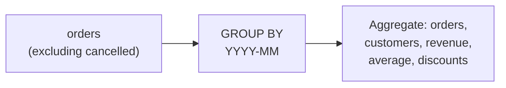

=== "SQLite"

    ```sql
    CREATE VIEW v_monthly_sales AS
    SELECT
        SUBSTR(o.ordered_at, 1, 7) AS month,               -- YYYY-MM
        COUNT(DISTINCT o.id) AS order_count,                -- number of orders
        COUNT(DISTINCT o.customer_id) AS customer_count,    -- unique buyers
        CAST(SUM(o.total_amount) AS INTEGER) AS revenue,    -- total revenue
        CAST(AVG(o.total_amount) AS INTEGER) AS avg_order,  -- average order value
        SUM(o.discount_amount) AS total_discount            -- total discount
    FROM orders o
    WHERE o.status NOT IN ('cancelled')
    GROUP BY SUBSTR(o.ordered_at, 1, 7)
    ORDER BY month
    ```

=== "MySQL"

    ```sql
    CREATE OR REPLACE VIEW v_monthly_sales AS
    SELECT
        DATE_FORMAT(o.ordered_at, '%Y-%m') AS month,
        COUNT(DISTINCT o.id) AS order_count,
        COUNT(DISTINCT o.customer_id) AS customer_count,
        CAST(SUM(o.total_amount) AS SIGNED) AS revenue,
        CAST(AVG(o.total_amount) AS SIGNED) AS avg_order,
        SUM(o.discount_amount) AS total_discount
    FROM orders o
    WHERE o.status != 'cancelled'
    GROUP BY DATE_FORMAT(o.ordered_at, '%Y-%m')
    ORDER BY month;
    ```

### v_order_detail -- Order Detail Join

A denormalized view joining order + customer + payment + shipping + address at once.

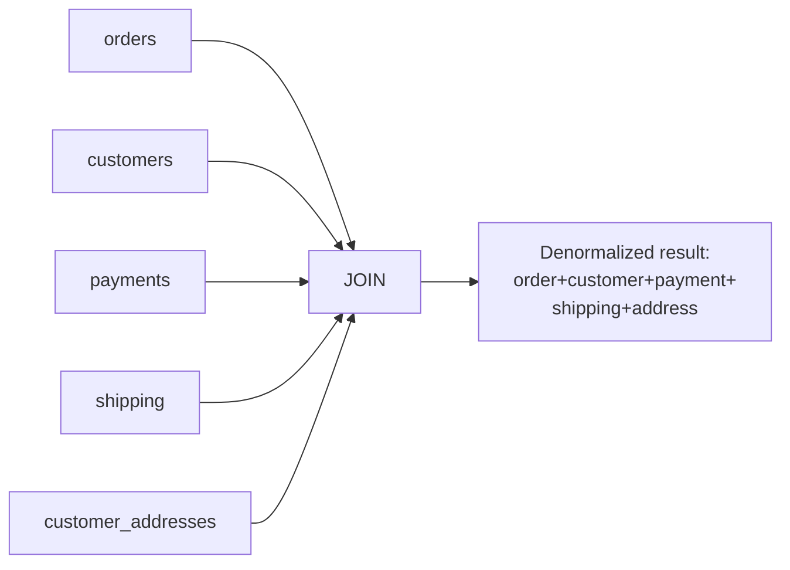

=== "SQLite"

    ```sql
    CREATE VIEW v_order_detail AS
    SELECT
        o.id AS order_id,
        o.order_number,
        o.ordered_at,
        o.status AS order_status,
        o.total_amount,
        o.discount_amount,
        o.shipping_fee,
        o.notes,
        c.id AS customer_id,
        c.name AS customer_name,
        c.email AS customer_email,
        c.grade AS customer_grade,
        p.method AS payment_method,
        p.status AS payment_status,
        p.card_issuer,
        p.installment_months,
        s.carrier,
        s.tracking_number,
        s.status AS shipping_status,
        s.delivered_at,
        ca.address1 || ' ' || COALESCE(ca.address2, '') AS delivery_address
    FROM orders o
    JOIN customers c ON o.customer_id = c.id
    LEFT JOIN payments p ON o.id = p.order_id
    LEFT JOIN shipping s ON o.id = s.order_id
    LEFT JOIN customer_addresses ca ON o.address_id = ca.id
    ```

=== "MySQL"

    ```sql
    CREATE OR REPLACE VIEW v_order_detail AS
    SELECT
        o.id AS order_id,
        o.order_number,
        o.ordered_at,
        o.status AS order_status,
        o.total_amount,
        o.discount_amount,
        o.shipping_fee,
        o.notes,
        c.id AS customer_id,
        c.name AS customer_name,
        c.email AS customer_email,
        c.grade AS customer_grade,
        p.method AS payment_method,
        p.status AS payment_status,
        p.card_issuer,
        p.installment_months,
        s.carrier,
        s.tracking_number,
        s.status AS shipping_status,
        s.delivered_at,
        CONCAT(ca.address1, ' ', COALESCE(ca.address2, '')) AS delivery_address
    FROM orders o
    JOIN customers c ON o.customer_id = c.id
    LEFT JOIN payments p ON o.id = p.order_id
    LEFT JOIN shipping s ON o.id = s.order_id
    LEFT JOIN customer_addresses ca ON o.address_id = ca.id;
    ```

=== "PostgreSQL"

    ```sql
    CREATE OR REPLACE VIEW v_order_detail AS
    SELECT
        o.id AS order_id,
        o.order_number,
        o.ordered_at,
        o.status AS order_status,
        o.total_amount,
        o.discount_amount,
        o.shipping_fee,
        o.notes,
        c.id AS customer_id,
        c.name AS customer_name,
        c.email AS customer_email,
        c.grade AS customer_grade,
        p.method AS payment_method,
        p.status AS payment_status,
        p.card_issuer,
        p.installment_months,
        s.carrier,
        s.tracking_number,
        s.status AS shipping_status,
        s.delivered_at,
        ca.address1 || ' ' || COALESCE(ca.address2, '') AS delivery_address
    FROM orders o
    JOIN customers c ON o.customer_id = c.id
    LEFT JOIN payments p ON o.id = p.order_id
    LEFT JOIN shipping s ON o.id = s.order_id
    LEFT JOIN customer_addresses ca ON o.address_id = ca.id;
    ```

### v_payment_summary -- Payment Method Summary

Aggregates count and completed/refunded/failed ratios by payment method.

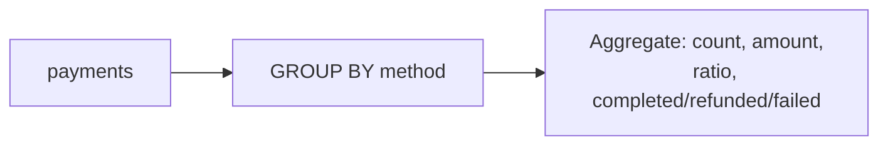

=== "SQLite"

    ```sql
    CREATE VIEW v_payment_summary AS
    SELECT
        method,
        COUNT(*) AS payment_count,
        CAST(SUM(amount) AS INTEGER) AS total_amount,
        ROUND(COUNT(*) * 100.0 / (SELECT COUNT(*) FROM payments), 1) AS pct,
        SUM(CASE WHEN status = 'completed' THEN 1 ELSE 0 END) AS completed,
        SUM(CASE WHEN status = 'refunded' THEN 1 ELSE 0 END) AS refunded,
        SUM(CASE WHEN status = 'failed' THEN 1 ELSE 0 END) AS failed
    FROM payments
    GROUP BY method
    ORDER BY payment_count DESC
    ```

=== "MySQL"

    ```sql
    CREATE OR REPLACE VIEW v_payment_summary AS
    SELECT
        method,
        COUNT(*) AS payment_count,
        CAST(SUM(amount) AS SIGNED) AS total_amount,
        ROUND(COUNT(*) * 100.0 / (SELECT COUNT(*) FROM payments), 1) AS pct,
        SUM(CASE WHEN status = 'completed' THEN 1 ELSE 0 END) AS completed,
        SUM(CASE WHEN status = 'refunded' THEN 1 ELSE 0 END) AS refunded,
        SUM(CASE WHEN status = 'failed' THEN 1 ELSE 0 END) AS failed
    FROM payments
    GROUP BY method
    ORDER BY payment_count DESC;
    ```

=== "PostgreSQL"

    ```sql
    CREATE OR REPLACE VIEW v_payment_summary AS
    SELECT
        method,
        COUNT(*) AS payment_count,
        SUM(amount)::BIGINT AS total_amount,
        ROUND(COUNT(*) * 100.0 / (SELECT COUNT(*) FROM payments), 1) AS pct,
        SUM(CASE WHEN status = 'completed' THEN 1 ELSE 0 END) AS completed,
        SUM(CASE WHEN status = 'refunded' THEN 1 ELSE 0 END) AS refunded,
        SUM(CASE WHEN status = 'failed' THEN 1 ELSE 0 END) AS failed
    FROM payments
    GROUP BY method
    ORDER BY payment_count DESC;
    ```

### v_product_abc -- Product ABC Analysis

Classifies products into A (top 70%) / B (70-90%) / C (90-100%) grades based on cumulative revenue contribution.

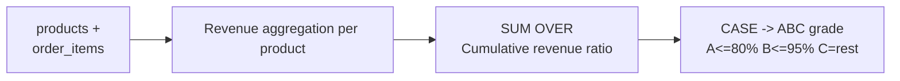

=== "SQLite"

    ```sql
    CREATE VIEW v_product_abc AS
    SELECT
        product_id, product_name, brand, total_revenue,
        revenue_pct,
        cumulative_pct,
        CASE
            WHEN cumulative_pct <= 80 THEN 'A'
            WHEN cumulative_pct <= 95 THEN 'B'
            ELSE 'C'
        END AS abc_class
    FROM (
        SELECT
            product_id, product_name, brand, total_revenue,
            ROUND(total_revenue * 100.0 / SUM(total_revenue) OVER (), 2) AS revenue_pct,
            ROUND(SUM(total_revenue) OVER (ORDER BY total_revenue DESC) * 100.0
                  / SUM(total_revenue) OVER (), 2) AS cumulative_pct
        FROM (
            SELECT
                p.id AS product_id,
                p.name AS product_name,
                p.brand,
                CAST(COALESCE(SUM(oi.subtotal), 0) AS INTEGER) AS total_revenue
            FROM products p
            LEFT JOIN order_items oi ON p.id = oi.product_id
            LEFT JOIN orders o ON oi.order_id = o.id AND o.status NOT IN ('cancelled')
            GROUP BY p.id
        )
    )
    ORDER BY total_revenue DESC
    ```

=== "MySQL"

    ```sql
    CREATE OR REPLACE VIEW v_product_abc AS
    SELECT
        product_id, product_name, brand, total_revenue,
        revenue_pct,
        cumulative_pct,
        CASE
            WHEN cumulative_pct <= 80 THEN 'A'
            WHEN cumulative_pct <= 95 THEN 'B'
            ELSE 'C'
        END AS abc_class
    FROM (
        SELECT
            product_id, product_name, brand, total_revenue,
            ROUND(total_revenue * 100.0 / SUM(total_revenue) OVER (), 2) AS revenue_pct,
            ROUND(SUM(total_revenue) OVER (ORDER BY total_revenue DESC) * 100.0
                  / SUM(total_revenue) OVER (), 2) AS cumulative_pct
        FROM (
            SELECT
                p.id AS product_id,
                p.name AS product_name,
                p.brand,
                CAST(COALESCE(SUM(oi.subtotal), 0) AS SIGNED) AS total_revenue
            FROM products p
            LEFT JOIN order_items oi ON p.id = oi.product_id
            LEFT JOIN orders o ON oi.order_id = o.id AND o.status != 'cancelled'
            GROUP BY p.id, p.name, p.brand
        ) base
    ) ranked
    ORDER BY total_revenue DESC;
    ```

=== "PostgreSQL"

    ```sql
    CREATE OR REPLACE VIEW v_product_abc AS
    SELECT
        product_id, product_name, brand, total_revenue,
        revenue_pct,
        cumulative_pct,
        CASE
            WHEN cumulative_pct <= 80 THEN 'A'
            WHEN cumulative_pct <= 95 THEN 'B'
            ELSE 'C'
        END AS abc_class
    FROM (
        SELECT
            product_id, product_name, brand, total_revenue,
            ROUND(total_revenue * 100.0 / SUM(total_revenue) OVER (), 2) AS revenue_pct,
            ROUND(SUM(total_revenue) OVER (ORDER BY total_revenue DESC) * 100.0
                  / SUM(total_revenue) OVER (), 2) AS cumulative_pct
        FROM (
            SELECT
                p.id AS product_id,
                p.name AS product_name,
                p.brand,
                COALESCE(SUM(oi.subtotal), 0)::BIGINT AS total_revenue
            FROM products p
            LEFT JOIN order_items oi ON p.id = oi.product_id
            LEFT JOIN orders o ON oi.order_id = o.id AND o.status != 'cancelled'
            GROUP BY p.id, p.name, p.brand
        ) base
    ) ranked
    ORDER BY total_revenue DESC;
    ```

### v_product_performance -- Product Performance Metrics

Aggregates sales volume, revenue, margin rate, review count, rating, wishlists, and return count per product.

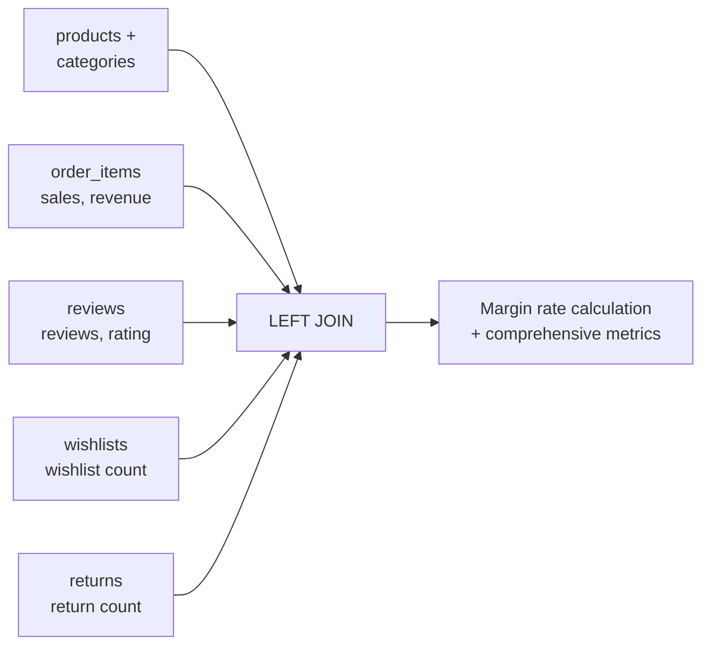

=== "SQLite"

    ```sql
    CREATE VIEW v_product_performance AS
    SELECT
        p.id,
        p.name,
        p.brand,
        p.sku,
        c.name AS category,
        p.price,
        p.cost_price,
        ROUND((p.price - p.cost_price) / p.price * 100, 1) AS margin_pct,
        p.stock_qty,
        p.is_active,
        COALESCE(s.total_sold, 0) AS total_sold,
        COALESCE(s.total_revenue, 0) AS total_revenue,
        COALESCE(s.order_count, 0) AS order_count,
        COALESCE(rv.review_count, 0) AS review_count,
        COALESCE(rv.avg_rating, 0) AS avg_rating,
        COALESCE(ws.wishlist_count, 0) AS wishlist_count,
        COALESCE(rt.return_count, 0) AS return_count
    FROM products p
    JOIN categories c ON p.category_id = c.id
    LEFT JOIN (
        SELECT oi.product_id,
               SUM(oi.quantity) AS total_sold,
               CAST(SUM(oi.subtotal) AS INTEGER) AS total_revenue,
               COUNT(DISTINCT oi.order_id) AS order_count
        FROM order_items oi
        JOIN orders o ON oi.order_id = o.id
        WHERE o.status NOT IN ('cancelled')
        GROUP BY oi.product_id
    ) s ON p.id = s.product_id
    LEFT JOIN (
        SELECT product_id,
               COUNT(*) AS review_count,
               ROUND(AVG(rating), 1) AS avg_rating
        FROM reviews
        GROUP BY product_id
    ) rv ON p.id = rv.product_id
    LEFT JOIN (
        SELECT product_id, COUNT(*) AS wishlist_count
        FROM wishlists
        GROUP BY product_id
    ) ws ON p.id = ws.product_id
    LEFT JOIN (
        SELECT oi.product_id, COUNT(DISTINCT r.id) AS return_count
        FROM returns r
        JOIN order_items oi ON r.order_id = oi.order_id
        GROUP BY oi.product_id
    ) rt ON p.id = rt.product_id
    ```

=== "MySQL"

    ```sql
    CREATE OR REPLACE VIEW v_product_performance AS
    SELECT
        p.id,
        p.name,
        p.brand,
        p.sku,
        c.name AS category,
        p.price,
        p.cost_price,
        ROUND((p.price - p.cost_price) / p.price * 100, 1) AS margin_pct,
        p.stock_qty,
        p.is_active,
        COALESCE(s.total_sold, 0) AS total_sold,
        COALESCE(s.total_revenue, 0) AS total_revenue,
        COALESCE(s.order_count, 0) AS order_count,
        COALESCE(rv.review_count, 0) AS review_count,
        COALESCE(rv.avg_rating, 0) AS avg_rating,
        COALESCE(ws.wishlist_count, 0) AS wishlist_count,
        COALESCE(rt.return_count, 0) AS return_count
    FROM products p
    JOIN categories c ON p.category_id = c.id
    LEFT JOIN (
        SELECT oi.product_id,
               SUM(oi.quantity) AS total_sold,
               CAST(SUM(oi.subtotal) AS SIGNED) AS total_revenue,
               COUNT(DISTINCT oi.order_id) AS order_count
        FROM order_items oi
        JOIN orders o ON oi.order_id = o.id
        WHERE o.status != 'cancelled'
        GROUP BY oi.product_id
    ) s ON p.id = s.product_id
    LEFT JOIN (
        SELECT product_id,
               COUNT(*) AS review_count,
               ROUND(AVG(rating), 1) AS avg_rating
        FROM reviews
        GROUP BY product_id
    ) rv ON p.id = rv.product_id
    LEFT JOIN (
        SELECT product_id, COUNT(*) AS wishlist_count
        FROM wishlists
        GROUP BY product_id
    ) ws ON p.id = ws.product_id
    LEFT JOIN (
        SELECT oi.product_id, COUNT(DISTINCT r.id) AS return_count
        FROM returns r
        JOIN order_items oi ON r.order_id = oi.order_id
        GROUP BY oi.product_id
    ) rt ON p.id = rt.product_id;
    ```

### v_return_analysis -- Return Analysis

Analyzes count by return reason, refund/exchange ratio, inspection results, and average processing days.

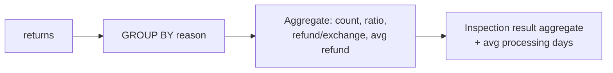

=== "SQLite"

    ```sql
    CREATE VIEW v_return_analysis AS
    SELECT
        reason,
        COUNT(*) AS total_count,
        ROUND(COUNT(*) * 100.0 / (SELECT COUNT(*) FROM returns), 1) AS pct,
        SUM(CASE WHEN return_type = 'refund' THEN 1 ELSE 0 END) AS refund_count,
        SUM(CASE WHEN return_type = 'exchange' THEN 1 ELSE 0 END) AS exchange_count,
        CAST(AVG(refund_amount) AS INTEGER) AS avg_refund_amount,
        SUM(CASE WHEN inspection_result = 'defective' THEN 1 ELSE 0 END) AS defective_count,
        SUM(CASE WHEN inspection_result = 'good' THEN 1 ELSE 0 END) AS good_count,
        CAST(AVG(
            CASE WHEN completed_at IS NOT NULL
            THEN julianday(completed_at) - julianday(requested_at)
            END
        ) AS INTEGER) AS avg_process_days
    FROM returns
    GROUP BY reason
    ORDER BY total_count DESC
    ```

=== "MySQL"

    ```sql
    CREATE OR REPLACE VIEW v_return_analysis AS
    SELECT
        reason,
        COUNT(*) AS total_count,
        ROUND(COUNT(*) * 100.0 / (SELECT COUNT(*) FROM returns), 1) AS pct,
        SUM(CASE WHEN return_type = 'refund' THEN 1 ELSE 0 END) AS refund_count,
        SUM(CASE WHEN return_type = 'exchange' THEN 1 ELSE 0 END) AS exchange_count,
        CAST(AVG(refund_amount) AS SIGNED) AS avg_refund_amount,
        SUM(CASE WHEN inspection_result = 'defective' THEN 1 ELSE 0 END) AS defective_count,
        SUM(CASE WHEN inspection_result = 'good' THEN 1 ELSE 0 END) AS good_count,
        CAST(AVG(
            CASE WHEN completed_at IS NOT NULL
            THEN DATEDIFF(completed_at, requested_at)
            END
        ) AS SIGNED) AS avg_process_days
    FROM returns
    GROUP BY reason
    ORDER BY total_count DESC;
    ```

=== "PostgreSQL"

    ```sql
    CREATE OR REPLACE VIEW v_return_analysis AS
    SELECT
        reason,
        COUNT(*) AS total_count,
        ROUND(COUNT(*) * 100.0 / (SELECT COUNT(*) FROM returns), 1) AS pct,
        SUM(CASE WHEN return_type = 'refund' THEN 1 ELSE 0 END) AS refund_count,
        SUM(CASE WHEN return_type = 'exchange' THEN 1 ELSE 0 END) AS exchange_count,
        AVG(refund_amount)::INT AS avg_refund_amount,
        SUM(CASE WHEN inspection_result = 'defective' THEN 1 ELSE 0 END) AS defective_count,
        SUM(CASE WHEN inspection_result = 'good' THEN 1 ELSE 0 END) AS good_count,
        (AVG(
            CASE WHEN completed_at IS NOT NULL
            THEN EXTRACT(DAY FROM (completed_at - requested_at))
            END
        ))::INT AS avg_process_days
    FROM returns
    GROUP BY reason
    ORDER BY total_count DESC;
    ```

### v_revenue_growth -- Monthly Revenue Growth Rate

Calculates month-over-month revenue growth rate (%) using the LAG window function.

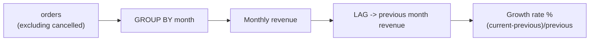

=== "SQLite"

    ```sql
    CREATE VIEW v_revenue_growth AS
    SELECT
        month,
        revenue,
        prev_revenue,
        CASE
            WHEN prev_revenue > 0
            THEN ROUND((revenue - prev_revenue) * 100.0 / prev_revenue, 1)
            ELSE NULL
        END AS growth_pct
    FROM (
        SELECT
            SUBSTR(ordered_at, 1, 7) AS month,
            CAST(SUM(total_amount) AS INTEGER) AS revenue,
            LAG(CAST(SUM(total_amount) AS INTEGER)) OVER (ORDER BY SUBSTR(ordered_at, 1, 7)) AS prev_revenue
        FROM orders
        WHERE status NOT IN ('cancelled')
        GROUP BY SUBSTR(ordered_at, 1, 7)
    )
    ORDER BY month
    ```

=== "MySQL"

    ```sql
    CREATE OR REPLACE VIEW v_revenue_growth AS
    SELECT
        month,
        revenue,
        prev_revenue,
        CASE
            WHEN prev_revenue > 0
            THEN ROUND((revenue - prev_revenue) * 100.0 / prev_revenue, 1)
            ELSE NULL
        END AS growth_pct
    FROM (
        SELECT
            DATE_FORMAT(ordered_at, '%Y-%m') AS month,
            CAST(SUM(total_amount) AS SIGNED) AS revenue,
            LAG(CAST(SUM(total_amount) AS SIGNED)) OVER (ORDER BY DATE_FORMAT(ordered_at, '%Y-%m')) AS prev_revenue
        FROM orders
        WHERE status != 'cancelled'
        GROUP BY DATE_FORMAT(ordered_at, '%Y-%m')
    ) sub
    ORDER BY month;
    ```

=== "PostgreSQL"

    ```sql
    CREATE OR REPLACE VIEW v_revenue_growth AS
    SELECT
        month,
        revenue,
        prev_revenue,
        CASE
            WHEN prev_revenue > 0
            THEN ROUND((revenue - prev_revenue) * 100.0 / prev_revenue, 1)
            ELSE NULL
        END AS growth_pct
    FROM (
        SELECT
            TO_CHAR(ordered_at, 'YYYY-MM') AS month,
            SUM(total_amount)::BIGINT AS revenue,
            LAG(SUM(total_amount)::BIGINT) OVER (ORDER BY TO_CHAR(ordered_at, 'YYYY-MM')) AS prev_revenue
        FROM orders
        WHERE status != 'cancelled'
        GROUP BY TO_CHAR(ordered_at, 'YYYY-MM')
    ) sub
    ORDER BY month;
    ```

### v_staff_workload -- CS Staff Workload

Aggregates inquiry processing count, resolution rate, and average processing time per CS staff.

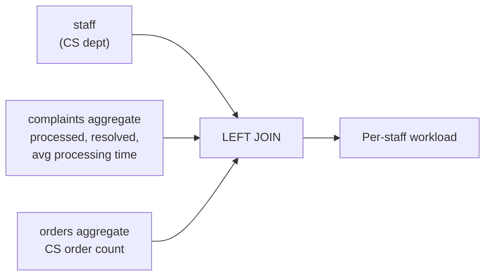

=== "SQLite"

    ```sql
    CREATE VIEW v_staff_workload AS
    SELECT
        s.id AS staff_id,
        s.name,
        s.department,
        COALESCE(comp.complaint_count, 0) AS complaint_count,
        COALESCE(comp.resolved_count, 0) AS resolved_count,
        COALESCE(comp.avg_resolve_hours, 0) AS avg_resolve_hours,
        COALESCE(ord.cs_order_count, 0) AS cs_order_count
    FROM staff s
    LEFT JOIN (
        SELECT
            staff_id,
            COUNT(*) AS complaint_count,
            SUM(CASE WHEN status IN ('resolved','closed') THEN 1 ELSE 0 END) AS resolved_count,
            CAST(AVG(
                CASE WHEN resolved_at IS NOT NULL
                THEN (julianday(resolved_at) - julianday(created_at)) * 24
                END
            ) AS INTEGER) AS avg_resolve_hours
        FROM complaints
        GROUP BY staff_id
    ) comp ON s.id = comp.staff_id
    LEFT JOIN (
        SELECT staff_id, COUNT(*) AS cs_order_count
        FROM orders WHERE staff_id IS NOT NULL
        GROUP BY staff_id
    ) ord ON s.id = ord.staff_id
    WHERE s.department = 'CS' OR comp.complaint_count > 0
    ```

=== "MySQL"

    ```sql
    CREATE OR REPLACE VIEW v_staff_workload AS
    SELECT
        s.id AS staff_id,
        s.name,
        s.department,
        COALESCE(comp.complaint_count, 0) AS complaint_count,
        COALESCE(comp.resolved_count, 0) AS resolved_count,
        COALESCE(comp.avg_resolve_hours, 0) AS avg_resolve_hours,
        COALESCE(ord.cs_order_count, 0) AS cs_order_count
    FROM staff s
    LEFT JOIN (
        SELECT
            staff_id,
            COUNT(*) AS complaint_count,
            SUM(CASE WHEN status IN ('resolved','closed') THEN 1 ELSE 0 END) AS resolved_count,
            CAST(AVG(
                CASE WHEN resolved_at IS NOT NULL
                THEN TIMESTAMPDIFF(HOUR, created_at, resolved_at)
                END
            ) AS SIGNED) AS avg_resolve_hours
        FROM complaints
        GROUP BY staff_id
    ) comp ON s.id = comp.staff_id
    LEFT JOIN (
        SELECT staff_id, COUNT(*) AS cs_order_count
        FROM orders WHERE staff_id IS NOT NULL
        GROUP BY staff_id
    ) ord ON s.id = ord.staff_id
    WHERE s.department = 'CS' OR comp.complaint_count > 0;
    ```

=== "PostgreSQL"

    ```sql
    CREATE OR REPLACE VIEW v_staff_workload AS
    SELECT
        s.id AS staff_id,
        s.name,
        s.department,
        COALESCE(comp.complaint_count, 0) AS complaint_count,
        COALESCE(comp.resolved_count, 0) AS resolved_count,
        COALESCE(comp.avg_resolve_hours, 0) AS avg_resolve_hours,
        COALESCE(ord.cs_order_count, 0) AS cs_order_count
    FROM staff s
    LEFT JOIN (
        SELECT
            staff_id,
            COUNT(*) AS complaint_count,
            SUM(CASE WHEN status IN ('resolved','closed') THEN 1 ELSE 0 END) AS resolved_count,
            (AVG(
                CASE WHEN resolved_at IS NOT NULL
                THEN EXTRACT(EPOCH FROM (resolved_at - created_at)) / 3600
                END
            ))::INT AS avg_resolve_hours
        FROM complaints
        GROUP BY staff_id
    ) comp ON s.id = comp.staff_id
    LEFT JOIN (
        SELECT staff_id, COUNT(*) AS cs_order_count
        FROM orders WHERE staff_id IS NOT NULL
        GROUP BY staff_id
    ) ord ON s.id = ord.staff_id
    WHERE s.department = 'CS' OR comp.complaint_count > 0;
    ```

### v_supplier_performance -- Supplier Performance

Aggregates product count, revenue, and return rate per supplier.

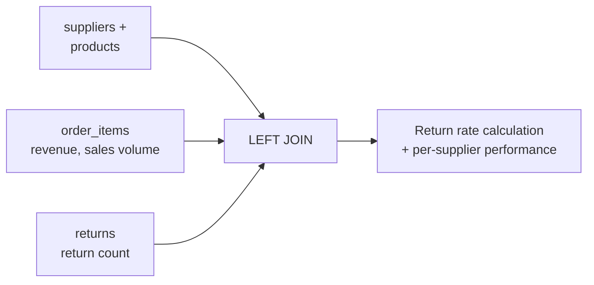

=== "SQLite"

    ```sql
    CREATE VIEW v_supplier_performance AS
    SELECT
        s.id AS supplier_id,
        s.company_name,
        COUNT(DISTINCT p.id) AS product_count,
        SUM(CASE WHEN p.is_active = 1 THEN 1 ELSE 0 END) AS active_products,
        COALESCE(sales.total_revenue, 0) AS total_revenue,
        COALESCE(sales.total_sold, 0) AS total_sold,
        COALESCE(ret.return_count, 0) AS return_count,
        CASE
            WHEN COALESCE(sales.total_sold, 0) > 0
            THEN ROUND(COALESCE(ret.return_count, 0) * 100.0 / sales.total_sold, 2)
            ELSE 0
        END AS return_rate_pct
    FROM suppliers s
    LEFT JOIN products p ON s.id = p.supplier_id
    LEFT JOIN (
        SELECT p2.supplier_id,
               CAST(SUM(oi.subtotal) AS INTEGER) AS total_revenue,
               SUM(oi.quantity) AS total_sold
        FROM order_items oi
        JOIN products p2 ON oi.product_id = p2.id
        JOIN orders o ON oi.order_id = o.id
        WHERE o.status NOT IN ('cancelled')
        GROUP BY p2.supplier_id
    ) sales ON s.id = sales.supplier_id
    LEFT JOIN (
        SELECT p3.supplier_id, COUNT(*) AS return_count
        FROM returns r
        JOIN order_items oi ON r.order_id = oi.order_id
        JOIN products p3 ON oi.product_id = p3.id
        GROUP BY p3.supplier_id
    ) ret ON s.id = ret.supplier_id
    GROUP BY s.id
    ```

=== "MySQL"

    ```sql
    CREATE OR REPLACE VIEW v_supplier_performance AS
    SELECT
        s.id AS supplier_id,
        s.company_name,
        COUNT(DISTINCT p.id) AS product_count,
        SUM(CASE WHEN p.is_active = 1 THEN 1 ELSE 0 END) AS active_products,
        COALESCE(sales.total_revenue, 0) AS total_revenue,
        COALESCE(sales.total_sold, 0) AS total_sold,
        COALESCE(ret.return_count, 0) AS return_count,
        CASE
            WHEN COALESCE(sales.total_sold, 0) > 0
            THEN ROUND(COALESCE(ret.return_count, 0) * 100.0 / sales.total_sold, 2)
            ELSE 0
        END AS return_rate_pct
    FROM suppliers s
    LEFT JOIN products p ON s.id = p.supplier_id
    LEFT JOIN (
        SELECT p2.supplier_id,
               CAST(SUM(oi.subtotal) AS SIGNED) AS total_revenue,
               SUM(oi.quantity) AS total_sold
        FROM order_items oi
        JOIN products p2 ON oi.product_id = p2.id
        JOIN orders o ON oi.order_id = o.id
        WHERE o.status != 'cancelled'
        GROUP BY p2.supplier_id
    ) sales ON s.id = sales.supplier_id
    LEFT JOIN (
        SELECT p3.supplier_id, COUNT(*) AS return_count
        FROM returns r
        JOIN order_items oi ON r.order_id = oi.order_id
        JOIN products p3 ON oi.product_id = p3.id
        GROUP BY p3.supplier_id
    ) ret ON s.id = ret.supplier_id
    GROUP BY s.id, s.company_name;
    ```

=== "PostgreSQL"

    ```sql
    CREATE OR REPLACE VIEW v_supplier_performance AS
    SELECT
        s.id AS supplier_id,
        s.company_name,
        COUNT(DISTINCT p.id) AS product_count,
        SUM(CASE WHEN p.is_active THEN 1 ELSE 0 END) AS active_products,
        COALESCE(sales.total_revenue, 0) AS total_revenue,
        COALESCE(sales.total_sold, 0) AS total_sold,
        COALESCE(ret.return_count, 0) AS return_count,
        CASE
            WHEN COALESCE(sales.total_sold, 0) > 0
            THEN ROUND(COALESCE(ret.return_count, 0) * 100.0 / sales.total_sold, 2)
            ELSE 0
        END AS return_rate_pct
    FROM suppliers s
    LEFT JOIN products p ON s.id = p.supplier_id
    LEFT JOIN (
        SELECT p2.supplier_id,
               SUM(oi.subtotal)::BIGINT AS total_revenue,
               SUM(oi.quantity) AS total_sold
        FROM order_items oi
        JOIN products p2 ON oi.product_id = p2.id
        JOIN orders o ON oi.order_id = o.id
        WHERE o.status != 'cancelled'
        GROUP BY p2.supplier_id
    ) sales ON s.id = sales.supplier_id
    LEFT JOIN (
        SELECT p3.supplier_id, COUNT(*) AS return_count
        FROM returns r
        JOIN order_items oi ON r.order_id = oi.order_id
        JOIN products p3 ON oi.product_id = p3.id
        GROUP BY p3.supplier_id
    ) ret ON s.id = ret.supplier_id
    GROUP BY s.id, s.company_name;
    ```

### v_top_products_by_category -- Top Products by Category

Extracts the top 5 products by revenue per category using ROW_NUMBER.

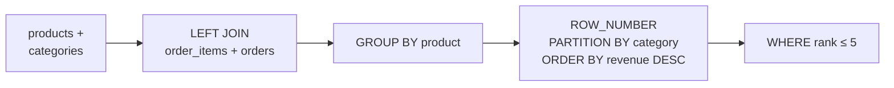

=== "SQLite"

    ```sql
    CREATE VIEW v_top_products_by_category AS
    SELECT
        category_name,
        product_name,
        brand,
        total_revenue,
        total_sold,
        rank_in_category
    FROM (
        SELECT
            cat.name AS category_name,
            p.name AS product_name,
            p.brand,
            COALESCE(SUM(oi.subtotal), 0) AS total_revenue,
            COALESCE(SUM(oi.quantity), 0) AS total_sold,
            ROW_NUMBER() OVER (
                PARTITION BY p.category_id
                ORDER BY COALESCE(SUM(oi.subtotal), 0) DESC
            ) AS rank_in_category
        FROM products p
        JOIN categories cat ON p.category_id = cat.id
        LEFT JOIN order_items oi ON p.id = oi.product_id
        LEFT JOIN orders o ON oi.order_id = o.id AND o.status NOT IN ('cancelled')
        GROUP BY p.id
    )
    WHERE rank_in_category <= 5
    ```

=== "MySQL"

    ```sql
    CREATE OR REPLACE VIEW v_top_products_by_category AS
    SELECT
        category_name,
        product_name,
        brand,
        total_revenue,
        total_sold,
        rank_in_category
    FROM (
        SELECT
            cat.name AS category_name,
            p.name AS product_name,
            p.brand,
            COALESCE(SUM(oi.subtotal), 0) AS total_revenue,
            COALESCE(SUM(oi.quantity), 0) AS total_sold,
            ROW_NUMBER() OVER (
                PARTITION BY p.category_id
                ORDER BY COALESCE(SUM(oi.subtotal), 0) DESC
            ) AS rank_in_category
        FROM products p
        JOIN categories cat ON p.category_id = cat.id
        LEFT JOIN order_items oi ON p.id = oi.product_id
        LEFT JOIN orders o ON oi.order_id = o.id AND o.status != 'cancelled'
        GROUP BY p.id, cat.name, p.name, p.brand, p.category_id
    ) sub
    WHERE rank_in_category <= 5;
    ```

=== "PostgreSQL"

    ```sql
    CREATE OR REPLACE VIEW v_top_products_by_category AS
    SELECT
        category_name,
        product_name,
        brand,
        total_revenue,
        total_sold,
        rank_in_category
    FROM (
        SELECT
            cat.name AS category_name,
            p.name AS product_name,
            p.brand,
            COALESCE(SUM(oi.subtotal), 0)::BIGINT AS total_revenue,
            COALESCE(SUM(oi.quantity), 0) AS total_sold,
            ROW_NUMBER() OVER (
                PARTITION BY p.category_id
                ORDER BY COALESCE(SUM(oi.subtotal), 0) DESC
            ) AS rank_in_category
        FROM products p
        JOIN categories cat ON p.category_id = cat.id
        LEFT JOIN order_items oi ON p.id = oi.product_id
        LEFT JOIN orders o ON oi.order_id = o.id AND o.status != 'cancelled'
        GROUP BY p.id, cat.name, p.name, p.brand, p.category_id
    ) sub
    WHERE rank_in_category <= 5;
    ```

### v_yearly_kpi -- Yearly Core KPI

Aggregates annual revenue, order count, customer count, cancellation rate, return rate, and other key metrics.

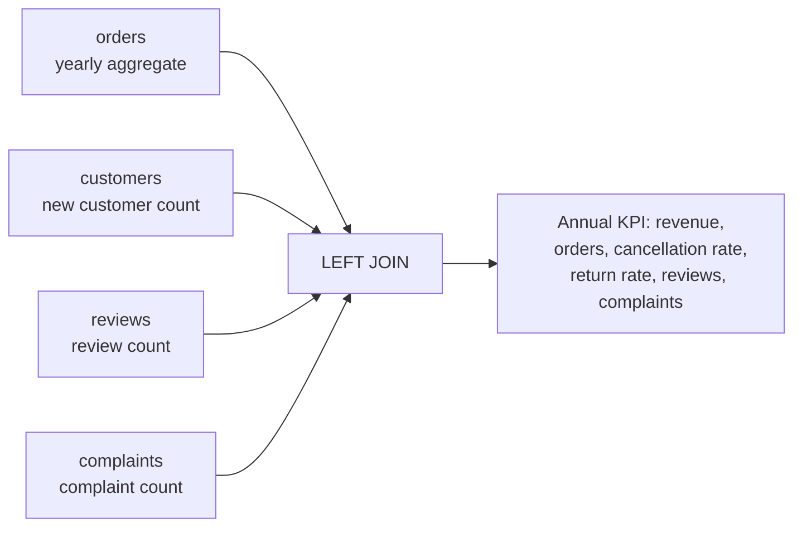

=== "SQLite"

    ```sql
    CREATE VIEW v_yearly_kpi AS
    SELECT
        o_stats.yr AS year,
        o_stats.total_revenue,
        o_stats.order_count,
        o_stats.customer_count,
        CAST(o_stats.total_revenue * 1.0 / o_stats.order_count AS INTEGER) AS avg_order_value,
        CAST(o_stats.total_revenue * 1.0 / o_stats.customer_count AS INTEGER) AS revenue_per_customer,
        COALESCE(c.new_customers, 0) AS new_customers,
        o_stats.cancel_count,
        ROUND(o_stats.cancel_count * 100.0 / o_stats.order_count, 1) AS cancel_rate_pct,
        o_stats.return_count,
        ROUND(o_stats.return_count * 100.0 / o_stats.order_count, 1) AS return_rate_pct,
        COALESCE(r.review_count, 0) AS review_count,
        COALESCE(comp.complaint_count, 0) AS complaint_count
    FROM (
        SELECT
            SUBSTR(o.ordered_at, 1, 4) AS yr,
            CAST(SUM(CASE WHEN o.status NOT IN ('cancelled') THEN o.total_amount ELSE 0 END) AS INTEGER) AS total_revenue,
            COUNT(*) AS order_count,
            COUNT(DISTINCT o.customer_id) AS customer_count,
            SUM(CASE WHEN o.status = 'cancelled' THEN 1 ELSE 0 END) AS cancel_count,
            SUM(CASE WHEN o.status IN ('return_requested','returned') THEN 1 ELSE 0 END) AS return_count
        FROM orders o
        GROUP BY SUBSTR(o.ordered_at, 1, 4)
    ) o_stats
    LEFT JOIN (
        SELECT SUBSTR(created_at, 1, 4) AS yr, COUNT(*) AS new_customers
        FROM customers GROUP BY SUBSTR(created_at, 1, 4)
    ) c ON o_stats.yr = c.yr
    LEFT JOIN (
        SELECT SUBSTR(created_at, 1, 4) AS yr, COUNT(*) AS review_count
        FROM reviews GROUP BY SUBSTR(created_at, 1, 4)
    ) r ON o_stats.yr = r.yr
    LEFT JOIN (
        SELECT SUBSTR(created_at, 1, 4) AS yr, COUNT(*) AS complaint_count
        FROM complaints GROUP BY SUBSTR(created_at, 1, 4)
    ) comp ON o_stats.yr = comp.yr
    ORDER BY o_stats.yr
    ```

=== "MySQL"

    ```sql
    CREATE OR REPLACE VIEW v_yearly_kpi AS
    SELECT
        o_stats.yr AS year,
        o_stats.total_revenue,
        o_stats.order_count,
        o_stats.customer_count,
        CAST(o_stats.total_revenue / o_stats.order_count AS SIGNED) AS avg_order_value,
        CAST(o_stats.total_revenue / o_stats.customer_count AS SIGNED) AS revenue_per_customer,
        COALESCE(c.new_customers, 0) AS new_customers,
        o_stats.cancel_count,
        ROUND(o_stats.cancel_count * 100.0 / o_stats.order_count, 1) AS cancel_rate_pct,
        o_stats.return_count,
        ROUND(o_stats.return_count * 100.0 / o_stats.order_count, 1) AS return_rate_pct,
        COALESCE(r.review_count, 0) AS review_count,
        COALESCE(comp.complaint_count, 0) AS complaint_count
    FROM (
        SELECT
            YEAR(o.ordered_at) AS yr,
            CAST(SUM(CASE WHEN o.status != 'cancelled' THEN o.total_amount ELSE 0 END) AS SIGNED) AS total_revenue,
            COUNT(*) AS order_count,
            COUNT(DISTINCT o.customer_id) AS customer_count,
            SUM(CASE WHEN o.status = 'cancelled' THEN 1 ELSE 0 END) AS cancel_count,
            SUM(CASE WHEN o.status IN ('return_requested','returned') THEN 1 ELSE 0 END) AS return_count
        FROM orders o
        GROUP BY YEAR(o.ordered_at)
    ) o_stats
    LEFT JOIN (
        SELECT YEAR(created_at) AS yr, COUNT(*) AS new_customers
        FROM customers GROUP BY YEAR(created_at)
    ) c ON o_stats.yr = c.yr
    LEFT JOIN (
        SELECT YEAR(created_at) AS yr, COUNT(*) AS review_count
        FROM reviews GROUP BY YEAR(created_at)
    ) r ON o_stats.yr = r.yr
    LEFT JOIN (
        SELECT YEAR(created_at) AS yr, COUNT(*) AS complaint_count
        FROM complaints GROUP BY YEAR(created_at)
    ) comp ON o_stats.yr = comp.yr
    ORDER BY o_stats.yr;
    ```

=== "PostgreSQL"

    ```sql
    CREATE OR REPLACE VIEW v_yearly_kpi AS
    SELECT
        o_stats.yr AS year,
        o_stats.total_revenue,
        o_stats.order_count,
        o_stats.customer_count,
        (o_stats.total_revenue / o_stats.order_count)::INT AS avg_order_value,
        (o_stats.total_revenue / o_stats.customer_count)::INT AS revenue_per_customer,
        COALESCE(c.new_customers, 0) AS new_customers,
        o_stats.cancel_count,
        ROUND(o_stats.cancel_count * 100.0 / o_stats.order_count, 1) AS cancel_rate_pct,
        o_stats.return_count,
        ROUND(o_stats.return_count * 100.0 / o_stats.order_count, 1) AS return_rate_pct,
        COALESCE(r.review_count, 0) AS review_count,
        COALESCE(comp.complaint_count, 0) AS complaint_count
    FROM (
        SELECT
            EXTRACT(YEAR FROM o.ordered_at)::INT AS yr,
            SUM(CASE WHEN o.status != 'cancelled' THEN o.total_amount ELSE 0 END)::BIGINT AS total_revenue,
            COUNT(*) AS order_count,
            COUNT(DISTINCT o.customer_id) AS customer_count,
            SUM(CASE WHEN o.status = 'cancelled' THEN 1 ELSE 0 END) AS cancel_count,
            SUM(CASE WHEN o.status IN ('return_requested','returned') THEN 1 ELSE 0 END) AS return_count
        FROM orders o
        GROUP BY EXTRACT(YEAR FROM o.ordered_at)::INT
    ) o_stats
    LEFT JOIN (
        SELECT EXTRACT(YEAR FROM created_at)::INT AS yr, COUNT(*) AS new_customers
        FROM customers GROUP BY EXTRACT(YEAR FROM created_at)::INT
    ) c ON o_stats.yr = c.yr
    LEFT JOIN (
        SELECT EXTRACT(YEAR FROM created_at)::INT AS yr, COUNT(*) AS review_count
        FROM reviews GROUP BY EXTRACT(YEAR FROM created_at)::INT
    ) r ON o_stats.yr = r.yr
    LEFT JOIN (
        SELECT EXTRACT(YEAR FROM created_at)::INT AS yr, COUNT(*) AS complaint_count
        FROM complaints GROUP BY EXTRACT(YEAR FROM created_at)::INT
    ) comp ON o_stats.yr = comp.yr
    ORDER BY o_stats.yr;
    ```


