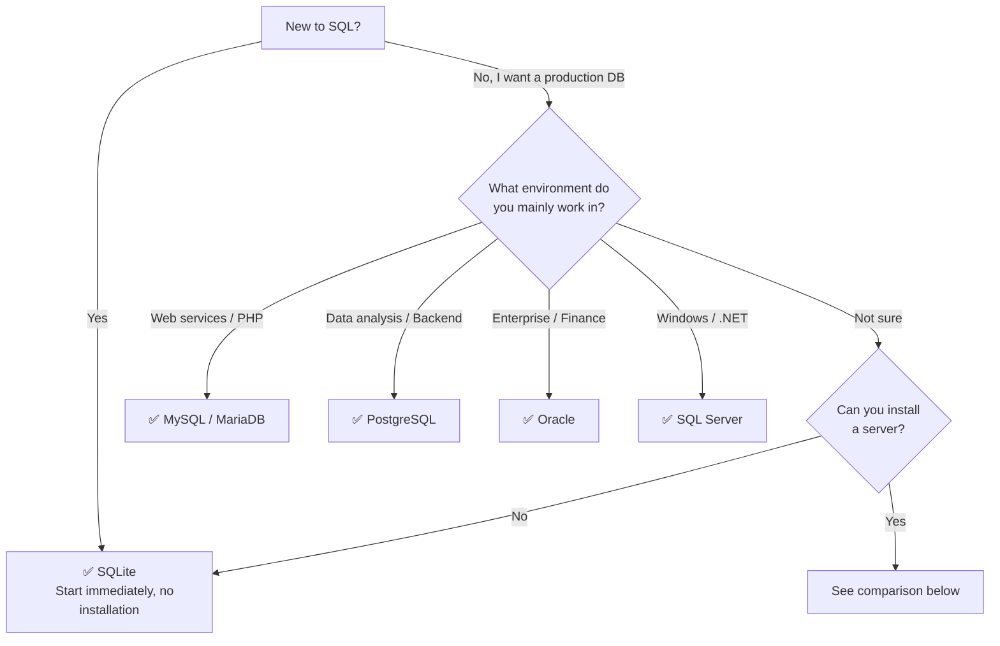

# 01. Choose a Database

This tutorial supports five databases: **SQLite, MySQL, PostgreSQL, Oracle, and SQL Server**. All lessons and exercises provide DB-specific tabs, so you can learn the same content regardless of which DB you choose.

**Pick one right now.** Later, running the same queries on other DBs will naturally teach you the differences between them.

## Which DB Should I Choose?

## Quick Comparison

| | SQLite | MySQL / MariaDB | PostgreSQL | Oracle | SQL Server |
|-|--------|----------------|------------|--------|------------|
| **Difficulty** | Very Easy | Moderate | Moderate | Hard | Moderate |
| **Installation** | Not needed (file-based) | Server required | Server required | Server required | Server required |
| **Best for** | Learning, embedded, mobile | Web services, CRUD apps | Analytics, complex queries, GIS | Enterprise, finance, government | Windows, .NET, Azure |
| **SQL Standard** | Mostly supported | Some gaps | Highest level | High (many extensions) | High (T-SQL extensions) |
| **Stored Procedures** | Not supported | Supported | Supported | PL/SQL | T-SQL |
| **JSON** | Basic functions | JSON type | JSONB (high performance) | JSON (21c+) | JSON (2016+) |

For detailed pros and cons of each DB, see [Tutorial Introduction > Supported Databases](../index.md#supported-databases).

## Recommendation Summary

| Situation | Recommended DB | Reason |
|-----------|:-------------:|--------|
| New to SQL | **SQLite** | Start immediately with a single file, no installation |
| Working in web development | **MySQL** | Standard for PHP, WordPress, web hosting ecosystem |
| Doing data analysis / backend | **PostgreSQL** | Highest SQL standard compliance, JSONB, window functions |
| Enterprise / finance systems | **Oracle** | PL/SQL, large-scale transactions, high availability |
| Windows / .NET environment | **SQL Server** | SSMS, Azure integration, T-SQL |
| Developing mobile/desktop apps | **SQLite** | De facto standard for embedded DBs |
| Not sure | **SQLite** | Easiest, and you can expand later |

[← 00. Download the Project](00-install.md){ .md-button }
[02. Install the Database →](02-database.md){ .md-button .md-button--primary }
