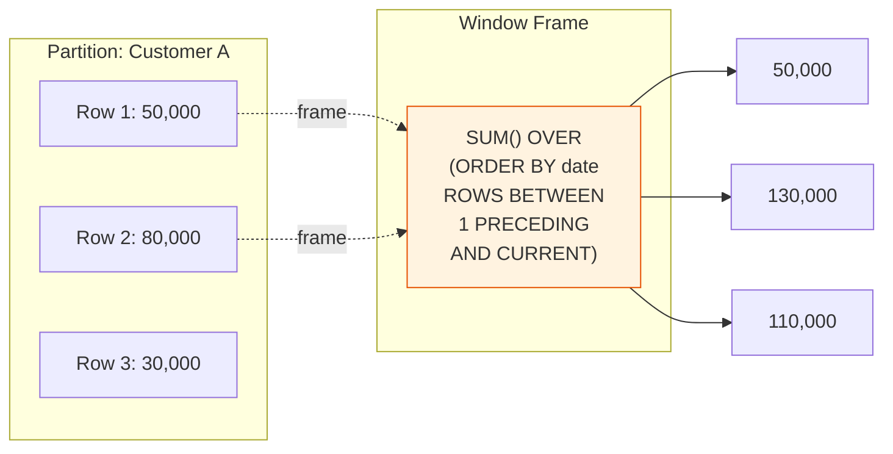

# 강의 15: 윈도우 함수(Window Functions)

윈도우 함수는 `GROUP BY`처럼 결과를 하나로 합치지 않으면서, 현재 행과 연관된 행들을 대상으로 계산을 수행합니다. 각 행은 고유한 정체성을 유지하면서 집계나 순위 정보에 접근할 수 있습니다.

구문: `function() OVER (PARTITION BY ... ORDER BY ...)`



> 윈도우 함수는 행을 그룹화하지 않고, 각 행에서 주변 행들을 참조하여 계산합니다. 결과 행 수가 줄어들지 않습니다.

## ROW_NUMBER, RANK, DENSE_RANK

순위 함수는 파티션 내에서 각 행에 순위를 부여합니다.

| 함수 | 동점 처리 | 순위 건너뜀 |
|----------|------|-----------------|
| `ROW_NUMBER()` | 임의로 순위 부여 | — |
| `RANK()` | 같은 순위 | 있음 (1,1,3) |
| `DENSE_RANK()` | 같은 순위 | 없음 (1,1,2) |

```sql
-- 카테고리별 가격 기준으로 상품 순위 매기기
SELECT
    cat.name            AS category,
    p.name              AS product_name,
    p.price,
    RANK() OVER (
        PARTITION BY p.category_id
        ORDER BY p.price DESC
    ) AS price_rank
FROM products AS p
INNER JOIN categories AS cat ON p.category_id = cat.id
WHERE p.is_active = 1
ORDER BY cat.name, price_rank
LIMIT 12;
```

**결과:**

| category | product_name | price | price_rank |
|----------|--------------|-------|------------|
| 데스크탑 | ASUS ROG 게이밍 데스크탑 | 1899.00 | 1 |
| 데스크탑 | CyberPowerPC Gamer Xtreme | 1299.00 | 2 |
| 데스크탑 | Acer Aspire TC | 549.00 | 3 |
| 노트북 | Dell XPS 17 | 1999.00 | 1 |
| 노트북 | MacBook Pro 16" M3 | 1799.00 | 2 |
| 노트북 | Dell XPS 15 | 1299.99 | 3 |
| ... | | | |

## 그룹별 상위 N개 (Top-N per Group)

순위가 매겨진 쿼리를 CTE나 서브쿼리로 감싸면 파티션별 상위 N개를 추출할 수 있습니다.

```sql
-- 카테고리별 판매량 기준 상위 3개 상품 (판매 수량 기준)
WITH ranked_sales AS (
    SELECT
        cat.name                        AS category,
        p.name                          AS product_name,
        SUM(oi.quantity)                AS units_sold,
        RANK() OVER (
            PARTITION BY p.category_id
            ORDER BY SUM(oi.quantity) DESC
        ) AS sales_rank
    FROM order_items AS oi
    INNER JOIN products   AS p   ON oi.product_id = p.id
    INNER JOIN categories AS cat ON p.category_id = cat.id
    INNER JOIN orders     AS o   ON oi.order_id   = o.id
    WHERE o.status IN ('delivered', 'confirmed')
    GROUP BY p.category_id, p.id, p.name, cat.name
)
SELECT category, product_name, units_sold, sales_rank
FROM ranked_sales
WHERE sales_rank <= 3
ORDER BY category, sales_rank;
```

## SUM OVER — 누적 합계(Running Totals)

`SUM() OVER (ORDER BY ...)`는 누적 합계를 계산합니다.

```sql
-- 2024년 월별 누적 매출
SELECT
    SUBSTR(ordered_at, 1, 7) AS year_month,
    SUM(total_amount)        AS monthly_revenue,
    SUM(SUM(total_amount)) OVER (
        ORDER BY SUBSTR(ordered_at, 1, 7)
    ) AS cumulative_revenue
FROM orders
WHERE ordered_at LIKE '2024%'
  AND status NOT IN ('cancelled', 'returned')
GROUP BY SUBSTR(ordered_at, 1, 7)
ORDER BY year_month;
```

**결과:**

| year_month | monthly_revenue | cumulative_revenue |
|------------|-----------------|-------------------|
| 2024-01 | 147832.40 | 147832.40 |
| 2024-02 | 136290.10 | 284122.50 |
| 2024-03 | 204123.70 | 488246.20 |
| 2024-04 | 178912.30 | 667158.50 |
| ... | | |

## LAG와 LEAD — 인접 행 참조

`LAG(col, n)`은 `n`개 이전 행을, `LEAD(col, n)`은 `n`개 이후 행을 참조합니다. 참조 행이 없을 때 사용할 기본값도 지정할 수 있습니다.

```sql
-- 2024년 월별 매출 전월 대비 증감률(MoM)
SELECT
    year_month,
    monthly_revenue,
    LAG(monthly_revenue) OVER (ORDER BY year_month) AS prev_month_revenue,
    ROUND(
        100.0 * (monthly_revenue - LAG(monthly_revenue) OVER (ORDER BY year_month))
              / LAG(monthly_revenue) OVER (ORDER BY year_month),
        1
    ) AS mom_growth_pct
FROM (
    SELECT
        SUBSTR(ordered_at, 1, 7) AS year_month,
        SUM(total_amount)        AS monthly_revenue
    FROM orders
    WHERE ordered_at LIKE '2024%'
      AND status NOT IN ('cancelled', 'returned')
    GROUP BY SUBSTR(ordered_at, 1, 7)
) AS monthly
ORDER BY year_month;
```

**결과:**

| year_month | monthly_revenue | prev_month_revenue | mom_growth_pct |
|------------|-----------------|-------------------|----------------|
| 2024-01 | 147832.40 | (NULL) | (NULL) |
| 2024-02 | 136290.10 | 147832.40 | -7.8 |
| 2024-03 | 204123.70 | 136290.10 | 49.8 |
| 2024-04 | 178912.30 | 204123.70 | -12.4 |
| ... | | | |

## PARTITION BY와 LEAD 함께 사용하기

```sql
-- VIP 고객별 주문 목록과 다음 주문까지의 일수
SELECT
    c.name          AS customer_name,
    o.order_number,
    o.ordered_at,
    LEAD(o.ordered_at) OVER (
        PARTITION BY o.customer_id
        ORDER BY o.ordered_at
    ) AS next_order_date,
    ROUND(
        julianday(
            LEAD(o.ordered_at) OVER (PARTITION BY o.customer_id ORDER BY o.ordered_at)
        ) - julianday(o.ordered_at),
        0
    ) AS days_to_next_order
FROM orders AS o
INNER JOIN customers AS c ON o.customer_id = c.id
WHERE c.grade = 'VIP'
ORDER BY c.name, o.ordered_at
LIMIT 10;
```

## 윈도우 함수 추가 활용

### 포인트 잔액 검증 (SUM OVER)

`point_transactions`의 `balance_after`가 올바른지 `SUM() OVER()`로 검증합니다.

```sql
SELECT
    id,
    customer_id,
    type,
    reason,
    amount,
    balance_after,
    SUM(amount) OVER (
        PARTITION BY customer_id
        ORDER BY created_at, id
    ) AS calculated_balance,
    balance_after - SUM(amount) OVER (
        PARTITION BY customer_id
        ORDER BY created_at, id
    ) AS difference
FROM point_transactions
WHERE customer_id = 42
ORDER BY created_at, id;
```

### 등급 변동 추적 (LAG)

`customer_grade_history`에서 이전 등급과 현재 등급의 변화를 추적합니다.

```sql
SELECT
    customer_id,
    changed_at,
    old_grade,
    new_grade,
    reason,
    LAG(new_grade) OVER (
        PARTITION BY customer_id ORDER BY changed_at
    ) AS previous_record_grade,
    LEAD(changed_at) OVER (
        PARTITION BY customer_id ORDER BY changed_at
    ) AS next_change_date
FROM customer_grade_history
WHERE customer_id = 42
ORDER BY changed_at;
```

!!! note "레슨 복습 문제"
    이 레슨에서 배운 개념을 바로 확인하는 간단한 문제입니다. 여러 개념을 종합하는 실전 연습은 [연습 문제](../exercises/) 섹션을 참고하세요.

## 연습 문제

### 연습 1
`DENSE_RANK()`를 사용하여 활성 상품 전체를 `price` 기준 내림차순으로 순위를 매기세요. `product_name`, `price`, `overall_rank`를 반환하고 상위 10개를 보여주세요.

??? success "정답"
    ```sql
    SELECT
        name    AS product_name,
        price,
        DENSE_RANK() OVER (ORDER BY price DESC) AS overall_rank
    FROM products
    WHERE is_active = 1
    ORDER BY overall_rank
    LIMIT 10;
    ```

### 연습 2
연도별 신규 고객 가입 수의 누적 합계를 계산하세요 (쇼핑몰 개업부터 각 연도까지의 누적 고객 수). `year`, `new_signups`, `cumulative_customers`를 반환하세요.

??? success "정답"
    ```sql
    SELECT
        year,
        new_signups,
        SUM(new_signups) OVER (ORDER BY year) AS cumulative_customers
    FROM (
        SELECT
            SUBSTR(created_at, 1, 4) AS year,
            COUNT(*)                 AS new_signups
        FROM customers
        GROUP BY SUBSTR(created_at, 1, 4)
    ) AS yearly
    ORDER BY year;
    ```

### 연습 3
2023년과 2024년의 각 월별로 전년 동월 대비 매출 증감률(YoY)을 계산하세요. `LAG(revenue, 12)`를 사용하여 전년 동월과 비교합니다. `year_month`, `revenue`, `same_month_last_year`, `yoy_growth_pct`를 반환하세요.

??? success "정답"
    ```sql
    SELECT
        year_month,
        revenue,
        LAG(revenue, 12) OVER (ORDER BY year_month) AS same_month_last_year,
        ROUND(
            100.0 * (revenue - LAG(revenue, 12) OVER (ORDER BY year_month))
                  / LAG(revenue, 12) OVER (ORDER BY year_month),
            1
        ) AS yoy_growth_pct
    FROM (
        SELECT
            SUBSTR(ordered_at, 1, 7) AS year_month,
            SUM(total_amount)        AS revenue
        FROM orders
        WHERE status NOT IN ('cancelled', 'returned')
          AND ordered_at BETWEEN '2022-01-01' AND '2024-12-31 23:59:59'
        GROUP BY SUBSTR(ordered_at, 1, 7)
    ) AS monthly
    WHERE year_month >= '2023-01'
    ORDER BY year_month;
    ```

---
다음: [강의 16: 공통 테이블 식(WITH)](16-cte.md)
