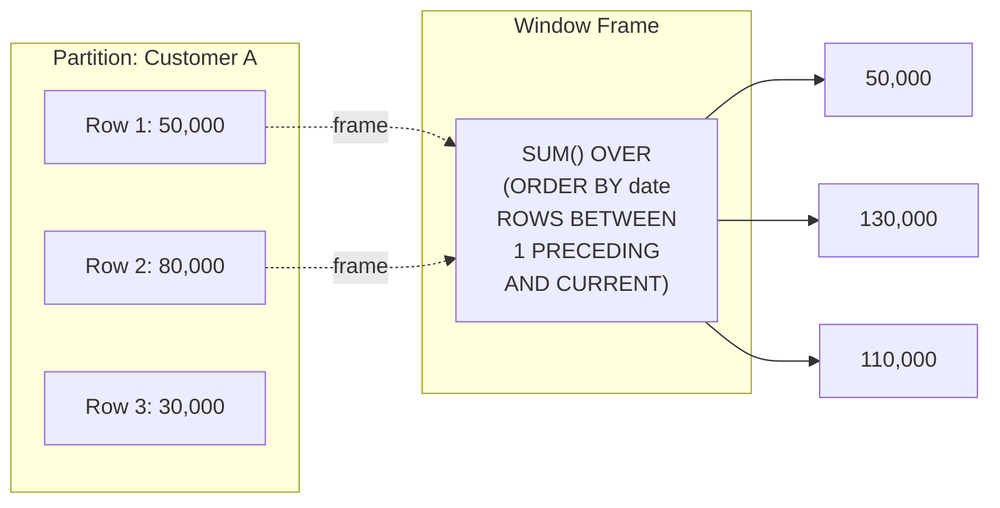
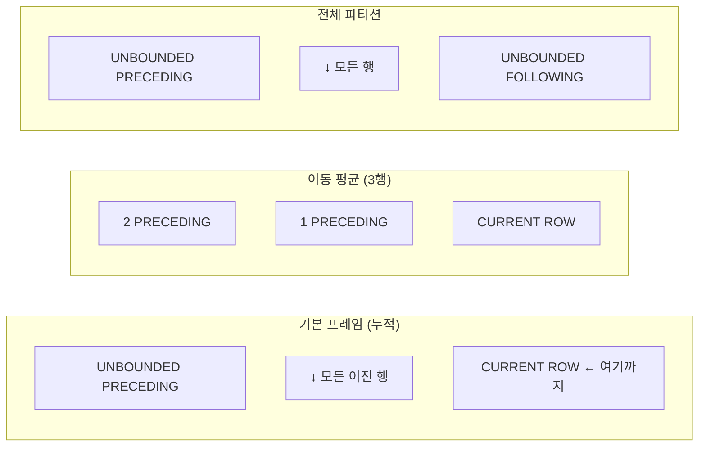

# 18강: 윈도우 함수

윈도우 함수는 `GROUP BY`처럼 결과를 하나로 합치지 않으면서, 현재 행과 연관된 행들을 대상으로 계산을 수행합니다. 각 행은 고유한 정체성을 유지하면서 집계나 순위 정보에 접근할 수 있습니다.

구문: `function() OVER (PARTITION BY ... ORDER BY ...)`



> 윈도우 함수는 행을 그룹화하지 않고, 각 행에서 주변 행들을 참조하여 계산합니다. 결과 행 수가 줄어들지 않습니다.

{ .off-glb width="520"  }

### 윈도우 프레임 종류

`ROWS BETWEEN` 절로 윈도우의 범위를 지정합니다. 프레임에 따라 계산 결과가 달라집니다.



| 프레임 | 용도 | 예시 |
|--------|------|------|
| `ROWS BETWEEN UNBOUNDED PRECEDING AND CURRENT ROW` | 누적 합계 (기본값) | 일별 누적 매출 |
| `ROWS BETWEEN 2 PRECEDING AND CURRENT ROW` | 이동 평균 | 3개월 이동 평균 |
| `ROWS BETWEEN UNBOUNDED PRECEDING AND UNBOUNDED FOLLOWING` | 전체 파티션 | LAST_VALUE에 필수 |

## ROW_NUMBER, RANK, DENSE_RANK

순위 함수는 파티션 내에서 각 행에 순위를 부여합니다.

| 함수 | 동점 처리 | 순위 건너뜀 |
|----------|------|-----------------|
| `ROW_NUMBER()` | 임의로 순위 부여 | — |
| `RANK()` | 같은 순위 | 있음 (1,1,3) |
| `DENSE_RANK()` | 같은 순위 | 없음 (1,1,2) |

```sql
-- 카테고리별 가격 기준으로 상품 순위 매기기
SELECT
    cat.name            AS category,
    p.name              AS product_name,
    p.price,
    RANK() OVER (
        PARTITION BY p.category_id
        ORDER BY p.price DESC
    ) AS price_rank
FROM products AS p
INNER JOIN categories AS cat ON p.category_id = cat.id
WHERE p.is_active = 1
ORDER BY cat.name, price_rank
LIMIT 12;
```

**결과:**

| category | product_name | price | price_rank |
| ---------- | ---------- | ----------: | ----------: |
| 2in1 | 레노버 IdeaPad Flex 5 화이트 | 2914000.0 | 1 |
| 2in1 | 레노버 ThinkPad X1 2in1 화이트 | 2579700.0 | 2 |
| 2in1 | HP Pavilion x360 14 블랙 | 2461600.0 | 3 |
| 2in1 | 삼성 갤럭시북4 360 | 2354000.0 | 4 |
| 2in1 | 레노버 ThinkPad X1 2in1 실버 | 2233200.0 | 5 |
| 2in1 | 레노버 IdeaPad Flex 5 화이트 | 2171700.0 | 6 |
| 2in1 | 레노버 Yoga 9i 실버 | 2161400.0 | 7 |
| 2in1 | 삼성 갤럭시북5 360 블랙 | 2111000.0 | 8 |
| ... | ... | ... | ... |

## 그룹별 상위 N개 (Top-N per Group)

순위가 매겨진 쿼리를 CTE나 서브쿼리로 감싸면 파티션별 상위 N개를 추출할 수 있습니다.

```sql
-- 카테고리별 판매량 기준 상위 3개 상품 (판매 수량 기준)
WITH ranked_sales AS (
    SELECT
        cat.name                        AS category,
        p.name                          AS product_name,
        SUM(oi.quantity)                AS units_sold,
        RANK() OVER (
            PARTITION BY p.category_id
            ORDER BY SUM(oi.quantity) DESC
        ) AS sales_rank
    FROM order_items AS oi
    INNER JOIN products   AS p   ON oi.product_id = p.id
    INNER JOIN categories AS cat ON p.category_id = cat.id
    INNER JOIN orders     AS o   ON oi.order_id   = o.id
    WHERE o.status IN ('delivered', 'confirmed')
    GROUP BY p.category_id, p.id, p.name, cat.name
)
SELECT category, product_name, units_sold, sales_rank
FROM ranked_sales
WHERE sales_rank <= 3
ORDER BY category, sales_rank;
```

## SUM OVER — 누적 합계(Running Totals)

`SUM() OVER (ORDER BY ...)`는 누적 합계를 계산합니다.

```sql
-- 2024년 월별 누적 매출
SELECT
    SUBSTR(ordered_at, 1, 7) AS year_month,
    SUM(total_amount)        AS monthly_revenue,
    SUM(SUM(total_amount)) OVER (
        ORDER BY SUBSTR(ordered_at, 1, 7)
    ) AS cumulative_revenue
FROM orders
WHERE ordered_at LIKE '2024%'
  AND status NOT IN ('cancelled', 'returned')
GROUP BY SUBSTR(ordered_at, 1, 7)
ORDER BY year_month;
```

**결과:**

| year_month | monthly_revenue | cumulative_revenue |
| ---------- | ----------: | ----------: |
| 2024-01 | 3807789761.0 | 3807789761.0 |
| 2024-02 | 4701108852.0 | 8508898613.0 |
| 2024-03 | 4935663129.0 | 13444561742.0 |
| 2024-04 | 4954492231.0 | 18399053973.0 |
| 2024-05 | 4912114419.0 | 23311168392.0 |
| 2024-06 | 3853868900.0 | 27165037292.0 |
| 2024-07 | 4453107092.0 | 31618144384.0 |
| 2024-08 | 4903583071.0 | 36521727455.0 |
| ... | ... | ... |

## LAG와 LEAD — 인접 행 참조

`LAG(col, n)`은 `n`개 이전 행을, `LEAD(col, n)`은 `n`개 이후 행을 참조합니다. 참조 행이 없을 때 사용할 기본값도 지정할 수 있습니다.

```sql
-- 2024년 월별 매출 전월 대비 증감률(MoM)
SELECT
    year_month,
    monthly_revenue,
    LAG(monthly_revenue) OVER (ORDER BY year_month) AS prev_month_revenue,
    ROUND(
        100.0 * (monthly_revenue - LAG(monthly_revenue) OVER (ORDER BY year_month))
              / LAG(monthly_revenue) OVER (ORDER BY year_month),
        1
    ) AS mom_growth_pct
FROM (
    SELECT
        SUBSTR(ordered_at, 1, 7) AS year_month,
        SUM(total_amount)        AS monthly_revenue
    FROM orders
    WHERE ordered_at LIKE '2024%'
      AND status NOT IN ('cancelled', 'returned')
    GROUP BY SUBSTR(ordered_at, 1, 7)
) AS monthly
ORDER BY year_month;
```

**결과:**

| year_month | monthly_revenue | prev_month_revenue | mom_growth_pct |
| ---------- | ----------: | ---------- | ---------- |
| 2024-01 | 3807789761.0 | (NULL) | (NULL) |
| 2024-02 | 4701108852.0 | 3807789761.0 | 23.5 |
| 2024-03 | 4935663129.0 | 4701108852.0 | 5.0 |
| 2024-04 | 4954492231.0 | 4935663129.0 | 0.4 |
| 2024-05 | 4912114419.0 | 4954492231.0 | -0.9 |
| 2024-06 | 3853868900.0 | 4912114419.0 | -21.5 |
| 2024-07 | 4453107092.0 | 3853868900.0 | 15.5 |
| 2024-08 | 4903583071.0 | 4453107092.0 | 10.1 |
| ... | ... | ... | ... |

## PARTITION BY와 LEAD 함께 사용하기

=== "SQLite"
    ```sql
    -- VIP 고객별 주문 목록과 다음 주문까지의 일수
    SELECT
        c.name          AS customer_name,
        o.order_number,
        o.ordered_at,
        LEAD(o.ordered_at) OVER (
            PARTITION BY o.customer_id
            ORDER BY o.ordered_at
        ) AS next_order_date,
        ROUND(
            julianday(
                LEAD(o.ordered_at) OVER (PARTITION BY o.customer_id ORDER BY o.ordered_at)
            ) - julianday(o.ordered_at),
            0
        ) AS days_to_next_order
    FROM orders AS o
    INNER JOIN customers AS c ON o.customer_id = c.id
    WHERE c.grade = 'VIP'
    ORDER BY c.name, o.ordered_at
    LIMIT 10;
    ```

=== "MySQL"
    ```sql
    -- VIP 고객별 주문 목록과 다음 주문까지의 일수
    SELECT
        c.name          AS customer_name,
        o.order_number,
        o.ordered_at,
        LEAD(o.ordered_at) OVER (
            PARTITION BY o.customer_id
            ORDER BY o.ordered_at
        ) AS next_order_date,
        DATEDIFF(
            LEAD(o.ordered_at) OVER (PARTITION BY o.customer_id ORDER BY o.ordered_at),
            o.ordered_at
        ) AS days_to_next_order
    FROM orders AS o
    INNER JOIN customers AS c ON o.customer_id = c.id
    WHERE c.grade = 'VIP'
    ORDER BY c.name, o.ordered_at
    LIMIT 10;
    ```

=== "PostgreSQL"
    ```sql
    -- VIP 고객별 주문 목록과 다음 주문까지의 일수
    SELECT
        c.name          AS customer_name,
        o.order_number,
        o.ordered_at,
        LEAD(o.ordered_at) OVER (
            PARTITION BY o.customer_id
            ORDER BY o.ordered_at
        ) AS next_order_date,
        LEAD(o.ordered_at) OVER (PARTITION BY o.customer_id ORDER BY o.ordered_at)::date
            - o.ordered_at::date
            AS days_to_next_order
    FROM orders AS o
    INNER JOIN customers AS c ON o.customer_id = c.id
    WHERE c.grade = 'VIP'
    ORDER BY c.name, o.ordered_at
    LIMIT 10;
    ```

## 윈도우 함수 추가 활용

### 포인트 잔액 검증 (SUM OVER)

`point_transactions`의 `balance_after`가 올바른지 `SUM() OVER()`로 검증합니다.

```sql
SELECT
    id,
    customer_id,
    type,
    reason,
    amount,
    balance_after,
    SUM(amount) OVER (
        PARTITION BY customer_id
        ORDER BY created_at, id
    ) AS calculated_balance,
    balance_after - SUM(amount) OVER (
        PARTITION BY customer_id
        ORDER BY created_at, id
    ) AS difference
FROM point_transactions
WHERE customer_id = 42
ORDER BY created_at, id;
```

### 등급 변동 추적 (LAG)

`customer_grade_history`에서 이전 등급과 현재 등급의 변화를 추적합니다.

```sql
SELECT
    customer_id,
    changed_at,
    old_grade,
    new_grade,
    reason,
    LAG(new_grade) OVER (
        PARTITION BY customer_id ORDER BY changed_at
    ) AS previous_record_grade,
    LEAD(changed_at) OVER (
        PARTITION BY customer_id ORDER BY changed_at
    ) AS next_change_date
FROM customer_grade_history
WHERE customer_id = 42
ORDER BY changed_at;
```

## FIRST_VALUE와 LAST_VALUE — 파티션의 처음/마지막 값

`FIRST_VALUE(col)`은 윈도우 프레임의 첫 번째 행에서 값을 가져오고, `LAST_VALUE(col)`은 마지막 행에서 값을 가져옵니다.

| 함수 | 설명 |
|------|------|
| `FIRST_VALUE(col) OVER (PARTITION BY ... ORDER BY ...)` | 프레임의 첫 번째 행 값 |
| `LAST_VALUE(col) OVER (... ROWS BETWEEN UNBOUNDED PRECEDING AND UNBOUNDED FOLLOWING)` | 프레임의 마지막 행 값 |

!!! warning "LAST_VALUE의 프레임 함정"
    윈도우 함수의 기본 프레임은 `ROWS BETWEEN UNBOUNDED PRECEDING AND CURRENT ROW`입니다. 이 기본 프레임에서 `LAST_VALUE`는 항상 **현재 행**의 값을 반환하므로, 파티션의 진짜 마지막 값을 얻으려면 반드시 `ROWS BETWEEN UNBOUNDED PRECEDING AND UNBOUNDED FOLLOWING`을 명시해야 합니다.

```sql
-- 카테고리별로 가장 저렴한 상품명(FIRST_VALUE)과
-- 가장 비싼 상품명(LAST_VALUE) 함께 표시
SELECT
    cat.name  AS category,
    p.name    AS product_name,
    p.price,
    FIRST_VALUE(p.name) OVER (
        PARTITION BY p.category_id
        ORDER BY p.price
    ) AS cheapest_product,
    LAST_VALUE(p.name) OVER (
        PARTITION BY p.category_id
        ORDER BY p.price
        ROWS BETWEEN UNBOUNDED PRECEDING AND UNBOUNDED FOLLOWING
    ) AS most_expensive_product
FROM products AS p
INNER JOIN categories AS cat ON p.category_id = cat.id
WHERE p.is_active = 1
ORDER BY cat.name, p.price
LIMIT 12;
```

`FIRST_VALUE`는 `ORDER BY p.price` 기본 프레임에서도 항상 파티션의 첫 행(가장 저렴한 상품)을 반환합니다. 반면 `LAST_VALUE`는 `ROWS BETWEEN UNBOUNDED PRECEDING AND UNBOUNDED FOLLOWING`을 지정하지 않으면 현재 행 자신의 값을 반환하므로 주의하세요.

## 정리

| 함수 / 구문 | 용도 |
|-------------|------|
| `ROW_NUMBER()` | 파티션 내 고유 순번 |
| `RANK()` / `DENSE_RANK()` | 동점 허용 순위 (건너뜀 여부 차이) |
| `SUM() OVER (ORDER BY ...)` | 누적 합계 |
| `LAG(col, n)` / `LEAD(col, n)` | 이전/이후 행 참조 |
| `NTILE(n)` | n개 균등 분할 |
| `FIRST_VALUE(col)` | 프레임 첫 번째 행 값 |
| `LAST_VALUE(col)` | 프레임 마지막 행 값 (프레임 지정 필수) |
| `ROWS BETWEEN ... AND ...` | 윈도우 프레임 범위 지정 |

!!! note "레슨 복습 문제"
    이 레슨에서 배운 개념을 바로 확인하는 간단한 문제입니다. 여러 개념을 종합하는 실전 연습은 [연습 문제](../exercises/index.md) 섹션을 참고하세요.

## 연습 문제

### 연습 1
`DENSE_RANK()`를 사용하여 활성 상품 전체를 `price` 기준 내림차순으로 순위를 매기세요. `product_name`, `price`, `overall_rank`를 반환하고 상위 10개를 보여주세요.

??? success "정답"
    ```sql
    SELECT
        name    AS product_name,
        price,
        DENSE_RANK() OVER (ORDER BY price DESC) AS overall_rank
    FROM products
    WHERE is_active = 1
    ORDER BY overall_rank
    LIMIT 10;
    ```

        **결과 (예시):**

        | product_name | price | overall_rank |
        | ---------- | ----------: | ----------: |
        | Razer Blade 14 블랙 | 7495200.0 | 1 |
        | Razer Blade 16 블랙 | 5634900.0 | 2 |
        | Razer Blade 16 | 5518300.0 | 3 |
        | Razer Blade 18 | 5450500.0 | 4 |
        | Razer Blade 14 | 5339100.0 | 5 |
        | Razer Blade 16 실버 | 5127500.0 | 6 |
        | Razer Blade 18 화이트 | 4913500.0 | 7 |
        | MSI GeForce RTX 5070 Ti VENTUS 3X 실버 | 4881500.0 | 8 |
        | ... | ... | ... |


### 연습 2
연도별 신규 고객 가입 수의 누적 합계를 계산하세요 (쇼핑몰 개업부터 각 연도까지의 누적 고객 수). `year`, `new_signups`, `cumulative_customers`를 반환하세요.

??? success "정답"
    ```sql
    SELECT
        year,
        new_signups,
        SUM(new_signups) OVER (ORDER BY year) AS cumulative_customers
    FROM (
        SELECT
            SUBSTR(created_at, 1, 4) AS year,
            COUNT(*)                 AS new_signups
        FROM customers
        GROUP BY SUBSTR(created_at, 1, 4)
    ) AS yearly
    ORDER BY year;
    ```

        **결과 (예시):**

        | year | new_signups | cumulative_customers |
        | ---------- | ----------: | ----------: |
        | 2016 | 1000 | 1000 |
        | 2017 | 1800 | 2800 |
        | 2018 | 3000 | 5800 |
        | 2019 | 4500 | 10300 |
        | 2020 | 7000 | 17300 |
        | 2021 | 8000 | 25300 |
        | 2022 | 6500 | 31800 |
        | 2023 | 6000 | 37800 |
        | ... | ... | ... |


### 연습 3
2023년과 2024년의 각 월별로 전년 동월 대비 매출 증감률(YoY)을 계산하세요. `LAG(revenue, 12)`를 사용하여 전년 동월과 비교합니다. `year_month`, `revenue`, `same_month_last_year`, `yoy_growth_pct`를 반환하세요.

??? success "정답"
    ```sql
    SELECT
        year_month,
        revenue,
        LAG(revenue, 12) OVER (ORDER BY year_month) AS same_month_last_year,
        ROUND(
            100.0 * (revenue - LAG(revenue, 12) OVER (ORDER BY year_month))
                  / LAG(revenue, 12) OVER (ORDER BY year_month),
            1
        ) AS yoy_growth_pct
    FROM (
        SELECT
            SUBSTR(ordered_at, 1, 7) AS year_month,
            SUM(total_amount)        AS revenue
        FROM orders
        WHERE status NOT IN ('cancelled', 'returned')
          AND ordered_at BETWEEN '2022-01-01' AND '2024-12-31 23:59:59'
        GROUP BY SUBSTR(ordered_at, 1, 7)
    ) AS monthly
    WHERE year_month >= '2023-01'
    ORDER BY year_month;
    ```

        **결과 (예시):**

        | year_month | revenue | same_month_last_year | yoy_growth_pct |
        | ---------- | ----------: | ---------- | ---------- |
        | 2023-01 | 3271703186.0 | (NULL) | (NULL) |
        | 2023-02 | 3915639006.0 | (NULL) | (NULL) |
        | 2023-03 | 4939077954.0 | (NULL) | (NULL) |
        | 2023-04 | 4797530375.0 | (NULL) | (NULL) |
        | 2023-05 | 4115530865.0 | (NULL) | (NULL) |
        | 2023-06 | 3520005441.0 | (NULL) | (NULL) |
        | 2023-07 | 3257340549.0 | (NULL) | (NULL) |
        | 2023-08 | 4354477595.0 | (NULL) | (NULL) |
        | ... | ... | ... | ... |


### 연습 4
`ROW_NUMBER()`를 사용하여 각 고객의 주문에 순번을 매기고, 첫 번째 주문만 추출하세요. `customer_id`, `name`, `order_number`, `ordered_at`, `total_amount`를 반환하세요.

??? success "정답"
    ```sql
    SELECT
        customer_id,
        name,
        order_number,
        ordered_at,
        total_amount
    FROM (
        SELECT
            c.id        AS customer_id,
            c.name,
            o.order_number,
            o.ordered_at,
            o.total_amount,
            ROW_NUMBER() OVER (
                PARTITION BY o.customer_id
                ORDER BY o.ordered_at
            ) AS rn
        FROM orders AS o
        INNER JOIN customers AS c ON o.customer_id = c.id
        WHERE o.status NOT IN ('cancelled', 'returned')
    ) AS numbered
    WHERE rn = 1
    ORDER BY ordered_at
    LIMIT 15;
    ```

        **결과 (예시):**

        | customer_id | name | order_number | ordered_at | total_amount |
        | ----------: | ---------- | ---------- | ---------- | ----------: |
        | 903 | 김상철 | ORD-20160102-00026 | 2016-01-02 13:54:14 | 56400.0 |
        | 752 | 김정순 | ORD-20160103-00063 | 2016-01-03 12:47:28 | 487900.0 |
        | 840 | 문영숙 | ORD-20160101-00013 | 2016-01-03 12:48:53 | 49900.0 |
        | 690 | 장승현 | ORD-20160103-00059 | 2016-01-03 21:05:14 | 56400.0 |
        | 978 | 김현준 | ORD-20160102-00035 | 2016-01-05 17:54:32 | 194700.0 |
        | 226 | 박정수 | ORD-20160105-00088 | 2016-01-05 19:40:04 | 2230100.0 |
        | 90 | 유현지 | ORD-20160101-00017 | 2016-01-06 03:02:29 | 54500.0 |
        | 881 | 김도현 | ORD-20160107-00143 | 2016-01-07 07:31:04 | 91300.0 |
        | ... | ... | ... | ... | ... |


### 연습 5
`RANK()`와 `DENSE_RANK()`를 함께 사용하여 카테고리별 상품 가격 순위를 매기세요. `category_name`, `product_name`, `price`, `rank`, `dense_rank`를 반환하고 상위 15개를 보여주세요. 두 순위 함수의 차이를 결과에서 확인할 수 있습니다.

??? success "정답"
    ```sql
    SELECT
        cat.name AS category_name,
        p.name   AS product_name,
        p.price,
        RANK()       OVER (PARTITION BY p.category_id ORDER BY p.price DESC) AS rank,
        DENSE_RANK() OVER (PARTITION BY p.category_id ORDER BY p.price DESC) AS dense_rank
    FROM products AS p
    INNER JOIN categories AS cat ON p.category_id = cat.id
    WHERE p.is_active = 1
    ORDER BY cat.name, rank
    LIMIT 15;
    ```

        **결과 (예시):**

        | category_name | product_name | price | rank | dense_rank |
        | ---------- | ---------- | ----------: | ----------: | ----------: |
        | 2in1 | 레노버 IdeaPad Flex 5 화이트 | 2914000.0 | 1 | 1 |
        | 2in1 | 레노버 ThinkPad X1 2in1 화이트 | 2579700.0 | 2 | 2 |
        | 2in1 | HP Pavilion x360 14 블랙 | 2461600.0 | 3 | 3 |
        | 2in1 | 삼성 갤럭시북4 360 | 2354000.0 | 4 | 4 |
        | 2in1 | 레노버 ThinkPad X1 2in1 실버 | 2233200.0 | 5 | 5 |
        | 2in1 | 레노버 IdeaPad Flex 5 화이트 | 2171700.0 | 6 | 6 |
        | 2in1 | 레노버 Yoga 9i 실버 | 2161400.0 | 7 | 7 |
        | 2in1 | 삼성 갤럭시북5 360 블랙 | 2111000.0 | 8 | 8 |
        | ... | ... | ... | ... | ... |


### 연습 6
2024년 월별 매출의 3개월 이동 평균을 계산하세요. `ROWS BETWEEN 2 PRECEDING AND CURRENT ROW` 프레임을 사용합니다. `year_month`, `monthly_revenue`, `moving_avg_3m`을 반환하세요.

??? success "정답"
    ```sql
    SELECT
        year_month,
        monthly_revenue,
        ROUND(
            AVG(monthly_revenue) OVER (
                ORDER BY year_month
                ROWS BETWEEN 2 PRECEDING AND CURRENT ROW
            ), 2
        ) AS moving_avg_3m
    FROM (
        SELECT
            SUBSTR(ordered_at, 1, 7) AS year_month,
            SUM(total_amount)        AS monthly_revenue
        FROM orders
        WHERE ordered_at LIKE '2024%'
          AND status NOT IN ('cancelled', 'returned')
        GROUP BY SUBSTR(ordered_at, 1, 7)
    ) AS monthly
    ORDER BY year_month;
    ```

        **결과 (예시):**

        | year_month | monthly_revenue | moving_avg_3m |
        | ---------- | ----------: | ----------: |
        | 2024-01 | 3807789761.0 | 3807789761.0 |
        | 2024-02 | 4701108852.0 | 4254449306.5 |
        | 2024-03 | 4935663129.0 | 4481520580.67 |
        | 2024-04 | 4954492231.0 | 4863754737.33 |
        | 2024-05 | 4912114419.0 | 4934089926.33 |
        | 2024-06 | 3853868900.0 | 4573491850.0 |
        | 2024-07 | 4453107092.0 | 4406363470.33 |
        | 2024-08 | 4903583071.0 | 4403519687.67 |
        | ... | ... | ... |


### 연습 7
`NTILE(4)`를 사용하여 고객을 총 구매 금액 기준으로 4개 분위(quartile)로 나누세요. `name`, `grade`, `total_spent`, `quartile`을 반환하고 `quartile`과 `total_spent` 내림차순으로 정렬하세요. 상위 20개를 보여주세요.

??? success "정답"
    ```sql
    SELECT
        name,
        grade,
        total_spent,
        quartile
    FROM (
        SELECT
            c.name,
            c.grade,
            SUM(o.total_amount) AS total_spent,
            NTILE(4) OVER (ORDER BY SUM(o.total_amount) DESC) AS quartile
        FROM customers AS c
        INNER JOIN orders AS o ON c.id = o.customer_id
        WHERE o.status NOT IN ('cancelled', 'returned')
        GROUP BY c.id, c.name, c.grade
    ) AS ranked
    ORDER BY quartile, total_spent DESC
    LIMIT 20;
    ```

        **결과 (예시):**

        | name | grade | total_spent | quartile |
        | ---------- | ---------- | ----------: | ----------: |
        | 박정수 | VIP | 671056103.0 | 1 |
        | 정유진 | VIP | 646834022.0 | 1 |
        | 이미정 | VIP | 633645694.0 | 1 |
        | 김상철 | VIP | 565735423.0 | 1 |
        | 문영숙 | VIP | 523138846.0 | 1 |
        | 이영자 | VIP | 520594776.0 | 1 |
        | 이미정 | VIP | 497376276.0 | 1 |
        | 장영숙 | VIP | 487964896.0 | 1 |
        | ... | ... | ... | ... |


### 연습 8
각 상품별로 주문 시점 기준 누적 판매 수량을 계산하세요. `product_name`, `ordered_at`, `quantity`, `cumulative_qty`를 반환하세요. 특정 상품 하나(id = 1)에 대해 조회하세요.

??? success "정답"
    ```sql
    SELECT
        p.name       AS product_name,
        o.ordered_at,
        oi.quantity,
        SUM(oi.quantity) OVER (
            ORDER BY o.ordered_at, o.id
            ROWS BETWEEN UNBOUNDED PRECEDING AND CURRENT ROW
        ) AS cumulative_qty
    FROM order_items AS oi
    INNER JOIN orders   AS o ON oi.order_id   = o.id
    INNER JOIN products AS p ON oi.product_id = p.id
    WHERE oi.product_id = 1
      AND o.status NOT IN ('cancelled', 'returned')
    ORDER BY o.ordered_at;
    ```

        **결과 (예시):**

        | product_name | ordered_at | quantity | cumulative_qty |
        | ---------- | ---------- | ----------: | ----------: |
        | Razer Blade 18 블랙 | 2016-11-09 11:59:05 | 1 | 1 |
        | Razer Blade 18 블랙 | 2016-11-16 21:26:24 | 1 | 2 |
        | Razer Blade 18 블랙 | 2016-11-29 21:30:03 | 1 | 3 |
        | Razer Blade 18 블랙 | 2016-12-02 13:40:50 | 1 | 4 |
        | Razer Blade 18 블랙 | 2016-12-13 15:38:56 | 1 | 5 |
        | Razer Blade 18 블랙 | 2016-12-14 20:37:12 | 1 | 6 |
        | Razer Blade 18 블랙 | 2016-12-15 10:52:01 | 1 | 7 |
        | Razer Blade 18 블랙 | 2016-12-16 20:05:41 | 1 | 8 |
        | ... | ... | ... | ... |


### 연습 9
부서별로 직원 급여(hire 순서 기준) 누적 합계와 부서 평균 대비 차이를 함께 표시하세요. `department`, `name`, `role`, `hired_at`, `running_headcount`, `dept_avg_headcount`를 반환하세요. `running_headcount`는 `COUNT(*) OVER`로, `dept_avg_headcount`는 `COUNT(*) OVER (PARTITION BY department)`으로 구합니다.

??? success "정답"
    ```sql
    SELECT
        department,
        name,
        role,
        hired_at,
        COUNT(*) OVER (
            PARTITION BY department
            ORDER BY hired_at
            ROWS BETWEEN UNBOUNDED PRECEDING AND CURRENT ROW
        ) AS running_headcount,
        COUNT(*) OVER (
            PARTITION BY department
        ) AS dept_total_headcount
    FROM staff
    WHERE is_active = 1
    ORDER BY department, hired_at;
    ```

        **결과 (예시):**

        | department | name | role | hired_at | running_headcount | dept_total_headcount |
        | ---------- | ---------- | ---------- | ---------- | ----------: | ----------: |
        | CS | 김옥자 | staff | 2017-06-11 | 1 | 3 |
        | CS | 이현준 | staff | 2022-05-17 | 2 | 3 |
        | CS | 이순자 | staff | 2023-03-12 | 3 | 3 |
        | 개발 | 김영일 | manager | 2020-05-03 | 1 | 2 |
        | 개발 | 김현주 | staff | 2024-09-04 | 2 | 2 |
        | 경영 | 한민재 | admin | 2016-05-23 | 1 | 11 |
        | 경영 | 심정식 | staff | 2017-04-20 | 2 | 11 |
        | 경영 | 장주원 | admin | 2017-08-20 | 3 | 11 |
        | ... | ... | ... | ... | ... | ... |


### 연습 10
각 고객의 주문 간 간격(일)을 계산하고, 고객별 평균 주문 간격을 구하세요. `LAG`로 이전 주문일을 참조합니다. `customer_id`, `name`, `order_count`, `avg_days_between_orders`를 반환하세요.

??? success "정답"
    === "SQLite"
        ```sql
        SELECT
            customer_id,
            name,
            order_count,
            ROUND(AVG(days_gap), 1) AS avg_days_between_orders
        FROM (
            SELECT
                c.id   AS customer_id,
                c.name,
                COUNT(*) OVER (PARTITION BY o.customer_id) AS order_count,
                ROUND(
                    julianday(o.ordered_at)
                    - julianday(LAG(o.ordered_at) OVER (
                          PARTITION BY o.customer_id ORDER BY o.ordered_at
                      )),
                    0
                ) AS days_gap
            FROM orders AS o
            INNER JOIN customers AS c ON o.customer_id = c.id
            WHERE o.status NOT IN ('cancelled', 'returned')
        ) AS gaps
        WHERE days_gap IS NOT NULL
        GROUP BY customer_id, name, order_count
        HAVING order_count >= 5
        ORDER BY avg_days_between_orders
        LIMIT 15;
        ```

        **결과 (예시):**

        | customer_id | name | order_count | avg_days_between_orders |
        | ----------: | ---------- | ----------: | ----------: |
        | 47099 | 강현준 | 5 | 5.3 |
        | 49904 | 류은주 | 5 | 5.3 |
        | 226 | 박정수 | 661 | 5.5 |
        | 48065 | 조경수 | 6 | 5.8 |
        | 356 | 정유진 | 544 | 6.5 |
        | 1000 | 이미정 | 530 | 6.6 |
        | 840 | 문영숙 | 546 | 6.7 |
        | 51259 | 박정희 | 9 | 6.8 |
        | ... | ... | ... | ... |


    === "MySQL"
        ```sql
        SELECT
            customer_id,
            name,
            order_count,
            ROUND(AVG(days_gap), 1) AS avg_days_between_orders
        FROM (
            SELECT
                c.id   AS customer_id,
                c.name,
                COUNT(*) OVER (PARTITION BY o.customer_id) AS order_count,
                DATEDIFF(
                    o.ordered_at,
                    LAG(o.ordered_at) OVER (
                        PARTITION BY o.customer_id ORDER BY o.ordered_at
                    )
                ) AS days_gap
            FROM orders AS o
            INNER JOIN customers AS c ON o.customer_id = c.id
            WHERE o.status NOT IN ('cancelled', 'returned')
        ) AS gaps
        WHERE days_gap IS NOT NULL
        GROUP BY customer_id, name, order_count
        HAVING order_count >= 5
        ORDER BY avg_days_between_orders
        LIMIT 15;
        ```

    === "PostgreSQL"
        ```sql
        SELECT
            customer_id,
            name,
            order_count,
            ROUND(AVG(days_gap), 1) AS avg_days_between_orders
        FROM (
            SELECT
                c.id   AS customer_id,
                c.name,
                COUNT(*) OVER (PARTITION BY o.customer_id) AS order_count,
                o.ordered_at::date
                    - (LAG(o.ordered_at) OVER (
                           PARTITION BY o.customer_id ORDER BY o.ordered_at
                       ))::date
                    AS days_gap
            FROM orders AS o
            INNER JOIN customers AS c ON o.customer_id = c.id
            WHERE o.status NOT IN ('cancelled', 'returned')
        ) AS gaps
        WHERE days_gap IS NOT NULL
        GROUP BY customer_id, name, order_count
        HAVING order_count >= 5
        ORDER BY avg_days_between_orders
        LIMIT 15;
        ```

### 연습 11
카테고리별로 각 상품의 이름, 가격, 해당 카테고리에서 가장 저렴한 상품명(`cheapest_in_category`)과 가장 비싼 상품명(`priciest_in_category`)을 함께 표시하세요. `FIRST_VALUE`와 `LAST_VALUE`를 사용하며, 활성 상품만 대상으로 합니다. `category`, `product_name`, `price`, `cheapest_in_category`, `priciest_in_category`를 반환하고 상위 15개를 보여주세요.

??? success "정답"
    ```sql
    SELECT
        cat.name  AS category,
        p.name    AS product_name,
        p.price,
        FIRST_VALUE(p.name) OVER (
            PARTITION BY p.category_id
            ORDER BY p.price
            ROWS BETWEEN UNBOUNDED PRECEDING AND UNBOUNDED FOLLOWING
        ) AS cheapest_in_category,
        LAST_VALUE(p.name) OVER (
            PARTITION BY p.category_id
            ORDER BY p.price
            ROWS BETWEEN UNBOUNDED PRECEDING AND UNBOUNDED FOLLOWING
        ) AS priciest_in_category
    FROM products AS p
    INNER JOIN categories AS cat ON p.category_id = cat.id
    WHERE p.is_active = 1
    ORDER BY cat.name, p.price
    LIMIT 15;
    ```

        **결과 (예시):**

        | category | product_name | price | cheapest_in_category | priciest_in_category |
        | ---------- | ---------- | ----------: | ---------- | ---------- |
        | 2in1 | HP Pavilion x360 14 | 720800.0 | HP Pavilion x360 14 | 레노버 IdeaPad Flex 5 화이트 |
        | 2in1 | HP Spectre x360 14 블랙 | 721300.0 | HP Pavilion x360 14 | 레노버 IdeaPad Flex 5 화이트 |
        | 2in1 | HP Spectre x360 14 블랙 | 846500.0 | HP Pavilion x360 14 | 레노버 IdeaPad Flex 5 화이트 |
        | 2in1 | HP Envy x360 15 실버 | 883400.0 | HP Pavilion x360 14 | 레노버 IdeaPad Flex 5 화이트 |
        | 2in1 | HP Envy x360 15 | 905200.0 | HP Pavilion x360 14 | 레노버 IdeaPad Flex 5 화이트 |
        | 2in1 | HP Pavilion x360 14 블랙 | 911700.0 | HP Pavilion x360 14 | 레노버 IdeaPad Flex 5 화이트 |
        | 2in1 | 레노버 IdeaPad Flex 5 | 937600.0 | HP Pavilion x360 14 | 레노버 IdeaPad Flex 5 화이트 |
        | 2in1 | HP Pavilion x360 14 실버 | 991200.0 | HP Pavilion x360 14 | 레노버 IdeaPad Flex 5 화이트 |
        | ... | ... | ... | ... | ... |


### 채점 가이드

| 점수 | 다음 단계 |
|:----:|----------|
| **10~11개** | [19강: CTE](19-cte.md)로 이동 |
| **8~9개** | 틀린 문제 해설을 복습한 뒤 다음 강의로 |
| **절반 이하** | 이 강의를 다시 읽어보세요 |
| **3개 이하** | [17강: 트랜잭션](../intermediate/17-transactions.md)부터 다시 시작하세요 |

**문제별 영역:**

| 영역 | 해당 문제 |
|------|:--------:|
| DENSE_RANK / RANK | 1, 5 |
| 누적 합계 (SUM OVER) | 2, 8 |
| YoY 성장률 (LAG) | 3, 10 |
| ROW_NUMBER + PARTITION | 4 |
| 이동 평균 (ROWS BETWEEN) | 6 |
| NTILE (분위) | 7 |
| 누적 집계 + 부서별 | 9 |
| FIRST_VALUE / LAST_VALUE | 11 |

---
다음: [19강: 공통 테이블 식(WITH)](19-cte.md)
