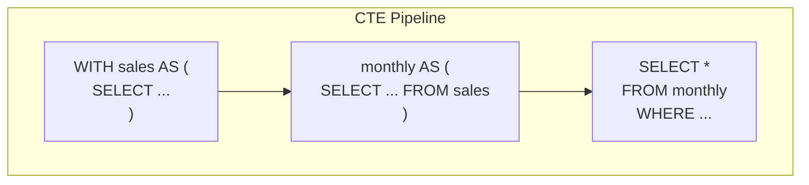
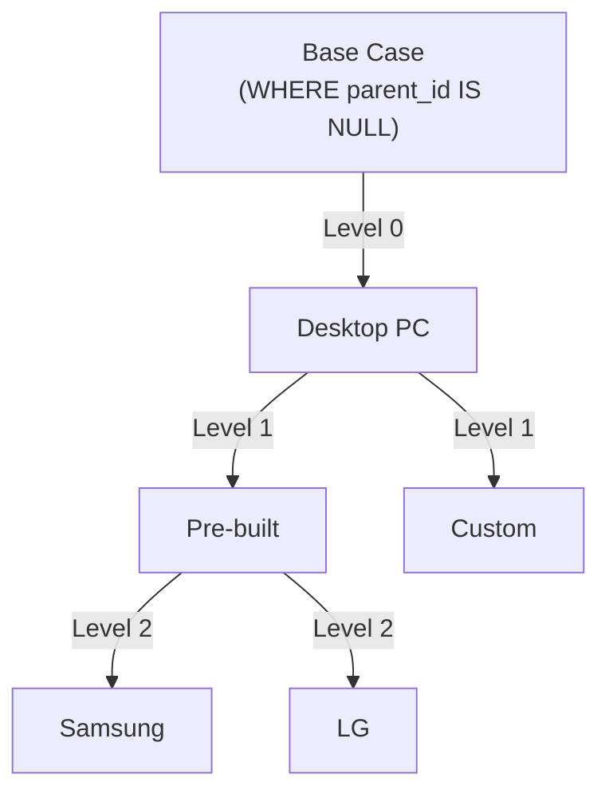
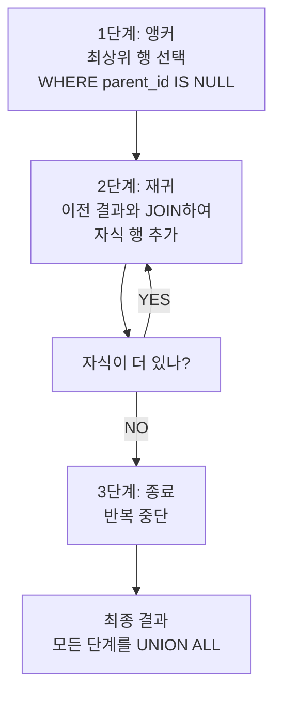

# 19강: CTE와 재귀 CTE

공통 테이블 식(CTE)은 메인 쿼리 앞에 `WITH` 키워드로 정의하는, 이름이 붙은 임시 결과 집합입니다. CTE를 사용하면 복잡한 쿼리를 훨씬 읽기 쉽고 디버깅하기 좋게 만들 수 있습니다. 각 CTE는 여러 번 참조할 수 있는 이름 있는 서브쿼리와 같습니다.





> CTE는 쿼리를 단계별로 쪼개서 파이프라인처럼 연결합니다. 재귀 CTE는 트리 구조를 탐색합니다.


!!! note "이미 알고 계신다면"
    CTE(WITH), 재귀 CTE에 익숙하다면 [20강: EXISTS](20-exists.md)으로 건너뛰세요.

## 기본 CTE

=== "SQLite"
    ```sql
    WITH monthly_revenue AS (
        SELECT
            SUBSTR(ordered_at, 1, 7) AS year_month,
            SUM(total_amount)        AS revenue,
            COUNT(*)                 AS order_count
        FROM orders
        WHERE status NOT IN ('cancelled', 'returned')
        GROUP BY SUBSTR(ordered_at, 1, 7)
    )
    SELECT
        year_month,
        revenue,
        order_count,
        ROUND(revenue / order_count, 2) AS avg_order_value
    FROM monthly_revenue
    WHERE year_month LIKE '2024%'
    ORDER BY year_month;
    ```

=== "MySQL"
    ```sql
    WITH monthly_revenue AS (
        SELECT
            DATE_FORMAT(ordered_at, '%Y-%m') AS year_month,
            SUM(total_amount)                AS revenue,
            COUNT(*)                         AS order_count
        FROM orders
        WHERE status NOT IN ('cancelled', 'returned')
        GROUP BY DATE_FORMAT(ordered_at, '%Y-%m')
    )
    SELECT
        year_month,
        revenue,
        order_count,
        ROUND(revenue / order_count, 2) AS avg_order_value
    FROM monthly_revenue
    WHERE year_month LIKE '2024%'
    ORDER BY year_month;
    ```

=== "PostgreSQL"
    ```sql
    WITH monthly_revenue AS (
        SELECT
            TO_CHAR(ordered_at, 'YYYY-MM') AS year_month,
            SUM(total_amount)              AS revenue,
            COUNT(*)                       AS order_count
        FROM orders
        WHERE status NOT IN ('cancelled', 'returned')
        GROUP BY TO_CHAR(ordered_at, 'YYYY-MM')
    )
    SELECT
        year_month,
        revenue,
        order_count,
        ROUND(revenue / order_count, 2) AS avg_order_value
    FROM monthly_revenue
    WHERE year_month LIKE '2024%'
    ORDER BY year_month;
    ```

**결과 (예시):**

| year_month | revenue | order_count | avg_order_value |
|------------|--------:|------------:|----------------:|
| 2024-01 | 147832.40 | 270 | 547.53 |
| 2024-02 | 136290.10 | 251 | 542.99 |
| 2024-03 | 204123.70 | 347 | 588.25 |
| ... | | | |

`monthly_revenue`라는 CTE 이름 자체가 의미를 담고 있습니다. 먼저 월별 합계를 구하고, 그 결과를 조회하는 방식으로 자연스럽게 읽힙니다. 서브쿼리를 중첩할 필요가 없습니다.

## 다중 CTE

쉼표로 CTE를 연결할 수 있습니다. 뒤에 오는 CTE는 앞서 정의된 CTE를 참조할 수 있습니다.

```sql
-- 고객 생애 가치(LTV) 세그먼트 분류
WITH customer_orders AS (
    SELECT
        customer_id,
        COUNT(*)          AS order_count,
        SUM(total_amount) AS lifetime_value
    FROM orders
    WHERE status NOT IN ('cancelled', 'returned')
    GROUP BY customer_id
),
customer_segments AS (
    SELECT
        co.customer_id,
        c.name,
        c.grade,
        co.order_count,
        co.lifetime_value,
        CASE
            WHEN co.lifetime_value >= 5000 THEN '챔피언'
            WHEN co.lifetime_value >= 2000 THEN '충성 고객'
            WHEN co.lifetime_value >= 500  THEN '일반 고객'
            ELSE '간헐적 구매'
        END AS segment
    FROM customer_orders AS co
    INNER JOIN customers AS c ON co.customer_id = c.id
)
SELECT
    segment,
    COUNT(*)                    AS customer_count,
    ROUND(AVG(lifetime_value), 2) AS avg_ltv,
    ROUND(AVG(order_count), 1)    AS avg_orders
FROM customer_segments
GROUP BY segment
ORDER BY avg_ltv DESC;
```

**결과 (예시):**

| segment | customer_count | avg_ltv | avg_orders |
| ---------- | ----------: | ----------: | ----------: |
| 챔피언 | 28939 | 13966442.39 | 13.5 |

## CTE와 윈도우 함수 조합

CTE와 윈도우 함수는 서로 잘 어울립니다. CTE에서 순위를 매기고, 메인 쿼리에서 필터링하는 패턴이 대표적입니다.

```sql
-- 회원 등급별 매출 상위 3명
WITH customer_revenue AS (
    SELECT
        c.id,
        c.name,
        c.grade,
        SUM(o.total_amount) AS total_spent
    FROM customers AS c
    INNER JOIN orders AS o ON c.id = o.customer_id
    WHERE o.status NOT IN ('cancelled', 'returned')
    GROUP BY c.id, c.name, c.grade
),
ranked AS (
    SELECT
        *,
        RANK() OVER (PARTITION BY grade ORDER BY total_spent DESC) AS rnk
    FROM customer_revenue
)
SELECT grade, name, total_spent, rnk
FROM ranked
WHERE rnk <= 3
ORDER BY grade, rnk;
```

**결과 (예시):**

| grade | name | total_spent | rnk |
| ---------- | ---------- | ----------: | ----------: |
| BRONZE | 이정수 | 198123069.0 | 1 |
| BRONZE | 황채원 | 158517555.0 | 2 |
| BRONZE | 이예준 | 149717892.0 | 3 |
| GOLD | 강명자 | 423617698.0 | 1 |
| GOLD | 홍옥순 | 410153190.0 | 2 |
| GOLD | 윤서현 | 399392033.0 | 3 |
| SILVER | 김광수 | 216856926.0 | 1 |
| SILVER | 김광수 | 216126763.0 | 2 |
| ... | ... | ... | ... |

## 재귀 CTE — 카테고리 트리 탐색

재귀 CTE(Recursive CTE)는 자기 자신을 참조합니다. 카테고리 트리, 조직도, 부품 명세서(BOM)처럼 계층 구조 데이터를 순회하는 표준 SQL 방법입니다.



> 재귀 CTE는 **앵커(기본 케이스)** + **재귀 멤버(반복)** + **종료 조건(자식 없음)**으로 구성됩니다.

`categories` 테이블에는 자기 자신을 가리키는 `parent_id` 칼럼이 있습니다.

=== "SQLite / PostgreSQL"
    ```sql
    -- 전체 카테고리 트리를 탐색하며 깊이와 경로 표시
    WITH RECURSIVE category_tree AS (
        -- 기본 케이스: 최상위 카테고리 (부모 없음)
        SELECT
            id,
            name,
            parent_id,
            0             AS depth,
            name          AS path
        FROM categories
        WHERE parent_id IS NULL

        UNION ALL

        -- 재귀 케이스: 이미 찾은 노드의 자식
        SELECT
            c.id,
            c.name,
            c.parent_id,
            ct.depth + 1,
            ct.path || ' > ' || c.name
        FROM categories AS c
        INNER JOIN category_tree AS ct ON c.parent_id = ct.id
    )
    SELECT
        SUBSTR('          ', 1, depth * 2) || name AS indented_name,
        depth,
        path
    FROM category_tree
    ORDER BY path;
    ```

=== "MySQL"
    ```sql
    -- 전체 카테고리 트리를 탐색하며 깊이와 경로 표시
    WITH RECURSIVE category_tree AS (
        -- 기본 케이스: 최상위 카테고리 (부모 없음)
        SELECT
            id,
            name,
            parent_id,
            0             AS depth,
            name          AS path
        FROM categories
        WHERE parent_id IS NULL

        UNION ALL

        -- 재귀 케이스: 이미 찾은 노드의 자식
        SELECT
            c.id,
            c.name,
            c.parent_id,
            ct.depth + 1,
            CONCAT(ct.path, ' > ', c.name)
        FROM categories AS c
        INNER JOIN category_tree AS ct ON c.parent_id = ct.id
    )
    SELECT
        CONCAT(SUBSTR('          ', 1, depth * 2), name) AS indented_name,
        depth,
        path
    FROM category_tree
    ORDER BY path;
    ```

**결과 (예시):**

| indented_name | depth | path |
| ---------- | ----------: | ---------- |
| CPU | 0 | CPU |
|   AMD | 1 | CPU > AMD |
|   Intel | 1 | CPU > Intel |
| UPS/전원 | 0 | UPS/전원 |
| 그래픽카드 | 0 | 그래픽카드 |
|   AMD | 1 | 그래픽카드 > AMD |
|   NVIDIA | 1 | 그래픽카드 > NVIDIA |
| 네트워크 장비 | 0 | 네트워크 장비 |
| ... | ... | ... |

## 재귀 CTE 추가 활용

### 직원 조직도 (재귀 CTE)

`staff.manager_id`를 재귀적으로 따라가며 전체 조직도를 생성합니다.

=== "SQLite / PostgreSQL"
    ```sql
    WITH RECURSIVE org_chart AS (
        -- Base: CEO (no manager)
        SELECT id, name, role, department, manager_id, 0 AS level,
               name AS path
        FROM staff
        WHERE manager_id IS NULL

        UNION ALL

        -- Recursive: employees under each manager
        SELECT s.id, s.name, s.role, s.department, s.manager_id,
               oc.level + 1,
               oc.path || ' > ' || s.name
        FROM staff s
        JOIN org_chart oc ON s.manager_id = oc.id
    )
    SELECT level, path, role, department
    FROM org_chart
    ORDER BY path;
    ```

=== "MySQL"
    ```sql
    WITH RECURSIVE org_chart AS (
        -- Base: CEO (no manager)
        SELECT id, name, role, department, manager_id, 0 AS level,
               name AS path
        FROM staff
        WHERE manager_id IS NULL

        UNION ALL

        -- Recursive: employees under each manager
        SELECT s.id, s.name, s.role, s.department, s.manager_id,
               oc.level + 1,
               CONCAT(oc.path, ' > ', s.name)
        FROM staff s
        JOIN org_chart oc ON s.manager_id = oc.id
    )
    SELECT level, path, role, department
    FROM org_chart
    ORDER BY path;
    ```

### Q&A 스레드 (재귀 CTE)

질문 → 답변 → 후속 질문 체인을 재귀적으로 추적합니다.

=== "SQLite / PostgreSQL"
    ```sql
    WITH RECURSIVE thread AS (
        SELECT id, content, parent_id, 0 AS depth,
               CAST(id AS TEXT) AS thread_path
        FROM product_qna
        WHERE parent_id IS NULL

        UNION ALL

        SELECT q.id, q.content, q.parent_id, t.depth + 1,
               t.thread_path || '.' || CAST(q.id AS TEXT)
        FROM product_qna q
        JOIN thread t ON q.parent_id = t.id
    )
    SELECT depth, thread_path, SUBSTR('          ', 1, depth * 2) || content AS indented
    FROM thread
    ORDER BY thread_path
    LIMIT 20;
    ```

=== "MySQL"
    ```sql
    WITH RECURSIVE thread AS (
        SELECT id, content, parent_id, 0 AS depth,
               CAST(id AS CHAR) AS thread_path
        FROM product_qna
        WHERE parent_id IS NULL

        UNION ALL

        SELECT q.id, q.content, q.parent_id, t.depth + 1,
               CONCAT(t.thread_path, '.', CAST(q.id AS CHAR))
        FROM product_qna q
        JOIN thread t ON q.parent_id = t.id
    )
    SELECT depth, thread_path, CONCAT(SUBSTR('          ', 1, depth * 2), content) AS indented
    FROM thread
    ORDER BY thread_path
    LIMIT 20;
    ```

**실무에서 CTE를 사용하는 대표적인 시나리오:**

- **계층 탐색:** 카테고리 트리, 조직도, BOM (재귀 CTE)
- **복잡한 쿼리 가독성:** 단계별 CTE로 분리하여 읽기 쉽게 구성
- **월 시퀀스 생성:** 빈 달도 포함하는 보고서 (재귀로 1~12월 생성)
- **다단계 분석:** 집계 -> 비율 -> 순위 파이프라인을 CTE 체인으로 구현

## 정리

| 개념 | 설명 | 예시 |
|------|------|------

<!-- BEGIN_LESSON_EXERCISES -->

!!! note "레슨 복습 문제"
    이 레슨에서 배운 개념을 바로 확인하는 간단한 문제입니다. 여러 개념을 종합하는 실전 연습은 [연습 문제](../exercises/index.md) 섹션을 참고하세요.

### 문제 1
재귀 CTE를 사용하여 1부터 12까지의 월 번호 시퀀스를 생성하고, 2024년 각 월의 주문 수를 구하세요. 주문이 없는 월도 0으로 표시해야 합니다. `month_num`, `year_month`, `order_count`를 반환하세요.

??? success "정답"
    ```sql
    WITH RECURSIVE months AS (
    SELECT 1 AS month_num
    UNION ALL
    SELECT month_num + 1
    FROM months
    WHERE month_num < 12
    )
    SELECT
    m.month_num,
    '2024-' || SUBSTR('0' || m.month_num, -2) AS year_month,
    COUNT(o.id) AS order_count
    FROM months AS m
    LEFT JOIN orders AS o
    ON SUBSTR(o.ordered_at, 1, 7) = '2024-' || SUBSTR('0' || m.month_num, -2)
    AND o.status NOT IN ('cancelled', 'returned')
    GROUP BY m.month_num
    ORDER BY m.month_num;
    ```

### 문제 2
CTE를 사용하여 "이탈 위험 고객"을 찾으세요. 최소 3번 주문했지만 마지막 주문이 180일 이상 지난 고객입니다. `customer_id`, `name`, `grade`, `order_count`, `last_order_date`를 반환하세요.

??? success "정답"
    ```sql
    WITH customer_recency AS (
    SELECT
    customer_id,
    COUNT(*)        AS order_count,
    MAX(ordered_at) AS last_order_date
    FROM orders
    WHERE status NOT IN ('cancelled', 'returned')
    GROUP BY customer_id
    )
    SELECT
    c.id    AS customer_id,
    c.name,
    c.grade,
    cr.order_count,
    cr.last_order_date
    FROM customer_recency AS cr
    INNER JOIN customers AS c ON cr.customer_id = c.id
    WHERE cr.order_count >= 3
    AND julianday('now') - julianday(cr.last_order_date) > 180
    ORDER BY cr.last_order_date ASC;
    ```

### 문제 3
두 개의 CTE를 사용하여 2024년 월별 매출을 구하고, 전월 대비 변화량을 계산하세요. CTE 1: 월별 합계. CTE 2: `LAG`로 전월 값 추가. 메인 쿼리: 모든 칼럼과 `mom_change`, `mom_pct` 반환.

??? success "정답"
    ```sql
    WITH monthly AS (
    SELECT
    SUBSTR(ordered_at, 1, 7) AS year_month,
    SUM(total_amount)        AS revenue
    FROM orders
    WHERE ordered_at LIKE '2024%'
    AND status NOT IN ('cancelled', 'returned')
    GROUP BY SUBSTR(ordered_at, 1, 7)
    ),
    with_lag AS (
    SELECT
    year_month,
    revenue,
    LAG(revenue) OVER (ORDER BY year_month) AS prev_revenue
    FROM monthly
    )
    SELECT
    year_month,
    revenue,
    prev_revenue,
    ROUND(revenue - prev_revenue, 2) AS mom_change,
    ROUND(100.0 * (revenue - prev_revenue) / prev_revenue, 1) AS mom_pct
    FROM with_lag
    ORDER BY year_month;
    ```

### 문제 4
CTE를 사용하여 카테고리별 평균 상품 가격과 전체 평균 가격을 비교하세요. `category_name`, `avg_price`, `overall_avg`, `diff_from_overall`을 반환하세요. CTE 하나로 전체 평균을 구하고, 메인 쿼리에서 카테고리별 평균과 비교합니다.

??? success "정답"
    ```sql
    WITH overall AS (
    SELECT ROUND(AVG(price), 2) AS overall_avg
    FROM products
    WHERE is_active = 1
    )
    SELECT
    cat.name AS category_name,
    ROUND(AVG(p.price), 2) AS avg_price,
    o.overall_avg,
    ROUND(AVG(p.price) - o.overall_avg, 2) AS diff_from_overall
    FROM products AS p
    INNER JOIN categories AS cat ON p.category_id = cat.id
    CROSS JOIN overall AS o
    WHERE p.is_active = 1
    GROUP BY cat.id, cat.name, o.overall_avg
    ORDER BY avg_price DESC;
    ```

### 문제 5
재귀 CTE를 사용하여 모든 말단 카테고리(자식이 없는 카테고리)의 전체 경로(브레드크럼)를 구하세요. `category_id`, `category_name`, `full_path`를 반환하세요.

??? success "정답"
    ```sql
    WITH RECURSIVE category_tree AS (
    SELECT
    id,
    name,
    parent_id,
    name AS full_path
    FROM categories
    WHERE parent_id IS NULL
    
    UNION ALL
    
    SELECT
    c.id,
    c.name,
    c.parent_id,
    ct.full_path || ' > ' || c.name
    FROM categories AS c
    INNER JOIN category_tree AS ct ON c.parent_id = ct.id
    )
    SELECT
    ct.id   AS category_id,
    ct.name AS category_name,
    ct.full_path
    FROM category_tree AS ct
    WHERE ct.id NOT IN (SELECT parent_id FROM categories WHERE parent_id IS NOT NULL)
    ORDER BY ct.full_path;
    ```

### 문제 6
재귀 CTE로 카테고리 트리를 탐색한 뒤, 각 최상위 카테고리별로 하위 카테고리 수와 소속 상품 수를 집계하세요. `root_category`, `subcategory_count`, `product_count`를 반환하세요.

??? success "정답"
    ```sql
    WITH RECURSIVE tree AS (
    SELECT id, name AS root_name, id AS root_id
    FROM categories
    WHERE parent_id IS NULL
    
    UNION ALL
    
    SELECT c.id, t.root_name, t.root_id
    FROM categories AS c
    INNER JOIN tree AS t ON c.parent_id = t.id
    )
    SELECT
    t.root_name AS root_category,
    COUNT(DISTINCT t.id) - 1 AS subcategory_count,
    COUNT(DISTINCT p.id)     AS product_count
    FROM tree AS t
    LEFT JOIN products AS p ON p.category_id = t.id
    GROUP BY t.root_id, t.root_name
    ORDER BY product_count DESC;
    ```

### 문제 7
재귀 CTE로 staff 테이블의 조직도를 탐색하여, 특정 매니저(manager_id IS NULL인 최상위)로부터의 깊이(level)와 그 아래 직속 부하 수를 구하세요. `manager_name`, `level`, `direct_reports`를 반환하세요.

??? success "정답"
    ```sql
    WITH RECURSIVE org AS (
    SELECT id, name, manager_id, 0 AS level
    FROM staff
    WHERE manager_id IS NULL
    
    UNION ALL
    
    SELECT s.id, s.name, s.manager_id, o.level + 1
    FROM staff AS s
    INNER JOIN org AS o ON s.manager_id = o.id
    )
    SELECT
    m.name AS manager_name,
    m.level,
    COUNT(s.id) AS direct_reports
    FROM org AS m
    LEFT JOIN staff AS s ON s.manager_id = m.id
    GROUP BY m.id, m.name, m.level
    HAVING COUNT(s.id) > 0
    ORDER BY m.level, direct_reports DESC;
    ```

### 문제 8
다중 CTE를 사용하여 결제 수단별 월간 매출 비중을 구하세요. CTE 1: 월별 결제 수단별 금액. CTE 2: 월별 총액. 메인 쿼리: `year_month`, `method`, `amount`, `monthly_total`, `pct`를 반환하세요. 2024년 데이터만 사용합니다.

??? success "정답"
    ```sql
    WITH method_monthly AS (
    SELECT
    SUBSTR(p.paid_at, 1, 7) AS year_month,
    p.method,
    SUM(p.amount) AS amount
    FROM payments AS p
    INNER JOIN orders AS o ON p.order_id = o.id
    WHERE p.paid_at LIKE '2024%'
    AND p.status = 'completed'
    GROUP BY SUBSTR(p.paid_at, 1, 7), p.method
    ),
    monthly_total AS (
    SELECT
    year_month,
    SUM(amount) AS total
    FROM method_monthly
    GROUP BY year_month
    )
    SELECT
    mm.year_month,
    mm.method,
    mm.amount,
    mt.total AS monthly_total,
    ROUND(100.0 * mm.amount / mt.total, 1) AS pct
    FROM method_monthly AS mm
    INNER JOIN monthly_total AS mt ON mm.year_month = mt.year_month
    ORDER BY mm.year_month, mm.amount DESC;
    ```

### 문제 9
CTE와 윈도우 함수를 조합하여 각 카테고리에서 리뷰 평점이 가장 높은 상품 2개를 찾으세요. `category_name`, `product_name`, `avg_rating`, `review_count`, `rnk`를 반환하세요. 리뷰가 3개 이상인 상품만 대상으로 합니다.

??? success "정답"
    ```sql
    WITH product_ratings AS (
    SELECT
    p.id AS product_id,
    p.name AS product_name,
    cat.name AS category_name,
    p.category_id,
    ROUND(AVG(r.rating), 2) AS avg_rating,
    COUNT(r.id) AS review_count
    FROM products AS p
    INNER JOIN categories AS cat ON p.category_id = cat.id
    INNER JOIN reviews AS r ON r.product_id = p.id
    GROUP BY p.id, p.name, cat.name, p.category_id
    HAVING COUNT(r.id) >= 3
    ),
    ranked AS (
    SELECT
    category_name,
    product_name,
    avg_rating,
    review_count,
    RANK() OVER (
    PARTITION BY category_id
    ORDER BY avg_rating DESC
    ) AS rnk
    FROM product_ratings
    )
    SELECT category_name, product_name, avg_rating, review_count, rnk
    FROM ranked
    WHERE rnk <= 2
    ORDER BY category_name, rnk;
    ```

### 문제 10
3개의 CTE를 체이닝하여 "상품 성과 대시보드"를 만드세요. CTE 1: 상품별 총 판매 수량과 매출. CTE 2: 상품별 평균 리뷰 평점. CTE 3: 두 CTE를 JOIN. 메인 쿼리: `product_name`, `units_sold`, `revenue`, `avg_rating`을 반환하고 매출 상위 10개를 보여주세요.

??? success "정답"
    ```sql
    WITH sales AS (
    SELECT
    oi.product_id,
    SUM(oi.quantity)              AS units_sold,
    SUM(oi.quantity * oi.unit_price) AS revenue
    FROM order_items AS oi
    INNER JOIN orders AS o ON oi.order_id = o.id
    WHERE o.status IN ('delivered', 'confirmed')
    GROUP BY oi.product_id
    ),
    ratings AS (
    SELECT
    product_id,
    ROUND(AVG(rating), 2) AS avg_rating
    FROM reviews
    GROUP BY product_id
    ),
    combined AS (
    SELECT
    p.name AS product_name,
    COALESCE(s.units_sold, 0) AS units_sold,
    COALESCE(s.revenue, 0)    AS revenue,
    r.avg_rating
    FROM products AS p
    LEFT JOIN sales   AS s ON p.id = s.product_id
    LEFT JOIN ratings AS r ON p.id = r.product_id
    WHERE p.is_active = 1
    )
    SELECT product_name, units_sold, revenue, avg_rating
    FROM combined
    ORDER BY revenue DESC
    LIMIT 10;
    ```

<!-- END_LESSON_EXERCISES -->
