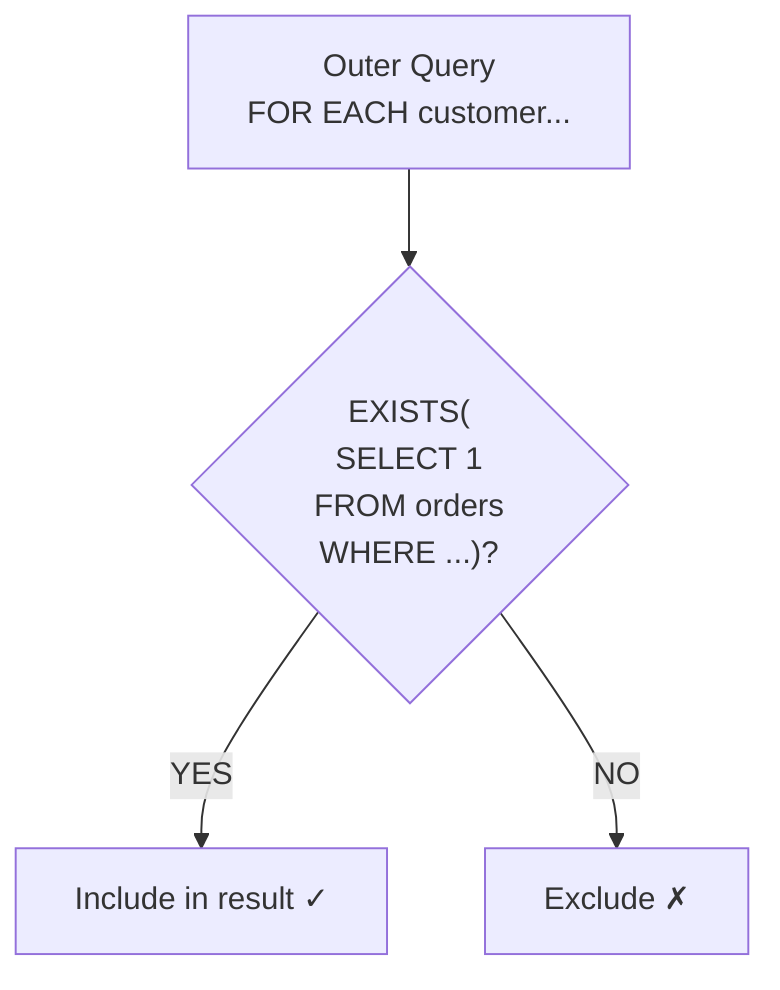
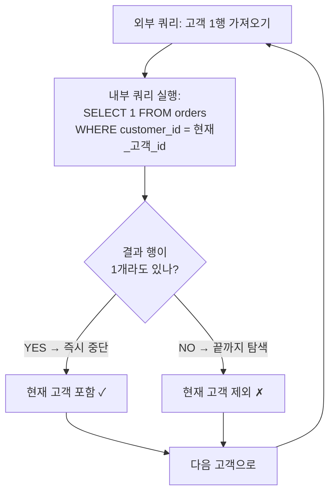

# 20강: EXISTS와 상관 서브쿼리

`EXISTS`는 서브쿼리가 한 건이라도 행을 반환하는지 검사합니다. `IN`과 달리 첫 번째 일치 행을 찾는 즉시 중단하므로, 대용량 데이터에서 효율적이며 NULL이 포함될 수 있는 상황에서도 안전합니다.



> EXISTS는 외부 쿼리의 각 행에 대해 서브쿼리를 실행하고, 결과가 있으면 포함합니다.

## EXISTS vs. IN

| 특성 | `IN` | `EXISTS` |
|---------|------|---------|
| 반환값 | 일치하는 값 | True/False |
| NULL 안전성 | 안전하지 않음 — `NOT IN`은 NULL이 있으면 실패 | 안전 |
| 단락 평가 | 없음 | 있음 — 첫 번째 일치 시 중단 |
| 자기 참조 | 불가 | 가능 — 상관 서브쿼리 |

## 기본 EXISTS

{ .off-glb width="280"  }

```sql
-- 주문을 한 번이라도 한 고객
SELECT id, name, grade
FROM customers AS c
WHERE EXISTS (
    SELECT 1
    FROM orders AS o
    WHERE o.customer_id = c.id
)
ORDER BY name
LIMIT 8;
```

내부 쿼리가 외부 쿼리의 `c.id`를 참조하는 것을 **상관 서브쿼리(Correlated Subquery)**라고 합니다. 외부 행마다 한 번씩 실행되면서 일치하는 주문이 존재하는지 확인합니다.

## NOT EXISTS — 누락 데이터 찾기

{ .off-glb width="280"  }

`NOT EXISTS`는 서브쿼리 칼럼에 NULL이 있을 수 있는 경우 `NOT IN`의 안전한 대안입니다.

```sql
-- 한 번도 주문하지 않은 고객 (NOT IN보다 안전)
SELECT id, name, email, created_at
FROM customers AS c
WHERE NOT EXISTS (
    SELECT 1
    FROM orders AS o
    WHERE o.customer_id = c.id
)
ORDER BY created_at DESC
LIMIT 10;
```

**결과:**

| id | name | email | created_at |
| ----------: | ---------- | ---------- | ---------- |
| 49801 | 김선영 | user49801@testmail.kr | 2025-12-30 22:45:23 |
| 48802 | 류은경 | user48802@testmail.kr | 2025-12-30 22:33:01 |
| 51023 | 이은경 | user51023@testmail.kr | 2025-12-30 19:52:14 |
| 47952 | 류지원 | user47952@testmail.kr | 2025-12-30 19:44:42 |
| 45855 | 강성민 | user45855@testmail.kr | 2025-12-30 17:47:49 |
| 50734 | 최하은 | user50734@testmail.kr | 2025-12-30 15:43:58 |
| 49114 | 이재호 | user49114@testmail.kr | 2025-12-30 15:37:59 |
| 48650 | 김민지 | user48650@testmail.kr | 2025-12-30 13:11:58 |
| ... | ... | ... | ... |

```sql
-- 누군가의 찜 목록에는 있지만 한 번도 구매된 적 없는 상품
SELECT p.id, p.name, p.price
FROM products AS p
WHERE EXISTS (
    SELECT 1 FROM wishlists AS w WHERE w.product_id = p.id
)
AND NOT EXISTS (
    SELECT 1 FROM order_items AS oi WHERE oi.product_id = p.id
)
ORDER BY p.price DESC;
```

**결과:**

| id  | name                   | price  |
| --: | ---------------------- | -----: |
| 260 | 삼성 오디세이 OLED G8        | 693300 |
| 277 | ASRock X870E Taichi 실버 | 583500 |
| ... | ...                    | ...    |

## 조건부 로직을 위한 상관 서브쿼리

`SELECT` 절의 상관 서브쿼리를 사용하면 행마다 "관련 레코드가 있는가?"를 확인할 수 있습니다.

```sql
-- 각 고객의 주문, 리뷰, 불만 접수 여부 표시
SELECT
    c.id,
    c.name,
    c.grade,
    CASE WHEN EXISTS (SELECT 1 FROM orders     WHERE customer_id = c.id) THEN '있음' ELSE '없음' END AS has_orders,
    CASE WHEN EXISTS (SELECT 1 FROM reviews    WHERE customer_id = c.id) THEN '있음' ELSE '없음' END AS has_reviews,
    CASE WHEN EXISTS (SELECT 1 FROM complaints WHERE customer_id = c.id) THEN '있음' ELSE '없음' END AS has_complaints
FROM customers AS c
WHERE c.grade IN ('VIP', 'GOLD')
ORDER BY c.name
LIMIT 8;
```

**결과:**

| id | name | grade | has_orders | has_reviews | has_complaints |
| ----------: | ---------- | ---------- | ---------- | ---------- | ---------- |
| 39877 | 강건우 | VIP | 있음 | 있음 | 있음 |
| 15693 | 강경수 | GOLD | 있음 | 있음 | 없음 |
| 36521 | 강경수 | GOLD | 있음 | 있음 | 없음 |
| 3645 | 강경숙 | VIP | 있음 | 있음 | 있음 |
| 14922 | 강경숙 | GOLD | 있음 | 있음 | 없음 |
| 43164 | 강경숙 | VIP | 있음 | 있음 | 없음 |
| 9195 | 강경자 | VIP | 있음 | 있음 | 있음 |
| 15102 | 강경자 | VIP | 있음 | 있음 | 있음 |
| ... | ... | ... | ... | ... | ... |

## 다중 조건 EXISTS

```sql
-- 2024년에 주문도 하고 불만도 접수한 고객
SELECT c.id, c.name, c.grade
FROM customers AS c
WHERE EXISTS (
    SELECT 1
    FROM orders AS o
    WHERE o.customer_id = c.id
      AND o.ordered_at LIKE '2024%'
)
AND EXISTS (
    SELECT 1
    FROM complaints AS comp
    WHERE comp.customer_id = c.id
)
ORDER BY c.name;
```

## HAVING에서 EXISTS 사용 (집계와 함께)

```sql
-- 리뷰가 50개 이상인 상품이 하나라도 있는 카테고리
SELECT
    cat.name    AS category,
    COUNT(p.id) AS product_count
FROM categories AS cat
INNER JOIN products AS p ON p.category_id = cat.id
GROUP BY cat.id, cat.name
HAVING EXISTS (
    SELECT 1
    FROM products  AS p2
    INNER JOIN reviews AS r ON r.product_id = p2.id
    WHERE p2.category_id = cat.id
    GROUP BY p2.id
    HAVING COUNT(r.id) >= 50
)
ORDER BY category;
```

## EXISTS의 실행 원리

EXISTS가 효율적인 이유를 이해하려면 내부 동작을 알아야 합니다.



**핵심: 단락 평가(Short-circuit Evaluation)**

- `EXISTS`: 첫 번째 일치 행을 찾는 즉시 **중단**합니다. 주문이 100건인 고객도 1건만 확인하면 됩니다.
- `IN`: 서브쿼리의 **전체 결과**를 먼저 수집한 뒤 비교합니다. 대용량에서 차이가 큽니다.
- `SELECT 1`을 쓰는 이유: EXISTS는 행의 **존재 여부**만 검사하므로, 칼럼 값을 가져올 필요가 없습니다. `SELECT *`도 동작하지만 `SELECT 1`이 의도를 명확히 표현합니다.

## NOT IN의 NULL 함정

`NOT IN`에서 서브쿼리 결과에 **NULL이 하나라도 포함**되면 전체 결과가 비어버립니다. 이것이 `NOT EXISTS`를 선호하는 가장 큰 이유입니다.

```sql
-- ❌ 위험: product_id에 NULL이 있으면 결과가 0건!
SELECT name FROM products
WHERE id NOT IN (SELECT product_id FROM order_items);
-- product_id가 NULL인 행이 하나라도 있으면 모든 비교가 UNKNOWN → 결과 없음

-- ✅ 안전: NOT EXISTS는 NULL에 영향받지 않음
SELECT name FROM products AS p
WHERE NOT EXISTS (
    SELECT 1 FROM order_items AS oi
    WHERE oi.product_id = p.id
);
```

> **규칙:** `NOT IN` 대신 `NOT EXISTS`를 기본으로 사용하세요. 특히 서브쿼리 칼럼에 NULL이 있을 수 있는 경우 반드시 `NOT EXISTS`를 씁니다.

## 안티 조인 패턴 비교

"~가 없는 행 찾기"는 SQL에서 세 가지 방법으로 구현할 수 있습니다. 각각의 장단점을 비교합니다.

| 패턴 | 문법 | NULL 안전 | 성능 (대용량) |
|------|------|:---------:|:----------:|
| `NOT EXISTS` | `WHERE NOT EXISTS (SELECT 1 FROM ... WHERE ...)` | ✅ | 빠름 |
| `LEFT JOIN + IS NULL` | `LEFT JOIN ... WHERE right.id IS NULL` | ✅ | 빠름 |
| `NOT IN` | `WHERE col NOT IN (SELECT ...)` | ❌ | 느릴 수 있음 |

```sql
-- 방법 1: NOT EXISTS (권장)
SELECT c.name FROM customers AS c
WHERE NOT EXISTS (
    SELECT 1 FROM orders AS o WHERE o.customer_id = c.id
);

-- 방법 2: LEFT JOIN + IS NULL (동등)
SELECT c.name FROM customers AS c
LEFT JOIN orders AS o ON o.customer_id = c.id
WHERE o.id IS NULL;

-- 방법 3: NOT IN (NULL 위험)
SELECT name FROM customers
WHERE id NOT IN (SELECT customer_id FROM orders);
```

세 쿼리의 결과는 동일하지만, `NOT IN`은 `customer_id`에 NULL이 있으면 빈 결과를 반환합니다. 실무에서는 **NOT EXISTS** 또는 **LEFT JOIN + IS NULL**을 사용하세요.

## 정리

| 개념 | 설명 | 예시 |
|------|------|------

<!-- BEGIN_LESSON_EXERCISES -->

!!! note "레슨 복습 문제"
    이 레슨에서 배운 개념을 바로 확인하는 간단한 문제입니다. 여러 개념을 종합하는 실전 연습은 [연습 문제](../exercises/index.md) 섹션을 참고하세요.

### 문제 1
`NOT EXISTS`로 안티 조인을 구현하여, 배송(shipping)이 생성되었지만 아직 배송 완료(delivered_at IS NULL)되지 않은 주문을 찾으세요. `order_number`, `ordered_at`, `status`, `carrier`, `shipped_at`을 반환하세요.

??? success "정답"
    ```sql
    SELECT
    o.order_number,
    o.ordered_at,
    o.status,
    s.carrier,
    s.shipped_at
    FROM orders AS o
    INNER JOIN shipping AS s ON s.order_id = o.id
    WHERE NOT EXISTS (
    SELECT 1
    FROM shipping AS s2
    WHERE s2.order_id = o.id
    AND s2.delivered_at IS NOT NULL
    )
    ORDER BY s.shipped_at DESC
    LIMIT 20;
    ```

### 문제 2
`EXISTS`와 상관 서브쿼리를 사용하여 같은 상품에 대해 리뷰 평점 5점과 1점이 모두 존재하는 상품을 찾으세요. `product_id`, `product_name`, `price`를 반환하세요.

??? success "정답"
    ```sql
    SELECT
    p.id    AS product_id,
    p.name  AS product_name,
    p.price
    FROM products AS p
    WHERE EXISTS (
    SELECT 1 FROM reviews WHERE product_id = p.id AND rating = 5
    )
    AND EXISTS (
    SELECT 1 FROM reviews WHERE product_id = p.id AND rating = 1
    )
    ORDER BY p.name;
    ```

### 문제 3
상관 서브쿼리를 사용하여 각 직원이 처리한 주문 중 가장 금액이 큰 주문의 정보를 함께 표시하세요. `staff_name`, `department`, `max_order_amount`, `max_order_number`를 반환하세요. `max_order_number`는 해당 금액과 일치하는 주문 번호입니다.

??? success "정답"
    ```sql
    SELECT
    s.name AS staff_name,
    s.department,
    (SELECT MAX(o.total_amount) FROM orders AS o WHERE o.staff_id = s.id) AS max_order_amount,
    (SELECT o.order_number FROM orders AS o
    WHERE o.staff_id = s.id
    ORDER BY o.total_amount DESC
    LIMIT 1) AS max_order_number
    FROM staff AS s
    WHERE EXISTS (
    SELECT 1 FROM orders WHERE staff_id = s.id
    )
    ORDER BY max_order_amount DESC
    LIMIT 15;
    ```

### 문제 4
`NOT EXISTS`를 사용하여 한 번도 리뷰를 작성하지 않은 고객 중 5건 이상 주문한 고객을 찾으세요. `customer_id`, `name`, `grade`, `order_count`를 반환하세요.

??? success "정답"
    ```sql
    SELECT
    c.id AS customer_id,
    c.name,
    c.grade,
    (SELECT COUNT(*) FROM orders WHERE customer_id = c.id
    AND status NOT IN ('cancelled', 'returned')) AS order_count
    FROM customers AS c
    WHERE NOT EXISTS (
    SELECT 1 FROM reviews WHERE customer_id = c.id
    )
    AND (
    SELECT COUNT(*) FROM orders WHERE customer_id = c.id
    AND status NOT IN ('cancelled', 'returned')
    ) >= 5
    ORDER BY order_count DESC
    LIMIT 20;
    ```

### 문제 5
`EXISTS`를 사용하여 모든 결제 수단(credit_card, bank_transfer, cash 등)으로 한 번 이상 결제한 적이 있는 고객을 찾으세요. `customer_id`, `name`을 반환하세요. 힌트: 결제 수단 종류 수와 해당 고객이 사용한 결제 수단 수를 비교하세요.

??? success "정답"
    ```sql
    SELECT c.id AS customer_id, c.name
    FROM customers AS c
    WHERE NOT EXISTS (
    SELECT DISTINCT p2.method
    FROM payments AS p2
    WHERE p2.status = 'completed'
    
    EXCEPT
    
    SELECT p.method
    FROM payments AS p
    INNER JOIN orders AS o ON p.order_id = o.id
    WHERE o.customer_id = c.id
    AND p.status = 'completed'
    )
    AND EXISTS (
    SELECT 1
    FROM orders AS o
    WHERE o.customer_id = c.id
    )
    ORDER BY c.name;
    ```

### 문제 6
`EXISTS`와 집계 조건을 결합하여, 평균 리뷰 평점이 4.0 이상인 상품을 하나 이상 보유한 카테고리를 찾으세요. `category_name`, `product_count`를 반환하세요.

??? success "정답"
    ```sql
    SELECT
    cat.name AS category_name,
    COUNT(p.id) AS product_count
    FROM categories AS cat
    INNER JOIN products AS p ON p.category_id = cat.id
    WHERE p.is_active = 1
    GROUP BY cat.id, cat.name
    HAVING EXISTS (
    SELECT 1
    FROM products AS p2
    INNER JOIN reviews AS r ON r.product_id = p2.id
    WHERE p2.category_id = cat.id
    GROUP BY p2.id
    HAVING AVG(r.rating) >= 4.0
    )
    ORDER BY category_name;
    ```

### 문제 7
해당 고객이 아직 **구매하지 않은** 찜 목록 상품을 모두 찾으세요. `customer_name`, `product_name`, `created_at`(찜 등록 일시)을 반환하세요. `order_items`와 `orders`에서 `customer_id`와 `product_id`가 일치하는지 확인하는 상관 서브쿼리와 함께 `NOT EXISTS`를 사용하세요.

??? success "정답"
    ```sql
    SELECT
    c.name  AS customer_name,
    p.name  AS product_name,
    w.created_at
    FROM wishlists AS w
    INNER JOIN customers AS c ON w.customer_id = c.id
    INNER JOIN products  AS p ON w.product_id  = p.id
    WHERE NOT EXISTS (
    SELECT 1
    FROM order_items AS oi
    INNER JOIN orders AS o ON oi.order_id = o.id
    WHERE o.customer_id  = w.customer_id
    AND oi.product_id  = w.product_id
    AND o.status NOT IN ('cancelled', 'returned')
    )
    ORDER BY w.created_at DESC
    LIMIT 20;
    ```

### 문제 8
`NOT EXISTS`를 사용하여 2024년에 주문한 모든 고객이 공통으로 구매한 상품을 찾으세요. 즉, 2024년에 주문한 고객 중 해당 상품을 구매하지 않은 고객이 한 명도 없는 상품입니다. `product_id`, `product_name`을 반환하세요.

??? success "정답"
    ```sql
    SELECT p.id AS product_id, p.name AS product_name
    FROM products AS p
    WHERE NOT EXISTS (
    SELECT c.id
    FROM customers AS c
    WHERE EXISTS (
    SELECT 1 FROM orders AS o
    WHERE o.customer_id = c.id
    AND o.ordered_at LIKE '2024%'
    AND o.status NOT IN ('cancelled', 'returned')
    )
    AND NOT EXISTS (
    SELECT 1
    FROM order_items AS oi
    INNER JOIN orders AS o ON oi.order_id = o.id
    WHERE o.customer_id = c.id
    AND oi.product_id = p.id
    AND o.ordered_at LIKE '2024%'
    AND o.status NOT IN ('cancelled', 'returned')
    )
    )
    ORDER BY p.name;
    ```

### 문제 9
불만을 접수한 적 있고 반품 이력도 있는 고객을 찾으세요. `customer_id`, `name`, `grade`, `complaint_count`, `return_count`를 반환하세요. 필터링에는 `EXISTS`를 사용하고, 건수 집계에는 서브쿼리 집계 또는 JOIN을 사용하세요.

??? success "정답"
    ```sql
    SELECT
    c.id    AS customer_id,
    c.name,
    c.grade,
    (SELECT COUNT(*) FROM complaints WHERE customer_id = c.id) AS complaint_count,
    (SELECT COUNT(*) FROM orders AS o
    INNER JOIN returns AS r ON r.order_id = o.id
    WHERE o.customer_id = c.id)               AS return_count
    FROM customers AS c
    WHERE EXISTS (
    SELECT 1 FROM complaints WHERE customer_id = c.id
    )
    AND EXISTS (
    SELECT 1
    FROM orders AS o
    INNER JOIN returns AS r ON r.order_id = o.id
    WHERE o.customer_id = c.id
    )
    ORDER BY complaint_count DESC;
    ```

### 문제 10
`EXISTS`를 사용하여 최소 3개 이상의 서로 다른 카테고리 상품을 주문한 고객을 찾으세요. `customer_id`, `name`, `category_count`를 반환하고, `category_count` 내림차순으로 10행까지 정렬하세요.

??? success "정답"
    ```sql
    SELECT
    c.id AS customer_id,
    c.name,
    (
    SELECT COUNT(DISTINCT p.category_id)
    FROM order_items AS oi
    INNER JOIN orders AS o ON oi.order_id = o.id
    INNER JOIN products AS p ON oi.product_id = p.id
    WHERE o.customer_id = c.id
    ) AS category_count
    FROM customers AS c
    WHERE EXISTS (
    SELECT 1
    FROM order_items AS oi
    INNER JOIN orders AS o ON oi.order_id = o.id
    INNER JOIN products AS p ON oi.product_id = p.id
    WHERE o.customer_id = c.id
    GROUP BY o.customer_id
    HAVING COUNT(DISTINCT p.category_id) >= 3
    )
    ORDER BY category_count DESC
    LIMIT 10;
    ```

<!-- END_LESSON_EXERCISES -->
