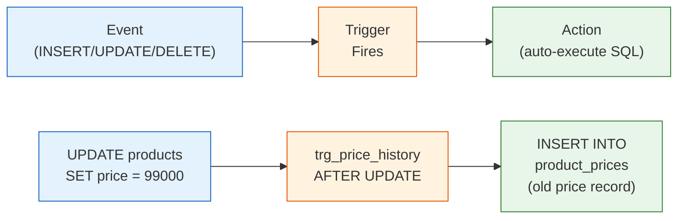

# 강의 20: 트리거(Triggers)

**트리거(Trigger)**는 특정 테이블에서 데이터 변경 이벤트(`INSERT`, `UPDATE`, `DELETE`)가 발생할 때 SQL 블록을 자동으로 실행하는 데이터베이스 객체입니다. 트리거는 비즈니스 규칙을 강제하고, 감사 로그(Audit Trail)를 유지하며, 파생 데이터를 동기화합니다. 이 모든 것을 애플리케이션 코드 없이 처리할 수 있습니다.



> 트리거는 테이블에 이벤트(INSERT/UPDATE/DELETE)가 발생하면 자동으로 SQL을 실행합니다.

트리거 문법은 데이터베이스마다 크게 다릅니다. SQLite는 가장 간단하고, MySQL은 `DELIMITER` 변경이 필요하며, PostgreSQL은 별도의 함수를 먼저 만들어야 합니다.

## 트리거 문법

=== "SQLite"
    ```sql
    CREATE TRIGGER trigger_name
        BEFORE | AFTER | INSTEAD OF
        INSERT | UPDATE | DELETE
        ON table_name
        [WHEN condition]
    BEGIN
        -- SQL statements;
    END;
    ```

=== "MySQL"
    ```sql
    DELIMITER //
    CREATE TRIGGER trigger_name
        BEFORE | AFTER
        INSERT | UPDATE | DELETE
        ON table_name
        FOR EACH ROW
    BEGIN
        -- SQL statements;
    END //
    DELIMITER ;
    ```

=== "PostgreSQL"
    ```sql
    -- Step 1: Create a trigger function
    CREATE OR REPLACE FUNCTION trigger_function_name()
    RETURNS TRIGGER AS $$
    BEGIN
        -- SQL statements;
        RETURN NEW;  -- or RETURN OLD for DELETE triggers
    END;
    $$ LANGUAGE plpgsql;

    -- Step 2: Attach the function to a trigger
    CREATE TRIGGER trigger_name
        BEFORE | AFTER
        INSERT | UPDATE | DELETE
        ON table_name
        FOR EACH ROW
        EXECUTE FUNCTION trigger_function_name();
    ```

- `BEFORE` -- 행이 변경되기 전에 실행 (유효성 검사나 값 수정에 사용)
- `AFTER` -- 행이 변경된 후에 실행 (로깅과 연쇄 처리에 사용)
- `NEW` -- 삽입되는 행 또는 UPDATE 후의 새 값을 가리킴
- `OLD` -- 삭제되는 행 또는 UPDATE 전의 이전 값을 가리킴

## 기본 제공 트리거

이 데이터베이스에는 5개의 트리거가 미리 포함되어 있습니다. 다음으로 확인하세요:

```sql
-- 모든 트리거 목록
SELECT name, tbl_name, sql
FROM sqlite_master
WHERE type = 'trigger'
ORDER BY name;
```

| 트리거 | 테이블 | 실행 시점 | 목적 |
|---------|-------|----------|---------|
| `trg_update_product_timestamp` | products | AFTER UPDATE | `updated_at = datetime('now')` 자동 설정 |
| `trg_update_customer_timestamp` | customers | AFTER UPDATE | `updated_at = datetime('now')` 자동 설정 |
| `trg_earn_points_on_order` | orders | AFTER INSERT | 새 주문 삽입 시 적립 포인트 부여 |
| `trg_adjust_stock_on_order` | order_items | AFTER INSERT | 주문 아이템 삽입 시 `products.stock_qty` 감소 |
| `trg_restore_stock_on_cancel` | orders | AFTER UPDATE | 주문 취소 시 `products.stock_qty` 복원 |

## 트리거 정의 확인

```sql
-- 특정 트리거의 전체 SQL 확인
SELECT sql
FROM sqlite_master
WHERE type = 'trigger'
  AND name = 'trg_adjust_stock_on_order';
```

**결과:**

```sql
CREATE TRIGGER trg_adjust_stock_on_order
AFTER INSERT ON order_items
BEGIN
    UPDATE products
    SET stock_qty  = stock_qty - NEW.quantity,
        updated_at = datetime('now')
    WHERE id = NEW.product_id;
END
```

`order_items`에 행이 삽입될 때마다 이 트리거가 해당 상품의 재고를 자동으로 차감합니다.

```sql
-- 포인트 트리거 확인
SELECT sql
FROM sqlite_master
WHERE type = 'trigger'
  AND name = 'trg_earn_points_on_order';
```

**결과:**

```sql
CREATE TRIGGER trg_earn_points_on_order
AFTER INSERT ON orders
BEGIN
    UPDATE customers
    SET point_balance = point_balance + NEW.point_earned,
        updated_at    = datetime('now')
    WHERE id = NEW.customer_id;
END
```

## 트리거 동작 확인

변경 전후 상태를 관찰하여 트리거가 제대로 동작하는지 확인할 수 있습니다:

```sql
-- 상품 5의 현재 재고 확인
SELECT id, name, stock_qty FROM products WHERE id = 5;
-- 결과: stock_qty = 42

-- 주문 아이템 삽입 (트리거 자동 실행)
INSERT INTO order_items (order_id, product_id, quantity, unit_price, total_price)
VALUES (99999, 5, 3, 99.99, 299.97);

-- 재고 재확인 — 42 - 3 = 39 가 되어야 함
SELECT id, name, stock_qty FROM products WHERE id = 5;
-- 결과: stock_qty = 39
```

## 새 트리거 작성하기

=== "SQLite"
    ```sql
    -- Audit table for price changes
    CREATE TABLE IF NOT EXISTS price_change_log (
        id          INTEGER PRIMARY KEY AUTOINCREMENT,
        product_id  INTEGER,
        old_price   REAL,
        new_price   REAL,
        changed_at  TEXT DEFAULT (datetime('now'))
    );

    -- Trigger
    CREATE TRIGGER IF NOT EXISTS trg_log_price_change
    AFTER UPDATE OF price ON products
    WHEN OLD.price <> NEW.price
    BEGIN
        INSERT INTO price_change_log (product_id, old_price, new_price)
        VALUES (NEW.id, OLD.price, NEW.price);
    END;
    ```

=== "MySQL"
    ```sql
    -- Audit table for price changes
    CREATE TABLE IF NOT EXISTS price_change_log (
        id          INT AUTO_INCREMENT PRIMARY KEY,
        product_id  INT,
        old_price   DECIMAL(10,2),
        new_price   DECIMAL(10,2),
        changed_at  DATETIME DEFAULT NOW()
    );

    -- Trigger
    DELIMITER //
    CREATE TRIGGER trg_log_price_change
    AFTER UPDATE ON products
    FOR EACH ROW
    BEGIN
        IF OLD.price <> NEW.price THEN
            INSERT INTO price_change_log (product_id, old_price, new_price)
            VALUES (NEW.id, OLD.price, NEW.price);
        END IF;
    END //
    DELIMITER ;
    ```

=== "PostgreSQL"
    ```sql
    -- Audit table for price changes
    CREATE TABLE IF NOT EXISTS price_change_log (
        id          SERIAL PRIMARY KEY,
        product_id  INTEGER,
        old_price   NUMERIC(10,2),
        new_price   NUMERIC(10,2),
        changed_at  TIMESTAMP DEFAULT NOW()
    );

    -- Trigger function
    CREATE OR REPLACE FUNCTION fn_log_price_change()
    RETURNS TRIGGER AS $$
    BEGIN
        IF OLD.price <> NEW.price THEN
            INSERT INTO price_change_log (product_id, old_price, new_price)
            VALUES (NEW.id, OLD.price, NEW.price);
        END IF;
        RETURN NEW;
    END;
    $$ LANGUAGE plpgsql;

    -- Trigger
    CREATE TRIGGER trg_log_price_change
    AFTER UPDATE OF price ON products
    FOR EACH ROW
    EXECUTE FUNCTION fn_log_price_change();
    ```

이제 가격 변경이 있을 때마다 자동으로 기록됩니다:

```sql
UPDATE products SET price = 1349.99 WHERE id = 1;

SELECT * FROM price_change_log;
-- product_id=1, old_price=1299.99, new_price=1349.99
```

## 트리거 삭제

```sql
DROP TRIGGER IF EXISTS trg_log_price_change;
DROP TABLE IF EXISTS price_change_log;
```

## 트리거 사용 가이드

| 권장 사용 | 피해야 할 사용 |
|----------|-------|
| 감사 로그 | 복잡한 비즈니스 로직 (디버깅이 어려움) |
| `updated_at` 타임스탬프 유지 | 트리거가 다른 트리거를 과도하게 호출하는 경우 |
| 파생 데이터 연쇄 처리 (재고, 포인트) | 애플리케이션 수준 유효성 검사 대체 |
| 비정규화 요약 데이터 유지 | 쓰기 성능이 중요한 경로 |

!!! note "레슨 복습 문제"
    이 레슨에서 배운 개념을 바로 확인하는 간단한 문제입니다. 여러 개념을 종합하는 실전 연습은 [연습 문제](../exercises/) 섹션을 참고하세요.

## 연습 문제

### 연습 1
`sqlite_master`를 사용하여 5개의 기본 제공 트리거를 모두 나열하세요. 각 트리거에 대해 `name`, `tbl_name`, 그리고 `sql` 컬럼에서 `CASE`와 `LIKE`를 사용하여 `INSERT`, `UPDATE`, `DELETE` 중 어느 시점에 실행되는지를 표시하세요.

??? success "정답"
    ```sql
    SELECT
        name,
        tbl_name,
        CASE
            WHEN sql LIKE '%AFTER INSERT%'  THEN 'AFTER INSERT'
            WHEN sql LIKE '%AFTER UPDATE%'  THEN 'AFTER UPDATE'
            WHEN sql LIKE '%AFTER DELETE%'  THEN 'AFTER DELETE'
            WHEN sql LIKE '%BEFORE INSERT%' THEN 'BEFORE INSERT'
            WHEN sql LIKE '%BEFORE UPDATE%' THEN 'BEFORE UPDATE'
            WHEN sql LIKE '%BEFORE DELETE%' THEN 'BEFORE DELETE'
        END AS fires_on
    FROM sqlite_master
    WHERE type = 'trigger'
    ORDER BY name;
    ```

### 연습 2
`SELECT sql FROM sqlite_master WHERE name = 'trg_restore_stock_on_cancel'`을 실행하여 `trg_restore_stock_on_cancel` 트리거를 살펴보세요. 이후 취소된 주문에 포함된 상품의 재고를 조회하여, 취소 시점에 재고가 올바르게 복원됐는지 확인하세요.

??? success "정답"
    ```sql
    -- 1단계: 트리거 정의 확인
    SELECT sql
    FROM sqlite_master
    WHERE type = 'trigger'
      AND name = 'trg_restore_stock_on_cancel';

    -- 2단계: 취소된 주문과 해당 상품 확인
    SELECT o.id AS order_id, oi.product_id, oi.quantity, p.stock_qty
    FROM orders AS o
    INNER JOIN order_items AS oi ON oi.order_id = o.id
    INNER JOIN products    AS p  ON p.id = oi.product_id
    WHERE o.status = 'cancelled'
    LIMIT 5;
    -- stock_qty에는 복원된 수량이 이미 반영되어 있어야 함
    ```

---

튜토리얼 시리즈를 모두 완료했습니다. 도전 과제에 도전해 볼까요?

다음: [매출 분석 연습 문제](../exercises/advanced-01-sales-analysis.md)
