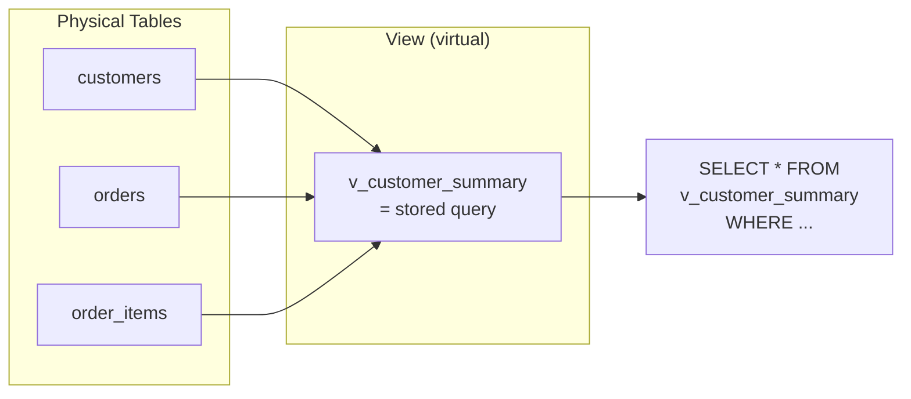

# 강의 20: 뷰(Views)

**뷰(View)**는 데이터베이스에 이름이 붙은 객체로 저장된 쿼리입니다. 뷰를 조회하는 방식은 테이블 조회와 동일하지만, 내부적으로는 쿼리가 매번 실행됩니다. 뷰는 복잡한 쿼리를 단순화하고, 일관된 비즈니스 로직을 강제하며, 원시 테이블의 세부 내용을 숨겨 보안 계층을 제공합니다.



> 뷰는 저장된 쿼리입니다. 물리적 테이블이 아니라 실행할 때마다 원본 테이블에서 데이터를 가져옵니다.

## 뷰 생성

```sql
CREATE VIEW view_name AS
SELECT ...;
```

생성 후에는 테이블처럼 조회할 수 있습니다:

```sql
SELECT * FROM view_name WHERE ...;
```

## 쇼핑몰 기본 제공 뷰

이 데이터베이스에는 18개의 뷰가 미리 제공됩니다. 다음 쿼리로 목록을 확인하세요:

=== "SQLite"
    ```sql
    -- 데이터베이스의 모든 뷰 목록
    SELECT name, sql
    FROM sqlite_master
    WHERE type = 'view'
    ORDER BY name;
    ```

=== "MySQL"
    ```sql
    -- 데이터베이스의 모든 뷰 목록
    SELECT TABLE_NAME, VIEW_DEFINITION
    FROM INFORMATION_SCHEMA.VIEWS
    WHERE TABLE_SCHEMA = DATABASE()
    ORDER BY TABLE_NAME;
    ```

=== "PostgreSQL"
    ```sql
    -- 데이터베이스의 모든 뷰 목록
    SELECT viewname, definition
    FROM pg_views
    WHERE schemaname = 'public'
    ORDER BY viewname;
    ```

주요 뷰 목록:

| 뷰 | 설명 |
|------|-------------|
| `v_order_summary` | 고객명과 결제수단이 포함된 주문 정보 |
| `v_product_sales` | 상품별 판매 수량, 매출, 리뷰 통계 |
| `v_customer_stats` | 고객별 주문 수, LTV, 평균 주문 금액 |
| `v_monthly_revenue` | 월별 매출 및 주문 수 |
| `v_category_performance` | 카테고리별 매출 및 판매 수량 |
| `v_top_customers` | LTV 기준 상위 100명 고객 |
| `v_inventory_status` | 재고 수준 분류를 포함한 상품 정보 |
| `v_shipping_performance` | 택배사별 평균 배송 소요 시간 |

## 뷰 조회하기

```sql
-- v_order_summary를 테이블처럼 사용
SELECT customer_name, order_number, total_amount, payment_method
FROM v_order_summary
WHERE order_status = 'confirmed'
  AND ordered_at LIKE '2024-12%'
ORDER BY total_amount DESC
LIMIT 5;
```

**결과:**

| customer_name | order_number | total_amount | payment_method |
|---------------|--------------|-------------:|----------------|
| 최수아 | ORD-20241231-09842 | 2349.00 | card |
| 박지훈 | ORD-20241228-09831 | 1899.00 | card |
| 이지은 | ORD-20241226-09820 | 1299.99 | kakao_pay |
| ... | | | |

```sql
-- 기본 제공 뷰로 월별 매출 추이 확인
SELECT year_month, revenue, order_count
FROM v_monthly_revenue
WHERE year_month BETWEEN '2022-01' AND '2024-12'
ORDER BY year_month;
```

```sql
-- 뷰로 재고 현황 확인
SELECT product_name, price, stock_qty, stock_status
FROM v_inventory_status
WHERE stock_status IN ('품절', '재고 부족')
ORDER BY stock_qty ASC;
```

## 뷰 정의 확인하기

시스템 카탈로그를 사용하면 뷰의 SQL 정의를 살펴볼 수 있습니다:

=== "SQLite"
    ```sql
    -- v_product_sales 뷰를 정의하는 SQL 확인
    SELECT sql
    FROM sqlite_master
    WHERE type = 'view'
      AND name = 'v_product_sales';
    ```

=== "MySQL"
    ```sql
    -- v_product_sales 뷰를 정의하는 SQL 확인
    SELECT VIEW_DEFINITION
    FROM INFORMATION_SCHEMA.VIEWS
    WHERE TABLE_SCHEMA = DATABASE()
      AND TABLE_NAME = 'v_product_sales';
    ```

=== "PostgreSQL"
    ```sql
    -- v_product_sales 뷰를 정의하는 SQL 확인
    SELECT definition
    FROM pg_views
    WHERE schemaname = 'public'
      AND viewname = 'v_product_sales';
    ```

**결과 (요약):**

```sql
CREATE VIEW v_product_sales AS
SELECT
    p.id            AS product_id,
    p.name          AS product_name,
    cat.name        AS category,
    p.price,
    COALESCE(SUM(oi.quantity), 0)             AS units_sold,
    COALESCE(SUM(oi.quantity * oi.unit_price), 0) AS total_revenue,
    COUNT(DISTINCT r.id)                      AS review_count,
    ROUND(AVG(r.rating), 2)                   AS avg_rating
FROM products AS p
INNER JOIN categories AS cat ON p.category_id = cat.id
LEFT  JOIN order_items AS oi ON oi.product_id = p.id
LEFT  JOIN reviews     AS r  ON r.product_id  = p.id
GROUP BY p.id, p.name, cat.name, p.price
```

## 뷰 위에 뷰 만들기

```sql
-- 뷰를 일반 테이블처럼 필터링할 수 있음
SELECT *
FROM v_customer_stats
WHERE order_count >= 10
  AND avg_order_value > 500
ORDER BY lifetime_value DESC
LIMIT 10;
```

## 직접 뷰 만들기

```sql
-- 고객 서비스 대시보드용 뷰
CREATE VIEW v_cs_watchlist AS
SELECT
    c.id            AS customer_id,
    c.name,
    c.email,
    c.grade,
    COUNT(DISTINCT comp.id)  AS open_complaints,
    COUNT(DISTINCT r.id)     AS pending_returns,
    MAX(o.ordered_at)        AS last_order_date
FROM customers AS c
LEFT JOIN complaints AS comp ON comp.customer_id = c.id
    AND comp.status = 'open'
LEFT JOIN orders AS o ON o.customer_id = c.id
LEFT JOIN returns AS r ON r.order_id = o.id
    AND r.status = 'pending'
GROUP BY c.id, c.name, c.email, c.grade
HAVING open_complaints > 0 OR pending_returns > 0;
```

## 뷰 삭제

```sql
DROP VIEW IF EXISTS v_cs_watchlist;
```

!!! note "레슨 복습 문제"
    이 레슨에서 배운 개념을 바로 확인하는 간단한 문제입니다. 여러 개념을 종합하는 실전 연습은 [연습 문제](../exercises/index.md) 섹션을 참고하세요.

## 연습 문제

### 연습 1
`v_product_sales`를 조회하여 `total_revenue` 기준 상위 10개 상품을 찾으세요. `product_name`, `category`, `units_sold`, `total_revenue`, `avg_rating`을 반환하고, 리뷰가 5개 이상인 상품만 포함하세요.

??? success "정답"
    ```sql
    SELECT
        product_name,
        category,
        units_sold,
        total_revenue,
        avg_rating
    FROM v_product_sales
    WHERE review_count >= 5
    ORDER BY total_revenue DESC
    LIMIT 10;
    ```

### 연습 2
시스템 카탈로그를 사용하여 18개의 뷰 전체를 알파벳 순으로 나열하세요. 각 뷰의 이름만 표시합니다. 이후 관심 있는 뷰를 하나 골라 정의를 살펴보세요.

??? success "정답"
    === "SQLite"
        ```sql
        -- 1단계: 모든 뷰 목록 조회
        SELECT name
        FROM sqlite_master
        WHERE type = 'view'
        ORDER BY name;

        -- 2단계: 특정 뷰 정의 확인 (예: v_monthly_revenue)
        SELECT sql
        FROM sqlite_master
        WHERE type = 'view'
          AND name = 'v_monthly_revenue';
        ```

    === "MySQL"
        ```sql
        -- 1단계: 모든 뷰 목록 조회
        SELECT TABLE_NAME
        FROM INFORMATION_SCHEMA.VIEWS
        WHERE TABLE_SCHEMA = DATABASE()
        ORDER BY TABLE_NAME;

        -- 2단계: 특정 뷰 정의 확인 (예: v_monthly_revenue)
        SELECT VIEW_DEFINITION
        FROM INFORMATION_SCHEMA.VIEWS
        WHERE TABLE_SCHEMA = DATABASE()
          AND TABLE_NAME = 'v_monthly_revenue';
        ```

    === "PostgreSQL"
        ```sql
        -- 1단계: 모든 뷰 목록 조회
        SELECT viewname
        FROM pg_views
        WHERE schemaname = 'public'
        ORDER BY viewname;

        -- 2단계: 특정 뷰 정의 확인 (예: v_monthly_revenue)
        SELECT definition
        FROM pg_views
        WHERE schemaname = 'public'
          AND viewname = 'v_monthly_revenue';
        ```

### 연습 3
`v_customer_stats` 뷰를 조회하여 주문 건수가 5건 이상이고 평균 주문 금액이 300 이상인 고객을 `lifetime_value` 내림차순으로 조회하세요.

??? success "정답"
    ```sql
    SELECT *
    FROM v_customer_stats
    WHERE order_count >= 5
      AND avg_order_value >= 300
    ORDER BY lifetime_value DESC;
    ```

### 연습 4
`v_cs_watchlist` 뷰를 삭제한 뒤, 존재하지 않는 뷰를 삭제할 때 에러가 발생하지 않도록 작성하세요.

??? success "정답"
    ```sql
    DROP VIEW IF EXISTS v_cs_watchlist;
    ```

### 연습 5
`products` 테이블과 `order_items` 테이블을 JOIN하여 상품별 총 판매 수량(`total_qty`)과 총 매출(`total_sales`)을 계산하는 `v_product_total_sales` 뷰를 생성하세요. `product_id`, `product_name`, `total_qty`, `total_sales` 칼럼을 포함합니다.

??? success "정답"
    ```sql
    CREATE VIEW v_product_total_sales AS
    SELECT
        p.id          AS product_id,
        p.name        AS product_name,
        COALESCE(SUM(oi.quantity), 0)              AS total_qty,
        COALESCE(SUM(oi.quantity * oi.unit_price), 0) AS total_sales
    FROM products AS p
    LEFT JOIN order_items AS oi ON oi.product_id = p.id
    GROUP BY p.id, p.name;
    ```

### 연습 6
기존 뷰 `v_product_total_sales`를 수정하여 `category_name` 칼럼을 추가하세요 (categories 테이블 JOIN). SQLite는 `CREATE OR REPLACE`를 지원하지 않으므로 DB별 방법이 다릅니다.

??? success "정답"
    === "SQLite"
        ```sql
        -- SQLite: DROP 후 재생성
        DROP VIEW IF EXISTS v_product_total_sales;

        CREATE VIEW v_product_total_sales AS
        SELECT
            p.id          AS product_id,
            p.name        AS product_name,
            c.name        AS category_name,
            COALESCE(SUM(oi.quantity), 0)              AS total_qty,
            COALESCE(SUM(oi.quantity * oi.unit_price), 0) AS total_sales
        FROM products AS p
        INNER JOIN categories AS c ON c.id = p.category_id
        LEFT JOIN order_items AS oi ON oi.product_id = p.id
        GROUP BY p.id, p.name, c.name;
        ```

    === "MySQL"
        ```sql
        -- MySQL: CREATE OR REPLACE 지원
        CREATE OR REPLACE VIEW v_product_total_sales AS
        SELECT
            p.id          AS product_id,
            p.name        AS product_name,
            c.name        AS category_name,
            COALESCE(SUM(oi.quantity), 0)              AS total_qty,
            COALESCE(SUM(oi.quantity * oi.unit_price), 0) AS total_sales
        FROM products AS p
        INNER JOIN categories AS c ON c.id = p.category_id
        LEFT JOIN order_items AS oi ON oi.product_id = p.id
        GROUP BY p.id, p.name, c.name;
        ```

    === "PostgreSQL"
        ```sql
        -- PostgreSQL: CREATE OR REPLACE 지원
        CREATE OR REPLACE VIEW v_product_total_sales AS
        SELECT
            p.id          AS product_id,
            p.name        AS product_name,
            c.name        AS category_name,
            COALESCE(SUM(oi.quantity), 0)              AS total_qty,
            COALESCE(SUM(oi.quantity * oi.unit_price), 0) AS total_sales
        FROM products AS p
        INNER JOIN categories AS c ON c.id = p.category_id
        LEFT JOIN order_items AS oi ON oi.product_id = p.id
        GROUP BY p.id, p.name, c.name;
        ```

### 연습 7
카테고리별 월간 매출 집계 뷰 `v_category_monthly_revenue`를 만드세요. `category_name`, `year_month` (주문일 기준, 'YYYY-MM' 형식), `revenue`, `order_count` 칼럼을 포함합니다.

??? success "정답"
    === "SQLite"
        ```sql
        CREATE VIEW v_category_monthly_revenue AS
        SELECT
            c.name                                  AS category_name,
            STRFTIME('%Y-%m', o.ordered_at)         AS year_month,
            SUM(oi.quantity * oi.unit_price)         AS revenue,
            COUNT(DISTINCT o.id)                     AS order_count
        FROM categories AS c
        INNER JOIN products    AS p  ON p.category_id = c.id
        INNER JOIN order_items AS oi ON oi.product_id = p.id
        INNER JOIN orders      AS o  ON o.id = oi.order_id
        GROUP BY c.name, STRFTIME('%Y-%m', o.ordered_at);
        ```

    === "MySQL"
        ```sql
        CREATE VIEW v_category_monthly_revenue AS
        SELECT
            c.name                                  AS category_name,
            DATE_FORMAT(o.ordered_at, '%Y-%m')      AS year_month,
            SUM(oi.quantity * oi.unit_price)         AS revenue,
            COUNT(DISTINCT o.id)                     AS order_count
        FROM categories AS c
        INNER JOIN products    AS p  ON p.category_id = c.id
        INNER JOIN order_items AS oi ON oi.product_id = p.id
        INNER JOIN orders      AS o  ON o.id = oi.order_id
        GROUP BY c.name, DATE_FORMAT(o.ordered_at, '%Y-%m');
        ```

    === "PostgreSQL"
        ```sql
        CREATE VIEW v_category_monthly_revenue AS
        SELECT
            c.name                                  AS category_name,
            TO_CHAR(o.ordered_at, 'YYYY-MM')        AS year_month,
            SUM(oi.quantity * oi.unit_price)         AS revenue,
            COUNT(DISTINCT o.id)                     AS order_count
        FROM categories AS c
        INNER JOIN products    AS p  ON p.category_id = c.id
        INNER JOIN order_items AS oi ON oi.product_id = p.id
        INNER JOIN orders      AS o  ON o.id = oi.order_id
        GROUP BY c.name, TO_CHAR(o.ordered_at, 'YYYY-MM');
        ```

### 연습 8
`v_shipping_performance` 뷰를 조회하여 평균 배송 소요 시간이 가장 긴 택배사를 찾으세요. 이어서, 이 뷰가 어떤 테이블과 칼럼을 사용하는지 시스템 카탈로그로 정의를 확인하세요.

??? success "정답"
    === "SQLite"
        ```sql
        -- 1단계: 평균 배송 소요 시간이 가장 긴 택배사
        SELECT *
        FROM v_shipping_performance
        ORDER BY avg_delivery_days DESC
        LIMIT 1;

        -- 2단계: 뷰 정의 확인
        SELECT sql
        FROM sqlite_master
        WHERE type = 'view'
          AND name = 'v_shipping_performance';
        ```

    === "MySQL"
        ```sql
        -- 1단계: 평균 배송 소요 시간이 가장 긴 택배사
        SELECT *
        FROM v_shipping_performance
        ORDER BY avg_delivery_days DESC
        LIMIT 1;

        -- 2단계: 뷰 정의 확인
        SELECT VIEW_DEFINITION
        FROM INFORMATION_SCHEMA.VIEWS
        WHERE TABLE_SCHEMA = DATABASE()
          AND TABLE_NAME = 'v_shipping_performance';
        ```

    === "PostgreSQL"
        ```sql
        -- 1단계: 평균 배송 소요 시간이 가장 긴 택배사
        SELECT *
        FROM v_shipping_performance
        ORDER BY avg_delivery_days DESC
        LIMIT 1;

        -- 2단계: 뷰 정의 확인
        SELECT definition
        FROM pg_views
        WHERE schemaname = 'public'
          AND viewname = 'v_shipping_performance';
        ```

### 연습 9
연습 5~7에서 만든 뷰들을 모두 삭제하세요.

??? success "정답"
    ```sql
    DROP VIEW IF EXISTS v_product_total_sales;
    DROP VIEW IF EXISTS v_category_monthly_revenue;
    ```

---
다음: [강의 21: 인덱스와 쿼리 실행 계획](21-indexes.md)
