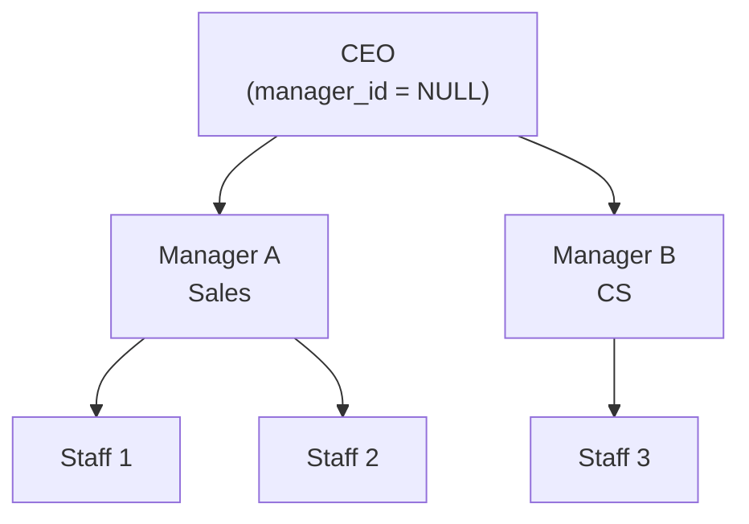
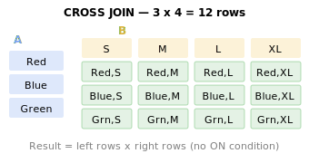

# 21강: SELF JOIN과 CROSS JOIN

[8~9강](../intermediate/08-inner-join.md)에서 INNER JOIN과 LEFT JOIN으로 서로 다른 테이블을 연결했습니다. 이번에는 특수한 JOIN 두 가지를 배웁니다. SELF JOIN은 같은 테이블을 자기 자신과 연결하고(매니저-직원 관계), CROSS JOIN은 모든 조합을 만듭니다(날짜x카테고리).

!!! note "이미 알고 계신다면"
    SELF JOIN, CROSS JOIN에 익숙하다면 [22강: 뷰(Views)](22-views.md)로 건너뛰세요.



> Self-JOIN은 같은 테이블을 자기 자신과 결합합니다. staff 테이블의 manager_id로 조직도를 표현할 수 있습니다.

**실무에서 SELF JOIN과 CROSS JOIN을 사용하는 대표적인 시나리오:**

- **계층 관계:** 매니저-직원, 카테고리 부모-자식 (SELF JOIN)
- **쌍 비교:** 같은 조건의 상품/고객 쌍 분석 (SELF JOIN + id < id)
- **완전 매트릭스:** 월x카테고리, 등급x결제수단 빈칸 없는 보고서 (CROSS JOIN)
- **비율 계산:** 전체 합계를 CROSS JOIN으로 모든 행에 붙여서 % 계산

## SELF JOIN — 같은 테이블끼리 결합

SELF JOIN은 특별한 문법이 아닙니다. 같은 테이블에 서로 다른 별칭을 붙여 JOIN하면 됩니다.

### 카테고리 계층 구조 조회

`categories` 테이블은 `parent_id`로 자기 자신을 참조합니다. SELF JOIN으로 부모-자식 관계를 펼칠 수 있습니다.

```sql
-- 카테고리의 부모-자식 관계 조회
SELECT
    child.id,
    child.name       AS category,
    child.depth,
    parent.name      AS parent_category
FROM categories AS child
LEFT JOIN categories AS parent ON child.parent_id = parent.id
ORDER BY child.depth, child.sort_order;
```

**결과 (예시):**

| id | category | depth | parent_category |
| -: | -------- | ----: | --------------- |
|  1 | 데스크톱 PC  |     0 | (NULL)          |
|  5 | 노트북      |     0 | (NULL)          |
| 10 | 모니터      |     0 | (NULL)          |
| 14 | CPU      |     0 | (NULL)          |
| 17 | 메인보드     |     0 | (NULL)          |
| 20 | 메모리(RAM) |     0 | (NULL)          |
| ... | ...      | ...   | ...             |

최상위 카테고리(`depth=0`)는 `parent_id`가 NULL이므로 `parent_category`도 NULL입니다. `LEFT JOIN`을 사용하여 이런 행도 결과에 포함합니다.

### 대분류-소분류 경로 만들기

SELF JOIN으로 부모(대분류) → 자식(소분류) 전체 경로를 만들 수 있습니다.

=== "SQLite / PostgreSQL"
    ```sql
    SELECT
        parent.name AS top_category,
        child.name  AS sub_category,
        parent.name || ' > ' || child.name AS full_path
    FROM categories AS child
    INNER JOIN categories AS parent ON child.parent_id = parent.id
    WHERE child.depth = 1
    ORDER BY parent.sort_order, child.sort_order;
    ```

=== "MySQL"
    ```sql
    SELECT
        parent.name AS top_category,
        child.name  AS sub_category,
        CONCAT(parent.name, ' > ', child.name) AS full_path
    FROM categories AS child
    INNER JOIN categories AS parent ON child.parent_id = parent.id
    WHERE child.depth = 1
    ORDER BY parent.sort_order, child.sort_order;
    ```

**결과 (예시):**

| top_category | sub_category | full_path |
|--------------|--------------|-----------|
| 데스크톱 PC | 완제품 | 데스크톱 PC > 완제품 |
| 데스크톱 PC | 조립PC | 데스크톱 PC > 조립PC |
| 노트북 | 일반 노트북 | 노트북 > 일반 노트북 |
| 노트북 | 게이밍 노트북 | 노트북 > 게이밍 노트북 |
| ... | | |

> **팁:** 계층 깊이가 고정되어 있을 때는 SELF JOIN이 간결합니다. 깊이가 가변적이면 19강의 재귀 CTE를 사용하세요.

### 같은 카테고리 내 상품 비교

같은 카테고리의 상품끼리 가격을 비교하려면 `products` 테이블을 자기 자신과 JOIN합니다.

```sql
-- 같은 카테고리에서 가격 차이가 가장 큰 상품 쌍 찾기
SELECT
    p1.name AS product_a,
    p2.name AS product_b,
    p1.price AS price_a,
    p2.price AS price_b,
    ABS(p1.price - p2.price) AS price_diff
FROM products AS p1
INNER JOIN products AS p2
    ON p1.category_id = p2.category_id
   AND p1.id < p2.id  -- 중복 쌍 방지 (A-B만, B-A는 제외)
ORDER BY price_diff DESC
LIMIT 10;
```

`p1.id < p2.id` 조건이 핵심입니다. 이 조건이 없으면 (A, B)와 (B, A)가 모두 나오고, (A, A) 자기 자신과의 쌍도 포함됩니다.

### 직원 조직도 (staff.manager_id)

`staff` 테이블의 `manager_id`는 같은 테이블의 `id`를 참조합니다. 직원과 상사의 관계를 조회할 수 있습니다.

```sql
SELECT
    s.name AS employee,
    s.department,
    s.role,
    m.name AS manager
FROM staff s
LEFT JOIN staff m ON s.manager_id = m.id
ORDER BY s.id;
```

### 상품 세대교체 (products.successor_id)

단종된 상품과 그 후속 모델을 조회합니다.

```sql
SELECT
    old.name AS discontinued_product,
    old.discontinued_at,
    new.name AS successor_product,
    new.price AS new_price
FROM products old
JOIN products new ON old.successor_id = new.id
WHERE old.successor_id IS NOT NULL
ORDER BY old.discontinued_at;
```

### 상품 Q&A 스레드 (product_qna.parent_id)

질문과 답변을 한 줄에 보여줍니다.

```sql
SELECT
    q.id AS question_id,
    q.content AS question,
    a.content AS answer,
    a.created_at AS answered_at
FROM product_qna q
LEFT JOIN product_qna a ON a.parent_id = q.id
WHERE q.parent_id IS NULL  -- top-level questions only
ORDER BY q.created_at DESC
LIMIT 10;
```

---

## CROSS JOIN — 모든 조합 생성

{ .off-glb width="440"  }

`CROSS JOIN`은 왼쪽 테이블의 모든 행과 오른쪽 테이블의 모든 행을 결합합니다. 결과 행 수 = 왼쪽 행 수 × 오른쪽 행 수. ON 조건이 없습니다.

### 월-카테고리 매트릭스

매출 보고서에서 "데이터가 없는 월"도 표시해야 할 때, CROSS JOIN으로 빈 프레임을 먼저 만들고 실제 데이터를 LEFT JOIN합니다.

=== "SQLite"
    ```sql
    -- 2024년 12개월 × 대분류 카테고리 매트릭스
    WITH months AS (
        SELECT '2024-01' AS m UNION ALL SELECT '2024-02'
        UNION ALL SELECT '2024-03' UNION ALL SELECT '2024-04'
        UNION ALL SELECT '2024-05' UNION ALL SELECT '2024-06'
        UNION ALL SELECT '2024-07' UNION ALL SELECT '2024-08'
        UNION ALL SELECT '2024-09' UNION ALL SELECT '2024-10'
        UNION ALL SELECT '2024-11' UNION ALL SELECT '2024-12'
    ),
    top_categories AS (
        SELECT id, name FROM categories WHERE depth = 0
    ),
    monthly_sales AS (
        SELECT
            SUBSTR(o.ordered_at, 1, 7) AS year_month,
            COALESCE(parent.id, cat.id) AS category_id,
            ROUND(SUM(oi.quantity * oi.unit_price), 2) AS revenue
        FROM order_items AS oi
        INNER JOIN orders     AS o      ON oi.order_id   = o.id
        INNER JOIN products   AS p      ON oi.product_id = p.id
        INNER JOIN categories AS cat    ON p.category_id = cat.id
        LEFT  JOIN categories AS parent ON cat.parent_id = parent.id
        WHERE o.ordered_at LIKE '2024%'
          AND o.status NOT IN ('cancelled', 'returned', 'return_requested')
        GROUP BY SUBSTR(o.ordered_at, 1, 7), COALESCE(parent.id, cat.id)
    )
    SELECT
        m.m AS year_month,
        tc.name AS category,
        COALESCE(ms.revenue, 0) AS revenue
    FROM months AS m
    CROSS JOIN top_categories AS tc
    LEFT JOIN monthly_sales AS ms
        ON m.m = ms.year_month AND tc.id = ms.category_id
    ORDER BY m.m, tc.name;
    ```

=== "MySQL"
    ```sql
    WITH months AS (
        SELECT '2024-01' AS m UNION ALL SELECT '2024-02'
        UNION ALL SELECT '2024-03' UNION ALL SELECT '2024-04'
        UNION ALL SELECT '2024-05' UNION ALL SELECT '2024-06'
        UNION ALL SELECT '2024-07' UNION ALL SELECT '2024-08'
        UNION ALL SELECT '2024-09' UNION ALL SELECT '2024-10'
        UNION ALL SELECT '2024-11' UNION ALL SELECT '2024-12'
    ),
    top_categories AS (
        SELECT id, name FROM categories WHERE depth = 0
    ),
    monthly_sales AS (
        SELECT
            DATE_FORMAT(o.ordered_at, '%Y-%m') AS year_month,
            COALESCE(parent.id, cat.id) AS category_id,
            ROUND(SUM(oi.quantity * oi.unit_price), 2) AS revenue
        FROM order_items AS oi
        INNER JOIN orders     AS o      ON oi.order_id   = o.id
        INNER JOIN products   AS p      ON oi.product_id = p.id
        INNER JOIN categories AS cat    ON p.category_id = cat.id
        LEFT  JOIN categories AS parent ON cat.parent_id = parent.id
        WHERE o.ordered_at >= '2024-01-01'
          AND o.ordered_at <  '2025-01-01'
          AND o.status NOT IN ('cancelled', 'returned', 'return_requested')
        GROUP BY DATE_FORMAT(o.ordered_at, '%Y-%m'), COALESCE(parent.id, cat.id)
    )
    SELECT
        m.m AS year_month,
        tc.name AS category,
        COALESCE(ms.revenue, 0) AS revenue
    FROM months AS m
    CROSS JOIN top_categories AS tc
    LEFT JOIN monthly_sales AS ms
        ON m.m = ms.year_month AND tc.id = ms.category_id
    ORDER BY m.m, tc.name;
    ```

=== "PostgreSQL"
    ```sql
    WITH months AS (
        SELECT '2024-01' AS m UNION ALL SELECT '2024-02'
        UNION ALL SELECT '2024-03' UNION ALL SELECT '2024-04'
        UNION ALL SELECT '2024-05' UNION ALL SELECT '2024-06'
        UNION ALL SELECT '2024-07' UNION ALL SELECT '2024-08'
        UNION ALL SELECT '2024-09' UNION ALL SELECT '2024-10'
        UNION ALL SELECT '2024-11' UNION ALL SELECT '2024-12'
    ),
    top_categories AS (
        SELECT id, name FROM categories WHERE depth = 0
    ),
    monthly_sales AS (
        SELECT
            TO_CHAR(o.ordered_at, 'YYYY-MM') AS year_month,
            COALESCE(parent.id, cat.id) AS category_id,
            ROUND(SUM(oi.quantity * oi.unit_price), 2) AS revenue
        FROM order_items AS oi
        INNER JOIN orders     AS o      ON oi.order_id   = o.id
        INNER JOIN products   AS p      ON oi.product_id = p.id
        INNER JOIN categories AS cat    ON p.category_id = cat.id
        LEFT  JOIN categories AS parent ON cat.parent_id = parent.id
        WHERE o.ordered_at >= '2024-01-01'
          AND o.ordered_at <  '2025-01-01'
          AND o.status NOT IN ('cancelled', 'returned', 'return_requested')
        GROUP BY TO_CHAR(o.ordered_at, 'YYYY-MM'), COALESCE(parent.id, cat.id)
    )
    SELECT
        m.m AS year_month,
        tc.name AS category,
        COALESCE(ms.revenue, 0) AS revenue
    FROM months AS m
    CROSS JOIN top_categories AS tc
    LEFT JOIN monthly_sales AS ms
        ON m.m = ms.year_month AND tc.id = ms.category_id
    ORDER BY m.m, tc.name;
    ```

CROSS JOIN으로 12 × N 행의 완전한 매트릭스를 만든 후, LEFT JOIN으로 실제 매출을 연결합니다. 매출이 없는 셀은 `COALESCE`로 0이 됩니다.

### 전체 매출 대비 비율 계산

CROSS JOIN의 또 다른 활용: 전체 합계를 모든 행에 붙여서 비율을 계산합니다.

```sql
-- 각 결제 수단이 전체 매출에서 차지하는 비율
SELECT
    p.method,
    COUNT(*)              AS tx_count,
    ROUND(SUM(p.amount), 2) AS total_amount,
    ROUND(100.0 * SUM(p.amount) / gt.grand_total, 1) AS pct
FROM payments AS p
CROSS JOIN (
    SELECT SUM(amount) AS grand_total
    FROM payments
    WHERE status = 'completed'
) AS gt
WHERE p.status = 'completed'
GROUP BY p.method, gt.grand_total
ORDER BY total_amount DESC;
```

> **주의:** CROSS JOIN은 강력하지만, 큰 테이블끼리 CROSS JOIN하면 행 수가 폭발합니다. 반드시 한쪽 또는 양쪽이 소규모 결과 집합일 때만 사용하세요.

### 주문이 없는 날 찾기 (calendar CROSS JOIN)

`calendar` 테이블과 CROSS JOIN + LEFT JOIN으로 주문이 없던 날을 찾습니다.

```sql
SELECT
    c.date_key,
    c.day_name,
    c.is_weekend,
    c.is_holiday,
    c.holiday_name
FROM calendar c
LEFT JOIN orders o ON DATE(o.ordered_at) = c.date_key
WHERE o.id IS NULL
  AND c.year >= 2024
ORDER BY c.date_key;
```

---

## 정리

| JOIN 유형 | 설명 | 대표 사용 사례 |
|-----------|------|----------------|
| SELF JOIN | 같은 테이블에 서로 다른 별칭을 붙여 JOIN | 매니저-직원, 카테고리 부모-자식, 같은 조건의 쌍 비교 |
| CROSS JOIN | 양쪽 모든 행의 조합 (M x N) | 날짜x카테고리 매트릭스, 전체 합계 비율 계산 |
| SELF JOIN + `id < id` | 중복 쌍 제거 (A-B와 B-A 중 하나만) | 같은 부서 직원 쌍, 같은 등급 고객 쌍 |
| CROSS JOIN + LEFT JOIN | 빈 셀도 포함하는 완전한 보고서 | 월별x카테고리 매출 (매출 없는 셀 = 0) |

---

<!-- BEGIN_LESSON_EXERCISES -->

!!! note "레슨 복습 문제"
    이 레슨에서 배운 개념을 바로 확인하는 간단한 문제입니다. 여러 개념을 종합하는 실전 연습은 [연습 문제](../exercises/index.md) 섹션을 참고하세요.

### 문제 1
`staff` 테이블을 SELF JOIN하여 각 직원의 이름, 부서, 직책, 그리고 매니저 이름을 조회하세요. 매니저가 없는 직원(CEO 등)도 포함합니다.

??? success "정답"
    ```sql
    SELECT
    s.name       AS employee,
    s.department,
    s.role,
    m.name       AS manager
    FROM staff AS s
    LEFT JOIN staff AS m ON s.manager_id = m.id
    ORDER BY s.department, s.name;
    ```

### 문제 2
같은 부서에 속한 직원 쌍을 찾으세요. 중복 쌍을 제거하고(`id < id`), 부서명과 두 직원의 이름을 표시하세요.

??? success "정답"
    ```sql
    SELECT
    s1.department,
    s1.name AS staff_a,
    s2.name AS staff_b
    FROM staff AS s1
    INNER JOIN staff AS s2
    ON s1.department = s2.department
    AND s1.id < s2.id
    ORDER BY s1.department, s1.name;
    ```

### 문제 3
같은 등급(`grade`)의 고객 쌍을 찾되, 중복 쌍을 제거하세요(`id < id`). 등급, 고객 A 이름, 고객 B 이름을 표시하고 상위 10건만 출력하세요.

??? success "정답"
    ```sql
    SELECT
    c1.grade,
    c1.name AS customer_a,
    c2.name AS customer_b
    FROM customers AS c1
    INNER JOIN customers AS c2
    ON c1.grade = c2.grade
    AND c1.id < c2.id
    WHERE c1.is_active = 1
    AND c2.is_active = 1
    ORDER BY c1.grade, c1.name
    LIMIT 10;
    ```

### 문제 4
같은 공급업체가 공급하는 상품 쌍을 찾아, 가격 차이와 함께 표시하세요. 중복 쌍은 제거합니다.

??? success "정답"
    ```sql
    SELECT
    s.company_name AS supplier,
    p1.name AS product_a,
    p2.name AS product_b,
    p1.price AS price_a,
    p2.price AS price_b,
    ABS(p1.price - p2.price) AS price_diff
    FROM products AS p1
    INNER JOIN products AS p2
    ON p1.supplier_id = p2.supplier_id
    AND p1.id < p2.id
    INNER JOIN suppliers AS s ON p1.supplier_id = s.id
    ORDER BY price_diff DESC
    LIMIT 10;
    ```

### 문제 5
같은 고객이 서로 다른 주소로 주문한 경우를 찾으세요. (`customer_addresses` 테이블 SELF JOIN)

??? success "정답"
    ```sql
    SELECT
    c.name,
    a1.address1 AS address_1,
    a2.address1 AS address_2
    FROM customer_addresses AS a1
    INNER JOIN customer_addresses AS a2
    ON a1.customer_id = a2.customer_id
    AND a1.id < a2.id
    AND a1.address1 <> a2.address1
    INNER JOIN customers AS c ON a1.customer_id = c.id
    GROUP BY c.id, c.name, a1.address1, a2.address1
    ORDER BY c.name
    LIMIT 15;
    ```

### 문제 6
각 고객 등급이 전체 활성 고객 수에서 차지하는 비율(%)을 구하세요. CROSS JOIN으로 전체 수를 붙여 계산합니다. 소수 첫째 자리까지 반올림하세요.

??? success "정답"
    ```sql
    SELECT
    grade,
    COUNT(*)  AS grade_count,
    ROUND(100.0 * COUNT(*) / gt.total, 1) AS pct
    FROM customers
    CROSS JOIN (
    SELECT COUNT(*) AS total
    FROM customers
    WHERE is_active = 1
    ) AS gt
    WHERE is_active = 1
    GROUP BY grade, gt.total
    ORDER BY pct DESC;
    ```

### 문제 7
2024년 4개 분기(`Q1`~`Q4`)와 결제 수단(`DISTINCT method`)의 모든 조합을 CROSS JOIN으로 생성하고, 각 조합의 결제 금액 합계를 LEFT JOIN으로 구하세요. 결제가 없는 셀은 0으로 표시하세요.

??? success "정답"
    ```sql
    WITH quarters AS (
    SELECT 'Q1' AS q, '2024-01' AS start_m, '2024-03' AS end_m
    UNION ALL SELECT 'Q2', '2024-04', '2024-06'
    UNION ALL SELECT 'Q3', '2024-07', '2024-09'
    UNION ALL SELECT 'Q4', '2024-10', '2024-12'
    ),
    methods AS (
    SELECT DISTINCT method FROM payments
    ),
    quarterly_payments AS (
    SELECT
    CASE
    WHEN SUBSTR(paid_at, 6, 2) IN ('01','02','03') THEN 'Q1'
    WHEN SUBSTR(paid_at, 6, 2) IN ('04','05','06') THEN 'Q2'
    WHEN SUBSTR(paid_at, 6, 2) IN ('07','08','09') THEN 'Q3'
    ELSE 'Q4'
    END AS q,
    method,
    SUM(amount) AS total_amount
    FROM payments
    WHERE status = 'completed'
    AND paid_at LIKE '2024%'
    GROUP BY q, method
    )
    SELECT
    qr.q,
    m.method,
    COALESCE(ROUND(qp.total_amount, 2), 0) AS total_amount
    FROM quarters AS qr
    CROSS JOIN methods AS m
    LEFT JOIN quarterly_payments AS qp
    ON qr.q = qp.q AND m.method = qp.method
    ORDER BY qr.q, m.method;
    ```

### 문제 8
2024년 각 월과 각 공급업체의 조합에 대해, 해당 월의 입고 수량을 보여주세요. 입고가 없는 셀은 0으로 표시합니다.

??? success "정답"
    ```sql
    WITH months AS (
    SELECT '2024-01' AS m UNION ALL SELECT '2024-02'
    UNION ALL SELECT '2024-03' UNION ALL SELECT '2024-04'
    UNION ALL SELECT '2024-05' UNION ALL SELECT '2024-06'
    UNION ALL SELECT '2024-07' UNION ALL SELECT '2024-08'
    UNION ALL SELECT '2024-09' UNION ALL SELECT '2024-10'
    UNION ALL SELECT '2024-11' UNION ALL SELECT '2024-12'
    ),
    supplier_inbound AS (
    SELECT
    SUBSTR(it.created_at, 1, 7) AS year_month,
    p.supplier_id,
    SUM(it.quantity) AS inbound_qty
    FROM inventory_transactions AS it
    INNER JOIN products AS p ON it.product_id = p.id
    WHERE it.type = 'inbound' AND it.created_at LIKE '2024%'
    GROUP BY SUBSTR(it.created_at, 1, 7), p.supplier_id
    )
    SELECT
    m.m AS year_month,
    s.company_name AS supplier,
    COALESCE(si.inbound_qty, 0) AS inbound_qty
    FROM months AS m
    CROSS JOIN suppliers AS s
    LEFT JOIN supplier_inbound AS si
    ON m.m = si.year_month AND s.id = si.supplier_id
    ORDER BY m.m, s.company_name
    LIMIT 30;
    ```

### 문제 9
고객 등급(`DISTINCT grade`)과 최상위 카테고리(`depth = 0`)의 모든 조합을 CROSS JOIN으로 생성하고, 각 조합의 주문 건수를 LEFT JOIN으로 구하세요. 주문이 없는 조합은 0으로 표시하세요.

??? success "정답"
    ```sql
    WITH grades AS (
    SELECT DISTINCT grade FROM customers WHERE grade IS NOT NULL
    ),
    top_cats AS (
    SELECT id, name FROM categories WHERE depth = 0
    ),
    grade_cat_orders AS (
    SELECT
    c.grade,
    COALESCE(pcat.id, cat.id) AS category_id,
    COUNT(DISTINCT o.id) AS order_count
    FROM orders AS o
    INNER JOIN customers AS c ON o.customer_id = c.id
    INNER JOIN order_items AS oi ON o.id = oi.order_id
    INNER JOIN products AS p ON oi.product_id = p.id
    INNER JOIN categories AS cat ON p.category_id = cat.id
    LEFT  JOIN categories AS pcat ON cat.parent_id = pcat.id
    GROUP BY c.grade, COALESCE(pcat.id, cat.id)
    )
    SELECT
    g.grade,
    tc.name AS category,
    COALESCE(gco.order_count, 0) AS order_count
    FROM grades AS g
    CROSS JOIN top_cats AS tc
    LEFT JOIN grade_cat_orders AS gco
    ON g.grade = gco.grade AND tc.id = gco.category_id
    ORDER BY g.grade, tc.name;
    ```

### 문제 10
`categories` 테이블을 SELF JOIN하여 부모 카테고리명(`parent_name`)과 자식 카테고리명(`child_name`)을 조회하세요. 부모가 없는 최상위 카테고리의 `parent_name`은 `'(최상위)'`로 표시합니다.

??? success "정답"
    ```sql
    SELECT
    COALESCE(parent.name, '(최상위)') AS parent_name,
    child.name                       AS child_name,
    child.depth
    FROM categories AS child
    LEFT JOIN categories AS parent ON child.parent_id = parent.id
    ORDER BY parent.name, child.name;
    ```

<!-- END_LESSON_EXERCISES -->
