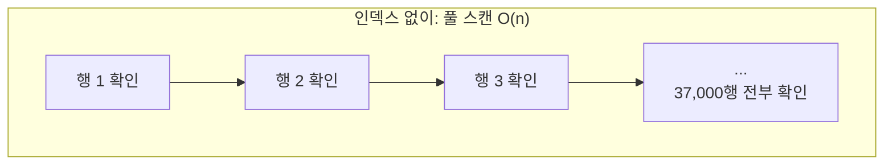
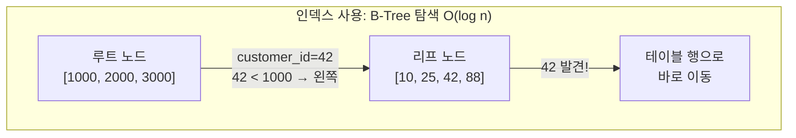
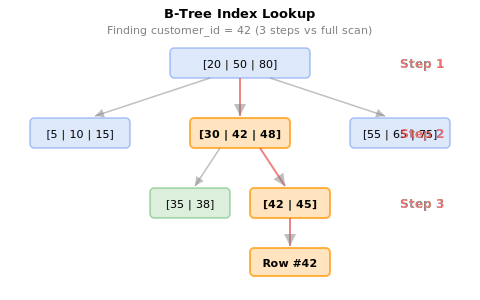

# 23강: 인덱스와 쿼리 실행 계획

인덱스(Index)는 SQLite가 테이블 전체를 스캔하지 않고도 행을 빠르게 찾을 수 있게 해주는 데이터 구조입니다. 언제 인덱스가 도움이 되고 언제 그렇지 않은지를 이해하는 것이 쿼리 성능 튜닝의 기초입니다.





> 풀 스캔은 37,000행을 모두 확인합니다. B-Tree 인덱스는 2~3단계 탐색으로 원하는 행에 도달합니다.

{ .off-glb width="560"  }


!!! note "이미 알고 계신다면"
    인덱스 생성/삭제, EXPLAIN에 익숙하다면 [24강: 트리거](24-triggers.md)으로 건너뛰세요.

## 인덱스의 역할

인덱스가 없으면 SQLite는 일치하는 행을 찾기 위해 테이블의 모든 행을 읽어야 합니다(**전체 테이블 스캔, Full Table Scan**). 검색 칼럼에 인덱스가 있으면 관련 행으로 바로 이동합니다. 책의 색인으로 찾는 것과 처음부터 끝까지 읽는 것의 차이와 같습니다.

```
테이블 스캔:  O(n)      — 모든 행 확인
인덱스 조회:  O(log n)  — 인덱스 트리 이진 탐색
```

34,689개 주문이 있는 테이블을 스캔하면 34,689개 행을 모두 확인합니다. `customer_id`에 인덱스가 있으면 5~10번의 인덱스 조회로 줄어듭니다.

## EXPLAIN QUERY PLAN

`EXPLAIN QUERY PLAN`은 SQLite가 쿼리를 어떻게 실행할 계획인지, 즉 스캔을 할지 인덱스를 쓸지를 보여줍니다.

=== "SQLite"
    ```sql
    -- 자주 사용하는 쿼리의 실행 계획 확인
    EXPLAIN QUERY PLAN
    SELECT order_number, total_amount
    FROM orders
    WHERE customer_id = 42;
    ```

=== "MySQL"
    ```sql
    -- 자주 사용하는 쿼리의 실행 계획 확인
    EXPLAIN
    SELECT order_number, total_amount
    FROM orders
    WHERE customer_id = 42;
    ```

=== "PostgreSQL"
    ```sql
    -- 자주 사용하는 쿼리의 실행 계획 확인
    EXPLAIN ANALYZE
    SELECT order_number, total_amount
    FROM orders
    WHERE customer_id = 42;
    ```

**인덱스 없음 — 전체 테이블 스캔:**
```
QUERY PLAN
└── SCAN orders
```

**customer_id 인덱스 있음 — 인덱스 조회:**
```
QUERY PLAN
└── SEARCH orders USING INDEX idx_orders_customer_id (customer_id=?)
```

## 기존 인덱스 확인

이 데이터베이스에는 모든 외래 키와 자주 조회되는 칼럼에 인덱스가 미리 생성되어 있습니다.

=== "SQLite"
    ```sql
    -- 데이터베이스의 모든 인덱스 목록
    SELECT name, tbl_name, sql
    FROM sqlite_master
    WHERE type = 'index'
      AND sql IS NOT NULL   -- PRIMARY KEY 자동 생성 인덱스 제외
    ORDER BY tbl_name, name;
    ```

=== "MySQL"
    ```sql
    -- 데이터베이스의 모든 인덱스 목록
    SELECT INDEX_NAME, TABLE_NAME, COLUMN_NAME
    FROM INFORMATION_SCHEMA.STATISTICS
    WHERE TABLE_SCHEMA = DATABASE()
    ORDER BY TABLE_NAME, INDEX_NAME;
    ```

=== "PostgreSQL"
    ```sql
    -- 데이터베이스의 모든 인덱스 목록
    SELECT indexname, tablename, indexdef
    FROM pg_indexes
    WHERE schemaname = 'public'
    ORDER BY tablename, indexname;
    ```

**결과 예시:**

| name | tbl_name | sql |
|------|----------|-----|
| idx_orders_customer_id | orders | CREATE INDEX idx_orders_customer_id ON orders(customer_id) |
| idx_orders_ordered_at | orders | CREATE INDEX idx_orders_ordered_at ON orders(ordered_at) |
| idx_order_items_order_id | order_items | CREATE INDEX ... |
| idx_order_items_product_id | order_items | CREATE INDEX ... |
| idx_reviews_product_id | reviews | CREATE INDEX ... |
| ... | | |

## SCAN vs. SEARCH 비교

=== "SQLite"
    ```sql
    -- 인덱스 있음: 빠른 검색
    EXPLAIN QUERY PLAN
    SELECT * FROM orders
    WHERE ordered_at BETWEEN '2024-01-01' AND '2024-12-31';
    -- 결과: SEARCH orders USING INDEX idx_orders_ordered_at
    ```

=== "MySQL"
    ```sql
    -- 인덱스 있음: 빠른 검색
    EXPLAIN
    SELECT * FROM orders
    WHERE ordered_at BETWEEN '2024-01-01' AND '2024-12-31';
    ```

=== "PostgreSQL"
    ```sql
    -- 인덱스 있음: 빠른 검색
    EXPLAIN ANALYZE
    SELECT * FROM orders
    WHERE ordered_at BETWEEN '2024-01-01' AND '2024-12-31';
    ```

=== "SQLite"
    ```sql
    -- 인덱스 없음: 전체 스캔
    EXPLAIN QUERY PLAN
    SELECT * FROM orders
    WHERE notes LIKE '%긴급%';
    -- 결과: SCAN orders
    -- (앞에 와일드카드가 붙은 LIKE '%...'는 B-트리 인덱스를 사용할 수 없음)
    ```

=== "MySQL"
    ```sql
    -- 인덱스 없음: 전체 스캔
    EXPLAIN
    SELECT * FROM orders
    WHERE notes LIKE '%긴급%';
    ```

=== "PostgreSQL"
    ```sql
    -- 인덱스 없음: 전체 스캔
    EXPLAIN ANALYZE
    SELECT * FROM orders
    WHERE notes LIKE '%긴급%';
    ```

## 인덱스가 도움이 되는 경우

| 상황 | 인덱스 효과 |
|-----------|--------------|
| 고카디널리티 칼럼에 `WHERE col = ?` | 있음 |
| `WHERE col BETWEEN ? AND ?` | 있음 |
| `ORDER BY col` (LIMIT 함께 사용 시) | 있음 |
| `JOIN ON a.id = b.fk_id` | 있음 |
| `WHERE col LIKE '접두어%'` | 있음 |
| `WHERE col LIKE '%접미어'` | 없음 — 앞에 와일드카드 |
| `WHERE UPPER(col) = ?` | 없음 — 칼럼에 함수 적용 |
| 소규모 테이블 (1,000행 미만) | 거의 효과 없음 |
| 대량 INSERT/UPDATE/DELETE | 인덱스가 쓰기 속도를 늦춤 |

## 인덱스 생성

```sql
-- 자주 사용하는 필터 패턴을 위한 복합 인덱스 생성
CREATE INDEX IF NOT EXISTS idx_orders_status_date
ON orders (status, ordered_at);
```

이제 상태와 날짜를 함께 필터링하는 쿼리에서 이 인덱스를 활용할 수 있습니다:

=== "SQLite"
    ```sql
    EXPLAIN QUERY PLAN
    SELECT order_number, total_amount
    FROM orders
    WHERE status = 'confirmed'
      AND ordered_at >= '2024-01-01';
    -- SEARCH orders USING INDEX idx_orders_status_date (status=? AND ordered_at>?)
    ```

=== "MySQL"
    ```sql
    EXPLAIN
    SELECT order_number, total_amount
    FROM orders
    WHERE status = 'confirmed'
      AND ordered_at >= '2024-01-01';
    ```

=== "PostgreSQL"
    ```sql
    EXPLAIN ANALYZE
    SELECT order_number, total_amount
    FROM orders
    WHERE status = 'confirmed'
      AND ordered_at >= '2024-01-01';
    ```

## 복합 인덱스의 칼럼 순서

복합 인덱스 `(a, b)`는 다음 경우를 지원합니다:
- `a` 단독 필터
- `a`와 `b` 함께 필터
- `a` 기준 정렬 (또는 `a, b` 기준)

하지만 `b`만 필터링하는 경우에는 **도움이 되지 않습니다**.

```sql
-- 복합 인덱스 (status, ordered_at) 사용 가능
WHERE status = 'confirmed' AND ordered_at > '2024-01-01'

-- 왼쪽 접두어만 사용해도 가능
WHERE status = 'confirmed'

-- 이 경우는 사용 불가 (왼쪽 칼럼 누락)
WHERE ordered_at > '2024-01-01'
```

## 커버링 인덱스 (Covering Index)

커버링 인덱스란 쿼리에 필요한 **모든 칼럼이 인덱스 자체에 포함**되어 있어, 테이블 본체에 접근할 필요 없이 인덱스만으로 결과를 반환할 수 있는 인덱스입니다. 이를 **인덱스 온리 스캔(Index-Only Scan)**이라고 합니다.

일반적인 인덱스 조회는 두 단계를 거칩니다:

1. **인덱스에서 행 위치 찾기** (B-tree 탐색)
2. **테이블에서 나머지 칼럼 읽기** (랜덤 I/O)

커버링 인덱스는 2단계를 생략하므로 특히 대량 데이터에서 성능 차이가 큽니다.

=== "SQLite"
    ```sql
    -- customer_id로 검색하고, ordered_at과 total_amount만 조회하는 쿼리가 빈번하다면:
    CREATE INDEX IF NOT EXISTS idx_orders_covering
    ON orders (customer_id, ordered_at, total_amount);

    -- 이 쿼리는 인덱스만으로 응답 가능 (테이블 접근 불필요)
    EXPLAIN QUERY PLAN
    SELECT ordered_at, total_amount
    FROM orders
    WHERE customer_id = 42;
    -- 기대 결과: SEARCH orders USING COVERING INDEX idx_orders_covering (customer_id=?)

    -- 정리
    DROP INDEX IF EXISTS idx_orders_covering;
    ```

=== "MySQL"
    ```sql
    -- customer_id로 검색하고, ordered_at과 total_amount만 조회하는 쿼리가 빈번하다면:
    CREATE INDEX idx_orders_covering
    ON orders (customer_id, ordered_at, total_amount);

    -- EXPLAIN의 Extra 칼럼에 "Using index"가 표시되면 커버링 인덱스 사용
    EXPLAIN
    SELECT ordered_at, total_amount
    FROM orders
    WHERE customer_id = 42;

    -- 정리
    DROP INDEX idx_orders_covering ON orders;
    ```

=== "PostgreSQL"
    ```sql
    -- PostgreSQL은 INCLUDE 절로 커버링 인덱스를 더 명확히 표현
    CREATE INDEX IF NOT EXISTS idx_orders_covering
    ON orders (customer_id) INCLUDE (ordered_at, total_amount);

    -- "Index Only Scan"이 표시되면 성공
    EXPLAIN ANALYZE
    SELECT ordered_at, total_amount
    FROM orders
    WHERE customer_id = 42;

    -- 정리
    DROP INDEX IF EXISTS idx_orders_covering;
    ```

!!! tip "커버링 인덱스 설계 원칙"
    - **WHERE 절 칼럼을 앞에**, SELECT 전용 칼럼을 뒤에 배치합니다.
    - PostgreSQL의 `INCLUDE` 절은 검색에 사용되지 않는 칼럼을 인덱스 리프에만 저장하여 인덱스 크기를 최적화합니다.
    - 칼럼을 너무 많이 포함하면 인덱스 크기가 커져 쓰기 성능이 저하됩니다. 자주 실행되는 핵심 쿼리에만 적용하세요.

## 부분 인덱스 (Partial Index)

부분 인덱스는 테이블의 **일부 행만 인덱싱**하는 인덱스입니다. `CREATE INDEX` 문에 `WHERE` 절을 추가하여 조건을 만족하는 행만 인덱스에 포함합니다.

전체 테이블의 일부만 자주 조회하는 경우, 부분 인덱스는 일반 인덱스보다 **크기가 작고 갱신 비용도 낮습니다**.

!!! warning "DB별 지원 현황"
    - **SQLite** (3.8.0+): 지원
    - **PostgreSQL**: 지원
    - **MySQL/MariaDB**: **미지원** — 대안으로 Generated Column + 일반 인덱스 조합을 사용

=== "SQLite"
    ```sql
    -- 활성 상품만 인덱싱 (is_active = 1인 행만)
    CREATE INDEX IF NOT EXISTS idx_active_products
    ON products (name) WHERE is_active = 1;

    -- 활성 상품 검색 시 부분 인덱스 사용
    EXPLAIN QUERY PLAN
    SELECT id, name, price
    FROM products
    WHERE is_active = 1 AND name LIKE '삼성%';
    -- SEARCH products USING INDEX idx_active_products (name>? AND name<?)

    -- 정리
    DROP INDEX IF EXISTS idx_active_products;
    ```

=== "PostgreSQL"
    ```sql
    -- 활성 상품만 인덱싱
    CREATE INDEX IF NOT EXISTS idx_active_products
    ON products (name) WHERE is_active = true;

    -- 미처리 주문만 인덱싱 (전체 주문 중 일부)
    CREATE INDEX IF NOT EXISTS idx_pending_orders
    ON orders (customer_id, ordered_at) WHERE status = 'pending';

    EXPLAIN ANALYZE
    SELECT order_number, ordered_at
    FROM orders
    WHERE status = 'pending' AND customer_id = 42;

    -- 정리
    DROP INDEX IF EXISTS idx_active_products;
    DROP INDEX IF EXISTS idx_pending_orders;
    ```

!!! tip "부분 인덱스 활용 예시"
    | 시나리오 | 부분 인덱스 조건 |
    |---------|-----------------|
    | 활성 상품 검색 | `WHERE is_active = 1` |
    | 미처리 주문 조회 | `WHERE status = 'pending'` |
    | 최근 리뷰만 조회 | `WHERE created_at >= '2024-01-01'` |
    | NULL이 아닌 값만 검색 | `WHERE notes IS NOT NULL` |

## 인덱스 삭제

```sql
DROP INDEX IF EXISTS idx_orders_status_date;
```

**실무에서 인덱스를 사용하는 대표적인 시나리오:**

- **조회 성능:** WHERE, JOIN, ORDER BY에 사용되는 칼럼에 인덱스
- **커버링 인덱스:** 자주 실행되는 쿼리의 SELECT 칼럼까지 포함
- **부분 인덱스:** 활성 데이터만 인덱싱하여 크기 절약
- **복합 인덱스:** 다중 조건 쿼리에 칼럼 순서 최적화

## 정리

| 개념 | 설명 | 예시 |
|------|------|------

<!-- BEGIN_LESSON_EXERCISES -->

!!! note "레슨 복습 문제"
    이 레슨에서 배운 개념을 바로 확인하는 간단한 문제입니다. 여러 개념을 종합하는 실전 연습은 [연습 문제](../exercises/index.md) 섹션을 참고하세요.

### 문제 1
연습 3에서 만든 `idx_reviews_rating` 인덱스를 삭제하세요.

??? success "정답"
    ```sql
    DROP INDEX IF EXISTS idx_reviews_rating;
    ```

### 문제 2
`customers` 테이블의 `email` 칼럼에 고유 인덱스(`UNIQUE INDEX`)를 생성하세요. 고유 인덱스가 일반 인덱스와 다른 점은 무엇인지 생각해 보세요.

??? success "정답"
    ```sql
    CREATE UNIQUE INDEX IF NOT EXISTS idx_customers_email_unique
    ON customers (email);
    ```

### 문제 3
`sqlite_master`를 사용하여 데이터베이스의 모든 인덱스를 나열하세요. 각 인덱스에 대해 `sql` 칼럼을 검토하여 단일 칼럼 인덱스인지 복합(다중 칼럼) 인덱스인지 판별하세요. 복합 인덱스가 몇 개나 있나요?

??? success "정답"
    ```sql
    SELECT
    name,
    tbl_name,
    sql,
    CASE WHEN sql LIKE '%,%' THEN '복합' ELSE '단일' END AS index_type
    FROM sqlite_master
    WHERE type = 'index'
    AND sql IS NOT NULL
    ORDER BY tbl_name, name;
    ```


    **실행 결과** (총 62행 중 상위 7행)

    | name | tbl_name | sql | index_type |
    |---|---|---|---|
    | idx_calendar_year_month | calendar | CREATE INDEX idx_calendar_year_month ... | 복합 |
    | idx_cart_items_cart_id | cart_items | CREATE INDEX idx_cart_items_cart_id O... | 단일 |
    | idx_carts_customer_id | carts | CREATE INDEX idx_carts_customer_id ON... | 단일 |
    | idx_complaints_category | complaints | CREATE INDEX idx_complaints_category ... | 단일 |
    | idx_complaints_customer_id | complaints | CREATE INDEX idx_complaints_customer_... | 단일 |
    | idx_complaints_order_id | complaints | CREATE INDEX idx_complaints_order_id ... | 단일 |
    | idx_complaints_staff_id | complaints | CREATE INDEX idx_complaints_staff_id ... | 단일 |

### 문제 4
연습 4에서 만든 `idx_payments_method_status` 인덱스를 삭제하고, 연습 6에서 만든 `idx_customers_email_unique` 인덱스도 삭제하여 원래 상태로 복원하세요.

??? success "정답"
    ```sql
    DROP INDEX IF EXISTS idx_payments_method_status;
    DROP INDEX IF EXISTS idx_customers_email_unique;
    ```

### 문제 5
특정 고객의 주문을 날짜 순으로 찾는 쿼리에 `EXPLAIN QUERY PLAN`을 실행하세요. 인덱스가 사용되는지 확인하세요. 그런 다음 `notes IS NOT NULL` 조건으로 필터링하는 쿼리에도 같은 확인을 해보세요.

??? success "정답"
    ```sql
    -- idx_orders_customer_id 인덱스를 사용해야 함
    EXPLAIN QUERY PLAN
    SELECT order_number, ordered_at, total_amount
    FROM orders
    WHERE customer_id = 100
    ORDER BY ordered_at DESC;
    
    -- notes에 인덱스가 없으므로 전체 스캔 가능성 높음
    EXPLAIN QUERY PLAN
    SELECT order_number, notes
    FROM orders
    WHERE notes IS NOT NULL;
    ```

### 문제 6
`reviews` 테이블의 `rating` 칼럼에 인덱스를 생성하세요. 이후 `rating = 5`인 리뷰를 조회하는 쿼리에 `EXPLAIN QUERY PLAN`을 실행하여 인덱스가 사용되는지 확인하세요.

??? success "정답"
    ```sql
    CREATE INDEX IF NOT EXISTS idx_reviews_rating
    ON reviews (rating);
    
    EXPLAIN QUERY PLAN
    SELECT id, product_id, title
    FROM reviews
    WHERE rating = 5;
    -- SEARCH reviews USING INDEX idx_reviews_rating (rating=?)
    ```

### 문제 7
`payments` 테이블에 `method`와 `status` 칼럼을 조합한 복합 인덱스 `idx_payments_method_status`를 생성하세요. 이후 `method = 'card' AND status = 'completed'` 조건으로 조회할 때 인덱스가 사용되는지 확인하세요.

??? success "정답"
    ```sql
    CREATE INDEX IF NOT EXISTS idx_payments_method_status
    ON payments (method, status);
    
    EXPLAIN QUERY PLAN
    SELECT id, order_id, amount
    FROM payments
    WHERE method = 'card'
    AND status = 'completed';
    -- SEARCH payments USING INDEX idx_payments_method_status (method=? AND status=?)
    ```

### 문제 8
`orders` 테이블에서 `customer_id`와 `ordered_at`을 조합한 복합 인덱스를 만들고, 특정 고객의 2024년 주문만 조회하는 쿼리의 실행 계획이 이 인덱스를 사용하는지 확인하세요. 확인 후 인덱스를 삭제하세요.

??? success "정답"
    ```sql
    CREATE INDEX IF NOT EXISTS idx_orders_customer_date
    ON orders (customer_id, ordered_at);
    
    -- 복합 인덱스 사용 확인
    EXPLAIN QUERY PLAN
    SELECT order_number, total_amount
    FROM orders
    WHERE customer_id = 42
    AND ordered_at >= '2024-01-01'
    AND ordered_at < '2025-01-01';
    -- SEARCH orders USING INDEX idx_orders_customer_date (customer_id=? AND ordered_at>? AND ordered_at<?)
    
    DROP INDEX IF EXISTS idx_orders_customer_date;
    ```

### 문제 9
다음 두 쿼리에 각각 `EXPLAIN QUERY PLAN`을 실행하고, 인덱스 사용 여부의 차이를 설명하세요: (1) `WHERE name LIKE '삼성%'` (2) `WHERE name LIKE '%삼성%'`. `products` 테이블의 `name` 칼럼에 인덱스가 있다고 가정합니다.

??? success "정답"
    ```sql
    -- 먼저 name 칼럼에 인덱스 생성
    CREATE INDEX IF NOT EXISTS idx_products_name
    ON products (name);
    
    -- (1) 접두어 검색: 인덱스 사용 가능
    EXPLAIN QUERY PLAN
    SELECT id, name FROM products
    WHERE name LIKE '삼성%';
    
    -- (2) 중간 검색: 인덱스 사용 불가 (전체 스캔)
    EXPLAIN QUERY PLAN
    SELECT id, name FROM products
    WHERE name LIKE '%삼성%';
    
    -- 정리
    DROP INDEX IF EXISTS idx_products_name;
    ```

### 문제 10
인덱스가 쓰기 성능에 미치는 영향을 확인하세요. `products` 테이블의 `name` 칼럼에 인덱스를 생성한 뒤, 테스트 행을 INSERT하고 DELETE한 후 인덱스를 삭제하세요. 인덱스가 INSERT 성능에 미치는 영향을 설명하세요.

??? success "정답"
    ```sql
    -- 1. 인덱스 생성
    CREATE INDEX IF NOT EXISTS idx_products_name
    ON products (name);
    
    -- 2. 테스트 행 삽입 (인덱스도 함께 갱신됨)
    INSERT INTO products (sku, name, brand, category_id, supplier_id, price, cost_price, stock_qty, is_active, created_at, updated_at)
    VALUES ('SKU-TEST-IDX', '인덱스 테스트 상품', 'Test', 1, 1, 10000, 5000, 10, 1, datetime('now'), datetime('now'));
    
    -- 3. 정리
    DELETE FROM products WHERE sku = 'SKU-TEST-IDX';
    DROP INDEX IF EXISTS idx_products_name;
    ```

### 문제 11
`orders` 테이블에 `customer_id`, `ordered_at`, `total_amount` 칼럼을 포함하는 커버링 인덱스를 생성하세요. 이후 특정 고객의 `ordered_at`과 `total_amount`만 조회하는 쿼리에 `EXPLAIN QUERY PLAN`을 실행하여 **COVERING INDEX** (인덱스 온리 스캔)가 사용되는지 확인하세요. 확인 후 인덱스를 삭제하세요.

??? success "정답"
    ```sql
    CREATE INDEX IF NOT EXISTS idx_orders_covering
    ON orders (customer_id, ordered_at, total_amount);
    
    -- COVERING INDEX 사용 확인
    EXPLAIN QUERY PLAN
    SELECT ordered_at, total_amount
    FROM orders
    WHERE customer_id = 42;
    -- 기대 결과: SEARCH orders USING COVERING INDEX idx_orders_covering (customer_id=?)
    
    DROP INDEX IF EXISTS idx_orders_covering;
    ```

<!-- END_LESSON_EXERCISES -->
