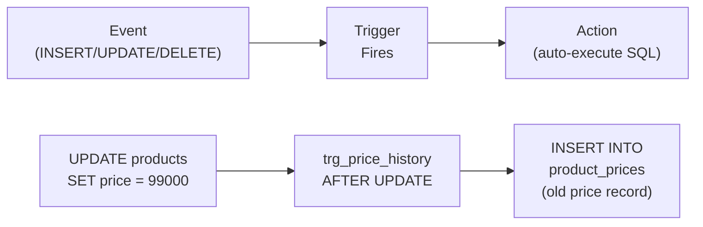

# 강의 24: 트리거(Triggers)

**트리거(Trigger)**는 특정 테이블에서 데이터 변경 이벤트(`INSERT`, `UPDATE`, `DELETE`)가 발생할 때 SQL 블록을 자동으로 실행하는 데이터베이스 객체입니다. 트리거는 비즈니스 규칙을 강제하고, 감사 로그(Audit Trail)를 유지하며, 파생 데이터를 동기화합니다. 이 모든 것을 애플리케이션 코드 없이 처리할 수 있습니다.



> 트리거는 테이블에 이벤트(INSERT/UPDATE/DELETE)가 발생하면 자동으로 SQL을 실행합니다.

트리거 문법은 데이터베이스마다 크게 다릅니다. SQLite는 가장 간단하고, MySQL은 `DELIMITER` 변경이 필요하며, PostgreSQL은 별도의 함수를 먼저 만들어야 합니다.

## 트리거 문법

=== "SQLite"
    ```sql
    CREATE TRIGGER trigger_name
        BEFORE | AFTER | INSTEAD OF
        INSERT | UPDATE | DELETE
        ON table_name
        [WHEN condition]
    BEGIN
        -- SQL statements;
    END;
    ```

=== "MySQL"
    ```sql
    DELIMITER //
    CREATE TRIGGER trigger_name
        BEFORE | AFTER
        INSERT | UPDATE | DELETE
        ON table_name
        FOR EACH ROW
    BEGIN
        -- SQL statements;
    END //
    DELIMITER ;
    ```

=== "PostgreSQL"
    ```sql
    -- Step 1: Create a trigger function
    CREATE OR REPLACE FUNCTION trigger_function_name()
    RETURNS TRIGGER AS $$
    BEGIN
        -- SQL statements;
        RETURN NEW;  -- or RETURN OLD for DELETE triggers
    END;
    $$ LANGUAGE plpgsql;

    -- Step 2: Attach the function to a trigger
    CREATE TRIGGER trigger_name
        BEFORE | AFTER
        INSERT | UPDATE | DELETE
        ON table_name
        FOR EACH ROW
        EXECUTE FUNCTION trigger_function_name();
    ```

- `BEFORE` -- 행이 변경되기 전에 실행 (유효성 검사나 값 수정에 사용)
- `AFTER` -- 행이 변경된 후에 실행 (로깅과 연쇄 처리에 사용)
- `NEW` -- 삽입되는 행 또는 UPDATE 후의 새 값을 가리킴
- `OLD` -- 삭제되는 행 또는 UPDATE 전의 이전 값을 가리킴

## 기본 제공 트리거

이 데이터베이스에는 5개의 트리거가 미리 포함되어 있습니다. 다음으로 확인하세요:

=== "SQLite"
    ```sql
    -- 모든 트리거 목록
    SELECT name, tbl_name, sql
    FROM sqlite_master
    WHERE type = 'trigger'
    ORDER BY name;
    ```

=== "MySQL"
    ```sql
    -- 모든 트리거 목록
    SELECT TRIGGER_NAME, EVENT_OBJECT_TABLE, ACTION_STATEMENT
    FROM INFORMATION_SCHEMA.TRIGGERS
    WHERE TRIGGER_SCHEMA = DATABASE()
    ORDER BY TRIGGER_NAME;
    ```

=== "PostgreSQL"
    ```sql
    -- 모든 트리거 목록
    SELECT tgname, relname, pg_get_triggerdef(t.oid)
    FROM pg_trigger t
    JOIN pg_class c ON t.tgrelid = c.oid
    WHERE NOT t.tgisinternal
    ORDER BY tgname;
    ```

| 트리거 | 테이블 | 실행 시점 | 목적 |
|---------|-------|----------|---------|
| `trg_update_product_timestamp` | products | AFTER UPDATE | `updated_at = datetime('now')` 자동 설정 |
| `trg_update_customer_timestamp` | customers | AFTER UPDATE | `updated_at = datetime('now')` 자동 설정 |
| `trg_earn_points_on_order` | orders | AFTER INSERT | 새 주문 삽입 시 적립 포인트 부여 |
| `trg_adjust_stock_on_order` | order_items | AFTER INSERT | 주문 아이템 삽입 시 `products.stock_qty` 감소 |
| `trg_restore_stock_on_cancel` | orders | AFTER UPDATE | 주문 취소 시 `products.stock_qty` 복원 |

## 트리거 정의 확인

=== "SQLite"
    ```sql
    -- 특정 트리거의 전체 SQL 확인
    SELECT sql
    FROM sqlite_master
    WHERE type = 'trigger'
      AND name = 'trg_adjust_stock_on_order';
    ```

=== "MySQL"
    ```sql
    -- 특정 트리거의 전체 SQL 확인
    SHOW CREATE TRIGGER trg_adjust_stock_on_order;
    ```

=== "PostgreSQL"
    ```sql
    -- 특정 트리거의 전체 SQL 확인
    SELECT pg_get_triggerdef(oid)
    FROM pg_trigger
    WHERE tgname = 'trg_adjust_stock_on_order';
    ```

**결과:**

```sql
CREATE TRIGGER trg_adjust_stock_on_order
AFTER INSERT ON order_items
BEGIN
    UPDATE products
    SET stock_qty  = stock_qty - NEW.quantity,
        updated_at = datetime('now')
    WHERE id = NEW.product_id;
END
```

`order_items`에 행이 삽입될 때마다 이 트리거가 해당 상품의 재고를 자동으로 차감합니다.

=== "SQLite"
    ```sql
    -- 포인트 트리거 확인
    SELECT sql
    FROM sqlite_master
    WHERE type = 'trigger'
      AND name = 'trg_earn_points_on_order';
    ```

=== "MySQL"
    ```sql
    -- 포인트 트리거 확인
    SHOW CREATE TRIGGER trg_earn_points_on_order;
    ```

=== "PostgreSQL"
    ```sql
    -- 포인트 트리거 확인
    SELECT pg_get_triggerdef(oid)
    FROM pg_trigger
    WHERE tgname = 'trg_earn_points_on_order';
    ```

**결과:**

```sql
CREATE TRIGGER trg_earn_points_on_order
AFTER INSERT ON orders
BEGIN
    UPDATE customers
    SET point_balance = point_balance + NEW.point_earned,
        updated_at    = datetime('now')
    WHERE id = NEW.customer_id;
END
```

## 트리거 동작 확인

변경 전후 상태를 관찰하여 트리거가 제대로 동작하는지 확인할 수 있습니다:

```sql
-- 상품 5의 현재 재고 확인
SELECT id, name, stock_qty FROM products WHERE id = 5;
-- 결과: stock_qty = 42

-- 주문 아이템 삽입 (트리거 자동 실행)
INSERT INTO order_items (order_id, product_id, quantity, unit_price, total_price)
VALUES (99999, 5, 3, 99.99, 299.97);

-- 재고 재확인 — 42 - 3 = 39 가 되어야 함
SELECT id, name, stock_qty FROM products WHERE id = 5;
-- 결과: stock_qty = 39
```

## 새 트리거 작성하기

=== "SQLite"
    ```sql
    -- Audit table for price changes
    CREATE TABLE IF NOT EXISTS price_change_log (
        id          INTEGER PRIMARY KEY AUTOINCREMENT,
        product_id  INTEGER,
        old_price   REAL,
        new_price   REAL,
        changed_at  TEXT DEFAULT (datetime('now'))
    );

    -- Trigger
    CREATE TRIGGER IF NOT EXISTS trg_log_price_change
    AFTER UPDATE OF price ON products
    WHEN OLD.price <> NEW.price
    BEGIN
        INSERT INTO price_change_log (product_id, old_price, new_price)
        VALUES (NEW.id, OLD.price, NEW.price);
    END;
    ```

=== "MySQL"
    ```sql
    -- Audit table for price changes
    CREATE TABLE IF NOT EXISTS price_change_log (
        id          INT AUTO_INCREMENT PRIMARY KEY,
        product_id  INT,
        old_price   DECIMAL(10,2),
        new_price   DECIMAL(10,2),
        changed_at  DATETIME DEFAULT NOW()
    );

    -- Trigger
    DELIMITER //
    CREATE TRIGGER trg_log_price_change
    AFTER UPDATE ON products
    FOR EACH ROW
    BEGIN
        IF OLD.price <> NEW.price THEN
            INSERT INTO price_change_log (product_id, old_price, new_price)
            VALUES (NEW.id, OLD.price, NEW.price);
        END IF;
    END //
    DELIMITER ;
    ```

=== "PostgreSQL"
    ```sql
    -- Audit table for price changes
    CREATE TABLE IF NOT EXISTS price_change_log (
        id          SERIAL PRIMARY KEY,
        product_id  INTEGER,
        old_price   NUMERIC(10,2),
        new_price   NUMERIC(10,2),
        changed_at  TIMESTAMP DEFAULT NOW()
    );

    -- Trigger function
    CREATE OR REPLACE FUNCTION fn_log_price_change()
    RETURNS TRIGGER AS $$
    BEGIN
        IF OLD.price <> NEW.price THEN
            INSERT INTO price_change_log (product_id, old_price, new_price)
            VALUES (NEW.id, OLD.price, NEW.price);
        END IF;
        RETURN NEW;
    END;
    $$ LANGUAGE plpgsql;

    -- Trigger
    CREATE TRIGGER trg_log_price_change
    AFTER UPDATE OF price ON products
    FOR EACH ROW
    EXECUTE FUNCTION fn_log_price_change();
    ```

이제 가격 변경이 있을 때마다 자동으로 기록됩니다:

```sql
UPDATE products SET price = 1349.99 WHERE id = 1;

SELECT * FROM price_change_log;
-- product_id=1, old_price=1299.99, new_price=1349.99
```

## 트리거 삭제

```sql
DROP TRIGGER IF EXISTS trg_log_price_change;
DROP TABLE IF EXISTS price_change_log;
```

## 트리거 사용 가이드

| 권장 사용 | 피해야 할 사용 |
|----------|-------|
| 감사 로그 | 복잡한 비즈니스 로직 (디버깅이 어려움) |
| `updated_at` 타임스탬프 유지 | 트리거가 다른 트리거를 과도하게 호출하는 경우 |
| 파생 데이터 연쇄 처리 (재고, 포인트) | 애플리케이션 수준 유효성 검사 대체 |
| 비정규화 요약 데이터 유지 | 쓰기 성능이 중요한 경로 |

!!! note "레슨 복습 문제"
    이 레슨에서 배운 개념을 바로 확인하는 간단한 문제입니다. 여러 개념을 종합하는 실전 연습은 [연습 문제](../exercises/index.md) 섹션을 참고하세요.

## 연습 문제
### 연습 1
시스템 카탈로그에서 `trg_earn_points_on_order` 트리거의 전체 SQL 정의를 조회하세요. 이 트리거가 어떤 테이블에서 어떤 이벤트 발생 시 작동하는지, 그리고 어떤 테이블을 수정하는지 설명하세요.

??? success "정답"
    === "SQLite"
        ```sql
        SELECT sql
        FROM sqlite_master
        WHERE type = 'trigger'
          AND name = 'trg_earn_points_on_order';
        ```

    === "MySQL"
        ```sql
        SHOW CREATE TRIGGER trg_earn_points_on_order;
        ```

    === "PostgreSQL"
        ```sql
        SELECT pg_get_triggerdef(oid)
        FROM pg_trigger
        WHERE tgname = 'trg_earn_points_on_order';
        ```
    이 트리거는 `orders` 테이블에 새 행이 INSERT될 때 작동하며, `customers` 테이블의 `point_balance`를 `NEW.point_earned` 만큼 증가시킵니다.


### 연습 2
WHEN 조건을 사용하여, 상품 가격이 100만원 이상으로 변경될 때만 로그를 남기는 트리거 `trg_log_expensive_price_change`를 작성하세요. `price_change_log` 테이블이 이미 있다고 가정합니다.

??? success "정답"
    === "SQLite"
        ```sql
        CREATE TRIGGER IF NOT EXISTS trg_log_expensive_price_change
        AFTER UPDATE OF price ON products
        WHEN NEW.price >= 1000000 AND OLD.price <> NEW.price
        BEGIN
            INSERT INTO price_change_log (product_id, old_price, new_price)
            VALUES (NEW.id, OLD.price, NEW.price);
        END;
        ```

    === "MySQL"
        ```sql
        DELIMITER //
        CREATE TRIGGER trg_log_expensive_price_change
        AFTER UPDATE ON products
        FOR EACH ROW
        BEGIN
            IF NEW.price >= 1000000 AND OLD.price <> NEW.price THEN
                INSERT INTO price_change_log (product_id, old_price, new_price)
                VALUES (NEW.id, OLD.price, NEW.price);
            END IF;
        END //
        DELIMITER ;
        ```

    === "PostgreSQL"
        ```sql
        CREATE OR REPLACE FUNCTION fn_log_expensive_price_change()
        RETURNS TRIGGER AS $$
        BEGIN
            IF NEW.price >= 1000000 AND OLD.price <> NEW.price THEN
                INSERT INTO price_change_log (product_id, old_price, new_price)
                VALUES (NEW.id, OLD.price, NEW.price);
            END IF;
            RETURN NEW;
        END;
        $$ LANGUAGE plpgsql;

        CREATE TRIGGER trg_log_expensive_price_change
        AFTER UPDATE OF price ON products
        FOR EACH ROW
        EXECUTE FUNCTION fn_log_expensive_price_change();
        ```


### 연습 3
리뷰가 새로 등록될 때 해당 리뷰의 `created_at`을 현재 시각으로 자동 설정하는 AFTER INSERT 트리거 `trg_review_created_at`을 작성하세요.

??? success "정답"
    === "SQLite"
        ```sql
        CREATE TRIGGER IF NOT EXISTS trg_review_created_at
        AFTER INSERT ON reviews
        WHEN NEW.created_at IS NULL
        BEGIN
            UPDATE reviews
            SET created_at = datetime('now')
            WHERE id = NEW.id;
        END;
        ```

    === "MySQL"
        ```sql
        DELIMITER //
        CREATE TRIGGER trg_review_created_at
        BEFORE INSERT ON reviews
        FOR EACH ROW
        BEGIN
            IF NEW.created_at IS NULL THEN
                SET NEW.created_at = NOW();
            END IF;
        END //
        DELIMITER ;
        ```

    === "PostgreSQL"
        ```sql
        CREATE OR REPLACE FUNCTION fn_review_created_at()
        RETURNS TRIGGER AS $$
        BEGIN
            IF NEW.created_at IS NULL THEN
                NEW.created_at := NOW();
            END IF;
            RETURN NEW;
        END;
        $$ LANGUAGE plpgsql;

        CREATE TRIGGER trg_review_created_at
        BEFORE INSERT ON reviews
        FOR EACH ROW
        EXECUTE FUNCTION fn_review_created_at();
        ```


### 연습 4
시스템 카탈로그(SQLite의 경우 `sqlite_master`)를 사용하여 5개의 기본 제공 트리거를 모두 나열하세요. 각 트리거에 대해 이름, 대상 테이블, 그리고 트리거 정의에서 `INSERT`, `UPDATE`, `DELETE` 중 어느 시점에 실행되는지를 표시하세요.

??? success "정답"
    === "SQLite"
        ```sql
        SELECT
            name,
            tbl_name,
            CASE
                WHEN sql LIKE '%AFTER INSERT%'  THEN 'AFTER INSERT'
                WHEN sql LIKE '%AFTER UPDATE%'  THEN 'AFTER UPDATE'
                WHEN sql LIKE '%AFTER DELETE%'  THEN 'AFTER DELETE'
                WHEN sql LIKE '%BEFORE INSERT%' THEN 'BEFORE INSERT'
                WHEN sql LIKE '%BEFORE UPDATE%' THEN 'BEFORE UPDATE'
                WHEN sql LIKE '%BEFORE DELETE%' THEN 'BEFORE DELETE'
            END AS fires_on
        FROM sqlite_master
        WHERE type = 'trigger'
        ORDER BY name;
        ```

        **결과 (예시):**

        | name                      | tbl_name  | fires_on     |
        | ------------------------- | --------- | ------------ |
        | trg_customers_updated_at  | customers | AFTER UPDATE |
        | trg_orders_updated_at     | orders    | AFTER UPDATE |
        | trg_product_price_history | products  | AFTER UPDATE |
        | trg_products_updated_at   | products  | AFTER UPDATE |
        | trg_reviews_updated_at    | reviews   | AFTER UPDATE |


    === "MySQL"
        ```sql
        SELECT
            TRIGGER_NAME,
            EVENT_OBJECT_TABLE,
            CONCAT(ACTION_TIMING, ' ', EVENT_MANIPULATION) AS fires_on
        FROM INFORMATION_SCHEMA.TRIGGERS
        WHERE TRIGGER_SCHEMA = DATABASE()
        ORDER BY TRIGGER_NAME;
        ```

    === "PostgreSQL"
        ```sql
        SELECT
            tgname,
            relname,
            CASE
                WHEN tgtype & 2  > 0 THEN 'BEFORE'
                WHEN tgtype & 64 > 0 THEN 'INSTEAD OF'
                ELSE 'AFTER'
            END || ' ' ||
            CASE
                WHEN tgtype & 4  > 0 THEN 'INSERT'
                WHEN tgtype & 8  > 0 THEN 'DELETE'
                WHEN tgtype & 16 > 0 THEN 'UPDATE'
            END AS fires_on
        FROM pg_trigger t
        JOIN pg_class c ON t.tgrelid = c.oid
        WHERE NOT t.tgisinternal
        ORDER BY tgname;
        ```


### 연습 5
직원이 삭제되기 전에 해당 직원이 담당 중인 주문이 있는지 확인하고, 있으면 삭제를 방지하는 BEFORE DELETE 트리거 `trg_prevent_staff_delete`를 작성하세요.

??? success "정답"
    === "SQLite"
        ```sql
        CREATE TRIGGER IF NOT EXISTS trg_prevent_staff_delete
        BEFORE DELETE ON staff
        WHEN (SELECT COUNT(*) FROM orders WHERE staff_id = OLD.id AND status NOT IN ('delivered', 'cancelled')) > 0
        BEGIN
            SELECT RAISE(ABORT, '담당 중인 주문이 있어 삭제할 수 없습니다.');
        END;
        ```

    === "MySQL"
        ```sql
        DELIMITER //
        CREATE TRIGGER trg_prevent_staff_delete
        BEFORE DELETE ON staff
        FOR EACH ROW
        BEGIN
            DECLARE active_orders INT;
            SELECT COUNT(*) INTO active_orders
            FROM orders
            WHERE staff_id = OLD.id
              AND status NOT IN ('delivered', 'cancelled');
            IF active_orders > 0 THEN
                SIGNAL SQLSTATE '45000'
                SET MESSAGE_TEXT = 'Cannot delete staff with active orders.';
            END IF;
        END //
        DELIMITER ;
        ```

    === "PostgreSQL"
        ```sql
        CREATE OR REPLACE FUNCTION fn_prevent_staff_delete()
        RETURNS TRIGGER AS $$
        BEGIN
            IF (SELECT COUNT(*) FROM orders WHERE staff_id = OLD.id AND status NOT IN ('delivered', 'cancelled')) > 0 THEN
                RAISE EXCEPTION 'Cannot delete staff with active orders.';
            END IF;
            RETURN OLD;
        END;
        $$ LANGUAGE plpgsql;

        CREATE TRIGGER trg_prevent_staff_delete
        BEFORE DELETE ON staff
        FOR EACH ROW
        EXECUTE FUNCTION fn_prevent_staff_delete();
        ```


### 연습 6
고객 등급(`grade`)이 변경될 때 변경 이력을 기록하는 감사 로그를 구현하세요. 먼저 `grade_change_log` 테이블을 만들고(`customer_id`, `old_grade`, `new_grade`, `changed_at`), 이후 `customers` 테이블에 AFTER UPDATE 트리거를 작성하세요. `OLD`와 `NEW`를 사용하여 이전/이후 등급을 기록합니다.

??? success "정답"
    === "SQLite"
        ```sql
        CREATE TABLE IF NOT EXISTS grade_change_log (
            id          INTEGER PRIMARY KEY AUTOINCREMENT,
            customer_id INTEGER,
            old_grade   TEXT,
            new_grade   TEXT,
            changed_at  TEXT DEFAULT (datetime('now'))
        );

        CREATE TRIGGER IF NOT EXISTS trg_log_grade_change
        AFTER UPDATE OF grade ON customers
        WHEN OLD.grade <> NEW.grade
        BEGIN
            INSERT INTO grade_change_log (customer_id, old_grade, new_grade)
            VALUES (NEW.id, OLD.grade, NEW.grade);
        END;
        ```

    === "MySQL"
        ```sql
        CREATE TABLE IF NOT EXISTS grade_change_log (
            id          INT AUTO_INCREMENT PRIMARY KEY,
            customer_id INT,
            old_grade   VARCHAR(20),
            new_grade   VARCHAR(20),
            changed_at  DATETIME DEFAULT NOW()
        );

        DELIMITER //
        CREATE TRIGGER trg_log_grade_change
        AFTER UPDATE ON customers
        FOR EACH ROW
        BEGIN
            IF OLD.grade <> NEW.grade THEN
                INSERT INTO grade_change_log (customer_id, old_grade, new_grade)
                VALUES (NEW.id, OLD.grade, NEW.grade);
            END IF;
        END //
        DELIMITER ;
        ```

    === "PostgreSQL"
        ```sql
        CREATE TABLE IF NOT EXISTS grade_change_log (
            id          SERIAL PRIMARY KEY,
            customer_id INTEGER,
            old_grade   VARCHAR(20),
            new_grade   VARCHAR(20),
            changed_at  TIMESTAMP DEFAULT NOW()
        );

        CREATE OR REPLACE FUNCTION fn_log_grade_change()
        RETURNS TRIGGER AS $$
        BEGIN
            IF OLD.grade <> NEW.grade THEN
                INSERT INTO grade_change_log (customer_id, old_grade, new_grade)
                VALUES (NEW.id, OLD.grade, NEW.grade);
            END IF;
            RETURN NEW;
        END;
        $$ LANGUAGE plpgsql;

        CREATE TRIGGER trg_log_grade_change
        AFTER UPDATE OF grade ON customers
        FOR EACH ROW
        EXECUTE FUNCTION fn_log_grade_change();
        ```


### 연습 7
연습 3~6에서 만든 트리거와 테이블을 모두 삭제하여 원래 상태로 복원하세요.

??? success "정답"
    === "SQLite"
        ```sql
        DROP TRIGGER IF EXISTS trg_review_created_at;
        DROP TRIGGER IF EXISTS trg_log_grade_change;
        DROP TRIGGER IF EXISTS trg_prevent_staff_delete;
        DROP TRIGGER IF EXISTS trg_log_expensive_price_change;
        DROP TABLE IF EXISTS grade_change_log;
        ```

    === "MySQL"
        ```sql
        DROP TRIGGER IF EXISTS trg_review_created_at;
        DROP TRIGGER IF EXISTS trg_log_grade_change;
        DROP TRIGGER IF EXISTS trg_prevent_staff_delete;
        DROP TRIGGER IF EXISTS trg_log_expensive_price_change;
        DROP TABLE IF EXISTS grade_change_log;
        ```

    === "PostgreSQL"
        ```sql
        DROP TRIGGER IF EXISTS trg_review_created_at ON reviews;
        DROP TRIGGER IF EXISTS trg_log_grade_change ON customers;
        DROP TRIGGER IF EXISTS trg_prevent_staff_delete ON staff;
        DROP TRIGGER IF EXISTS trg_log_expensive_price_change ON products;
        DROP FUNCTION IF EXISTS fn_review_created_at();
        DROP FUNCTION IF EXISTS fn_log_grade_change();
        DROP FUNCTION IF EXISTS fn_prevent_staff_delete();
        DROP FUNCTION IF EXISTS fn_log_expensive_price_change();
        DROP TABLE IF EXISTS grade_change_log;
        ```


### 연습 8
시스템 카탈로그(SQLite의 경우 `sqlite_master`)에서 `trg_restore_stock_on_cancel` 트리거의 정의를 조회하세요. 이후 취소된 주문에 포함된 상품의 재고를 조회하여, 취소 시점에 재고가 올바르게 복원됐는지 확인하세요.

??? success "정답"
    === "SQLite"
        ```sql
        -- 1단계: 트리거 정의 확인
        SELECT sql
        FROM sqlite_master
        WHERE type = 'trigger'
          AND name = 'trg_restore_stock_on_cancel';

        -- 2단계: 취소된 주문과 해당 상품 확인
        SELECT o.id AS order_id, oi.product_id, oi.quantity, p.stock_qty
        FROM orders AS o
        INNER JOIN order_items AS oi ON oi.order_id = o.id
        INNER JOIN products    AS p  ON p.id = oi.product_id
        WHERE o.status = 'cancelled'
        LIMIT 5;
        -- stock_qty에는 복원된 수량이 이미 반영되어 있어야 함
        ```

    === "MySQL"
        ```sql
        -- 1단계: 트리거 정의 확인
        SHOW CREATE TRIGGER trg_restore_stock_on_cancel;

        -- 2단계: 취소된 주문과 해당 상품 확인
        SELECT o.id AS order_id, oi.product_id, oi.quantity, p.stock_qty
        FROM orders AS o
        INNER JOIN order_items AS oi ON oi.order_id = o.id
        INNER JOIN products    AS p  ON p.id = oi.product_id
        WHERE o.status = 'cancelled'
        LIMIT 5;
        -- stock_qty에는 복원된 수량이 이미 반영되어 있어야 함
        ```

    === "PostgreSQL"
        ```sql
        -- 1단계: 트리거 정의 확인
        SELECT pg_get_triggerdef(oid)
        FROM pg_trigger
        WHERE tgname = 'trg_restore_stock_on_cancel';

        -- 2단계: 취소된 주문과 해당 상품 확인
        SELECT o.id AS order_id, oi.product_id, oi.quantity, p.stock_qty
        FROM orders AS o
        INNER JOIN order_items AS oi ON oi.order_id = o.id
        INNER JOIN products    AS p  ON p.id = oi.product_id
        WHERE o.status = 'cancelled'
        LIMIT 5;
        -- stock_qty에는 복원된 수량이 이미 반영되어 있어야 함
        ```


### 연습 9
주문 금액이 500만원 이상인 주문이 들어올 때 `high_value_orders_log` 테이블에 기록하는 AFTER INSERT 트리거 `trg_log_high_value_order`를 작성하세요. 먼저 로그 테이블(`order_id`, `total_amount`, `logged_at`)을 만드세요.

??? success "정답"
    === "SQLite"
        ```sql
        CREATE TABLE IF NOT EXISTS high_value_orders_log (
            id           INTEGER PRIMARY KEY AUTOINCREMENT,
            order_id     INTEGER,
            total_amount REAL,
            logged_at    TEXT DEFAULT (datetime('now'))
        );

        CREATE TRIGGER IF NOT EXISTS trg_log_high_value_order
        AFTER INSERT ON orders
        WHEN NEW.total_amount >= 5000000
        BEGIN
            INSERT INTO high_value_orders_log (order_id, total_amount)
            VALUES (NEW.id, NEW.total_amount);
        END;
        ```

    === "MySQL"
        ```sql
        CREATE TABLE IF NOT EXISTS high_value_orders_log (
            id           INT AUTO_INCREMENT PRIMARY KEY,
            order_id     INT,
            total_amount DECIMAL(12,2),
            logged_at    DATETIME DEFAULT NOW()
        );

        DELIMITER //
        CREATE TRIGGER trg_log_high_value_order
        AFTER INSERT ON orders
        FOR EACH ROW
        BEGIN
            IF NEW.total_amount >= 5000000 THEN
                INSERT INTO high_value_orders_log (order_id, total_amount)
                VALUES (NEW.id, NEW.total_amount);
            END IF;
        END //
        DELIMITER ;
        ```

    === "PostgreSQL"
        ```sql
        CREATE TABLE IF NOT EXISTS high_value_orders_log (
            id           SERIAL PRIMARY KEY,
            order_id     INTEGER,
            total_amount NUMERIC(12,2),
            logged_at    TIMESTAMP DEFAULT NOW()
        );

        CREATE OR REPLACE FUNCTION fn_log_high_value_order()
        RETURNS TRIGGER AS $$
        BEGIN
            IF NEW.total_amount >= 5000000 THEN
                INSERT INTO high_value_orders_log (order_id, total_amount)
                VALUES (NEW.id, NEW.total_amount);
            END IF;
            RETURN NEW;
        END;
        $$ LANGUAGE plpgsql;

        CREATE TRIGGER trg_log_high_value_order
        AFTER INSERT ON orders
        FOR EACH ROW
        EXECUTE FUNCTION fn_log_high_value_order();
        ```


### 연습 10
연습 9에서 만든 트리거와 테이블, 그리고 연습 2에서 만든 `trg_log_expensive_price_change`를 포함하여 이번 강의에서 만든 모든 트리거/테이블을 삭제하여 원래 상태로 복원하세요. 삭제 후 시스템 카탈로그로 사용자 정의 트리거가 남아있지 않은지 확인하세요.

??? success "정답"
    === "SQLite"
        ```sql
        -- 연습에서 만든 트리거 삭제
        DROP TRIGGER IF EXISTS trg_log_high_value_order;
        DROP TRIGGER IF EXISTS trg_review_created_at;
        DROP TRIGGER IF EXISTS trg_log_grade_change;
        DROP TRIGGER IF EXISTS trg_prevent_staff_delete;
        DROP TRIGGER IF EXISTS trg_log_expensive_price_change;

        -- 연습에서 만든 테이블 삭제
        DROP TABLE IF EXISTS high_value_orders_log;
        DROP TABLE IF EXISTS grade_change_log;

        -- 기본 제공 트리거만 남았는지 확인
        SELECT name, tbl_name FROM sqlite_master
        WHERE type = 'trigger'
        ORDER BY name;
        ```

    === "MySQL"
        ```sql
        DROP TRIGGER IF EXISTS trg_log_high_value_order;
        DROP TRIGGER IF EXISTS trg_review_created_at;
        DROP TRIGGER IF EXISTS trg_log_grade_change;
        DROP TRIGGER IF EXISTS trg_prevent_staff_delete;
        DROP TRIGGER IF EXISTS trg_log_expensive_price_change;
        DROP TABLE IF EXISTS high_value_orders_log;
        DROP TABLE IF EXISTS grade_change_log;

        SELECT TRIGGER_NAME, EVENT_OBJECT_TABLE
        FROM INFORMATION_SCHEMA.TRIGGERS
        WHERE TRIGGER_SCHEMA = DATABASE()
        ORDER BY TRIGGER_NAME;
        ```

    === "PostgreSQL"
        ```sql
        DROP TRIGGER IF EXISTS trg_log_high_value_order ON orders;
        DROP TRIGGER IF EXISTS trg_review_created_at ON reviews;
        DROP TRIGGER IF EXISTS trg_log_grade_change ON customers;
        DROP TRIGGER IF EXISTS trg_prevent_staff_delete ON staff;
        DROP TRIGGER IF EXISTS trg_log_expensive_price_change ON products;
        DROP FUNCTION IF EXISTS fn_log_high_value_order();
        DROP FUNCTION IF EXISTS fn_review_created_at();
        DROP FUNCTION IF EXISTS fn_log_grade_change();
        DROP FUNCTION IF EXISTS fn_prevent_staff_delete();
        DROP FUNCTION IF EXISTS fn_log_expensive_price_change();
        DROP TABLE IF EXISTS high_value_orders_log;
        DROP TABLE IF EXISTS grade_change_log;

        SELECT tgname, relname
        FROM pg_trigger t
        JOIN pg_class c ON t.tgrelid = c.oid
        WHERE NOT t.tgisinternal
        ORDER BY tgname;
        ```


### 채점 가이드

| 점수 | 다음 단계 |
|:----:|----------|
| **9~10개** | [강의 25: JSON](25-json.md)으로 이동 |
| **7~8개** | 틀린 문제 해설을 복습한 뒤 다음 강의로 |
| **절반 이하** | 이 강의를 다시 읽어보세요 |
| **3개 이하** | [강의 23: 인덱스](23-indexes.md)부터 다시 시작하세요 |

**문제별 영역:**

| 영역 | 해당 문제 |
|------|:--------:|
| 시스템 카탈로그 (트리거 조회) | 1, 4, 8 |
| WHEN 조건부 트리거 | 2, 9 |
| AFTER INSERT 트리거 | 3 |
| BEFORE DELETE 방지 트리거 | 5 |
| 감사 로그 (AFTER UPDATE) | 6 |
| 정리 (DROP TRIGGER) | 7, 10 |

---
다음: [강의 25: JSON 데이터 쿼리](25-json.md)
