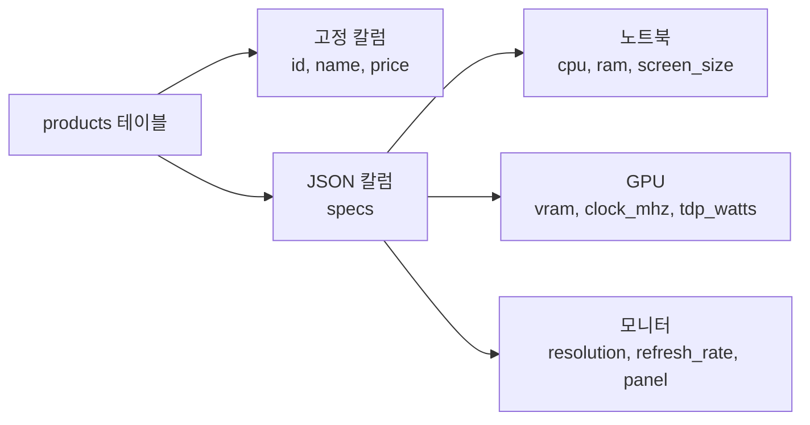

# 강의 25: JSON 데이터 쿼리

관계형 데이터베이스는 고정된 스키마로 데이터를 관리합니다. 하지만 상품 사양처럼 카테고리마다 속성이 다른 데이터는 어떻게 저장할까요? 노트북에는 `screen_size`, `cpu`, `battery_hours`가 필요하고, 그래픽카드에는 `vram`, `clock_mhz`, `tdp_watts`가 필요합니다. 카테고리마다 칼럼을 따로 만들면 테이블이 수십 개의 NULL 칼럼으로 채워집니다.

**JSON 칼럼**은 이 문제를 해결합니다. 스키마를 변경하지 않고도 유연한 속성을 저장할 수 있습니다.



> `products.specs` 칼럼은 TEXT 타입이지만 JSON 문자열을 저장합니다. SQL 함수로 JSON 내부 값을 추출하고 필터링할 수 있습니다.

## products.specs 칼럼

이 데이터베이스의 `products` 테이블에는 `specs` 칼럼이 있습니다. 카테고리별로 저장되는 JSON 구조가 다릅니다:

```sql
-- 노트북 상품의 specs 확인
SELECT name, specs
FROM products
WHERE specs IS NOT NULL
LIMIT 3;
```

**노트북 예시:**
```json
{"screen_size": "15.6 inch", "cpu": "Intel Core i7-13700H", "ram": "16GB", "storage": "512GB SSD", "battery_hours": 10}
```

**GPU 예시:**
```json
{"vram": "16GB", "clock_mhz": 2100, "tdp_watts": 300}
```

**모니터 예시:**
```json
{"screen_size": "27 inch", "resolution": "QHD", "refresh_rate": 144, "panel": "IPS"}
```

## JSON 값 추출

JSON 내부의 특정 키 값을 추출하는 문법은 데이터베이스마다 다릅니다.

=== "SQLite"
    ```sql
    -- json_extract 함수 사용
    SELECT
        name,
        json_extract(specs, '$.cpu')     AS cpu,
        json_extract(specs, '$.ram')     AS ram,
        json_extract(specs, '$.storage') AS storage
    FROM products
    WHERE specs IS NOT NULL
      AND json_extract(specs, '$.cpu') IS NOT NULL
    LIMIT 5;

    -- ->> 연산자 (SQLite 3.38+, 텍스트로 반환)
    SELECT
        name,
        specs->>'$.cpu' AS cpu,
        specs->>'$.ram' AS ram
    FROM products
    WHERE specs IS NOT NULL
      AND specs->>'$.cpu' IS NOT NULL
    LIMIT 5;
    ```

=== "MySQL"
    ```sql
    -- JSON_EXTRACT 함수 사용
    SELECT
        name,
        JSON_EXTRACT(specs, '$.cpu')     AS cpu,
        JSON_EXTRACT(specs, '$.ram')     AS ram,
        JSON_EXTRACT(specs, '$.storage') AS storage
    FROM products
    WHERE specs IS NOT NULL
      AND JSON_EXTRACT(specs, '$.cpu') IS NOT NULL
    LIMIT 5;

    -- ->> 연산자 (따옴표 없는 텍스트로 반환)
    SELECT
        name,
        specs->>'$.cpu' AS cpu,
        specs->>'$.ram' AS ram
    FROM products
    WHERE specs IS NOT NULL
      AND specs->>'$.cpu' IS NOT NULL
    LIMIT 5;
    ```

=== "PostgreSQL"
    ```sql
    -- ->> 연산자 (텍스트로 반환)
    SELECT
        name,
        specs->>'cpu'     AS cpu,
        specs->>'ram'     AS ram,
        specs->>'storage' AS storage
    FROM products
    WHERE specs IS NOT NULL
      AND specs->>'cpu' IS NOT NULL
    LIMIT 5;

    -- jsonb_extract_path_text 함수
    SELECT
        name,
        jsonb_extract_path_text(specs, 'cpu') AS cpu,
        jsonb_extract_path_text(specs, 'ram') AS ram
    FROM products
    WHERE specs IS NOT NULL
      AND jsonb_extract_path_text(specs, 'cpu') IS NOT NULL
    LIMIT 5;
    ```

**핵심 차이점:**

| 기능 | SQLite | MySQL | PostgreSQL |
|------|--------|-------|------------|
| 경로 문법 | `'$.key'` | `'$.key'` | `'key'` |
| 함수 | `json_extract()` | `JSON_EXTRACT()` | `jsonb_extract_path_text()` |
| 텍스트 추출 연산자 | `->>'$.key'` | `->>'$.key'` | `->>'key'` |
| JSON 추출 연산자 | `->'$.key'` | `->'$.key'` | `->'key'` |

> `->` 연산자는 JSON 타입을 반환하고, `->>` 연산자는 텍스트 타입을 반환합니다. WHERE 절에서 비교할 때는 보통 `->>` (텍스트)를 사용합니다.

## JSON WHERE 조건

JSON 값으로 행을 필터링할 수 있습니다.

=== "SQLite"
    ```sql
    -- RAM이 32GB인 상품 찾기
    SELECT name, price, specs->>'$.ram' AS ram
    FROM products
    WHERE specs->>'$.ram' = '32GB';

    -- 배터리 10시간 이상인 노트북
    SELECT name, price, json_extract(specs, '$.battery_hours') AS battery
    FROM products
    WHERE json_extract(specs, '$.battery_hours') >= 10
    ORDER BY json_extract(specs, '$.battery_hours') DESC;
    ```

=== "MySQL"
    ```sql
    -- RAM이 32GB인 상품 찾기
    SELECT name, price, specs->>'$.ram' AS ram
    FROM products
    WHERE specs->>'$.ram' = '32GB';

    -- 배터리 10시간 이상인 노트북
    SELECT name, price, JSON_EXTRACT(specs, '$.battery_hours') AS battery
    FROM products
    WHERE JSON_EXTRACT(specs, '$.battery_hours') >= 10
    ORDER BY JSON_EXTRACT(specs, '$.battery_hours') DESC;
    ```

=== "PostgreSQL"
    ```sql
    -- RAM이 32GB인 상품 찾기
    SELECT name, price, specs->>'ram' AS ram
    FROM products
    WHERE specs->>'ram' = '32GB';

    -- 배터리 10시간 이상인 노트북
    SELECT name, price, (specs->>'battery_hours')::int AS battery
    FROM products
    WHERE (specs->>'battery_hours')::int >= 10
    ORDER BY (specs->>'battery_hours')::int DESC;
    ```

!!! warning "PostgreSQL 타입 캐스팅"
    PostgreSQL에서 `->>` 연산자는 항상 텍스트를 반환합니다. 숫자 비교가 필요하면 `::int`나 `::numeric`으로 명시적 캐스팅이 필요합니다. SQLite와 MySQL은 자동 타입 변환을 합니다.

## JSON 집계

JSON 값을 GROUP BY나 집계 함수에 사용할 수 있습니다.

=== "SQLite"
    ```sql
    -- CPU별 상품 수와 평균 가격
    SELECT
        specs->>'$.cpu' AS cpu,
        COUNT(*)        AS product_count,
        ROUND(AVG(price)) AS avg_price
    FROM products
    WHERE specs->>'$.cpu' IS NOT NULL
    GROUP BY specs->>'$.cpu'
    ORDER BY product_count DESC;
    ```

=== "MySQL"
    ```sql
    -- CPU별 상품 수와 평균 가격
    SELECT
        specs->>'$.cpu' AS cpu,
        COUNT(*)        AS product_count,
        ROUND(AVG(price)) AS avg_price
    FROM products
    WHERE specs->>'$.cpu' IS NOT NULL
    GROUP BY specs->>'$.cpu'
    ORDER BY product_count DESC;
    ```

=== "PostgreSQL"
    ```sql
    -- CPU별 상품 수와 평균 가격
    SELECT
        specs->>'cpu' AS cpu,
        COUNT(*)      AS product_count,
        ROUND(AVG(price)) AS avg_price
    FROM products
    WHERE specs->>'cpu' IS NOT NULL
    GROUP BY specs->>'cpu'
    ORDER BY product_count DESC;
    ```

=== "SQLite"
    ```sql
    -- 해상도별 모니터 평균 가격
    SELECT
        specs->>'$.resolution' AS resolution,
        COUNT(*)               AS cnt,
        ROUND(AVG(price))      AS avg_price,
        MIN(price)             AS min_price,
        MAX(price)             AS max_price
    FROM products
    WHERE specs->>'$.resolution' IS NOT NULL
    GROUP BY specs->>'$.resolution'
    ORDER BY avg_price DESC;
    ```

=== "MySQL"
    ```sql
    -- 해상도별 모니터 평균 가격
    SELECT
        specs->>'$.resolution' AS resolution,
        COUNT(*)               AS cnt,
        ROUND(AVG(price))      AS avg_price,
        MIN(price)             AS min_price,
        MAX(price)             AS max_price
    FROM products
    WHERE specs->>'$.resolution' IS NOT NULL
    GROUP BY specs->>'$.resolution'
    ORDER BY avg_price DESC;
    ```

=== "PostgreSQL"
    ```sql
    -- 해상도별 모니터 평균 가격
    SELECT
        specs->>'resolution' AS resolution,
        COUNT(*)             AS cnt,
        ROUND(AVG(price))    AS avg_price,
        MIN(price)           AS min_price,
        MAX(price)           AS max_price
    FROM products
    WHERE specs->>'resolution' IS NOT NULL
    GROUP BY specs->>'resolution'
    ORDER BY avg_price DESC;
    ```

## JSON 키 목록 조회

JSON 객체에 어떤 키가 있는지 확인하는 방법입니다.

=== "SQLite"
    ```sql
    -- json_each로 JSON의 모든 키 나열
    SELECT DISTINCT j.key
    FROM products, json_each(products.specs) AS j
    WHERE products.specs IS NOT NULL
    ORDER BY j.key;
    ```

=== "MySQL"
    ```sql
    -- JSON_KEYS로 키 배열 반환
    SELECT DISTINCT JSON_KEYS(specs) AS spec_keys
    FROM products
    WHERE specs IS NOT NULL
    LIMIT 10;
    ```

=== "PostgreSQL"
    ```sql
    -- jsonb_object_keys로 키 나열
    SELECT DISTINCT k
    FROM products, jsonb_object_keys(specs) AS k
    WHERE specs IS NOT NULL
    ORDER BY k;
    ```

## JSON 값 수정

기존 JSON 데이터의 특정 키를 변경하거나 새 키를 추가할 수 있습니다.

=== "SQLite"
    ```sql
    -- json_set: 값 수정 (키가 없으면 추가)
    UPDATE products
    SET specs = json_set(specs, '$.ram', '32GB')
    WHERE id = 1;

    -- json_insert: 키가 없을 때만 추가 (있으면 무시)
    UPDATE products
    SET specs = json_insert(specs, '$.color', 'Silver')
    WHERE id = 1;

    -- json_remove: 키 삭제
    UPDATE products
    SET specs = json_remove(specs, '$.color')
    WHERE id = 1;
    ```

=== "MySQL"
    ```sql
    -- JSON_SET: 값 수정 (키가 없으면 추가)
    UPDATE products
    SET specs = JSON_SET(specs, '$.ram', '32GB')
    WHERE id = 1;

    -- JSON_INSERT: 키가 없을 때만 추가 (있으면 무시)
    UPDATE products
    SET specs = JSON_INSERT(specs, '$.color', 'Silver')
    WHERE id = 1;

    -- JSON_REMOVE: 키 삭제
    UPDATE products
    SET specs = JSON_REMOVE(specs, '$.color')
    WHERE id = 1;
    ```

=== "PostgreSQL"
    ```sql
    -- jsonb_set: 값 수정 (세 번째 인자가 true면 키 없을 때 추가)
    UPDATE products
    SET specs = jsonb_set(specs, '{ram}', '"32GB"')
    WHERE id = 1;

    -- || 연산자: 키 추가/병합
    UPDATE products
    SET specs = specs || '{"color": "Silver"}'::jsonb
    WHERE id = 1;

    -- - 연산자: 키 삭제
    UPDATE products
    SET specs = specs - 'color'
    WHERE id = 1;
    ```

**JSON 수정 함수 비교:**

| 동작 | SQLite | MySQL | PostgreSQL |
|------|--------|-------|------------|
| 수정/추가 | `json_set()` | `JSON_SET()` | `jsonb_set()` |
| 추가만 | `json_insert()` | `JSON_INSERT()` | `\|\|` 연산자 |
| 삭제 | `json_remove()` | `JSON_REMOVE()` | `-` 연산자 |

## JSON vs 정규화

JSON 칼럼은 강력하지만 만능은 아닙니다.

| 기준 | JSON 칼럼 | 별도 테이블 (정규화) |
|------|-----------|---------------------|
| **유연성** | 스키마 변경 없이 속성 추가/삭제 | ALTER TABLE 필요 |
| **쿼리 성능** | 인덱스 지원 제한적 | 일반 인덱스, 빠른 조회 |
| **데이터 무결성** | CHECK 제약조건 어려움 | FK, NOT NULL, UNIQUE 가능 |
| **적합한 경우** | 카테고리별 다른 속성, 설정값, 메타데이터 | 자주 검색/조인하는 핵심 데이터 |
| **부적합한 경우** | 매번 JOIN/GROUP BY에 사용하는 칼럼 | 속성이 가변적이고 자주 변하는 경우 |

> **경험 규칙:** WHERE 절이나 JOIN에 자주 사용하는 값이면 정규 칼럼으로 분리하세요. 표시만 하거나 가끔 필터링하는 부가 속성이면 JSON이 적합합니다.

!!! note "레슨 복습 문제"
    이 레슨에서 배운 개념을 바로 확인하는 간단한 문제입니다. 여러 개념을 종합하는 실전 연습은 [연습 문제](../exercises/index.md) 섹션을 참고하세요.

## 연습 문제
### 연습 1
RAM이 `'16GB'`인 상품의 이름, 가격, RAM 값을 조회하세요. 가격 내림차순으로 정렬하세요.

??? success "정답"
    === "SQLite"
        ```sql
        SELECT name, price, specs->>'$.ram' AS ram
        FROM products
        WHERE specs->>'$.ram' = '16GB'
        ORDER BY price DESC;
        ```

        **결과 (예시):**

        | name                                                             | price   | ram  |
        | ---------------------------------------------------------------- | ------: | ---- |
        | ASUS ROG Zephyrus G16                                            | 4284100 | 16GB |
        | ASUS ROG Strix G16CH 화이트                                         | 2988700 | 16GB |
        | HP EliteBook 840 G10 블랙 [특별 한정판 에디션] 무상 보증 3년 연장 + 전용 파우치 증정 이벤트 | 2389100 | 16GB |
        | Razer Blade 18                                                   | 2349600 | 16GB |
        | LG 그램 17 실버                                                      | 2336200 | 16GB |
        | ...                                                              | ...     | ...  |


    === "MySQL"
        ```sql
        SELECT name, price, specs->>'$.ram' AS ram
        FROM products
        WHERE specs->>'$.ram' = '16GB'
        ORDER BY price DESC;
        ```

    === "PostgreSQL"
        ```sql
        SELECT name, price, specs->>'ram' AS ram
        FROM products
        WHERE specs->>'ram' = '16GB'
        ORDER BY price DESC;
        ```


### 연습 2
`products` 테이블에서 `specs` 칼럼이 NULL이 아닌 상품의 이름과 CPU 값을 추출하세요. CPU 값이 있는 상품만 표시하고, 결과를 5건으로 제한하세요.

??? success "정답"
    === "SQLite"
        ```sql
        SELECT name, specs->>'$.cpu' AS cpu
        FROM products
        WHERE specs IS NOT NULL
          AND specs->>'$.cpu' IS NOT NULL
        LIMIT 5;
        ```

        **결과 (예시):**

        | name                     | cpu                  |
        | ------------------------ | -------------------- |
        | Razer Blade 18 블랙        | Apple M3             |
        | LG 일체형PC 27V70Q 실버       | Intel Core i5-13600K |
        | Razer Blade 18 화이트       | Intel Core i9-13900H |
        | 한성 보스몬스터 DX9900 실버       | AMD Ryzen 5 7600X    |
        | ASUS ROG Strix G16CH 화이트 | AMD Ryzen 5 7600X    |


    === "MySQL"
        ```sql
        SELECT name, specs->>'$.cpu' AS cpu
        FROM products
        WHERE specs IS NOT NULL
          AND specs->>'$.cpu' IS NOT NULL
        LIMIT 5;
        ```

    === "PostgreSQL"
        ```sql
        SELECT name, specs->>'cpu' AS cpu
        FROM products
        WHERE specs IS NOT NULL
          AND specs->>'cpu' IS NOT NULL
        LIMIT 5;
        ```


### 연습 3
`specs` 칼럼에 사용된 모든 고유 키(key) 목록을 알파벳 순서로 조회하세요.

??? success "정답"
    === "SQLite"
        ```sql
        SELECT DISTINCT j.key
        FROM products, json_each(products.specs) AS j
        WHERE products.specs IS NOT NULL
        ORDER BY j.key;
        ```

        **결과 (예시):**

        | key             |
        | --------------- |
        | base_clock_ghz  |
        | battery_hours   |
        | boost_clock_ghz |
        | capacity_gb     |
        | clock_mhz       |
        | ...             |


    === "MySQL"
        ```sql
        SELECT DISTINCT jk.key_name
        FROM products,
             JSON_TABLE(
                 JSON_KEYS(specs), '$[*]'
                 COLUMNS (key_name VARCHAR(100) PATH '$')
             ) AS jk
        WHERE specs IS NOT NULL
        ORDER BY jk.key_name;
        ```

    === "PostgreSQL"
        ```sql
        SELECT DISTINCT k
        FROM products, jsonb_object_keys(specs) AS k
        WHERE specs IS NOT NULL
        ORDER BY k;
        ```


### 연습 4
`specs`에 `cpu` 키가 있는 상품 중, 가격이 가장 비싼 상품 3개의 이름, CPU, 가격을 조회하세요.

??? success "정답"
    === "SQLite"
        ```sql
        SELECT name, specs->>'$.cpu' AS cpu, price
        FROM products
        WHERE specs->>'$.cpu' IS NOT NULL
        ORDER BY price DESC
        LIMIT 3;
        ```

        **결과 (예시):**

        | name                  | cpu                  | price   |
        | --------------------- | -------------------- | ------: |
        | ASUS ROG Strix GT35   | Intel Core i7-13700K | 4314800 |
        | ASUS ROG Zephyrus G16 | Apple M3             | 4284100 |
        | Razer Blade 18 블랙     | Intel Core i7-13700H | 4182100 |


    === "MySQL"
        ```sql
        SELECT name, specs->>'$.cpu' AS cpu, price
        FROM products
        WHERE specs->>'$.cpu' IS NOT NULL
        ORDER BY price DESC
        LIMIT 3;
        ```

    === "PostgreSQL"
        ```sql
        SELECT name, specs->>'cpu' AS cpu, price
        FROM products
        WHERE specs->>'cpu' IS NOT NULL
        ORDER BY price DESC
        LIMIT 3;
        ```


### 연습 5
배터리 수명이 12시간 이상인 노트북의 이름, 가격, 배터리 수명을 조회하세요. 배터리 수명 내림차순으로 정렬하세요.

??? success "정답"
    === "SQLite"
        ```sql
        SELECT
            name,
            price,
            json_extract(specs, '$.battery_hours') AS battery_hours
        FROM products
        WHERE json_extract(specs, '$.battery_hours') >= 12
        ORDER BY json_extract(specs, '$.battery_hours') DESC;
        ```

    === "MySQL"
        ```sql
        SELECT
            name,
            price,
            JSON_EXTRACT(specs, '$.battery_hours') AS battery_hours
        FROM products
        WHERE JSON_EXTRACT(specs, '$.battery_hours') >= 12
        ORDER BY JSON_EXTRACT(specs, '$.battery_hours') DESC;
        ```

    === "PostgreSQL"
        ```sql
        SELECT
            name,
            price,
            (specs->>'battery_hours')::int AS battery_hours
        FROM products
        WHERE (specs->>'battery_hours')::int >= 12
        ORDER BY (specs->>'battery_hours')::int DESC;
        ```


### 연습 6
VRAM이 `'16GB'` 이상인 GPU 상품의 이름, 가격, VRAM, TDP(전력 소모)를 조회하세요. TDP 오름차순으로 정렬하세요.

??? success "정답"
    === "SQLite"
        ```sql
        SELECT
            name,
            price,
            specs->>'$.vram'      AS vram,
            json_extract(specs, '$.tdp_watts') AS tdp_watts
        FROM products
        WHERE specs->>'$.vram' IN ('16GB', '24GB')
        ORDER BY json_extract(specs, '$.tdp_watts');
        ```

    === "MySQL"
        ```sql
        SELECT
            name,
            price,
            specs->>'$.vram'      AS vram,
            JSON_EXTRACT(specs, '$.tdp_watts') AS tdp_watts
        FROM products
        WHERE specs->>'$.vram' IN ('16GB', '24GB')
        ORDER BY JSON_EXTRACT(specs, '$.tdp_watts');
        ```

    === "PostgreSQL"
        ```sql
        SELECT
            name,
            price,
            specs->>'vram'      AS vram,
            (specs->>'tdp_watts')::int AS tdp_watts
        FROM products
        WHERE specs->>'vram' IN ('16GB', '24GB')
        ORDER BY (specs->>'tdp_watts')::int;
        ```


### 연습 7
상품 ID 1의 specs에 `"color"` 키를 `"Space Gray"` 값으로 추가하는 UPDATE 문을 작성하세요. 이후 추가된 값을 조회하여 확인하세요.

??? success "정답"
    === "SQLite"
        ```sql
        -- 키 추가
        UPDATE products
        SET specs = json_set(specs, '$.color', 'Space Gray')
        WHERE id = 1;

        -- 확인
        SELECT name, specs->>'$.color' AS color
        FROM products
        WHERE id = 1;
        ```

    === "MySQL"
        ```sql
        -- 키 추가
        UPDATE products
        SET specs = JSON_SET(specs, '$.color', 'Space Gray')
        WHERE id = 1;

        -- 확인
        SELECT name, specs->>'$.color' AS color
        FROM products
        WHERE id = 1;
        ```

    === "PostgreSQL"
        ```sql
        -- 키 추가
        UPDATE products
        SET specs = specs || '{"color": "Space Gray"}'::jsonb
        WHERE id = 1;

        -- 확인
        SELECT name, specs->>'color' AS color
        FROM products
        WHERE id = 1;
        ```


### 연습 8
연습 8에서 추가한 `"color"` 키를 상품 ID 1의 specs에서 삭제하는 UPDATE 문을 작성하세요. 이후 삭제됐는지 확인하세요.

??? success "정답"
    === "SQLite"
        ```sql
        -- 키 삭제
        UPDATE products
        SET specs = json_remove(specs, '$.color')
        WHERE id = 1;

        -- 확인 (NULL이어야 함)
        SELECT name, specs->>'$.color' AS color
        FROM products
        WHERE id = 1;
        ```

    === "MySQL"
        ```sql
        -- 키 삭제
        UPDATE products
        SET specs = JSON_REMOVE(specs, '$.color')
        WHERE id = 1;

        -- 확인 (NULL이어야 함)
        SELECT name, specs->>'$.color' AS color
        FROM products
        WHERE id = 1;
        ```

    === "PostgreSQL"
        ```sql
        -- 키 삭제
        UPDATE products
        SET specs = specs - 'color'
        WHERE id = 1;

        -- 확인 (NULL이어야 함)
        SELECT name, specs->>'color' AS color
        FROM products
        WHERE id = 1;
        ```


### 연습 9
`specs`에 `screen_size` 키가 있는 상품을 화면 크기별로 그룹화하고, 각 그룹의 상품 수와 평균 가격을 조회하세요. 상품 수 내림차순으로 정렬하세요.

??? success "정답"
    === "SQLite"
        ```sql
        SELECT
            specs->>'$.screen_size' AS screen_size,
            COUNT(*)                AS product_count,
            ROUND(AVG(price))       AS avg_price
        FROM products
        WHERE specs->>'$.screen_size' IS NOT NULL
        GROUP BY specs->>'$.screen_size'
        ORDER BY product_count DESC;
        ```

        **결과 (예시):**

        | screen_size | product_count | avg_price |
        | ----------- | ------------: | --------: |
        | 14 inch     |            13 |   2264508 |
        | 27 inch     |            12 |   1167542 |
        | 15.6 inch   |            10 |   1947630 |
        | 32 inch     |             6 |   1001150 |
        | 16 inch     |             6 |   2453700 |
        | ...         | ...           | ...       |


    === "MySQL"
        ```sql
        SELECT
            specs->>'$.screen_size' AS screen_size,
            COUNT(*)                AS product_count,
            ROUND(AVG(price))       AS avg_price
        FROM products
        WHERE specs->>'$.screen_size' IS NOT NULL
        GROUP BY specs->>'$.screen_size'
        ORDER BY product_count DESC;
        ```

    === "PostgreSQL"
        ```sql
        SELECT
            specs->>'screen_size' AS screen_size,
            COUNT(*)              AS product_count,
            ROUND(AVG(price))     AS avg_price
        FROM products
        WHERE specs->>'screen_size' IS NOT NULL
        GROUP BY specs->>'screen_size'
        ORDER BY product_count DESC;
        ```


### 연습 10
모니터 패널 타입(`panel`)별로 상품 수, 평균 주사율(`refresh_rate`), 최대 주사율을 집계하세요.

??? success "정답"
    === "SQLite"
        ```sql
        SELECT
            specs->>'$.panel'                             AS panel,
            COUNT(*)                                      AS product_count,
            ROUND(AVG(json_extract(specs, '$.refresh_rate'))) AS avg_refresh_rate,
            MAX(json_extract(specs, '$.refresh_rate'))    AS max_refresh_rate
        FROM products
        WHERE specs->>'$.panel' IS NOT NULL
        GROUP BY specs->>'$.panel'
        ORDER BY avg_refresh_rate DESC;
        ```

    === "MySQL"
        ```sql
        SELECT
            specs->>'$.panel'                                   AS panel,
            COUNT(*)                                            AS product_count,
            ROUND(AVG(JSON_EXTRACT(specs, '$.refresh_rate')))   AS avg_refresh_rate,
            MAX(JSON_EXTRACT(specs, '$.refresh_rate'))           AS max_refresh_rate
        FROM products
        WHERE specs->>'$.panel' IS NOT NULL
        GROUP BY specs->>'$.panel'
        ORDER BY avg_refresh_rate DESC;
        ```

    === "PostgreSQL"
        ```sql
        SELECT
            specs->>'panel'                                   AS panel,
            COUNT(*)                                          AS product_count,
            ROUND(AVG((specs->>'refresh_rate')::int))         AS avg_refresh_rate,
            MAX((specs->>'refresh_rate')::int)                AS max_refresh_rate
        FROM products
        WHERE specs->>'panel' IS NOT NULL
        GROUP BY specs->>'panel'
        ORDER BY avg_refresh_rate DESC;
        ```


### 채점 가이드

| 점수 | 다음 단계 |
|:----:|----------|
| **9~10개** | [강의 26: 저장 프로시저](26-stored-procedures.md)로 이동 |
| **7~8개** | 틀린 문제 해설을 복습한 뒤 다음 강의로 |
| **절반 이하** | 이 강의를 다시 읽어보세요 |
| **3개 이하** | [강의 24: 트리거](24-triggers.md)부터 다시 시작하세요 |

**문제별 영역:**

| 영역 | 해당 문제 |
|------|:--------:|
| JSON 값 추출 | 1, 4 |
| NULL 체크 + JSON | 2, 5 |
| JSON 키 목록 | 3 |
| JSON 집계 (GROUP BY) | 6, 9, 10 |
| JSON 수정 (추가/삭제) | 7, 8 |

---
다음: [강의 26: 저장 프로시저](26-stored-procedures.md)
