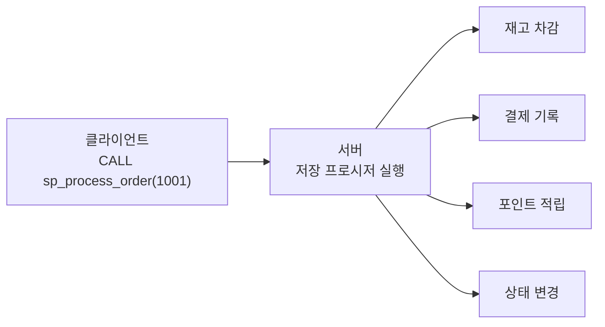

# 26강: 저장 프로시저와 함수

**저장 프로시저(Stored Procedure)**는 데이터베이스 서버에 미리 저장해 두고 필요할 때 호출하는 SQL 블록입니다. 반복적인 작업을 캡슐화하여 **성능**, **보안**, **재사용성**을 동시에 확보할 수 있습니다.



> 저장 프로시저는 여러 SQL 문을 하나의 이름으로 묶어 서버에서 실행합니다. 네트워크 왕복을 줄이고 비즈니스 로직을 중앙에서 관리할 수 있습니다.

**실무에서 저장 프로시저를 사용하는 대표적인 시나리오:**

- **반복 로직 캡슐화:** 주문 처리, 등급 갱신, 정산 등을 SP로 묶어 한 번에 호출
- **권한 분리:** 테이블 직접 접근 없이 SP 실행 권한만 부여
- **트랜잭션 보장:** 여러 테이블 수정을 하나의 원자적 단위로 처리
- **성능:** 컴파일된 실행 계획 재사용 (MySQL/PG)

!!! warning "SQLite 안내"
    SQLite는 저장 프로시저를 지원하지 않습니다. SQLite 환경에서는 **뷰(VIEW)**, **트리거(TRIGGER)**, **애플리케이션 레벨 로직**으로 유사한 효과를 얻을 수 있습니다. 이 강의는 **MySQL**과 **PostgreSQL** 전용입니다.


!!! note "이미 알고 계신다면"
    저장 프로시저와 함수에 익숙하다면 [연습 문제](../exercises/index.md)으로 건너뛰세요.

## 저장 프로시저의 장점

| 장점 | 설명 |
|------|------|
| **성능** | 한 번 파싱/컴파일된 실행 계획을 재사용. 네트워크 왕복 감소 |
| **보안** | 테이블에 직접 접근 권한을 주지 않고 프로시저 실행 권한만 부여 가능 |
| **재사용** | 동일한 비즈니스 로직을 여러 애플리케이션에서 호출 |
| **유지보수** | 로직 변경 시 프로시저만 수정하면 모든 클라이언트에 반영 |

## 프로시저 vs 함수

| 구분 | 프로시저 (Procedure) | 함수 (Function) |
|------|---------------------|-----------------|
| 반환값 | 없거나 OUT 파라미터로 반환 | `RETURNS`로 반드시 반환 |
| SELECT에서 사용 | 불가 | 가능 (`SELECT fn_name(...)`) |
| 호출 방식 | `CALL procedure_name(...)` | `SELECT function_name(...)` |
| 트랜잭션 | 내부에서 COMMIT/ROLLBACK 가능 (MySQL) | 제한적 |

## 기본 문법

=== "MySQL"
    ```sql
    DELIMITER //
    CREATE PROCEDURE procedure_name(
        IN  param1 INT,
        OUT param2 VARCHAR(100)
    )
    BEGIN
        -- SQL statements;
    END //
    DELIMITER ;

    -- 호출
    CALL procedure_name(1, @result);
    SELECT @result;
    ```

=== "PostgreSQL"
    ```sql
    -- 프로시저 (PostgreSQL 11+)
    CREATE OR REPLACE PROCEDURE procedure_name(
        IN  param1 INT,
        INOUT param2 VARCHAR(100)
    )
    LANGUAGE plpgsql
    AS $$
    BEGIN
        -- SQL statements;
    END;
    $$;

    -- 호출
    CALL procedure_name(1, NULL);
    ```

!!! tip "MySQL의 DELIMITER"
    MySQL 클라이언트는 세미콜론(`;`)을 문장 끝으로 인식합니다. 프로시저 본문에도 세미콜론이 포함되므로, 임시로 구분자를 `//`로 변경한 뒤 본문을 작성하고, 마지막에 원래 구분자로 복원합니다.

## 파라미터 종류

| 종류 | 방향 | 설명 |
|------|------|------|
| `IN` | 입력 전용 | 호출 시 값을 전달 (기본값) |
| `OUT` | 출력 전용 | 프로시저 내부에서 값을 설정, 호출자가 받음 |
| `INOUT` | 입출력 | 입력값을 받아 수정 후 반환 |

=== "MySQL"
    ```sql
    DELIMITER //
    CREATE PROCEDURE sp_get_customer_stats(
        IN  p_customer_id INT,
        OUT p_order_count INT,
        OUT p_total_spent DECIMAL(12,2)
    )
    BEGIN
        SELECT COUNT(*), COALESCE(SUM(total_amount), 0)
        INTO p_order_count, p_total_spent
        FROM orders
        WHERE customer_id = p_customer_id
          AND status <> 'cancelled';
    END //
    DELIMITER ;

    -- 호출
    CALL sp_get_customer_stats(100, @cnt, @total);
    SELECT @cnt AS order_count, @total AS total_spent;
    ```

=== "PostgreSQL"
    ```sql
    CREATE OR REPLACE FUNCTION fn_get_customer_stats(
        p_customer_id INT,
        OUT p_order_count INT,
        OUT p_total_spent NUMERIC(12,2)
    )
    LANGUAGE plpgsql
    AS $$
    BEGIN
        SELECT COUNT(*), COALESCE(SUM(total_amount), 0)
        INTO p_order_count, p_total_spent
        FROM orders
        WHERE customer_id = p_customer_id
          AND status <> 'cancelled';
    END;
    $$;

    -- 호출
    SELECT * FROM fn_get_customer_stats(100);
    ```

## 변수와 제어 흐름

### 변수 선언과 할당

=== "MySQL"
    ```sql
    DELIMITER //
    CREATE PROCEDURE sp_classify_customer(
        IN  p_customer_id INT,
        OUT p_grade VARCHAR(20)
    )
    BEGIN
        DECLARE v_total DECIMAL(12,2);

        SELECT COALESCE(SUM(total_amount), 0)
        INTO v_total
        FROM orders
        WHERE customer_id = p_customer_id
          AND status <> 'cancelled';

        IF v_total >= 5000000 THEN
            SET p_grade = 'VIP';
        ELSEIF v_total >= 1000000 THEN
            SET p_grade = 'GOLD';
        ELSEIF v_total >= 300000 THEN
            SET p_grade = 'SILVER';
        ELSE
            SET p_grade = 'BRONZE';
        END IF;
    END //
    DELIMITER ;
    ```

=== "PostgreSQL"
    ```sql
    CREATE OR REPLACE FUNCTION fn_classify_customer(
        p_customer_id INT
    )
    RETURNS VARCHAR(20)
    LANGUAGE plpgsql
    AS $$
    DECLARE
        v_total NUMERIC(12,2);
    BEGIN
        SELECT COALESCE(SUM(total_amount), 0)
        INTO v_total
        FROM orders
        WHERE customer_id = p_customer_id
          AND status <> 'cancelled';

        IF v_total >= 5000000 THEN
            RETURN 'VIP';
        ELSIF v_total >= 1000000 THEN
            RETURN 'GOLD';
        ELSIF v_total >= 300000 THEN
            RETURN 'SILVER';
        ELSE
            RETURN 'BRONZE';
        END IF;
    END;
    $$;

    -- 사용
    SELECT fn_classify_customer(100);
    ```

### WHILE 반복

=== "MySQL"
    ```sql
    DELIMITER //
    CREATE PROCEDURE sp_batch_update_grades()
    BEGIN
        DECLARE v_done INT DEFAULT 0;
        DECLARE v_cust_id INT;
        DECLARE v_grade VARCHAR(20);

        DECLARE cur CURSOR FOR
            SELECT id FROM customers;
        DECLARE CONTINUE HANDLER FOR NOT FOUND SET v_done = 1;

        OPEN cur;

        read_loop: LOOP
            FETCH cur INTO v_cust_id;
            IF v_done THEN
                LEAVE read_loop;
            END IF;

            CALL sp_classify_customer(v_cust_id, @new_grade);

            UPDATE customers
            SET grade = @new_grade
            WHERE id = v_cust_id;
        END LOOP;

        CLOSE cur;
    END //
    DELIMITER ;
    ```

=== "PostgreSQL"
    ```sql
    CREATE OR REPLACE PROCEDURE sp_batch_update_grades()
    LANGUAGE plpgsql
    AS $$
    DECLARE
        rec RECORD;
        v_grade VARCHAR(20);
    BEGIN
        FOR rec IN SELECT id FROM customers LOOP
            v_grade := fn_classify_customer(rec.id);

            UPDATE customers
            SET grade = v_grade
            WHERE id = rec.id;
        END LOOP;
    END;
    $$;

    -- 호출
    CALL sp_batch_update_grades();
    ```

## CURSOR — 커서

커서(Cursor)는 쿼리 결과 집합을 **한 행씩** 순회하며 처리하는 메커니즘입니다. 일반적인 SQL은 집합(set) 단위로 동작하지만, 커서를 사용하면 행 단위(row-by-row)로 처리할 수 있습니다.

### DB별 지원 현황

| DB | 커서 지원 | 비고 |
|----|:--------:|------|
| SQLite | :x: | 저장 프로시저 자체를 지원하지 않으므로 커서도 없음 |
| MySQL | :white_check_mark: | `DECLARE CURSOR` — 저장 프로시저 내부에서만 사용 |
| PostgreSQL | :white_check_mark: | `DECLARE CURSOR` + `FOR record IN query LOOP` 약식 문법 |

### 커서의 기본 패턴

커서는 항상 4단계로 사용합니다:

```
DECLARE → OPEN → FETCH (반복) → CLOSE
```

1. **DECLARE** — 커서가 실행할 SELECT 쿼리를 정의
2. **OPEN** — 쿼리를 실행하고 결과 집합을 준비
3. **FETCH** — 결과에서 한 행씩 꺼내어 변수에 할당 (반복)
4. **CLOSE** — 커서를 닫고 자원을 해제

### 예제: 휴면 고객 비활성화

=== "MySQL"
    ```sql
    DELIMITER //
    CREATE PROCEDURE sp_deactivate_dormant_customers(
        IN p_months INT
    )
    BEGIN
        DECLARE v_done INT DEFAULT 0;
        DECLARE v_cust_id INT;
        DECLARE v_count INT DEFAULT 0;

        -- 1. DECLARE: 커서 정의
        DECLARE cur CURSOR FOR
            SELECT c.id
            FROM customers AS c
            WHERE c.is_active = 1
              AND NOT EXISTS (
                  SELECT 1 FROM orders AS o
                  WHERE o.customer_id = c.id
                    AND o.order_date >= DATE_SUB(CURDATE(), INTERVAL p_months MONTH)
              );

        -- NOT FOUND 핸들러: FETCH할 행이 없으면 v_done = 1
        DECLARE CONTINUE HANDLER FOR NOT FOUND SET v_done = 1;

        -- 2. OPEN: 커서 실행
        OPEN cur;

        -- 3. FETCH: 한 행씩 처리
        deactivate_loop: LOOP
            FETCH cur INTO v_cust_id;
            IF v_done THEN
                LEAVE deactivate_loop;
            END IF;

            UPDATE customers
            SET is_active = 0
            WHERE id = v_cust_id;

            SET v_count = v_count + 1;
        END LOOP;

        -- 4. CLOSE: 커서 해제
        CLOSE cur;

        SELECT v_count AS deactivated_count;
    END //
    DELIMITER ;
    ```

=== "PostgreSQL (명시적 커서)"
    ```sql
    CREATE OR REPLACE FUNCTION fn_deactivate_dormant_customers(
        p_months INT
    )
    RETURNS INT
    LANGUAGE plpgsql
    AS $$
    DECLARE
        v_cust_id INT;
        v_count INT := 0;
        cur CURSOR FOR
            SELECT c.id
            FROM customers AS c
            WHERE c.is_active = TRUE
              AND NOT EXISTS (
                  SELECT 1 FROM orders AS o
                  WHERE o.customer_id = c.id
                    AND o.order_date >= CURRENT_DATE - (p_months || ' months')::INTERVAL
              );
    BEGIN
        OPEN cur;
        LOOP
            FETCH cur INTO v_cust_id;
            EXIT WHEN NOT FOUND;

            UPDATE customers
            SET is_active = FALSE
            WHERE id = v_cust_id;

            v_count := v_count + 1;
        END LOOP;
        CLOSE cur;

        RETURN v_count;
    END;
    $$;

    -- 6개월 이상 미주문 고객 비활성화
    SELECT fn_deactivate_dormant_customers(6);
    ```

=== "PostgreSQL (FOR-IN 약식)"
    PostgreSQL은 `FOR record IN query LOOP` 문법으로 커서를 암시적으로 사용할 수 있습니다. DECLARE/OPEN/FETCH/CLOSE를 직접 작성할 필요가 없어 훨씬 간결합니다.

    ```sql
    CREATE OR REPLACE FUNCTION fn_deactivate_dormant_customers(
        p_months INT
    )
    RETURNS INT
    LANGUAGE plpgsql
    AS $$
    DECLARE
        rec RECORD;
        v_count INT := 0;
    BEGIN
        -- FOR-IN은 내부적으로 커서를 자동 관리
        FOR rec IN
            SELECT c.id
            FROM customers AS c
            WHERE c.is_active = TRUE
              AND NOT EXISTS (
                  SELECT 1 FROM orders AS o
                  WHERE o.customer_id = c.id
                    AND o.order_date >= CURRENT_DATE - (p_months || ' months')::INTERVAL
              )
        LOOP
            UPDATE customers
            SET is_active = FALSE
            WHERE id = rec.id;

            v_count := v_count + 1;
        END LOOP;

        RETURN v_count;
    END;
    $$;
    ```

!!! warning "커서 사용 시 주의"
    커서는 행을 한 줄씩 처리하므로 **집합 연산(UPDATE ... WHERE ...)보다 훨씬 느립니다.** 위 예제도 실무에서는 단일 UPDATE로 해결하는 것이 바람직합니다:
    ```sql
    UPDATE customers SET is_active = FALSE
    WHERE is_active = TRUE
      AND id NOT IN (SELECT customer_id FROM orders WHERE order_date >= ...);
    ```
    커서는 **행별로 서로 다른 로직을 분기**해야 하거나, **외부 시스템 호출**이 필요한 경우 등 집합 연산으로 해결할 수 없을 때만 사용하세요.

## 실전 예제

### 예제 1: 월별 매출 보고서

=== "MySQL"
    ```sql
    DELIMITER //
    CREATE PROCEDURE sp_monthly_sales_report(
        IN p_year INT,
        IN p_month INT
    )
    BEGIN
        SELECT
            DATE_FORMAT(o.order_date, '%Y-%m-%d') AS order_date,
            COUNT(DISTINCT o.id) AS order_count,
            SUM(oi.quantity) AS items_sold,
            SUM(oi.total_price) AS revenue
        FROM orders AS o
        INNER JOIN order_items AS oi ON oi.order_id = o.id
        WHERE YEAR(o.order_date) = p_year
          AND MONTH(o.order_date) = p_month
          AND o.status <> 'cancelled'
        GROUP BY DATE_FORMAT(o.order_date, '%Y-%m-%d')
        ORDER BY order_date;
    END //
    DELIMITER ;

    -- 호출: 2024년 12월 보고서
    CALL sp_monthly_sales_report(2024, 12);
    ```

=== "PostgreSQL"
    ```sql
    CREATE OR REPLACE FUNCTION fn_monthly_sales_report(
        p_year INT,
        p_month INT
    )
    RETURNS TABLE (
        order_date DATE,
        order_count BIGINT,
        items_sold BIGINT,
        revenue NUMERIC
    )
    LANGUAGE plpgsql
    AS $$
    BEGIN
        RETURN QUERY
        SELECT
            o.order_date::DATE,
            COUNT(DISTINCT o.id),
            SUM(oi.quantity)::BIGINT,
            SUM(oi.total_price)
        FROM orders AS o
        INNER JOIN order_items AS oi ON oi.order_id = o.id
        WHERE EXTRACT(YEAR FROM o.order_date) = p_year
          AND EXTRACT(MONTH FROM o.order_date) = p_month
          AND o.status <> 'cancelled'
        GROUP BY o.order_date::DATE
        ORDER BY o.order_date::DATE;
    END;
    $$;

    -- 호출: 2024년 12월 보고서
    SELECT * FROM fn_monthly_sales_report(2024, 12);
    ```

### 예제 2: 고객 등급 일괄 갱신

=== "MySQL"
    ```sql
    DELIMITER //
    CREATE PROCEDURE sp_refresh_customer_grades()
    BEGIN
        -- VIP: 500만원 이상
        UPDATE customers AS c
        SET grade = 'VIP'
        WHERE (
            SELECT COALESCE(SUM(o.total_amount), 0)
            FROM orders AS o
            WHERE o.customer_id = c.id AND o.status <> 'cancelled'
        ) >= 5000000;

        -- GOLD: 100만원 이상
        UPDATE customers AS c
        SET grade = 'GOLD'
        WHERE grade <> 'VIP'
          AND (
            SELECT COALESCE(SUM(o.total_amount), 0)
            FROM orders AS o
            WHERE o.customer_id = c.id AND o.status <> 'cancelled'
        ) >= 1000000;

        -- SILVER: 30만원 이상
        UPDATE customers AS c
        SET grade = 'SILVER'
        WHERE grade NOT IN ('VIP', 'GOLD')
          AND (
            SELECT COALESCE(SUM(o.total_amount), 0)
            FROM orders AS o
            WHERE o.customer_id = c.id AND o.status <> 'cancelled'
        ) >= 300000;

        -- BRONZE: 나머지
        UPDATE customers
        SET grade = 'BRONZE'
        WHERE grade NOT IN ('VIP', 'GOLD', 'SILVER');

        SELECT grade, COUNT(*) AS customer_count
        FROM customers
        GROUP BY grade
        ORDER BY FIELD(grade, 'VIP', 'GOLD', 'SILVER', 'BRONZE');
    END //
    DELIMITER ;

    CALL sp_refresh_customer_grades();
    ```

=== "PostgreSQL"
    ```sql
    CREATE OR REPLACE PROCEDURE sp_refresh_customer_grades()
    LANGUAGE plpgsql
    AS $$
    BEGIN
        UPDATE customers AS c
        SET grade = CASE
            WHEN t.total_spent >= 5000000 THEN 'VIP'
            WHEN t.total_spent >= 1000000 THEN 'GOLD'
            WHEN t.total_spent >=  300000 THEN 'SILVER'
            ELSE 'BRONZE'
        END
        FROM (
            SELECT customer_id, COALESCE(SUM(total_amount), 0) AS total_spent
            FROM orders
            WHERE status <> 'cancelled'
            GROUP BY customer_id
        ) AS t
        WHERE c.id = t.customer_id;

        -- 주문 이력이 없는 고객
        UPDATE customers
        SET grade = 'BRONZE'
        WHERE id NOT IN (SELECT DISTINCT customer_id FROM orders);
    END;
    $$;

    CALL sp_refresh_customer_grades();
    ```

### 예제 3: 주문 처리 프로시저 (트랜잭션)

=== "MySQL"
    ```sql
    DELIMITER //
    CREATE PROCEDURE sp_process_order(
        IN p_order_id INT
    )
    BEGIN
        DECLARE v_status VARCHAR(20);
        DECLARE EXIT HANDLER FOR SQLEXCEPTION
        BEGIN
            ROLLBACK;
            SIGNAL SQLSTATE '45000'
            SET MESSAGE_TEXT = 'Order processing failed. Transaction rolled back.';
        END;

        -- 현재 상태 확인
        SELECT status INTO v_status
        FROM orders
        WHERE id = p_order_id;

        IF v_status IS NULL THEN
            SIGNAL SQLSTATE '45000'
            SET MESSAGE_TEXT = 'Order not found.';
        END IF;

        IF v_status <> 'pending' THEN
            SIGNAL SQLSTATE '45000'
            SET MESSAGE_TEXT = 'Only pending orders can be processed.';
        END IF;

        START TRANSACTION;

        -- 주문 상태 변경
        UPDATE orders
        SET status = 'processing'
        WHERE id = p_order_id;

        -- 결제 상태 확인 및 갱신
        UPDATE payments
        SET status = 'completed',
            paid_at = NOW()
        WHERE order_id = p_order_id
          AND status = 'pending';

        -- 배송 레코드 생성
        INSERT INTO shipping (order_id, status, shipped_at)
        VALUES (p_order_id, 'preparing', NOW());

        COMMIT;

        SELECT 'Order processed successfully.' AS result;
    END //
    DELIMITER ;

    CALL sp_process_order(1001);
    ```

=== "PostgreSQL"
    ```sql
    CREATE OR REPLACE PROCEDURE sp_process_order(
        p_order_id INT
    )
    LANGUAGE plpgsql
    AS $$
    DECLARE
        v_status VARCHAR(20);
    BEGIN
        -- 현재 상태 확인
        SELECT status INTO v_status
        FROM orders
        WHERE id = p_order_id;

        IF v_status IS NULL THEN
            RAISE EXCEPTION 'Order not found: %', p_order_id;
        END IF;

        IF v_status <> 'pending' THEN
            RAISE EXCEPTION 'Only pending orders can be processed. Current: %', v_status;
        END IF;

        -- 주문 상태 변경
        UPDATE orders
        SET status = 'processing'
        WHERE id = p_order_id;

        -- 결제 상태 확인 및 갱신
        UPDATE payments
        SET status = 'completed',
            paid_at = NOW()
        WHERE order_id = p_order_id
          AND status = 'pending';

        -- 배송 레코드 생성
        INSERT INTO shipping (order_id, status, shipped_at)
        VALUES (p_order_id, 'preparing', NOW());

        -- PostgreSQL은 CALL 내에서 자동 트랜잭션
        RAISE NOTICE 'Order % processed successfully.', p_order_id;
    END;
    $$;

    CALL sp_process_order(1001);
    ```

## 함수 작성하기

함수는 값을 반환하므로 `SELECT` 문 안에서 직접 사용할 수 있습니다.

=== "MySQL"
    ```sql
    DELIMITER //
    CREATE FUNCTION fn_order_total(
        p_order_id INT
    )
    RETURNS DECIMAL(12,2)
    DETERMINISTIC
    READS SQL DATA
    BEGIN
        DECLARE v_total DECIMAL(12,2);

        SELECT COALESCE(SUM(total_price), 0)
        INTO v_total
        FROM order_items
        WHERE order_id = p_order_id;

        RETURN v_total;
    END //
    DELIMITER ;

    -- SELECT 안에서 사용
    SELECT
        id,
        order_date,
        fn_order_total(id) AS calculated_total
    FROM orders
    WHERE customer_id = 100
    ORDER BY order_date DESC
    LIMIT 5;
    ```

=== "PostgreSQL"
    ```sql
    CREATE OR REPLACE FUNCTION fn_order_total(
        p_order_id INT
    )
    RETURNS NUMERIC(12,2)
    LANGUAGE plpgsql
    AS $$
    DECLARE
        v_total NUMERIC(12,2);
    BEGIN
        SELECT COALESCE(SUM(total_price), 0)
        INTO v_total
        FROM order_items
        WHERE order_id = p_order_id;

        RETURN v_total;
    END;
    $$;

    -- SELECT 안에서 사용
    SELECT
        id,
        order_date,
        fn_order_total(id) AS calculated_total
    FROM orders
    WHERE customer_id = 100
    ORDER BY order_date DESC
    LIMIT 5;
    ```

## 프로시저 관리

### 목록 조회

=== "MySQL"
    ```sql
    -- 현재 데이터베이스의 프로시저 목록
    SHOW PROCEDURE STATUS WHERE Db = DATABASE();

    -- 함수 목록
    SHOW FUNCTION STATUS WHERE Db = DATABASE();
    ```

=== "PostgreSQL"
    ```sql
    -- 사용자 정의 프로시저/함수 목록
    SELECT routine_name, routine_type, data_type
    FROM information_schema.routines
    WHERE routine_schema = 'public'
    ORDER BY routine_type, routine_name;
    ```

### 정의 확인

=== "MySQL"
    ```sql
    SHOW CREATE PROCEDURE sp_monthly_sales_report;
    SHOW CREATE FUNCTION fn_order_total;
    ```

=== "PostgreSQL"
    ```sql
    -- 함수/프로시저 소스 코드
    SELECT prosrc
    FROM pg_proc
    WHERE proname = 'fn_order_total';
    ```

### 삭제

=== "MySQL"
    ```sql
    DROP PROCEDURE IF EXISTS sp_monthly_sales_report;
    DROP FUNCTION IF EXISTS fn_order_total;
    ```

=== "PostgreSQL"
    ```sql
    DROP PROCEDURE IF EXISTS sp_process_order(INT);
    DROP FUNCTION IF EXISTS fn_order_total(INT);
    ```

### 권한 부여

=== "MySQL"
    ```sql
    -- 특정 사용자에게 프로시저 실행 권한 부여
    GRANT EXECUTE ON PROCEDURE sp_process_order TO 'app_user'@'%';
    ```

=== "PostgreSQL"
    ```sql
    -- 특정 사용자에게 함수 실행 권한 부여
    GRANT EXECUTE ON FUNCTION fn_order_total(INT) TO app_user;
    ```

## 모범 사례

| 권장 | 피해야 할 사항 |
|------|----------------|
| 명확한 이름 사용 (`sp_`, `fn_` 접두어) | 과도하게 긴 프로시저 (분리 필요) |
| 에러 처리 포함 (HANDLER/EXCEPTION) | 비즈니스 로직 전부를 프로시저에 넣는 것 |
| 파라미터 유효성 검사 | 커서 남용 (집합 연산으로 대체 가능한 경우) |
| 트랜잭션으로 원자성 보장 | 디버깅 없이 복잡한 중첩 호출 |
| 주석으로 목적과 파라미터 설명 | 동적 SQL 남용 (SQL 인젝션 위험) |
| 집합 연산 우선, 커서는 최후 수단 | 커서 남용 (UPDATE/DELETE WHERE로 대체 가능한 경우) |

## 정리

| 개념 | 설명 | 예시 |
|------|------|------

<!-- BEGIN_LESSON_EXERCISES -->

!!! note "레슨 복습 문제"
    이 레슨에서 배운 개념을 바로 확인하는 간단한 문제입니다. 여러 개념을 종합하는 실전 연습은 [연습 문제](../exercises/index.md) 섹션을 참고하세요.

### 문제 1
연습 1~5에서 만든 함수 `fn_order_total`의 정의를 조회하는 쿼리를 작성하세요.

??? success "정답"
    ```sql
    SHOW CREATE FUNCTION fn_customer_grade;
    ```

### 문제 2
현재 데이터베이스에 등록된 모든 저장 프로시저와 함수 목록을 조회하는 쿼리를 작성하세요. 이름과 종류(PROCEDURE/FUNCTION)를 표시합니다.

??? success "정답"
    ```sql
    SELECT
    ROUTINE_NAME,
    ROUTINE_TYPE
    FROM INFORMATION_SCHEMA.ROUTINES
    WHERE ROUTINE_SCHEMA = DATABASE()
    ORDER BY ROUTINE_TYPE, ROUTINE_NAME;
    ```

### 문제 3
주문 ID를 받아 해당 주문이 존재하지 않으면 에러를 발생시키고, 존재하면 주문 상태를 `'cancelled'`로 변경하는 프로시저를 작성하세요.

??? success "정답"
    ```sql
    DELIMITER //
    CREATE PROCEDURE sp_cancel_order(
    IN p_order_id INT
    )
    BEGIN
    DECLARE v_exists INT;
    
    SELECT COUNT(*) INTO v_exists
    FROM orders
    WHERE id = p_order_id;
    
    IF v_exists = 0 THEN
    SIGNAL SQLSTATE '45000'
    SET MESSAGE_TEXT = 'Order not found.';
    END IF;
    
    UPDATE orders
    SET status = 'cancelled'
    WHERE id = p_order_id;
    END //
    DELIMITER ;
    
    CALL sp_cancel_order(9999);
    ```

### 문제 4
주어진 카테고리 ID를 받아 해당 카테고리의 상품 수, 평균 가격, 최고 가격을 반환하는 프로시저(MySQL) 또는 함수(PostgreSQL)를 작성하세요.

??? success "정답"
    ```sql
    DELIMITER //
    CREATE PROCEDURE sp_category_stats(
    IN  p_category_id INT,
    OUT p_product_count INT,
    OUT p_avg_price DECIMAL(10,2),
    OUT p_max_price DECIMAL(10,2)
    )
    BEGIN
    SELECT COUNT(*), AVG(price), MAX(price)
    INTO p_product_count, p_avg_price, p_max_price
    FROM products
    WHERE category_id = p_category_id;
    END //
    DELIMITER ;
    
    CALL sp_category_stats(1, @cnt, @avg, @max);
    SELECT @cnt AS product_count, @avg AS avg_price, @max AS max_price;
    ```

### 문제 5
IF/ELSE를 사용하여 상품 ID와 수량을 받아, 재고가 충분하면 재고를 차감하고 'OK'를 반환하며 부족하면 'INSUFFICIENT STOCK'을 반환하는 함수를 작성하세요.

??? success "정답"
    ```sql
    DELIMITER //
    CREATE FUNCTION fn_deduct_stock(
    p_product_id INT,
    p_quantity INT
    )
    RETURNS VARCHAR(50)
    DETERMINISTIC
    MODIFIES SQL DATA
    BEGIN
    DECLARE v_stock INT;
    
    SELECT stock_qty INTO v_stock
    FROM products
    WHERE id = p_product_id;
    
    IF v_stock IS NULL THEN
    RETURN 'PRODUCT NOT FOUND';
    ELSEIF v_stock < p_quantity THEN
    RETURN 'INSUFFICIENT STOCK';
    ELSE
    UPDATE products
    SET stock_qty = stock_qty - p_quantity
    WHERE id = p_product_id;
    RETURN 'OK';
    END IF;
    END //
    DELIMITER ;
    
    SELECT fn_deduct_stock(1, 5);
    ```

### 문제 6
두 날짜(시작일, 종료일)를 받아 해당 기간의 일별 주문 건수와 매출 합계를 반환하는 프로시저를 작성하세요.

??? success "정답"
    ```sql
    DELIMITER //
    CREATE PROCEDURE sp_daily_sales(
    IN p_start_date DATE,
    IN p_end_date DATE
    )
    BEGIN
    SELECT
    DATE(o.order_date) AS sale_date,
    COUNT(*) AS order_count,
    SUM(o.total_amount) AS daily_revenue
    FROM orders AS o
    WHERE o.order_date >= p_start_date
    AND o.order_date < DATE_ADD(p_end_date, INTERVAL 1 DAY)
    AND o.status <> 'cancelled'
    GROUP BY DATE(o.order_date)
    ORDER BY sale_date;
    END //
    DELIMITER ;
    
    CALL sp_daily_sales('2024-12-01', '2024-12-31');
    ```

### 문제 7
고객 ID를 받아 해당 고객의 등급(`grade`)을 문자열로 반환하는 **함수**를 작성하세요. 총 주문 금액 기준: 500만원 이상 'VIP', 100만원 이상 'GOLD', 30만원 이상 'SILVER', 그 외 'BRONZE'.

??? success "정답"
    ```sql
    DELIMITER //
    CREATE FUNCTION fn_customer_grade(
    p_customer_id INT
    )
    RETURNS VARCHAR(20)
    DETERMINISTIC
    READS SQL DATA
    BEGIN
    DECLARE v_total DECIMAL(12,2);
    
    SELECT COALESCE(SUM(total_amount), 0)
    INTO v_total
    FROM orders
    WHERE customer_id = p_customer_id
    AND status <> 'cancelled';
    
    IF v_total >= 5000000 THEN
    RETURN 'VIP';
    ELSEIF v_total >= 1000000 THEN
    RETURN 'GOLD';
    ELSEIF v_total >= 300000 THEN
    RETURN 'SILVER';
    ELSE
    RETURN 'BRONZE';
    END IF;
    END //
    DELIMITER ;
    
    -- 테스트
    SELECT id, name, fn_customer_grade(id) AS grade
    FROM customers
    LIMIT 10;
    ```

### 문제 8
연습 1~5에서 만든 프로시저와 함수를 모두 삭제하여 원래 상태로 복원하세요.

??? success "정답"
    ```sql
    DROP PROCEDURE IF EXISTS sp_category_stats;
    DROP FUNCTION IF EXISTS fn_customer_grade;
    DROP PROCEDURE IF EXISTS sp_cancel_order;
    DROP FUNCTION IF EXISTS fn_deduct_stock;
    DROP PROCEDURE IF EXISTS sp_daily_sales;
    ```

### 문제 9
주문 ID를 받아 해당 주문의 상세 정보(주문번호, 고객명, 상품명, 수량, 단가)를 반환하는 프로시저를 작성하세요. 주문이 존재하지 않으면 에러를 발생시키세요.

??? success "정답"
    ```sql
    DELIMITER //
    CREATE PROCEDURE sp_order_details(
    IN p_order_id INT
    )
    BEGIN
    IF NOT EXISTS (SELECT 1 FROM orders WHERE id = p_order_id) THEN
    SIGNAL SQLSTATE '45000'
    SET MESSAGE_TEXT = 'Order not found.';
    END IF;
    
    SELECT
    o.order_number,
    c.name AS customer_name,
    p.name AS product_name,
    oi.quantity,
    oi.unit_price
    FROM orders AS o
    INNER JOIN customers AS c ON o.customer_id = c.id
    INNER JOIN order_items AS oi ON oi.order_id = o.id
    INNER JOIN products AS p ON oi.product_id = p.id
    WHERE o.id = p_order_id;
    END //
    DELIMITER ;
    
    CALL sp_order_details(1);
    ```

### 문제 10
연습 3~9에서 만든 모든 프로시저와 함수를 삭제하여 원래 상태로 복원하세요. 삭제 후 시스템 카탈로그로 사용자 정의 프로시저/함수가 남아있지 않은지 확인하세요.

??? success "정답"
    ```sql
    DROP PROCEDURE IF EXISTS sp_cancel_order;
    DROP PROCEDURE IF EXISTS sp_category_stats;
    DROP FUNCTION IF EXISTS fn_deduct_stock;
    DROP PROCEDURE IF EXISTS sp_daily_sales;
    DROP FUNCTION IF EXISTS fn_customer_grade;
    DROP PROCEDURE IF EXISTS sp_order_details;
    
    -- 확인
    SELECT ROUTINE_NAME, ROUTINE_TYPE
    FROM INFORMATION_SCHEMA.ROUTINES
    WHERE ROUTINE_SCHEMA = DATABASE()
    ORDER BY ROUTINE_TYPE, ROUTINE_NAME;
    ```

### 문제 11
커서를 사용하여 모든 상품을 순회하면서, 재고(`stock_qty`)가 0인 상품의 `is_active`를 `FALSE`(또는 0)로 변경하고, 비활성화한 상품 수를 반환하는 프로시저(MySQL) 또는 함수(PostgreSQL)를 작성하세요.

??? success "정답"
    ```sql
    DELIMITER //
    CREATE PROCEDURE sp_deactivate_out_of_stock(
    OUT p_count INT
    )
    BEGIN
    DECLARE v_done INT DEFAULT 0;
    DECLARE v_product_id INT;
    DECLARE v_stock INT;
    
    DECLARE cur CURSOR FOR
    SELECT id, stock_qty FROM products WHERE is_active = 1;
    DECLARE CONTINUE HANDLER FOR NOT FOUND SET v_done = 1;
    
    SET p_count = 0;
    
    OPEN cur;
    
    read_loop: LOOP
    FETCH cur INTO v_product_id, v_stock;
    IF v_done THEN
    LEAVE read_loop;
    END IF;
    
    IF v_stock = 0 THEN
    UPDATE products
    SET is_active = 0
    WHERE id = v_product_id;
    
    SET p_count = p_count + 1;
    END IF;
    END LOOP;
    
    CLOSE cur;
    END //
    DELIMITER ;
    
    CALL sp_deactivate_out_of_stock(@cnt);
    SELECT @cnt AS deactivated_count;
    ```

<!-- END_LESSON_EXERCISES -->
