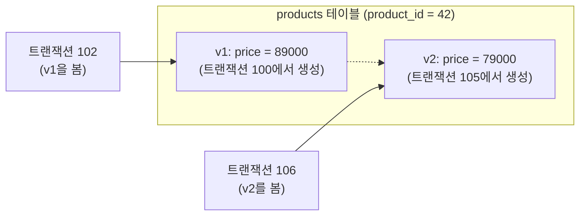

# DBA 기초 -- 동시성과 격리 수준

[17강](../intermediate/17-transactions.md)에서 ACID 속성과 트랜잭션의 기본(BEGIN / COMMIT / ROLLBACK)을 배웠습니다. 이 부록에서는 한 걸음 더 나아가, **여러 사용자가 동시에 데이터베이스를 사용할 때** 발생하는 문제와 해결 방법을 다룹니다.

!!! info "대상 데이터베이스"
    SQLite는 기본적으로 단일 쓰기 연결(WAL 모드에서도 쓰기 직렬화) 방식이므로, 이 부록의 내용은 **MySQL / PostgreSQL** 기준입니다.

---

## 동시성 문제 3가지

여러 트랜잭션이 동시에 실행되면, 격리 수준에 따라 다음 세 가지 문제가 발생할 수 있습니다.

### Dirty Read (더티 리드)

**아직 커밋되지 않은** 다른 트랜잭션의 변경을 읽는 현상입니다.

```
시점    트랜잭션 A (창고 담당자)          트랜잭션 B (주문 처리)
─────  ──────────────────────────────  ──────────────────────────────
t1     UPDATE products
       SET stock = 0
       WHERE product_id = 42;
t2                                     SELECT stock FROM products
                                       WHERE product_id = 42;
                                       → 0 (커밋 안 된 값을 읽음!)
t3     ROLLBACK;                       -- A가 롤백했지만 B는 이미
                                       -- 재고 0으로 판단해 주문 거절
```

> 트랜잭션 B는 존재하지 않는 변경을 기반으로 의사결정을 내렸습니다. 이것이 **Dirty Read**입니다.

### Non-Repeatable Read (반복 불가능 읽기)

**같은 트랜잭션 안에서 같은 행을 두 번 읽었는데 값이 달라지는** 현상입니다.

```
시점    트랜잭션 A (보고서 생성)          트랜잭션 B (가격 변경)
─────  ──────────────────────────────  ──────────────────────────────
t1     SELECT price FROM products
       WHERE product_id = 42;
       → 89,000원
t2                                     UPDATE products
                                       SET price = 79000
                                       WHERE product_id = 42;
                                       COMMIT;
t3     SELECT price FROM products
       WHERE product_id = 42;
       → 79,000원 (같은 행인데 값이 다름!)
```

> 보고서 앞부분에는 89,000원, 뒷부분에는 79,000원이 찍힙니다. 트랜잭션 A 입장에서는 **데이터가 일관되지 않습니다**.

### Phantom Read (팬텀 리드)

같은 조건으로 조회했는데 **행의 수가 달라지는** 현상입니다.

```
시점    트랜잭션 A (매출 집계)            트랜잭션 B (신규 주문)
─────  ──────────────────────────────  ──────────────────────────────
t1     SELECT COUNT(*) FROM orders
       WHERE order_date = '2025-04-11';
       → 150건
t2                                     INSERT INTO orders (...)
                                       VALUES (...);  -- 4/11 주문
                                       COMMIT;
t3     SELECT COUNT(*) FROM orders
       WHERE order_date = '2025-04-11';
       → 151건 (유령 행 출현!)
```

> Non-Repeatable Read는 **기존 행의 값**이 변하는 것이고, Phantom Read는 **행 자체가 추가/삭제**되는 것입니다.

---

## 격리 수준 4단계

SQL 표준은 위 문제를 얼마나 허용하느냐에 따라 4단계 격리 수준을 정의합니다.

| 격리 수준 | Dirty Read | Non-Repeatable Read | Phantom Read | 동시성 |
|-----------|:----------:|:-------------------:|:------------:|:------:|
| **READ UNCOMMITTED** | 가능 | 가능 | 가능 | 높음 |
| **READ COMMITTED** | 방지 | 가능 | 가능 | ↑ |
| **REPEATABLE READ** | 방지 | 방지 | 가능 | ↓ |
| **SERIALIZABLE** | 방지 | 방지 | 방지 | 낮음 |

- 위로 갈수록 **동시성은 좋지만 데이터 정합성이 약하고**, 아래로 갈수록 **정합성은 강하지만 동시성이 떨어집니다**.
- 대부분의 웹 애플리케이션은 READ COMMITTED 또는 REPEATABLE READ로 충분합니다.

### 기본 격리 수준

| 데이터베이스 | 기본값 |
|-------------|--------|
| MySQL (InnoDB) | REPEATABLE READ |
| PostgreSQL | READ COMMITTED |
| SQL Server | READ COMMITTED |
| Oracle | READ COMMITTED |

### 격리 수준 설정

=== "MySQL"

    ```sql
    -- 현재 세션의 격리 수준 확인
    SELECT @@transaction_isolation;

    -- 세션 단위 변경
    SET SESSION TRANSACTION ISOLATION LEVEL READ COMMITTED;

    -- 다음 트랜잭션 한 번만 변경
    SET TRANSACTION ISOLATION LEVEL SERIALIZABLE;
    ```

=== "PostgreSQL"

    ```sql
    -- 현재 격리 수준 확인
    SHOW transaction_isolation;

    -- 현재 트랜잭션 변경
    BEGIN;
    SET TRANSACTION ISOLATION LEVEL REPEATABLE READ;
    -- ... 쿼리 ...
    COMMIT;
    ```

---

## MVCC (Multi-Version Concurrency Control)

MySQL(InnoDB)과 PostgreSQL은 **MVCC**라는 기법으로 동시성을 관리합니다. 핵심 아이디어는 단순합니다:

> **데이터를 수정할 때 기존 버전을 덮어쓰지 않고, 새 버전을 만든다.**



- 각 트랜잭션은 시작 시점의 **스냅샷**을 봅니다.
- 읽기(SELECT)는 잠금 없이 자신의 스냅샷에서 데이터를 가져옵니다.
- 쓰기(UPDATE/DELETE)만 해당 행에 잠금을 겁니다.

이 덕분에 **읽기와 쓰기가 서로 차단하지 않아** 높은 동시성을 유지할 수 있습니다.

---

## 잠금 (Lock)

MVCC가 읽기 충돌을 해결해 주지만, **쓰기끼리의 충돌**은 여전히 잠금으로 관리해야 합니다.

### 행 잠금 vs 테이블 잠금

| 잠금 범위 | 설명 | 동시성 |
|-----------|------|:------:|
| 행 잠금 (Row Lock) | 수정 중인 행만 잠금. InnoDB, PostgreSQL 기본 | 높음 |
| 테이블 잠금 (Table Lock) | 테이블 전체를 잠금. MyISAM 기본, DDL 시 발생 | 낮음 |

> 일반적인 INSERT/UPDATE/DELETE는 **행 잠금**만 발생합니다. 테이블 잠금은 ALTER TABLE 같은 DDL이나 명시적 `LOCK TABLE` 시에 사용됩니다.

### 데드락 (Deadlock)

두 트랜잭션이 **서로가 가진 잠금을 기다리며 영원히 대기**하는 상태입니다.

```
시점    트랜잭션 A                        트랜잭션 B
─────  ──────────────────────────────  ──────────────────────────────
t1     UPDATE orders SET ...
       WHERE order_id = 1;
       (order_id=1 행 잠금 획득)
t2                                     UPDATE orders SET ...
                                       WHERE order_id = 2;
                                       (order_id=2 행 잠금 획득)
t3     UPDATE orders SET ...
       WHERE order_id = 2;
       → 대기 (B가 잠금 보유 중)
t4                                     UPDATE orders SET ...
                                       WHERE order_id = 1;
                                       → 대기 (A가 잠금 보유 중)
                                       ⚠ DEADLOCK!
```

데이터베이스는 데드락을 자동 감지하고, **한쪽 트랜잭션을 강제 롤백(victim 선택)** 하여 해소합니다. 롤백된 트랜잭션은 에러를 받으며, 애플리케이션에서 재시도 로직을 구현해야 합니다.

!!! tip "데드락 예방 실무 팁"
    - **트랜잭션을 짧게 유지하세요.** 잠금 보유 시간이 짧을수록 충돌 확률이 낮아집니다.
    - **같은 순서로 테이블/행에 접근하세요.** A와 B가 모두 order_id 1 → 2 순서로 접근하면 데드락이 발생하지 않습니다.
    - **불필요한 트랜잭션 안에서 외부 API 호출이나 사용자 입력 대기를 하지 마세요.**

---

## 정리

| 개념 | 핵심 요약 |
|------|----------|
| Dirty Read | 커밋 안 된 데이터를 읽는 것 |
| Non-Repeatable Read | 같은 행을 다시 읽었더니 값이 바뀐 것 |
| Phantom Read | 같은 조건 조회인데 행 수가 달라진 것 |
| READ UNCOMMITTED | 모든 문제 허용, 거의 사용 안 함 |
| READ COMMITTED | Dirty Read만 방지 (PG/Oracle/MSSQL 기본) |
| REPEATABLE READ | Phantom만 허용 (MySQL 기본) |
| SERIALIZABLE | 모든 문제 방지, 동시성 최저 |
| MVCC | 스냅샷 기반 — 읽기가 쓰기를 차단하지 않음 |
| 행 잠금 | 수정 중인 행만 잠금 (InnoDB, PG 기본) |
| 데드락 | 상호 잠금 대기 — DB가 자동 감지 후 한쪽 롤백 |

!!! quote "돌아가기"
    [17강: 트랜잭션과 ACID](../intermediate/17-transactions.md)로 돌아가기
