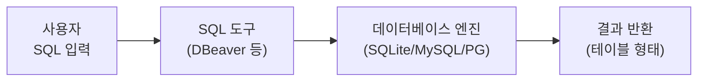
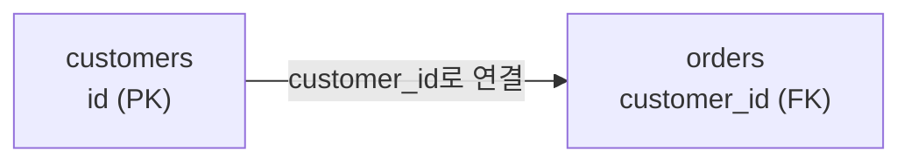

# 0강: 데이터베이스와 SQL 소개

이 강의는 SQL을 처음 접하는 분을 위한 출발점입니다. 개념 → 실습 → 용어 정리 순서로 진행합니다.

!!! note "이미 알고 계신다면"
    데이터베이스, SQL, 테이블, PK/FK 개념을 이미 알고 있다면 이 강의를 건너뛰고 [1강: SELECT 기초](01-select.md)로 바로 이동하세요.

---

## 데이터베이스란?

### 엑셀로는 왜 안 될까

회사에서 고객 명단을 엑셀로 관리한다고 생각해보세요. 처음에는 잘 됩니다. 하지만 시간이 지나면:

- 고객이 5만 명이 되면 파일이 무거워져 열기만 30초
- 마케팅팀과 CS팀이 **동시에** 같은 파일을 편집할 수 없음
- 누군가 실수로 수식을 깨뜨리면 전체 데이터가 엉망
- "30세 이상 VIP 고객 중 이번 달 주문한 사람"을 찾으려면 필터를 여러 번 걸어야 함

**데이터베이스**는 이런 문제를 근본적으로 해결합니다:

| 엑셀의 한계 | 데이터베이스의 해결 |
|------------|------------------|
| 수만 건이면 느려짐 | 수백만~수억 건도 빠르게 검색 |
| 동시 편집 불가 | 여러 사람이 동시에 읽고 쓸 수 있음 |
| 실수로 데이터 깨짐 | 제약 조건으로 잘못된 데이터 차단 |
| 복잡한 조건 찾기 어려움 | SQL 한 줄로 정확히 추출 |
| 파일 하나에 모든 것 | 테이블로 분리하고 관계로 연결 |

웹사이트, 쇼핑몰, 은행, 병원, 게임 — 데이터를 다루는 거의 모든 소프트웨어 뒤에는 데이터베이스가 있습니다.

### 왜 여러 테이블로 나눌까

데이터베이스에서는 모든 데이터를 하나의 큰 표에 넣지 않고, **여러 개의 테이블로 나눠서** 저장합니다. 테크샵 데이터로 비교해보겠습니다:

**나쁜 예 — 하나의 테이블에 모든 것:**

| 주문번호 | 고객이름 | 고객이메일 | 상품명 | 가격 |
|---------|---------|----------|--------|------|
| ORD-001 | 정준호 | jjh0001@testmail.kr | 노트북 | 1,200,000 |
| ORD-002 | 정준호 | jjh0001@testmail.kr | 마우스 | 35,000 |
| ORD-003 | 김민재 | kmj0002@testmail.kr | 키보드 | 89,000 |

정준호의 이메일이 바뀌면? 주문 ORD-001과 ORD-002를 **둘 다** 수정해야 합니다. 주문이 100건이면 100곳을 수정해야 합니다.

**좋은 예 — 테이블 분리:**

**customers 테이블:**

| id | name | email |
|---:|------|-------|
| 1 | 정준호 | jjh0001@testmail.kr |
| 2 | 김민재 | kmj0002@testmail.kr |

**orders 테이블:**

| id | customer_id | total_amount |
|---:|:-----------:|-----------:|
| 1 | 1 | 1,200,000 |
| 2 | 1 | 35,000 |
| 3 | 2 | 89,000 |

이메일이 바뀌면 customers 테이블 **한 곳만** 수정합니다. orders 테이블의 `customer_id`가 customers 테이블의 `id`를 가리키고 있으므로, 관계가 자동으로 유지됩니다.

이것이 **관계형 데이터베이스**(RDBMS)의 핵심입니다:

- **중복이 줄어듭니다** — 고객 정보를 한 곳에만 저장
- **일관성이 유지됩니다** — 한 곳만 수정하면 됨
- **유연하게 조합할 수 있습니다** — 필요에 따라 테이블을 합쳐서 볼 수 있음

---

## SQL이란?

**SQL**(Structured Query Language, "에스큐엘" 또는 "시퀄"로 읽음)은 데이터베이스와 대화하는 언어입니다.

일상 언어로 "고객 중에서 VIP 등급인 사람의 이름과 이메일을 보여줘"라고 말하고 싶을 때, SQL로는 이렇게 씁니다:

```sql
SELECT name, email
FROM customers
WHERE grade = 'VIP';
```

**SELECT**(보여줘) **FROM**(어디서) **WHERE**(조건) — 영어 문장처럼 읽힙니다. SQL은 프로그래밍 언어 중에서 가장 자연어에 가까운 언어입니다.

### SQL로 할 수 있는 것

| 하고 싶은 것 | SQL 명령 | 테크샵 예시 |
|------------|---------|-----------|
| 데이터 조회 | `SELECT` | VIP 고객 목록, 이번 달 매출 |
| 데이터 추가 | `INSERT` | 신규 고객 등록, 주문 생성 |
| 데이터 수정 | `UPDATE` | 가격 변경, 등급 업그레이드 |
| 데이터 삭제 | `DELETE` | 탈퇴 고객 삭제 |

이 4가지를 **CRUD**(Create, Read, Update, Delete)라고 부르며, SQL의 핵심입니다.

### SQL은 어떻게 실행되는가?

SQL을 처음 접하면 "이걸 어디에 입력하지?"라는 의문이 듭니다. 흐름은 단순합니다:



1. **SQL 도구**(DBeaver, DB Browser 등)에서 SQL 문장을 입력합니다
2. 도구가 **데이터베이스 엔진**에 SQL을 전달합니다
3. 엔진이 SQL을 해석하고 실행한 뒤 **결과를 반환**합니다
4. 결과가 테이블 형태로 화면에 표시됩니다

### SQL을 배워야 하는 이유

- **범용성** — MySQL, PostgreSQL, SQLite, Oracle 등 거의 모든 데이터베이스에서 공통으로 사용. 한 번 배우면 어디서든 쓸 수 있습니다
- **수요** — 개발자, 데이터 분석가, 마케터, PM 등 IT 업계의 거의 모든 직군에서 SQL을 요구합니다
- **효율** — 엑셀에서 30분 걸리는 작업을 SQL 한 줄로 1초에 끝낼 수 있습니다
- **역사** — 1970년대에 시작되어 50년 이상 쓰여온 검증된 기술. 사라질 가능성이 거의 없습니다

> **핵심:** SQL을 배운다는 것은 **데이터에 질문하는 법**을 배우는 것입니다.

---

## 직접 해보기 — 첫 쿼리

이 튜토리얼에서는 **테크샵(TechShop)**이라는 가상의 전자상거래 쇼핑몰 데이터베이스를 사용합니다. 컴퓨터 및 주변기기를 판매하는 10년차 쇼핑몰로, 고객·상품·주문·결제·배송·리뷰 등 현실감 있는 데이터를 담고 있습니다. 전체 구조는 [데이터베이스 스키마](../schema/index.md)에서 확인할 수 있습니다.

아직 문법을 몰라도 괜찮습니다. 아래 쿼리를 SQL 도구에 복사해서 실행해보세요:

```sql
-- 고객 3명 조회하기
SELECT id, name, email, grade
FROM customers
LIMIT 3;
```

| id | name | email | grade |
| -: | ---- | ----- | ----- |
| 1 | 정준호 | jjh0001@testmail.kr | SILVER |
| 2 | 김민재 | kmj0002@testmail.kr | GOLD |
| 3 | 진정자 | jjj0003@testmail.kr | NORMAL |

"customers 테이블에서 id, name, email, grade 칼럼을 3건만 보여줘"라는 뜻입니다. 결과가 나왔다면, 축하합니다 — 방금 첫 SQL 쿼리를 실행했습니다!

!!! tip "결과가 나오지 않는다면"
    [준비하기](../setup/index.md)에서 데이터베이스 생성과 SQL 도구 설정을 완료했는지 확인하세요.

---

## 방금 본 결과 뜯어보기

첫 쿼리의 결과를 다시 보면서 용어를 정리합니다.


| 용어 | 의미 | 위 결과에서 |
| ---- | ---- | ----------|
| **테이블** (Table) | 데이터를 저장하는 단위 | `customers` (전체) |
| **칼럼** (Column) | 세로 한 줄 — 하나의 속성 | `id` 칼럼 전체: 1, 2, 3 |
| **행** (Row) | 가로 한 줄 — 하나의 레코드 | `1, 정준호, jjh0001@testmail.kr, SILVER` |
| **셀** (Cell) | 행과 칼럼이 만나는 하나의 값 | id 칼럼의 첫 번째 행 → `1` |

### 데이터 타입

칼럼에는 저장할 수 있는 데이터의 종류가 정해져 있습니다:

| 종류 | 대표 타입 | 위 결과에서 |
| ---- | --------- | ----------|
| 정수 | `INTEGER` | `id` (1, 2, 3) |
| 문자열 | `TEXT` | `name`, `email`, `grade` |
| 실수 | `REAL` | 가격, 금액 (다른 테이블) |
| 날짜 | `TEXT`/`DATE` | 가입일, 주문일 (다른 테이블) |

### NULL — "값이 없음"

데이터베이스에서 중요한 개념 하나가 더 있습니다: **NULL**입니다.

NULL은 **"값이 비어있다"**는 뜻입니다. 0이나 빈 문자열('')과는 다릅니다:

| 값 | 의미 | 테크샵 예시 |
|----|------|-----------|
| `0` | 숫자 0이라는 값이 있음 | 포인트 잔액이 0원 — 잔액은 확인됨 |
| `''` | 빈 문자열이라는 값이 있음 | 메모가 비어있음 — 메모 칸은 있음 |
| `NULL` | 값 자체가 없음 (알 수 없음) | 생년월일을 입력하지 않음 — 나이를 알 수 없음 |

테크샵의 `customers` 테이블에서는:

- `birth_date`가 NULL인 고객 — 생년월일을 입력하지 않은 고객 (약 15%)
- `gender`가 NULL인 고객 — 성별을 선택하지 않은 고객 (약 10%)
- `last_login_at`이 NULL인 고객 — 한 번도 로그인하지 않은 고객

NULL을 제대로 다루는 방법은 [6강: NULL 처리](06-null.md)에서 자세히 배웁니다.

---

## 테이블 간의 연결 — PK와 FK

앞에서 "테이블을 나누고 관계로 연결한다"고 했습니다. 연결하는 방법을 알아봅니다.

### 기본 키 (Primary Key)

방금 조회한 결과의 `id` 칼럼에 1, 2, 3이라는 숫자가 있었습니다. 이것이 **기본 키(PK)**입니다. 각 행을 유일하게 식별하는 칼럼입니다.

- `id = 2`는 김민재 **한 명**만을 가리킵니다
- "김민재"라는 이름이 여러 명이어도 `id`로 정확히 구분됩니다
- 같은 `id`를 가진 행은 없고, `id`가 없는 행도 없습니다

### 외래 키 (Foreign Key)

`orders` 테이블의 `customer_id`는 `customers` 테이블의 `id`를 가리킵니다. 이것이 **외래 키(FK)**입니다.

| orders.id | customer_id (FK) | total_amount |
|----------:|-----------------:|-------------:|
| 1 | **1** | 350,000 |
| 2 | **1** | 89,000 |
| 3 | **2** | 1,200,000 |

`customer_id = 1`인 주문 1, 2번은 정준호의 주문입니다. 이처럼 한 고객이 여러 주문을 가질 수 있는 것을 **1:N(일대다) 관계**라고 합니다.



### PK와 FK 정리

| | 기본 키 (PK) | 외래 키 (FK) |
|-| ----------- | ----------- |
| 테크샵 예시 | `customers.id` | `orders.customer_id` |
| 역할 | 각 행을 유일하게 식별 | 다른 테이블의 행을 가리킴 |
| 중복 | 불가 | 가능 (고객 1명이 주문 여러 건) |
| NULL | 불가 | 가능 |

!!! tip "지금은 이것만 기억하세요"
    **"각 테이블에 고유 번호(PK)가 있고, 다른 테이블의 번호를 참조(FK)해서 연결한다."** PK와 FK를 직접 만드는 방법은 [16강: DDL](../intermediate/16-ddl.md)에서 배웁니다.

---

## 정리

| 개념 | 한 줄 요약 | 테크샵 예시 |
|------|----------|-----------|
| 데이터베이스 | 대량의 데이터를 안전하고 빠르게 관리하는 시스템 | 테크샵 쇼핑몰의 전체 데이터 |
| SQL | 데이터베이스에 질문하는 언어 | `SELECT name FROM customers WHERE grade = 'VIP'` |
| 테이블 | 데이터를 행과 열로 저장하는 단위 | `customers`, `orders`, `products` |
| 관계형 DB | 테이블을 나누고 관계로 연결하여 중복을 줄이는 구조 | customers + orders 분리 |
| PK | 각 행을 유일하게 식별하는 칼럼 | `customers.id = 2` → 김민재 한 명 |
| FK | 다른 테이블의 PK를 참조하여 관계를 만드는 칼럼 | `orders.customer_id → customers.id` |
| NULL | 값이 없음 (0이나 빈 문자열과 다름) | 생년월일 미입력 고객 |

다음 강에서는 `SELECT`를 본격적으로 배웁니다. 방금 맛본 첫 쿼리를 확장해서, 원하는 데이터를 자유자재로 조회하는 방법을 익힙니다.

---

!!! note "레슨 복습 문제"
    이 레슨에서 배운 개념을 바로 확인하는 간단한 문제입니다.

### 문제 1
다음 중 데이터베이스를 사용하는 이유로 **적절하지 않은** 것은?

- (A) 수백만 건의 데이터를 빠르게 검색할 수 있다
- (B) 여러 사람이 동시에 데이터를 읽고 쓸 수 있다
- (C) 엑셀보다 파일 크기가 항상 작다
- (D) SQL로 복잡한 조건의 데이터를 정확히 추출할 수 있다

??? success "정답"
    **(C) 엑셀보다 파일 크기가 항상 작다**

    데이터베이스의 장점은 대용량 처리, 동시 접근, 복잡한 조건 검색, 데이터 안전성입니다. 파일 크기가 항상 작다는 보장은 없습니다.

### 문제 2
SQL의 네 가지 기본 작업(CRUD)에 해당하는 명령이 **아닌** 것은?

- (A) SELECT
- (B) INSERT
- (C) SORT
- (D) DELETE

??? success "정답"
    **(C) SORT**

    CRUD는 Create(INSERT), Read(SELECT), Update(UPDATE), Delete(DELETE)입니다. 정렬은 `ORDER BY` 절로 수행하지만, 독립적인 CRUD 작업은 아닙니다.

### 문제 3
다음 표에서 **행(Row)**은 몇 개이고, **칼럼(Column)**은 몇 개인가요?

| id | name | email | grade |
| -: | ---- | ----- | ----- |
| 1 | 정준호 | jjh0001@testmail.kr | SILVER |
| 2 | 김민재 | kmj0002@testmail.kr | GOLD |
| 3 | 진정자 | jjj0003@testmail.kr | NORMAL |

- (A) 행 3개, 칼럼 4개
- (B) 행 4개, 칼럼 4개
- (C) 행 3개, 칼럼 3개
- (D) 행 12개, 칼럼 1개

??? success "정답"
    **(A) 행 3개, 칼럼 4개**

    헤더(id, name, email, grade)는 칼럼 이름이므로 행에 포함하지 않습니다. 데이터 행은 3개(정준호, 김민재, 진정자), 칼럼은 4개(id, name, email, grade)입니다.

### 문제 4
`customers` 테이블의 `id` 칼럼은 기본 키(PK)입니다. 기본 키의 특징이 **아닌** 것은?

- (A) 각 행을 고유하게 식별한다
- (B) NULL 값을 가질 수 없다
- (C) 하나의 테이블에 여러 개를 만들 수 있다
- (D) 중복된 값을 가질 수 없다

??? success "정답"
    **(C) 하나의 테이블에 여러 개를 만들 수 있다**

    기본 키는 테이블당 하나만 존재합니다. 여러 개 만들 수 있는 것은 외래 키(FK)입니다.

### 문제 5
`orders` 테이블의 `customer_id`는 `customers` 테이블의 `id`를 참조합니다. `customer_id`는 무엇인가요?

- (A) 기본 키 (Primary Key)
- (B) 외래 키 (Foreign Key)
- (C) 데이터 타입
- (D) 테이블 이름

??? success "정답"
    **(B) 외래 키 (Foreign Key)**

    다른 테이블의 기본 키를 참조하는 칼럼을 외래 키라고 합니다. `customer_id`는 `customers.id`를 참조하여 "이 주문은 어떤 고객의 것"인지를 나타냅니다.

### 문제 6
한 고객이 여러 주문을 할 수 있고, 각 주문은 한 고객에게만 속합니다. 이런 관계를 무엇이라 하나요?

- (A) 1:1 관계
- (B) 1:N 관계
- (C) N:N 관계
- (D) 무관계

??? success "정답"
    **(B) 1:N 관계 (일대다)**

    한 명의 고객(1)이 여러 건의 주문(N)을 가질 수 있으므로 1:N 관계입니다.

### 문제 7
`customers` 테이블에서 `birth_date` 칼럼이 NULL인 고객이 있습니다. NULL은 무엇을 의미하나요?

- (A) 생년월일이 0000-00-00이다
- (B) 생년월일이 빈 문자열('')이다
- (C) 생년월일 값이 없다 (입력되지 않음)
- (D) 생년월일이 오늘 날짜다

??? success "정답"
    **(C) 생년월일 값이 없다 (입력되지 않음)**

    NULL은 0이나 빈 문자열과 다릅니다. "값 자체가 존재하지 않는다"는 뜻입니다. 고객이 생년월일을 입력하지 않았을 때 NULL이 됩니다.

### 문제 8
관계형 데이터베이스에서 데이터를 여러 테이블로 나누는 이유로 **적절하지 않은** 것은?

- (A) 데이터 중복을 줄이기 위해
- (B) 한 곳만 수정하면 일관성이 유지되므로
- (C) 저장 공간을 더 많이 사용하기 위해
- (D) 필요에 따라 테이블을 유연하게 조합하기 위해

??? success "정답"
    **(C) 저장 공간을 더 많이 사용하기 위해**

    테이블을 나누면 중복이 줄어들어 오히려 저장 공간이 절약됩니다.

### 문제 9
`customers` 테이블에서 `id`의 데이터 타입은 `INTEGER`이고, `name`의 데이터 타입은 `TEXT`입니다. `INTEGER` 칼럼에 저장할 수 **없는** 값은?

- (A) 42
- (B) 0
- (C) -7
- (D) '김민재'

??? success "정답"
    **(D) '김민재'**

    `INTEGER`는 정수만 저장할 수 있습니다. 문자열 '김민재'는 `TEXT` 타입 칼럼에 저장해야 합니다.

### 문제 10
SQL 문장 `SELECT name, email FROM customers WHERE grade = 'VIP';`의 의미로 올바른 것은?

- (A) customers 테이블을 삭제한다
- (B) customers 테이블에서 VIP 등급인 고객의 이름과 이메일을 조회한다
- (C) customers 테이블의 모든 고객 등급을 VIP로 변경한다
- (D) customers 테이블에 VIP 고객을 추가한다

??? success "정답"
    **(B) customers 테이블에서 VIP 등급인 고객의 이름과 이메일을 조회한다**

    `SELECT`는 데이터를 조회하는 명령입니다. `FROM`은 어느 테이블에서, `WHERE`는 어떤 조건으로 필터링할지를 지정합니다.

### 채점 가이드

맞힌 문제 수에 따라 다음 단계를 확인하세요:

| 점수 | 수준 | 다음 단계 |
|:----:|------|----------|
| **9~10개** | 준비 완료 | [1강: SELECT 기초](01-select.md)로 바로 이동하세요 |
| **7~8개** | 거의 완료 | 틀린 문제의 해설을 다시 읽고, 해당 섹션을 복습한 뒤 1강으로 이동하세요 |
| **4~6개** | 핵심 개념 부족 | 이 강의를 처음부터 다시 읽어보세요. 특히 틀린 문제가 속한 영역을 집중 복습하세요 |
| **0~3개** | 기초부터 | 이 강의를 천천히 다시 읽고, 아래의 보충 자료를 먼저 참고하세요 |

**문제별 영역:**

| 영역 | 해당 문제 | 틀렸다면 복습할 곳 |
|------|:--------:|-----------------|
| 데이터베이스 개념 | 1, 8 | [데이터베이스란?](#데이터베이스란) |
| SQL 기초 | 2, 10 | [SQL이란?](#sql이란) |
| 테이블 구조 | 3, 9 | [방금 본 결과 뜯어보기](#방금-본-결과-뜯어보기) |
| PK와 FK | 4, 5, 6 | [테이블 간의 연결](#테이블-간의-연결--pk와-fk) |
| NULL | 7 | [NULL — "값이 없음"](#null--값이-없음) |

---
다음: [1강: SELECT 기초](01-select.md)
