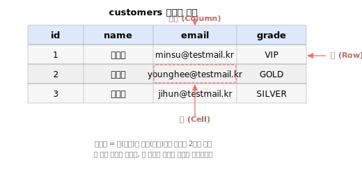
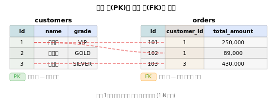
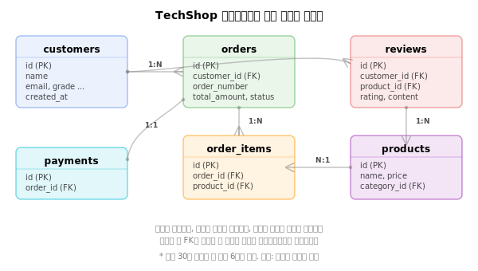

# 0강: 데이터베이스와 SQL 소개

이 강의는 SQL을 처음 접하는 분을 위한 출발점입니다. 데이터베이스가 무엇인지, SQL로 무엇을 할 수 있는지, 그리고 이 튜토리얼에서 사용할 데이터베이스를 소개합니다.

## SQL이란 무엇인가

**SQL**(Structured Query Language)은 데이터베이스에 질문(query)하는 언어입니다. "이 테이블에서 이런 조건의 데이터를 보여줘"라고 요청하면, 데이터베이스가 결과를 돌려줍니다.

SQL로 할 수 있는 네 가지 기본 작업:

| 작업 | SQL 명령 | 설명 |
| -- | -------- | ---- |
| 읽기 | `SELECT` | 데이터를 조회합니다 |
| 추가 | `INSERT` | 새 데이터를 넣습니다 |
| 수정 | `UPDATE` | 기존 데이터를 바꿉니다 |
| 삭제 | `DELETE` | 데이터를 지웁니다 |

SQL은 1970년대 IBM에서 시작되어, 현재 가장 널리 쓰이는 데이터 언어입니다. MySQL, PostgreSQL, SQLite, SQL Server, Oracle 등 거의 모든 관계형 데이터베이스에서 공통으로 사용합니다. 한 번 배우면 어디서든 쓸 수 있다는 뜻입니다.

> **핵심:** SQL을 배운다는 것은 데이터에 질문하는 법을 배우는 것입니다.

## 관계형 데이터베이스(RDBMS)란

**관계형 데이터베이스**(RDBMS, Relational Database Management System)는 데이터를 **테이블**(표) 형태로 저장하고, 테이블 간에 **관계**(relationship)를 맺어 연결하는 시스템입니다.

예를 들어, 쇼핑몰 데이터베이스에는 "고객" 테이블과 "주문" 테이블이 따로 있습니다. 고객 테이블의 `id`와 주문 테이블의 `customer_id`가 같은 값을 공유하면서 "이 주문은 이 고객의 것"이라는 관계를 만듭니다.

이렇게 데이터를 여러 테이블로 나누고 관계로 연결하면:

- **중복이 줄어듭니다** — 고객 이름을 주문마다 반복 저장할 필요가 없습니다
- **일관성이 유지됩니다** — 고객 정보를 한 곳에서만 수정하면 됩니다
- **유연하게 조합할 수 있습니다** — 필요에 따라 테이블을 자유롭게 합쳐 볼 수 있습니다

## 테이블, 행, 칼럼

테이블은 엑셀 시트와 비슷한 2차원 구조입니다.



| 용어 | 의미 | 비유 |
| ---- | ---- | ---- |
| 테이블 (Table) | 데이터를 저장하는 단위 | 엑셀 시트 하나 |
| 행 (Row) | 하나의 레코드 | 고객 한 명, 주문 한 건 |
| 칼럼 (Column) | 하나의 속성 | 이름, 이메일, 등급 |
| 셀 (Cell) | 행과 칼럼이 만나는 지점의 값 | 특정 고객의 이름 |

데이터베이스 하나에는 여러 테이블이 들어 있습니다. 이 튜토리얼의 데이터베이스에는 30개 테이블이 있습니다.

## 기본 키(Primary Key)

**기본 키**(Primary Key, PK)는 테이블에서 각 행을 고유하게 식별하는 칼럼입니다.

기본 키의 규칙:

- **중복 불가** — 같은 값을 가진 행이 두 개 이상 있을 수 없습니다
- **NULL 불가** — 반드시 값이 있어야 합니다
- **테이블당 하나** — 하나의 테이블에 기본 키는 하나입니다

예를 들어, `customers` 테이블의 `id` 칼럼이 기본 키입니다. 고객 번호 1번은 세상에 단 한 명, 고객 번호 2번도 단 한 명뿐입니다.

## 외래 키(Foreign Key)

**외래 키**(Foreign Key, FK)는 다른 테이블의 기본 키를 참조하는 칼럼입니다. 테이블 간의 관계를 만드는 역할을 합니다.

예를 들어, `orders` 테이블의 `customer_id`는 `customers` 테이블의 `id`를 참조하는 외래 키입니다. "주문 101번은 고객 1번의 주문"이라는 관계가 이 외래 키를 통해 만들어집니다.



위 그림에서 고객 1번(김민수)은 주문을 2건(101, 102) 가지고 있고, 고객 3번(박지훈)은 1건(103)을 가지고 있습니다. 이처럼 한 고객이 여러 주문을 가질 수 있는 것을 **1:N(일대다) 관계**라고 합니다.

## PK와 FK 비교

| 구분 | 기본 키 (PK) | 외래 키 (FK) |
| ---- | ----------- | ----------- |
| 역할 | 행을 고유하게 식별 | 다른 테이블과 관계 연결 |
| 중복 | 불가 | 가능 (같은 고객의 주문 여러 건) |
| NULL | 불가 | 가능 (관계가 없는 경우) |
| 개수 | 테이블당 1개 | 테이블에 여러 개 가능 |

## 데이터 타입 개요

칼럼에는 저장할 수 있는 데이터의 종류가 정해져 있습니다. 이것을 **데이터 타입**이라고 합니다.

| 분류 | 대표 타입 | 예시 값 |
| ---- | --------- | ------- |
| 정수 | `INTEGER` | 1, 42, -7 |
| 실수 | `REAL`, `DECIMAL` | 3.14, 99.9 |
| 문자열 | `TEXT`, `VARCHAR` | '김민수', 'VIP' |
| 날짜/시간 | `DATE`, `DATETIME` | '2025-01-15' |
| 논리값 | `BOOLEAN` | TRUE, FALSE |

데이터베이스 제품마다 지원하는 타입이 조금씩 다릅니다. 자세한 내용은 [15강: DDL](../intermediate/15-ddl.md)에서 다룹니다.

## 이 튜토리얼의 데이터베이스

이 튜토리얼에서는 **테크샵(TechShop)**이라는 가상의 전자상거래 쇼핑몰 데이터베이스를 사용합니다. 컴퓨터 및 주변기기를 판매하는 10년차 쇼핑몰로, 현실감 있는 데이터를 담고 있습니다.

- **30개 테이블**, 68만 건 데이터
- 고객 52,300명, 주문 378,000건, 상품 2,800개
- 10년간의 성장 추이, 계절성, 결측치까지 반영

핵심적인 데이터 흐름은 다음과 같습니다:



**고객**이 **주문**을 하면, 주문 안에 **상품**이 포함되고, 고객은 구매한 상품에 **리뷰**를 남깁니다. 이 자연스러운 흐름을 따라가며 SQL을 배우게 됩니다.

한번 맛보기로 고객 3명을 조회해 보겠습니다:

```sql
SELECT id, name, email, grade
FROM customers
LIMIT 3;
```

| id | name | email | grade |
| -: | ---- | ----- | ----- |
| 1 | 정준호 | jjh0001@testmail.kr | SILVER |
| 2 | 김민재 | kmj0002@testmail.kr | GOLD |
| 3 | 진정자 | jjj0003@testmail.kr | NORMAL |

아직 문법을 몰라도 괜찮습니다. "customers 테이블에서 id, name, email, grade 칼럼을 3건만 보여줘"라는 뜻이라는 것만 감잡으면 됩니다. 다음 강의에서 `SELECT`를 본격적으로 배웁니다.

---

!!! note "레슨 복습 문제"
    이 레슨에서 배운 개념을 바로 확인하는 간단한 문제입니다. 여러 개념을 종합하는 실전 연습은 [연습 문제](../exercises/index.md) 섹션을 참고하세요.

### 문제 1
다음 중 SQL의 네 가지 기본 작업이 **아닌** 것은?

- (A) 데이터 읽기 (SELECT)
- (B) 데이터 추가 (INSERT)
- (C) 데이터 정렬 (SORT)
- (D) 데이터 삭제 (DELETE)

??? success "정답"
    **(C) 데이터 정렬 (SORT)**

    SQL의 네 가지 기본 작업(CRUD)은 읽기(SELECT), 추가(INSERT), 수정(UPDATE), 삭제(DELETE)입니다. 정렬은 `ORDER BY` 절로 수행하지만, 독립적인 기본 작업은 아닙니다.

### 문제 2
다음 중 **기본 키(Primary Key)**의 특징이 아닌 것은?

- (A) 각 행을 고유하게 식별한다
- (B) NULL 값을 가질 수 없다
- (C) 하나의 테이블에 여러 개를 만들 수 있다
- (D) 중복된 값을 가질 수 없다

??? success "정답"
    **(C) 하나의 테이블에 여러 개를 만들 수 있다**

    기본 키는 테이블당 하나만 존재합니다. 여러 개의 칼럼으로 구성된 복합 기본 키는 가능하지만, 기본 키 자체는 하나입니다. 여러 개 만들 수 있는 것은 외래 키(FK)입니다.

### 문제 3
`orders` 테이블의 `customer_id` 칼럼이 `customers` 테이블의 `id`를 참조합니다. 이때 `customer_id`는 무엇인가요?

- (A) 기본 키 (Primary Key)
- (B) 외래 키 (Foreign Key)
- (C) 데이터 타입
- (D) 테이블 이름

??? success "정답"
    **(B) 외래 키 (Foreign Key)**

    다른 테이블의 기본 키를 참조하는 칼럼을 외래 키라고 합니다. `customer_id`는 `customers.id`를 참조하여 "이 주문은 어떤 고객의 것인지"를 나타냅니다.

### 문제 4
다음 표에서 **행(Row)**은 몇 개인가요? (헤더 제외)

| id | name | grade |
| -: | ---- | ----- |
| 1 | 김민수 | VIP |
| 2 | 이영희 | GOLD |
| 3 | 박지훈 | SILVER |

- (A) 3개
- (B) 4개
- (C) 9개
- (D) 12개

??? success "정답"
    **(A) 3개**

    헤더(id, name, grade)는 칼럼 이름이므로 행에 포함하지 않습니다. 데이터 행은 김민수, 이영희, 박지훈으로 3개입니다. 참고로 칼럼은 3개(id, name, grade), 셀은 9개(3행 x 3칼럼)입니다.

### 문제 5
관계형 데이터베이스에서 데이터를 여러 테이블로 나누어 저장하는 이유로 **적절하지 않은** 것은?

- (A) 데이터 중복을 줄이기 위해
- (B) 데이터 일관성을 유지하기 위해
- (C) 저장 공간을 더 많이 사용하기 위해
- (D) 필요에 따라 테이블을 유연하게 조합하기 위해

??? success "정답"
    **(C) 저장 공간을 더 많이 사용하기 위해**

    테이블을 나누면 중복이 줄어들어 오히려 저장 공간이 절약됩니다. 관계형 데이터베이스의 핵심 장점은 중복 감소, 일관성 유지, 유연한 조합입니다.

---
다음: [1강: SELECT 기초](01-select.md)
