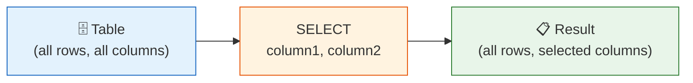

# 1강: SELECT 기초

`SELECT` 문은 SQL의 근간입니다. 하나 이상의 테이블에서 데이터를 조회하며, 어떤 컬럼을 반환할지, 어떻게 표시할지를 정밀하게 지정할 수 있습니다.



> **개념:** SELECT는 테이블에서 원하는 컬럼만 골라서 보여줍니다.

## 전체 컬럼 조회

`SELECT *`를 사용하면 테이블의 모든 컬럼을 가져옵니다. 데이터를 빠르게 훑어볼 때 유용합니다.

```sql
SELECT * FROM products;
```

**결과:**

| id | sku | name | category_id | supplier_id | price | stock_qty | is_active | ... |
|----|-----|------|-------------|-------------|-------|-----------|-----------|-----|
| 1 | SKU-0001 | Dell XPS 15 Laptop | 3 | 12 | 1299.99 | 42 | 1 | ... |
| 2 | SKU-0002 | Logitech MX Master 3 | 8 | 7 | 99.99 | 156 | 1 | ... |
| 3 | SKU-0003 | Samsung 27" Monitor | 5 | 3 | 449.99 | 38 | 1 | ... |
| ... | | | | | | | | |

> **팁:** `SELECT *`는 모든 컬럼을 가져오므로 대용량 테이블에서는 속도가 느릴 수 있습니다. 실제 운영 환경에서는 필요한 컬럼만 명시하는 것이 좋습니다.

## 특정 컬럼만 조회

컬럼 이름을 직접 나열하면 원하는 컬럼만 반환됩니다. 결과가 깔끔해지고 전송 데이터양도 줄어듭니다.

```sql
SELECT name, price, stock_qty
FROM products;
```

**결과:**

| name | price | stock_qty |
|------|-------|-----------|
| Dell XPS 15 Laptop | 1299.99 | 42 |
| Logitech MX Master 3 | 99.99 | 156 |
| Samsung 27" Monitor | 449.99 | 38 |
| ... | | |

## 컬럼 별칭 (AS)

`AS`를 사용하면 결과에서 컬럼 이름을 바꿀 수 있습니다. 가독성을 높이고, 이름이 없는 계산식에 이름을 붙일 때 특히 유용합니다.

```sql
SELECT
    name        AS product_name,
    price       AS unit_price,
    stock_qty   AS in_stock
FROM products;
```

**결과:**

| product_name | unit_price | in_stock |
|--------------|------------|----------|
| Dell XPS 15 Laptop | 1299.99 | 42 |
| Logitech MX Master 3 | 99.99 | 156 |
| Samsung 27" Monitor | 449.99 | 38 |
| ... | | |

계산식에도 별칭을 붙일 수 있습니다.

```sql
SELECT
    name,
    price * 1.1 AS price_with_tax
FROM products;
```

**결과:**

| name | price_with_tax |
|------|----------------|
| Dell XPS 15 Laptop | 1429.989 |
| Logitech MX Master 3 | 109.989 |
| ... | |

## DISTINCT

`DISTINCT`는 결과에서 중복 값을 제거합니다. 컬럼에 어떤 값들이 존재하는지 확인할 때 유용합니다.

```sql
-- 고객 등급에 어떤 값들이 있는지 확인
SELECT DISTINCT grade
FROM customers;
```

**결과:**

| grade |
|-------|
| BRONZE |
| SILVER |
| GOLD |
| VIP |

```sql
-- 성별 고유값 조회 (NULL 포함)
SELECT DISTINCT gender
FROM customers;
```

**결과:**

| gender |
|--------|
| M |
| F |
| (NULL) |

## 기법 조합

```sql
-- 고객의 활성/비활성 상태 고유값 조회
SELECT DISTINCT is_active AS status
FROM customers
ORDER BY is_active;
```

**결과:**

| status |
|--------|
| 0 |
| 1 |

!!! note "레슨 복습 문제"
    이 레슨에서 배운 개념을 바로 확인하는 간단한 문제입니다. 여러 개념을 종합하는 실전 연습은 [연습 문제](../exercises/) 섹션을 참고하세요.

## 연습 문제

### 문제 1
모든 고객의 `name`, `email`, `grade`를 조회하세요. 각 컬럼에 `full_name`, `email_address`, `membership_tier`라는 별칭을 붙이세요.

??? success "정답"
    ```sql
    SELECT
        name        AS full_name,
        email       AS email_address,
        grade       AS membership_tier
    FROM customers;
    ```

### 문제 2
`payments` 테이블에서 `method` 컬럼의 고유값을 모두 조회하여 TechShop이 지원하는 결제 수단을 확인하세요.

??? success "정답"
    ```sql
    SELECT DISTINCT method
    FROM payments;
    ```

### 문제 3
`products` 테이블에서 `name`, `price`, `stock_qty`를 조회하세요. 그리고 `price * stock_qty`로 계산된 `inventory_value`라는 컬럼을 추가하세요.

??? success "정답"
    ```sql
    SELECT
        name,
        price,
        stock_qty,
        price * stock_qty AS inventory_value
    FROM products;
    ```

---
다음: [2강: WHERE로 데이터 필터링](02-where.md)
