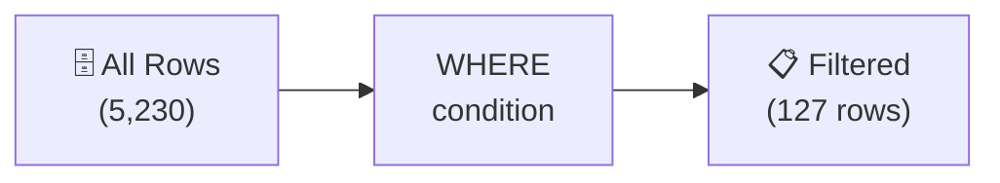

# 2강: WHERE로 데이터 필터링

`WHERE` 절은 조건을 만족하는 행만 결과에 포함시킵니다. `WHERE`가 없으면 테이블의 모든 행이 반환됩니다. 실무에서 의미 있는 데이터를 뽑아내려면 `WHERE` 사용이 필수입니다.



> **개념:** WHERE는 조건에 맞는 행만 걸러냅니다. 전체 5,230명 중 VIP 127명만 추출하는 것과 같습니다.

## 비교 연산자

| 연산자 | 의미 |
|--------|------|
| `=` | 같다 |
| `<>` 또는 `!=` | 같지 않다 |
| `<`, `<=` | 미만, 이하 |
| `>`, `>=` | 초과, 이상 |

```sql
-- 가격이 50만 원 이상인 상품
SELECT name, price
FROM products
WHERE price > 500;
```

**결과:**

| name | price |
|------|------:|
| Dell XPS 15 Laptop | 1299.99 |
| ASUS ROG Gaming Desktop | 1899.00 |
| ... | |

```sql
-- 판매 중인 상품만 조회
SELECT name, price, stock_qty
FROM products
WHERE is_active = 1;
```

## AND / OR

`AND`는 두 조건이 모두 참일 때, `OR`는 하나라도 참일 때 행을 포함합니다.

```sql
-- 판매 중이고 가격이 10만~50만 원인 상품
SELECT name, price
FROM products
WHERE is_active = 1
  AND price >= 100
  AND price <= 500;
```

**결과:**

| name | price |
|------|------:|
| Samsung 27" Monitor | 449.99 |
| Corsair 16GB DDR5 RAM | 129.99 |
| WD Black 1TB SSD | 189.99 |
| ... | |

```sql
-- VIP 또는 GOLD 등급 고객
SELECT name, email, grade
FROM customers
WHERE grade = 'VIP'
   OR grade = 'GOLD';
```

> **팁:** `AND`와 `OR`를 함께 사용할 때는 괄호로 우선순위를 명확히 하세요.
> `WHERE (grade = 'VIP' OR grade = 'GOLD') AND is_active = 1`

## IN

`IN`은 같은 칼럼에 대한 여러 `OR` 조건을 간결하게 표현합니다.

```sql
-- GOLD 또는 VIP 고객 조회 (IN 사용이 더 간결)
SELECT name, grade
FROM customers
WHERE grade IN ('GOLD', 'VIP');
```

**결과:**

| name | grade |
|------|-------|
| 김민수 | VIP |
| 이영희 | GOLD |
| 박지훈 | VIP |
| ... | |

```sql
-- 처리가 완료된 상태의 주문 조회
SELECT order_number, status, total_amount
FROM orders
WHERE status IN ('delivered', 'confirmed', 'returned');
```

## BETWEEN

`BETWEEN`은 양 끝값을 포함하는 범위 조건입니다. `>= 최솟값 AND <= 최댓값`과 동일합니다.

```sql
-- 가격이 5만~20만 원인 상품
SELECT name, price
FROM products
WHERE price BETWEEN 50 AND 200;
```

**결과:**

| name | price |
|------|------:|
| Logitech MX Master 3 | 99.99 |
| Corsair 16GB DDR5 RAM | 129.99 |
| WD Black 1TB SSD | 189.99 |
| ... | |

```sql
-- 2024년 1분기에 접수된 주문
SELECT order_number, ordered_at, total_amount
FROM orders
WHERE ordered_at BETWEEN '2024-01-01' AND '2024-03-31 23:59:59';
```

## LIKE

`LIKE`는 텍스트 패턴을 매칭합니다. `%`는 임의의 문자열, `_`는 정확히 한 글자를 대체합니다.

```sql
-- 이름에 "Gaming"이 포함된 상품
SELECT name, price
FROM products
WHERE name LIKE '%Gaming%';
```

**결과:**

| name | price |
|------|------:|
| ASUS ROG Gaming Desktop | 1899.00 |
| Razer BlackWidow Gaming Keyboard | 149.99 |
| SteelSeries Gaming Headset | 79.99 |
| ... | |

```sql
-- testmail.kr 도메인을 사용하는 고객
SELECT name, email
FROM customers
WHERE email LIKE '%@testmail.kr';
```

## IS NULL / IS NOT NULL

NULL은 "알 수 없음" 또는 "없음"을 의미합니다. 0이나 빈 문자열과는 다릅니다. NULL 비교에는 `= NULL`이 아니라 반드시 `IS NULL`을 사용해야 합니다.

```sql
-- 생년월일이 등록되지 않은 고객
SELECT name, email
FROM customers
WHERE birth_date IS NULL;
```

**결과:**

| name | email |
|------|-------|
| 최준혁 | choi.junhyuk@testmail.kr |
| 강소연 | kang.soyeon@testmail.kr |
| ... | |

```sql
-- 배송 메모가 있는 주문
SELECT order_number, notes
FROM orders
WHERE notes IS NOT NULL;
```

!!! note "레슨 복습 문제"
    이 레슨에서 배운 개념을 바로 확인하는 간단한 문제입니다. 여러 개념을 종합하는 실전 연습은 [연습 문제](../exercises/index.md) 섹션을 참고하세요.

## 연습 문제

### 문제 1
여성 고객(`gender = 'F'`) 중 SILVER 또는 GOLD 등급인 고객을 찾으세요. `name`, `grade`, `point_balance`를 반환하세요.

??? success "정답"
    ```sql
    SELECT name, grade, point_balance
    FROM customers
    WHERE gender = 'F'
      AND grade IN ('SILVER', 'GOLD');
    ```

### 문제 2
판매 중(`is_active = 1`)이고 가격이 200~800 사이인 상품을 조회하세요. `name`과 `price`를 반환하되, 가격 내림차순으로 정렬하세요.

??? success "정답"
    ```sql
    SELECT name, price
    FROM products
    WHERE is_active = 1
      AND price BETWEEN 200 AND 800
    ORDER BY price DESC;
    ```

### 문제 3
성별이 알 수 없고(NULL) 마지막 로그인 기록도 없는(`last_login_at IS NULL`) 고객을 찾으세요. `name`과 `created_at`을 반환하세요.

??? success "정답"
    ```sql
    SELECT name, created_at
    FROM customers
    WHERE gender IS NULL
      AND last_login_at IS NULL;
    ```

### 문제 4
가격이 1,000 이상인 상품의 `name`과 `price`를 조회하세요.

??? success "정답"
    ```sql
    SELECT name, price
    FROM products
    WHERE price >= 1000;
    ```

### 문제 5
재고가 0이 아닌 상품(`stock_qty <> 0`)의 `name`과 `stock_qty`를 조회하세요.

??? success "정답"
    ```sql
    SELECT name, stock_qty
    FROM products
    WHERE stock_qty <> 0;
    ```

### 문제 6
`customers` 테이블에서 포인트 잔액이 500에서 2000 사이인 GOLD 등급 고객의 `name`과 `point_balance`를 조회하세요.

??? success "정답"
    ```sql
    SELECT name, point_balance
    FROM customers
    WHERE grade = 'GOLD'
      AND point_balance BETWEEN 500 AND 2000;
    ```

### 문제 7
주문 상태가 `'pending'` 또는 `'processing'`인 주문의 `order_number`와 `status`를 조회하세요. `IN` 연산자를 사용하세요.

??? success "정답"
    ```sql
    SELECT order_number, status
    FROM orders
    WHERE status IN ('pending', 'processing');
    ```

### 문제 8
상품명이 "Keyboard"로 끝나는 상품의 `name`과 `price`를 조회하세요.

??? success "정답"
    ```sql
    SELECT name, price
    FROM products
    WHERE name LIKE '%Keyboard';
    ```

### 문제 9
`staff` 테이블에서 `department`가 `'Sales'`가 아닌 활성 직원(`is_active = 1`)의 `name`과 `department`를 조회하세요.

??? success "정답"
    ```sql
    SELECT name, department
    FROM staff
    WHERE is_active = 1
      AND department <> 'Sales';
    ```

### 문제 10
`customers` 테이블에서 VIP 등급이면서 비활성(`is_active = 0`)이거나, 포인트 잔액이 5000 이상인 고객의 `name`, `grade`, `point_balance`, `is_active`를 조회하세요. 괄호를 사용하여 조건 우선순위를 명확히 하세요.

??? success "정답"
    ```sql
    SELECT name, grade, point_balance, is_active
    FROM customers
    WHERE (grade = 'VIP' AND is_active = 0)
       OR point_balance >= 5000;
    ```

---
다음: [3강: 정렬과 페이지네이션](03-sort-limit.md)
