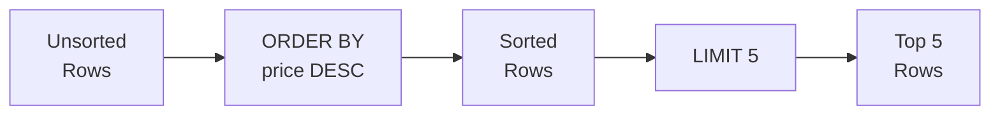

# 3강: 정렬과 페이징

2강에서 WHERE로 원하는 행만 필터링했습니다. 하지만 결과가 무작위 순서로 나왔죠? ORDER BY로 정렬하고, LIMIT로 상위 N건만 가져올 수 있습니다.

!!! note "이미 알고 계신다면"
    ORDER BY, LIMIT, OFFSET을 이미 알고 있다면 [4강: 집계 함수](04-aggregates.md)로 건너뛰세요.

SQL 결과의 행 순서는 별도로 지정하지 않으면 보장되지 않습니다. `ORDER BY`로 하나 이상의 칼럼을 기준으로 정렬할 수 있고, `LIMIT`과 `OFFSET`으로 대용량 결과를 페이지 단위로 나눠 조회할 수 있습니다.



> **개념:** ORDER BY로 정렬한 후 LIMIT로 상위 N개만 잘라냅니다.

## ORDER BY — 단일 칼럼

칼럼 이름 뒤에 `ASC`(오름차순, 기본값) 또는 `DESC`(내림차순)를 붙입니다.

```sql
-- 가격이 낮은 상품부터 정렬
SELECT name, price
FROM products
WHERE is_active = 1
ORDER BY price ASC;
```

**결과:**

| name                            | price |
| ------------------------------- | ----: |
| TP-Link TG-3468 블랙              | 13100 |
| Microsoft Ergonomic Keyboard 실버 | 23000 |
| TP-Link Archer TBE400E 화이트      | 23300 |
| ...                             | ...   |

```sql
-- 가격이 높은 상품부터 정렬
SELECT name, price
FROM products
WHERE is_active = 1
ORDER BY price DESC;
```

**결과:**

| name                                                          | price   |
| ------------------------------------------------------------- | ------: |
| ASUS ROG Strix GT35                                           | 4314800 |
| ASUS Dual RTX 5070 Ti [특별 한정판 에디션] 저소음 설계, 에너지 효율 1등급, 친환경 포장 | 4226200 |
| Razer Blade 18 블랙                                             | 4182100 |
| ...                                                           | ...     |

## ORDER BY — 다중 칼럼

첫 번째 칼럼으로 먼저 정렬하고, 값이 같은 경우 두 번째 칼럼으로 정렬합니다.

```sql
-- 등급순 정렬, 같은 등급 안에서는 이름 가나다순
SELECT name, grade, point_balance
FROM customers
WHERE is_active = 1
ORDER BY grade ASC, name ASC;
```

**결과:**

| name | grade  | point_balance |
| ---- | ------ | ------------: |
| 강건우  | BRONZE |             0 |
| 강경자  | BRONZE |        139947 |
| 강광수  | BRONZE |             0 |
| ...  | ...    | ...           |

```sql
-- 최신 주문부터 정렬, 같은 시각이면 주문 금액 내림차순
SELECT order_number, ordered_at, total_amount
FROM orders
ORDER BY ordered_at DESC, total_amount DESC;
```

**결과:**

| order_number       | ordered_at          | total_amount |
| ------------------ | ------------------- | -----------: |
| ORD-20250630-34900 | 2025-06-30 23:02:18 |      1483000 |
| ORD-20250630-34905 | 2025-06-30 22:33:25 |       152600 |
| ORD-20250630-34903 | 2025-06-30 20:51:27 |       401800 |
| ...                | ...                 | ...          |

## LIMIT

`LIMIT n`은 최대 `n`개의 행만 반환합니다. `ORDER BY`와 함께 사용하면 "상위 N개" 결과를 의미 있게 뽑을 수 있습니다.

```sql
-- 판매 중인 상품 중 가장 비싼 5개
SELECT name, price
FROM products
WHERE is_active = 1
ORDER BY price DESC
LIMIT 5;
```

**결과:**

| name                                                          | price   |
| ------------------------------------------------------------- | ------: |
| ASUS ROG Strix GT35                                           | 4314800 |
| ASUS Dual RTX 5070 Ti [특별 한정판 에디션] 저소음 설계, 에너지 효율 1등급, 친환경 포장 | 4226200 |
| Razer Blade 18 블랙                                             | 4182100 |
| Razer Blade 16 실버                                             | 4123800 |
| MacBook Air 15 M3 실버                                          | 3774700 |

## OFFSET — 페이징(Pagination)

{ .off-glb width="480"  }

`OFFSET n`은 앞의 `n`개 행을 건너뛰고 이후부터 반환합니다. `LIMIT`과 함께 사용하면 페이지 기반 탐색을 구현할 수 있습니다.

```sql
-- 1페이지: 1~10번째 행
SELECT name, price
FROM products
WHERE is_active = 1
ORDER BY name ASC
LIMIT 10 OFFSET 0;

-- 2페이지: 11~20번째 행
SELECT name, price
FROM products
WHERE is_active = 1
ORDER BY name ASC
LIMIT 10 OFFSET 10;

-- 3페이지: 21~30번째 행
SELECT name, price
FROM products
WHERE is_active = 1
ORDER BY name ASC
LIMIT 10 OFFSET 20;
```

**1페이지 결과:**

| name | price |
|------|------:|
| ASUS ProArt Studiobook 16 | 2099.00 |
| ASUS ROG Gaming Desktop | 1899.00 |
| ASUS ROG Swift 27" Monitor | 799.00 |
| ASUS TUF Gaming Laptop | 1099.00 |
| ... | |

> **공식:** `OFFSET = (페이지 번호 - 1) × 페이지 크기`

## NULL 값의 정렬 순서

SQLite에서는 `ASC` 정렬 시 NULL이 다른 값보다 앞에 오고, `DESC` 정렬 시 뒤에 옵니다.

```sql
-- birth_date 오름차순 정렬 시 NULL이 먼저 표시됨
SELECT name, birth_date
FROM customers
ORDER BY birth_date ASC
LIMIT 5;
```

**결과:**

| name | birth_date |
| ---- | ---------- |
| 김명자  | (NULL)     |
| 김정식  | (NULL)     |
| ...  | ...        |

## 정리

| 키워드 | 설명 | 예시 |
|--------|------|------|
| `ORDER BY col ASC` | 오름차순 정렬 (기본값) | `ORDER BY price ASC` |
| `ORDER BY col DESC` | 내림차순 정렬 | `ORDER BY price DESC` |
| 다중 칼럼 정렬 | 첫 번째 칼럼이 같으면 두 번째 칼럼으로 정렬 | `ORDER BY grade ASC, name ASC` |
| `LIMIT n` | 최대 n개 행만 반환 | `LIMIT 5` |
| `OFFSET n` | 앞의 n개 행을 건너뜀 | `LIMIT 10 OFFSET 20` (3페이지) |
| NULL 정렬 | SQLite: ASC 시 NULL이 앞, DESC 시 NULL이 뒤 | `ORDER BY birth_date IS NULL ASC, birth_date ASC` |

!!! note "레슨 복습 문제"
    이 레슨에서 배운 개념을 바로 확인하는 간단한 문제입니다. 여러 개념을 종합하는 실전 연습은 [연습 문제](../exercises/index.md) 섹션을 참고하세요.

## 연습 문제

### 문제 1
가장 최근에 접수된 주문 10개를 찾으세요. `order_number`, `ordered_at`, `status`, `total_amount`를 반환하세요.

??? success "정답"
    ```sql
    SELECT order_number, ordered_at, status, total_amount
    FROM orders
    ORDER BY ordered_at DESC
    LIMIT 10;
    ```

    **결과 (예시):**

    | order_number       | ordered_at          | status    | total_amount |
    | ------------------ | ------------------- | --------- | -----------: |
    | ORD-20250630-34900 | 2025-06-30 23:02:18 | pending   |      1483000 |
    | ORD-20250630-34905 | 2025-06-30 22:33:25 | pending   |       152600 |
    | ORD-20250630-34903 | 2025-06-30 20:51:27 | cancelled |       401800 |
    | ORD-20250630-34899 | 2025-06-30 19:05:22 | pending   |       167500 |
    | ORD-20250630-34896 | 2025-06-30 16:48:11 | pending   |      1646400 |
    | ...                | ...                 | ...       | ...          |


### 문제 2
모든 상품을 `stock_qty` 오름차순(재고 적은 순)으로 정렬하고, 재고가 같으면 `price` 내림차순으로 정렬하세요. `name`, `stock_qty`, `price`를 반환하되 20행으로 제한하세요.

??? success "정답"
    ```sql
    SELECT name, stock_qty, price
    FROM products
    ORDER BY stock_qty ASC, price DESC
    LIMIT 20;
    ```

    **결과 (예시):**

    | name                        | stock_qty | price  |
    | --------------------------- | --------: | -----: |
    | Arctic Freezer 36 A-RGB 화이트 |         0 |  31400 |
    | 삼성 SPA-KFG0BUB              |         4 |  26200 |
    | 삼성 DDR4 32GB PC4-25600      |         6 | 114400 |
    | Norton AntiVirus Plus       |         8 |  57000 |
    | 로지텍 G502 HERO 실버            |         8 |  47900 |
    | ...                         | ...       | ...    |


### 문제 3
판매 중인 상품 카탈로그의 3페이지(페이지당 10개)를 상품명 가나다순으로 조회하세요.

??? success "정답"
    ```sql
    SELECT name, price, stock_qty
    FROM products
    WHERE is_active = 1
    ORDER BY name ASC
    LIMIT 10 OFFSET 20;
    ```

    **결과 (예시):**

    | name                          | price   | stock_qty |
    | ----------------------------- | ------: | --------: |
    | ASUS PCE-BE92BT               |   48800 |       351 |
    | ASUS PCE-BE92BT 블랙            |   57200 |        74 |
    | ASUS ROG MAXIMUS Z890 HERO 블랙 | 1048400 |       419 |
    | ASUS ROG STRIX RX 7900 XTX 실버 | 1267300 |       312 |
    | ASUS ROG Strix G16CH 실버       | 1609400 |        28 |
    | ...                           | ...     | ...       |


### 문제 4
`customers` 테이블에서 포인트가 가장 많은 고객 5명의 `name`, `grade`, `point_balance`를 조회하세요.

??? success "정답"
    ```sql
    SELECT name, grade, point_balance
    FROM customers
    ORDER BY point_balance DESC
    LIMIT 5;
    ```

    **결과 (예시):**

    | name | grade | point_balance |
    | ---- | ----- | ------------: |
    | 박정수  | VIP   |       3341740 |
    | 강명자  | VIP   |       2908232 |
    | 김병철  | VIP   |       2818474 |
    | 이영자  | VIP   |       2772254 |
    | 이미정  | VIP   |       2282481 |


### 문제 5
`products` 테이블에서 `name`과 `price`를 가격 오름차순으로 정렬하세요. 가격이 같으면 상품명 알파벳 순으로 정렬하세요.

??? success "정답"
    ```sql
    SELECT name, price
    FROM products
    ORDER BY price ASC, name ASC;
    ```

    **결과 (예시):**

    | name                            | price |
    | ------------------------------- | ----: |
    | TP-Link TG-3468 블랙              | 13100 |
    | 로지텍 MX Anywhere 3S 블랙           | 18400 |
    | Microsoft Ergonomic Keyboard 실버 | 23000 |
    | TP-Link Archer TBE400E 화이트      | 23300 |
    | 삼성 SPA-KFG0BUB                  | 26200 |
    | ...                             | ...   |


### 문제 6
`products` 테이블에서 `name`, `price`, `cost_price`를 조회하고, 마진(`price - cost_price`)이 큰 순서대로 정렬하세요. 상위 10개만 반환하세요.

??? success "정답"
    ```sql
    SELECT name, price, cost_price
    FROM products
    ORDER BY price - cost_price DESC
    LIMIT 10;
    ```

    **결과 (예시):**

    | name                  | price   | cost_price |
    | --------------------- | ------: | ---------: |
    | Razer Blade 16 실버     | 4123800 |    2886700 |
    | ASUS ROG Zephyrus G16 | 4284100 |    3084600 |
    | BenQ PD3225U          | 2500400 |    1312500 |
    | Razer Blade 18 블랙     | 4182100 |    3047200 |
    | ASUS ROG Strix GT35   | 4314800 |    3236100 |
    | ...                   | ...     | ...        |


### 문제 7
`reviews` 테이블에서 `product_id`, `rating`, `created_at`을 조회하되, 최신 리뷰부터 정렬하여 6번째에서 10번째 리뷰(2페이지, 페이지당 5개)를 반환하세요.

??? success "정답"
    ```sql
    SELECT product_id, rating, created_at
    FROM reviews
    ORDER BY created_at DESC
    LIMIT 5 OFFSET 5;
    ```

    **결과 (예시):**

    | product_id | rating | created_at          |
    | ---------: | -----: | ------------------- |
    |        111 |      4 | 2025-07-07 08:04:36 |
    |         90 |      2 | 2025-07-05 19:12:59 |
    |        243 |      4 | 2025-07-05 08:38:27 |
    |        185 |      5 | 2025-07-05 00:42:20 |
    |        247 |      4 | 2025-07-04 20:49:23 |


### 문제 8
`staff` 테이블에서 `name`, `department`, `hired_at`을 조회하세요. 부서명 알파벳 순으로 정렬하되, 같은 부서 안에서는 입사일이 오래된 직원이 먼저 오도록 정렬하세요.

??? success "정답"
    ```sql
    SELECT name, department, hired_at
    FROM staff
    ORDER BY department ASC, hired_at ASC;
    ```

    **결과 (예시):**

    | name | department | hired_at   |
    | ---- | ---------- | ---------- |
    | 한민재  | 경영         | 2016-05-23 |
    | 장주원  | 경영         | 2017-08-20 |
    | 박경수  | 경영         | 2022-10-12 |
    | 권영희  | 마케팅        | 2024-08-05 |
    | 이준혁  | 영업         | 2022-03-02 |


### 문제 9
`customers` 테이블에서 `name`과 `birth_date`를 조회하되, 생년월일이 NULL인 고객이 결과의 맨 뒤에 오도록 정렬하세요. NULL이 아닌 고객은 생년월일 오름차순으로 정렬하세요.

=== "SQLite"
    ??? success "정답"
        ```sql
        SELECT name, birth_date
        FROM customers
        ORDER BY birth_date IS NULL ASC, birth_date ASC;
        ```

=== "MySQL"
    ??? success "정답"
        ```sql
        SELECT name, birth_date
        FROM customers
        ORDER BY birth_date IS NULL ASC, birth_date ASC;
        ```

=== "PostgreSQL"
    ??? success "정답"
        ```sql
        SELECT name, birth_date
        FROM customers
        ORDER BY birth_date ASC NULLS LAST;
        ```

### 문제 10
`orders` 테이블에서 `order_number`, `total_amount`, `ordered_at`을 조회하세요. 주문 금액이 높은 순으로 정렬하고, 금액이 같으면 최신 주문이 먼저 오도록 정렬하여 상위 15개만 반환하세요.

??? success "정답"
    ```sql
    SELECT order_number, total_amount, ordered_at
    FROM orders
    ORDER BY total_amount DESC, ordered_at DESC
    LIMIT 15;
    ```

    **결과 (예시):**

    | order_number       | total_amount | ordered_at          |
    | ------------------ | -----------: | ------------------- |
    | ORD-20210628-12574 |     58039800 | 2021-06-28 12:36:22 |
    | ORD-20230809-24046 |     55047300 | 2023-08-09 13:49:22 |
    | ORD-20210321-11106 |     48718000 | 2021-03-21 07:27:22 |
    | ORD-20200605-07165 |     47954000 | 2020-06-05 12:25:59 |
    | ORD-20231020-25036 |     46945700 | 2023-10-20 13:57:47 |
    | ...                | ...          | ...                 |


### 채점 가이드

| 점수 | 다음 단계 |
|:----:|----------|
| **9~10개** | [4강: 집계 함수](04-aggregates.md)로 이동 |
| **7~8개** | 틀린 문제 해설을 복습한 뒤 4강으로 |
| **5개 이하** | 이 강의를 다시 읽어보세요 |
| **3개 이하** | [2강: WHERE로 필터링](02-where.md)부터 다시 시작하세요 |

**문제별 영역:**

| 영역 | 해당 문제 |
|------|:--------:|
| ORDER BY DESC + LIMIT | 1, 4 |
| 다중 정렬 (ASC/DESC) | 2, 5, 8 |
| LIMIT + OFFSET (페이징) | 3, 7 |
| ORDER BY 표현식 + LIMIT | 6 |
| NULL 정렬 처리 | 9 |
| 다중 정렬 + LIMIT | 10 |

---
다음: [4강: 집계 함수](04-aggregates.md)
