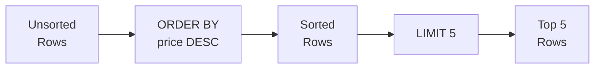

# 3강: 정렬과 페이지네이션

SQL 결과의 행 순서는 별도로 지정하지 않으면 보장되지 않습니다. `ORDER BY`로 하나 이상의 칼럼을 기준으로 정렬할 수 있고, `LIMIT`과 `OFFSET`으로 대용량 결과를 페이지 단위로 나눠 조회할 수 있습니다.



> **개념:** ORDER BY로 정렬한 후 LIMIT로 상위 N개만 잘라냅니다.

## ORDER BY — 단일 칼럼

칼럼 이름 뒤에 `ASC`(오름차순, 기본값) 또는 `DESC`(내림차순)를 붙입니다.

```sql
-- 가격이 낮은 상품부터 정렬
SELECT name, price
FROM products
WHERE is_active = 1
ORDER BY price ASC;
```

**결과:**

| name | price |
|------|------:|
| USB-C Cable 2m | 9.99 |
| Microfiber Cleaning Kit | 12.99 |
| Screen Protector 15" | 14.99 |
| ... | |

```sql
-- 가격이 높은 상품부터 정렬
SELECT name, price
FROM products
WHERE is_active = 1
ORDER BY price DESC;
```

**결과:**

| name | price |
|------|------:|
| ASUS ProArt 32" 4K Monitor | 2199.00 |
| Dell XPS 17 Laptop | 1999.00 |
| ASUS ROG Gaming Desktop | 1899.00 |
| ... | |

## ORDER BY — 다중 칼럼

첫 번째 칼럼으로 먼저 정렬하고, 값이 같은 경우 두 번째 칼럼으로 정렬합니다.

```sql
-- 등급순 정렬, 같은 등급 안에서는 이름 가나다순
SELECT name, grade, point_balance
FROM customers
WHERE is_active = 1
ORDER BY grade ASC, name ASC;
```

**결과:**

| name | grade | point_balance |
|------|-------|--------------:|
| 강민준 | BRONZE | 120 |
| 김서연 | BRONZE | 450 |
| 박지우 | BRONZE | 80 |
| ... | | |
| ... | SILVER | ... |

```sql
-- 최신 주문부터 정렬, 같은 시각이면 주문 금액 내림차순
SELECT order_number, ordered_at, total_amount
FROM orders
ORDER BY ordered_at DESC, total_amount DESC;
```

**결과:**

| order_number | ordered_at | total_amount |
|--------------|------------|-------------:|
| ORD-20241231-09842 | 2024-12-31 23:58:01 | 2349.00 |
| ORD-20241231-09841 | 2024-12-31 23:41:17 | 149.99 |
| ORD-20241231-09840 | 2024-12-31 22:59:44 | 89.99 |
| ... | | |

## LIMIT

`LIMIT n`은 최대 `n`개의 행만 반환합니다. `ORDER BY`와 함께 사용하면 "상위 N개" 결과를 의미 있게 뽑을 수 있습니다.

```sql
-- 판매 중인 상품 중 가장 비싼 5개
SELECT name, price
FROM products
WHERE is_active = 1
ORDER BY price DESC
LIMIT 5;
```

**결과:**

| name | price |
|------|------:|
| ASUS ProArt 32" 4K Monitor | 2199.00 |
| Dell XPS 17 Laptop | 1999.00 |
| ASUS ROG Gaming Desktop | 1899.00 |
| MacBook Pro 16" M3 | 1799.00 |
| Dell XPS 15 Laptop | 1299.99 |

## OFFSET — 페이지네이션(Pagination)

{ .off-glb width="480"  }

`OFFSET n`은 앞의 `n`개 행을 건너뛰고 이후부터 반환합니다. `LIMIT`과 함께 사용하면 페이지 기반 탐색을 구현할 수 있습니다.

```sql
-- 1페이지: 1~10번째 행
SELECT name, price
FROM products
WHERE is_active = 1
ORDER BY name ASC
LIMIT 10 OFFSET 0;

-- 2페이지: 11~20번째 행
SELECT name, price
FROM products
WHERE is_active = 1
ORDER BY name ASC
LIMIT 10 OFFSET 10;

-- 3페이지: 21~30번째 행
SELECT name, price
FROM products
WHERE is_active = 1
ORDER BY name ASC
LIMIT 10 OFFSET 20;
```

**1페이지 결과:**

| name | price |
|------|------:|
| ASUS ProArt Studiobook 16 | 2099.00 |
| ASUS ROG Gaming Desktop | 1899.00 |
| ASUS ROG Swift 27" Monitor | 799.00 |
| ASUS TUF Gaming Laptop | 1099.00 |
| ... | |

> **공식:** `OFFSET = (페이지 번호 - 1) × 페이지 크기`

## NULL 값의 정렬 순서

SQLite에서는 `ASC` 정렬 시 NULL이 다른 값보다 앞에 오고, `DESC` 정렬 시 뒤에 옵니다.

```sql
-- birth_date 오름차순 정렬 시 NULL이 먼저 표시됨
SELECT name, birth_date
FROM customers
ORDER BY birth_date ASC
LIMIT 5;
```

**결과:**

| name | birth_date |
|------|------------|
| 최준혁 | (NULL) |
| 강소연 | (NULL) |
| ... | (NULL) |
| 김영철 | 1955-03-12 |
| ... | |

!!! note "레슨 복습 문제"
    이 레슨에서 배운 개념을 바로 확인하는 간단한 문제입니다. 여러 개념을 종합하는 실전 연습은 [연습 문제](../exercises/index.md) 섹션을 참고하세요.

## 연습 문제

### 문제 1
가장 최근에 접수된 주문 10개를 찾으세요. `order_number`, `ordered_at`, `status`, `total_amount`를 반환하세요.

??? success "정답"
    ```sql
    SELECT order_number, ordered_at, status, total_amount
    FROM orders
    ORDER BY ordered_at DESC
    LIMIT 10;
    ```

### 문제 2
모든 상품을 `stock_qty` 오름차순(재고 적은 순)으로 정렬하고, 재고가 같으면 `price` 내림차순으로 정렬하세요. `name`, `stock_qty`, `price`를 반환하되 20행으로 제한하세요.

??? success "정답"
    ```sql
    SELECT name, stock_qty, price
    FROM products
    ORDER BY stock_qty ASC, price DESC
    LIMIT 20;
    ```

### 문제 3
판매 중인 상품 카탈로그의 3페이지(페이지당 10개)를 상품명 가나다순으로 조회하세요.

??? success "정답"
    ```sql
    SELECT name, price, stock_qty
    FROM products
    WHERE is_active = 1
    ORDER BY name ASC
    LIMIT 10 OFFSET 20;
    ```

### 문제 4
`customers` 테이블에서 포인트가 가장 많은 고객 5명의 `name`, `grade`, `point_balance`를 조회하세요.

??? success "정답"
    ```sql
    SELECT name, grade, point_balance
    FROM customers
    ORDER BY point_balance DESC
    LIMIT 5;
    ```

### 문제 5
`products` 테이블에서 `name`과 `price`를 가격 오름차순으로 정렬하세요. 가격이 같으면 상품명 알파벳 순으로 정렬하세요.

??? success "정답"
    ```sql
    SELECT name, price
    FROM products
    ORDER BY price ASC, name ASC;
    ```

### 문제 6
`products` 테이블에서 `name`, `price`, `cost`를 조회하고, 마진(`price - cost`)이 큰 순서대로 정렬하세요. 상위 10개만 반환하세요.

??? success "정답"
    ```sql
    SELECT name, price, cost
    FROM products
    ORDER BY price - cost DESC
    LIMIT 10;
    ```

### 문제 7
`reviews` 테이블에서 `product_id`, `rating`, `created_at`을 조회하되, 최신 리뷰부터 정렬하여 6번째에서 10번째 리뷰(2페이지, 페이지당 5개)를 반환하세요.

??? success "정답"
    ```sql
    SELECT product_id, rating, created_at
    FROM reviews
    ORDER BY created_at DESC
    LIMIT 5 OFFSET 5;
    ```

### 문제 8
`staff` 테이블에서 `name`, `department`, `hired_at`을 조회하세요. 부서명 알파벳 순으로 정렬하되, 같은 부서 안에서는 입사일이 오래된 직원이 먼저 오도록 정렬하세요.

??? success "정답"
    ```sql
    SELECT name, department, hired_at
    FROM staff
    ORDER BY department ASC, hired_at ASC;
    ```

### 문제 9
`customers` 테이블에서 `name`과 `birth_date`를 조회하되, 생년월일이 NULL인 고객이 결과의 맨 뒤에 오도록 정렬하세요. NULL이 아닌 고객은 생년월일 오름차순으로 정렬하세요.

=== "SQLite"
    ??? success "정답"
        ```sql
        SELECT name, birth_date
        FROM customers
        ORDER BY birth_date IS NULL ASC, birth_date ASC;
        ```

=== "MySQL"
    ??? success "정답"
        ```sql
        SELECT name, birth_date
        FROM customers
        ORDER BY birth_date IS NULL ASC, birth_date ASC;
        ```

=== "PostgreSQL"
    ??? success "정답"
        ```sql
        SELECT name, birth_date
        FROM customers
        ORDER BY birth_date ASC NULLS LAST;
        ```

### 문제 10
`orders` 테이블에서 `order_number`, `total_amount`, `ordered_at`을 조회하세요. 주문 금액이 높은 순으로 정렬하고, 금액이 같으면 최신 주문이 먼저 오도록 정렬하여 상위 15개만 반환하세요.

??? success "정답"
    ```sql
    SELECT order_number, total_amount, ordered_at
    FROM orders
    ORDER BY total_amount DESC, ordered_at DESC
    LIMIT 15;
    ```

---
다음: [4강: 집계 함수](04-aggregates.md)
