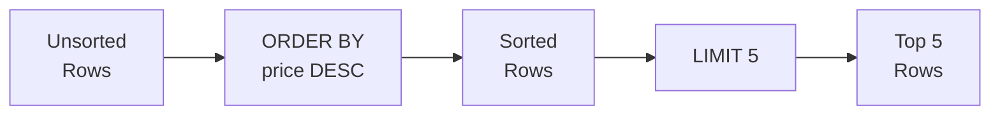

# 3강: 정렬과 페이징

2강에서 WHERE로 원하는 행만 필터링했습니다. 하지만 결과가 무작위 순서로 나왔죠? ORDER BY로 정렬하고, LIMIT로 상위 N건만 가져올 수 있습니다.

!!! note "이미 알고 계신다면"
    ORDER BY, LIMIT, OFFSET을 이미 알고 있다면 [4강: 집계 함수](04-aggregates.md)로 건너뛰세요.

SQL 결과의 행 순서는 별도로 지정하지 않으면 보장되지 않습니다. `ORDER BY`로 하나 이상의 칼럼을 기준으로 정렬할 수 있고, `LIMIT`과 `OFFSET`으로 대용량 결과를 페이지 단위로 나눠 조회할 수 있습니다.



> **개념:** ORDER BY로 정렬한 후 LIMIT로 상위 N개만 잘라냅니다.

## ORDER BY — 단일 칼럼

칼럼 이름 뒤에 `ASC`(오름차순, 기본값) 또는 `DESC`(내림차순)를 붙입니다.

```sql
-- 가격이 낮은 상품부터 정렬
SELECT name, price
FROM products
WHERE is_active = 1
ORDER BY price ASC;
```

**결과:**

| name | price |
| ---------- | ----------: |
| TP-Link TL-SG108 실버 | 16500.0 |
| TP-Link TG-3468 블랙 | 19800.0 |
| 삼성 무선 키보드 Trio 500 화이트 | 20300.0 |
| TP-Link TL-SG1016D 화이트 | 20300.0 |
| 로지텍 G502 HERO 실버 | 20300.0 |
| Razer Cobra 실버 | 20300.0 |
| TP-Link Archer TX55E 실버 | 20500.0 |
| 로지텍 G402 | 20500.0 |
| ... | ... |

```sql
-- 가격이 높은 상품부터 정렬
SELECT name, price
FROM products
WHERE is_active = 1
ORDER BY price DESC;
```

**결과:**

| name | price |
| ---------- | ----------: |
| Razer Blade 14 블랙 | 7495200.0 |
| Razer Blade 16 블랙 | 5634900.0 |
| Razer Blade 16 | 5518300.0 |
| Razer Blade 18 | 5450500.0 |
| Razer Blade 14 | 5339100.0 |
| Razer Blade 16 실버 | 5127500.0 |
| Razer Blade 18 화이트 | 4913500.0 |
| MSI GeForce RTX 5070 Ti VENTUS 3X 실버 | 4881500.0 |
| ... | ... |

## ORDER BY — 다중 칼럼

첫 번째 칼럼으로 먼저 정렬하고, 값이 같은 경우 두 번째 칼럼으로 정렬합니다.

```sql
-- 등급순 정렬, 같은 등급 안에서는 이름 가나다순
SELECT name, grade, point_balance
FROM customers
WHERE is_active = 1
ORDER BY grade ASC, name ASC;
```

**결과:**

| name | grade | point_balance |
| ---------- | ---------- | ----------: |
| 강건우 | BRONZE | 25290 |
| 강건우 | BRONZE | 89281 |
| 강건우 | BRONZE | 51511 |
| 강건우 | BRONZE | 1728 |
| 강경수 | BRONZE | 52847 |
| 강경수 | BRONZE | 402 |
| 강경수 | BRONZE | 81691 |
| 강경수 | BRONZE | 0 |
| ... | ... | ... |

```sql
-- 최신 주문부터 정렬, 같은 시각이면 주문 금액 내림차순
SELECT order_number, ordered_at, total_amount
FROM orders
ORDER BY ordered_at DESC, total_amount DESC;
```

**결과:**

| order_number | ordered_at | total_amount |
| ---------- | ---------- | ----------: |
| ORD-20251211-413965 | 2026-01-01 08:40:57 | 409600.0 |
| ORD-20251226-416837 | 2026-01-01 06:40:57 | 1169700.0 |
| ORD-20251231-417734 | 2025-12-31 23:28:51 | 2076300.0 |
| ORD-20251231-417696 | 2025-12-31 23:26:03 | 814400.0 |
| ORD-20251231-417737 | 2025-12-31 23:17:28 | 550600.0 |
| ORD-20251231-417735 | 2025-12-31 23:12:47 | 35000.0 |
| ORD-20251231-417677 | 2025-12-31 23:09:05 | 2002473.0 |
| ORD-20251231-417764 | 2025-12-31 23:00:56 | 42700.0 |
| ... | ... | ... |

## LIMIT

`LIMIT n`은 최대 `n`개의 행만 반환합니다. `ORDER BY`와 함께 사용하면 "상위 N개" 결과를 의미 있게 뽑을 수 있습니다.

```sql
-- 판매 중인 상품 중 가장 비싼 5개
SELECT name, price
FROM products
WHERE is_active = 1
ORDER BY price DESC
LIMIT 5;
```

**결과:**

| name | price |
| ---------- | ----------: |
| Razer Blade 14 블랙 | 7495200.0 |
| Razer Blade 16 블랙 | 5634900.0 |
| Razer Blade 16 | 5518300.0 |
| Razer Blade 18 | 5450500.0 |
| Razer Blade 14 | 5339100.0 |
| ... | ... |

## OFFSET — 페이징(Pagination)

{ .off-glb width="480"  }

`OFFSET n`은 앞의 `n`개 행을 건너뛰고 이후부터 반환합니다. `LIMIT`과 함께 사용하면 페이지 기반 탐색을 구현할 수 있습니다.

```sql
-- 1페이지: 1~10번째 행
SELECT name, price
FROM products
WHERE is_active = 1
ORDER BY name ASC
LIMIT 10 OFFSET 0;

-- 2페이지: 11~20번째 행
SELECT name, price
FROM products
WHERE is_active = 1
ORDER BY name ASC
LIMIT 10 OFFSET 10;

-- 3페이지: 21~30번째 행
SELECT name, price
FROM products
WHERE is_active = 1
ORDER BY name ASC
LIMIT 10 OFFSET 20;
```

**1페이지 결과:**

| name | price |
|------|------:|
| ASUS ProArt Studiobook 16 | 2099.00 |
| ASUS ROG Gaming Desktop | 1899.00 |
| ASUS ROG Swift 27" Monitor | 799.00 |
| ASUS TUF Gaming Laptop | 1099.00 |
| ... | |

> **공식:** `OFFSET = (페이지 번호 - 1) × 페이지 크기`

## NULL 값의 정렬 순서

SQLite에서는 `ASC` 정렬 시 NULL이 다른 값보다 앞에 오고, `DESC` 정렬 시 뒤에 옵니다.

```sql
-- birth_date 오름차순 정렬 시 NULL이 먼저 표시됨
SELECT name, birth_date
FROM customers
ORDER BY birth_date ASC
LIMIT 5;
```

**결과:**

| name | birth_date |
| ---------- | ---------- |
| 김명자 | (NULL) |
| 김정식 | (NULL) |
| 윤순옥 | (NULL) |
| 이서연 | (NULL) |
| 강민석 | (NULL) |
| ... | ... |

## 정리

| 키워드 | 설명 | 예시 |
|--------|------|------|
| `ORDER BY col ASC` | 오름차순 정렬 (기본값) | `ORDER BY price ASC` |
| `ORDER BY col DESC` | 내림차순 정렬 | `ORDER BY price DESC` |
| 다중 칼럼 정렬 | 첫 번째 칼럼이 같으면 두 번째 칼럼으로 정렬 | `ORDER BY grade ASC, name ASC` |
| `LIMIT n` | 최대 n개 행만 반환 | `LIMIT 5` |
| `OFFSET n` | 앞의 n개 행을 건너뜀 | `LIMIT 10 OFFSET 20` (3페이지) |
| NULL 정렬 | SQLite: ASC 시 NULL이 앞, DESC 시 NULL이 뒤 | `ORDER BY birth_date IS NULL ASC, birth_date ASC` |

!!! note "레슨 복습 문제"
    이 레슨에서 배운 개념을 바로 확인하는 간단한 문제입니다. 여러 개념을 종합하는 실전 연습은 [연습 문제](../exercises/index.md) 섹션을 참고하세요.

## 연습 문제

### 문제 1
가장 최근에 접수된 주문 10개를 찾으세요. `order_number`, `ordered_at`, `status`, `total_amount`를 반환하세요.

??? success "정답"
    ```sql
    SELECT order_number, ordered_at, status, total_amount
    FROM orders
    ORDER BY ordered_at DESC
    LIMIT 10;
    ```

    **결과 (예시):**

| order_number | ordered_at | status | total_amount |
| ---------- | ---------- | ---------- | ----------: |
| ORD-20251211-413965 | 2026-01-01 08:40:57 | pending | 409600.0 |
| ORD-20251226-416837 | 2026-01-01 06:40:57 | pending | 1169700.0 |
| ORD-20251231-417734 | 2025-12-31 23:28:51 | pending | 2076300.0 |
| ORD-20251231-417696 | 2025-12-31 23:26:03 | return_requested | 814400.0 |
| ORD-20251231-417737 | 2025-12-31 23:17:28 | pending | 550600.0 |
| ORD-20251231-417735 | 2025-12-31 23:12:47 | pending | 35000.0 |
| ORD-20251231-417677 | 2025-12-31 23:09:05 | pending | 2002473.0 |
| ORD-20251231-417764 | 2025-12-31 23:00:56 | pending | 42700.0 |
| ... | ... | ... | ... |


### 문제 2
모든 상품을 `stock_qty` 오름차순(재고 적은 순)으로 정렬하고, 재고가 같으면 `price` 내림차순으로 정렬하세요. `name`, `stock_qty`, `price`를 반환하되 20행으로 제한하세요.

??? success "정답"
    ```sql
    SELECT name, stock_qty, price
    FROM products
    ORDER BY stock_qty ASC, price DESC
    LIMIT 20;
    ```

    **결과 (예시):**

| name | stock_qty | price |
| ---------- | ----------: | ----------: |
| 한컴오피스 2024 기업용 실버 | 0 | 391200.0 |
| WD My Passport 2TB 블랙 | 0 | 329100.0 |
| 삼성 DDR5 32GB PC5-38400 실버 | 0 | 158000.0 |
| 삼성 DDR4 16GB PC4-25600 | 0 | 73600.0 |
| Arctic Freezer 36 A-RGB 화이트 | 0 | 27400.0 |
| Dell S2425HS 블랙 | 1 | 667900.0 |
| Dell U2723QE 실버 | 1 | 396300.0 |
| Arctic Liquid Freezer III 240 | 1 | 189300.0 |
| ... | ... | ... |


### 문제 3
판매 중인 상품 카탈로그의 3페이지(페이지당 10개)를 상품명 가나다순으로 조회하세요.

??? success "정답"
    ```sql
    SELECT name, price, stock_qty
    FROM products
    WHERE is_active = 1
    ORDER BY name ASC
    LIMIT 10 OFFSET 20;
    ```

    **결과 (예시):**

| name | price | stock_qty |
| ---------- | ----------: | ----------: |
| APC Back-UPS Pro BR1500G 실버 | 340300.0 | 292 |
| APC Back-UPS Pro BR1500G 화이트 | 233800.0 | 497 |
| APC Back-UPS Pro BR1500G 화이트 | 495000.0 | 241 |
| APC Back-UPS Pro Gaming BGM1500B 블랙 | 624300.0 | 393 |
| APC Back-UPS Pro Gaming BGM1500B 화이트 | 449500.0 | 22 |
| APC Smart-UPS SMT1500 | 561700.0 | 220 |
| APC Smart-UPS SMT1500 블랙 | 396600.0 | 217 |
| APC Smart-UPS SMT1500 블랙 | 137100.0 | 165 |
| ... | ... | ... |


### 문제 4
`customers` 테이블에서 포인트가 가장 많은 고객 5명의 `name`, `grade`, `point_balance`를 조회하세요.

??? success "정답"
    ```sql
    SELECT name, grade, point_balance
    FROM customers
    ORDER BY point_balance DESC
    LIMIT 5;
    ```

    **결과 (예시):**

| name | grade | point_balance |
| ---------- | ---------- | ----------: |
| 박정수 | VIP | 6344986 |
| 정유진 | VIP | 6255658 |
| 이미정 | VIP | 5999946 |
| 김상철 | VIP | 5406032 |
| 문영숙 | VIP | 4947814 |
| ... | ... | ... |


### 문제 5
`products` 테이블에서 `name`과 `price`를 가격 오름차순으로 정렬하세요. 가격이 같으면 상품명 알파벳 순으로 정렬하세요.

??? success "정답"
    ```sql
    SELECT name, price
    FROM products
    ORDER BY price ASC, name ASC;
    ```

    **결과 (예시):**

| name | price |
| ---------- | ----------: |
| TP-Link TL-SG108 실버 | 16500.0 |
| 로지텍 M100r | 17300.0 |
| 넷기어 GS308 블랙 | 17400.0 |
| TP-Link TL-SG108E | 18000.0 |
| 로지텍 G502 HERO [특별 한정판 에디션] 무상 보증 3년 연장 + 전용 파우치 증정 이벤트 | 19400.0 |
| TP-Link TG-3468 블랙 | 19800.0 |
| TP-Link TL-SG108 | 20100.0 |
| Razer Cobra 실버 | 20300.0 |
| ... | ... |


### 문제 6
`products` 테이블에서 `name`, `price`, `cost_price`를 조회하고, 마진(`price - cost_price`)이 큰 순서대로 정렬하세요. 상위 10개만 반환하세요.

??? success "정답"
    ```sql
    SELECT name, price, cost_price
    FROM products
    ORDER BY price - cost_price DESC
    LIMIT 10;
    ```

    **결과 (예시):**

| name | price | cost_price |
| ---------- | ----------: | ----------: |
| Razer Blade 14 블랙 | 7495200.0 | 4161000.0 |
| MacBook Air 13 M4 | 4449200.0 | 2451900.0 |
| Razer Blade 16 | 5518300.0 | 3703300.0 |
| MSI GeForce RTX 5070 Ti VENTUS 3X 실버 | 4881500.0 | 3168100.0 |
| Razer Blade 18 화이트 | 4913500.0 | 3251900.0 |
| Razer Blade 16 화이트 | 5503500.0 | 3852400.0 |
| Razer Blade 18 | 5450500.0 | 3815300.0 |
| MacBook Pro 14 M4 Pro | 4237400.0 | 2624000.0 |
| ... | ... | ... |


### 문제 7
`reviews` 테이블에서 `product_id`, `rating`, `created_at`을 조회하되, 최신 리뷰부터 정렬하여 6번째에서 10번째 리뷰(2페이지, 페이지당 5개)를 반환하세요.

??? success "정답"
    ```sql
    SELECT product_id, rating, created_at
    FROM reviews
    ORDER BY created_at DESC
    LIMIT 5 OFFSET 5;
    ```

    **결과 (예시):**

| product_id | rating | created_at |
| ----------: | ----------: | ---------- |
| 2616 | 2 | 2026-01-18 08:05:26 |
| 2724 | 4 | 2026-01-17 16:45:41 |
| 2736 | 4 | 2026-01-17 13:50:31 |
| 2183 | 5 | 2026-01-17 12:41:28 |
| 2273 | 4 | 2026-01-17 10:12:45 |
| ... | ... | ... |


### 문제 8
`staff` 테이블에서 `name`, `department`, `hired_at`을 조회하세요. 부서명 알파벳 순으로 정렬하되, 같은 부서 안에서는 입사일이 오래된 직원이 먼저 오도록 정렬하세요.

??? success "정답"
    ```sql
    SELECT name, department, hired_at
    FROM staff
    ORDER BY department ASC, hired_at ASC;
    ```

    **결과 (예시):**

| name | department | hired_at |
| ---------- | ---------- | ---------- |
| 김옥자 | CS | 2017-06-11 |
| 이현준 | CS | 2022-05-17 |
| 이순자 | CS | 2023-03-12 |
| 김영일 | 개발 | 2020-05-03 |
| 김현주 | 개발 | 2024-09-04 |
| 한민재 | 경영 | 2016-05-23 |
| 심정식 | 경영 | 2017-04-20 |
| 장주원 | 경영 | 2017-08-20 |
| ... | ... | ... |


### 문제 9
`customers` 테이블에서 `name`과 `birth_date`를 조회하되, 생년월일이 NULL인 고객이 결과의 맨 뒤에 오도록 정렬하세요. NULL이 아닌 고객은 생년월일 오름차순으로 정렬하세요.

=== "SQLite"
    ??? success "정답"
        ```sql
        SELECT name, birth_date
        FROM customers
        ORDER BY birth_date IS NULL ASC, birth_date ASC;
        ```

=== "MySQL"
    ??? success "정답"
        ```sql
        SELECT name, birth_date
        FROM customers
        ORDER BY birth_date IS NULL ASC, birth_date ASC;
        ```

=== "PostgreSQL"
    ??? success "정답"
        ```sql
        SELECT name, birth_date
        FROM customers
        ORDER BY birth_date ASC NULLS LAST;
        ```

### 문제 10
`orders` 테이블에서 `order_number`, `total_amount`, `ordered_at`을 조회하세요. 주문 금액이 높은 순으로 정렬하고, 금액이 같으면 최신 주문이 먼저 오도록 정렬하여 상위 15개만 반환하세요.

??? success "정답"
    ```sql
    SELECT order_number, total_amount, ordered_at
    FROM orders
    ORDER BY total_amount DESC, ordered_at DESC
    LIMIT 15;
    ```

    **결과 (예시):**

| order_number | total_amount | ordered_at |
| ---------- | ----------: | ---------- |
| ORD-20230408-248697 | 71906300.0 | 2023-04-08 16:24:03 |
| ORD-20240218-293235 | 68948100.0 | 2024-02-18 20:53:49 |
| ORD-20240822-323378 | 64332900.0 | 2024-08-22 13:20:32 |
| ORD-20180516-26809 | 63466900.0 | 2018-05-16 06:29:52 |
| ORD-20200429-82365 | 61889000.0 | 2020-04-29 21:21:06 |
| ORD-20230626-259827 | 61811500.0 | 2023-06-26 10:03:37 |
| ORD-20160730-03977 | 60810900.0 | 2016-07-30 19:12:23 |
| ORD-20251230-417476 | 60038800.0 | 2025-12-30 09:47:24 |
| ... | ... | ... |


### 채점 가이드

| 점수 | 다음 단계 |
|:----:|----------|
| **9~10개** | [4강: 집계 함수](04-aggregates.md)로 이동 |
| **7~8개** | 틀린 문제 해설을 복습한 뒤 4강으로 |
| **5개 이하** | 이 강의를 다시 읽어보세요 |
| **3개 이하** | [2강: WHERE로 필터링](02-where.md)부터 다시 시작하세요 |

**문제별 영역:**

| 영역 | 해당 문제 |
|------|:--------:|
| ORDER BY DESC + LIMIT | 1, 4 |
| 다중 정렬 (ASC/DESC) | 2, 5, 8 |
| LIMIT + OFFSET (페이징) | 3, 7 |
| ORDER BY 표현식 + LIMIT | 6 |
| NULL 정렬 처리 | 9 |
| 다중 정렬 + LIMIT | 10 |

---
다음: [4강: 집계 함수](04-aggregates.md)
