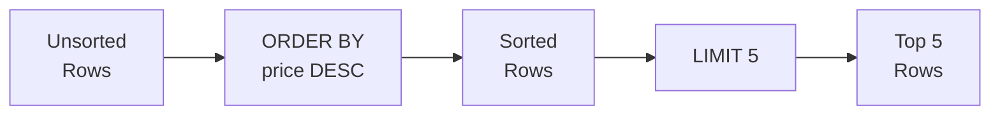
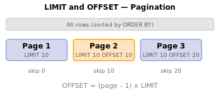
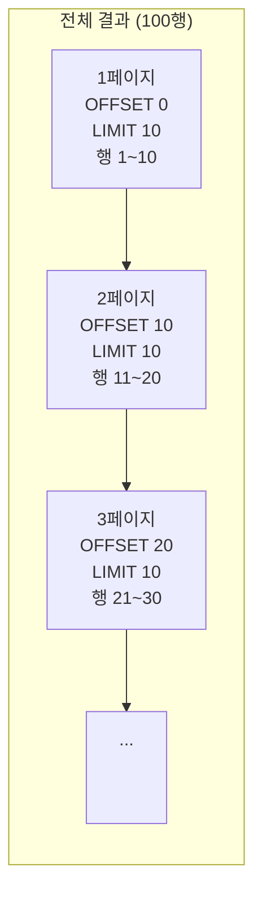

# 3강: 정렬과 페이징

2강에서 WHERE로 원하는 행만 필터링했습니다. 하지만 결과가 무작위 순서로 나왔죠? ORDER BY로 정렬하고, LIMIT로 상위 N건만 가져올 수 있습니다.

!!! note "이미 알고 계신다면"
    ORDER BY, LIMIT, OFFSET을 이미 알고 있다면 [4강: 집계 함수](04-aggregates.md)로 건너뛰세요.

SQL 결과의 행 순서는 별도로 지정하지 않으면 보장되지 않습니다. `ORDER BY`로 하나 이상의 칼럼을 기준으로 정렬할 수 있고, `LIMIT`과 `OFFSET`으로 대용량 결과를 페이지 단위로 나눠 조회할 수 있습니다.



> **개념:** ORDER BY로 정렬한 후 LIMIT로 상위 N개만 잘라냅니다.

## ORDER BY — 단일 칼럼

칼럼 이름 뒤에 `ASC`(오름차순, 기본값) 또는 `DESC`(내림차순)를 붙입니다.

```sql
-- 가격이 낮은 상품부터 정렬
SELECT name, price
FROM products
WHERE is_active = 1
ORDER BY price ASC;
```

**결과:**

| name | price |
| ---------- | ----------: |
| TP-Link TL-SG108 실버 | 16500.0 |
| TP-Link TG-3468 블랙 | 19800.0 |
| 삼성 무선 키보드 Trio 500 화이트 | 20300.0 |
| TP-Link TL-SG1016D 화이트 | 20300.0 |
| 로지텍 G502 HERO 실버 | 20300.0 |
| Razer Cobra 실버 | 20300.0 |
| TP-Link Archer TX55E 실버 | 20500.0 |
| 로지텍 G402 | 20500.0 |
| ... | ... |

```sql
-- 가격이 높은 상품부터 정렬
SELECT name, price
FROM products
WHERE is_active = 1
ORDER BY price DESC;
```

**결과:**

| name | price |
| ---------- | ----------: |
| Razer Blade 14 블랙 | 7495200.0 |
| Razer Blade 16 블랙 | 5634900.0 |
| Razer Blade 16 | 5518300.0 |
| Razer Blade 18 | 5450500.0 |
| Razer Blade 14 | 5339100.0 |
| Razer Blade 16 실버 | 5127500.0 |
| Razer Blade 18 화이트 | 4913500.0 |
| MSI GeForce RTX 5070 Ti VENTUS 3X 실버 | 4881500.0 |
| ... | ... |

## ORDER BY — 다중 칼럼

첫 번째 칼럼으로 먼저 정렬하고, 값이 같은 경우 두 번째 칼럼으로 정렬합니다.

```sql
-- 등급순 정렬, 같은 등급 안에서는 이름 가나다순
SELECT name, grade, point_balance
FROM customers
WHERE is_active = 1
ORDER BY grade ASC, name ASC;
```

**결과:**

| name | grade | point_balance |
| ---------- | ---------- | ----------: |
| 강건우 | BRONZE | 25290 |
| 강건우 | BRONZE | 89281 |
| 강건우 | BRONZE | 51511 |
| 강건우 | BRONZE | 1728 |
| 강경수 | BRONZE | 52847 |
| 강경수 | BRONZE | 402 |
| 강경수 | BRONZE | 81691 |
| 강경수 | BRONZE | 0 |
| ... | ... | ... |

```sql
-- 최신 주문부터 정렬, 같은 시각이면 주문 금액 내림차순
SELECT order_number, ordered_at, total_amount
FROM orders
ORDER BY ordered_at DESC, total_amount DESC;
```

**결과:**

| order_number | ordered_at | total_amount |
| ---------- | ---------- | ----------: |
| ORD-20251211-413965 | 2026-01-01 08:40:57 | 409600.0 |
| ORD-20251226-416837 | 2026-01-01 06:40:57 | 1169700.0 |
| ORD-20251231-417734 | 2025-12-31 23:28:51 | 2076300.0 |
| ORD-20251231-417696 | 2025-12-31 23:26:03 | 814400.0 |
| ORD-20251231-417737 | 2025-12-31 23:17:28 | 550600.0 |
| ORD-20251231-417735 | 2025-12-31 23:12:47 | 35000.0 |
| ORD-20251231-417677 | 2025-12-31 23:09:05 | 2002473.0 |
| ORD-20251231-417764 | 2025-12-31 23:00:56 | 42700.0 |
| ... | ... | ... |

## LIMIT

`LIMIT n`은 최대 `n`개의 행만 반환합니다. `ORDER BY`와 함께 사용하면 "상위 N개" 결과를 의미 있게 뽑을 수 있습니다.

```sql
-- 판매 중인 상품 중 가장 비싼 5개
SELECT name, price
FROM products
WHERE is_active = 1
ORDER BY price DESC
LIMIT 5;
```

**결과:**

| name | price |
| ---------- | ----------: |
| Razer Blade 14 블랙 | 7495200.0 |
| Razer Blade 16 블랙 | 5634900.0 |
| Razer Blade 16 | 5518300.0 |
| Razer Blade 18 | 5450500.0 |
| Razer Blade 14 | 5339100.0 |
| ... | ... |

## OFFSET — 페이징(Pagination)

{ .off-glb width="480"  }

`OFFSET n`은 앞의 `n`개 행을 건너뛰고 이후부터 반환합니다. `LIMIT`과 함께 사용하면 페이지 기반 탐색을 구현할 수 있습니다.

```sql
-- 1페이지: 1~10번째 행
SELECT name, price
FROM products
WHERE is_active = 1
ORDER BY name ASC
LIMIT 10 OFFSET 0;

-- 2페이지: 11~20번째 행
SELECT name, price
FROM products
WHERE is_active = 1
ORDER BY name ASC
LIMIT 10 OFFSET 10;

-- 3페이지: 21~30번째 행
SELECT name, price
FROM products
WHERE is_active = 1
ORDER BY name ASC
LIMIT 10 OFFSET 20;
```

**1페이지 결과:**

| name | price |
|------|------:|
| ASUS ProArt Studiobook 16 | 2099.00 |
| ASUS ROG Gaming Desktop | 1899.00 |
| ASUS ROG Swift 27" Monitor | 799.00 |
| ASUS TUF Gaming Laptop | 1099.00 |
| ... | |

> **공식:** `OFFSET = (페이지 번호 - 1) × 페이지 크기`



## NULL 값의 정렬 순서

SQLite에서는 `ASC` 정렬 시 NULL이 다른 값보다 앞에 오고, `DESC` 정렬 시 뒤에 옵니다.

```sql
-- birth_date 오름차순 정렬 시 NULL이 먼저 표시됨
SELECT name, birth_date
FROM customers
ORDER BY birth_date ASC
LIMIT 5;
```

**결과:**

| name | birth_date |
| ---------- | ---------- |
| 김명자 | (NULL) |
| 김정식 | (NULL) |
| 윤순옥 | (NULL) |
| 이서연 | (NULL) |
| 강민석 | (NULL) |
| ... | ... |

## 정리

| 키워드 | 설명 | 예시 |
|--------|------|------

<!-- BEGIN_LESSON_EXERCISES -->

!!! note "레슨 복습 문제"
    이 레슨에서 배운 개념을 바로 확인하는 간단한 문제입니다. 여러 개념을 종합하는 실전 연습은 [연습 문제](../exercises/index.md) 섹션을 참고하세요.

### 문제 1
가장 최근에 접수된 주문 10개를 찾으세요. `order_number`, `ordered_at`, `status`, `total_amount`를 반환하세요.

??? success "정답"
    ```sql
    SELECT order_number, ordered_at, status, total_amount
    FROM orders
    ORDER BY ordered_at DESC
    LIMIT 10;
    ```


    **실행 결과** (총 10행 중 상위 7행)

    | order_number | ordered_at | status | total_amount |
    |---|---|---|---|
    | ORD-20251231-37555 | 2025-12-31 22:25:39 | pending | 74,800.00 |
    | ORD-20251231-37543 | 2025-12-31 21:40:27 | pending | 134,100.00 |
    | ORD-20251231-37552 | 2025-12-31 20:00:48 | pending | 254,300.00 |
    | ORD-20251231-37548 | 2025-12-31 18:43:56 | pending | 187,700.00 |
    | ORD-20251231-37542 | 2025-12-31 18:00:24 | pending | 155,700.00 |
    | ORD-20251231-37546 | 2025-12-31 15:43:23 | pending | 198,300.00 |
    | ORD-20251231-37547 | 2025-12-31 15:33:05 | pending | 335,000.00 |

### 문제 2
모든 상품을 `stock_qty` 오름차순(재고 적은 순)으로 정렬하고, 재고가 같으면 `price` 내림차순으로 정렬하세요. `name`, `stock_qty`, `price`를 반환하되 20행으로 제한하세요.

??? success "정답"
    ```sql
    SELECT name, stock_qty, price
    FROM products
    ORDER BY stock_qty ASC, price DESC
    LIMIT 20;
    ```


    **실행 결과** (총 20행 중 상위 7행)

    | name | stock_qty | price |
    |---|---|---|
    | Arctic Freezer 36 A-RGB 화이트 | 0 | 23,000.00 |
    | 삼성 SPA-KFG0BUB | 4 | 30,700.00 |
    | 삼성 DDR4 32GB PC4-25600 | 6 | 91,000.00 |
    | 로지텍 G502 HERO 실버 | 8 | 71,100.00 |
    | Norton AntiVirus Plus | 8 | 69,700.00 |
    | FK 테스트 | 10 | 100.00 |
    | Intel Core Ultra 7 265K 화이트 | 15 | 170,200.00 |

### 문제 3
판매 중인 상품 카탈로그의 3페이지(페이지당 10개)를 상품명 가나다순으로 조회하세요.

??? success "정답"
    ```sql
    SELECT name, price, stock_qty
    FROM products
    WHERE is_active = 1
    ORDER BY name ASC
    LIMIT 10 OFFSET 20;
    ```


    **실행 결과** (총 10행 중 상위 7행)

    | name | price | stock_qty |
    |---|---|---|
    | ASUS PCE-BE92BT | 47,200.00 | 351 |
    | ASUS PCE-BE92BT 블랙 | 74,900.00 | 74 |
    | ASUS ROG MAXIMUS Z890 HERO 블랙 | 1,150,400.00 | 419 |
    | ASUS ROG STRIX RX 7900 XTX 실버 | 1,281,600.00 | 312 |
    | ASUS ROG Strix G16CH 실버 | 1,879,100.00 | 28 |
    | ASUS ROG Strix G16CH 화이트 | 3,671,500.00 | 201 |
    | ASUS ROG Strix GT35 | 3,296,800.00 | 455 |

### 문제 4
`customers` 테이블에서 포인트가 가장 많은 고객 5명의 `name`, `grade`, `point_balance`를 조회하세요.

??? success "정답"
    ```sql
    SELECT name, grade, point_balance
    FROM customers
    ORDER BY point_balance DESC
    LIMIT 5;
    ```


    **실행 결과** (5행)

    | name | grade | point_balance |
    |---|---|---|
    | 박정수 | VIP | 3,955,828 |
    | 김병철 | VIP | 3,518,880 |
    | 강명자 | VIP | 2,450,166 |
    | 정유진 | VIP | 2,383,491 |
    | 김성민 | VIP | 2,297,542 |

### 문제 5
`products` 테이블에서 `name`과 `price`를 가격 오름차순으로 정렬하세요. 가격이 같으면 상품명 알파벳 순으로 정렬하세요.

??? success "정답"
    ```sql
    SELECT name, price
    FROM products
    ORDER BY price ASC, name ASC;
    ```


    **실행 결과** (총 281행 중 상위 7행)

    | name | price |
    |---|---|
    | FK 테스트 | 100.00 |
    | TP-Link TG-3468 블랙 | 18,500.00 |
    | 삼성 SPA-KFG0BUB 실버 | 21,900.00 |
    | Arctic Freezer 36 A-RGB 화이트 | 23,000.00 |
    | Arctic Freezer 36 A-RGB 화이트 | 29,900.00 |
    | TP-Link Archer TBE400E 화이트 | 30,200.00 |
    | 삼성 SPA-KFG0BUB | 30,700.00 |

### 문제 6
`products` 테이블에서 `name`, `price`, `cost_price`를 조회하고, 마진(`price - cost_price`)이 큰 순서대로 정렬하세요. 상위 10개만 반환하세요.

??? success "정답"
    ```sql
    SELECT name, price, cost_price
    FROM products
    ORDER BY price - cost_price DESC
    LIMIT 10;
    ```


    **실행 결과** (총 10행 중 상위 7행)

    | name | price | cost_price |
    |---|---|---|
    | MacBook Air 15 M3 실버 | 5,481,100.00 | 3,205,400.00 |
    | ASUS TUF Gaming RTX 5080 화이트 | 4,526,600.00 | 3,037,100.00 |
    | Razer Blade 18 블랙 | 4,353,100.00 | 3,047,200.00 |
    | ASUS Dual RTX 5070 Ti [특별 한정판 에디션] 저소... | 4,496,700.00 | 3,296,400.00 |
    | ASUS ROG Strix G16CH 화이트 | 3,671,500.00 | 2,480,900.00 |
    | ASUS Dual RTX 4060 Ti 블랙 | 2,674,800.00 | 1,562,700.00 |
    | ASUS ROG Strix Scar 16 | 2,452,500.00 | 1,561,200.00 |

### 문제 7
`reviews` 테이블에서 `product_id`, `rating`, `created_at`을 조회하되, 최신 리뷰부터 정렬하여 6번째에서 10번째 리뷰(2페이지, 페이지당 5개)를 반환하세요.

??? success "정답"
    ```sql
    SELECT product_id, rating, created_at
    FROM reviews
    ORDER BY created_at DESC
    LIMIT 5 OFFSET 5;
    ```


    **실행 결과** (5행)

    | product_id | rating | created_at |
    |---|---|---|
    | 227 | 5 | 2026-01-11 21:02:15 |
    | 210 | 2 | 2026-01-11 15:23:03 |
    | 257 | 2 | 2026-01-10 09:56:48 |
    | 8 | 4 | 2026-01-09 20:41:38 |
    | 273 | 5 | 2026-01-07 20:55:20 |

### 문제 8
`staff` 테이블에서 `name`, `department`, `hired_at`을 조회하세요. 부서명 알파벳 순으로 정렬하되, 같은 부서 안에서는 입사일이 오래된 직원이 먼저 오도록 정렬하세요.

??? success "정답"
    ```sql
    SELECT name, department, hired_at
    FROM staff
    ORDER BY department ASC, hired_at ASC;
    ```


    **실행 결과** (5행)

    | name | department | hired_at |
    |---|---|---|
    | 한민재 | 경영 | 2016-05-23 |
    | 장주원 | 경영 | 2017-08-20 |
    | 박경수 | 경영 | 2022-10-12 |
    | 권영희 | 마케팅 | 2024-08-05 |
    | 이준혁 | 영업 | 2022-03-02 |

### 문제 9
`customers` 테이블에서 `name`과 `birth_date`를 조회하되, 생년월일이 NULL인 고객이 결과의 맨 뒤에 오도록 정렬하세요. NULL이 아닌 고객은 생년월일 오름차순으로 정렬하세요.
=== "SQLite"

??? success "정답"
    ```sql
    SELECT name, birth_date
    FROM customers
    ORDER BY birth_date IS NULL ASC, birth_date ASC;
    SELECT name, birth_date
    FROM customers
    ORDER BY birth_date IS NULL ASC, birth_date ASC;
    SELECT name, birth_date
    FROM customers
    ORDER BY birth_date ASC NULLS LAST;
    ```

### 문제 10
`orders` 테이블에서 `order_number`, `total_amount`, `ordered_at`을 조회하세요. 주문 금액이 높은 순으로 정렬하고, 금액이 같으면 최신 주문이 먼저 오도록 정렬하여 상위 15개만 반환하세요.

??? success "정답"
    ```sql
    SELECT order_number, total_amount, ordered_at
    FROM orders
    ORDER BY total_amount DESC, ordered_at DESC
    LIMIT 15;
    ```


    **실행 결과** (총 15행 중 상위 7행)

    | order_number | total_amount | ordered_at |
    |---|---|---|
    | ORD-20201121-08810 | 50,867,500.00 | 2020-11-21 12:04:42 |
    | ORD-20250305-32265 | 46,820,024.00 | 2025-03-05 09:01:08 |
    | ORD-20230523-22331 | 46,094,971.00 | 2023-05-23 08:50:55 |
    | ORD-20200209-05404 | 43,677,500.00 | 2020-02-09 23:36:36 |
    | ORD-20221231-20394 | 43,585,700.00 | 2022-12-31 21:35:59 |
    | ORD-20251218-37240 | 38,626,400.00 | 2025-12-18 17:09:12 |
    | ORD-20220106-15263 | 37,987,600.00 | 2022-01-06 17:24:14 |

<!-- END_LESSON_EXERCISES -->
