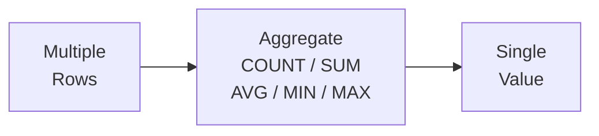

# 4강: 집계 함수

집계 함수(Aggregate Functions)는 여러 행을 하나의 요약 값으로 압축합니다. 보고서, 대시보드, 비즈니스 지표를 만들 때 핵심적으로 사용됩니다.



> **개념:** 집계 함수는 여러 행을 하나의 값으로 요약합니다.

## COUNT

`COUNT(*)`는 결과의 전체 행 수를 셉니다. `COUNT(칼럼명)`은 해당 칼럼에서 NULL이 아닌 값의 수를 셉니다.

```sql
-- 전체 고객 수
SELECT COUNT(*) AS total_customers
FROM customers;
```

**결과:**

| total_customers |
| --------------: |
|            5230 |

```sql
-- 생년월일 등록 여부에 따른 고객 수 비교
SELECT
    COUNT(*)           AS total_customers,
    COUNT(birth_date)  AS with_birth_date,
    COUNT(*) - COUNT(birth_date) AS missing_birth_date
FROM customers;
```

**결과:**

| total_customers | with_birth_date | missing_birth_date |
| --------------: | --------------: | -----------------: |
|            5230 |            4450 |                780 |

## SUM

`SUM`은 숫자 칼럼의 합계를 구합니다. NULL 값은 무시됩니다.

```sql
-- 완료된 주문의 총 매출
SELECT SUM(total_amount) AS total_revenue
FROM orders
WHERE status IN ('delivered', 'confirmed');
```

**결과:**

| total_revenue |
| ------------: |
|   32371516748 |

```sql
-- 활성 고객이 보유한 총 포인트
SELECT SUM(point_balance) AS total_points_outstanding
FROM customers
WHERE is_active = 1;
```

**결과:**

| total_points_outstanding |
| -----------------------: |
|                315697474 |

## AVG

`AVG`는 산술 평균을 반환하며, NULL 값은 제외하고 계산합니다.

```sql
-- 판매 중인 상품의 평균 가격과 평균 재고
SELECT
    AVG(price)     AS avg_price,
    AVG(stock_qty) AS avg_stock
FROM products
WHERE is_active = 1;
```

**결과:**

| avg_price | avg_stock |
| --------: | --------: |
| 665404.59 |    272.41 |

```sql
-- 취소/반품을 제외한 주문의 평균 금액
SELECT AVG(total_amount) AS avg_order_value
FROM orders
WHERE status NOT IN ('cancelled', 'returned');
```

**결과:**

| avg_order_value |
| --------------: |
|      1014478.57 |

## MIN과 MAX

`MIN`과 `MAX`는 칼럼에서 가장 작은 값과 가장 큰 값을 찾습니다.

```sql
-- 판매 중인 상품의 최저/최고 가격
SELECT
    MIN(price) AS cheapest,
    MAX(price) AS most_expensive
FROM products
WHERE is_active = 1;
```

**결과:**

| cheapest | most_expensive |
| -------: | -------------: |
|    13100 |        4314800 |

```sql
-- 첫 주문일과 최근 주문일
SELECT
    MIN(ordered_at) AS first_order,
    MAX(ordered_at) AS latest_order
FROM orders;
```

**결과:**

| first_order         | latest_order        |
| ------------------- | ------------------- |
| 2016-01-09 10:19:26 | 2025-06-30 23:02:18 |

## 여러 집계 함수 동시 사용

하나의 `SELECT`에 여러 집계 함수를 함께 쓸 수 있습니다.

```sql
-- TechShop 리뷰 통계 요약
SELECT
    COUNT(*)                    AS total_reviews,
    AVG(rating)                 AS avg_rating,
    MIN(rating)                 AS lowest_rating,
    MAX(rating)                 AS highest_rating,
    SUM(CASE WHEN rating = 5 THEN 1 ELSE 0 END) AS five_star_count
FROM reviews;
```

**결과:**

| total_reviews | avg_rating | lowest_rating | highest_rating | five_star_count |
| ------------: | ---------: | ------------: | -------------: | --------------: |
|          7945 |       3.91 |             1 |              5 |            3221 |

!!! note "레슨 복습 문제"
    이 레슨에서 배운 개념을 바로 확인하는 간단한 문제입니다. 여러 개념을 종합하는 실전 연습은 [연습 문제](../exercises/index.md) 섹션을 참고하세요.

## 연습 문제
### 문제 1
`reviews` 테이블에서 리뷰의 평균 평점을 소수점 2자리로 반올림하여 구하세요. 별칭은 `avg_rating`으로 지정하세요.

??? success "정답"
    ```sql
    SELECT ROUND(AVG(rating), 2) AS avg_rating
    FROM reviews;
    ```

    **결과 (예시):**

    | avg_rating |
    | ---------: |
    |       3.91 |


### 문제 2
`orders` 테이블에서 완료된 주문(`status`가 `'delivered'` 또는 `'confirmed'`)의 총 매출(`total_amount` 합계)을 구하세요. 별칭은 `total_revenue`로 지정하세요.

??? success "정답"
    ```sql
    SELECT SUM(total_amount) AS total_revenue
    FROM orders
    WHERE status IN ('delivered', 'confirmed');
    ```

    **결과 (예시):**

    | total_revenue |
    | ------------: |
    |   32371516748 |


### 문제 3
`customers` 테이블에서 전체 고객 수와 생년월일(`birth_date`)이 등록된 고객 수를 각각 구하세요. 별칭은 `total_customers`, `with_birth_date`로 지정하세요.

??? success "정답"
    ```sql
    SELECT
        COUNT(*)          AS total_customers,
        COUNT(birth_date) AS with_birth_date
    FROM customers;
    ```

    **결과 (예시):**

    | total_customers | with_birth_date |
    | --------------: | --------------: |
    |            5230 |            4450 |


### 문제 4
TechShop에서 현재 판매 중인 상품 수를 세고, 해당 상품들의 총 재고 가치(`price * stock_qty` 합계)를 구하세요.

??? success "정답"
    ```sql
    SELECT
        COUNT(*)                AS active_product_count,
        SUM(price * stock_qty)  AS total_inventory_value
    FROM products
    WHERE is_active = 1;
    ```

    **결과 (예시):**

    | active_product_count | total_inventory_value |
    | -------------------: | --------------------: |
    |                  218 |           39496278500 |


### 문제 5
취소 또는 반품되지 않은 주문의 `total_amount` 평균, 최솟값, 최댓값을 계산하세요. 별칭은 각각 `avg_order`, `min_order`, `max_order`로 지정하세요.

??? success "정답"
    ```sql
    SELECT
        AVG(total_amount) AS avg_order,
        MIN(total_amount) AS min_order,
        MAX(total_amount) AS max_order
    FROM orders
    WHERE status NOT IN ('cancelled', 'returned', 'return_requested');
    ```

    **결과 (예시):**

    | avg_order | min_order | max_order |
    | --------: | --------: | --------: |
    | 1007109.8 |     10910 |  58039800 |


### 문제 6
`products` 테이블에서 판매 중인 상품의 평균 가격(`avg_price`, 소수점 0자리), 평균 원가(`avg_cost`, 소수점 0자리), 평균 마진율(`avg_margin_pct`, 소수점 1자리)을 한 쿼리로 구하세요. 마진율 = `(price - cost_price) / price * 100`으로 계산하되, 각 상품의 마진율의 평균을 구하세요.

??? success "정답"
    ```sql
    SELECT
        ROUND(AVG(price), 0)                          AS avg_price,
        ROUND(AVG(cost_price), 0)                           AS avg_cost,
        ROUND(AVG((price - cost_price) / price * 100), 1)   AS avg_margin_pct
    FROM products
    WHERE is_active = 1;
    ```

    **결과 (예시):**

    | avg_price | avg_cost | avg_margin_pct |
    | --------: | -------: | -------------: |
    |    665405 |   504305 |           22.9 |


### 문제 7
`products` 테이블에서 판매 중인 상품(`is_active = 1`)의 최저 가격, 최고 가격, 가격 차이를 구하세요. 별칭은 각각 `min_price`, `max_price`, `price_range`로 지정하세요.

??? success "정답"
    ```sql
    SELECT
        MIN(price)             AS min_price,
        MAX(price)             AS max_price,
        MAX(price) - MIN(price) AS price_range
    FROM products
    WHERE is_active = 1;
    ```

    **결과 (예시):**

    | min_price | max_price | price_range |
    | --------: | --------: | ----------: |
    |     13100 |   4314800 |     4301700 |


### 문제 8
`order_items` 테이블의 전체 행 수, 총 수량 합계(`quantity`), 평균 단가(`unit_price`, 소수점 2자리), 최대 수량을 구하세요. 별칭은 `total_items`, `total_qty`, `avg_unit_price`, `max_qty`로 지정하세요.

??? success "정답"
    ```sql
    SELECT
        COUNT(*)                    AS total_items,
        SUM(quantity)               AS total_qty,
        ROUND(AVG(unit_price), 2)   AS avg_unit_price,
        MAX(quantity)               AS max_qty
    FROM order_items;
    ```

    **결과 (예시):**

    | total_items | total_qty | avg_unit_price | max_qty |
    | ----------: | --------: | -------------: | ------: |
    |       84270 |     93356 |      398818.65 |      10 |


### 문제 9
`payments` 테이블에서 완료된 결제(`status = 'completed'`)의 건수, 총 금액, 평균 금액(소수점 0자리), 최소/최대 금액을 모두 한 쿼리로 구하세요. 별칭은 `payment_count`, `total_amount`, `avg_amount`, `min_amount`, `max_amount`로 지정하세요.

??? success "정답"
    ```sql
    SELECT
        COUNT(*)              AS payment_count,
        SUM(amount)           AS total_amount,
        ROUND(AVG(amount), 0) AS avg_amount,
        MIN(amount)           AS min_amount,
        MAX(amount)           AS max_amount
    FROM payments
    WHERE status = 'completed';
    ```

    **결과 (예시):**

    | payment_count | total_amount | avg_amount | min_amount | max_amount |
    | ------------: | -----------: | ---------: | ---------: | ---------: |
    |         32171 |  32403716933 |    1007234 |      10910 |   58039800 |


### 문제 10
배송 메모(`notes`)가 있는 주문은 몇 건인지, 전체 주문 중 몇 퍼센트인지 구하세요. `orders_with_notes`, `total_orders`, `pct_with_notes`(소수점 1자리)를 반환하세요.

??? success "정답"
    ```sql
    SELECT
        COUNT(CASE WHEN notes IS NOT NULL THEN 1 END)  AS orders_with_notes,
        COUNT(*)                                        AS total_orders,
        ROUND(
            100.0 * COUNT(CASE WHEN notes IS NOT NULL THEN 1 END) / COUNT(*),
            1
        ) AS pct_with_notes
    FROM orders;
    ```

    **결과 (예시):**

    | orders_with_notes | total_orders | pct_with_notes |
    | ----------------: | -----------: | -------------: |
    |             12365 |        34908 |           35.4 |


---
다음: [5강: GROUP BY와 HAVING](05-group-by.md)
