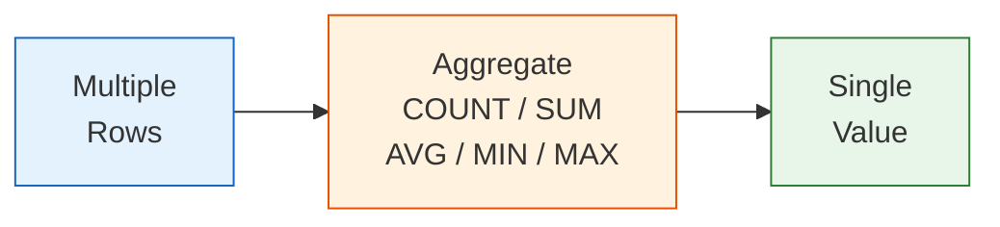

# 4강: 집계 함수

집계 함수(Aggregate Functions)는 여러 행을 하나의 요약 값으로 압축합니다. 보고서, 대시보드, 비즈니스 지표를 만들 때 핵심적으로 사용됩니다.



> **개념:** 집계 함수는 여러 행을 하나의 값으로 요약합니다.

## COUNT

`COUNT(*)`는 결과의 전체 행 수를 셉니다. `COUNT(컬럼명)`은 해당 컬럼에서 NULL이 아닌 값의 수를 셉니다.

```sql
-- 전체 고객 수
SELECT COUNT(*) AS total_customers
FROM customers;
```

**결과:**

| total_customers |
|-----------------|
| 5230 |

```sql
-- 생년월일 등록 여부에 따른 고객 수 비교
SELECT
    COUNT(*)           AS total_customers,
    COUNT(birth_date)  AS with_birth_date,
    COUNT(*) - COUNT(birth_date) AS missing_birth_date
FROM customers;
```

**결과:**

| total_customers | with_birth_date | missing_birth_date |
|-----------------|----------------|--------------------|
| 5230 | 4445 | 785 |

## SUM

`SUM`은 숫자 컬럼의 합계를 구합니다. NULL 값은 무시됩니다.

```sql
-- 완료된 주문의 총 매출
SELECT SUM(total_amount) AS total_revenue
FROM orders
WHERE status IN ('delivered', 'confirmed');
```

**결과:**

| total_revenue |
|---------------|
| 18473920.55 |

```sql
-- 활성 고객이 보유한 총 포인트
SELECT SUM(point_balance) AS total_points_outstanding
FROM customers
WHERE is_active = 1;
```

**결과:**

| total_points_outstanding |
|--------------------------|
| 2847340 |

## AVG

`AVG`는 산술 평균을 반환하며, NULL 값은 제외하고 계산합니다.

```sql
-- 판매 중인 상품의 평균 가격과 평균 재고
SELECT
    AVG(price)     AS avg_price,
    AVG(stock_qty) AS avg_stock
FROM products
WHERE is_active = 1;
```

**결과:**

| avg_price | avg_stock |
|-----------|-----------|
| 387.42 | 68.3 |

```sql
-- 취소/반품을 제외한 주문의 평균 금액
SELECT AVG(total_amount) AS avg_order_value
FROM orders
WHERE status NOT IN ('cancelled', 'returned');
```

**결과:**

| avg_order_value |
|-----------------|
| 532.17 |

## MIN과 MAX

`MIN`과 `MAX`는 컬럼에서 가장 작은 값과 가장 큰 값을 찾습니다.

```sql
-- 판매 중인 상품의 최저/최고 가격
SELECT
    MIN(price) AS cheapest,
    MAX(price) AS most_expensive
FROM products
WHERE is_active = 1;
```

**결과:**

| cheapest | most_expensive |
|----------|----------------|
| 9.99 | 2199.00 |

```sql
-- 첫 주문일과 최근 주문일
SELECT
    MIN(ordered_at) AS first_order,
    MAX(ordered_at) AS latest_order
FROM orders;
```

**결과:**

| first_order | latest_order |
|-------------|--------------|
| 2015-03-14 08:23:11 | 2024-12-31 23:58:01 |

## 여러 집계 함수 동시 사용

하나의 `SELECT`에 여러 집계 함수를 함께 쓸 수 있습니다.

```sql
-- TechShop 리뷰 통계 요약
SELECT
    COUNT(*)                    AS total_reviews,
    AVG(rating)                 AS avg_rating,
    MIN(rating)                 AS lowest_rating,
    MAX(rating)                 AS highest_rating,
    SUM(CASE WHEN rating = 5 THEN 1 ELSE 0 END) AS five_star_count
FROM reviews;
```

**결과:**

| total_reviews | avg_rating | lowest_rating | highest_rating | five_star_count |
|---------------|------------|---------------|----------------|-----------------|
| 7947 | 3.87 | 1 | 5 | 2341 |

!!! note "레슨 복습 문제"
    이 레슨에서 배운 개념을 바로 확인하는 간단한 문제입니다. 여러 개념을 종합하는 실전 연습은 [연습 문제](../exercises/) 섹션을 참고하세요.

## 연습 문제

### 문제 1
TechShop에서 현재 판매 중인 상품 수를 세고, 해당 상품들의 총 재고 가치(`price * stock_qty` 합계)를 구하세요.

??? success "정답"
    ```sql
    SELECT
        COUNT(*)                AS active_product_count,
        SUM(price * stock_qty)  AS total_inventory_value
    FROM products
    WHERE is_active = 1;
    ```

### 문제 2
취소 또는 반품되지 않은 주문의 `total_amount` 평균, 최솟값, 최댓값을 계산하세요. 별칭은 각각 `avg_order`, `min_order`, `max_order`로 지정하세요.

??? success "정답"
    ```sql
    SELECT
        AVG(total_amount) AS avg_order,
        MIN(total_amount) AS min_order,
        MAX(total_amount) AS max_order
    FROM orders
    WHERE status NOT IN ('cancelled', 'returned', 'return_requested');
    ```

### 문제 3
배송 메모(`notes`)가 있는 주문은 몇 건인지, 전체 주문 중 몇 퍼센트인지 구하세요. `orders_with_notes`, `total_orders`, `pct_with_notes`(소수점 1자리)를 반환하세요.

??? success "정답"
    ```sql
    SELECT
        COUNT(CASE WHEN notes IS NOT NULL THEN 1 END)  AS orders_with_notes,
        COUNT(*)                                        AS total_orders,
        ROUND(
            100.0 * COUNT(CASE WHEN notes IS NOT NULL THEN 1 END) / COUNT(*),
            1
        ) AS pct_with_notes
    FROM orders;
    ```

---
다음: [5강: GROUP BY와 HAVING](05-group-by.md)
