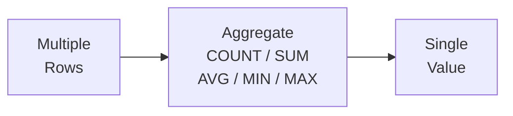

# 4강: 집계 함수

3강에서 ORDER BY와 LIMIT로 결과를 정렬하고 상위 N건을 가져왔습니다. 이번에는 '전체 고객이 몇 명인지', '평균 주문 금액은 얼마인지'처럼 여러 행을 하나의 숫자로 요약하는 집계 함수를 배웁니다.

!!! note "이미 알고 계신다면"
    COUNT, COUNT(DISTINCT), SUM, AVG, MIN, MAX를 이미 알고 있다면 [5강: GROUP BY](05-group-by.md)로 건너뛰세요.



> **개념:** 집계 함수는 여러 행을 하나의 값으로 요약합니다.

## COUNT

`COUNT(*)`는 결과의 전체 행 수를 셉니다. `COUNT(칼럼명)`은 해당 칼럼에서 NULL이 아닌 값의 수를 셉니다.

```sql
-- 전체 고객 수
SELECT COUNT(*) AS total_customers
FROM customers;
```

**결과:**

| total_customers |
| ----------: |
| 52300 |

```sql
-- 생년월일 등록 여부에 따른 고객 수 비교
SELECT
    COUNT(*)           AS total_customers,
    COUNT(birth_date)  AS with_birth_date,
    COUNT(*) - COUNT(birth_date) AS missing_birth_date
FROM customers;
```

**결과:**

| total_customers | with_birth_date | missing_birth_date |
| ----------: | ----------: | ----------: |
| 52300 | 44507 | 7793 |

### COUNT(DISTINCT) — 고유값 개수

`COUNT(DISTINCT 칼럼)`은 **중복을 제거한 후** 개수를 셉니다. "몇 종류가 있는지" 알고 싶을 때 사용합니다.

```sql
-- 주문한 적 있는 고유 고객 수
SELECT
    COUNT(*)                    AS total_orders,
    COUNT(DISTINCT customer_id) AS unique_customers
FROM orders;
```

**결과:**

| total_orders | unique_customers |
| ----------: | ----------: |
| 417803 | 29230 |

주문은 34,908건이지만, 실제로 주문한 고객은 4,985명입니다. 한 고객이 여러 번 주문했기 때문입니다.

```sql
-- 테크샵이 취급하는 브랜드 수
SELECT COUNT(DISTINCT brand) AS brand_count
FROM products;
```

---

## SUM

`SUM`은 숫자 칼럼의 합계를 구합니다. NULL 값은 무시됩니다.

```sql
-- 완료된 주문의 총 매출
SELECT SUM(total_amount) AS total_revenue
FROM orders
WHERE status IN ('delivered', 'confirmed');
```

**결과:**

| total_revenue |
| ----------: |
| 393749378848.0 |

```sql
-- 활성 고객이 보유한 총 포인트
SELECT SUM(point_balance) AS total_points_outstanding
FROM customers
WHERE is_active = 1;
```

**결과:**

| total_points_outstanding |
| ----------: |
| 3840575170 |

## AVG

`AVG`는 산술 평균을 반환하며, NULL 값은 제외하고 계산합니다.

```sql
-- 판매 중인 상품의 평균 가격과 평균 재고
SELECT
    AVG(price)     AS avg_price,
    AVG(stock_qty) AS avg_stock
FROM products
WHERE is_active = 1;
```

**결과:**

| avg_price | avg_stock |
| ----------: | ----------: |
| 678774.8505747126 | 250.53793103448277 |

```sql
-- 취소/반품을 제외한 주문의 평균 금액
SELECT AVG(total_amount) AS avg_order_value
FROM orders
WHERE status NOT IN ('cancelled', 'returned');
```

**결과:**

| avg_order_value |
| ----------: |
| 1034451.993859959 |

## ROUND — 반올림

`AVG`의 결과는 소수점이 길게 나올 수 있습니다. `ROUND(값, 자릿수)`로 원하는 소수점 자리까지 반올림할 수 있습니다.

```sql
-- 리뷰 평균 평점을 소수 첫째 자리까지
SELECT
    AVG(rating)          AS avg_raw,
    ROUND(AVG(rating), 1) AS avg_rounded
FROM reviews;
```

**결과:**

| avg_raw | avg_rounded |
| ----------: | ----------: |
| 3.903090491521336 | 3.9 |

```sql
-- 상품 평균 가격을 원 단위로 (소수점 없이)
SELECT ROUND(AVG(price), 0) AS avg_price
FROM products;
```

| avg_price |
| --------: |
| 665405 |

### 정수 나눗셈 주의

SQLite에서 **정수 ÷ 정수 = 정수**입니다. 소수점이 잘립니다:

```sql
-- 문제: 리뷰 작성률을 구하려는데...
SELECT
    COUNT(*)                    AS total_orders,
    (SELECT COUNT(*) FROM reviews) AS total_reviews,
    (SELECT COUNT(*) FROM reviews) / COUNT(*) AS review_rate
FROM orders;
```

| total_orders | total_reviews | review_rate |
| -----------: | ------------: | ----------: |
| 34908 | 7945 | **0** |

7945 ÷ 34908 = 0.2275...이지만, 정수 나눗셈이라 **0**이 됩니다. 해결법:

```sql
-- 해결: 한쪽을 실수(1.0)로 곱하기
SELECT ROUND((SELECT COUNT(*) FROM reviews) * 1.0 / COUNT(*) * 100, 1) AS review_rate_pct
FROM orders;
```

| review_rate_pct |
| --------------: |
| 22.8 |

!!! tip "MySQL/PostgreSQL에서는?"
    MySQL과 PostgreSQL은 정수 나눗셈에서도 소수점이 유지되므로 이 문제가 발생하지 않습니다. SQLite 특유의 주의점입니다.

---

## MIN과 MAX

`MIN`과 `MAX`는 칼럼에서 가장 작은 값과 가장 큰 값을 찾습니다.

```sql
-- 판매 중인 상품의 최저/최고 가격
SELECT
    MIN(price) AS cheapest,
    MAX(price) AS most_expensive
FROM products
WHERE is_active = 1;
```

**결과:**

| cheapest | most_expensive |
| ----------: | ----------: |
| 16500.0 | 7495200.0 |

```sql
-- 첫 주문일과 최근 주문일
SELECT
    MIN(ordered_at) AS first_order,
    MAX(ordered_at) AS latest_order
FROM orders;
```

**결과:**

| first_order | latest_order |
| ---------- | ---------- |
| 2016-01-02 13:54:14 | 2026-01-01 08:40:57 |

## 여러 집계 함수 동시 사용

하나의 `SELECT`에 여러 집계 함수를 함께 쓸 수 있습니다.

```sql
-- TechShop 리뷰 통계 요약
SELECT
    COUNT(*)                    AS total_reviews,
    AVG(rating)                 AS avg_rating,
    MIN(rating)                 AS lowest_rating,
    MAX(rating)                 AS highest_rating,
    SUM(CASE WHEN rating = 5 THEN 1 ELSE 0 END) AS five_star_count
FROM reviews;
```

**결과:**

| total_reviews | avg_rating | lowest_rating | highest_rating | five_star_count |
| ----------: | ----------: | ----------: | ----------: | ----------: |
| 95357 | 3.903090491521336 | 1 | 5 | 38460 |

## 집계 함수와 NULL

집계 함수는 NULL을 **무시**합니다. 이것은 중요한 동작입니다:

```sql
-- birth_date가 NULL인 고객이 약 15%
SELECT
    COUNT(*)           AS total,
    COUNT(birth_date)  AS with_birth,
    AVG(CASE
        WHEN birth_date IS NOT NULL
        THEN 2025 - CAST(SUBSTR(birth_date, 1, 4) AS INTEGER)
    END) AS avg_age
FROM customers;
```

| total | with_birth | avg_age |
| ----: | ---------: | ------: |
| 5230 | 4450 | 39.2 |

- `COUNT(*)` = 5,230 (NULL 포함 전체)
- `COUNT(birth_date)` = 4,450 (NULL 제외)
- `AVG` = 4,450명의 평균만 계산 (NULL인 780명은 제외)

!!! warning "NULL이 결과를 왜곡할 수 있습니다"
    `AVG(birth_date 기반 나이)`는 생년월일을 입력한 사람만의 평균입니다. 전체 고객의 평균 나이와는 다를 수 있습니다. NULL이 많은 칼럼을 집계할 때는 항상 `COUNT(*)`와 `COUNT(칼럼)`을 비교하여 NULL 비율을 확인하세요.

---

## 정리

| 함수 | 설명 | 예시 |
|------|------|------|
| `COUNT(*)` | 전체 행 수 (NULL 포함) | `SELECT COUNT(*) FROM orders` |
| `COUNT(칼럼)` | NULL 제외 행 수 | `COUNT(birth_date)` |
| `COUNT(DISTINCT 칼럼)` | 고유값 개수 | `COUNT(DISTINCT customer_id)` |
| `SUM(칼럼)` | 합계 (NULL 무시) | `SUM(total_amount)` |
| `AVG(칼럼)` | 평균 (NULL 무시) | `AVG(price)` |
| `ROUND(값, N)` | 소수점 N자리 반올림 | `ROUND(AVG(price), 0)` |
| `MIN(칼럼)` | 최솟값 | `MIN(price)` |
| `MAX(칼럼)` | 최댓값 | `MAX(price)` |
| 정수 나눗셈 | SQLite: 정수÷정수=정수 | `* 1.0`으로 실수 변환 |
| NULL 처리 | 집계 함수는 NULL을 무시 | `COUNT(*)`와 `COUNT(칼럼)` 비교 |

!!! note "레슨 복습 문제"
    이 레슨에서 배운 개념을 바로 확인하는 간단한 문제입니다. 여러 개념을 종합하는 실전 연습은 [연습 문제](../exercises/index.md) 섹션을 참고하세요.

## 연습 문제
### 문제 1
`reviews` 테이블에서 리뷰의 평균 평점을 소수점 2자리로 반올림하여 구하세요. 별칭은 `avg_rating`으로 지정하세요.

??? success "정답"
    ```sql
    SELECT ROUND(AVG(rating), 2) AS avg_rating
    FROM reviews;
    ```

    **결과 (예시):**

| avg_rating |
| ----------: |
| 3.9 |


### 문제 2
`orders` 테이블에서 완료된 주문(`status`가 `'delivered'` 또는 `'confirmed'`)의 총 매출(`total_amount` 합계)을 구하세요. 별칭은 `total_revenue`로 지정하세요.

??? success "정답"
    ```sql
    SELECT SUM(total_amount) AS total_revenue
    FROM orders
    WHERE status IN ('delivered', 'confirmed');
    ```

    **결과 (예시):**

| total_revenue |
| ----------: |
| 393749378848.0 |


### 문제 3
`customers` 테이블에서 전체 고객 수와 생년월일(`birth_date`)이 등록된 고객 수를 각각 구하세요. 별칭은 `total_customers`, `with_birth_date`로 지정하세요.

??? success "정답"
    ```sql
    SELECT
        COUNT(*)          AS total_customers,
        COUNT(birth_date) AS with_birth_date
    FROM customers;
    ```

    **결과 (예시):**

| total_customers | with_birth_date |
| ----------: | ----------: |
| 52300 | 44507 |


### 문제 4
TechShop에서 현재 판매 중인 상품 수를 세고, 해당 상품들의 총 재고 가치(`price * stock_qty` 합계)를 구하세요.

??? success "정답"
    ```sql
    SELECT
        COUNT(*)                AS active_product_count,
        SUM(price * stock_qty)  AS total_inventory_value
    FROM products
    WHERE is_active = 1;
    ```

    **결과 (예시):**

| active_product_count | total_inventory_value |
| ----------: | ----------: |
| 2175 | 375495851400.0 |


### 문제 5
취소 또는 반품되지 않은 주문의 `total_amount` 평균, 최솟값, 최댓값을 계산하세요. 별칭은 각각 `avg_order`, `min_order`, `max_order`로 지정하세요.

??? success "정답"
    ```sql
    SELECT
        AVG(total_amount) AS avg_order,
        MIN(total_amount) AS min_order,
        MAX(total_amount) AS max_order
    FROM orders
    WHERE status NOT IN ('cancelled', 'returned', 'return_requested');
    ```

    **결과 (예시):**

| avg_order | min_order | max_order |
| ----------: | ----------: | ----------: |
| 1027943.4813606213 | 13262.0 | 71906300.0 |


### 문제 6
`products` 테이블에서 판매 중인 상품의 평균 가격(`avg_price`, 소수점 0자리), 평균 원가(`avg_cost`, 소수점 0자리), 평균 마진율(`avg_margin_pct`, 소수점 1자리)을 한 쿼리로 구하세요. 마진율 = `(price - cost_price) / price * 100`으로 계산하되, 각 상품의 마진율의 평균을 구하세요.

??? success "정답"
    ```sql
    SELECT
        ROUND(AVG(price), 0)                          AS avg_price,
        ROUND(AVG(cost_price), 0)                           AS avg_cost,
        ROUND(AVG((price - cost_price) / price * 100), 1)   AS avg_margin_pct
    FROM products
    WHERE is_active = 1;
    ```

    **결과 (예시):**

| avg_price | avg_cost | avg_margin_pct |
| ----------: | ----------: | ----------: |
| 678775.0 | 519733.0 | 23.3 |


### 문제 7
`products` 테이블에서 판매 중인 상품(`is_active = 1`)의 최저 가격, 최고 가격, 가격 차이를 구하세요. 별칭은 각각 `min_price`, `max_price`, `price_range`로 지정하세요.

??? success "정답"
    ```sql
    SELECT
        MIN(price)             AS min_price,
        MAX(price)             AS max_price,
        MAX(price) - MIN(price) AS price_range
    FROM products
    WHERE is_active = 1;
    ```

    **결과 (예시):**

| min_price | max_price | price_range |
| ----------: | ----------: | ----------: |
| 16500.0 | 7495200.0 | 7478700.0 |


### 문제 8
`order_items` 테이블의 전체 행 수, 총 수량 합계(`quantity`), 평균 단가(`unit_price`, 소수점 2자리), 최대 수량을 구하세요. 별칭은 `total_items`, `total_qty`, `avg_unit_price`, `max_qty`로 지정하세요.

??? success "정답"
    ```sql
    SELECT
        COUNT(*)                    AS total_items,
        SUM(quantity)               AS total_qty,
        ROUND(AVG(unit_price), 2)   AS avg_unit_price,
        MAX(quantity)               AS max_qty
    FROM order_items;
    ```

    **결과 (예시):**

| total_items | total_qty | avg_unit_price | max_qty |
| ----------: | ----------: | ----------: | ----------: |
| 1015189 | 1117997 | 406547.0 | 10 |


### 문제 9
`payments` 테이블에서 완료된 결제(`status = 'completed'`)의 건수, 총 금액, 평균 금액(소수점 0자리), 최소/최대 금액을 모두 한 쿼리로 구하세요. 별칭은 `payment_count`, `total_amount`, `avg_amount`, `min_amount`, `max_amount`로 지정하세요.

??? success "정답"
    ```sql
    SELECT
        COUNT(*)              AS payment_count,
        SUM(amount)           AS total_amount,
        ROUND(AVG(amount), 0) AS avg_amount,
        MIN(amount)           AS min_amount,
        MAX(amount)           AS max_amount
    FROM payments
    WHERE status = 'completed';
    ```

    **결과 (예시):**

| payment_count | total_amount | avg_amount | min_amount | max_amount |
| ----------: | ----------: | ----------: | ----------: | ----------: |
| 383883 | 394593947687.0 | 1027902.0 | 13262.0 | 71906300.0 |


### 문제 10
배송 메모(`notes`)가 있는 주문은 몇 건인지, 전체 주문 중 몇 퍼센트인지 구하세요. `orders_with_notes`, `total_orders`, `pct_with_notes`(소수점 1자리)를 반환하세요.

??? success "정답"
    ```sql
    SELECT
        COUNT(CASE WHEN notes IS NOT NULL THEN 1 END)  AS orders_with_notes,
        COUNT(*)                                        AS total_orders,
        ROUND(
            100.0 * COUNT(CASE WHEN notes IS NOT NULL THEN 1 END) / COUNT(*),
            1
        ) AS pct_with_notes
    FROM orders;
    ```

    **결과 (예시):**

| orders_with_notes | total_orders | pct_with_notes |
| ----------: | ----------: | ----------: |
| 146327 | 417803 | 35.0 |


### 채점 가이드

| 점수 | 다음 단계 |
|:----:|----------|
| **9~10개** | [5강: GROUP BY](05-group-by.md)로 이동 |
| **7~8개** | 틀린 문제 해설을 복습한 뒤 5강으로 |
| **5개 이하** | 이 강의를 다시 읽어보세요 |
| **3개 이하** | [3강: 정렬과 페이징](03-sort-limit.md)부터 다시 시작하세요 |

**문제별 영역:**

| 영역 | 해당 문제 |
|------|:--------:|
| AVG / ROUND | 1, 6 |
| SUM | 2, 4 |
| COUNT / COUNT(col) | 3 |
| MIN / MAX | 5, 7 |
| 복합 집계 (COUNT, SUM, AVG, MAX) | 8, 9 |
| CASE + COUNT (NULL 비율) | 10 |

---
다음: [5강: GROUP BY와 HAVING](05-group-by.md)
