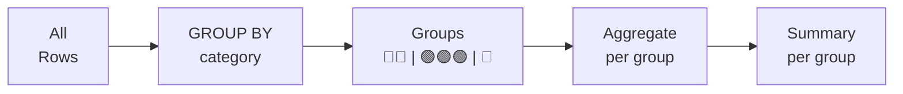
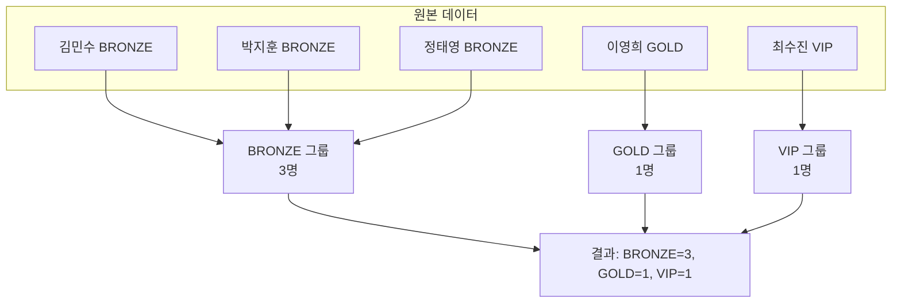

# 5강: GROUP BY와 HAVING

4강에서 COUNT, SUM, AVG 등으로 전체 데이터를 요약했습니다. 하지만 '등급별 고객 수'나 '월별 매출'처럼 그룹 단위로 집계하고 싶다면? GROUP BY를 사용합니다.

!!! note "이미 알고 계신다면"
    GROUP BY, 다중 칼럼 그룹화, HAVING을 이미 알고 있다면 [6강: NULL 처리](06-null.md)로 건너뛰세요.



> **개념:** GROUP BY는 행을 그룹으로 묶고, 각 그룹에 집계 함수를 적용합니다.



## GROUP BY — 단일 칼럼

```sql
-- 멤버십 등급별 고객 수
SELECT
    grade,
    COUNT(*) AS customer_count
FROM customers
GROUP BY grade;
```

**결과:**

| grade | customer_count |
| ---------- | ----------: |
| BRONZE | 38150 |
| GOLD | 5159 |
| SILVER | 5105 |
| VIP | 3886 |

데이터베이스는 `grade` 값이 같은 행들을 하나의 버킷에 모은 뒤, 버킷별로 행 수를 셉니다.

```sql
-- 주문 상태별 건수와 매출 합계
SELECT
    status,
    COUNT(*)           AS order_count,
    SUM(total_amount)  AS total_revenue
FROM orders
GROUP BY status
ORDER BY total_revenue DESC;
```

**결과:**

| status | order_count | total_revenue |
| ---------- | ----------: | ----------: |
| confirmed | 382081 | 392629443801.0 |
| cancelled | 21018 | 22079238470.0 |
| return_requested | 6125 | 8839120776.0 |
| returned | 6071 | 8750957343.0 |
| delivered | 1029 | 1119935047.0 |
| pending | 706 | 741807866.0 |
| shipped | 453 | 518561734.0 |
| preparing | 153 | 170900996.0 |
| ... | ... | ... |

## GROUP BY — 다중 칼럼

두 개 이상의 칼럼으로 그룹화하면 더 세밀하게 세분화할 수 있습니다.

```sql
-- 등급과 성별로 고객 수 집계
SELECT
    grade,
    gender,
    COUNT(*) AS cnt
FROM customers
WHERE gender IS NOT NULL
GROUP BY grade, gender
ORDER BY grade, gender;
```

**결과:**

| grade | gender | cnt |
| ---------- | ---------- | ----------: |
| BRONZE | F | 12614 |
| BRONZE | M | 21359 |
| GOLD | F | 1433 |
| GOLD | M | 3316 |
| SILVER | F | 1491 |
| SILVER | M | 3171 |
| VIP | F | 940 |
| VIP | M | 2744 |
| ... | ... | ... |

## 월별 주문 집계

날짜 칼럼에서 연-월을 추출하면 월별로 그룹화할 수 있습니다.

=== "SQLite"
    ```sql
    -- 2024년 월별 주문 건수와 매출
    SELECT
        SUBSTR(ordered_at, 1, 7) AS year_month,
        COUNT(*)                 AS order_count,
        SUM(total_amount)        AS monthly_revenue
    FROM orders
    WHERE ordered_at LIKE '2024%'
    GROUP BY SUBSTR(ordered_at, 1, 7)
    ORDER BY year_month;
    ```

=== "MySQL"
    ```sql
    -- 2024년 월별 주문 건수와 매출
    SELECT
        DATE_FORMAT(ordered_at, '%Y-%m') AS year_month,
        COUNT(*)                         AS order_count,
        SUM(total_amount)                AS monthly_revenue
    FROM orders
    WHERE ordered_at >= '2024-01-01'
      AND ordered_at <  '2025-01-01'
    GROUP BY DATE_FORMAT(ordered_at, '%Y-%m')
    ORDER BY year_month;
    ```

=== "PostgreSQL"
    ```sql
    -- 2024년 월별 주문 건수와 매출
    SELECT
        TO_CHAR(ordered_at, 'YYYY-MM') AS year_month,
        COUNT(*)                       AS order_count,
        SUM(total_amount)              AS monthly_revenue
    FROM orders
    WHERE ordered_at >= '2024-01-01'
      AND ordered_at <  '2025-01-01'
    GROUP BY TO_CHAR(ordered_at, 'YYYY-MM')
    ORDER BY year_month;
    ```

**결과:**

| year_month | order_count | monthly_revenue |
|------------|------------:|----------------:|
| 2024-01 | 312 | 178432.50 |
| 2024-02 | 289 | 162890.20 |
| 2024-03 | 405 | 238741.90 |
| ... | | |

## HAVING


> WHERE는 그룹화 전, HAVING은 그룹화 후에 동작합니다.

`HAVING`은 그룹화 이후에 필터링하며, 집계 값을 조건으로 사용합니다. 그룹에 대한 `WHERE`라고 생각하면 됩니다.

```sql
-- 고객 수가 500명 초과인 등급만 조회
SELECT
    grade,
    COUNT(*) AS customer_count
FROM customers
GROUP BY grade
HAVING COUNT(*) > 500;
```

**결과:**

| grade | customer_count |
| ---------- | ----------: |
| BRONZE | 38150 |
| GOLD | 5159 |
| SILVER | 5105 |
| VIP | 3886 |

```sql
-- 판매 중인 상품이 10개 이상이고 평균 가격이 $100 초과인 카테고리
SELECT
    category_id,
    COUNT(*)   AS product_count,
    AVG(price) AS avg_price
FROM products
WHERE is_active = 1
GROUP BY category_id
HAVING COUNT(*) >= 10
   AND AVG(price) > 100
ORDER BY avg_price DESC;
```

**결과:**

| category_id | product_count | avg_price |
| ----------: | ----------: | ----------: |
| 9 | 21 | 3292633.3333333335 |
| 7 | 99 | 2966560.606060606 |
| 28 | 46 | 2429036.9565217393 |
| 3 | 46 | 2210358.695652174 |
| 6 | 83 | 1739673.4939759036 |
| 8 | 45 | 1565324.4444444445 |
| 2 | 74 | 1504925.6756756757 |
| 13 | 49 | 1328097.9591836734 |
| ... | ... | ... |

## WHERE vs. HAVING

| 절 | 필터 대상 | 적용 시점 |
|----|-----------|-----------|
| `WHERE` | 개별 행 | 그룹화 전 |
| `HAVING` | 그룹 | 그룹화 후 |

```sql
-- WHERE로 행 필터 후, HAVING으로 그룹 필터
SELECT
    grade,
    AVG(point_balance) AS avg_points
FROM customers
WHERE is_active = 1          -- 비활성 고객 제외 (행 수준)
GROUP BY grade
HAVING AVG(point_balance) > 500;  -- 평균 포인트가 500 초과인 등급만
```

## 정리

| 문법 | 설명 | 예시 |
|------|------|------

<!-- BEGIN_LESSON_EXERCISES -->

!!! note "레슨 복습 문제"
    이 레슨에서 배운 개념을 바로 확인하는 간단한 문제입니다. 여러 개념을 종합하는 실전 연습은 [연습 문제](../exercises/index.md) 섹션을 참고하세요.

### 문제 1
`status`별 주문 건수를 집계하세요. 건수가 1,000 초과인 상태만 표시하고, 건수 내림차순으로 정렬하세요.

??? success "정답"
    ```sql
    SELECT
    status,
    COUNT(*) AS order_count
    FROM orders
    GROUP BY status
    HAVING COUNT(*) > 1000
    ORDER BY order_count DESC;
    ```


    **실행 결과** (2행)

    | status | order_count |
    |---|---|
    | confirmed | 34,393 |
    | cancelled | 1859 |

### 문제 2
`payments` 테이블에서 결제 수단(`method`)별로 수집된 총 금액과 거래 건수를 구하세요. 총 금액 내림차순으로 정렬하세요.

??? success "정답"
    ```sql
    SELECT
    method,
    COUNT(*)       AS transaction_count,
    SUM(amount)    AS total_collected
    FROM payments
    WHERE status = 'completed'
    GROUP BY method
    ORDER BY total_collected DESC;
    ```


    **실행 결과** (6행)

    | method | transaction_count | total_collected |
    |---|---|---|
    | card | 15,556 | 15,537,036,997.00 |
    | kakao_pay | 6886 | 6,781,114,303.00 |
    | naver_pay | 5270 | 5,420,480,093.00 |
    | bank_transfer | 3429 | 3,456,454,657.00 |
    | point | 1770 | 1,780,334,619.00 |
    | virtual_account | 1705 | 1,706,777,095.00 |

### 문제 3
`customers` 테이블에서 `grade`별로 평균 포인트(`point_balance`)를 구하세요. 평균 포인트 내림차순으로 정렬하세요.

??? success "정답"
    ```sql
    SELECT
    grade,
    AVG(point_balance) AS avg_points
    FROM customers
    GROUP BY grade
    ORDER BY avg_points DESC;
    ```


    **실행 결과** (4행)

    | grade | avg_points |
    |---|---|
    | VIP | 407,014.69 |
    | GOLD | 147,710.69 |
    | SILVER | 95,042.33 |
    | BRONZE | 16,779.46 |

### 문제 4
`customers` 테이블에서 `grade`와 `gender` 두 칼럼으로 그룹화하여 고객 수를 구하세요. `gender`가 NULL인 행도 포함하세요.

??? success "정답"
    ```sql
    SELECT
    grade,
    gender,
    COUNT(*) AS customer_count
    FROM customers
    GROUP BY grade, gender
    ORDER BY grade, gender;
    ```


    **실행 결과** (총 12행 중 상위 7행)

    | grade | gender | customer_count |
    |---|---|---|
    | BRONZE | NULL | 429 |
    | BRONZE | F | 1302 |
    | BRONZE | M | 2128 |
    | GOLD | NULL | 41 |
    | GOLD | F | 140 |
    | GOLD | M | 343 |
    | SILVER | NULL | 45 |

### 문제 5
`reviews` 테이블에서 `rating`별 리뷰 건수를 구하세요. 리뷰가 100건 이상인 평점만 표시하고, `rating` 순으로 정렬하세요.

??? success "정답"
    ```sql
    SELECT
    rating,
    COUNT(*) AS review_count
    FROM reviews
    GROUP BY rating
    HAVING COUNT(*) >= 100
    ORDER BY rating;
    ```


    **실행 결과** (5행)

    | rating | review_count |
    |---|---|
    | 1 | 434 |
    | 2 | 839 |
    | 3 | 1265 |
    | 4 | 2575 |
    | 5 | 3433 |

### 문제 6
`orders` 테이블에서 활성 주문(`status NOT IN ('cancelled', 'returned')`)만을 대상으로, `status`별 건수와 평균 금액(소수점 0자리)을 구하세요. 평균 금액이 300 초과인 상태만 표시하세요.

??? success "정답"
    ```sql
    SELECT
    status,
    COUNT(*)                    AS order_count,
    ROUND(AVG(total_amount), 0) AS avg_amount
    FROM orders
    WHERE status NOT IN ('cancelled', 'returned')
    GROUP BY status
    HAVING AVG(total_amount) > 300
    ORDER BY avg_amount DESC;
    ```


    **실행 결과** (7행)

    | status | order_count | avg_amount |
    |---|---|---|
    | return_requested | 507 | 1,600,567.00 |
    | delivered | 125 | 1,566,146.00 |
    | shipped | 51 | 1,452,364.00 |
    | pending | 82 | 1,063,783.00 |
    | confirmed | 34,393 | 999,814.00 |
    | paid | 23 | 587,912.00 |
    | preparing | 24 | 510,285.00 |

### 문제 7
2023년과 2024년의 `orders` 데이터에서 월 매출이 50만 달러를 초과한 달을 찾으세요. `year_month`와 `monthly_revenue`를 날짜순으로 반환하세요.

??? success "정답"
    ```sql
    SELECT
    SUBSTR(ordered_at, 1, 7) AS year_month,
    SUM(total_amount)        AS monthly_revenue
    FROM orders
    WHERE ordered_at BETWEEN '2023-01-01' AND '2024-12-31 23:59:59'
    AND status NOT IN ('cancelled', 'returned')
    GROUP BY SUBSTR(ordered_at, 1, 7)
    HAVING SUM(total_amount) > 500000
    ORDER BY year_month;
    ```


    **실행 결과** (총 24행 중 상위 7행)

    | year_month | monthly_revenue |
    |---|---|
    | 2023-01 | 274,226,287.00 |
    | 2023-02 | 333,966,148.00 |
    | 2023-03 | 491,087,654.00 |
    | 2023-04 | 403,110,649.00 |
    | 2023-05 | 361,101,076.00 |
    | 2023-06 | 288,736,533.00 |
    | 2023-07 | 319,249,348.00 |

### 문제 8
`payments` 테이블에서 결제 수단(`method`)별 고유 주문 수를 `COUNT(DISTINCT order_id)`로 구하세요. 고유 주문 수 내림차순으로 정렬하세요.

??? success "정답"
    ```sql
    SELECT
    method,
    COUNT(DISTINCT order_id) AS unique_orders
    FROM payments
    GROUP BY method
    ORDER BY unique_orders DESC;
    ```


    **실행 결과** (6행)

    | method | unique_orders |
    |---|---|
    | card | 16,841 |
    | kakao_pay | 7486 |
    | naver_pay | 5715 |
    | bank_transfer | 3718 |
    | point | 1921 |
    | virtual_account | 1876 |

### 문제 9
`orders` 테이블에서 연도별 주문 건수와 총 매출을 구하세요. 취소/반품 주문은 제외하세요.

??? success "정답"
    ```sql
    SELECT
    SUBSTR(ordered_at, 1, 4) AS order_year,
    COUNT(*)                 AS order_count,
    SUM(total_amount)        AS yearly_revenue
    FROM orders
    WHERE status NOT IN ('cancelled', 'returned')
    GROUP BY SUBSTR(ordered_at, 1, 4)
    ORDER BY order_year;
    ```


    **실행 결과** (총 10행 중 상위 7행)

    | order_year | order_count | yearly_revenue |
    |---|---|---|
    | 2016 | 388 | 288,397,247.00 |
    | 2017 | 657 | 619,679,681.00 |
    | 2018 | 1238 | 1,179,049,206.00 |
    | 2019 | 2422 | 2,438,425,607.00 |
    | 2020 | 4078 | 4,182,596,871.00 |
    | 2021 | 5501 | 5,672,563,917.00 |
    | 2022 | 4882 | 4,922,471,211.00 |

### 문제 10
`products` 테이블에서 `category_id`별로 상품 수, 평균 가격(소수점 0자리), 총 재고(`stock_qty` 합계)를 구하세요. 상품 수가 5개 이상이고 평균 가격이 50 이상인 카테고리만 표시하고, 상품 수 내림차순으로 정렬하세요.

??? success "정답"
    ```sql
    SELECT
    category_id,
    COUNT(*)                 AS product_count,
    ROUND(AVG(price), 0)     AS avg_price,
    SUM(stock_qty)           AS total_stock
    FROM products
    GROUP BY category_id
    HAVING COUNT(*) >= 5
    AND AVG(price) >= 50
    ORDER BY product_count DESC;
    ```


    **실행 결과** (총 31행 중 상위 7행)

    | category_id | product_count | avg_price | total_stock |
    |---|---|---|---|
    | 18 | 13 | 529,754.00 | 3826 |
    | 30 | 13 | 219,008.00 | 3812 |
    | 43 | 12 | 277,150.00 | 3085 |
    | 3 | 11 | 1,719,809.00 | 2241 |
    | 31 | 11 | 158,482.00 | 2681 |
    | 36 | 11 | 158,000.00 | 3094 |
    | 37 | 11 | 41,064.00 | 3141 |

<!-- END_LESSON_EXERCISES -->
