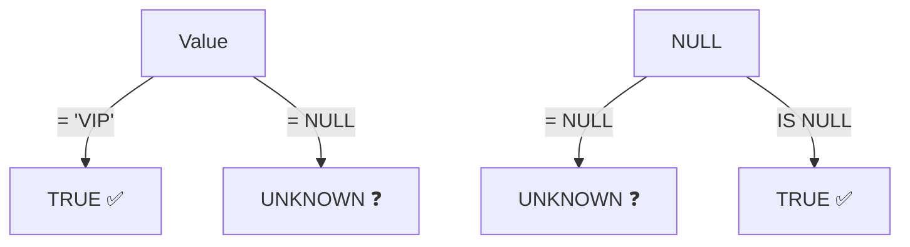

# 6강: NULL 다루기

0강에서 NULL을 간단히 소개했습니다 — '값이 없다'는 뜻이라고요. 이번 강에서는 NULL이 SQL에서 어떻게 특별하게 동작하는지, 그리고 안전하게 다루는 방법을 배웁니다.

!!! note "이미 알고 계신다면"
    IS NULL, COALESCE, NULLIF, NULL 전파를 이미 알고 있다면 [7강: CASE 표현식](07-case.md)으로 건너뛰세요.



> **개념:** NULL은 '값이 없음'입니다. = NULL은 항상 UNKNOWN이므로 IS NULL을 사용해야 합니다.

## NULL은 어떤 값과도 같지 않습니다

NULL을 `=`나 `<>`로 비교할 수 없습니다. 이런 비교는 항상 `NULL`(알 수 없음)을 반환하며, 절대 `TRUE`가 되지 않습니다.

```sql
-- 잘못된 방법: 아무 행도 반환되지 않습니다!
SELECT name FROM customers WHERE birth_date = NULL;

-- 올바른 방법: IS NULL 사용
SELECT name FROM customers WHERE birth_date IS NULL;
```

```sql
-- 성별이 확인된 고객 조회
SELECT name, gender
FROM customers
WHERE gender IS NOT NULL
LIMIT 5;
```

**결과:**

| name | gender |
| ---- | ------ |
| 정준호  | M      |
| 김민재  | M      |
| 진정자  | F      |
| 이정수  | M      |
| ...  | ...    |

## IS NULL과 IS NOT NULL

```sql
-- 배송 메모가 없는 주문
SELECT order_number, total_amount
FROM orders
WHERE notes IS NULL
LIMIT 5;
```

**결과:**

| order_number       | total_amount |
| ------------------ | -----------: |
| ORD-20160101-00001 |       130700 |
| ORD-20160102-00003 |       265400 |
| ORD-20160103-00004 |       130700 |
| ...                | ...          |

```sql
-- 담당 직원이 없는 반품/민원 주문
SELECT order_number, status
FROM orders
WHERE staff_id IS NULL
  AND status IN ('return_requested', 'returned', 'complaints')
LIMIT 5;
```

## COALESCE

`COALESCE(a, b, c, ...)`는 인자 중 NULL이 아닌 첫 번째 값을 반환합니다. NULL 대신 기본값을 표시할 때 가장 널리 쓰이는 방법입니다.

```sql
-- 성별이 NULL이면 '미입력'으로 표시
SELECT
    name,
    COALESCE(gender, '미입력') AS gender_display
FROM customers
LIMIT 8;
```

**결과:**

| name | gender_display |
| ---- | -------------- |
| 정준호  | M              |
| 김경수  | 미입력            |
| 김민재  | M              |
| 진정자  | F              |
| 이정수  | M              |
| ...  | ...            |

```sql
-- 배송 메모가 없으면 기본 문구 표시
SELECT
    order_number,
    COALESCE(notes, '특이사항 없음') AS delivery_note
FROM orders
LIMIT 5;
```

**결과:**

| order_number       | delivery_note |
| ------------------ | ------------- |
| ORD-20160101-00001 | 특이사항 없음       |
| ORD-20160102-00002 | 1층 로비에 놓아주세요  |
| ORD-20160102-00003 | 특이사항 없음       |
| ...                | ...           |

## NULLIF

`NULLIF(a, b)`는 `a`와 `b`가 같으면 NULL을 반환하고, 다르면 `a`를 반환합니다. 0으로 나누기 오류를 방지할 때 자주 사용됩니다.

```sql
-- 0으로 나누기 방지: 안전한 비율 계산
SELECT
    grade,
    COUNT(*) AS total,
    COUNT(CASE WHEN is_active = 0 THEN 1 END) AS inactive,
    ROUND(
        100.0 * COUNT(CASE WHEN is_active = 0 THEN 1 END)
              / NULLIF(COUNT(*), 0),
        1
    ) AS pct_inactive
FROM customers
GROUP BY grade;
```

**결과:**

| grade  | total | inactive | pct_inactive |
| ------ | ----: | -------: | -----------: |
| BRONZE |  3962 |     1414 |         35.7 |
| GOLD   |   484 |        0 |            0 |
| SILVER |   469 |        0 |            0 |
| VIP    |   315 |        0 |            0 |

## 집계 함수와 NULL

집계 함수(`SUM`, `AVG`, `COUNT(칼럼명)`, `MIN`, `MAX`)는 NULL 값을 조용히 무시합니다. 예상치 못한 결과가 나올 수 있으므로 주의하세요.

=== "SQLite"
    ```sql
    -- COUNT(*)와 COUNT(birth_date) 비교
    SELECT
        COUNT(*)           AS all_customers,
        COUNT(birth_date)  AS customers_with_dob,
        AVG(
            CAST(SUBSTR(birth_date, 1, 4) AS INTEGER)
        )                  AS avg_birth_year
    FROM customers;
    ```

=== "MySQL"
    ```sql
    SELECT
        COUNT(*)           AS all_customers,
        COUNT(birth_date)  AS customers_with_dob,
        AVG(YEAR(birth_date)) AS avg_birth_year
    FROM customers;
    ```

=== "PostgreSQL"
    ```sql
    SELECT
        COUNT(*)           AS all_customers,
        COUNT(birth_date)  AS customers_with_dob,
        AVG(EXTRACT(YEAR FROM birth_date))::numeric(6,1) AS avg_birth_year
    FROM customers;
    ```

**결과:**

| all_customers | customers_with_dob | avg_birth_year |
|--------------:|-------------------:|---------------:|
| 5230 | 4445 | 1982.3 |

> `AVG`는 생년월일이 있는 4,445명만을 대상으로 계산됩니다. NULL인 785명은 자동으로 제외됩니다.

## 표현식에서의 NULL 전파

{ .off-glb width="400" }

NULL이 포함된 산술 연산은 결과도 NULL이 됩니다.

```sql
-- NULL은 연산 결과에 전파됩니다
SELECT
    1 + NULL,       -- NULL
    NULL * 100,     -- NULL
    'hello' || NULL -- NULL (문자열 연결도 마찬가지)
```

`COALESCE`로 NULL 전파를 방지할 수 있습니다.

=== "SQLite"
    ```sql
    -- birth_date가 NULL이면 나이를 -1로 처리
    SELECT
        name,
        birth_date,
        COALESCE(
            CAST((julianday('now') - julianday(birth_date)) / 365.25 AS INTEGER),
            -1
        ) AS age_years
    FROM customers
    LIMIT 5;
    ```

=== "MySQL"
    ```sql
    SELECT
        name,
        birth_date,
        COALESCE(
            TIMESTAMPDIFF(YEAR, birth_date, CURDATE()),
            -1
        ) AS age_years
    FROM customers
    LIMIT 5;
    ```

=== "PostgreSQL"
    ```sql
    SELECT
        name,
        birth_date,
        COALESCE(
            EXTRACT(YEAR FROM AGE(CURRENT_DATE, birth_date))::int,
            -1
        ) AS age_years
    FROM customers
    LIMIT 5;
    ```

## 정리

| 문법 | 설명 | 예시 |
|------|------|------|
| `IS NULL` | 값이 NULL인지 확인 | `WHERE birth_date IS NULL` |
| `IS NOT NULL` | 값이 NULL이 아닌지 확인 | `WHERE gender IS NOT NULL` |
| `COALESCE(a, b, ...)` | NULL이 아닌 첫 번째 값 반환 | `COALESCE(gender, '미입력')` |
| `NULLIF(a, b)` | a = b이면 NULL 반환 (0 나누기 방지) | `price / NULLIF(stock_qty, 0)` |
| 집계와 NULL | SUM, AVG, COUNT(칼럼) 등은 NULL 무시 | `AVG`는 NULL 행 제외 후 계산 |
| NULL 전파 | NULL + 숫자 = NULL | `1 + NULL → NULL` |

!!! note "레슨 복습 문제"
    이 레슨에서 배운 개념을 바로 확인하는 간단한 문제입니다. 여러 개념을 종합하는 실전 연습은 [연습 문제](../exercises/index.md) 섹션을 참고하세요.

## 연습 문제
### 문제 1
`staff` 테이블에서 `manager_id`가 NULL인 직원(최고 관리자)의 `name`, `department`, `role`을 조회하세요.

??? success "정답"
    ```sql
    SELECT name, department, role
    FROM staff
    WHERE manager_id IS NULL;
    ```

    **결과 (예시):**

    | name | department | role  |
    | ---- | ---------- | ----- |
    | 한민재  | 경영         | admin |


### 문제 2
`customers` 테이블에서 `phone`이 NULL인 고객의 `name`, `email`을 조회하되, `email`도 NULL이면 `'연락처 없음'`으로 대체하세요.

??? success "정답"
    ```sql
    SELECT
        name,
        COALESCE(email, '연락처 없음') AS email
    FROM customers
    WHERE phone IS NULL;
    ```


### 문제 3
`NULLIF`를 사용하여 `products` 테이블에서 `stock_qty`가 0인 상품의 가격 대비 재고 비율을 안전하게 계산하세요. `name`, `price`, `stock_qty`, `price / NULLIF(stock_qty, 0)`을 `price_per_unit`이라는 별칭으로 반환하세요. 결과를 5행으로 제한하세요.

??? success "정답"
    ```sql
    SELECT
        name,
        price,
        stock_qty,
        price / NULLIF(stock_qty, 0) AS price_per_unit
    FROM products
    LIMIT 5;
    ```

    **결과 (예시):**

    | name                                     | price   | stock_qty | price_per_unit |
    | ---------------------------------------- | ------: | --------: | -------------: |
    | Razer Blade 18 블랙                        | 2987500 |       107 |       27920.56 |
    | MSI GeForce RTX 4070 Ti Super GAMING X   | 1744000 |       499 |        3494.99 |
    | 삼성 DDR4 32GB PC4-25600                   |   49100 |       359 |         136.77 |
    | Dell U2724D                              |  853600 |       337 |        2532.94 |
    | G.SKILL Trident Z5 DDR5 64GB 6000MHz 화이트 |  130700 |        59 |        2215.25 |


### 문제 4
`customers` 테이블에서 `last_login_at`이 NULL인 고객의 `name`, `email`, `created_at`을 조회하세요. `email`이 NULL이면 `'없음'`, `created_at`이 NULL이면 `'알 수 없음'`으로 대체하세요. 결과를 10행으로 제한하세요.

??? success "정답"
    ```sql
    SELECT
        name,
        COALESCE(email, '없음')        AS email,
        COALESCE(created_at, '알 수 없음') AS created_at
    FROM customers
    WHERE last_login_at IS NULL
    LIMIT 10;
    ```

    **결과 (예시):**

    | name | email              | created_at          |
    | ---- | ------------------ | ------------------- |
    | 윤준영  | user25@testmail.kr | 2016-02-03 04:18:52 |
    | 이영식  | user43@testmail.kr | 2016-02-23 17:09:54 |
    | 송서준  | user66@testmail.kr | 2016-05-07 02:57:58 |
    | 김지우  | user77@testmail.kr | 2016-04-29 00:44:20 |
    | 박아름  | user80@testmail.kr | 2016-08-13 13:52:58 |
    | ...  | ...                | ...                 |


### 문제 5
담당 직원이 없는(`staff_id IS NULL`) 주문을 모두 조회하세요. `order_number`, `status`, `notes`를 표시하되, notes가 NULL이면 `'—'`으로 대체하세요.

??? success "정답"
    ```sql
    SELECT
        order_number,
        status,
        COALESCE(notes, '—') AS notes
    FROM orders
    WHERE staff_id IS NULL
    ORDER BY ordered_at DESC
    LIMIT 20;
    ```

    **결과 (예시):**

    | order_number       | status    | notes              |
    | ------------------ | --------- | ------------------ |
    | ORD-20250630-34900 | pending   | 문 앞에 놓아주세요         |
    | ORD-20250630-34905 | pending   | —                  |
    | ORD-20250630-34903 | cancelled | 오후 2시 이후 배송 부탁드립니다 |
    | ORD-20250630-34899 | pending   | 배송 전 연락 부탁합니다      |
    | ORD-20250630-34896 | pending   | 경비실에 맡겨주세요         |
    | ...                | ...       | ...                |


### 문제 6
멤버십 `grade`별로 성별이 확인된 고객 수와 성별 미입력 고객 수를 함께 조회하세요. 그룹화 기준으로 `COALESCE(gender, 'Unknown')`을 사용하세요.

??? success "정답"
    ```sql
    SELECT
        grade,
        COALESCE(gender, 'Unknown') AS gender_status,
        COUNT(*) AS customer_count
    FROM customers
    GROUP BY grade, COALESCE(gender, 'Unknown')
    ORDER BY grade, gender_status;
    ```

    **결과 (예시):**

    | grade  | gender_status | customer_count |
    | ------ | ------------- | -------------: |
    | BRONZE | F             |           1332 |
    | BRONZE | M             |           2194 |
    | BRONZE | Unknown       |            436 |
    | GOLD   | F             |            136 |
    | GOLD   | M             |            316 |
    | ...    | ...           | ...            |


### 문제 7
`orders` 테이블에서 `cancelled_at`이 NULL인(취소되지 않은) 주문 수와 NULL이 아닌(취소된) 주문 수를 각각 구하세요. 별칭은 `not_cancelled`, `cancelled`로 지정하세요.

??? success "정답"
    ```sql
    SELECT
        COUNT(CASE WHEN cancelled_at IS NULL THEN 1 END)     AS not_cancelled,
        COUNT(CASE WHEN cancelled_at IS NOT NULL THEN 1 END) AS cancelled
    FROM orders;
    ```

    **결과 (예시):**

    | not_cancelled | cancelled |
    | ------------: | --------: |
    |         33154 |      1754 |


### 문제 8
`products` 테이블에서 `weight_grams` 칼럼이 NULL인 상품 수와 전체 상품 수를 구하고, NULL 비율(소수점 1자리)을 계산하세요. 별칭은 `total_products`, `missing_weight`, `pct_missing`으로 지정하세요.

??? success "정답"
    ```sql
    SELECT
        COUNT(*)                                AS total_products,
        COUNT(*) - COUNT(weight_grams)                AS missing_weight,
        ROUND(100.0 * (COUNT(*) - COUNT(weight_grams)) / COUNT(*), 1) AS pct_missing
    FROM products;
    ```

    **결과 (예시):**

    | total_products | missing_weight | pct_missing |
    | -------------: | -------------: | ----------: |
    |            280 |             12 |         4.3 |


### 문제 9
`reviews` 테이블에서 `content`가 NULL인 리뷰와 NULL이 아닌 리뷰의 평균 `rating`을 각각 구하세요. `COUNT(*)`와 `AVG(rating)`을 함께 표시하세요.

??? success "정답"
    ```sql
    SELECT
        CASE WHEN content IS NULL THEN 'No Content' ELSE 'Has Content' END AS content_status,
        COUNT(*)        AS review_count,
        AVG(rating)     AS avg_rating
    FROM reviews
    GROUP BY CASE WHEN content IS NULL THEN 'No Content' ELSE 'Has Content' END;
    ```

    **결과 (예시):**

    | content_status | review_count | avg_rating |
    | -------------- | -----------: | ---------: |
    | Has Content    |         7156 |       3.91 |
    | No Content     |          789 |       3.93 |


### 문제 10
생년월일 미입력, 성별 미입력, 로그인 이력 없음 각각의 고객 수와 전체 고객 수를 함께 조회하세요.

??? success "정답"
    ```sql
    SELECT
        COUNT(*)                                         AS total_customers,
        COUNT(*) - COUNT(birth_date)                    AS missing_birth_date,
        COUNT(*) - COUNT(gender)                        AS missing_gender,
        SUM(CASE WHEN last_login_at IS NULL THEN 1 ELSE 0 END) AS never_logged_in
    FROM customers;
    ```

    **결과 (예시):**

    | total_customers | missing_birth_date | missing_gender | never_logged_in |
    | --------------: | -----------------: | -------------: | --------------: |
    |            5230 |                780 |            523 |             289 |


### 채점 가이드

| 점수 | 다음 단계 |
|:----:|----------|
| **9~10개** | [7강: CASE 표현식](07-case.md)으로 이동 |
| **7~8개** | 틀린 문제 해설을 복습한 뒤 다음강으로 |
| **5개 이하** | 이 강의를 다시 읽어보세요 |
| **3개 이하** | [5강: GROUP BY](05-group-by.md)부터 다시 시작하세요 |

**문제별 영역:**

| 영역 | 해당 문제 |
|------|:--------:|
| IS NULL | 1, 5 |
| COALESCE | 2, 4 |
| NULLIF | 3 |
| COALESCE + GROUP BY | 6 |
| 집계와 NULL (CASE + COUNT) | 7, 8 |
| NULL 그룹 비교 (AVG + IS NULL) | 9 |
| NULL 전파 (다중 칼럼 결측 집계) | 10 |

---
다음: [7강: CASE 표현식](07-case.md)
