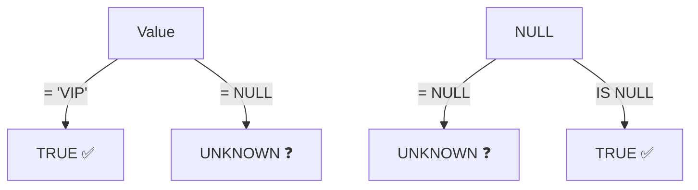

# 6강: NULL 다루기

`NULL`은 알 수 없거나 존재하지 않는 값을 나타냅니다. 0도 아니고 빈 문자열도 아닌, 값 자체가 없는 상태입니다. NULL은 SQL의 다른 모든 값과 다르게 동작하기 때문에 정확히 이해하는 것이 중요합니다.



> **개념:** NULL은 '값이 없음'입니다. = NULL은 항상 UNKNOWN이므로 IS NULL을 사용해야 합니다.

## NULL은 어떤 값과도 같지 않습니다

NULL을 `=`나 `<>`로 비교할 수 없습니다. 이런 비교는 항상 `NULL`(알 수 없음)을 반환하며, 절대 `TRUE`가 되지 않습니다.

```sql
-- 잘못된 방법: 아무 행도 반환되지 않습니다!
SELECT name FROM customers WHERE birth_date = NULL;

-- 올바른 방법: IS NULL 사용
SELECT name FROM customers WHERE birth_date IS NULL;
```

```sql
-- 성별이 확인된 고객 조회
SELECT name, gender
FROM customers
WHERE gender IS NOT NULL
LIMIT 5;
```

**결과:**

| name | gender |
|------|--------|
| 김민수 | M |
| 이영희 | F |
| 박지훈 | M |
| 최서연 | F |
| ... | |

## IS NULL과 IS NOT NULL

```sql
-- 배송 메모가 없는 주문
SELECT order_number, total_amount
FROM orders
WHERE notes IS NULL
LIMIT 5;
```

**결과:**

| order_number | total_amount |
|--------------|-------------:|
| ORD-20150314-00001 | 249.98 |
| ORD-20150314-00002 | 1399.99 |
| ORD-20150315-00003 | 59.99 |
| ... | |

```sql
-- 담당 직원이 없는 반품/민원 주문
SELECT order_number, status
FROM orders
WHERE staff_id IS NULL
  AND status IN ('return_requested', 'returned', 'complaints')
LIMIT 5;
```

## COALESCE

`COALESCE(a, b, c, ...)`는 인자 중 NULL이 아닌 첫 번째 값을 반환합니다. NULL 대신 기본값을 표시할 때 가장 널리 쓰이는 방법입니다.

```sql
-- 성별이 NULL이면 '미입력'으로 표시
SELECT
    name,
    COALESCE(gender, '미입력') AS gender_display
FROM customers
LIMIT 8;
```

**결과:**

| name | gender_display |
|------|----------------|
| 김민수 | M |
| 최준혁 | 미입력 |
| 이영희 | F |
| 강소연 | 미입력 |
| 박지훈 | M |
| ... | |

```sql
-- 배송 메모가 없으면 기본 문구 표시
SELECT
    order_number,
    COALESCE(notes, '특이사항 없음') AS delivery_note
FROM orders
LIMIT 5;
```

**결과:**

| order_number | delivery_note |
|--------------|---------------|
| ORD-20150314-00001 | 특이사항 없음 |
| ORD-20150314-00002 | 문 앞에 놓아주세요 |
| ORD-20150315-00003 | 특이사항 없음 |
| ... | |

## NULLIF

`NULLIF(a, b)`는 `a`와 `b`가 같으면 NULL을 반환하고, 다르면 `a`를 반환합니다. 0으로 나누기 오류를 방지할 때 자주 사용됩니다.

```sql
-- 0으로 나누기 방지: 안전한 비율 계산
SELECT
    grade,
    COUNT(*) AS total,
    COUNT(CASE WHEN is_active = 0 THEN 1 END) AS inactive,
    ROUND(
        100.0 * COUNT(CASE WHEN is_active = 0 THEN 1 END)
              / NULLIF(COUNT(*), 0),
        1
    ) AS pct_inactive
FROM customers
GROUP BY grade;
```

**결과:**

| grade | total | inactive | pct_inactive |
|-------|------:|---------:|-------------:|
| BRONZE | 2614 | 182 | 7.0 |
| SILVER | 1569 | 94 | 6.0 |
| GOLD | 785 | 31 | 3.9 |
| VIP | 262 | 7 | 2.7 |

## 집계 함수와 NULL

집계 함수(`SUM`, `AVG`, `COUNT(칼럼명)`, `MIN`, `MAX`)는 NULL 값을 조용히 무시합니다. 예상치 못한 결과가 나올 수 있으므로 주의하세요.

=== "SQLite"
    ```sql
    -- COUNT(*)와 COUNT(birth_date) 비교
    SELECT
        COUNT(*)           AS all_customers,
        COUNT(birth_date)  AS customers_with_dob,
        AVG(
            CAST(SUBSTR(birth_date, 1, 4) AS INTEGER)
        )                  AS avg_birth_year
    FROM customers;
    ```

=== "MySQL"
    ```sql
    SELECT
        COUNT(*)           AS all_customers,
        COUNT(birth_date)  AS customers_with_dob,
        AVG(YEAR(birth_date)) AS avg_birth_year
    FROM customers;
    ```

=== "PostgreSQL"
    ```sql
    SELECT
        COUNT(*)           AS all_customers,
        COUNT(birth_date)  AS customers_with_dob,
        AVG(EXTRACT(YEAR FROM birth_date))::numeric(6,1) AS avg_birth_year
    FROM customers;
    ```

**결과:**

| all_customers | customers_with_dob | avg_birth_year |
|--------------:|-------------------:|---------------:|
| 5230 | 4445 | 1982.3 |

> `AVG`는 생년월일이 있는 4,445명만을 대상으로 계산됩니다. NULL인 785명은 자동으로 제외됩니다.

## 표현식에서의 NULL 전파

{ .off-glb width="400" }

NULL이 포함된 산술 연산은 결과도 NULL이 됩니다.

```sql
-- NULL은 연산 결과에 전파됩니다
SELECT
    1 + NULL,       -- NULL
    NULL * 100,     -- NULL
    'hello' || NULL -- NULL (문자열 연결도 마찬가지)
```

`COALESCE`로 NULL 전파를 방지할 수 있습니다.

=== "SQLite"
    ```sql
    -- birth_date가 NULL이면 나이를 -1로 처리
    SELECT
        name,
        birth_date,
        COALESCE(
            CAST((julianday('now') - julianday(birth_date)) / 365.25 AS INTEGER),
            -1
        ) AS age_years
    FROM customers
    LIMIT 5;
    ```

=== "MySQL"
    ```sql
    SELECT
        name,
        birth_date,
        COALESCE(
            TIMESTAMPDIFF(YEAR, birth_date, CURDATE()),
            -1
        ) AS age_years
    FROM customers
    LIMIT 5;
    ```

=== "PostgreSQL"
    ```sql
    SELECT
        name,
        birth_date,
        COALESCE(
            EXTRACT(YEAR FROM AGE(CURRENT_DATE, birth_date))::int,
            -1
        ) AS age_years
    FROM customers
    LIMIT 5;
    ```

!!! note "레슨 복습 문제"
    이 레슨에서 배운 개념을 바로 확인하는 간단한 문제입니다. 여러 개념을 종합하는 실전 연습은 [연습 문제](../exercises/index.md) 섹션을 참고하세요.

## 연습 문제

### 문제 1
생년월일 미입력, 성별 미입력, 로그인 이력 없음 각각의 고객 수와 전체 고객 수를 함께 조회하세요.

??? success "정답"
    ```sql
    SELECT
        COUNT(*)                                         AS total_customers,
        COUNT(*) - COUNT(birth_date)                    AS missing_birth_date,
        COUNT(*) - COUNT(gender)                        AS missing_gender,
        SUM(CASE WHEN last_login_at IS NULL THEN 1 ELSE 0 END) AS never_logged_in
    FROM customers;
    ```

### 문제 2
담당 직원이 없는(`staff_id IS NULL`) 주문을 모두 조회하세요. `order_number`, `status`, `notes`를 표시하되, notes가 NULL이면 `'—'`으로 대체하세요.

??? success "정답"
    ```sql
    SELECT
        order_number,
        status,
        COALESCE(notes, '—') AS notes
    FROM orders
    WHERE staff_id IS NULL
    ORDER BY ordered_at DESC
    LIMIT 20;
    ```

### 문제 3
`orders` 테이블에서 `cancelled_at`이 NULL인(취소되지 않은) 주문 수와 NULL이 아닌(취소된) 주문 수를 각각 구하세요. 별칭은 `not_cancelled`, `cancelled`로 지정하세요.

??? success "정답"
    ```sql
    SELECT
        COUNT(CASE WHEN cancelled_at IS NULL THEN 1 END)     AS not_cancelled,
        COUNT(CASE WHEN cancelled_at IS NOT NULL THEN 1 END) AS cancelled
    FROM orders;
    ```

### 문제 4
`customers` 테이블에서 `phone`이 NULL인 고객의 `name`, `email`을 조회하되, `email`도 NULL이면 `'연락처 없음'`으로 대체하세요.

??? success "정답"
    ```sql
    SELECT
        name,
        COALESCE(email, '연락처 없음') AS email
    FROM customers
    WHERE phone IS NULL;
    ```

### 문제 5
`products` 테이블에서 `weight_grams` 칼럼이 NULL인 상품 수와 전체 상품 수를 구하고, NULL 비율(소수점 1자리)을 계산하세요. 별칭은 `total_products`, `missing_weight`, `pct_missing`으로 지정하세요.

??? success "정답"
    ```sql
    SELECT
        COUNT(*)                                AS total_products,
        COUNT(*) - COUNT(weight_grams)                AS missing_weight,
        ROUND(100.0 * (COUNT(*) - COUNT(weight_grams)) / COUNT(*), 1) AS pct_missing
    FROM products;
    ```

### 문제 6
`NULLIF`를 사용하여 `products` 테이블에서 `stock_qty`가 0인 상품의 가격 대비 재고 비율을 안전하게 계산하세요. `name`, `price`, `stock_qty`, `price / NULLIF(stock_qty, 0)`을 `price_per_unit`이라는 별칭으로 반환하세요. 결과를 5행으로 제한하세요.

??? success "정답"
    ```sql
    SELECT
        name,
        price,
        stock_qty,
        price / NULLIF(stock_qty, 0) AS price_per_unit
    FROM products
    LIMIT 5;
    ```

### 문제 7
`reviews` 테이블에서 `content`가 NULL인 리뷰와 NULL이 아닌 리뷰의 평균 `rating`을 각각 구하세요. `COUNT(*)`와 `AVG(rating)`을 함께 표시하세요.

??? success "정답"
    ```sql
    SELECT
        CASE WHEN content IS NULL THEN 'No Content' ELSE 'Has Content' END AS content_status,
        COUNT(*)        AS review_count,
        AVG(rating)     AS avg_rating
    FROM reviews
    GROUP BY CASE WHEN content IS NULL THEN 'No Content' ELSE 'Has Content' END;
    ```

### 문제 8
`staff` 테이블에서 `manager_id`가 NULL인 직원(최고 관리자)의 `name`, `department`, `role`을 조회하세요.

??? success "정답"
    ```sql
    SELECT name, department, role
    FROM staff
    WHERE manager_id IS NULL;
    ```

### 문제 9
멤버십 `grade`별로 성별이 확인된 고객 수와 성별 미입력 고객 수를 함께 조회하세요. 그룹화 기준으로 `COALESCE(gender, 'Unknown')`을 사용하세요.

??? success "정답"
    ```sql
    SELECT
        grade,
        COALESCE(gender, 'Unknown') AS gender_status,
        COUNT(*) AS customer_count
    FROM customers
    GROUP BY grade, COALESCE(gender, 'Unknown')
    ORDER BY grade, gender_status;
    ```

### 문제 10
`customers` 테이블에서 `last_login_at`이 NULL인 고객의 `name`, `email`, `created_at`을 조회하세요. `email`이 NULL이면 `'없음'`, `created_at`이 NULL이면 `'알 수 없음'`으로 대체하세요. 결과를 10행으로 제한하세요.

??? success "정답"
    ```sql
    SELECT
        name,
        COALESCE(email, '없음')        AS email,
        COALESCE(created_at, '알 수 없음') AS created_at
    FROM customers
    WHERE last_login_at IS NULL
    LIMIT 10;
    ```

---
다음: [7강: INNER JOIN](../intermediate/07-inner-join.md)
