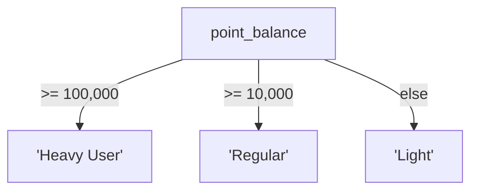

# 7강: CASE 표현식

데이터를 조회하다 보면 '가격이 100만 원 이상이면 고가, 아니면 일반'처럼 조건에 따라 다른 값을 표시하고 싶을 때가 있습니다. CASE 표현식으로 SQL 안에서 조건 분기를 할 수 있습니다.

!!! note "이미 알고 계신다면"
    CASE WHEN, 피벗, 범주화에 익숙하다면 [8강: INNER JOIN](../intermediate/08-inner-join.md)으로 건너뛰세요.

`CASE`는 SQL의 조건 표현식으로, 프로그래밍 언어의 `if/else`와 유사합니다. 값 변환, 레이블 생성, 데이터 구간 분류, 조건부 집계 등을 단일 쿼리 안에서 모두 처리할 수 있습니다.



> CASE는 SQL의 if-else입니다. 조건을 위에서 아래로 순서대로 검사합니다.

## 단순 CASE

단순(Simple) CASE는 하나의 칼럼 값을 고정된 값들과 비교합니다.

```sql
-- 주문 상태 코드를 읽기 쉬운 레이블로 변환
SELECT
    order_number,
    total_amount,
    CASE status
        WHEN 'pending'          THEN '결제 대기'
        WHEN 'paid'             THEN '결제 완료'
        WHEN 'preparing'        THEN '상품 준비 중'
        WHEN 'shipped'          THEN '배송 중'
        WHEN 'delivered'        THEN '배달 완료'
        WHEN 'confirmed'        THEN '구매 확정'
        WHEN 'cancelled'        THEN '취소됨'
        WHEN 'return_requested' THEN '반품 요청'
        WHEN 'returned'         THEN '반품 완료'
        ELSE status
    END AS status_label
FROM orders
ORDER BY ordered_at DESC
LIMIT 5;
```

**결과:**

| order_number | total_amount | status_label |
| ---------- | ----------: | ---------- |
| ORD-20251211-413965 | 409600.0 | 결제 대기 |
| ORD-20251226-416837 | 1169700.0 | 결제 대기 |
| ORD-20251231-417734 | 2076300.0 | 결제 대기 |
| ORD-20251231-417696 | 814400.0 | 반품 요청 |
| ORD-20251231-417737 | 550600.0 | 결제 대기 |
| ... | ... | ... |

## 검색 CASE

검색(Searched) CASE는 독립적인 `WHEN` 조건을 평가하여 비교 및 표현식에 완전한 유연성을 제공합니다.

```sql
-- 상품을 가격대별로 분류
SELECT
    name,
    price,
    CASE
        WHEN price < 50           THEN '저가'
        WHEN price BETWEEN 50 AND 199.99  THEN '중가'
        WHEN price BETWEEN 200 AND 799.99 THEN '고가'
        ELSE '프리미엄'
    END AS price_tier
FROM products
WHERE is_active = 1
ORDER BY price ASC
LIMIT 10;
```

**결과:**

| name | price | price_tier |
| ---------- | ----------: | ---------- |
| TP-Link TL-SG108 실버 | 16500.0 | 프리미엄 |
| TP-Link TG-3468 블랙 | 19800.0 | 프리미엄 |
| 삼성 무선 키보드 Trio 500 화이트 | 20300.0 | 프리미엄 |
| TP-Link TL-SG1016D 화이트 | 20300.0 | 프리미엄 |
| 로지텍 G502 HERO 실버 | 20300.0 | 프리미엄 |
| Razer Cobra 실버 | 20300.0 | 프리미엄 |
| TP-Link Archer TX55E 실버 | 20500.0 | 프리미엄 |
| 로지텍 G402 | 20500.0 | 프리미엄 |
| ... | ... | ... |

## 연령대 분류에 CASE 활용

=== "SQLite"
    ```sql
    -- 고객을 세대별로 분류
    SELECT
        name,
        birth_date,
        CASE
            WHEN birth_date IS NULL THEN '미확인'
            WHEN CAST(SUBSTR(birth_date, 1, 4) AS INTEGER) >= 1997 THEN 'Z세대'
            WHEN CAST(SUBSTR(birth_date, 1, 4) AS INTEGER) >= 1981 THEN '밀레니얼'
            WHEN CAST(SUBSTR(birth_date, 1, 4) AS INTEGER) >= 1965 THEN 'X세대'
            ELSE '베이비붐+'
        END AS generation
    FROM customers
    LIMIT 8;
    ```

=== "MySQL"
    ```sql
    SELECT
        name,
        birth_date,
        CASE
            WHEN birth_date IS NULL THEN '미확인'
            WHEN YEAR(birth_date) >= 1997 THEN 'Z세대'
            WHEN YEAR(birth_date) >= 1981 THEN '밀레니얼'
            WHEN YEAR(birth_date) >= 1965 THEN 'X세대'
            ELSE '베이비붐+'
        END AS generation
    FROM customers
    LIMIT 8;
    ```

=== "PostgreSQL"
    ```sql
    SELECT
        name,
        birth_date,
        CASE
            WHEN birth_date IS NULL THEN '미확인'
            WHEN EXTRACT(YEAR FROM birth_date) >= 1997 THEN 'Z세대'
            WHEN EXTRACT(YEAR FROM birth_date) >= 1981 THEN '밀레니얼'
            WHEN EXTRACT(YEAR FROM birth_date) >= 1965 THEN 'X세대'
            ELSE '베이비붐+'
        END AS generation
    FROM customers
    LIMIT 8;
    ```

**결과:**

| name | birth_date | generation |
|------|------------|------------|
| 김민수 | 1989-04-12 | 밀레니얼 |
| 이지은 | (NULL) | 미확인 |
| 박서준 | 1972-08-27 | X세대 |
| 최유리 | 2000-01-15 | Z세대 |
| ... | | |

## GROUP BY 및 집계에서의 CASE

`CASE`를 그룹화 표현식으로 사용하거나 집계 함수 내에서 활용할 수 있습니다.

```sql
-- 가격대별 상품 수
SELECT
    CASE
        WHEN price < 50           THEN '저가 (5만원 미만)'
        WHEN price BETWEEN 50 AND 199.99  THEN '중가 (5만~20만원)'
        WHEN price BETWEEN 200 AND 799.99 THEN '고가 (20만~80만원)'
        ELSE '프리미엄 (80만원 이상)'
    END AS price_tier,
    COUNT(*)   AS product_count,
    AVG(price) AS avg_price
FROM products
WHERE is_active = 1
GROUP BY price_tier
ORDER BY avg_price;
```

**결과:**

| price_tier | product_count | avg_price |
| ---------- | ----------: | ----------: |
| 프리미엄 (80만원 이상) | 2175 | 678774.8505747126 |

=== "SQLite"
    ```sql
    -- 피벗: 주문 상태별 건수를 칼럼으로 표시
    SELECT
        SUBSTR(ordered_at, 1, 7) AS year_month,
        COUNT(CASE WHEN status = 'confirmed' THEN 1 END) AS confirmed,
        COUNT(CASE WHEN status = 'cancelled' THEN 1 END) AS cancelled,
        COUNT(CASE WHEN status = 'returned'  THEN 1 END) AS returned,
        COUNT(*) AS total
    FROM orders
    WHERE ordered_at LIKE '2024%'
    GROUP BY SUBSTR(ordered_at, 1, 7)
    ORDER BY year_month;
    ```

=== "MySQL"
    ```sql
    SELECT
        DATE_FORMAT(ordered_at, '%Y-%m') AS year_month,
        COUNT(CASE WHEN status = 'confirmed' THEN 1 END) AS confirmed,
        COUNT(CASE WHEN status = 'cancelled' THEN 1 END) AS cancelled,
        COUNT(CASE WHEN status = 'returned'  THEN 1 END) AS returned,
        COUNT(*) AS total
    FROM orders
    WHERE ordered_at >= '2024-01-01'
      AND ordered_at <  '2025-01-01'
    GROUP BY DATE_FORMAT(ordered_at, '%Y-%m')
    ORDER BY year_month;
    ```

=== "PostgreSQL"
    ```sql
    SELECT
        TO_CHAR(ordered_at, 'YYYY-MM') AS year_month,
        COUNT(CASE WHEN status = 'confirmed' THEN 1 END) AS confirmed,
        COUNT(CASE WHEN status = 'cancelled' THEN 1 END) AS cancelled,
        COUNT(CASE WHEN status = 'returned'  THEN 1 END) AS returned,
        COUNT(*) AS total
    FROM orders
    WHERE ordered_at >= '2024-01-01'
      AND ordered_at <  '2025-01-01'
    GROUP BY TO_CHAR(ordered_at, 'YYYY-MM')
    ORDER BY year_month;
    ```

**결과:**

| year_month | confirmed | cancelled | returned | total |
|------------|----------:|----------:|---------:|------:|
| 2024-01 | 198 | 42 | 12 | 312 |
| 2024-02 | 183 | 38 | 9 | 289 |
| 2024-03 | 261 | 57 | 14 | 405 |
| ... | | | | |

## ORDER BY에서의 CASE

계산된 표현식으로 정렬할 수 있습니다.

```sql
-- 활성 상태 우선, 종료 상태 나중에 정렬
SELECT order_number, status, total_amount
FROM orders
ORDER BY
    CASE status
        WHEN 'pending'   THEN 1
        WHEN 'paid'      THEN 2
        WHEN 'preparing' THEN 3
        WHEN 'shipped'   THEN 4
        ELSE 5
    END,
    total_amount DESC
LIMIT 10;
```

## 정리

| 개념 | 설명 | 예시 |
|------|------|------

<!-- BEGIN_LESSON_EXERCISES -->

!!! note "레슨 복습 문제"
    이 레슨에서 배운 개념을 바로 확인하는 간단한 문제입니다. 여러 개념을 종합하는 실전 연습은 [연습 문제](../exercises/index.md) 섹션을 참고하세요.

### 문제 1
주문의 `notes` 칼럼이 NULL인 경우 `'메모 없음'`으로 표시하세요. CASE 표현식을 사용하여 `order_number`, `status`, `memo`(notes가 NULL이면 `'메모 없음'`, 아니면 notes 값)를 반환하세요. 최근 주문 15건으로 제한하세요.

??? success "정답"
    ```sql
    SELECT
    order_number,
    status,
    CASE
    WHEN notes IS NULL THEN '메모 없음'
    ELSE notes
    END AS memo
    FROM orders
    ORDER BY ordered_at DESC
    LIMIT 15;
    ```

### 문제 2
직원(`staff`) 목록을 정렬하되, `role`이 `'manager'`인 직원이 먼저, 그 다음 `'staff'`, 나머지가 마지막에 오도록 하세요. 같은 역할 내에서는 `name` 오름차순으로 정렬합니다. `name`, `department`, `role`을 반환하고, 활성 직원만 포함하세요.

??? success "정답"
    ```sql
    SELECT name, department, role
    FROM staff
    WHERE is_active = 1
    ORDER BY
    CASE role
    WHEN 'manager' THEN 1
    WHEN 'staff'   THEN 2
    ELSE 3
    END,
    name ASC;
    ```

### 문제 3
결제 수단(`payments.method`)을 단순 CASE로 한글 레이블로 변환하세요: `'card'` → `'신용카드'`, `'bank_transfer'` → `'계좌이체'`, `'cash'` → `'현금'`, 그 외 → `'기타'`. `id`, `amount`, `method_label`을 반환하고 10행으로 제한하세요.

??? success "정답"
    ```sql
    SELECT
    id,
    amount,
    CASE method
    WHEN 'card'          THEN '신용카드'
    WHEN 'bank_transfer' THEN '계좌이체'
    WHEN 'cash'          THEN '현금'
    ELSE '기타'
    END AS method_label
    FROM payments
    LIMIT 10;
    ```

### 문제 4
상품 목록에 `stock_status` 칼럼을 추가하세요: `stock_qty = 0`이면 `'품절'`, `1~10`이면 `'재고 부족'`, `11~100`이면 `'재고 있음'`, 100 초과면 `'재고 충분'`. 활성 상품 전체의 `name`, `stock_qty`, `stock_status`를 반환하세요.

??? success "정답"
    ```sql
    SELECT
    name,
    stock_qty,
    CASE
    WHEN stock_qty = 0         THEN '품절'
    WHEN stock_qty <= 10       THEN '재고 부족'
    WHEN stock_qty <= 100      THEN '재고 있음'
    ELSE '재고 충분'
    END AS stock_status
    FROM products
    WHERE is_active = 1
    ORDER BY stock_qty ASC;
    ```

### 문제 5
세대별 분포 보고서를 만드세요: 활성 고객이 각 세대(Z세대: 1997년 이후 출생, 밀레니얼: 1981~1996, X세대: 1965~1980, 베이비붐+: 1965년 이전, 미확인: birth_date가 NULL)에 몇 명씩 있는지 집계하세요. `generation`과 `customer_count`를 반환하세요.

??? success "정답"
    ```sql
    SELECT
    CASE
    WHEN birth_date IS NULL THEN '미확인'
    WHEN CAST(SUBSTR(birth_date, 1, 4) AS INTEGER) >= 1997 THEN 'Z세대'
    WHEN CAST(SUBSTR(birth_date, 1, 4) AS INTEGER) >= 1981 THEN '밀레니얼'
    WHEN CAST(SUBSTR(birth_date, 1, 4) AS INTEGER) >= 1965 THEN 'X세대'
    ELSE '베이비붐+'
    END AS generation,
    COUNT(*) AS customer_count
    FROM customers
    WHERE is_active = 1
    GROUP BY generation
    ORDER BY customer_count DESC;
    ```

### 문제 6
리뷰의 `rating`을 텍스트 레이블로 변환하세요: 5 → `'최고'`, 4 → `'좋음'`, 3 → `'보통'`, 2 → `'불만'`, 1 → `'최악'`. 레이블별 리뷰 수와 평균 평점을 구하세요. `rating_label`, `review_count`, `avg_rating`을 `avg_rating` 내림차순으로 반환하세요.

??? success "정답"
    ```sql
    SELECT
    CASE rating
    WHEN 5 THEN '최고'
    WHEN 4 THEN '좋음'
    WHEN 3 THEN '보통'
    WHEN 2 THEN '불만'
    WHEN 1 THEN '최악'
    END AS rating_label,
    COUNT(*)            AS review_count,
    ROUND(AVG(rating), 2) AS avg_rating
    FROM reviews
    GROUP BY rating
    ORDER BY avg_rating DESC;
    ```

### 문제 7
고객의 `point_balance`를 3단계로 분류하세요: 10만 이상 `'헤비 유저'`, 1만 이상 `'일반'`, 그 외 `'라이트'`. `grade`별로 각 단계에 해당하는 고객 수를 집계하세요. `grade`, `heavy_count`, `regular_count`, `light_count`를 반환하세요.

??? success "정답"
    ```sql
    SELECT
    grade,
    COUNT(CASE WHEN point_balance >= 100000 THEN 1 END) AS heavy_count,
    COUNT(CASE WHEN point_balance >= 10000
    AND point_balance < 100000 THEN 1 END) AS regular_count,
    COUNT(CASE WHEN point_balance < 10000 THEN 1 END)  AS light_count
    FROM customers
    WHERE is_active = 1
    GROUP BY grade
    ORDER BY grade;
    ```

### 문제 8
주문 금액 구간별(`total_amount` 기준: 10만 미만 `'소액'`, 10만~50만 미만 `'중간'`, 50만 이상 `'고액'`) 주문 수와 총 매출을 집계하고, 고액 주문이 위에 오도록 정렬하세요. `amount_tier`, `order_count`, `total_revenue`를 반환하세요.

??? success "정답"
    ```sql
    SELECT
    CASE
    WHEN total_amount < 100      THEN '소액'
    WHEN total_amount < 500      THEN '중간'
    ELSE '고액'
    END AS amount_tier,
    COUNT(*)          AS order_count,
    SUM(total_amount) AS total_revenue
    FROM orders
    WHERE status NOT IN ('cancelled', 'returned')
    GROUP BY amount_tier
    ORDER BY
    CASE
    WHEN total_amount < 100 THEN 3
    WHEN total_amount < 500 THEN 2
    ELSE 1
    END;
    ```

### 문제 9
결제 수단별 `'성공'`(status = `'completed'`)과 `'실패'`(그 외) 건수를 피벗하세요. `method`, `success_count`, `fail_count`, `success_rate`(성공률, 소수점 1자리)를 반환하고, 성공률 내림차순으로 정렬하세요.

??? success "정답"
    ```sql
    SELECT
    method,
    COUNT(CASE WHEN status = 'completed' THEN 1 END) AS success_count,
    COUNT(CASE WHEN status != 'completed' THEN 1 END) AS fail_count,
    ROUND(
    COUNT(CASE WHEN status = 'completed' THEN 1 END) * 100.0
    / COUNT(*),
    1
    ) AS success_rate
    FROM payments
    GROUP BY method
    ORDER BY success_rate DESC;
    ```

### 문제 10
각 상품의 2024년 분기별 매출을 별도 칼럼(`q1_revenue`, `q2_revenue`, `q3_revenue`, `q4_revenue`)으로 계산하세요. 조건부 집계(`SUM(CASE WHEN ... THEN ... END)`)를 사용하고, 2024년 판매 실적이 있는 상품만 포함합니다. 2024년 총 매출 내림차순으로 10행까지 반환하세요.

??? success "정답"
    ```sql
    SELECT
    p.name AS product_name,
    SUM(CASE WHEN o.ordered_at BETWEEN '2024-01-01' AND '2024-03-31 23:59:59'
    THEN oi.quantity * oi.unit_price ELSE 0 END) AS q1_revenue,
    SUM(CASE WHEN o.ordered_at BETWEEN '2024-04-01' AND '2024-06-30 23:59:59'
    THEN oi.quantity * oi.unit_price ELSE 0 END) AS q2_revenue,
    SUM(CASE WHEN o.ordered_at BETWEEN '2024-07-01' AND '2024-09-30 23:59:59'
    THEN oi.quantity * oi.unit_price ELSE 0 END) AS q3_revenue,
    SUM(CASE WHEN o.ordered_at BETWEEN '2024-10-01' AND '2024-12-31 23:59:59'
    THEN oi.quantity * oi.unit_price ELSE 0 END) AS q4_revenue
    FROM order_items AS oi
    INNER JOIN orders    AS o ON oi.order_id   = o.id
    INNER JOIN products  AS p ON oi.product_id = p.id
    WHERE o.ordered_at LIKE '2024%'
    AND o.status NOT IN ('cancelled', 'returned')
    GROUP BY p.id, p.name
    ORDER BY (q1_revenue + q2_revenue + q3_revenue + q4_revenue) DESC
    LIMIT 10;
    ```

<!-- END_LESSON_EXERCISES -->
