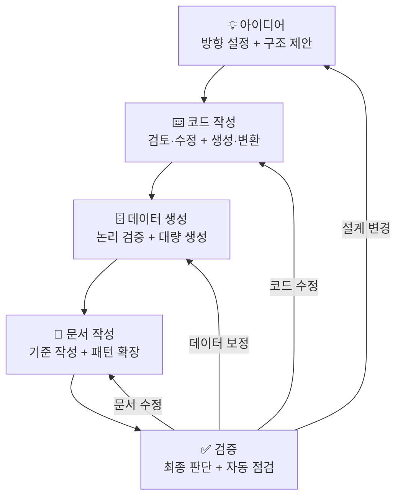

# SQL 튜토리얼 <small>v{{version}}</small> <small style="font-size:0.5em; color:gray;">{{date}}</small>

현실적인 **전자상거래 데이터베이스**(30 테이블 · 68만 건)로 SQL을 배우는 실습형 튜토리얼입니다.

컴퓨터 및 주변기기를 판매하는 가상의 온라인 쇼핑몰 **테크샵(TechShop)**의 10년간 비즈니스 데이터를 직접 쿼리하며, 기초부터 고급까지 **26개 레슨 · 270개 연습 문제**로 체계적으로 학습합니다.
**SQLite, MySQL, PostgreSQL** 세 가지 데이터베이스를 동시에 지원하며, 모든 예제와 연습 문제는 DB별 탭으로 비교할 수 있습니다.

## 필자 소개

**안영제** (civilian7@gmail.com) · **풀빛컴퓨팅**(Fullbit Computing) · **대표**

1983년 8비트 컴퓨터와 BASIC으로 프로그래밍을 처음 접했고, 1989년부터 직업 프로그래머로 살고 있습니다. 금융, 공공, 의료, IoT, 부동산 등 다양한 분야를 거치며 여러 언어로 프로그램을 만들어 왔고, 그중 델파이는 1.0부터 지금까지 30년 넘게 쓰고 있는 주력 언어입니다. 델파이 커뮤니티 [델마당](https://cafe.naver.com/delmadang)을 운영하고 있습니다.

인터넷에서는 **"시골프로그래머"**로 활동하고 있습니다. 강원도 홍천에 귀촌해 전원생활을 하던 시절에 붙인 이름인데, AI를 만나고 나서 20대 때의 창작 욕구가 되살아나 다시 도시로 나왔습니다. 현재는 경기도 하남에서 풀빛컴퓨팅을 운영하며 범용 쿼리 브라우저 **ezQuery**를 개발하고 있습니다.

아이디어 제안, 오류 신고, 기타 문의는 [civilian7@gmail.com](mailto:civilian7@gmail.com)으로 연락 바랍니다.

!!! note "ezQuery란?"
    **ezQuery**는 SQLite, MySQL, PostgreSQL, Oracle, SQL Server, Tibero 등 다양한 데이터베이스를 하나의 인터페이스로 관리하는 범용 쿼리 브라우저입니다. 델파이로 개발되었으며, **DirectX(Direct2D)** 기반 렌더링으로 대량 데이터도 부드럽게 표시합니다.

    - **빠른 속도** — 네이티브 바이너리 + DirectX 렌더링으로 수십만 행도 즉시 스크롤
    - **키보드 친화적** — 모나코 에디터 기반 SQL 편집기, 단축키 중심 워크플로우
    - **AI 어시스턴트** — 스키마 컨텍스트를 자동 인식하는 AI SQL 생성·오류 수정·실행 계획 해석
    - **올인원** — 테이블 디자이너, ERD 뷰어, 비주얼 쿼리 빌더, 데이터 가져오기/내보내기
    - **멀티 DB** — 설계 단계부터 DB 추상화 레이어를 반영하여, 새로운 데이터베이스를 쉽게 추가할 수 있는 구조
    - **다국어** — 한국어, 영어를 기본 지원하며, 설계 시부터 다국어 확장을 고려하여 다양한 언어를 쉽게 추가할 수 있습니다

    이 튜토리얼의 데이터베이스를 샘플로 포함할 예정입니다. 현재 개발 중이며, 출시 시 별도로 안내해드리겠습니다. 무료로 사용할 수 있는 **Community Edition**과 고급 기능을 포함한 유상의 **Pro Edition**으로 출시할 계획입니다.

## 왜 이 튜토리얼을 만들었나?

**ezQuery**에 포함할 샘플 데이터베이스를 만들다 시작됐습니다. 작업하다 보니 주니어 시절 겪었던 답답함이 떠올랐습니다 — **SQL을 배우고 싶은데 실습해볼 만한 데이터가 어디에도 없었던 경험**. 그래서 단순한 샘플을 넘어 제대로 된 튜토리얼로 키웠고, 같은 고민을 하고 있을 누군가에게 도움이 되기를 바라며 공개합니다.

## AI와의 협업

이 튜토리얼은 **[Claude](https://claude.ai)**(Anthropic)와의 협업으로 제작되었습니다. 데이터 모델, 생성기 코드, 레슨, 연습 문제, DB별 DDL/뷰/저장 프로시저, 그리고 이 문서 자체까지 — 모든 과정에서 AI와 함께 작업했습니다.

단, AI가 자동 생성한 결과물을 그대로 쓴 것이 아닙니다. 매 단계마다 역할이 나뉩니다:

| 단계 | 사람 | AI |
|------|------|-----|
| 아이디어 | 방향 설정, 요구사항 정의 | 구조 제안, 초안 작성 |
| 코드 | 검토·수정, 실행·디버깅 | 코드 생성, DB별 문법 변환 |
| 데이터 | 비즈니스 논리 검증 | 대량 데이터 생성·변환 |
| 문서 | 첫 레슨을 직접 작성 (기준점) | 패턴 학습 후 나머지 확장 |
| 검증 | 최종 판단 | 수치 불일치·깨진 링크·DDL 차이 자동 점검 |

이 사이클을 수백 번 반복하며 품질을 높여갔습니다.

사람은 **"이게 맞는가?"**를 판단하는 데 집중하고, AI는 **"빠르게 많이"**를 담당합니다. 이 조합 덕분에 혼자서는 수개월이 걸렸을 작업을 훨씬 짧은 시간에 마칠 수 있었습니다.

## 왜 Python인가?

필자의 주력 언어는 델파이, C/C++이지만, 데이터 생성기는 Python으로 작성했습니다.

- **Faker 라이브러리** — 한국어 이름, 주소, 전화번호 등 현실적인 가상 데이터를 로케일별로 생성할 수 있는 유일한 선택지
- **진입 장벽 최소화** — 독자는 SQL을 배우러 온 사람입니다. 델파이를 모를 수 있고, 상업용 라이선스를 구매할 이유도 없습니다. Python이라면 `pip install` 한 줄로 누구나 바로 시작할 수 있습니다
- **크로스 플랫폼** — Windows, macOS, Linux 어디서든 동일하게 동작합니다
- **AI 협업 효율** — Python은 AI가 가장 잘 다루는 언어입니다. 코드 생성·리팩터링·디버깅 모든 단계에서 협업 속도가 극대화됩니다

도구는 목적에 맞게 선택하는 것이 맞습니다. 데이터 생성이라는 일회성 작업에는 생태계가 풍부하고 접근성이 높은 Python이 최적이었습니다.

## 왜 이 교재인가?

SQL은 책으로 배우기 어렵습니다. 문법을 외워도 쿼리를 짤 수 없고, 10행짜리 샘플로는 실무 감각이 잡히지 않습니다. 이 튜토리얼은 **"직접 쿼리하면서 배우는"** 교재입니다.

**현실적인 데이터** — 10년간 성장하는 쇼핑몰의 68만 건 데이터에는 매출 증가 추세, 연말 피크, 고객 이탈, NULL, 이상치가 모두 들어 있습니다. 교과서적인 깨끗한 데이터가 아니라, 실무에서 만나는 그대로입니다.

**세 가지 DB를 동시에** — 같은 문제를 SQLite, MySQL, PostgreSQL로 풀어봅니다. DB별로 다른 문법을 탭 하나로 비교할 수 있어, 특정 DB에 종속되지 않는 SQL 실력을 키울 수 있습니다.

**내 손으로 만드는 데이터** — 시드 기반 생성기가 포함되어 있어 데이터 규모, 언어, 노이즈를 자유롭게 조절할 수 있습니다. 교재의 데이터를 그대로 쓸 수도, 자신만의 데이터를 만들 수도 있습니다.

| 기존 교재 | 이 튜토리얼 |
|-----------|------------|
| 문법 설명만, 실습 데이터 없음 | 10년간의 성장 곡선·계절성·고객 행동이 반영된 **68만 건** 데이터 |
| 하나의 DB만 다룸 | **SQLite, MySQL, PostgreSQL** — 같은 문제를 세 가지 DB로 |
| 정답만 제시 | **270문제** 전체에 정답 + 해설 + 결과표 |
| 데이터 고정, 커스텀 불가 | **시드 기반 생성기** — 규모·언어·노이즈 자유 조절 |
| 문법 나열식 구성 | 쇼핑몰 운영 **비즈니스 시나리오** 중심 실습 |
| 영어 또는 한국어 | 데이터와 문서 모두 **한국어/영어** 동시 지원 |

## 지원 데이터베이스 { #supported-databases }

이 튜토리얼은 세 가지 데이터베이스를 동시에 지원합니다. 각각 성격이 다르므로, 용도에 맞게 선택하거나 세 가지를 모두 경험해보세요.

### SQLite

파일 하나가 곧 데이터베이스입니다. 서버 설치가 필요 없고, `pip install` 없이 Python 표준 라이브러리만으로 바로 사용할 수 있습니다. 이 튜토리얼의 기본 DB입니다.

| 장점 | 단점 |
|------|------|
| 설치 불필요, 파일 복사만으로 배포 | 동시 쓰기 제한 (단일 writer) |
| 가볍고 빠름 (임베디드) | 사용자 관리·권한 제어 없음 |
| SQL 표준 대부분 지원 | 저장 프로시저 미지원 |
| 모바일·데스크톱 앱에 내장 사용 | 대규모 동시 접속에 부적합 |

### MySQL / MariaDB

세계에서 가장 널리 쓰이는 오픈소스 RDBMS입니다. 웹 서비스의 표준이라 할 수 있으며, MariaDB는 MySQL에서 포크된 호환 DB입니다. 이 튜토리얼의 MySQL SQL은 MariaDB에서도 그대로 실행됩니다.

| 장점 | 단점 |
|------|------|
| 풍부한 생태계, 호스팅 지원 | 일부 SQL 표준 미준수 (FULL OUTER JOIN 등) |
| 읽기 성능 우수, 복제 간편 | 서브쿼리 최적화가 PG 대비 약함 |
| ENUM, AUTO_INCREMENT 등 편의 기능 | CHECK 제약은 8.0.16+ 부터 실제 동작 |
| AWS RDS, Cloud SQL 등 클라우드 지원 | 윈도우 함수는 8.0+ 부터 지원 |

### PostgreSQL

가장 표준 준수도가 높은 오픈소스 RDBMS입니다. 복잡한 쿼리, JSON 처리, 확장성에서 강점을 가지며, 데이터 분석과 지리 정보(PostGIS) 분야에서 특히 인기가 높습니다.

| 장점 | 단점 |
|------|------|
| SQL 표준 최고 수준 준수 | 단순 읽기에서 MySQL보다 약간 느릴 수 있음 |
| JSONB, 배열, 범위 타입 등 풍부한 타입 | 초보자에게 설정이 다소 복잡 |
| Materialized View, 파티셔닝 네이티브 | 기본 복제 설정이 MySQL보다 복잡 |
| PL/pgSQL, 커스텀 타입, 확장 모듈 | 웹 호스팅 지원이 MySQL보다 적음 |

### 향후 지원 계획

현재는 SQLite, MySQL, PostgreSQL 세 가지를 지원하지만, 향후 다음 데이터베이스에 대한 지원을 계획하고 있습니다.

| 데이터베이스 | 상태 | 비고 |
|------------|:----:|------|
| Oracle | 계획 중 | 엔터프라이즈 시장 점유율 1위, PL/SQL |
| SQL Server | 계획 중 | .NET 생태계, T-SQL |
| DB2 | 검토 중 | 금융·공공 분야 레거시 |
| CUBRID | 검토 중 | 국산 오픈소스 RDBMS |
| Tibero | 검토 중 | 국산 상용 RDBMS, Oracle 호환 |

데이터 생성기의 구조가 DB별 익스포터를 플러그인 형태로 분리하고 있어, 새 DB 추가 시 DDL/데이터 변환 모듈만 작성하면 됩니다. 기여를 환영합니다.

## 무엇을 배우나

### 초급 — 7개 레슨 · 62문제

SQL의 가장 기본적인 구문을 익힙니다. 이 단계를 마치면 단일 테이블에서 원하는 데이터를 조회하고, 조건으로 필터링하고, 정렬하고, 집계할 수 있습니다. 프로그래밍 경험이 없어도 시작할 수 있습니다.

| # | 레슨 | 배우는 것 | 할 수 있게 되는 것 |
|:-:|------|----------|------------------|
| 00 | 데이터베이스와 SQL 소개 | DB 개념, 테이블·행·열 | DB의 구조를 이해하고 SQL 도구에서 쿼리 실행 |
| 01 | SELECT 기초 | 칼럼 선택, 별칭, DISTINCT | 원하는 칼럼만 골라서 조회 |
| 02 | WHERE로 필터링 | 비교 연산자, AND/OR, IN, LIKE, BETWEEN | 조건에 맞는 행만 추출 |
| 03 | 정렬과 페이징 | ORDER BY, LIMIT, OFFSET | 결과를 원하는 순서로 정렬하고 상위 N건 추출 |
| 04 | 집계 함수 | COUNT, SUM, AVG, MIN, MAX | 전체 건수, 합계, 평균 등 요약 통계 산출 |
| 05 | GROUP BY와 HAVING | 그룹별 집계, 그룹 필터링 | 카테고리별·월별 등 그룹 단위 분석 |
| 06 | NULL 처리 | IS NULL, COALESCE, IFNULL | 빈 값을 올바르게 처리하고 기본값 지정 |

### 중급 — 11개 레슨 · 84문제

여러 테이블을 결합하고, 데이터를 변환·조작합니다. 이 단계를 마치면 실무에서 필요한 대부분의 SQL을 작성할 수 있습니다. JOIN, 서브쿼리, 데이터 조작(DML), 테이블 설계(DDL), 트랜잭션까지 다룹니다.

| # | 레슨 | 배우는 것 | 할 수 있게 되는 것 |
|:-:|------|----------|------------------|
| 07 | INNER JOIN | ON 조건, 다중 JOIN | 주문+고객+상품을 하나로 합쳐 조회 |
| 08 | LEFT JOIN | 외부 조인, NULL 매칭 | 주문이 없는 고객, 리뷰가 없는 상품 찾기 |
| 09 | 서브쿼리 | 스칼라·인라인 뷰·WHERE 절 | 평균보다 비싼 상품, 최다 구매 고객 추출 |
| 10 | CASE 표현식 | 조건 분기, 피벗, 범주화 | 가격대별 등급 분류, 행 데이터를 열로 변환 |
| 11 | 날짜/시간 함수 | 추출·계산·포맷, DB별 차이 | 월별 매출 추이, 가입 후 첫 주문까지 일수 |
| 12 | 문자열 함수 | SUBSTR, REPLACE, CONCAT | 이메일 도메인 추출, 상품명 가공 |
| 13 | UNION | 합집합, INTERSECT, EXCEPT | 여러 쿼리 결과를 하나로 합치기 |
| 14 | INSERT, UPDATE, DELETE | 데이터 삽입·수정·삭제 | 신규 고객 등록, 가격 일괄 변경, 데이터 정리 |
| 15 | DDL | CREATE TABLE, ALTER, 제약 조건 | 테이블 생성·변경, PK/FK/CHECK 설정 |
| 16 | 트랜잭션과 ACID | BEGIN, COMMIT, ROLLBACK | 주문+결제를 원자적으로 처리, 실패 시 롤백 |
| 17 | SELF JOIN과 CROSS JOIN | 자기 참조, 카티션 곱 | 매니저 계층 조회, 날짜×카테고리 조합 생성 |

### 고급 — 8개 레슨 · 124문제

분석 쿼리, 성능 튜닝, DB 설계까지 실무 수준으로 확장합니다. 이 단계를 마치면 윈도우 함수로 순위·누적·이동 평균을 계산하고, 실행 계획을 읽고, 인덱스를 설계하고, 저장 프로시저를 작성할 수 있습니다.

| # | 레슨 | 배우는 것 | 할 수 있게 되는 것 |
|:-:|------|----------|------------------|
| 18 | 윈도우 함수 | ROW_NUMBER, RANK, LAG/LEAD | 순위 매기기, 전월 대비 성장률, 누적 합계 |
| 19 | CTE와 재귀 CTE | WITH 절, 재귀 계층 탐색 | 복잡한 쿼리를 읽기 쉽게, 카테고리 트리 탐색 |
| 20 | EXISTS와 상관 서브쿼리 | EXISTS/NOT EXISTS 패턴 | 조건에 맞는 관련 데이터 존재 여부 판별 |
| 21 | 뷰 | CREATE VIEW, Materialized View | 자주 쓰는 복잡 쿼리를 뷰로 저장해 재사용 |
| 22 | 인덱스와 성능 | EXPLAIN, 인덱스 설계 | 느린 쿼리의 원인을 찾고 인덱스로 개선 |
| 23 | 트리거 | BEFORE/AFTER 트리거 | 데이터 변경 시 자동으로 이력 기록·검증 |
| 24 | JSON 데이터 쿼리 | JSON 추출·필터링, DB별 차이 | JSON 칼럼에서 값 추출, 조건 검색 |
| 25 | 저장 프로시저 | PL/pgSQL, MySQL 프로시저 | 비즈니스 로직을 DB 안에 캡슐화 |

### 연습 문제 — 23개 세트 · 270문제

레슨에서 배운 문법을 실제 비즈니스 데이터에 적용합니다. 모든 문제에는 정답, 해설, 결과표가 포함되어 있습니다.

### 초급 연습 (4세트 · 62문제)

초급 레슨(00~06)에서 배운 SELECT, WHERE, 집계, GROUP BY, NULL을 실제 데이터로 연습합니다. 단일 테이블에서 원하는 데이터를 정확히 추출하는 능력을 기릅니다.

| 세트 | 필요 지식 | 출제 의도 | 얻게 되는 것 |
|------|----------|----------|-------------|
| 상품 탐색 | SELECT, WHERE, ORDER BY, LIMIT | 다양한 조건 조합으로 상품을 찾아보기 | 필터링·정렬·페이징의 실전 감각 |
| 고객 분석 | 집계 함수, GROUP BY, HAVING | 등급별·성별·가입채널별 고객 통계 산출 | 데이터를 그룹으로 나눠 분석하는 능력 |
| 주문 기초 | GROUP BY, HAVING, 날짜 필터링 | 기간별·상태별 주문 데이터 요약 | 비즈니스 보고서의 기초가 되는 집계 쿼리 |
| 빈칸 채우기 | 초급 전 범위 | 불완전한 SQL의 빈칸을 채워 완성하기 | 문법 구조를 머릿속에 정착시키기 |

### 중급 연습 (7세트 · 84문제)

중급 레슨(07~17)에서 배운 JOIN, 서브쿼리, CASE, DML, DDL, 트랜잭션을 복합적으로 활용합니다. 여러 테이블을 넘나들며 데이터를 조합·변환·조작하는 실무 능력을 키웁니다.

| 세트 | 필요 지식 | 출제 의도 | 얻게 되는 것 |
|------|----------|----------|-------------|
| JOIN 마스터 | INNER/LEFT/RIGHT JOIN | 주문+고객+상품+결제를 다양한 조합으로 결합 | 어떤 JOIN을 언제 쓰는지 판단하는 능력 |
| 날짜/시간 분석 | 날짜 함수, GROUP BY | 월별 매출 추이, 요일별 패턴, 기간 계산 | 시계열 데이터를 다루는 실무 패턴 |
| 서브쿼리와 변환 | 서브쿼리, EXISTS, CASE | 평균 이상 상품, 등급별 분류, 데이터 변환 | 복잡한 조건을 쿼리 안에서 해결하는 능력 |
| 제약조건 체험 | DDL, PK/FK/CHECK/UNIQUE | 제약을 위반하는 INSERT를 시도하고 에러 확인 | 데이터 무결성을 보장하는 제약의 동작 이해 |
| 트랜잭션 | BEGIN, COMMIT, ROLLBACK | 정상/실패 시나리오를 직접 체험 | 원자성의 의미와 롤백의 필요성 체감 |
| SQL 디버깅 | 중급 전 범위 | 의도적으로 틀린 쿼리를 찾아 수정 | 오류를 읽고 원인을 파악하는 디버깅 능력 |
| 데이터 품질 점검 | NULL, JOIN, 집계 | NULL, 중복, 참조 무결성 위반을 탐지 | 실무에서 데이터 정합성을 검증하는 패턴 |

### 고급 연습 (12세트 · 124문제)

고급 레슨(18~25)에서 배운 윈도우 함수, CTE, EXISTS, 뷰, 인덱스, 트리거, JSON, 저장 프로시저를 실무 수준의 비즈니스 시나리오에 적용합니다. 분석 보고서 작성, 성능 튜닝, 기술 면접 대비까지 다룹니다.

| 세트 | 필요 지식 | 출제 의도 | 얻게 되는 것 |
|------|----------|----------|-------------|
| 매출 분석 | 윈도우 함수, CTE | 월별 성장률, 이동 평균, 누적 매출 계산 | 경영진에게 보고할 수 있는 매출 분석 쿼리 |
| 고객 세분화 | NTILE, CTE, CASE, JOIN | RFM 분석, 코호트, 등급 이동 패턴 | 마케팅 타겟팅에 쓰이는 고객 분류 기법 |
| 재고 관리 | 윈도우 함수, 서브쿼리 | 입출고 추적, 안전 재고 계산, ABC 분류 | 운영팀이 사용하는 재고 관리 쿼리 |
| CS 성과 분석 | JOIN, 집계, 날짜 함수 | 직원별 처리량, 해결률, SLA 준수율 | CS 팀 성과를 수치로 측정하는 능력 |
| 실무 SQL 패턴 | 윈도우 함수, CTE, CASE | 피벗, 갭 탐지, 연속 구간, 누락 데이터 보정 | 실무에서 자주 만나는 난제를 해결하는 패턴 |
| 정규화 이해 | DDL, FK, 설계 개념 | 1NF~3NF 판별, 비정규화 트레이드오프 | 테이블 설계의 원칙과 예외를 판단하는 능력 |
| 비즈니스 시나리오 | 전 범위 복합 | 실무 의사결정을 위한 복합 쿼리 작성 | "이 데이터로 뭘 알 수 있나?"에 답하는 능력 |
| 쿼리 최적화 | EXPLAIN, 인덱스 | EXPLAIN 분석, 인덱스 설계, 쿼리 리팩터링 | 느린 쿼리의 원인을 찾고 개선하는 능력 |
| 면접 대비 | 전 범위 | 기술 면접에서 자주 나오는 SQL 문제 | 면접관 앞에서 쿼리를 작성하는 자신감 |
| 고급 분석 | 재귀 CTE, JSON, 윈도우 함수 | 계층 탐색, JSON 처리, 복합 분석 | 고급 SQL 기능을 자유자재로 사용하는 능력 |
| 도전 문제 | 전 범위 복합 | 여러 개념을 결합하는 고난도 문제 | 제한 시간 안에 복잡한 요구사항을 쿼리로 풀어내는 능력 |
| 실행 계획 분석 | EXPLAIN, 인덱스, 조인 전략 | EXPLAIN 출력을 읽고 병목을 식별 | 쿼리가 "왜 느린지"를 진단하는 능력 |

---

## 학습 팁

레슨은 **번호 순서대로** 진행하세요. 앞 레슨에서 배운 내용이 뒤 레슨의 기초가 됩니다.

- **직접 타이핑하세요** — 복사-붙여넣기보다 손으로 치는 게 기억에 오래 남습니다.
- **복습 문제를 반드시 풀어보세요** — 각 레슨 끝에 해당 레슨의 핵심을 점검하는 문제가 있습니다.
- **쿼리를 변형해보세요** — 조건을 바꾸거나, 칼럼을 추가하거나, 일부러 오류를 내보세요. 왜 결과가 달라지는지 이해하는 것이 핵심입니다.
- **같은 결과를 다른 방식으로 작성해보세요** — 서브쿼리, JOIN, CTE 등 여러 접근법을 시도하면 각 문법의 장단점을 체감할 수 있습니다.
- **오류 메시지를 읽는 습관을 들이세요** — SQL 오류 메시지는 대부분 원인과 위치를 정확히 알려줍니다. 바로 검색하기보다 메시지를 먼저 읽어보세요.
- **다른 DB에서도 실행해보세요** — SQLite로 익힌 쿼리를 MySQL, PostgreSQL에서 실행하면 DB별 차이를 체감할 수 있습니다. 레슨의 **DB별 탭**을 활용하세요.

### 추천 학습 일정

자신의 페이스에 맞춰 조절하세요. 하루 1~2시간 기준입니다.

=== "2주 완성 (집중)"

    빠르게 전체를 훑고 싶은 분. 하루 2시간 이상 투자할 수 있을 때.

    | 주차 | 일정 | 내용 |
    |:----:|------|------|
    | 1주 | 1~3일 | 초급 레슨 00~06 + 초급 연습 |
    | | 4~5일 | 중급 레슨 07~12 (JOIN, 서브쿼리, CASE, 날짜/문자열) |
    | | 6~7일 | 중급 레슨 13~17 (UNION, DML, DDL, 트랜잭션) + 중급 연습 |
    | 2주 | 1~3일 | 고급 레슨 18~21 (윈도우 함수, CTE, EXISTS, 뷰) |
    | | 4~5일 | 고급 레슨 22~25 (인덱스, 트리거, JSON, SP) |
    | | 6~7일 | 고급 연습 집중 풀이 |

=== "4주 완성 (표준)"

    직장인·학생에게 추천. 하루 1시간, 주 5일 기준.

    | 주차 | 일정 | 내용 |
    |:----:|------|------|
    | 1주 | 월~금 | 초급 레슨 00~06 + 초급 연습 |
    | 2주 | 월~수 | 중급 레슨 07~11 (JOIN, 서브쿼리, CASE, 날짜/시간) |
    | | 목~금 | 중급 레슨 12~14 (문자열, UNION, DML) |
    | 3주 | 월~수 | 중급 레슨 15~17 (DDL, 트랜잭션, SELF/CROSS JOIN) + 중급 연습 |
    | | 목~금 | 고급 레슨 18~19 (윈도우 함수, CTE) |
    | 4주 | 월~수 | 고급 레슨 20~25 (EXISTS, 뷰, 인덱스, 트리거, JSON, SP) |
    | | 목~금 | 고급 연습 집중 풀이 |

=== "8주 완성 (여유)"

    처음 SQL을 접하는 분. 하루 30분~1시간, 주 3~4일.

    | 주차 | 내용 |
    |:----:|------|
    | 1~2주 | 초급 레슨 00~06 (하루 1레슨) |
    | 3주 | 초급 연습 4세트 풀이 + 복습 |
    | 4~5주 | 중급 레슨 07~12 (JOIN ~ 문자열) |
    | 6주 | 중급 레슨 13~17 (UNION ~ SELF JOIN) + 중급 연습 |
    | 7주 | 고급 레슨 18~25 |
    | 8주 | 고급 연습 집중 풀이 + 전체 복습 |

---

## 라이선스

- **튜토리얼 문서 및 생성 데이터** — [CC BY 4.0](https://creativecommons.org/licenses/by/4.0/) (자유 사용·수정·재배포, 출처 표시)
- **소스 코드** (생성기, 스크립트 등) — [MIT License](https://opensource.org/licenses/MIT)

## 변경 이력

| 버전 | 날짜 | 주요 변경 |
|:----:|:----:|----------|
| v2.1 | 2026-04-11 | 문서 구조 개편 (스키마·준비하기 분할), MySQL/PG 뷰 18개 추가, 저장 프로시저 15개로 확대, 트리거·뷰·SP 플로우차트 추가, DB 선택 가이드, 학습 일정 추가 |
| v2.0 | 2026-04-01 | 전면 리뉴얼 — 30 테이블, 3 DB 동시 지원, 270개 연습 문제, 한국어/영어 동시 지원, 시드 기반 생성기 |
| v1.0 | 2025-12-01 | 최초 공개 — SQLite 전용, 10개 테이블, 기본 레슨 |

[준비하기 →](setup/index.md){ .md-button .md-button--primary }
